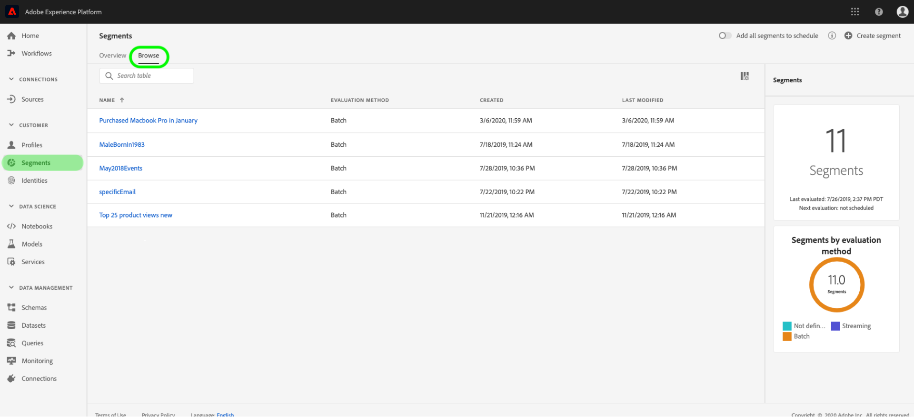

# Entdecken Sie Einblicke in die Kundentechnik.

Die Kundentechnik als Teil von Intelligent Services bietet Marketern die Möglichkeit, Adobe Sensei zu nutzen, um vorherzusehen, was Ihre Kunden als Nächstes tun werden. Customer AI wird verwendet, um für einzelne Profile skaliert benutzerdefinierte Tendenzwerte wie Abwanderung und Konversion zu berechnen. Das ist möglich, ohne dass die geschäftlichen Anforderungen in eine Aufgabe für maschinelles Lernen umgewandelt werden müssen, indem ein Algorithmus, ein Training oder eine Implementierung ausgewählt wird.

Dieses Dokument dient als Leitfaden für die Interaktion mit Dienstinstanzinformationen in der Benutzeroberfläche der Intelligent Services Customer AI.

## Erste Schritte

Um Einblicke in die Kundenaktivität zu erhalten, benötigen Sie eine Dienstinstanz mit einem erfolgreichen Ausführungsstatus. Um eine neue Dienstinstanz zu erstellen, besuchen Sie [Konfigurieren einer Kunden-AI-Instanz](./configure.md). Wenn Sie kürzlich eine Dienstinstanz erstellt haben und diese sich noch in der Trainings- und Bewertungsphase befindet, warten Sie bitte 24 Stunden, bis sie fertig ist.

## Übersicht über die Dienstinstanzen

Klicken Sie in der Benutzeroberfläche [!DNL Adobe Experience Platform] in der linken Navigation auf **[!UICONTROL Dienste]**. Der *Dienste*-Browser wird geöffnet und zeigt verfügbare Intelligent Services an. Klicken Sie im Container für Customer AI auf **[!UICONTROL Öffnen]**.

Die Seite zum Kundendienst wird angezeigt. Auf dieser Seite werden Dienstinstanzen der Kunden-API Liste und Informationen zu diesen Instanzen, einschließlich Instanzname, Tendenztyp, Häufigkeit der Ausführung der Instanz und Status der letzten Aktualisierung, angezeigt.

>[!NOTE]
>
>Nur Dienstinstanzen, die erfolgreiche Testläufe abgeschlossen haben, haben Einblicke.

Wählen Sie einen Dienstinstanznamen aus, der beginnen soll.

Als Nächstes wird die Einblicke-Seite für diese Dienstinstanz mit der Option **[!UICONTROL Neueste Ergebnisse]** oder **[!UICONTROL Leistungszusammenfassung]** angezeigt. Die Standardregisterkarte **[!UICONTROL Neueste Ergebnisse]** enthält Visualisierungen Ihrer Daten. Die Visualisierungen und die Möglichkeiten, die Sie mit den Daten haben, werden in diesem Handbuch ausführlicher erläutert.

Die Registerkarte **[!UICONTROL Leistungszusammenfassung]** zeigt die tatsächlichen Konversionsraten für jeden Tendenzbehälter an. Weitere Informationen finden Sie im Abschnitt [Metriken zur Leistungszusammenfassung](#performance-metrics).

### Details zur Dienstinstanz

Es gibt zwei Möglichkeiten, Dienstinstanzdetails Ansicht: aus dem Dashboard oder innerhalb der Dienstinstanz.

Um eine Übersicht über die Details der Dienstinstanz im Dashboard Ansicht, wählen Sie einen Dienstinstanz-Container aus, wobei der mit dem Namen verknüpfte Hyperlink vermieden werden soll. Dadurch wird eine rechte Leiste mit weiteren Details geöffnet. Die Steuerelemente enthalten Folgendes:

- **[!UICONTROL Bearbeiten]**: Durch Auswahl von  **** Bearbeiten können Sie eine vorhandene Dienstinstanz ändern. Sie können den Namen, die Beschreibung und die Bewertungsfrequenz der Instanz bearbeiten.
- **[!UICONTROL Klonen]**: Durch Auswahl von  **** Clonecopies wird die derzeit ausgewählte Dienstinstanz, die eingerichtet ist, kopiert. Anschließend können Sie den Workflow ändern, um kleinere Änderungen vorzunehmen und ihn als neue Instanz umzubenennen.
- **[!UICONTROL Löschen]**: Sie können eine Dienstinstanz einschließlich aller historischen Ausführung löschen.
- **[!UICONTROL Datenquelle]**: Ein Link zum Datensatz, der von dieser Instanz verwendet wird.
- **[!UICONTROL Ausführungsfrequenz]**: Wie oft und wann eine Punktwertung stattfindet.
- **[!UICONTROL Score-Definition]**: Eine schnelle Übersicht über das Ziel, das Sie für diese Instanz konfiguriert haben.

>[!NOTE]
>
>In dem Ereignis, dass eine Bewertungsausführung fehlschlägt, wird eine Fehlermeldung angezeigt. Die Fehlermeldung wird unter **Letzte Ausführungsdetails** in der rechten Leiste aufgelistet, die nur für fehlgeschlagene Ausführung sichtbar ist.

Die zweite Möglichkeit zur Ansicht zusätzlicher Details für eine Dienstinstanz befindet sich auf der Einblicke-Seite. Sie können oben rechts auf **[!UICONTROL Mehr anzeigen klicken, um eine Dropdown-Liste auszufüllen.]** Details werden aufgelistet, wie die Score-Definition, der Erstellungszeitpunkt und der Tendenztyp. Weitere Informationen zu den aufgelisteten Eigenschaften finden Sie unter [Konfigurieren einer Kunden-AI-Instanz](./configure.md).

### Bearbeiten einer Instanz

Um eine Instanz zu bearbeiten, klicken Sie in oben rechts in der Navigation auf **[!UICONTROL Bearbeiten]**.

Das Dialogfeld &quot;Bearbeiten&quot;wird angezeigt, in dem Sie den Namen, die Beschreibung, den Status und die Bewertungsfrequenz der Instanz bearbeiten können. Um Ihre Änderungen zu bestätigen und das Dialogfeld zu schließen, wählen Sie **[!UICONTROL Speichern]** in der unteren rechten Ecke aus.

### Mehr Aktionen

Die Schaltfläche **[!UICONTROL Mehr Aktionen]** befindet sich in der oberen rechten Navigation neben **[!UICONTROL Bearbeiten]**. Wenn Sie auf **[!UICONTROL Mehr Aktionen]** klicken, wird ein Dropdown-Menü geöffnet, in dem Sie eine der folgenden Vorgänge auswählen können:

- **[!UICONTROL Klonen]**: Wenn Sie  **** Clonecopies auswählen, wird die Dienstinstanz eingerichtet. Anschließend können Sie den Workflow ändern, um kleinere Änderungen vorzunehmen und ihn als neue Instanz umzubenennen.
- **[!UICONTROL Löschen]**: Löscht die Instanz.
- **[!UICONTROL Zugangsdaten]**: Durch Auswahl von  **[!UICONTROL Zugriffs-]** Scores wird ein Dialogfeld geöffnet, das einen Link zu den  [Download-Ergebnissen für das Customer ](./download-scores.md) AItutorial enthält. Außerdem enthält das Dialogfeld die Dataset-ID, die zum Aufrufen von API-Aufrufen erforderlich ist.
- **[!UICONTROL Ansicht-Ausführungsverlauf]**: Ein Dialogfeld mit einer Liste aller mit der Dienstinstanz verknüpften Bewertungsläufe wird angezeigt.

## Bewertungszusammenfassung {#scoring-summary}

Die Bewertungszusammenfassung zeigt die Gesamtanzahl der bewerteten Profil an und kategorisiert sie in Behälter mit hoher, mittlerer und niedriger Tendenz. Die Tendenzbehälter werden basierend auf dem Ergebnisbereich bestimmt, niedrig ist weniger als 24, mittel ist 25 bis 74 und hoch ist über 74. Jeder Behälter hat eine Farbe, die der Legende entspricht.

>[!NOTE]
>
>Wenn es sich um einen Umrechnungsneigungswert handelt, werden die hohen Werte grün und die niedrigen Werte rot angezeigt. Wenn Sie die Kürbisneigung vorhersagen, wird diese umgedreht, die hohen Werte sind in Rot und die niedrigen Werte sind grün. Der mittlere Eimer bleibt gelb, unabhängig vom gewählten Tendenztyp.

Wenn Sie den Mauszeiger über eine beliebige Farbe auf dem Ring halten, werden zusätzliche Informationen wie die prozentuale und die Gesamtanzahl der Profil, die zu einem Behälter gehören, Ansicht.

## Verteilung der Ergebnisse

Die Karte **[!UICONTROL Verteilung der Ergebnisse]** gibt Ihnen eine visuelle Zusammenfassung der Population basierend auf dem Ergebnis. Die Farben, die Sie auf der Karte [!UICONTROL Verteilung der Ergebnisse] sehen, stellen den Typ des generierten Tendenzwerts dar. Wenn Sie den Mauszeiger über eine der Scoring-Distributionen bewegen, erhalten Sie die exakte Anzahl, die zu dieser Distribution gehört.

## Einflussfaktoren

Für jeden Ergebnisbehälter wird eine Karte generiert, die die 10 wichtigsten Einflussfaktoren für diesen Behälter anzeigt. Die einflussreichen Faktoren geben Ihnen zusätzliche Informationen darüber, warum Ihre Kunden zu verschiedenen Ergebnisbehältern gehören.

### Abdrillen von Einflussfaktoren

Wenn Sie den Mauszeiger über einen der wichtigsten einflussreichsten Faktoren bewegen, werden die Daten weiter aufgeschlüsselt. Sie erhalten einen Überblick darüber, warum bestimmte Profil zu einem Tendenzbehälter gehören. Je nach Faktor können Sie Zahlenwerte, kategorische oder boolesche Werte erhalten. Im folgenden Beispiel werden kategorische Werte nach Region angezeigt.

Darüber hinaus können Sie mithilfe von Drilldowns einen Verteilungsfaktor vergleichen, wenn er in zwei oder mehr Tendenzbehältern auftritt, und spezifischere Segmente mit diesen Werten erstellen. Im folgenden Beispiel wird der erste Verwendungsfall veranschaulicht:

Sie können sehen, dass Profil mit geringer Tendenz zur Konvertierung weniger häufig die Websites adobe.com besucht haben. Der Faktor &quot;Tage seit dem letzten WebVisit&quot;deckt nur 8% ab, verglichen mit 26% in mittelständischen Profilen. Mithilfe dieser Zahlen können Sie die Verteilung innerhalb der Behälter für den Faktor vergleichen. Diese Informationen können verwendet werden, um zu erkennen, dass die Neuigkeit im Webvisit nicht so einflussreich im Bucket mit niedriger Tendenz ist, wie es in der Gruppe mit mittlerer Tendenz der Fall ist.

### Erstellen eines Segments

Durch Auswahl der Schaltfläche **[!UICONTROL Segment]** erstellen in einer der Behälter für niedrige, mittlere und hohe Tendenz werden Sie zum Segmentaufbau weitergeleitet.

>[!NOTE]
>
>Die Schaltfläche **[!UICONTROL Segment erstellen]** ist nur verfügbar, wenn das Kundensegment in Echtzeit für den Datensatz aktiviert ist. Weitere Informationen zur Aktivierung des Echtzeit-Kundenprofils finden Sie unter [Überblick über das Echtzeit-Profil](../../../rtcdp/overview.md).

Mit dem Segmentaufbau wird ein Segment definiert. Wenn Sie auf der Seite &quot;Einblicke&quot;die Option **[!UICONTROL Segment erstellen]** auswählen, fügt die Kunden-API dem Segment automatisch die ausgewählten Behälterinformationen hinzu. Um das Erstellen des Segments abzuschließen, füllen Sie einfach die Container *Name* und *Beschreibung* in der rechten Leiste der Segment Builder-Benutzeroberfläche aus. Nachdem Sie dem Segment einen Namen und eine Beschreibung gegeben haben, klicken Sie oben rechts auf **[!UICONTROL Speichern]**.

>[!NOTE]
>
>Da die Tendenzwerte in das jeweilige Profil geschrieben werden, sind sie wie alle anderen Segmentattribute im Segmentaufbau verfügbar. Wenn Sie zum Segmentaufbau navigieren, um neue Segmente zu erstellen, können Sie alle verschiedenen Tendenzwerte unter Ihrer Namensraum Customer AI sehen.

Um Ihr neues Segment in der Plattform-Benutzeroberfläche Ansicht, klicken Sie im linken Navigationsbereich auf **[!UICONTROL Segmente]**. Die Seite **[!UICONTROL Durchsuchen]** wird angezeigt und zeigt alle verfügbaren Segmente an.

## Metriken zur Leistungszusammenfassung {#performance-metrics}

Die Registerkarte **[!UICONTROL Leistungszusammenfassung]** zeigt die tatsächlichen Konversionsraten, aufgeteilt in die von der Kunden-API erfassten Tendenzbehälter.

Zunächst werden nur die erwarteten Raten (gepunktete Linien) angezeigt. Die erwarteten Raten werden angezeigt, wenn keine Bewertungsausführung stattgefunden hat und noch keine Daten verfügbar sind. Sobald jedoch ein Ergebnisfenster abgelaufen ist, wird die erwartete Rate durch eine tatsächliche Rate (feste Linie) ersetzt.

Wenn Sie den Mauszeiger über die Zeilen bewegen, werden das Datum und die tatsächliche/erwartete Rate für diesen Tag in diesem Behälter angezeigt.

Sie können den Zeitrahmen für die angezeigten erwarteten und tatsächlichen Raten filtern. Wählen Sie das Symbol **Kalender**  Die Ergebnisse in den einzelnen Behältern werden aktualisiert, um innerhalb des neuen Datumsbereichs angezeigt zu werden.

### Einzelne Bewertungslaufraten

In der unteren Hälfte der Registerkarte **[!UICONTROL Leistungszusammenfassung]** werden die Ergebnisse für jeden einzelnen Bewertungsvorgang angezeigt. Wählen Sie das Dropdown-Datum oben rechts aus, um die Ergebnisse für einen anderen Bewertungslauf anzuzeigen.

Abhängig davon, ob Sie eine Kehrtwende oder Konvertierung vorhersagen, zeigt das Diagramm [!UICONTROL Verteilung der Ergebnisse] die Verteilung der Profil an, die in jeder Inkrementierung gedreht/konvertiert und nicht gedreht/nicht konvertiert wurden.

## Nächste Schritte

In diesem Dokument werden die Einblicke einer Instanz des Kundenservice erläutert. Sie können nun das Tutorial zum Herunterladen von Punktzahlen in Customer AI](./download-scores.md) oder die anderen [Adobe Intelligent Services](../../home.md)-Leitfäden, die angeboten werden, fortsetzen.[

## Zusätzliche Ressourcen

In dem folgenden Video wird erläutert, wie die KUNDENKI verwendet werden kann, um die Ausgabe der Modelle und einflussreichen Faktoren zu sehen.

>[!VIDEO](https://video.tv.adobe.com/v/32666?learn=on&quality=12)
