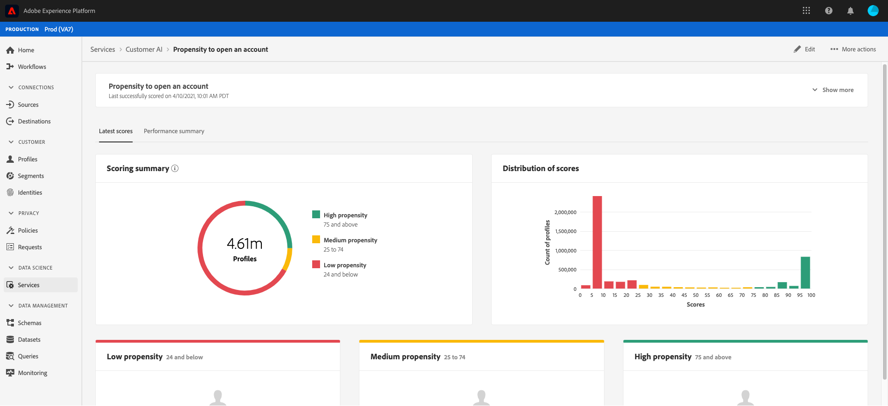

# Einblicke in die Kundentechnik

Die Kundentechnik als Teil von Intelligent Services bietet Marketingexperten die Möglichkeit, Adobe Sensei zu nutzen, um zu bestimmen, was Ihre Kunden als Nächstes tun werden. Customer AI wird verwendet, um für einzelne Profile skaliert benutzerdefinierte Tendenzwerte wie Abwanderung und Konversion zu berechnen. Das ist möglich, ohne dass die geschäftlichen Anforderungen in eine Aufgabe für maschinelles Lernen umgewandelt werden müssen, indem ein Algorithmus, ein Training oder eine Implementierung ausgewählt wird.

Dieses Dokument dient als Leitfaden für die Interaktion mit Dienstinstanzinformationen in der Benutzeroberfläche der Intelligent Services Customer AI.

## Erste Schritte

Um Einblicke in die Kundenaktivität zu erhalten, benötigen Sie eine Dienstinstanz mit einem erfolgreichen Ausführungsstatus. Um eine neue Dienstinstanz zu erstellen, besuchen Sie [Konfigurieren einer Kunden-AI-Instanz](./configure.md). Wenn Sie kürzlich eine Dienstinstanz erstellt haben und sie weiterhin trainiert und bewertet wird, erlauben Sie bitte 24 Stunden, damit sie ausgeführt werden kann.

## Übersicht über die Dienstinstanzen

In the [!DNL Adobe Experience Platform] UI, click **[!UICONTROL Services]** in the left navigation. Der *Dienste* -Browser wird angezeigt und zeigt verfügbare intelligente Dienste an. Klicken Sie im Container für Customer AI auf **[!UICONTROL Öffnen]**.

Die Seite zum Kundendienst wird angezeigt. Auf dieser Seite werden Dienstinstanzen der Kunden-API Liste und Informationen zu diesen Instanzen, einschließlich Instanzname, Tendenztyp, Häufigkeit der Ausführung der Instanz und Status der letzten Aktualisierung, angezeigt.

>[!NOTE] Nur Dienstinstanzen, die erfolgreiche Testläufe abgeschlossen haben, haben Einblicke.

Klicken Sie auf einen Dienstinstanznamen, um zu beginnen.

Als Nächstes wird die Einblicke-Seite für diese Dienstinstanz angezeigt, auf der Sie Visualisierungen Ihrer Daten erhalten. Die Visualisierungen und die Möglichkeiten, die Sie mit den Daten haben, werden in diesem Handbuch ausführlicher erläutert.

### Details zur Dienstinstanz

Es gibt zwei Möglichkeiten, Dienstinstanzdetails Ansicht: Die erste stammt aus dem Dashboard und die zweite aus der Dienstinstanz.

Klicken Sie zur Ansicht von Details innerhalb des Dashboards auf einen Dienstinstanz-Container, um den Hyperlink zu vermeiden, der mit dem Namen verknüpft ist. Dadurch wird eine rechte Leiste geöffnet, die zusätzliche Details wie Beschreibung, Bewertungsfrequenz, Prognoseziel und förderfähige Bevölkerung enthält. Darüber hinaus können Sie die Instanz bearbeiten und löschen, indem Sie auf **[!UICONTROL Bearbeiten]** oder **[!UICONTROL Löschen]** klicken.

>[!NOTE] In dem Ereignis, dass eine Bewertungsausführung fehlschlägt, wird eine Fehlermeldung angezeigt. Die Fehlermeldung wird unter *Letzte Ausführung Details* in der rechten Leiste aufgeführt, die nur für fehlgeschlagene Ausführung sichtbar ist.

Die zweite Möglichkeit zur Ansicht zusätzlicher Details für eine Dienstinstanz befindet sich auf der Einblicke-Seite. Sie können oben rechts auf Mehr **** anzeigen klicken, um eine Dropdown-Liste auszufüllen. Details werden aufgelistet, wie die Score-Definition, der Erstellungszeitpunkt und der Tendenztyp. Weitere Informationen zu den aufgelisteten Eigenschaften finden Sie unter [Konfigurieren einer Kunden-AI-Instanz](./configure.md).

### Bearbeiten einer Instanz

Um eine Instanz zu bearbeiten, klicken Sie in der Navigation oben rechts auf **[!UICONTROL Bearbeiten]** .

Das Dialogfeld &quot;Bearbeiten&quot;wird angezeigt, in dem Sie die *Beschreibung* und die *Bewertungshäufigkeit* der Instanz bearbeiten können. Um die Änderungen zu bestätigen und das Dialogfeld zu schließen, klicken Sie unten rechts auf **[!UICONTROL Bearbeiten]** .

### Weitere Aktionen

Die Schaltfläche &quot; **[!UICONTROL Mehr Aktionen]** &quot;befindet sich in der oberen rechten Navigation neben **[!UICONTROL Bearbeiten]**. Wenn Sie auf **[!UICONTROL Mehr Aktionen]** klicken, wird ein Dropdown-Menü geöffnet, in dem Sie eine der folgenden Vorgänge auswählen können:

- **[!UICONTROL Löschen]**: Löscht die Instanz.
- **[!UICONTROL Zugangsdaten]**: Durch Klicken auf *Zugriffsergebnisse* wird ein Dialogfeld geöffnet, das einen Link zu den [Download-Ergebnissen für das Tutorial zur Kundenwerbung](./download-scores.md) enthält. Außerdem enthält das Dialogfeld die Dataset-ID, die zum Aufrufen von API-Aufrufen erforderlich ist.
- **[!UICONTROL Ansicht-Ausführungsverlauf]**: Ein Dialogfeld mit einer Liste aller mit der Dienstinstanz verknüpften Bewertungsläufe wird angezeigt.

## Bewertungszusammenfassung {#scoring-summary}

Die Bewertungszusammenfassung zeigt die Gesamtanzahl der bewerteten Profil an und kategorisiert sie in Behälter mit hoher, mittlerer und niedriger Tendenz. Die Tendenzbehälter werden basierend auf dem Ergebnisbereich bestimmt, niedrig ist weniger als 24, mittel ist 25 bis 74 und hoch ist über 74. Jeder Behälter hat eine Farbe, die der Legende entspricht.

>[!NOTE] Wenn es sich um einen Umrechnungsneigungswert handelt, werden die hohen Werte grün und die niedrigen Werte rot angezeigt. Wenn Sie die Kürbisneigung vorhersagen, wird diese umgedreht, die hohen Werte sind in Rot und die niedrigen Werte sind grün. Der mittlere Eimer bleibt gelb, unabhängig vom gewählten Tendenztyp.

## Verteilung der Ergebnisse

Die Karte *Verteilung der Ergebnisse* gibt Ihnen eine visuelle Zusammenfassung der Population, die auf dem Ergebnis basiert. Die Farben, die Sie in der Karte *Verteilung der Ergebnisse* sehen, stellen die Art des generierten Tendenzwerts dar.

## Einflussfaktoren

Für jeden Ergebnisbehälter wird eine Karte generiert, die die 10 wichtigsten Einflussfaktoren für diesen Behälter anzeigt. Die einflussreichen Faktoren geben Ihnen zusätzliche Informationen darüber, warum Ihre Kunden zu verschiedenen Ergebnisbehältern gehören.

### Segment erstellen

Durch Klicken auf die Schaltfläche Segment **** erstellen in einer der Behälter für niedrige, mittlere und hohe Tendenz werden Sie zum Segmentaufbau weitergeleitet.

>[!NOTE]
>Die Schaltfläche &quot;Segment **** erstellen&quot;ist nur verfügbar, wenn für den Datensatz das Kundenkonto in Echtzeit aktiviert ist. Weitere Informationen zur Aktivierung von Echtzeit-Kundendaten finden Sie in der Übersicht über das [Echtzeit-Profil](../../../rtcdp/overview.md).

Mit dem Segmentaufbau wird ein Segment definiert. Wenn Sie auf der Seite &quot;Einblicke&quot;die Option Segment **** erstellen auswählen, fügt die Kunden-API dem Segment automatisch die ausgewählten Behälterinformationen hinzu. Füllen Sie zum Abschluss der Segmenterstellung einfach die Container *Name* und *Beschreibung* in der rechten Leiste der Segment Builder-Benutzeroberfläche aus. Nachdem Sie dem Segment einen Namen und eine Beschreibung gegeben haben, klicken Sie oben rechts auf **[!UICONTROL Speichern]** .

>!![NOTE] Da die Tendenzwerte in das jeweilige Profil geschrieben werden, sind sie wie alle anderen Segmentattribute im Segmentaufbau verfügbar. Wenn Sie zum Segmentaufbau navigieren, um neue Segmente zu erstellen, können Sie alle verschiedenen Tendenzwerte unter Ihrer Namensraum Customer AI sehen.

Um Ihr neues Segment in der Plattform-Benutzeroberfläche Ansicht, klicken Sie im linken Navigationsbereich auf **[!UICONTROL Segmente]** . Die Seite &quot; *Durchsuchen* &quot;wird angezeigt und zeigt alle verfügbaren Segmente an.

## Nächste Schritte

In diesem Dokument werden die Einblicke einer Instanz des Kundenservice erläutert. Sie können jetzt das Tutorial zum [Herunterladen von Punktzahlen in der Kundenaktivität](./download-scores.md) fortsetzen oder die anderen [Adobe Intelligent Services](../../home.md) -Handbücher durchsuchen, die angeboten werden.

## Zusätzliche Ressourcen

In dem folgenden Video wird erläutert, wie die KUNDENKI verwendet werden kann, um die Ausgabe der Modelle und einflussreichen Faktoren zu sehen.

>[!VIDEO](https://video.tv.adobe.com/v/32666?learn=on&quality=12)