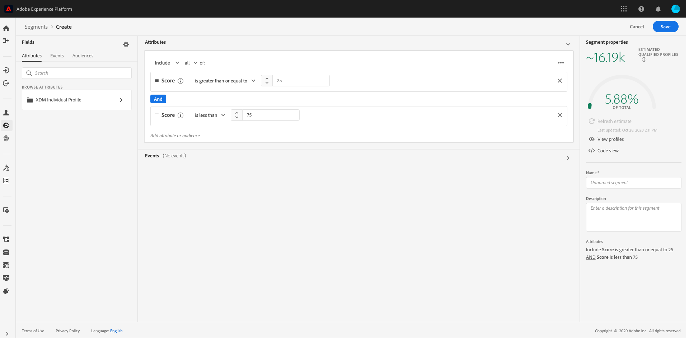

# Einblicke mit Kunden-KI gewinnen

Kunden-KI als Teil von Intelligent Services bietet Marketing-Experten die Möglichkeit, Adobe Sensei zu nutzen, um vorherzusagen, was Ihre Kunden als Nächstes tun werden. Customer AI wird verwendet, um für einzelne Profile skaliert benutzerdefinierte Tendenzwerte wie Abwanderung und Konversion zu berechnen. Das ist möglich, ohne dass die geschäftlichen Anforderungen in eine Aufgabe für maschinelles Lernen umgewandelt werden müssen, indem ein Algorithmus, ein Training oder eine Bereitstellung ausgewählt wird.

Dieses Dokument dient als Anleitung für die Interaktion mit Einblicken in Service-Instanzen in der Benutzeroberfläche der Intelligent Services-Kunden-KI.

## Erste Schritte

Um Insights für Kunden-KI nutzen zu können, benötigen Sie eine Service-Instanz mit dem Status Erfolgreicher Durchlauf . Um eine neue Service-Instanz zu erstellen, besuchen Sie [Konfigurieren einer Kunden-KI-Instanz](./configure.md). Wenn Sie kürzlich eine Dienstinstanz erstellt haben und diese sich noch in der Trainings- und Bewertungsphase befindet, warten Sie bitte 24 Stunden, bis sie fertig ist.

## Service-Instanz - Übersicht

Wählen Sie in der [!DNL Adobe Experience Platform]-Benutzeroberfläche **[!UICONTROL Dienste]** im linken Navigationsbereich aus. Der *Services*-Browser wird angezeigt und zeigt verfügbare Intelligent Services an. Wählen Sie im Container für Kunden-KI **[!UICONTROL Öffnen]** aus.

Die Seite Kunden-KI-Service wird angezeigt. Auf dieser Seite werden Service-Instanzen von Kunden-KI aufgelistet und Informationen zu ihnen angezeigt, einschließlich des Namens der Instanz, des Neigungstyps, der Häufigkeit der Ausführung der Instanz und des Status der letzten Aktualisierung.

>[!NOTE]
>
>Nur Service-Instanzen, die erfolgreiche Bewertungsdurchgänge abgeschlossen haben, verfügen über Einblicke.

Wählen Sie einen Namen für die Service-Instanz aus, um zu beginnen.

Als Nächstes wird die Insights-Seite für diese Service-Instanz mit der Option angezeigt, &quot;**[!UICONTROL Scores“]** &quot;**[!UICONTROL &quot;]**. Die Standardregisterkarte **[!UICONTROL Letzte Bewertungen]** enthält Visualisierungen Ihrer Daten. Die Visualisierungen und die Möglichkeiten, die Sie mit den Daten haben, werden in diesem Handbuch ausführlicher erläutert.

Die Registerkarte **[!UICONTROL Leistungszusammenfassung]** zeigt die tatsächlichen Abwanderungs- oder Konversionsraten für jeden Neigungs-Bucket an. Weitere Informationen finden Sie im Abschnitt zu [Leistungszusammenfassungsmetriken](#performance-metrics).

## Details zur Dienstinstanz

Es gibt zwei Möglichkeiten, Details einer Service-Instanz anzuzeigen: im Dashboard oder innerhalb der Service-Instanz.

### Dashboard der Dienstinstanz

Um einen Überblick über die Details der Service-Instanz im Dashboard zu erhalten, wählen Sie einen Service-Instanz-Container aus und vermeiden Sie so den Hyperlink, der an den Namen angehängt ist. Dadurch wird eine rechte Leiste geöffnet, die zusätzliche Details bereitstellt. Die Steuerelemente enthalten Folgendes:

- **[!UICONTROL Bearbeiten]**: Wenn Sie **[!UICONTROL Bearbeiten]** auswählen, können Sie eine vorhandene Service-Instanz ändern. Sie können den Namen, die Beschreibung und die Bewertungsfrequenz der Instanz bearbeiten.
- **[!UICONTROL Klonen]**: Wenn Sie **[!UICONTROL Klonen]** auswählen, wird die aktuell ausgewählte Service-Instanz kopiert. Anschließend können Sie den Workflow ändern, um kleinere Anpassungen vorzunehmen, und ihn in eine neue Instanz umbenennen.
- **[!UICONTROL Löschen]**: Sie können eine Service-Instanz löschen, einschließlich aller historischen Ausführungen.
- **[!UICONTROL Datenquelle]**: Ein Link zu dem von dieser Instanz verwendeten Datensatz.
- **[!UICONTROL Ausführungshäufigkeit]**: Wie oft und wann ein Scoring-Durchgang stattfindet.
- **[!UICONTROL Score-Definition]**: Ein kurzer Überblick über das Ziel, das Sie für diese Instanz konfiguriert haben.

>[!NOTE]
>
>Schlägt ein Scoring-Durchgang fehl, wird eine Fehlermeldung angezeigt. Die Fehlermeldung wird in der rechten Leiste unter **Details des letzten Durchgangs** aufgeführt, die nur für fehlgeschlagene Durchgänge sichtbar ist.

### Dropdown „Weitere Einblicke“ anzeigen

Die zweite Möglichkeit, zusätzliche Details für eine Service-Instanz anzuzeigen, befindet sich auf der Insights-Seite. Wählen Sie **[!UICONTROL Mehr anzeigen]** oben rechts aus, um eine Dropdown-Liste zu füllen. Es werden Details wie die Score-Definition, der Zeitpunkt ihrer Erstellung, der Neigungstyp und die verwendeten Datensätze aufgeführt. Weitere Informationen zu den aufgeführten Eigenschaften finden Sie unter [Konfigurieren einer Kunden-KI-Instanz](./configure.md).

### Popover für die Vorschau eines Kunden-KI-Datensatzes

Wenn Kunden-KI mehr als einen Datensatz verwendet, wird ein Hyperlink mit der Bezeichnung **[!UICONTROL Mehrere]** gefolgt von der Anzahl der Datensätze in Klammern `()` bereitgestellt.

Wenn Sie den Link Mehrere Datensätze auswählen, wird das Popup für die Datensatzvorschau in der Kundinnen- und Kunden-KI geöffnet. Jede Farbe in der Vorschau stellt einen Datensatz dar, wie durch den Farbschlüssel links neben den Datensatzspalten angezeigt. In diesem Beispiel sehen Sie, dass nur **Datensatz 1** die `PROP1` enthält.

### Bearbeiten einer Instanz

Um eine Instanz zu bearbeiten, wählen **[!UICONTROL Bearbeiten]** in der oberen rechten Navigationsleiste aus.

Das Dialogfeld „Bearbeiten“ wird angezeigt, in dem Sie den Namen, die Beschreibung, den Status und die Bewertungsfrequenz der Instanz bearbeiten können. Um Ihre Änderungen zu bestätigen und das Dialogfeld zu schließen, wählen **[!UICONTROL in]** rechten unteren Ecke „Speichern“ aus.

### Mehr Aktionen

Die Schaltfläche **[!UICONTROL Mehr Aktionen]** befindet sich in der oberen rechten Navigation neben **[!UICONTROL Bearbeiten]**. Wenn Sie **[!UICONTROL Mehr Aktionen]** auswählen, wird ein Dropdown-Menü geöffnet, in dem Sie einen der folgenden Vorgänge auswählen können:

- **[!UICONTROL Klonen]**: Wenn Sie **[!UICONTROL Klonen]** auswählen, wird die eingerichtete Service-Instanz kopiert. Anschließend können Sie den Workflow ändern, um kleinere Anpassungen vorzunehmen, und ihn in eine neue Instanz umbenennen.
- **[!UICONTROL Löschen]**: Löscht die Instanz.
- **[!UICONTROL Auf Scores zugreifen]**: Wenn Sie **[!UICONTROL Auf Scores zugreifen]** auswählen, wird ein Dialogfeld geöffnet, das einen Link zum Tutorial [Herunterladen von Scores für Kunden-KI](./download-scores.md) bereitstellt. Das Dialogfeld enthält auch die Datensatz-ID, die für API-Aufrufe erforderlich ist.
- **[!UICONTROL Ausführungsverlauf anzeigen]** Ein Dialogfeld mit einer Liste aller mit der Dienstinstanz verbundenen Bewertungsdurchgänge wird angezeigt.

## Bewertungszusammenfassung {#scoring-summary}

Die Scoring-Zusammenfassung zeigt die Gesamtzahl der bewerteten Profile an und kategorisiert sie in Buckets mit hoher, mittlerer und geringer Neigung. Die Tendenz-Buckets werden anhand des Score-Bereichs bestimmt: niedrig ist kleiner als 24, mittel ist 25 bis 74 und hoch ist über 74. Jeder Bucket hat eine der Legende entsprechende Farbe.

>[!NOTE]
>
>Wenn es sich um einen Konversionsneigungs-Score handelt, werden die hohen Werte in grün und die niedrigen Werte in rot angezeigt. Wenn Sie eine Abwanderungsneigung vorhersagen, wird diese umgekehrt. Die Highscores sind rot und die Low Scores grün. Der mittlere Bucket bleibt unabhängig vom ausgewählten Neigungstyp gelb.

Sie können den Mauszeiger über eine beliebige Farbe auf dem Ring bewegen, um zusätzliche Informationen anzuzeigen, z. B. einen Prozentsatz und die Gesamtzahl der Profile, die zu einem Bucket gehören.

## Verteilung der Scores

Die Karte **[!UICONTROL Verteilung der Scores]** bietet eine visuelle Zusammenfassung der Population basierend auf der Bewertung. Die Farben, die Sie auf der Karte [!UICONTROL Verteilung der Scores] sehen, stellen den Typ des generierten Neigungs-Scores dar. Wenn Sie den Mauszeiger über eine der Scoring-Verteilungen bewegen, wird die genaue Anzahl angezeigt, die zu dieser Verteilung gehört.

## Einflussfaktoren

Für jeden Score-Bucket wird eine Karte generiert, die die 10 wichtigsten Einflussfaktoren für diesen Bucket anzeigt. Die Einflussfaktoren geben Ihnen zusätzliche Details darüber, warum Ihre Kunden zu verschiedenen Score-Buckets gehören.

### Drilldowns mit Einflussfaktoren

Wenn Sie den Mauszeiger über einen der wichtigsten Einflussfaktoren bewegen, werden die Daten weiter aufgeschlüsselt. Sie erhalten einen Überblick darüber, warum bestimmte Profile zu einem Neigungs-Bucket gehören. Je nach Faktor können Zahlen, kategoriale oder boolesche Werte angegeben werden. Im folgenden Beispiel werden kategoriale Werte nach Region angezeigt.

Darüber hinaus können Sie mithilfe von Drilldowns einen Verteilungsfaktor vergleichen, wenn er in zwei oder mehr Neigungs-Buckets auftritt, und spezifischere Segmente mit diesen Werten erstellen. Das folgende Beispiel veranschaulicht den ersten Anwendungsfall:

Sie können sehen, dass Profile mit geringer Konversionsneigung mit geringerer Wahrscheinlichkeit kürzlich die Web-Seiten von adobe.com besucht haben. Der Faktor „Tage seit dem letzten WebVisit“ hat eine Abdeckung von nur 8 %, verglichen mit 26 % bei Profilen mit mittlerer Neigung. Mithilfe dieser Zahlen können Sie die Verteilung innerhalb jedes Behälters für den Faktor vergleichen. Diese Informationen können verwendet werden, um darauf zu schließen, dass die Neuigkeit bei WebVisit im Bucket mit niedriger Neigung nicht so einflussreich ist wie im Bucket mit mittlerer Neigung.

### Erstellen eines Segments

Durch Klicken auf **[!UICONTROL Schaltfläche]** Segment erstellen“ in einem der Buckets für niedrige, mittlere und hohe Neigung werden Sie zu Segment Builder weitergeleitet.

>[!NOTE]
>
>Die Schaltfläche **[!UICONTROL Segment erstellen]** ist nur verfügbar, wenn das Echtzeit-Kundenprofil für den Datensatz aktiviert ist. Weitere Informationen zum Aktivieren des Echtzeit-Kundenprofils finden Sie unter [Echtzeit-Kundenprofil - Übersicht](../../../rtcdp/overview.md).

Segment Builder wird zum Definieren eines Segments verwendet. Bei Auswahl von **[!UICONTROL Segment erstellen]** auf der Insights-Seite fügt Kunden-KI die ausgewählten Buckets-Informationen automatisch zum Segment hinzu. Um die Erstellung Ihres Segments abzuschließen, füllen Sie einfach **Container** Name“ und **Beschreibung** aus, die sich in der rechten Leiste der Segment Builder-Benutzeroberfläche befinden. Nachdem Sie dem Segment einen Namen und eine Beschreibung gegeben haben, wählen **[!UICONTROL oben]** die Option „Speichern“ aus.

>[!NOTE]
>
>Da die Neigungs-Scores in das jeweilige Profil geschrieben werden, sind sie im Segment Builder wie alle anderen Profilattribute verfügbar. Wenn Sie zum Segment Builder navigieren, um neue Segmente zu erstellen, können Sie alle verschiedenen Tendenz-Scores unter Ihrem Namespace Customer AI sehen.

Um Ihr neues Segment in der Experience Platform-Benutzeroberfläche anzuzeigen, wählen Sie **[!UICONTROL linken Navigationsbereich]** Segmente“ aus. Die Seite **[!UICONTROL Durchsuchen]** wird angezeigt und zeigt alle verfügbaren Segmente an.

## Historische Leistung {#historical-performance}

Die Registerkarte **[!UICONTROL Leistungszusammenfassung]** zeigt die tatsächlichen Abwanderungs- oder Konversionsraten, aufgeschlüsselt in jeden der von Kunden-KI bewerteten Neigungs-Buckets.

Zunächst werden nur die erwarteten Raten (gestrichelte Linien) angezeigt. Die erwarteten Raten werden angezeigt, wenn kein Scoring-Durchgang stattgefunden hat und noch keine Daten verfügbar sind. Sobald jedoch ein Ergebnisfenster bestanden ist, wird die erwartete Rate durch eine tatsächliche Rate ersetzt (durchgezogene Linie).

Wenn Sie den Mauszeiger über die Zeilen bewegen, werden das Datum und der tatsächliche/erwartete Kurs für diesen Tag in diesem Behälter angezeigt.

Sie können den Zeitrahmen nach den erwarteten und tatsächlichen Raten filtern, die angezeigt werden. Wählen Sie das **Kalendersymbol**  und wählen Sie dann einen neuen Datumsbereich aus. Die Ergebnisse in den einzelnen Buckets werden aktualisiert, sodass sie innerhalb des neuen Datumsbereichs angezeigt werden.

### Individuelle Scoring-Durchlaufraten

Die untere Hälfte der Registerkarte **[!UICONTROL Leistungszusammenfassung]** zeigt die Ergebnisse für jeden einzelnen Scoring-Durchgang an. Wählen Sie oben rechts das Dropdown-Datum aus, um die Ergebnisse für einen anderen Scoring-Durchgang anzuzeigen.

Je nachdem, ob Sie Abwanderung oder Konversion vorhersagen, zeigt das Diagramm [!UICONTROL Verteilung der Scores] die Verteilung der Profile an, die in jedem Inkrement abgewandert/konvertiert und nicht abgewandert/nicht konvertiert sind.

## Modellauswertung {#model-evaluation}

Zusätzlich zur Verfolgung der prognostizierten und tatsächlichen Ergebnisse im Zeitverlauf auf der Registerkarte Historische Leistung können Marketing-Experten mit der Registerkarte Modellbewertung noch mehr Transparenz über die Modellqualität erzielen. Sie können die Diagramme Steigerung und Gewinne verwenden, um die Unterschiede zwischen der Verwendung eines prädiktiven Modells und zufälligem Targeting zu bestimmen. Darüber hinaus können Sie festlegen, wie viele positive Ergebnisse bei jedem Score-Cutoff erfasst würden. Dies ist bei der Segmentierung und für die Abstimmung des ROI mit Marketing-Aktionen nützlich.

### Steigerungsdiagramm

Das Steigerungsdiagramm misst die Verbesserung bei der Verwendung eines prädiktiven Modells anstelle von zufälligem Targeting.

Indikatoren für hochwertige Modelle umfassen:

- Hohe Steigerungswerte in den ersten paar Dezilen. Das bedeutet, dass das Modell gut geeignet ist, um die Benutzer mit der höchsten Neigung zu identifizieren, die gewünschte Aktion durchzuführen.
- Absteigende Steigerungswerte. Dies bedeutet, dass Kunden mit höheren Scores eher die gewünschte Aktion ausführen als Personen mit niedrigeren Scores.

### Gewinndiagramm

Das Diagramm der kumulativen Gewinne misst den Prozentsatz der positiven Ergebnisse, die erfasst werden, wenn Scores oberhalb eines bestimmten Schwellenwerts anvisiert werden. Nachdem Sie die Kundinnen und Kunden nach dem Neigungs-Score von hoch nach niedrig sortiert haben, wird die Population in Dezilen, 10 gleich große Gruppen, aufgeteilt. Ein perfektes Modell würde alle positiven Ergebnisse in den höchsten Score-Dezilen erfassen. Eine Basismethode der zufälligen Zielgruppenbestimmung erfasst positive Ergebnisse proportional zur Größe der Gruppe - bei einer Zielgruppenbestimmung von 30 % der Benutzenden würden 30 % der Ergebnisse erfasst.

Indikatoren für hochwertige Modelle umfassen:

- Die kumulativen Gewinne nähern sich schnell 100%.
- Die Kurve der kumulierten Gewinne für das Modell befindet sich näher an der oberen linken Ecke des Diagramms.
- Das Diagramm für kumulative Gewinne kann verwendet werden, um die Score-Abschläge für Segmentierung und Targeting zu bestimmen. Wenn das Modell beispielsweise 70 % der positiven Ergebnisse in den ersten 2 Score-Dezilen erfasst, wird erwartet, dass beim Targeting von Benutzern mit einem Perzentil-Score > 80 etwa 70 % der positiven Ergebnisse erfasst werden.

### AUC (Fläche unter der Kurve)

Die AUC spiegelt die Stärke der Beziehung zwischen der Rangfolge nach Score und dem Auftreten des prognostizierten Ziels wider. Eine **AUC** von 0,5 bedeutet, dass das Modell nicht besser ist als eine zufällige Schätzung. Eine **AUC** von 1 bedeutet, dass das Modell perfekt vorhersagen kann, wer die entsprechende Aktion ausführen wird.

## Nächste Schritte

In diesem Dokument werden die Einblicke beschrieben, die von einer Kunden-KI-Service-Instanz bereitgestellt werden. Sie können jetzt mit dem Tutorial zum [Herunterladen von Scores in Kunden-KI](./download-scores.md) fortfahren oder die anderen [Adobe Intelligent Services](../../home.md)Handbücher durchsuchen, die angeboten werden.

## Zusätzliche Ressourcen

Im folgenden Video wird erläutert, wie Sie mit Kunden-KI die Ausgabe der Modelle und Einflussfaktoren anzeigen können.

>[!VIDEO](https://video.tv.adobe.com/v/32666?learn=on&quality=12)
