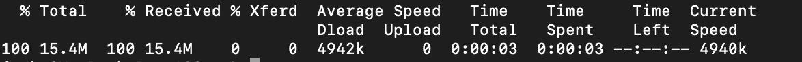

# Herunterladen von Punktzahlen in der Kunden-API

Dieses Dokument dient als Anleitung zum Herunterladen von Punktzahlen für Kunden-KI.

## Erste Schritte

Mit der Kunden-API können Sie Ergebnisse im Parquet-Dateiformat herunterladen. Für dieses Lernprogramm müssen Sie den Abschnitt zum Herunterladen von AI-Bewertungen für Kunden im Handbuch [Erste Schritte](../getting-started.md) gelesen und abgeschlossen haben.

Darüber hinaus müssen Sie eine Dienstinstanz mit einem erfolgreichen Ausführungsstatus zur Verfügung haben, um auf Ergebnisse für Customer AI zugreifen zu können. Um eine neue Dienstinstanz zu erstellen, besuchen Sie [Konfigurieren einer Kunden-AI-Instanz](./configure.md). Wenn Sie kürzlich eine Dienstinstanz erstellt haben und sie weiterhin trainiert und bewertet wird, erlauben Sie bitte 24 Stunden, damit sie ausgeführt werden kann.

Derzeit gibt es zwei Möglichkeiten, Kunden-AI-Bewertungen herunterzuladen:

1. Wenn Sie die Punktzahlen auf der jeweiligen Ebene herunterladen möchten und/oder das Echtzeit-Profil des Kunden nicht aktiviert ist, klicken Sie zum Beginn auf [Suchen Ihrer DataSet-ID](#dataset-id).
2. Wenn Sie Profil aktiviert haben und Segmente herunterladen möchten, die Sie mit der Kundenanfrage konfiguriert haben, navigieren Sie bitte zum [Herunterladen eines Segments, das mit der Kundenanfrage](#segment)konfiguriert wurde.

## Find your dataset ID {#dataset-id}

Klicken Sie in Ihrer Dienstinstanz für Customer AI Insights in der Navigation oben rechts auf das Dropdownmenü *Mehr Aktionen* und wählen Sie **[!UICONTROL Access-Ergebnisse]**.


Es wird ein neues Dialogfeld mit einem Link zur Dokumentation zum Herunterladen von Punktzahlen und der DataSet-ID für Ihre aktuelle Instanz angezeigt. Kopieren Sie die DataSet-ID in die Zwischenablage und fahren Sie mit dem nächsten Schritt fort.


## Ihre Stapel-ID abrufen {#retrieve-your-batch-id}

Wenn Sie Ihre DataSet-ID aus dem vorherigen Schritt verwenden, müssen Sie die Katalog-API aufrufen, um eine Stapel-ID abzurufen. Für diesen API-Aufruf werden zusätzliche Parameter für die Abfrage verwendet, um anstelle einer Liste von Stapeln, die zu Ihrem Unternehmen gehören, den letzten erfolgreichen Batch zurückzugeben. Um weitere Stapel zurückzugeben, erhöhen Sie die Anzahl für den Parameter &quot;Abfrage begrenzen&quot;auf den gewünschten Wert, der zurückgegeben werden soll. Weitere Informationen zu den verfügbaren Parametertypen für die Abfrage finden Sie im Handbuch zum [Filtern von Katalogdaten mithilfe von Abfragen-Parametern](../../../catalog/api/filter-data.md).

**API-Format**

```http
GET /batches?&dataSet={DATASET_ID}&createdClient=acp_foundation_push&status=success&orderBy=desc:created&limit=1
```

| Parameter | Beschreibung |
| --------- | ----------- |
| `{DATASET_ID}` | Die im Dialogfeld &quot;Zugriffszahlen&quot;verfügbare DataSet-ID. |

**Anfrage**

```shell
curl -X GET 'https://platform.adobe.io/data/foundation/catalog/batches?dataSet=5cd9146b31dae914b75f654f&createdClient=acp_foundation_push&status=success&orderBy=desc:created&limit=1' \
  -H 'Authorization: Bearer {ACCESS_TOKEN}' \
  -H 'x-api-key: {API_KEY}' \
  -H 'x-gw-ims-org-id: {IMS_ORG}' \
  -H 'x-sandbox-name: {SANDBOX_NAME}'
```

**Antwort**

Eine erfolgreiche Antwort gibt eine Nutzlast zurück, die ein Batch-ID-Objekt enthält. In diesem Beispiel ist der Schlüsselwert für das zurückgegebene Objekt die Stapel-ID `01E5QSWCAASFQ054FNBKYV6TIQ`. Kopieren Sie Ihre Batch-ID, um sie beim nächsten API-Aufruf zu verwenden.

```json
{
    "01E5QSWCAASFQ054FNBKYV6TIQ": {
        "status": "success",
        "tags": {
            "Tags": [ ... ],
        },
        "relatedObjects": [
            {
                "type": "dataSet",
                "id": "5cd9146b31dae914b75f654f"
            }
        ],
        "id": "01E5QSWCAASFQ054FNBKYV6TIQ",
        "externalId": "01E5QSWCAASFQ054FNBKYV6TIQ",
        "replay": {
            "predecessors": [
                "01E5N7EDQQP4JHJ93M7C3WM5SP"
            ],
            "reason": "Replacing for 2020-04-09",
            "predecessorListingType": "IMMEDIATE"
        },
        "inputFormat": {
            "format": "parquet"
        },
        "imsOrg": "412657965Y566A4A0A495D4A@AdobeOrg",
        "started": 1586715571808,
        "metrics": {
            "partitionCount": 1,
            "outputByteSize": 2380339,
            "inputFileCount": -1,
            "inputByteSize": 2381007,
            "outputRecordCount": 24340,
            "outputFileCount": 1,
            "inputRecordCount": 24340
        },
        "completed": 1586715582735,
        "created": 1586715571217,
        "createdClient": "acp_foundation_push",
        "createdUser": "sensei_exp_attributionai@AdobeID",
        "updatedUser": "acp_foundation_dataTracker@AdobeID",
        "updated": 1586715583582,
        "version": "1.0.5"
    }
}
```

## Abrufen des nächsten API-Aufrufs mit Ihrer Stapel-ID {#retrieve-the-next-api-call-with-your-batch-id}

Sobald Sie über eine Stapel-ID verfügen, können Sie eine neue GET-Anforderung an `/batches`vornehmen. Die Anforderung gibt einen Link zurück, der als nächste API-Anforderung verwendet wird.

**API-Format**

```http
GET batches/{BATCH_ID}/files
```

| Parameter | Beschreibung |
| --------- | ----------- |
| `{BATCH_ID}` | Die im vorherigen Schritt abgerufene Stapel-ID [ruft Ihre Stapel-ID](#retrieve-your-batch-id)ab. |

**Anfrage**

Erstellen Sie mithilfe Ihrer eigenen Stapel-ID die folgende Anforderung.

```shell
curl -X GET 'https://platform.adobe.io/data/foundation/export/batches/035e2520-5e69-11ea-b624-51evfeba55d1/files' \
  -H 'Authorization: Bearer {ACCESS_TOKEN}' \
  -H 'x-api-key: {API_KEY}' \
  -H 'x-gw-ims-org-id: {IMS_ORG}' \
  -H 'x-sandbox-name: {SANDBOX_NAME}'
```

**Antwort**

Eine erfolgreiche Antwort gibt eine Nutzlast zurück, die ein `_links` Objekt enthält. Innerhalb des `_links` Objekts befindet sich ein `href` mit einem neuen API-Aufruf als Wert. Kopieren Sie diesen Wert, um mit dem nächsten Schritt fortzufahren.

```json
{
    "data": [
        {
            "dataSetFileId": "035e2520-5e69-11ea-b624-51ecfeba55d0-1",
            "dataSetViewId": "5e3b2fe3fe4b9f18a8b7a3db",
            "version": "1.0.0",
            "created": "1583361894479",
            "updated": "1583361894479",
            "isValid": false,
            "_links": {
                "self": {
                    "href": "https://platform.adobe.io:443/data/foundation/export/files/035e2520-5e69-11ea-b624-51ecfeba55d0-1"
                }
            }
        }
    ],
    "_page": {
        "limit": 100,
        "count": 1
    }
}
```

## Dateien abrufen {#retrieving-your-files}

Erstellen Sie eine neue GET-Anforderung, um den `href` Wert, den Sie im vorherigen Schritt als API-Aufruf erhalten haben, zum Abrufen des Dateiverzeichnisses zu verwenden.

**API-Format**

```http
GET files/{DATASETFILE_ID}
```

| Parameter | Beschreibung |
| --------- | ----------- |
| `{DATASETFILE_ID}` | Die dataSetFile-ID wird im `href` Wert des [vorherigen Schritts](#retrieve-the-next-api-call-with-your-batch-id)zurückgegeben. Es ist auch im `data` Array unter dem Objekttyp verfügbar `dataSetFileId`. |

**Anfrage**

```shell
curl -X GET 'https://platform.adobe.io:443/data/foundation/export/files/035e2520-5e69-11ea-b624-51ecfeba55d0-1' \
  -H 'Authorization: Bearer {ACCESS_TOKEN}' \
  -H 'x-api-key: {API_KEY}' \
  -H 'x-gw-ims-org-id: {IMS_ORG}' \
  -H 'x-sandbox-name: {SANDBOX_NAME}'
```

**Antwort**

Die Antwort enthält ein Datenarray, das einen einzelnen Eintrag oder eine Liste von Dateien enthalten kann, die zu diesem Ordner gehören. Das folgende Beispiel enthält eine Liste von Dateien und wurde zur Lesbarkeit komprimiert. In diesem Szenario müssen Sie die URL jeder Datei befolgen, um auf die Datei zuzugreifen.

```json
{
    "data": [
        {
            "name": "part-00000-tid-7597930103898538622-a25f1890-efa9-40eb-a2cb-1b378e93d582-528-1-c000.snappy.parquet",
            "length": "16214531",
            "_links": {
                "self": {
                    "href": "https://platform.adobe.io:443/data/foundation/export/files/035e2520-5e69-11ea-b624-51ecfeba55d0-1?path=part-00000-tid-7597930103898538622-a25f1890-efa9-40eb-a2cb-1b378e93d582-528-1-c000.snappy.parquet"
                }
            }
        },
        {
            "name": "...",
            "length": "16235375",
            "_links": {
                "self": {
                    "href": "..."
                }
            }
        }
    ],
    "_page": {
        "limit": 100,
        "count": 100
    },
    "_links": {
        "next": {
            "href": "..."
        },
        "page": {
            "href": "...",
            "templated": true
        }
    }
}
```

| Parameter | Beschreibung |
| --------- | ----------- |
| `_links.self.href` | Die URL der GET-Anforderung, mit der eine Datei in Ihr Verzeichnis heruntergeladen wird. |


Kopieren Sie den `href` Wert für ein beliebiges Dateiobjekt im `data` Array und fahren Sie dann mit dem nächsten Schritt fort.

## Herunterladen der Dateidaten

Um Ihre Dateidaten herunterzuladen, stellen Sie eine GET-Anforderung an den `"href"` Wert, den Sie im vorherigen Schritt beim [Abrufen Ihrer Dateien](#retrieving-your-files)kopiert haben.

>[!NOTE]
>
>Wenn Sie diese Anforderung direkt in der Befehlszeile ausführen, werden Sie möglicherweise aufgefordert, eine Ausgabe nach den Anforderungsheader hinzuzufügen. Im folgenden Anforderungsbeispiel wird `--output {FILENAME.FILETYPE}`.

**API-Format**

```http
GET files/{DATASETFILE_ID}?path={FILE_NAME}
```

| Parameter | Beschreibung |
| --------- | ----------- |
| `{DATASETFILE_ID}` | Die dataSetFile-ID wird im `href` Wert eines [vorherigen Schritts](#retrieve-the-next-api-call-with-your-batch-id)zurückgegeben. |
| `{FILE_NAME}` | Der Name der Datei. |

**Anfrage**

```shell
curl -X GET 'https://platform.adobe.io:443/data/foundation/export/files/035e2520-5e69-11ea-b624-51ecfeba55d0-1?path=part-00000-tid-7597930103898538622-a25f1890-efa9-40eb-a2cb-1b378e93d582-528-1-c000.snappy.parquet' \
  -H 'Authorization: Bearer {ACCESS_TOKEN}' \
  -H 'x-api-key: {API_KEY}' \
  -H 'x-gw-ims-org-id: {IMS_ORG}' \
  -H 'x-sandbox-name: {SANDBOX_NAME}' \
  -O 'filename.parquet'
```

>[!TIP]
>
>Vergewissern Sie sich, dass Sie sich im richtigen Verzeichnis oder Ordner befinden, in dem die Datei gespeichert werden soll, bevor Sie die GET-Anforderung senden.

**Antwort**

Die Antwort lädt die Datei herunter, die Sie im aktuellen Verzeichnis angefordert haben. In diesem Beispiel lautet der Dateiname &quot;filename.parquet&quot;.



## Herunterladen eines Segments, das mit der Kunden-API konfiguriert wurde {#segment}

Alternativ können Sie Ihre Ergebnisdaten herunterladen, indem Sie Ihre Audience in einen Datensatz exportieren. Nachdem ein Segmentierungsauftrag erfolgreich abgeschlossen wurde (der `status` Attributwert &quot;ERFOLGT&quot;ist), können Sie Ihre Audience in ein Dataset exportieren, in dem darauf zugegriffen und darauf reagiert werden kann. Weitere Informationen zur Segmentierung finden Sie in der [Segmentierungsübersicht](../../../segmentation/home.md).

>[!IMPORTANT]
>
>Um diese Methode des Exports zu verwenden, muss das Kundenkonto in Echtzeit für den Datensatz aktiviert werden.

Der Abschnitt zum [Exportieren eines Segments](../../../segmentation/tutorials/evaluate-a-segment.md) im Segmentbewertungshandbuch beschreibt die erforderlichen Schritte zum Exportieren eines Segmentdatasets. Der Leitfaden enthält Beispiele für Folgendes:

- **Erstellen Sie einen Zielgruppe-Datensatz:** Erstellen Sie den Datensatz, der Audiencen enthält.
- **Generieren von Audience-Profilen im Datensatz:** Füllen Sie den Datensatz mit XDM Individuelle Profil basierend auf den Ergebnissen eines Segmentauftrags.
- **Überwachung des Exportfortschritts:** Überprüfen Sie den aktuellen Fortschritt des Exportvorgangs.
- **Audience lesen:** Rufen Sie die resultierenden XDM-Profil für einzelne Mitglieder Ihrer Audience ab.

## Nächste Schritte

In diesem Dokument werden die Schritte beschrieben, die zum Herunterladen von Kunden-AI-Ergebnissen erforderlich sind. Sie können jetzt auch weiterhin die anderen angebotenen [Intelligent Services](../../home.md) und Handbücher durchsuchen.
