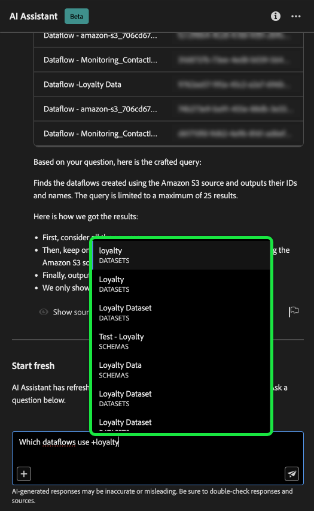

# KI-Assistent für Adobe Experience Platform

>[!NOTE]
>
>Der KI-Assistent für Adobe Experience Platform ist derzeit als Betaversion verfügbar. Die Funktion und die Dokumentation können sich ändern.

Der AI-Assistent ist eine UI-Funktion, mit der Sie in Adobe Experience Platform und Real-time Customer Data Platform navigieren und deren Konzepte und Nutzungsinformationen zu Ihren Objekten verstehen können.

Sie können den AI-Assistenten nach Informationen wie den folgenden abfragen:

* Anleitung zur Durchführung von Aufgaben in Bezug auf Daten und Zielgruppen.
* Status und Metriken der vorhandenen Datenobjekte in Ihrer Organisation.
* Verwenden Sie Fallbeispiele und Nuancen, um Ihre Datenobjekte, einschließlich Attributen, Zielgruppen, Datenflüssen, Datensätzen, Zielen, Schemas und Quellen, besser zu verstehen.

In der folgenden Anleitung erfahren Sie, wie Sie mit dem KI-Assistenten in Experience Platform- und Real-Time CDP-Workflows navigieren und diese verstehen können.

>[!BEGINSHADEBOX]

**Wie wirkt die KI-Assistenzkraft?**

Der KI-Assistent antwortet auf Ihre gestellten Fragen, indem er eine Datenbank abfragt und dann Daten aus der Datenbank in eine für Menschen lesbare Antwort übersetzt.

Diese interne Darstellung der zugrunde liegenden Daten wird auch als Wissensdiagramm bezeichnet - ein umfassendes Netz von Konzepten, Daten und Metadaten für eine gegebene Antwort.

Das Wissensdiagramm besteht aus Unterdiagrammen, die bei jeder Übermittlung von Abfragen referenziert werden:

* Kundenverwendungsdaten.
* Kundenverwendungsdaten aus verschiedenen Meta Stores.
* Experience League.

Vor der Abfrage des AI-Assistenten müssen zwei Frageklassen beachtet werden:

* **Konzeptfragen**: Bei Konzeptfragen geht es um Adobe-Konzepte, die sich auf Daten oder Zielgruppen beziehen. Zu den Beispielen für Konzeptfragen gehören:
   * Was ist der Unterschied zwischen Batch- und Streaming-Segmentierung?
   * Gibt es Datenmodelle der Branche und wie verwende ich sie?
   * Wofür wird Real-Time CDP am besten verwendet?
* **Nutzungsfragen**: Nutzungsfragen beziehen sich auf die Datenobjekte in Ihrem Unternehmen. Beispiele für Nutzungsfragen sind:
   * Wie viele Datensätze habe ich?
   * Wie viele Schemaattribute wurden noch nie verwendet?
   * Welche Zielgruppen wurden aktiviert?

>[!ENDSHADEBOX]

## Ziele, die Sie mit dem KI-Assistenten erreichen können {#objectives}

Sie können den KI-Assistenten für folgende Ziele verwenden:

| Ziel | Beschreibung | Beispiel |
| --- | --- | --- |
| Lernkonzepte und kontinuierliche Workflows | <ul><li>Als neuer Benutzer können Sie mit dem AI-Assistenten Real-Time CDP- und Adobe Journey Optimizer-Konzepte erlernen und sich mit Produkten und Funktionen vertraut machen, mit denen Sie nicht vertraut sind.</li><li>Als erfahrener Benutzer können Sie den AI-Assistenten verwenden, um einen Randfall zu lösen, der Ihren Workflow blockieren könnte. | <ul><li>Wie richte ich ein Dashboard in Journey Analytics ein?</li><li>Erfahren Sie mehr über einige Anwendungsfälle für Real-Time CDP.</li></ul> |
| Fehlerbehebung | Verwenden Sie den KI-Assistenten, um zu erfahren, wie Sie grundlegende Fehler beheben können, die in Ihrem Workflow auftreten können. | <ul><li>Was bewirkt dieser Fehler? {ERROR_MESSAGE} gemein?</li><li>Warum kann ich die Zielgruppe mit dem Namen &quot;Luma: E-Mail-Zielgruppe&quot;nicht löschen?</li></ul> |
| Sandbox-Hygiene | Verwenden Sie den KI-Assistenten, um Duplikate oder nicht verwendete Objekte zu identifizieren, damit Sie Ihre Sandbox effizient verwalten können. | <ul><li>Können Sie mir ähnliche Zielgruppen zeigen?</li><li>Gibt es Schemas, denen kein Datensatz zugeordnet ist?</li></ul> |
| Werteanalyse | Verwenden Sie den KI-Assistenten, um die am häufigsten verwendeten Datenobjekte zu identifizieren und Leistungsindikatoren zu bewerten oder die wertvollsten Datenobjekte zu finden. | <ul><li>Wie viele Profile enthält unsere Segmentdefinition &quot;Luma: E-Mail-Zielgruppe&quot;?</li><li>Wann wurden Zielgruppen für das Experience Cloud Audiences-Ziel aktiviert?</li></ul> |
| Suche | Verwenden Sie den AI-Assistenten, um unterstützte Experience Platform-Objekte wie Zielgruppen, Datensätze, Ziele, Schemas und Quellen zu finden. | <ul><li>Geben Sie die Zielgruppen mit &quot;Luma&quot;im Namen an, die im letzten Quartal erstellt wurden.</li><li>Welche Attribute sind im XDM-Schema &quot;Luma: Benutzerdefinierte Aktionen&quot; enthalten?</li></ul> |
| Folgenabschätzung | Verwenden Sie den KI-Assistenten, um Datenobjekte zu identifizieren, die in bestimmten Workflows verwendet wurden, damit Sie die Auswirkungen von Änderungen bewerten können. | <ul><li>Welche Zielgruppen verwenden `homeAddress.city` im Schema &quot;Luma: PersonProfiles&quot;?</li><li>Welche Datensätze sind die `consents.marketing.push.val` Profilattribut gespeichert in?</li></ul> |

## Zugriff auf den KI-Assistenten in der Experience Platform-Benutzeroberfläche

Um den KI-Assistenten zu starten, wählen Sie die **[!UICONTROL Symbol &quot;KI-Assistent&quot;]** aus der oberen Kopfzeile der Experience Platform-Benutzeroberfläche.

Die Benutzeroberfläche des KI-Assistenten wird angezeigt und stellt Ihnen sofort Informationen zu den ersten Schritten bereit. Sie können die unter [!UICONTROL Erste Schritte] um Fragen und Befehle zu beantworten, z. B.:

* [!UICONTROL Welche meiner Zielgruppen sind aktiviert?]
* [!UICONTROL Was ist ein Schema?]
* [!UICONTROL Erzählen Sie mir einige häufige Anwendungsfälle für Real-Time CDP]

## Handbuch zur Benutzeroberfläche des AI-Assistenten

>[!NOTE]
>
>Der folgende Workflow ist ein Beispiel für die Erstellung eines Erlebnisereignisschemas, um zu veranschaulichen, wie Sie den AI-Assistenten bei Verwendung der Experience Platform-Benutzeroberfläche verwenden können.

Betrachten Sie einen Anwendungsfall, in dem Sie eine **Gerätehandel im Ereignisschema**. Während des Erstellungsprozesses des Erlebnisereignisschemas treffen Sie auf die `eventType` -Feld. &quot;An dieser Stelle haben Sie die Möglichkeit, Ihren Workflow zu beenden, indem Sie auf den Abschnitt [Grundlagen der Schemakomposition](../xdm/schema/composition.md) oder Sie können den AI-Assistenten verwenden, um Antworten auf Ihre Fragen abzurufen und zusätzliche Ressourcen über die Dokumentationslinks zu finden, die von AI Assistant empfohlen werden.&quot;

Geben Sie zunächst Ihre Frage in das bereitgestellte Textfeld ein. Im folgenden Beispiel wird der KI-Assistent mit der Frage konfrontiert: &quot;**Was ist das Feld eventType in einem ExperienceEvent-Schema?**&quot;

AI Assistant fragt dann seine Wissensdatenbank ab und berechnet eine Antwort. Nach einigen Augenblicken gibt der KI-Assistent eine Antwort und entsprechende Vorschläge zurück, die Sie als Aufforderung zur Nachverfolgung verwenden können.

Nach Erhalt einer Antwort des KI-Assistenten können Sie aus einer Reihe von Optionen auswählen, um zu entscheiden, wie Sie vorgehen möchten.

### Funktionen des KI-Assistenten {#features}

In diesem Abschnitt werden die verschiedenen Funktionen des KI-Assistenten beschrieben, die Sie während Ihrer Workflows auf dem Experience Platform verwenden können.

<!-- 
### Save your query {#save-your-query}

+++Select to view an example of how to save a query

To save your query, select the bookmark icon beside your question.

To access your saved queries, select the bookmark icon below the input box, then select the query you would like to run.

+++ -->

### Daten in der Sandbox anzeigen {#view-data-in-your-sandbox}

Je nach Abfrage stellt der KI-Assistent zusätzliche Informationen zu den Daten in Ihrer Sandbox bereit. Um anzuzeigen, wie die Antwort auf Ihre Abfrage auf Ihre jeweilige Sandbox zutrifft, wählen Sie **[!UICONTROL In der Sandbox].**

Beim Anzeigen von Daten zu Ihrer Sandbox kann der KI-Assistent direkte Links zu bestimmten Benutzeroberflächen-Seiten bereitstellen, auf denen Ihre abgefragten Daten angezeigt werden.

+++Auswählen zum Anzeigen des Beispiels

In diesem Beispiel gibt der KI-Assistent zusätzliche Informationen zu den vorhandenen XDM-Schemas in Ihrer Sandbox zurück, einschließlich der Gesamtzahl der Schemas und der fünf am häufigsten verwendeten Felder.

+++

### Zitate anzeigen {#view-citations}

Sie können die von AI Assistant an Sie zurückgegebenen Antworten überprüfen, indem Sie die mit jeder Antwort verfügbaren Zitate überprüfen.

+++Auswählen , um ein Beispiel für die Anzeige von Quellen anzuzeigen

Um Zitate anzuzeigen und die Antwort der KI-Assistenzkraft zu validieren, wählen Sie **[!UICONTROL Quellen anzeigen]**.

Der AI-Assistent aktualisiert die Benutzeroberfläche und bietet Ihnen Links zur Dokumentation, die die ursprüngliche Antwort bestätigen. Wenn Zitate aktiviert sind, aktualisiert der KI-Assistent die Antwort dahingehend, dass er Fußnoten enthält, die die spezifischen Teile der Antwort angeben, die auf die bereitgestellte Dokumentation verweisen.

Sie können auch die Abfragen verwenden, die der AI-Assistent unter **[!UICONTROL Verwandte Vorschläge]** , um die Themen zu Ihrer ursprünglichen Abfrage weiter zu untersuchen.

+++

### Nutzungsdaten und Visualisierung {#usage-data-and-visualization}

Sie müssen sich in einer aktiven Sandbox befinden, damit der KI-Assistent ausreichend auf eine Frage zu Ihren Nutzungsdaten antworten kann.

+++Auswählen , um ein Beispiel für Nutzungsdatenfragen und Datenvisualisierung anzuzeigen

Im folgenden Beispiel wird der KI-Assistent mit der folgenden Abfrage gefragt: **&quot;Anzeigen von Datenflüssen, die mit der Amazon S3-Quelle erstellt wurden&quot;**, antwortet der AI-Assistent dann mit einer Tabelle, die Ihre Datenflüsse und die zugehörigen IDs auflistet. Um die gesamte Datentabelle anzuzeigen, wählen Sie oben rechts das Symbol zum Erweitern aus.

Eine erweiterte Ansicht der Tabelle mit einer umfassenderen Liste von Datenflüssen, die auf den Parametern Ihrer Abfrage basieren, wird angezeigt.

Wenn Sie mit einer Frage zu Nutzungsdaten aufgefordert werden, erläutert der AI-Assistent, wie die Antwort berechnet wurde. Im folgenden Beispiel beschreibt der AI-Assistent die Schritte, die zur Identifizierung der Datenflüsse unternommen wurden, die mithilfe des [!DNL Amazon S3] -Quelle.

Sie können auch Filter und Änderungen an Ihren Abfragen bereitstellen und AI Assistant anweisen, seine Ergebnisse anhand der von Ihnen eingeschlossenen Filter zu rendern. Beispielsweise können Sie den AI-Assistenten bitten, Ihnen einen Trend zur Anzahl der Segmentdefinitionen in der Reihenfolge ihres Erstellungsdatums anzuzeigen, Segmentdefinitionen mit null Gesamtprofilen zu entfernen und bei der Anzeige der Daten Monatsnamen anstelle von Ganzzahlen zu verwenden.

+++

### Automatische Vervollständigung verwenden {#use-auto-complete}

Sie können die Funktion zum automatischen Ausfüllen verwenden, um eine Liste von Datenobjekten zu erhalten, die in Ihrer Sandbox vorhanden sind. Empfehlungen zur automatischen Vervollständigung stehen für die folgenden Domänen zur Verfügung: Zielgruppen, Schemata, Datensätze, Quellen und Ziele.

+++Auswählen , um ein Beispiel für die automatische Vervollständigung anzuzeigen

Sie können AutoComplete verwenden, indem Sie das Pluszeichen (**`+`**) in Ihrer Abfrage. Alternativ können Sie auch das Pluszeichen (**`+`**) am unteren Rand des Texteingabefelds. Es wird ein Fenster mit einer Liste der empfohlenen Datenobjekte aus Ihrer Sandbox angezeigt.

+++

### Mehrdrehzahl verwenden {#use-multi-turn}

Sie können die mehrgleisigen Funktionen des KI-Assistenten verwenden, um während Ihres Erlebnisses ein natürlicheres Gespräch zu führen. Die KI-Assistenzkraft ist in der Lage, die gegebenen Folgefragen zu beantworten. Dieser Kontext kann aus einer früheren Interaktion abgeleitet werden.

+++Auswählen, um ein Beispiel für eine Mehrfachumstellung anzuzeigen

Im folgenden Beispiel wird der KI-Assistent zunächst nach der Gesamtzahl der Datenflüsse gefragt und dann aufgefordert, die 10 neuesten Datenflüsse aufzulisten.

+++

## Feedback geben {#feedback}

Sie können mithilfe der Antwortmöglichkeiten Feedback zu Ihrer Erfahrung mit dem KI-Assistenten geben.

Um Feedback zu geben, wählen Sie entweder Daumen nach oben, Daumen nach unten oder eine Markierung aus, nachdem Sie eine Antwort vom AI-Assistenten erhalten haben, und geben Sie dann Ihr Feedback in das bereitgestellte Textfeld ein.

+++Auswählen , um weitere Beispiele anzuzeigen

>[!BEGINTABS]

>[!TAB Wirbel nach oben]

Wählen Sie das Daumen-nach-oben-Symbol aus, um Feedback dazu zu geben, was mit Ihrem Erlebnis mit dem KI-Assistenten gut gelaufen ist.

>[!TAB Daumen nach unten]

Wählen Sie das Daumendown-Symbol aus, um Feedback dazu zu geben, was basierend auf Ihrem Erlebnis mit dem KI-Assistenten verbessert werden könnte. Während dieses Schritts können Sie auch spezifische Kommentare zu Ihrem Erlebnis angeben. Das in den Kommentaren enthaltene Feedback wird täglich überprüft.

>[!TAB Markierung]

Wählen Sie das Flag-Symbol aus, um weitere Berichte zu Ihrem Erlebnis mit dem KI-Assistenten bereitzustellen.

>[!ENDTABS]

+++

## Dokumentation {#documentation}

Derzeit umfasst der Dokumentationsindex Adobe Experience Platform (Real-Time CDP und Audiences). Der Index wird regelmäßig aktualisiert.

Das Modell zum Abrufen der Dokumentation wird auf Experience Platform (Real-Time CDP und Zielgruppen) trainiert. Fragen, die nicht in Adobe Experience Platform enthalten sind, wie z. B. Fragen zu anderen Adobe-Produkten wie Adobe Target und der Creative Cloud Suite, können nicht beantwortet werden.

## Nutzungsdaten {#usage-date}

Sie können auch Fragen zu Ihren Nutzungsdaten in den folgenden Domänen an den KI-Assistenten stellen:

* Attribute
* Zielgruppen
* Datenflüsse
* Datensätze
* Ziele _(Fragen zu Konten und einige Fragen zum Datenfluss können derzeit nicht beantwortet werden.)_
* Schemas _(Fragen zu Feldergruppen können derzeit nicht beantwortet werden.)_
* Quellen _(Fragen zu den Rechnungsabschlüssen können derzeit nicht beantwortet werden.)_

Bei Nutzungsdatenabfragen spiegeln Antworten möglicherweise nicht den aktuellen Status der Benutzeroberfläche wider. Die Daten, die diese Fragen unterstützen, werden alle 24 Stunden aktualisiert. Beispielsweise werden Änderungen, die Benutzer tagsüber in Real-Time CDP vornehmen, mit den Datenspeichern nachts synchronisiert und stehen dann morgens für Benutzerfragen zur Verfügung. Darüber hinaus müssen Sie sich bei einer Sandbox anmelden, um spezifische Daten zu Objekten wie Zielgruppen, Schemata, Datensätzen, Attributen und Zielen zu erhalten.

### Beispielhafte Fragen zu Nutzungsdaten {#example-usage-data-questions}

+++Auswählen, um eine Liste mit Beispieldatenfragen zu sehen

In der folgenden Tabelle finden Sie Beispiele für Nutzungsdatenfragen und die entsprechenden Anwendungsfälle:

| Fragetyp | Anwendungsfall | Beispiele |
| --- | --- | --- | 
| Datenherkunft | Verwendung eines oder mehrerer Objekte über andere Experience Platform-Objekte hinweg verfolgen | <ul><li>Welche Datensätze verwenden das Schema &quot;ACME schema&quot;?</li><li>Wie viele Datensätze wurden mit demselben Schema erfasst?</li><li>Welche Datensätze wurden in aktivierten Zielgruppen verwendet?</li><li>Listen Sie die Schemas auf, deren Attribute in aktivierten Zielgruppen verwendet werden.</li><li>Zeigen Sie die Zielgruppen an, die für &quot;ACME Destinations&quot;aktiviert sind und mehr als 1000 Profile haben.</li><li>Zeigen Sie mir die Attribute an, die in den aktivierten Zielgruppen verwendet werden, die nach Januar 2023 geändert wurden.</li><li>Welche Datensätze werden über die Quelle &quot;ACME Amazon S3&quot;erfasst?</li><li>Welche Datenflüsse sind mit &quot;ACME Loyalty Dataflow&quot;verknüpft?</li><li>Listen Sie die Schemata auf, die für aktivierte Zielgruppen erstellt wurden und im letzten 1 Jahr erstellt wurden.</li></ul> |
| Verteilung und Aggregationen | Zusammenfassende Fragen zur Verwendung von Experience Platform-Objekten | <ul><li>Wie hoch ist der Prozentsatz der aktivierten Zielgruppen?</li><li>Wie viele Felder werden in der Segmentierung verwendet?</li><li>Welche Zielgruppen werden für die meisten Ziele aktiviert?</li><li>Listen Sie doppelte Zielgruppen auf.</li><li>Zeigen Sie mir die für &quot;ACME Destinations&quot;aktivierten Zielgruppen an und ordnen Sie sie nach Profilgröße an.</li><li>Wie hoch ist der Prozentsatz der Zielgruppen, die nicht aktiviert wurden, aber über mehr als 100 Profile verfügen. Zeigen Sie mir ihre Namen.</li><li>Geben Sie die 3 Quell-Connectoren an, die Daten in meine Datensätze aufnehmen.</li><li>Geben Sie die fünf wichtigsten Attribute an, die in aktivierten Zielgruppen basierend auf ihrem Vorkommen verwendet werden.</li></ul> |
| Objektsuche | Rufen Sie ein Experience Platform-Objekt oder dessen Eigenschaften ab oder greifen Sie darauf zu. | <ul><li>Welche Datensätze sind mit keinem Schema verknüpft?</li><li>Geben Sie die Attribute an, die für &quot;ACME Audience&quot;verwendet werden?</li><li>Geben Sie mir die Liste der Schemas an, für die Profil aktiviert, aber seit ihrer Erstellung nicht geändert wurde.</li><li>Welche Zielgruppen wurden in der letzten Woche geändert?</li><li>Geben Sie die Zielgruppen an, die über dieselben Segmentdefinitionen und deren Erstellungsdatum verfügen.</li><li>Welche Datensätze sind profilaktiviert und enthalten auch die Anzahl der Zielgruppen, die aus jedem Datensatz erstellt wurden.</li><li>Welche Quellkonten sind mit dem Datensatz XYZ verknüpft?</li><li>Zeigen Sie mir die Segmentdefinition und das Änderungsdatum von &quot;ACME Audience&quot;an.</li></ul> |
| Objektvergleich | Identifizierung doppelter Zielgruppen. | <ul><li>Führen Sie basierend auf der Segmentdefinition die Zielgruppen auf, die Dubletten sind.</li><li>Welche doppelten Zielgruppen werden für &quot;ACME Destinations&quot;aktiviert.</li></ul> |

+++

## Formulieren Ihrer Fragen {#phrasing-your-questions}

Sie müssen Ihre Fragen an den KI-Assistenten mit Klarheit und Kontext formulieren, um eine möglichst genaue Antwort zu erhalten. In der folgenden Liste finden Sie Hinweise dazu, wie Sie eine klare Frage mit Kontext stellen:

* Geben Sie Ihre Aufgabe und/oder Frage kurz an.
* Vermeiden Sie mehrdeutige oder zu komplexe Syntax, um das Verständnis zu erleichtern.
* Stellen Sie relevanten Kontext zu Ihrer Aufgabe und/oder Frage bereit, da der Kontext AI Assistant bei der Generierung relevanterer Antworten unterstützen kann.

In der folgenden Tabelle finden Sie weitere Anleitungen zu Best Practices, die Sie bei Fragen an den KI-Assistenten beachten sollten:

| Do | Beispiel |
| --- | --- |
| <ul><li>Seien Sie spezifisch hinsichtlich des Objekts oder der Informationen, die Sie abrufen oder analysieren möchten.</li><li>Versuchen Sie, Ihre Datenobjektnamen in Anführungszeichen zu setzen. Wenn Sie nur einen Teil des Objektnamens kennen, können Sie dies auch in der Frage angeben.</li><li>Verwendung [Objekt automatisch vervollständigen](./ui-guide.md#use-auto-complete) um AI Assistant dabei zu unterstützen, den Kontext Ihrer Abfrage besser zu verstehen.</li></ul> | <ul><li>Welche Datensätze verwenden das Schema &quot;Luma - Loyalität&quot;?</li><li>Zeigen Sie mir die aktivierten Segmente, deren Namen &quot;Luma&quot;enthalten. Ordnen Sie sie nach Anzahl der Profile.</li></ul> |
| <ul><li>Vermeiden Sie Mehrdeutigkeit und verwenden Sie klare Sprache</li><li>Verwenden Sie präzise Terminologie, um eine bessere Übersichtlichkeit in Ihrer Abfrage sicherzustellen.</li><li>Versuchen Sie bei Fragen zu Adobe Experience Platform, die Experience Platform-spezifische Terminologie zu verwenden, um die Relevanz der Antworten zu verbessern.</li></ul> | <ul><li>Wie viele Profile habe ich in &quot;ACME Audience&quot;.</li><li>Zeigen Sie mir die fünf wichtigsten XDM-Attribute, die in aktivierten Zielgruppen verwendet werden.</li></ul> |
| <ul><li>Geben Sie einen Kontext oder ein Kriterium zum Filtern Ihrer Ergebnisse an.</li><li>Verwenden Sie ein Filterkriterium in den Fragen, um das Datenvolumen in der Antwort zu begrenzen.</li></ul> | <ul><li>Zeigen Sie Zielgruppen an, die nicht aktiviert wurden und vor mehr als 6 Monaten erstellt wurden und noch nie geändert wurden.</li><li>Zeigen Sie mir Zielgruppen an, die für &quot;ACME Destination&quot;aktiviert sind und mehr als 10000 Profile aufweisen.</li></ul> |

{style="table-layout:auto"}

| Don&#39;t | Beispiel |
| --- | --- |
| Verwenden Sie eine vage oder mehrdeutige Sprache. | <ul><li>Geben Sie mir Informationen zu Datensätzen.</li><li>Wie viele Benutzer habe ich in &quot;ACME Audience&quot;?</li><li>Segmente anzeigen.</li><li>Listenattribute.</li></ul> |
| Unvollständige Anforderungen stellen. | &quot;Luma - Loyalitätsdatensatz&quot; |
| Vermutlich Wissen ohne Kontext. | <ul><li>Zielgruppen in den letzten 6 Monaten.</li><li>Erstellen Sie eine Abfrage für mich.</li></ul> |
| Formulieren Sie zu komplexe Abfragen. | Stellen Sie eine umfassende Analyse der Datenherkunft über alle Objekte und deren Abhängigkeiten hinweg bereit. |
| Kriterien oder Parameter auslassen. | Zeigen Sie mir Datensätze an. |

{style="table-layout:auto"}

## Weitere Informationen {#additional-information}

Weitere Informationen zum KI-Assistenten für Experience Platform finden Sie in diesem Abschnitt .

### Einschränkungen {#caveats-and-limitations}

Im folgenden Abschnitt werden die aktuellen Einschränkungen und Einschränkungen bei der Verwendung des AI-Assistenten beschrieben.

#### Geringfügiger kleiner Vortrag

Sie können mit dem KI-Assistenten kleine Gespräche führen, aber diese Kapazität ist derzeit begrenzt.

#### Funktionsfragen

Der KI-Assistent vermittelt möglicherweise einen ungenauen Eindruck davon, was er tun kann. Es kann die folgenden Arten von Fragen falsch beantworten:

| Beispielfrage | Hinweis |
| --- | --- |
| &quot;Können Sie Fragen beantworten zu {ENTITY}?&quot; | Solange der KI-Assistent in der Lage ist, eine einzelne Seite zu finden, die auf eine bestimmte Entität verweist, antwortet er mit &quot;Ja&quot;. |
| &quot;Weißt du das? **x** Sprache?&quot; | Der KI-Assistent unterstützt derzeit nur Englisch, kann aber &quot;Ja&quot;beantworten, da das zugrunde liegende Modell es unterstützen kann. |
| &quot;Können Sie...?&quot; | Der KI-Assistent kann ja antworten, auch wenn dies nicht möglich ist. |

## Häufig gestellte Fragen {#faq}

Im Folgenden finden Sie eine Liste von Antworten auf häufig gestellte Fragen zu AI Assistant.

### Werden die Informationen der KI-Assistenzkraft in Echtzeit bereitgestellt?

Die in den KI-Assistenten-Antworten dargestellten Daten werden täglich aktualisiert. Das bedeutet, dass Daten in Antworten bis zu 24 Stunden älter sein können als die Daten, die zum Zeitpunkt der Antwort auf der Experience Platform-Benutzeroberfläche angezeigt werden.

### Welche Adobe-Applikationen unterstützt der AI Assistant?

Der AI-Assistent unterstützt Fragen zum Konzept von Adobe Experience Platform, Real-time Customer Data Platform und Adobe Journey Optimizer. Bei Fragen zur Datennutzung unterstützt der AI-Assistent derzeit nur Real-Time CDP-Datenobjekte.

### Welche Funktionen hat die KI-Assistenzkraft?

AI Assistant kann Adobe-Konzeptabfragen beantworten und Fragen zur Verwendung von Experience Platform-Objekten beantworten. (Zum Beispiel &quot;Wie viele Zielgruppen sind aktiviert?&quot;).

### Kann der KI-Assistent Informationen zu Profildaten bereitstellen?

Nein. Der AI-Assistent hat keinen Zugriff auf Daten auf Profilebene.

### Werden meine personenbezogenen Daten in den Ausbildungsdaten der KI-Assistenzkraft verwendet?

Die KI-Assistenzkraft verwendet personenbezogene Daten nicht für Schulungszwecke. Bitte geben Sie keine persönlichen Informationen über Sie selbst (einschließlich Ihres Namens oder Ihrer Kontaktdaten) oder andere Parteien des KI-Assistenten an.