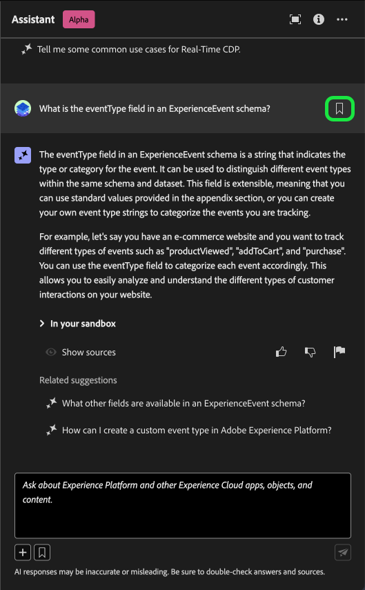
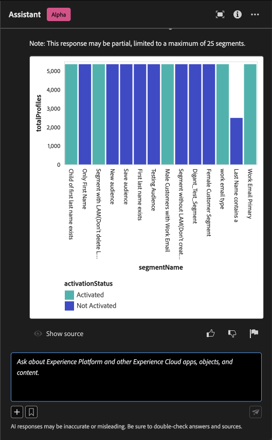
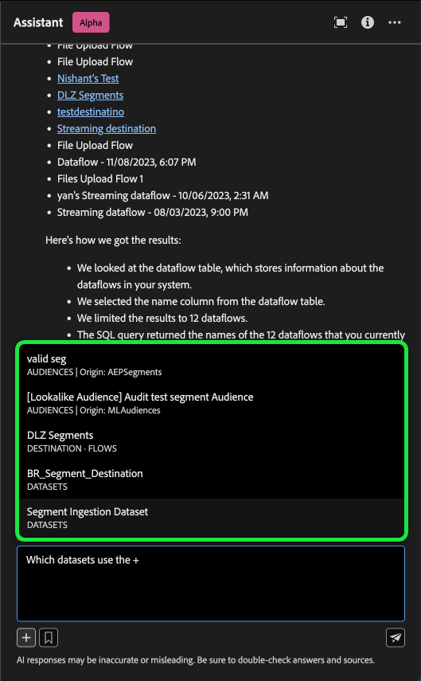
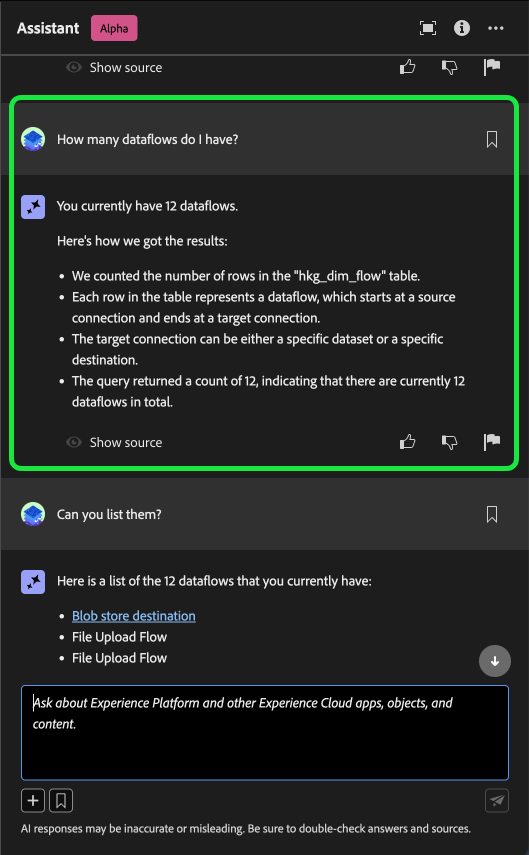

# Assistent für Adobe Experience Platform

>[!NOTE]
>
>Der Assistent für Adobe Experience Platform befindet sich derzeit in Alpha. Die Funktion und die Dokumentation können sich ändern.

Assistant ist eine UI-Funktion, mit der Sie in Adobe Experience Platform und Real-time Customer Data Platform navigieren und Informationen zu den Konzepten und Nutzungsinformationen zu Ihren Objekten erhalten.

Sie können den Assistenten nach folgenden Informationen abfragen:

* Anleitung zur Durchführung von Aufgaben in Bezug auf Daten und Zielgruppen.
* Status und Metriken der vorhandenen Datenobjekte in Ihrer Organisation.
* Verwenden Sie Fallbeispiele und Nuancen, um Ihre Datenobjekte, einschließlich Attributen, Datenflüssen, Datensätzen, Zielen, Schemas, Segmenten und Quellen, besser zu verstehen.

Lesen Sie das nachstehende Handbuch, um zu erfahren, wie Sie mit Assistant die Navigation in Ihren Experience Platform- und Real-Time CDP-Workflows erleichtern und diese verstehen können.

>[!BEGINSHADEBOX]

**Wie wirkt die Assistenzkraft?**

Der Assistent antwortet auf Ihre gestellten Fragen, indem er eine Datenbank abfragt und dann Daten aus der Datenbank in eine für Menschen lesbare Antwort übersetzt.

Diese interne Darstellung der zugrunde liegenden Daten wird auch als Wissensdiagramm bezeichnet - ein umfassendes Netz von Konzepten, Daten und Metadaten für eine gegebene Antwort.

Das Wissensdiagramm besteht aus Unterdiagrammen, die bei jeder Übermittlung von Abfragen referenziert werden:

* Kundenverwendungsdaten.
* Kundenverwendungsdaten aus verschiedenen Meta Stores.
* Experience League.

Es gibt zwei Arten von Fragen, die Sie vor der Abfrage des Assistenten beachten sollten:

* **Konzeptfragen**: Bei Konzeptfragen geht es um Adobe-Konzepte, die sich auf Daten oder Zielgruppen beziehen. Zu den Beispielen für Konzeptfragen gehören:
   * Was ist der Unterschied zwischen Batch- und Streaming-Segmentierung?
   * Gibt es Datenmodelle der Branche und wie verwende ich sie?
   * Wofür wird Real-Time CDP am besten verwendet?
* **Nutzungsfragen**: Nutzungsfragen beziehen sich auf die Datenobjekte in Ihrem Unternehmen. Beispiele für Nutzungsfragen sind:
   * Wie viele Datensätze habe ich?
   * Wie viele Schemaattribute wurden noch nie verwendet?
   * Welche Segmente wurden aktiviert?

>[!ENDSHADEBOX]

## Access Assistant in the Experience Platform UI

Um den Assistenten zu starten, wählen Sie die **[!UICONTROL Symbol &quot;Assistent&quot;]** aus der oberen Kopfzeile der Experience Platform-Benutzeroberfläche.

Die Assistant-Oberfläche wird angezeigt und gibt Ihnen sofort Informationen zu den ersten Schritten. Sie können die unter [!UICONTROL Erste Schritte] um Fragen und Befehle zu beantworten, z. B.:

* [!UICONTROL Welche meiner Segmente sind aktiviert?]
* [!UICONTROL Was ist ein Schema?]
* [!UICONTROL Erzählen Sie mir einige häufige Anwendungsfälle für Real-Time CDP]

Verwenden Sie das Eingabefeld, um Ihre Abfragen oder Befehle einzugeben, um mit Assistant zu interagieren. Sie können auch die **`+`**), um die Funktion zur automatischen Vervollständigung und das Lesezeichensymbol zu verwenden, um auf Ihre mit Lesezeichen versehenen Abfragen und Befehle zuzugreifen.

## Anwendungsbeispiel: Verwenden Sie den Assistenten, um die Erstellung Ihres Schemas zu beschleunigen

>[!NOTE]
>
>Der folgende Workflow ist ein Beispiel für die Erstellung eines Erlebnisereignisschemas, um zu veranschaulichen, wie Sie Assistant bei Verwendung der Experience Platform-Benutzeroberfläche verwenden können.

Betrachten Sie einen Anwendungsfall, in dem Sie eine **Gerätehandel im Ereignisschema**. Während des Erstellungsprozesses des Erlebnisereignisschemas treffen Sie auf die `eventType` -Feld. &quot;An dieser Stelle haben Sie die Möglichkeit, Ihren Workflow zu beenden, indem Sie auf den Abschnitt [Grundlagen der Schemakomposition](../xdm/schema/composition.md) oder Sie können Assistant verwenden, um Antworten auf Ihre Fragen abzurufen und zusätzliche Ressourcen über die Dokumentationslinks zu finden, die von Assistenzkräften empfohlen werden.&quot;

Geben Sie zunächst Ihre Frage in das bereitgestellte Textfeld ein. Im folgenden Beispiel wird Assistenzkraft die Frage gestellt: &quot;**Was ist das Feld eventType in einem ExperienceEvent-Schema?**&quot;

Der Assistent fragt dann seine Wissensdatenbank ab und berechnet eine Antwort. Nach einigen Augenblicken gibt der Assistent eine Antwort und entsprechende Vorschläge zurück, die Sie als Aufforderung zur Weiterverfolgung verwenden können.

Nach Erhalt der Antwort des Assistenten können Sie aus einer Reihe von Optionen auswählen, wie Sie vorgehen möchten.

### Speichern Sie Ihre Abfrage {#save-your-query}

+++Auswählen , um ein Beispiel für das Speichern einer Abfrage anzuzeigen

Um Ihre Abfrage zu speichern, wählen Sie das Lesezeichen-Symbol neben Ihrer Frage aus.

Um auf Ihre gespeicherten Abfragen zuzugreifen, wählen Sie das Lesezeichensymbol unter dem Eingabefeld aus und wählen Sie dann die Abfrage aus, die Sie ausführen möchten.

+++

### Daten in der Sandbox anzeigen {#view-data-in-your-sandbox}

+++Auswählen zum Anzeigen des Beispiels

Abhängig von Ihrer Abfrage stellt Assistant zusätzliche Informationen zu den Daten in Ihrer Sandbox bereit. Um anzuzeigen, wie die Antwort auf Ihre Abfrage auf Ihre Sandbox zutrifft, wählen Sie **[!UICONTROL In der Sandbox].**

Während dieses Schritts kann Assistant direkte Links zu den Benutzeroberflächen-Seiten bestimmter Objekte bereitstellen. Im folgenden Beispiel stellt Assistant direkte Links zum [!UICONTROL Schemas] und [!UICONTROL Segmente] Benutzeroberflächen-Seiten.

+++

### Überprüfen der Antwort {#verify-the-response}

+++Auswählen , um ein Beispiel für die Anzeige von Quellen anzuzeigen

Um Zitate anzuzeigen und die Antwort der Assistenzkraft zu validieren, wählen Sie **[!UICONTROL Quellen anzeigen]**. Der Assistent bietet Links zur Dokumentation, die die Antwort des Assistenten bestätigt. Sie können auch die Abfragen verwenden, die der Assistent unter [!UICONTROL Verwandte Vorschläge] , um die Themen zu Ihrer ursprünglichen Abfrage weiter zu untersuchen.

+++

### Datennutzung und -visualisierung {#data-usage-and-visualization}

+++Auswählen , um ein Beispiel für Fragen zur Datennutzung und Datenvisualisierung anzuzeigen

Damit Assistenzkräfte auf eine Abfrage zur Datennutzung in Ihrem Unternehmen reagieren können, müssen Sie sich in einer aktiven Sandbox befinden.

Im folgenden Beispiel wird Assistant mit der folgenden Abfrage bereitgestellt: **&quot;Zeigen Sie mir Segmentdefinitionen mit mehr als 1000 Profilen an und fügen Sie den Aktivierungsstatus hinzu.&quot;** Der Assistent antwortet dann mit einem Diagramm, das Ihre Segment- und Profildaten visualisiert.

Sie können den Mauszeiger über eine einzelne Leiste bewegen, um bestimmte Daten anzuzeigen. Sie können auch das Symbol zum Erweitern für eine größere Ansicht des Diagramms auswählen.

Eine erweiterte Ansicht der Visualisierung wird angezeigt. Sie können das erweiterte Modal verwenden, um Ihre Daten weiter zu überprüfen. Dies ist besonders nützlich, wenn die Visualisierung mit einer großen Anzahl von Spalten zurückgegeben wird.

Wenn Sie mit einer Frage zur Datennutzung aufgefordert werden, erläutert Assistant, wie die Antwort berechnet wurde. Im folgenden Beispiel beschreibt Assistant die Schritte, die zur Anzeige von Segmentdefinitionen mit über 1000 Profilen und deren Aktivierungsstatus unternommen wurden.

Sie können auch Filter und Änderungen an Ihren Abfragen bereitstellen und Assistant anweisen, seine Ergebnisse anhand der von Ihnen eingeschlossenen Filter zu rendern. Beispielsweise können Sie den Assistenten bitten, Ihnen einen Trend der Definitionen der Zählersegmente in der Reihenfolge ihres Erstellungsdatums anzuzeigen, Segmentdefinitionen mit Nullsummenprofilen zu entfernen und bei der Anzeige der Daten Monatsnamen anstelle von Ganzzahlen zu verwenden.

+++

### Automatische Vervollständigung verwenden {#use-auto-complete}

+++Auswählen , um ein Beispiel für die automatische Vervollständigung anzuzeigen

Sie können die Funktion zum automatischen Ausfüllen verwenden, um eine Liste von Datenobjekten zu erhalten, die in Ihrer Sandbox vorhanden sind. Empfehlungen zur automatischen Vervollständigung stehen für die folgenden Domänen zur Verfügung: Segmente, Schemas, Datensätze, Quellen und Ziele.

Sie können AutoComplete verwenden, indem Sie das Pluszeichen (**`+`**) in Ihrer Abfrage. Alternativ können Sie auch das Pluszeichen (**`+`**) am unteren Rand des Texteingabefelds. Es wird ein Fenster mit einer Liste der empfohlenen Datenobjekte aus Ihrer Sandbox angezeigt.

Wählen Sie als Nächstes das Datenobjekt aus, das Sie abfragen möchten, um Ihre Frage abzuschließen, und senden Sie dann Ihre Frage.

+++

### Mehrdrehzahl verwenden {#use-multi-turn}

+++Auswählen, um ein Beispiel für eine Mehrfachumstellung anzuzeigen

Sie können die mehrspurigen Funktionen der Assistenzkraft verwenden, um während Ihres Erlebnisses ein natürlicheres Gespräch zu führen. Die Assistenzkraft ist in der Lage, Nachfolgefragen zu beantworten, gegeben. Dieser Kontext kann aus einer früheren Interaktion abgeleitet werden.

Im folgenden Beispiel wird Assistant nach der Gesamtzahl der Datenflüsse in der aktuellen Organisation gefragt.

Als Nächstes erhält die Assistenzkraft eine weitere Folgeanfrage. Diesmal antwortet der Assistent, indem er die Datenflüsse auflistet, die derzeit in Ihrem Unternehmen vorhanden sind.

+++

## Dokumentation {#documentation}

Derzeit umfasst der Dokumentationsindex Adobe Experience Platform (Real-Time CDP und Audiences). Der Index wird regelmäßig aktualisiert.

Das Modell zum Abrufen der Dokumentation wird auf Experience Platform (Real-Time CDP und Zielgruppen) trainiert. Fragen, die nicht in Adobe Experience Platform enthalten sind, wie z. B. Fragen zu anderen Adobe-Produkten wie Adobe Target und der Creative Cloud Suite, können nicht beantwortet werden.

## Datennutzung {#data-usage}

Sie können Assistenzfragen auch zur Datennutzung in den folgenden Domänen stellen:

* Attribute
* Datenflüsse
* Datensätze
* Ziele _(Fragen zu Konten und einige Fragen zum Datenfluss können derzeit nicht beantwortet werden.)_
* Schemas _(Fragen zu Feldergruppen können derzeit nicht beantwortet werden.)_
* Segmente
* Quellen _(Fragen zu den Rechnungsabschlüssen können derzeit nicht beantwortet werden.)_

Bei Nutzungsdatenabfragen spiegeln Antworten möglicherweise nicht den aktuellen Status der Benutzeroberfläche wider. Die Daten, die diese Fragen unterstützen, werden alle 24 Stunden aktualisiert. Beispielsweise werden Änderungen, die Benutzer tagsüber in Real-Time CDP vornehmen, mit den Datenspeichern nachts synchronisiert und stehen dann morgens für Benutzerfragen zur Verfügung. Möglicherweise müssen Sie Ihre Fragen wie folgt formatieren: &quot;Wann war das Segment mit dem Titel {TITLE} created?&quot; statt &quot;Wann war die {TITLE} Segment erstellt?&quot;

Sie müssen sich bei einer Sandbox anmelden, um sich über bestimmte Daten zu Objekten wie Schemas, Datensätzen, Attributen, Zielen und Segmenten zu informieren.

### Beispielhafte Fragen zur Datennutzung {#example-data-usage-questions}

+++Auswählen, um eine Liste mit Beispieldatenverwendungsfragen anzuzeigen

| Fragetyp | Beschreibung | Beispiele |
| --- | --- | --- | 
| Datenherkunft | Verwendung eines oder mehrerer Objekte über andere Experience Platform-Objekte hinweg verfolgen | <ul><li>Welche Datensätze werden verwendet? {SCHEMA_NAME} schema?</li><li>Wie viele Datensätze wurden mit demselben Schema erfasst?</li><li>Welche Datensätze wurden in aktivierten Segmenten verwendet?</li><li>Listen Sie die Schemas auf, deren Attribute in aktivierten Segmenten verwendet werden.</li><li>Anzeigen der Segmente, für die aktiviert ist {DESTINATION_ACCOUNT_NAME} und haben mehr als 1000 Profile.</li><li>Zeigen Sie mir die Attribute, die in den aktivierten Segmenten verwendet werden, die nach Januar 2023 geändert wurden.</li><li>Über welche Datensätze werden erfasst? {SOURCE_NAME}?</li><li>Welche Datenflüsse sind mit {DATAFLOW_NAME}</li><li>Listen Sie die Schemas auf, die sich auf aktivierte Segmente beziehen und im letzten 1 Jahr erstellt wurden.</li></ul> |
| Verteilung und Aggregationen | Zusammenfassende Fragen zur Verwendung von Experience Platform-Objekten | <ul><li>Wie viel Prozent der aktivierten Segmente sind?</li><li>Wie viele Felder werden in der Segmentierung verwendet?</li><li>Welche Segmente sind für die meisten Ziele aktiviert?</li><li>Listen Sie doppelte Segmente auf.</li><li>Anzeigen der aktivierten Segmente für {DESTINATION_ACCOUNT_NAME} und ordnen Sie sie nach Profilgröße an.</li><li>Wie hoch ist der Prozentsatz der Segmente, die nicht aktiviert wurden, aber mehr als 100 Profile aufweisen. Zeigen Sie mir ihre Namen.</li><li>Geben Sie die 3 Quell-Connectoren an, die Daten in meine Datensätze aufnehmen.</li><li>Geben Sie mir die fünf wichtigsten Attribute an, die in aktivierten Segmenten basierend auf ihrem Vorkommen verwendet werden.</li></ul> |
| Objektsuche | Rufen Sie ein Experience Platform-Objekt oder dessen Eigenschaften ab oder greifen Sie darauf zu. | <ul><li>Welche Datensätze sind mit keinem Schema verknüpft?</li><li>Auflisten der Attribute, die für {SEGMENT_NAME}?</li><li>Geben Sie mir die Liste der Schemas an, für die Profil aktiviert, aber seit ihrer Erstellung nicht geändert wurde.</li><li>Welche Segmente wurden in der letzten Woche geändert?</li><li>Geben Sie mir die Segmente an, die über dieselben Segmentdefinitionen und deren Erstellungsdatum verfügen.</li><li>Welche Datensätze sind profilaktiviert und enthalten auch, wie viele Segmente aus jedem Datensatz erstellt wurden.</li><li>Welche Quellkonten sind mit dem Datensatz XYZ verknüpft?</li><li>Anzeigen der Segmentdefinition und des Änderungsdatums von {SEGMENT_NAME}.</li></ul> |

+++

## Feedback geben {#feedback}

>[!BEGINSHADEBOX]

**Ihr Feedback wird angefordert**

Im Verlauf dieses Alphas werden Sie eingeladen, Feedback zu den Antworten zu geben, die Sie von der Assistenzkraft erhalten. Alle Antworten und eingereichten Feedback werden geprüft, um das Assistenzerlebnis weiter zu verbessern.

Um Feedback zu geben, wählen Sie entweder Daumen nach oben oder Daumen nach dem Erhalt einer Antwort vom Assistenten aus und geben Sie dann Ihr Feedback in das bereitgestellte Textfeld ein. Wählen Sie als Nächstes **[!UICONTROL Feedback senden]** zu senden.

>[!ENDSHADEBOX]

+++ Feedback geben

>[!BEGINTABS]

>[!TAB Wirbel nach oben]

Wählen Sie das Daumen-nach-oben-Symbol aus, um Feedback dazu zu geben, was mit Ihrem Erlebnis mit der Assistenzkraft gut gelaufen ist.

>[!TAB Daumen nach unten]

Wählen Sie das Daumen-nach-unten-Symbol aus, um Feedback dazu zu geben, was basierend auf Ihrer Erfahrung mit der Assistenzkraft verbessert werden könnte. Während dieses Schritts können Sie auch spezifische Kommentare zu Ihrem Erlebnis angeben. Das in den Kommentaren enthaltene Feedback wird täglich überprüft.

>[!TAB Markierung]

Wählen Sie das Flag-Symbol aus, um weitere Berichte über Ihr Erlebnis mit dem Assistenten anzuzeigen.

>[!ENDTABS]

+++

## Weitere Informationen {#additional-information}

Weitere Informationen zum Assistenten für Experience Platform finden Sie in diesem Abschnitt .

### Einschränkungen {#caveats-and-limitations}

Im folgenden Abschnitt werden die Einschränkungen und Einschränkungen erläutert, die bei der Verwendung des Assistenten beachtet werden müssen.
<!-- 
#### Conversational experience

You must consider several nuances regarding the conversational experience when querying the Assistant.

>[!NOTE]
>
>These limitations are temporary and are being improved upon throughout the course of the alpha.

>[!BEGINTABS]

>[!TAB Unable to infer context from prior discussion]

The Assistant currently cannot reference prior discussions as context for a given question. See the table below for examples:

| Ambiguous question | Clear question | Note |
| --- | --- | --- |
| <ul><li>First question: "What is a segment?"</li><li>Follow up question: "Are there different types of them?"</li></ul>| <ul><li>First question: "What is a segment?"</li><li>Follow up question: "Are there different types of **segments**?"</li></ul> | The Assistant cannot infer what "them" means. |
| <ul><li>First question: "What is a segment?"</li><li>Follow up question: "Can you elaborate more?"</li></ul> | <ul><li>First question: "What is a segment?"</li><li>Follow up question: "Explain what a segment is in depth"</li></ul> | The Assistant cannot intelligently reference documentation based on "more". |
| <ul><li>First question: "What is a segment?"</li><li>Follow up question: "Can you give me an example of one?"</li></ul> | <ul><li>First question: "What is a segment?"</li><li>Follow up question: "Can you give me an example of a segment?"</li></ul> | The Assistant cannot infer what you want an example of.|
| <ul><li>First question: "What is a batch segment?"</li><li>Follow up question: "How does it compare to a streaming segment?"</li></ul> | <ul><li>First question: "What is a batch segment?"</li><li>Follow up question: "Can you compare a streaming segment to a batch segment?"</li></ul> | The Assistant cannot infer what "it" is referring to and thus cannot compare the streaming segment. |
| <ul><li>First question: "How many segments do I have?"</li><li>Follow up question: "How many of them use Facebook as a destination?"</li></ul> | <ul><li>First question: "How many segments do I have?"</li><li>Follow up question: "How many of the segments that I have are using Facebook as a destination?"</li></ul> | The Assistant is cannot infer what "them" is referring to. |

{style="table-layout:auto"}

>[!TAB Unable to infer context from a page]

When asking the Assistant about a particular element of the Experience Platform UI page that you are on, you must clearly define the specific element within your question. 

| Ambiguous question | Clear question | Note |
| --- | --- | --- |
| "What does this do?" | "What does {PAGE_NAME} do? | The Assistant cannot infer what "this" is referring to. You must provide the specific page element that you are querying about. |
| "Why won't it save?" | "Why can't I save a new sandbox called {NAME}?" | The Assistant cannot infer what "it" is referring to and cannot know that you are having issues with an entity. |

{style="table-layout:auto"}

Furthermore, the Assistant can only answer questions regarding error messages, given that the error is documented in Experience League.

>[!TAB Ambiguity]

You must phrase your questions clearly and scope them within a product, application, or domain, as the Assistant currently cannot disambiguate questions.

| Ambiguous question | Clear question | Note |
| --- | --- | --- |
| "How do I create a filter? | How do I create a filter in Profile Query Language? | You must specify the feature that which you are filtering for because a variety of Experience Platform features support filtering. |
| "How do I get started? | How do I get started using destinations? | You must provide clarity on your goals and use case because overly broad concepts may result in generic or unnecessarily specific answers. |

{style="table-layout:auto"}

>[!ENDTABS] -->

#### Geringfügiger kleiner Vortrag

Sie können mit der Assistenzkraft kleine Gespräche führen, aber diese Kapazität ist derzeit begrenzt.

#### Funktionsfragen

Die Assistenzkraft kann einen ungenauen Eindruck davon vermitteln, was sie tun kann. Es kann die folgenden Arten von Fragen falsch beantworten:

| Beispielfrage | Hinweis |
| --- | --- |
| &quot;Können Sie Fragen beantworten zu {ENTITY}?&quot; | Solange der Assistent in der Lage ist, eine einzelne Seite zu finden, die auf eine bestimmte Entität verweist, antwortet er mit &quot;Ja&quot;. |
| &quot;Weißt du das? **x** Sprache?&quot; | Die Assistenzkraft unterstützt derzeit nur Englisch, kann aber &quot;Ja&quot;beantworten, da das zugrunde liegende Modell es unterstützen kann. |
| &quot;Können Sie...?&quot; | Die Assistenzkraft kann ja antworten, auch wenn dies nicht möglich ist. |

### Tipps {#tips}

Im folgenden Abschnitt finden Sie einige Tipps und Problemumgehungen, die bei der Verwendung von Assistenzkräften beachtet werden müssen.

#### Fragen können mit der falschen Informationsquelle beantwortet werden

Es gibt Fälle, in denen Ihre Frage zu Ihren Nutzungsdaten zu einer Antwort führen kann, die auf der Dokumentation basiert. Der Grund dafür ist, dass der Assistent Ihre Frage fälschlicherweise an die falsche Informationsquelle weiterleiten kann. Sie können dies verhindern, indem Sie:

* Umkehren Ihrer Frage zur Verwendung SQL-ähnlicher Sprachen
* Explizites Aufrufen der zu verwendenden Informationsquelle.

Beispiele finden Sie in der folgenden Tabelle:

| Ungültige Frage | Gute Frage | Anmerkungen |
| --- | --- | --- |
| Was ist mein größtes Segment? | Was ist mein größtes Segment? Verwendung von Daten. | Teilen Sie dem Assistenten ausdrücklich mit, dass die Antwort auf Daten basieren soll. |
| Was ist mein größtes Segment? | Geben Sie mein größtes Segment an. | Es gibt Fälle, in denen eine &quot;Was...&quot;-Frage mit einer dokumentationsbasierten Frage verwechselt werden kann. Die Verwendung eines Befehls wie &quot;list&quot;ist ein stärkerer Indikator dafür, dass Sie eine Frage mit Daten im Kontext stellen. |
| Wie viele Datensätze habe ich? | Zählen Sie meine Datensätze. | Die ursprüngliche Frage funktioniert für Segmente, funktioniert jedoch möglicherweise nicht mit Datensätzen. |
