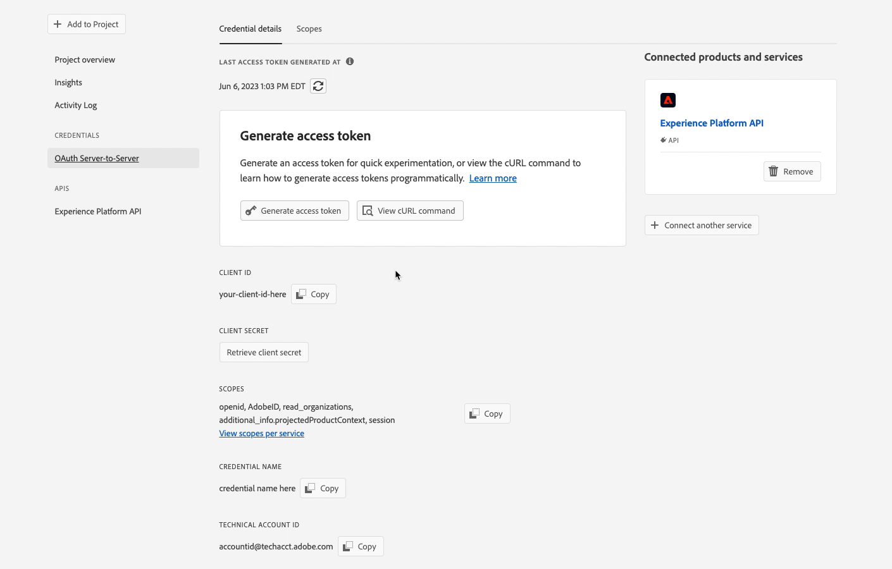
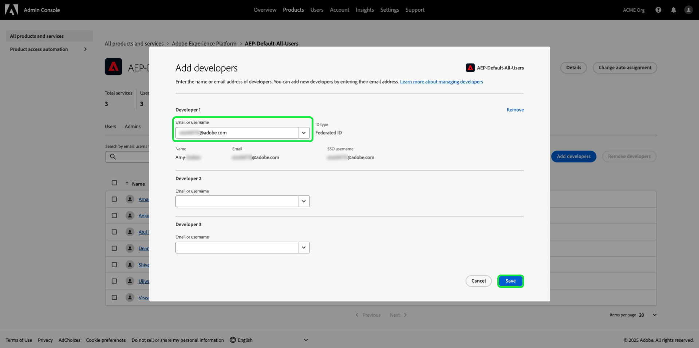

# Authentifizieren und Zugreifen auf Experience Platform-APIs

Dieses Dokument bietet eine schrittweise Anleitung für den Zugriff auf ein Adobe Experience Platform-Entwicklerkonto, damit Sie Aufrufe an Experience Platform-APIs durchführen können. Am Ende dieses Tutorials haben Sie die folgenden Anmeldeinformationen generiert oder erfasst, die als Kopfzeilen in allen Platform-API-Aufrufen erforderlich sind:

* `{ACCESS_TOKEN}`
* `{API_KEY}`
* `{ORG_ID}`

>[!TIP]
>
>Zusätzlich zu den drei oben genannten Anmeldedaten benötigen viele Platform-APIs auch eine gültige `{SANDBOX_NAME}` als Kopfzeile angegeben werden. Siehe [Sandbox-Übersicht](../sandboxes/home.md) Weitere Informationen zu Sandboxes und dem [Sandbox-Verwaltungsendpunkt](/help/sandboxes/api/sandboxes.md#list) Dokumentation für Informationen zur Auflistung der für Ihr Unternehmen verfügbaren Sandboxes.

Um die Sicherheit Ihrer Anwendungen und Benutzer zu gewährleisten, müssen alle Anfragen an Experience Platform-APIs anhand von Standards wie OAuth authentifiziert und autorisiert werden.

In diesem Tutorial wird beschrieben, wie Sie die erforderlichen Anmeldeinformationen zum Authentifizieren von Platform-API-Aufrufen erfassen, wie im unten stehenden Flussdiagramm beschrieben. Sie können die meisten erforderlichen Anmeldeinformationen bei der ersten einmaligen Einrichtung erfassen. Das Zugriffstoken muss jedoch alle 24 Stunden aktualisiert werden.


## Voraussetzungen {#prerequisites}

Um Experience Platform-APIs erfolgreich aufrufen zu können, benötigen Sie Folgendes:

* Eine Organisation mit Zugriff auf Adobe Experience Platform.
* Ein Admin Console-Administrator, der Sie als Entwickler und Anwender für ein Produktprofil hinzufügen kann.

Sie müssen auch über eine Adobe ID verfügen, um dieses Tutorial abzuschließen. Wenn Sie keine Adobe ID haben, können Sie wie folgt eine erstellen:

1. Navigieren Sie zu [Adobe Developer-Konsole](https://console.adobe.io).
2. Auswählen **[!UICONTROL Neues Konto erstellen]**.
3. Schließen Sie den Anmeldevorgang ab.

## Entwickler- und Benutzerzugriff für Experience Platform erlangen {#gain-developer-user-access}

Vor der Erstellung von Integrationen in der Adobe Developer Console muss Ihr Konto über Entwickler- und Benutzerberechtigungen für ein Experience Platform-Produktprofil in Adobe Admin Console verfügen.

### Entwicklerzugriff erlangen {#gain-developer-access}

Kontakt [!DNL Admin Console] Administrator in Ihrer Organisation, um Sie als Entwickler einem Experience Platform-Produktprofil mithilfe von [[!DNL Admin Console]](https://adminconsole.adobe.com/). Siehe [!DNL Admin Console] Dokumentation für spezifische Anweisungen zum [Verwalten des Entwicklerzugriffs für Produktprofile](https://helpx.adobe.com/de/enterprise/admin-guide.html/enterprise/using/manage-developers.ug.html).

Nachdem Sie als Entwickler zugewiesen wurden, können Sie mit der Erstellung von Integrationen in [Adobe Developer-Konsole](https://www.adobe.com/go/devs_console_ui). Bei diesen Integrationen handelt es sich um eine Pipeline von externen Apps und Diensten zu Adobe-APIs.

### Benutzerzugriff erlangen {#gain-user-access}

Ihre [!DNL Admin Console] -Administrator muss Sie auch als Benutzer zum selben Produktprofil hinzufügen. Siehe Handbuch unter [Verwalten von Benutzergruppen in [!DNL Admin Console]](https://helpx.adobe.com/enterprise/admin-guide.html/enterprise/using/user-groups.ug.html) für weitere Informationen.

## API-Schlüssel (Client-ID) und Organisations-ID generieren {#generate-credentials}

>[!NOTE]
>
>Wenn Sie diesem Dokument aus dem [Handbuch zur Privacy Service-API](../privacy-service/api/getting-started.md)können Sie nun zu diesem Handbuch zurückkehren, um die eindeutigen Zugriffsberechtigungen für [!DNL Privacy Service].

Nachdem Sie Entwicklern und Benutzern Zugriff auf Platform gewährt haben, über [!DNL Admin Console], wird im nächsten Schritt die `{ORG_ID}` und `{API_KEY}` Anmeldedaten in der Adobe Developer Console. Diese Anmeldeinformationen müssen nur einmal generiert werden und können in zukünftigen Platform-API-Aufrufen wiederverwendet werden.

### Experience Platform zu einem Projekt hinzufügen {#add-platform-to-project}

Wechseln Sie zur [Adobe-Entwicklerkonsole](https://www.adobe.com/go/devs_console_ui) und melden Sie sich mit Ihrer Adobe ID an. Führen Sie anschließend die Schritte aus, die im Tutorial [Erstellen eines leeren Projekts](https://developer.adobe.com/developer-console/docs/guides/projects/projects-empty/) in der Dokumentation zu Adobe Developer Console beschrieben werden.

Nachdem Sie ein neues Projekt erstellt haben, wählen Sie **[!UICONTROL API hinzufügen]** auf **[!UICONTROL Projektübersicht]** angezeigt.


Der Bildschirm **[!UICONTROL API hinzufügen]** wird angezeigt. Wählen Sie das Produktsymbol für Adobe Experience Platform und dann **[!UICONTROL Experience Platform-API]** vor der Auswahl **[!UICONTROL Nächste]**.


>[!TIP]
>
>Wählen Sie die **[!UICONTROL Dokumente anzeigen]** -Option, um in einem separaten Browserfenster zum Abschluss zu navigieren [Referenzdokumentation zur Experience Platform-API](https://developer.adobe.com/experience-platform-apis/).

### Wählen Sie den Authentifizierungstyp OAuth Server-zu-Server aus. {#select-oauth-server-to-server}

Wählen Sie anschließend den Authentifizierungstyp aus, um Zugriffstoken zu generieren und auf die Experience Platform-API zuzugreifen.

>[!IMPORTANT]
>
>Wählen Sie die **[!UICONTROL OAuth Server-zu-Server]** -Methode, da dies künftig die einzige unterstützte Methode sein wird. Die **[!UICONTROL Dienstkonto (JWT)]** -Methode veraltet ist. Während Integrationen, die die JWT-Authentifizierungsmethode verwenden, bis zum 1. Januar 2025 weiterhin funktionieren, empfiehlt Adobe dringend, vorhandene Integrationen vor diesem Datum auf die neue OAuth Server-zu-Server-Methode zu migrieren. Weitere Informationen finden Sie im Abschnitt . [!BADGE Veraltet]{type=negative}[JSON-Web-Token (JWT) generieren](#jwt).


### Produktprofile für Ihre Integration auswählen {#select-product-profiles}

Wählen Sie anschließend die Produktprofile aus, die für Ihre Integration gelten sollen.
Das Dienstkonto Ihrer Integration erhält über die hier ausgewählten Produktprofile Zugriff auf granulare Funktionen.

Beachten Sie, dass Sie für den Zugriff auf bestimmte Funktionen in Platform auch einen Systemadministrator benötigen, der Ihnen die erforderlichen attributbasierten Zugriffssteuerungsberechtigungen erteilt. Mehr dazu im Abschnitt [Abrufen der erforderlichen attributbasierten Zugriffssteuerungsberechtigungen](#get-abac-permissions).

>[!TIP]
>
Wenn Sie hier ein bestimmtes Produktprofil erwarten, wenden Sie sich an Ihren Systemadministrator. Systemadministratoren können API-Anmeldeinformationen in der Ansicht &quot;Berechtigungen&quot;anzeigen und verwalten. Weiterführende Informationen finden Sie im Abschnitt . [Hinzufügen von Entwicklern zum Produktprofil](#add-developers-to-product-profile).


Auswählen **[!UICONTROL Konfigurierte API speichern]** wenn Sie bereit sind.

Eine exemplarische Vorgehensweise zum Einrichten einer Integration mit der Experience Platform-API finden Sie auch im folgenden Video-Tutorial:

>[!VIDEO](https://video.tv.adobe.com/v/28832/?learn=on)

### Sammeln von -Anmeldeinformationen {#gather-credentials}

Nachdem die API zum Projekt hinzugefügt wurde, wird die **[!UICONTROL Experience Platform-API]** -Seite für das Projekt werden die folgenden Anmeldeinformationen angezeigt, die für alle Aufrufe von Experience Platform-APIs erforderlich sind:


* `{API_KEY}` ([!UICONTROL Client-ID])
* `{ORG_ID}` ([!UICONTROL Organisations-ID])

<!--


<!--

In addition to the above credentials, you also need the generated **[!UICONTROL Client Secret]** for a future step. Select **[!UICONTROL Retrieve client secret]** to reveal the value, and then copy it for later use.


-->

## Zugriffstoken generieren {#generate-access-token}

Der nächste Schritt besteht darin, eine `{ACCESS_TOKEN}` Berechtigung zur Verwendung in Platform-API-Aufrufen. Im Gegensatz zu den Werten für `{API_KEY}` und `{ORG_ID}`muss ein neues Token alle 24 Stunden generiert werden, damit Sie weiterhin Platform-APIs verwenden können. Auswählen **[!UICONTROL Zugriffstoken generieren]**, wie unten dargestellt.



>[!TIP]
>
Sie können auch eine Postman-Umgebung und -Sammlung verwenden, um Zugriffstoken zu generieren. Weitere Informationen finden Sie im Abschnitt zu [Verwenden von Postman zum Authentifizieren und Testen von API-Aufrufen](#use-postman).

## [!BADGE Veraltet]{type=negative} JSON-Web-Token (JWT) generieren {#jwt}

>[!WARNING]
>
Die JWT-Methode zum Generieren von Zugriffstoken wird nicht mehr unterstützt. Alle neuen Integrationen müssen mit der [OAuth Server-zu-Server-Authentifizierungsmethode](#select-oauth-server-to-server). Adobe empfiehlt auch, Ihre vorhandenen Integrationen zur OAuth-Methode zu migrieren. Lesen Sie die folgende wichtige Dokumentation:
> 
* [Migrationshandbuch für Ihre Anwendungen von JWT zu OAuth](https://developer.adobe.com/developer-console/docs/guides/authentication/ServerToServerAuthentication/migration/)
* [Implementierungshandbuch für neue und alte Anwendungen mit OAuth](https://developer.adobe.com/developer-console/docs/guides/authentication/ServerToServerAuthentication/implementation/)
* [Vorteile der Verwendung der OAuth-Server-zu-Server-Anmeldemethode](https://developer.adobe.com/developer-console/docs/guides/authentication/ServerToServerAuthentication/migration/#why-oauth-server-to-server-credentials)

+++ Eingestellte Informationen anzeigen

Der nächste Schritt besteht darin, ein JSON Web Token (JWT) basierend auf Ihren Kontoanmeldeinformationen zu generieren. Mit diesem Wert wird Ihre `{ACCESS_TOKEN}` Berechtigung zur Verwendung in Platform-API-Aufrufen, die alle 24 Stunden neu generiert werden müssen.

>[!IMPORTANT]
>
In diesem Tutorial wird anhand der folgenden Schritte beschrieben, wie Sie in der Developer Console eine JWT generieren. Diese Erzeugungsmethode sollte jedoch nur zu Test- und Auswertungszwecken verwendet werden.
>
Für die normale Verwendung muss die JWT automatisch generiert werden. Weitere Informationen zum programmgesteuerten Generieren von JWTs finden Sie unter [Authentifizierungshandbuch für Dienstkonten](https://www.adobe.io/developer-console/docs/guides/authentication/JWT/) auf Adobe Developer.

Auswählen **[!UICONTROL Dienstkonto (JWT)]** Wählen Sie im linken Navigationsbereich die Option **[!UICONTROL JWT generieren]**.


In dem unter **[!UICONTROL Benutzerdefiniertes JWT generieren]** Fügen Sie den Inhalt des privaten Schlüssels ein, den Sie zuvor beim Hinzufügen der Platform-API zu Ihrem Dienstkonto generiert haben. Wählen Sie anschließend **[!UICONTROL Generate Token]**.


Die Seite wird aktualisiert und zeigt das generierte JWT sowie einen cURL-Beispielbefehl an, mit dem Sie ein Zugriffstoken generieren können. Wählen Sie für die Zwecke dieses Tutorials **[!UICONTROL Kopieren]** neben **[!UICONTROL Generiertes JWT]** , um das Token in die Zwischenablage zu kopieren.


**Zugriffstoken generieren**

Nachdem Sie ein JWT generiert haben, können Sie es in einem API-Aufruf verwenden, um Ihre `{ACCESS_TOKEN}`. Im Gegensatz zu den Werten für `{API_KEY}` und `{ORG_ID}`muss ein neues Token alle 24 Stunden generiert werden, damit Sie weiterhin Platform-APIs verwenden können.

**Anfrage**

Die folgende Anfrage generiert eine neue `{ACCESS_TOKEN}` basierend auf den in der Payload angegebenen Anmeldeinformationen. Dieser Endpunkt akzeptiert nur Formulardaten als Payload und muss daher eine `Content-Type` -Kopfzeile `multipart/form-data`.

```shell
curl -X POST https://ims-na1.adobelogin.com/ims/exchange/jwt \
  -H 'Content-Type: multipart/form-data' \
  -F 'client_id={API_KEY}' \
  -F 'client_secret={SECRET}' \
  -F 'jwt_token={JWT}'
```

| Eigenschaft | Beschreibung |
| --- | --- |
| `{API_KEY}` | Die `{API_KEY}` ([!UICONTROL Client-ID]), die Sie in einem [vorheriger Schritt](#api-ims-secret). |
| `{SECRET}` | Das Client-Geheimnis, das Sie in einem [vorheriger Schritt](#api-ims-secret). |
| `{JWT}` | Der JWT, den Sie in einem [vorheriger Schritt](#jwt). |

>[!NOTE]
>
Sie können denselben API-Schlüssel, dasselbe Client-Geheimnis und dasselbe JWT verwenden, um ein neues Zugriffstoken für jede Sitzung zu generieren. Auf diese Weise können Sie die Erstellung von Zugriffstoken in Ihren Anwendungen automatisieren.

**Antwort**

```json
{
  "token_type": "bearer",
  "access_token": "{ACCESS_TOKEN}",
  "expires_in": 86399992
}
```

| Eigenschaft | Beschreibung |
| --- | --- |
| `token_type` | Der Typ des zurückgegebenen Tokens. Für Zugriffstoken ist dieser Wert immer `bearer`. |
| `access_token` | Die generierte `{ACCESS_TOKEN}`. Dieser Wert, dem das Wort vorangestellt ist `Bearer`, ist erforderlich, da die `Authentication` -Kopfzeile für alle Platform-API-Aufrufe. |
| `expires_in` | Die Anzahl der Millisekunden, die bis zum Ablauf des Zugriffstokens verbleiben. Sobald dieser Wert 0 erreicht, muss ein neues Zugriffstoken generiert werden, um weiterhin Platform-APIs verwenden zu können. |

+++

## Zugriffsberechtigungen testen {#test-credentials}

Nachdem Sie alle drei erforderlichen Anmeldeinformationen - Zugriffstoken, API-Schlüssel und Organisations-ID - erfasst haben, können Sie versuchen, den folgenden API-Aufruf durchzuführen. Dieser Aufruf listet alle standardmäßigen [!DNL Experience Data Model] (XDM)-Klassen, die für Ihr Unternehmen verfügbar sind. Importieren und Ausführen des -Aufrufs in [Postman](#use-postman).

>[!BEGINSHADEBOX]

**Anfrage**

```SHELL
curl -X GET https://platform.adobe.io/data/foundation/schemaregistry/global/classes \
  -H 'Accept: application/vnd.adobe.xed-id+json' \
  -H 'Authorization: Bearer {{ACCESS_TOKEN}}' \
  -H 'x-api-key: {{API_KEY}}' \
  -H 'x-gw-ims-org-id: {{ORG_ID}}'
```

**Antwort**

Wenn Ihre Antwort der unten gezeigten ähnelt, sind Ihre Anmeldedaten gültig und funktionieren. (Diese Antwort wurde aus Platzgründen abgeschnitten.)

```JSON
{
  "results": [
    {
        "title": "XDM ExperienceEvent",
        "$id": "https://ns.adobe.com/xdm/context/experienceevent",
        "meta:altId": "_xdm.context.experienceevent",
        "version": "1"
    },
    {
        "title": "XDM Individual Profile",
        "$id": "https://ns.adobe.com/xdm/context/profile",
        "meta:altId": "_xdm.context.profile",
        "version": "1"
    }
  ]
}
```

>[!ENDSHADEBOX]

>[!IMPORTANT]
>
Der obige Aufruf reicht zwar aus, um Ihre Zugriffsberechtigungen zu testen, beachten Sie jedoch, dass Sie nicht auf mehrere Ressourcen zugreifen oder diese ändern können, ohne über die richtigen Attributbasierten Zugriffssteuerungsberechtigungen verfügen zu müssen. Mehr dazu im [Abrufen der erforderlichen attributbasierten Zugriffssteuerungsberechtigungen](#get-abac-permissions) Abschnitt.

## Abrufen der erforderlichen attributbasierten Zugriffssteuerungsberechtigungen {#get-abac-permissions}

Um auf mehrere Ressourcen in Experience Platform zugreifen oder diese ändern zu können, benötigen Sie die entsprechenden Zugriffssteuerungsberechtigungen. Systemadministratoren können Ihnen die [benötigte Berechtigungen](/help/access-control/ui/permissions.md). Weitere Informationen finden Sie im Abschnitt zu [Verwalten von API-Anmeldeinformationen für eine Rolle](/help/access-control/abac/ui/permissions.md#manage-api-credentials-for-role).

Ausführliche Informationen dazu, wie ein Systemadministrator die erforderlichen Berechtigungen für den Zugriff auf Platform-Ressourcen über die API gewähren kann, finden Sie auch im folgenden Video-Tutorial:

>[!VIDEO](https://video.tv.adobe.com/v/28832/?learn=on&t=159)

## Verwenden von Postman zum Authentifizieren und Testen von API-Aufrufen {#use-postman}

[Postman](https://www.postman.com/) ist ein beliebtes Tool, mit dem Entwickler RESTful-APIs untersuchen und testen können. Sie können Sammlungen und Umgebungen in Experience Platform Postman verwenden, um die Arbeit mit Experience Platform-APIs zu beschleunigen. Mehr dazu [Verwenden von Postman in Experience Platform](/help/landing/postman.md) und erste Schritte mit Sammlungen und Umgebungen.

Detaillierte Informationen zur Verwendung von Postman mit Experience Platform-Sammlungen und -Umgebungen finden Sie auch in den folgenden Video-Tutorials:

**Herunterladen und Importieren einer Postman-Umgebung zur Verwendung mit Experience Platform-APIs**

>[!VIDEO](https://video.tv.adobe.com/v/28832/?learn=on&t=106)

**Verwenden einer Postman-Sammlung zum Generieren von Zugriffstoken**

Laden Sie die [Identity Management Service Postman-Sammlung](https://github.com/adobe/experience-platform-postman-samples/tree/master/apis/ims) und sehen Sie sich das folgende Video an, um zu erfahren, wie Sie Zugriffstoken generieren.

>[!VIDEO](https://video.tv.adobe.com/v/29698/?learn=on)

**Herunterladen von Experience Platform API Postman-Sammlungen und Interagieren mit den APIs**

>[!VIDEO](https://video.tv.adobe.com/v/29704/?learn=on)

<!--
This [Medium post](https://medium.com/adobetech/using-postman-for-jwt-authentication-on-adobe-i-o-7573428ffe7f) describes how you can set up Postman to automatically perform JWT authentication and use it to consume Platform APIs.
-->

## Systemadministratoren: Gewähren der Zugriffskontrolle für Entwickler und APIs mit Experience Platform-Berechtigungen {#grant-developer-and-api-access-control}

>[!NOTE]
>
Nur Systemadministratoren können API-Anmeldeinformationen in den Berechtigungen anzeigen und verwalten.

Vor der Erstellung von Integrationen in der Adobe Developer Console muss Ihr Konto über Entwickler- und Benutzerberechtigungen für ein Experience Platform-Produktprofil in Adobe Admin Console verfügen.

### Hinzufügen von Entwicklern zum Produktprofil {#add-developers-to-product-profile}

Gehen Sie zu [[!DNL Admin Console]](https://adminconsole.adobe.com/) und melden Sie sich mit Ihrer Adobe ID an.

Auswählen **[!UICONTROL Produkte]**, wählen Sie **[!UICONTROL Adobe Experience Platform]** aus der Liste der Erzeugnisse.


Aus dem **[!UICONTROL Produktprofile]** Registerkarte, wählen Sie **[!UICONTROL AEP-Default-All-Users]**. Alternativ können Sie über die Suchleiste nach dem Produktprofil suchen, indem Sie den Namen eingeben.


Wählen Sie die **[!UICONTROL Entwickler]** Registerkarte und wählen Sie **[!UICONTROL Entwickler hinzufügen]**.


Geben Sie die **[!UICONTROL E-Mail- oder Benutzername]**. Eine gültige [!UICONTROL E-Mail- oder Benutzername] zeigt die Entwicklerdetails an. Wählen Sie **[!UICONTROL Speichern]** aus.



Der Entwickler wurde erfolgreich hinzugefügt und wird im [!UICONTROL Entwickler] Registerkarte.


### Einrichten einer API

Entwickler können in einem Projekt in der Adobe Developer-Konsole eine API hinzufügen und konfigurieren.

Wählen Sie Ihr Projekt aus und klicken Sie auf **[!UICONTROL API hinzufügen]**.


Im **[!UICONTROL API hinzufügen]** Dialogfeldauswahl **[!UICONTROL Adobe Experience Platform]**, wählen Sie **[!UICONTROL Experience Platform-API]**.


Im **[!UICONTROL API konfigurieren]** Bildschirm, wählen Sie **[!UICONTROL AEP-Default-All-Users]**.

### Zuweisen der API zu einer Rolle

Ein Systemadministrator kann Rollen in der Experience Platform-Benutzeroberfläche APIs zuweisen.

Auswählen **[!UICONTROL Berechtigungen]** und die Rolle, der Sie die API hinzufügen möchten. Wählen Sie die **[!UICONTROL API-Anmeldeinformationen]** Registerkarte und wählen Sie **[!UICONTROL API-Anmeldeinformationen hinzufügen]**.


Wählen Sie die API aus, die Sie der Rolle hinzufügen möchten, und wählen Sie dann **[!UICONTROL Speichern]**.


Sie kehren zum [!UICONTROL API-Anmeldeinformationen] -Tab, wo die neu hinzugefügte API aufgelistet ist.


## Zusätzliche Ressourcen {#additional-resources}

Weitere Informationen zu den ersten Schritten mit Experience Platform-APIs finden Sie in den folgenden zusätzlichen Ressourcen

* [Experience Platform-APIs authentifizieren und aufrufen](https://experienceleague.adobe.com/docs/platform-learn/tutorials/platform-api-authentication.html?lang=de) Video-Tutorials-Seite
* [Identity Management Service Postman-Sammlung](https://github.com/adobe/experience-platform-postman-samples/tree/master/apis/ims) zum Generieren von Zugriffstoken
* [Experience Platform API Postman-Sammlungen](https://github.com/adobe/experience-platform-postman-samples/tree/master/apis/experience-platform)

## Nächste Schritte {#next-steps}

Durch Lesen dieses Dokuments haben Sie Ihre Zugangsdaten für Platform-APIs gesammelt und erfolgreich getestet. Sie können nun den Beispielaufrufen folgen, die im Abschnitt [Dokumentation](../landing/documentation/overview.md).

Zusätzlich zu den Authentifizierungswerten, die Sie in diesem Tutorial gesammelt haben, benötigen viele Platform-APIs auch eine gültige `{SANDBOX_NAME}` als Kopfzeile angegeben werden. Weiterführende Informationen dazu finden Sie unter [Sandbox-Übersicht](../sandboxes/home.md).