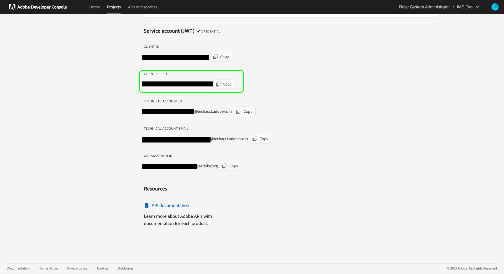

# Experience Platform-APIs authentifizieren und aufrufen

Dieses Dokument bietet eine schrittweise Anleitung für den Zugriff auf ein Adobe Experience Platform-Entwicklerkonto, damit Sie Aufrufe an Experience Platform-APIs durchführen können. Am Ende dieses Tutorials haben Sie die folgenden Anmeldeinformationen generiert, die für alle Platform-API-Aufrufe erforderlich sind:

* `{ACCESS_TOKEN}`
* `{API_KEY}`
* `{IMS_ORG}`

Um die Sicherheit Ihrer Anwendungen und Benutzer zu gewährleisten, müssen alle Anfragen an Adobe I/O-APIs mit Standards wie OAuth und JSON Web Tokens (JWT) authentifiziert und autorisiert werden. Ein JWT wird zusammen mit clientspezifischen Informationen verwendet, um Ihr persönliches Zugriffstoken zu generieren.

In diesem Tutorial wird beschrieben, wie Sie die erforderlichen Anmeldeinformationen zum Authentifizieren von Platform-API-Aufrufen erfassen, wie im folgenden Flussdiagramm beschrieben:


## Voraussetzungen

Um Experience Platform-APIs erfolgreich aufrufen zu können, benötigen Sie Folgendes:

* Eine IMS-Organisation mit Zugriff auf Adobe Experience Platform.
* Ein Admin Console-Administrator, der Sie als Entwickler und Anwender für ein Produktprofil hinzufügen kann.

Sie müssen auch über eine Adobe ID verfügen, um dieses Tutorial abzuschließen. Wenn Sie keine Adobe ID haben, können Sie wie folgt eine erstellen:

1. Navigieren Sie zu [Adobe Developer Console](https://console.adobe.io).
2. Auswählen **[!UICONTROL Neues Konto erstellen]**.
3. Schließen Sie den Anmeldevorgang ab.

## Entwickler- und Benutzerzugriff für Experience Platform erlangen

Vor der Erstellung von Integrationen in der Adobe Developer Console muss Ihr Konto über Entwickler- und Benutzerberechtigungen für ein Experience Platform-Produktprofil in Adobe Admin Console verfügen.

### Entwicklerzugriff erlangen

Kontakt [!DNL Admin Console] Administrator in Ihrer Organisation, um Sie als Entwickler einem Experience Platform-Produktprofil mithilfe von [[!DNL Admin Console]](https://adminconsole.adobe.com/). Siehe [!DNL Admin Console] Dokumentation für spezifische Anweisungen zum [Verwalten des Entwicklerzugriffs für Produktprofile](https://helpx.adobe.com/de/enterprise/admin-guide.html/enterprise/using/manage-developers.ug.html).

Nachdem Sie als Entwickler zugewiesen wurden, können Sie mit der Erstellung von Integrationen in [Adobe Developer Console](https://www.adobe.com/go/devs_console_ui). Bei diesen Integrationen handelt es sich um eine Pipeline von externen Apps und Diensten zu Adobe-APIs.

### Benutzerzugriff erlangen

Ihre [!DNL Admin Console] -Administrator muss Sie auch als Benutzer zum selben Produktprofil hinzufügen. Siehe Handbuch unter [Verwalten von Benutzergruppen in [!DNL Admin Console]](https://helpx.adobe.com/enterprise/admin-guide.html/enterprise/using/user-groups.ug.html) für weitere Informationen.

## API-Schlüssel, Kennung der IMS-Organisation und Client-Geheimnis generieren {#api-ims-secret}

>[!NOTE]
>
>Wenn Sie diesem Dokument aus dem [Handbuch zur Privacy Service-API](../privacy-service/api/getting-started.md)können Sie nun zu diesem Handbuch zurückkehren, um die eindeutigen Zugriffsberechtigungen für [!DNL Privacy Service].

Nachdem Sie Entwicklern und Benutzern Zugriff auf Platform gewährt haben, über [!DNL Admin Console], wird im nächsten Schritt die `{IMS_ORG}` und `{API_KEY}` Anmeldedaten in der Adobe Developer Console. Diese Anmeldeinformationen müssen nur einmal generiert werden und können in zukünftigen Platform-API-Aufrufen wiederverwendet werden.

### Experience Platform zu einem Projekt hinzufügen

Wechseln Sie zur [Adobe-Entwicklerkonsole](https://www.adobe.com/go/devs_console_ui) und melden Sie sich mit Ihrer Adobe ID an. Führen Sie anschließend die Schritte aus, die im Tutorial [Erstellen eines leeren Projekts](https://www.adobe.io/apis/experienceplatform/console/docs.html#!AdobeDocs/adobeio-console/master/projects-empty.md) in der Dokumentation zu Adobe Developer Console beschrieben werden.

Nachdem Sie ein neues Projekt erstellt haben, wählen Sie **[!UICONTROL API hinzufügen]** auf **[!UICONTROL Projektübersicht]** angezeigt.


Der Bildschirm **[!UICONTROL API hinzufügen]** wird angezeigt. Wählen Sie das Produktsymbol für Adobe Experience Platform und dann **[!UICONTROL Experience Platform-API]** vor der Auswahl **[!UICONTROL Nächste]**.


Folgen Sie hier den Schritten, die im Tutorial zu [Hinzufügen einer API zu einem Projekt mithilfe eines Dienstkontos (JWT)](https://www.adobe.io/apis/experienceplatform/console/docs.html#!AdobeDocs/adobeio-console/master/services-add-api-jwt.md) (ab dem Schritt &quot;API konfigurieren&quot;), um den Prozess abzuschließen.

>[!IMPORTANT]
>
>In einem bestimmten Schritt während des oben verknüpften Prozesses lädt Ihr Browser automatisch einen privaten Schlüssel und ein damit verknüpftes öffentliches Zertifikat herunter. Beachten Sie, wo dieser private Schlüssel auf Ihrem Computer gespeichert ist, da er in einem späteren Schritt in diesem Tutorial erforderlich ist.

### Sammeln von Anmeldeinformationen

Nachdem die API zum Projekt hinzugefügt wurde, wird die **[!UICONTROL Experience Platform-API]** -Seite für das Projekt werden die folgenden Anmeldeinformationen angezeigt, die für alle Aufrufe von Experience Platform-APIs erforderlich sind:

* `{API_KEY}` ([!UICONTROL Client-ID])
* `{IMS_ORG}` ([!UICONTROL Organisations-ID])


Zusätzlich zu den oben genannten Anmeldedaten benötigen Sie auch die generierte **[!UICONTROL Client Secret]** für einen künftigen Schritt. Auswählen **[!UICONTROL Client-Geheimnis abrufen]** , um den Wert anzuzeigen, und kopieren Sie ihn zur späteren Verwendung.



## JSON-Web-Token (JWT) generieren {#jwt}

Der nächste Schritt besteht darin, ein JSON Web Token (JWT) basierend auf Ihren Kontoanmeldeinformationen zu generieren. Mit diesem Wert wird Ihre `{ACCESS_TOKEN}` Berechtigung zur Verwendung in Platform-API-Aufrufen, die alle 24 Stunden neu generiert werden müssen.

>[!IMPORTANT]
>
>In diesem Tutorial wird anhand der folgenden Schritte beschrieben, wie Sie in der Developer Console eine JWT generieren. Diese Erzeugungsmethode sollte jedoch nur zu Test- und Auswertungszwecken verwendet werden.
>
>Für die normale Verwendung muss die JWT automatisch generiert werden. Weitere Informationen zum programmgesteuerten Generieren von JWTs finden Sie unter [Authentifizierungshandbuch für Dienstkonten](https://www.adobe.io/developer-console/docs/guides/authentication/JWT/) auf Adobe Developer.

Auswählen **[!UICONTROL Dienstkonto (JWT)]** Wählen Sie im linken Navigationsbereich die Option **[!UICONTROL JWT generieren]**.


In dem unter **[!UICONTROL Benutzerdefiniertes JWT generieren]** Fügen Sie den Inhalt des privaten Schlüssels ein, den Sie zuvor beim Hinzufügen der Platform-API zu Ihrem Dienstkonto generiert haben. Wählen Sie anschließend **[!UICONTROL Generate Token]**.


Die Seite wird aktualisiert und zeigt das generierte JWT sowie einen cURL-Beispielbefehl an, mit dem Sie ein Zugriffstoken generieren können. Wählen Sie für die Zwecke dieses Tutorials **[!UICONTROL Kopieren]** neben **[!UICONTROL Generiertes JWT]** , um das Token in die Zwischenablage zu kopieren.


## Zugriffstoken generieren

Nachdem Sie ein JWT generiert haben, können Sie es in einem API-Aufruf verwenden, um Ihre `{ACCESS_TOKEN}`. Im Gegensatz zu den Werten für `{API_KEY}` und `{IMS_ORG}`muss ein neues Token alle 24 Stunden generiert werden, damit Sie weiterhin Platform-APIs verwenden können.

**Anfrage**

Die folgende Anfrage generiert eine neue `{ACCESS_TOKEN}` basierend auf den in der Payload angegebenen Anmeldeinformationen. Dieser Endpunkt akzeptiert nur Formulardaten als Payload und muss daher eine `Content-Type` -Kopfzeile `multipart/form-data`.

```shell
curl -X POST https://ims-na1.adobelogin.com/ims/exchange/jwt \
  -H 'Content-Type: multipart/form-data' \
  -F 'client_id={API_KEY}' \
  -F 'client_secret={SECRET}' \
  -F 'jwt_token={JWT}'
```

| Eigenschaft | Beschreibung |
| --- | --- |
| `{API_KEY}` | Die `{API_KEY}` ([!UICONTROL Client-ID]), die Sie in einem [vorheriger Schritt](#api-ims-secret). |
| `{SECRET}` | Das Client-Geheimnis, das Sie in einem [vorheriger Schritt](#api-ims-secret). |
| `{JWT}` | Der JWT, den Sie in einem [vorheriger Schritt](#jwt). |

>[!NOTE]
>
>Sie können denselben API-Schlüssel, dasselbe Client-Geheimnis und dasselbe JWT verwenden, um ein neues Zugriffstoken für jede Sitzung zu generieren. Auf diese Weise können Sie die Erstellung von Zugriffstoken in Ihren Anwendungen automatisieren.

**Antwort**

```json
{
  "token_type": "bearer",
  "access_token": "{ACCESS_TOKEN}",
  "expires_in": 86399992
}
```

| Eigenschaft | Beschreibung |
| --- | --- |
| `token_type` | Der Typ des zurückgegebenen Tokens. Für Zugriffstoken ist dieser Wert immer `bearer`. |
| `access_token` | Die generierte `{ACCESS_TOKEN}`. Dieser Wert, dem das Wort vorangestellt ist `Bearer`, ist erforderlich, da die `Authentication` -Kopfzeile für alle Platform-API-Aufrufe. |
| `expires_in` | Die Anzahl der Millisekunden, die bis zum Ablauf des Zugriffstokens verbleiben. Sobald dieser Wert 0 erreicht, muss ein neues Zugriffstoken generiert werden, um weiterhin Platform-APIs verwenden zu können. |

## Zugriffsberechtigungen testen

Nachdem Sie alle drei erforderlichen Anmeldeinformationen gesammelt haben, können Sie versuchen, den folgenden API-Aufruf durchzuführen. Dieser Aufruf listet alle standardmäßigen [!DNL Experience Data Model] (XDM)-Klassen, die für Ihr Unternehmen verfügbar sind.

**Anfrage**

```SHELL
curl -X GET https://platform.adobe.io/data/foundation/schemaregistry/global/classes \
  -H 'Accept: application/vnd.adobe.xed-id+json' \
  -H 'Authorization: Bearer {ACCESS_TOKEN}' \
  -H 'x-api-key: {API_KEY}' \
  -H 'x-gw-ims-org-id: {IMS_ORG}'
```

**Antwort**

Wenn Ihre Antwort der unten gezeigten ähnelt, sind Ihre Anmeldedaten gültig und funktionieren. (Diese Antwort wurde aus Platzgründen abgeschnitten.)

```JSON
{
  "results": [
    {
        "title": "XDM ExperienceEvent",
        "$id": "https://ns.adobe.com/xdm/context/experienceevent",
        "meta:altId": "_xdm.context.experienceevent",
        "version": "1"
    },
    {
        "title": "XDM Individual Profile",
        "$id": "https://ns.adobe.com/xdm/context/profile",
        "meta:altId": "_xdm.context.profile",
        "version": "1"
    }
  ]
}
```

## Verwenden von Postman zum Authentifizieren und Testen von API-Aufrufen

[Postman](https://www.postman.com/) ist ein beliebtes Tool, mit dem Entwickler RESTful-APIs untersuchen und testen können. Diese [Mittlerer Beitrag](https://medium.com/adobetech/using-postman-for-jwt-authentication-on-adobe-i-o-7573428ffe7f) beschreibt, wie Sie Postman so einrichten können, dass es automatisch eine JWT-Authentifizierung durchführt und Platform-APIs verwendet.

## Nächste Schritte

Durch Lesen dieses Dokuments haben Sie Ihre Zugangsdaten für Platform-APIs gesammelt und erfolgreich getestet. Sie können nun den Beispielaufrufen folgen, die im Abschnitt [Dokumentation](../landing/documentation/overview.md).

Zusätzlich zu den Authentifizierungswerten, die Sie in diesem Tutorial gesammelt haben, benötigen viele Platform-APIs auch eine gültige `{SANDBOX_NAME}` als Kopfzeile angegeben werden. Weiterführende Informationen dazu finden Sie unter [Sandbox-Übersicht](../sandboxes/home.md).