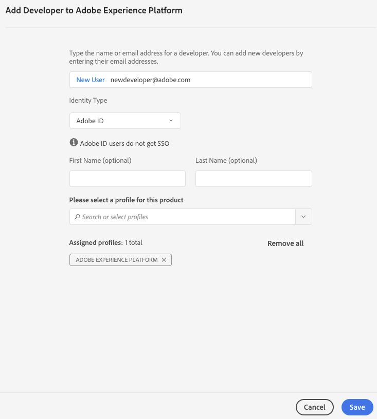

# [!DNL Experience Platform]-APIs authentifizieren und darauf zugreifen

Dieses Dokument bietet eine schrittweise Anleitung zum Zugriff auf ein Adobe Experience Platform-Entwicklerkonto, um Aufrufe an [!DNL Experience Platform]-APIs durchzuführen.

## Authentifizieren, um API-Aufrufe tätigen zu können

Um die Sicherheit Ihrer Anwendungen und Benutzer zu gewährleisten, müssen alle Anfragen an Adobe I/O-APIs mit Standards wie OAuth und JSON Web Tokens (JWT) authentifiziert und autorisiert werden. Die JWT wird dann zusammen mit kundenspezifischen Informationen verwendet, um Ihr persönliches Zugriffstoken zu generieren.

In dieser Anleitung werden die Authentifizierungsschritte durch Erstellung eines Zugriffstokens beschrieben, wie im folgenden Flussdiagramm dargestellt:


## Voraussetzungen

Für die erfolgreiche Ausführung von Aufrufen an [!DNL Experience Platform]-APIs benötigen Sie Folgendes:

* Eine IMS-Organisation mit Zugriff auf Adobe Experience Platform
* Ein registriertes Adobe ID-Konto
* Einen Admin Console-Administrator, der Sie als **Entwickler** und **Benutzer** für ein Produkt hinzufügt.

In den folgenden Abschnitten werden die Schritte zum Erstellen einer Adobe ID sowie zum Einrichten eines Entwicklers und Benutzers für eine Organisation erläutert.

### Adobe ID erstellen

Wenn Sie keine Adobe ID haben, können Sie wie folgt eine erstellen:

1. Wechseln Sie zu [Adobe Developer Console](https://console.adobe.io)
2. Wählen Sie **[!UICONTROL Erstellen Sie ein neues Konto]**
3. Schließen Sie den Anmeldevorgang ab.

## Entwickler und Benutzer für [!DNL Experience Platform] für eine Organisation werden

Vor der Erstellung von Integrationen in Adobe I/O muss Ihr Konto über Entwicklerberechtigungen für ein Produkt in einer IMS-Organisation verfügen. Ausführliche Informationen zu Entwicklerkonten in der Admin Console finden Sie im [Support-Dokument](https://helpx.adobe.com/de/enterprise/using/manage-developers.html) für das Verwalten von Entwicklern.

**Entwicklerzugriff erlangen**

Wenden Sie sich an einen [!DNL Admin Console]-Administrator in Ihrer Organisation, um Sie als Entwickler für eines der Produkte Ihrer Organisation mit dem [[!DNL Admin Console]](https://adminconsole.adobe.com/) hinzuzufügen.


Der Administrator muss Sie als Entwickler mindestens einem Produktprofil zuweisen, damit Sie fortfahren können.



Nachdem Sie als Entwickler zugewiesen sind, verfügen Sie über Zugriffsberechtigungen und können Integrationen in [Adobe I/O](https://www.adobe.com/go/devs_console_ui_de) erstellen. Bei diesen Integrationen handelt es sich um eine Pipeline von externen Apps und Diensten zur Adobe-API.

**Benutzerzugriff erlangen**

Ihr [!DNL Admin Console]-Administrator muss Sie auch als Benutzer zum Produkt hinzufügen.


Ähnlich wie beim Hinzufügen eines Entwicklers muss der Administrator Sie mindestens einem Profil zuweisen, damit Sie fortfahren können.


## Erstellen von Zugriffsberechtigungen in der Adobe Developer Console

>[!NOTE]
>
>Wenn Sie diesem Dokument im [Privacy Service-Entwicklerhandbuch](../privacy-service/api/getting-started.md) folgen, können Sie jetzt zu diesem Handbuch zurückkehren, um die eindeutigen Zugriffsberechtigungen für [!DNL Privacy Service] zu generieren.

Mit der Adobe Developer Console müssen Sie die folgenden drei Zugriffsberechtigungen generieren:

* `{IMS_ORG}`
* `{API_KEY}`
* `{ACCESS_TOKEN}`

Ihre `{IMS_ORG}` und `{API_KEY}` müssen nur einmal generiert werden und können in zukünftigen [!DNL Platform]-API-Aufrufen wiederverwendet werden. Ihr `{ACCESS_TOKEN}` ist jedoch temporär und muss alle 24 Stunden neu generiert werden.

Die Schritte werden nachfolgend detailliert beschrieben.

### Einmalige Einrichtung

Wechseln Sie zu [Adobe Developer Console](https://www.adobe.com/go/devs_console_ui) und melden Sie sich bei Ihrem Adobe ID an. Führen Sie anschließend die Schritte aus, die im Lernprogramm [Erstellen eines leeren Projekts](https://www.adobe.io/apis/experienceplatform/console/docs.html#!AdobeDocs/adobeio-console/master/projects-empty.md) in der Adobe Developer Console-Dokumentation beschrieben werden.

Nachdem Sie ein neues Projekt erstellt haben, wählen Sie im Bildschirm **Projektübersicht** die Option **[!UICONTROL Hinzufügen-API]**.


Der Bildschirm **Hinzufügen eine API** wird angezeigt. Wählen Sie das Produktsymbol für Adobe Experience Platform und dann **[!UICONTROL Experience Platform-API]**, bevor Sie **[!UICONTROL Weiter]** auswählen.


Nachdem Sie [!DNL Experience Platform] als API ausgewählt haben, die dem Projekt hinzugefügt werden soll, führen Sie die im Lernprogramm unter [Hinzufügen einer API zu einem Projekt mithilfe eines Dienstkontos (JWT)](https://www.adobe.io/apis/experienceplatform/console/docs.html#!AdobeDocs/adobeio-console/master/services-add-api-jwt.md) (beginnend mit dem Schritt &quot;API konfigurieren&quot;) beschriebenen Schritte aus, um den Prozess abzuschließen.

Nachdem die API zum Projekt hinzugefügt wurde, zeigt die Seite **Projektübersicht** die folgenden Anmeldeinformationen an, die bei allen Aufrufen von [!DNL Experience Platform]-APIs erforderlich sind:

* `{API_KEY}` (Client-ID)
* `{IMS_ORG}` (Organisations-ID)


### Authentifizierung für jede Sitzung

Die letzte erforderliche Berechtigung, die Sie erfassen müssen, ist Ihr `{ACCESS_TOKEN}`. Im Gegensatz zu den Werten für `{API_KEY}` und `{IMS_ORG}` muss alle 24 Stunden ein neues Token generiert werden, um weiterhin [!DNL Platform]-APIs verwenden zu können.

Um ein neues `{ACCESS_TOKEN}` zu generieren, führen Sie die Schritte zum Generieren eines JWT-Tokens](https://www.adobe.io/apis/experienceplatform/console/docs.html#!AdobeDocs/adobeio-console/master/credentials.md) im Handbuch Entwicklerkonsole mit den Anmeldeinformationen aus.[

## Zugriffsberechtigungen testen

Nachdem Sie alle drei erforderlichen Anmeldeinformationen gesammelt haben, können Sie versuchen, den folgenden API-Aufruf durchzuführen. Dieser Aufruf Liste alle [!DNL Experience Data Model] (XDM)-Klassen im `global`-Container der Schema-Registrierung:

**API-Format**

```http
GET /global/classes
```

**Anfrage**

```SHELL
curl -X GET https://platform.adobe.io/data/foundation/schemaregistry/global/classes \
  -H 'Accept: application/vnd.adobe.xed-id+json' \
  -H 'Authorization: Bearer {ACCESS_TOKEN}' \
  -H 'x-api-key: {API_KEY}' \
  -H 'x-gw-ims-org-id: {IMS_ORG}'
```

**Antwort**

Wenn Ihre Antwort der unten stehenden ähnelt, sind Ihre Anmeldeinformationen gültig und funktionieren. (Diese Antwort wurde aus Platzgründen abgeschnitten.)

```JSON
{
  "results": [
    {
        "title": "XDM ExperienceEvent",
        "$id": "https://ns.adobe.com/xdm/context/experienceevent",
        "meta:altId": "_xdm.context.experienceevent",
        "version": "1"
    },
    {
        "title": "XDM Individual Profile",
        "$id": "https://ns.adobe.com/xdm/context/profile",
        "meta:altId": "_xdm.context.profile",
        "version": "1"
    }
  ]
}
```

## Postman für JWT-Authentifizierung und API-Aufrufe verwenden

[Postman](https://www.postman.com/) ist ein beliebtes Tool zum Arbeiten mit RESTful-APIs. In diesem [Beitrag](https://medium.com/adobetech/using-postman-for-jwt-authentication-on-adobe-i-o-7573428ffe7f) wird beschrieben, wie Sie Postman so einrichten, dass automatisch eine JWT-Authentifizierung vorgenommen und für die Nutzung von Adobe Experience Platform-APIs verwendet wird.

## Nächste Schritte

Durch Lesen dieses Dokuments haben Sie Ihre Zugriffsberechtigungen für [!DNL Platform]-APIs gesammelt und erfolgreich getestet. Sie können nun die Beispiele im Handbuch [Erste Schritte für Plattform-APIs](api-guide.md) folgen. Dieses Handbuch enthält Links zu den API-Handbüchern für jeden Plattformdienst und enthält weitere Informationen. zu Fehlern, Postman und JSON.

Zusätzlich zu den Authentifizierungswerten, die Sie in diesem Lernprogramm gesammelt haben, benötigen viele [!DNL Platform]-APIs auch eine gültige `{SANDBOX_NAME}`-Kopfzeile. Weiterführende Informationen dazu finden Sie unter [Sandbox-Übersicht](../sandboxes/home.md).
