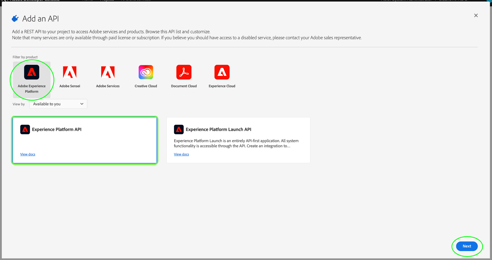

# Authentifizieren und Zugreifen auf Experience Platform-APIs

Dieses Dokument bietet eine schrittweise Anleitung zum Zugriff auf ein Adobe Experience Platform-Entwicklerkonto, um Experience Platform-APIs aufrufen zu können. Am Ende dieses Tutorials haben Sie die folgenden Anmeldeinformationen generiert oder erfasst, die als Kopfzeilen in allen Platform-API-Aufrufen erforderlich sind:

* `{ACCESS_TOKEN}`
* `{API_KEY}`
* `{ORG_ID}`

>[!TIP]
>
>Zusätzlich zu den drei oben genannten Anmeldedaten benötigen viele Platform-APIs auch eine gültige `{SANDBOX_NAME}` -Angabe als Kopfzeile. Weitere Informationen zu Sandboxes und zur Dokumentation [Sandbox-Verwaltungsendpunkt](/help/sandboxes/api/sandboxes.md#list) finden Sie in der [Sandbox-Übersicht](../sandboxes/home.md) . Dort finden Sie weitere Informationen zum Auflisten der für Ihr Unternehmen verfügbaren Sandboxes.

Um die Sicherheit Ihrer Anwendungen und Benutzer zu gewährleisten, müssen alle Anfragen an Experience Platform-APIs anhand von Standards wie OAuth authentifiziert und autorisiert werden.

In diesem Tutorial wird beschrieben, wie Sie die erforderlichen Anmeldeinformationen zum Authentifizieren von Platform-API-Aufrufen erfassen, wie im unten stehenden Flussdiagramm beschrieben. Sie können die meisten erforderlichen Anmeldeinformationen bei der ersten einmaligen Einrichtung erfassen. Das Zugriffstoken muss jedoch alle 24 Stunden aktualisiert werden.


## Voraussetzungen {#prerequisites}

Um Experience Platform-APIs erfolgreich aufrufen zu können, müssen Sie über Folgendes verfügen:

* Eine Organisation mit Zugriff auf Adobe Experience Platform.
* Ein Admin Console-Administrator, der Sie als Entwickler und Anwender für ein Produktprofil hinzufügen kann.
* Ein Experience Platform-Systemadministrator, der Ihnen die erforderlichen attributbasierten Zugriffssteuerungen gewähren kann, um Lese- oder Schreibvorgänge für verschiedene Experience Platform-Bereiche über APIs durchzuführen.

Sie müssen auch über eine Adobe ID verfügen, um dieses Tutorial abzuschließen. Wenn Sie keine Adobe ID haben, können Sie wie folgt eine erstellen:

1. Wechseln Sie zu [Adobe Developer Console](https://console.adobe.io).
2. Wählen Sie **[!UICONTROL Neues Konto erstellen]** aus.
3. Schließen Sie den Anmeldevorgang ab.

## Entwickler- und Benutzerzugriff für Experience Platform erlangen {#gain-developer-user-access}

Vor der Erstellung von Integrationen in Adobe Developer Console muss Ihr Konto über Entwickler- und Benutzerberechtigungen für ein Experience Platform-Produktprofil in Adobe Admin Console verfügen.

### Entwicklerzugriff erlangen {#gain-developer-access}

Wenden Sie sich an einen [!DNL Admin Console] -Administrator in Ihrer Organisation, um Sie als Entwickler einem Experience Platform-Produktprofil mit dem [[!DNL Admin Console]](https://adminconsole.adobe.com/) hinzuzufügen. Spezifische Anweisungen zum Verwalten des Entwicklerzugriffs für Produktprofile](https://helpx.adobe.com/de/enterprise/admin-guide.html/enterprise/using/manage-developers.ug.html) finden Sie in der Dokumentation zu [!DNL Admin Console] .[

Nachdem Sie als Entwickler zugewiesen wurden, können Sie mit der Erstellung von Integrationen in [Adobe Developer Console](https://www.adobe.com/go/devs_console_ui) beginnen. Bei diesen Integrationen handelt es sich um eine Pipeline von externen Apps und Diensten zu Adobe-APIs.

### Benutzerzugriff erlangen {#gain-user-access}

Ihr [!DNL Admin Console] -Administrator muss Sie auch als Benutzer demselben Produktprofil hinzufügen. Mit dem Benutzerzugriff können Sie in der Benutzeroberfläche das Ergebnis der von Ihnen ausgeführten API-Vorgänge anzeigen.

Weitere Informationen finden Sie im Handbuch zum Verwalten von Benutzergruppen in  [!DNL Admin Console]](https://helpx.adobe.com/enterprise/admin-guide.html/enterprise/using/user-groups.ug.html) .[

## API-Schlüssel (Client-ID) und Organisations-ID generieren {#generate-credentials}

>[!NOTE]
>
>Wenn Sie diesem Dokument aus dem [Privacy Service-API-Handbuch](../privacy-service/api/getting-started.md) folgen, können Sie jetzt zu diesem Handbuch zurückkehren, um die eindeutigen Zugriffsberechtigungen für [!DNL Privacy Service] zu generieren.

Nachdem Sie Entwickler- und Benutzerzugriff auf Platform über [!DNL Admin Console] erhalten haben, besteht der nächste Schritt darin, Ihre Anmeldedaten für `{ORG_ID}` und `{API_KEY}` in Adobe Developer Console zu generieren. Diese Anmeldeinformationen müssen nur einmal generiert werden und können in zukünftigen Platform-API-Aufrufen wiederverwendet werden.

>[!TIP]
>
>Statt zu Developer Console zu wechseln, können Sie alle Authentifizierungsberechtigungen, die Sie für die Arbeit mit Platform-APIs benötigen, direkt von den Seiten der API-Referenzdokumentation abrufen. [Mehr dazu](#get-credentials-functionality) über die Funktionalität.

### Experience Platform zu einem Projekt hinzufügen {#add-platform-to-project}

Wechseln Sie zur [Adobe-Entwicklerkonsole](https://www.adobe.com/go/devs_console_ui) und melden Sie sich mit Ihrer Adobe ID an. Führen Sie anschließend die Schritte aus, die im Tutorial [Erstellen eines leeren Projekts](https://developer.adobe.com/developer-console/docs/guides/projects/projects-empty/) in der Dokumentation zu Adobe Developer Console beschrieben werden.

Nachdem Sie ein neues Projekt erstellt haben, wählen Sie im Bildschirm **[!UICONTROL Projektübersicht]** die Option **[!UICONTROL API hinzufügen]** aus.

>[!TIP]
>
>Wenn Sie für mehrere Organisationen bereitgestellt sind, verwenden Sie die Organisationsauswahl in der oberen rechten Ecke der Benutzeroberfläche, um sicherzustellen, dass Sie sich in der gewünschten Organisation befinden.


Der Bildschirm **[!UICONTROL API hinzufügen]** wird angezeigt. Wählen Sie das Produktsymbol für Adobe Experience Platform und dann **[!UICONTROL Experience Platform-API]** aus, bevor Sie **[!UICONTROL Weiter]** auswählen.


>[!TIP]
>
>Wählen Sie die Option **[!UICONTROL Dokumente anzeigen]** aus, um in einem separaten Browserfenster zur vollständigen [Experience Platform API-Referenzdokumentation](https://developer.adobe.com/experience-platform-apis/) zu navigieren.

### Wählen Sie den Authentifizierungstyp [!UICONTROL OAuth Server-zu-Server] aus {#select-oauth-server-to-server}

Wählen Sie als Nächstes den Authentifizierungstyp [!UICONTROL OAuth Server-to-Server] aus, um Zugriffstoken zu generieren und auf die Experience Platform-API zuzugreifen.

>[!IMPORTANT]
>
>Die Methode **[!UICONTROL OAuth Server-to-Server]** ist die einzige Token-Generierungsmethode, die in Zukunft unterstützt wird. Die zuvor unterstützte Methode **[!UICONTROL Dienstkonto (JWT)]** wird nicht mehr unterstützt und kann nicht für neue Integrationen ausgewählt werden. Während vorhandene Integrationen, die die JWT-Authentifizierungsmethode verwenden, bis zum 1. Januar 2025 weiterhin funktionieren, empfiehlt Adobe dringend, vorhandene Integrationen vor diesem Datum auf die neue Methode [!UICONTROL OAuth Server-to-Server] zu migrieren. Weitere Informationen finden Sie im Abschnitt [!BADGE Veraltet] .{type=negative}[Generieren Sie ein JSON-Web-Token (JWT)](#jwt).


### Produktprofile für Ihre Integration auswählen {#select-product-profiles}

Wählen Sie im Bildschirm **[!UICONTROL API konfigurieren]** die Option **[!UICONTROL AEP-Default-All-Users]**.

<!--
Your integration's service account will gain access to granular features through the product profiles selected here.

-->

>[!IMPORTANT]
>
Um Zugriff auf bestimmte Funktionen in Platform zu erhalten, benötigen Sie außerdem einen Systemadministrator, der Ihnen die erforderlichen attributbasierten Zugriffssteuerungsberechtigungen erteilt. Weitere Informationen finden Sie im Abschnitt [Erhalten der erforderlichen attributbasierten Zugriffssteuerungsberechtigungen](#get-abac-permissions).


Wählen Sie **[!UICONTROL Konfigurierte API speichern]** aus, wenn Sie bereit sind.

Eine exemplarische Vorgehensweise zum Einrichten einer Integration mit der Experience Platform-API finden Sie auch im folgenden Video-Tutorial:

>[!VIDEO](https://video.tv.adobe.com/v/28832/?learn=on)

### Sammeln von Anmeldeinformationen {#gather-credentials}

Nachdem die API zum Projekt hinzugefügt wurde, zeigt die Seite **[!UICONTROL Experience Platform-API]** für das Projekt die folgenden Anmeldeinformationen an, die für alle Aufrufe an Experience Platform-APIs erforderlich sind:


* `{API_KEY}` ([!UICONTROL Client-ID])
* `{ORG_ID}` ([!UICONTROL Organisations-ID])

<!--


<!--

In addition to the above credentials, you also need the generated **[!UICONTROL Client Secret]** for a future step. Select **[!UICONTROL Retrieve client secret]** to reveal the value, and then copy it for later use.


-->

## Zugriffstoken generieren {#generate-access-token}

Der nächste Schritt besteht darin, eine `{ACCESS_TOKEN}` -Berechtigung für die Verwendung in Platform-API-Aufrufen zu generieren. Im Gegensatz zu den Werten für `{API_KEY}` und `{ORG_ID}` muss alle 24 Stunden ein neues Token generiert werden, um weiterhin Platform-APIs verwenden zu können. Wählen Sie &quot;**[!UICONTROL Zugriffs-Token generieren]**&quot;, wie unten dargestellt.


>[!TIP]
>
Sie können auch eine Postman-Umgebung und -Sammlung verwenden, um Zugriffstoken zu generieren. Weitere Informationen finden Sie im Abschnitt über die Verwendung von Postman zum Authentifizieren und Testen von API-Aufrufen](#use-postman).[

## Erstellen und Abrufen von Authentifizierungsberechtigungen direkt in der API-Referenzdokumentation {#get-credentials-functionality}

Ab der Experience Platform-Version November 2024 können Sie Anmeldeinformationen zur Verwendung der Experience Platform-APIs direkt von den API-Referenzseiten erhalten, ohne zu [!UICONTROL Developer Console] wechseln zu müssen. Sehen Sie sich das unten stehende Beispiel auf der Seite [Flow Service-API - Ziele ](https://developer.adobe.com/experience-platform-apis/references/destinations/) an.


Um Anmeldeinformationen zum Aufrufen von Platform-APIs abzurufen, navigieren Sie zu einer beliebigen Experience Platform-API-Referenzseite und wählen Sie oben auf der Seite die Option **[!UICONTROL Anmelden]** aus. Melden Sie sich mit Ihrem **[!UICONTROL persönlichen Konto]** oder Ihrem **[!UICONTROL Firmen- oder Schulkonto]** an.

Wählen Sie nach der Anmeldung **[!UICONTROL Neue Berechtigung erstellen]** aus, um einen neuen Satz von Anmeldedaten für den Zugriff auf Platform-APIs zu erstellen.


Verwenden Sie anschließend die Dropdown-Auswahl, um das Fenster mit den Anmeldedaten zu öffnen, ein Zugriffstoken zu generieren und Ihren API-Schlüssel und Ihre Organisations-ID abzurufen. Kopieren Sie die Anmeldeinformationen in die Bausteine [**[!UICONTROL Probieren Sie es]**](/help/release-notes/2024/may-2024.md#interactive-api-documentation) auf den API-Referenzseiten, um mit Platform-APIs zu arbeiten.


>[!TIP]
>
Der Berechtigungsblock am oberen Seitenrand wird weiterhin angezeigt, wenn Sie zwischen verschiedenen Endpunktseiten in der Experience Platform-API-Referenzdokumentation navigieren.

## [!BADGE Veraltet]{type=negative} Erstellen eines JSON-Web-Tokens (JWT) {#jwt}

>[!WARNING]
>
Die JWT-Methode zum Generieren von Zugriffs-Token wird nicht mehr unterstützt. Alle neuen Integrationen müssen mit der [Authentifizierungsmethode OAuth-Server-zu-Server](#select-oauth-server-to-server) erstellt werden. Für Adobe müssen Sie Ihre vorhandenen Integrationen bis zum 1. Januar 2025 zur OAuth-Methode migrieren, damit Ihre Integrationen weiterhin funktionieren. Lesen Sie die folgende wichtige Dokumentation:
> 
* [Migrationshandbuch für Ihre Anwendungen von JWT zu OAuth](https://developer.adobe.com/developer-console/docs/guides/authentication/ServerToServerAuthentication/migration/)
* [Implementierungshandbuch für neue und alte Programme mit OAuth](https://developer.adobe.com/developer-console/docs/guides/authentication/ServerToServerAuthentication/implementation/)
* [Vorteile der Verwendung der OAuth Server-zu-Server-Anmeldemethode](https://developer.adobe.com/developer-console/docs/guides/authentication/ServerToServerAuthentication/migration/#why-oauth-server-to-server-credentials)

+++ Eingestellte Informationen anzeigen

Der nächste Schritt besteht darin, ein JSON Web Token (JWT) basierend auf Ihren Kontoanmeldeinformationen zu generieren. Dieser Wert wird verwendet, um Ihre `{ACCESS_TOKEN}` -Anmeldedaten für die Verwendung in Platform-API-Aufrufen zu generieren, die alle 24 Stunden neu generiert werden müssen.

>[!IMPORTANT]
>
Im Rahmen dieses Tutorials wird in den folgenden Schritten beschrieben, wie Sie ein JWT in Developer Console generieren. Diese Erzeugungsmethode sollte jedoch nur zu Test- und Auswertungszwecken verwendet werden.
>
Für die normale Verwendung muss die JWT automatisch generiert werden. Weitere Informationen zum programmgesteuerten Generieren von JWTs finden Sie im [Authentifizierungshandbuch für Dienstkonten](https://www.adobe.io/developer-console/docs/guides/authentication/JWT/) in Adobe Developer.

Wählen Sie im linken Navigationsbereich **[!UICONTROL Dienstkonto (JWT)]** und dann **[!UICONTROL JWT generieren]** aus.


Fügen Sie in das unter **[!UICONTROL Benutzerdefiniertes JWT generieren]** bereitgestellte Textfeld den Inhalt des privaten Schlüssels ein, den Sie zuvor beim Hinzufügen der Platform-API zu Ihrem Dienstkonto generiert haben. Wählen Sie dann **[!UICONTROL Token generieren]** aus.


Die Seite wird aktualisiert und zeigt das generierte JWT sowie einen cURL-Beispielbefehl an, mit dem Sie ein Zugriffstoken generieren können. Wählen Sie für diese Anleitung **[!UICONTROL Kopieren]** neben **[!UICONTROL Generiertes JWT]** aus, um das Token in die Zwischenablage zu kopieren.


**Zugriffstoken generieren**

Nachdem Sie ein JWT generiert haben, können Sie es in einem API-Aufruf verwenden, um Ihre `{ACCESS_TOKEN}` zu generieren. Im Gegensatz zu den Werten für `{API_KEY}` und `{ORG_ID}` muss alle 24 Stunden ein neues Token generiert werden, um weiterhin Platform-APIs verwenden zu können.

**Anfrage**

Die folgende Anfrage generiert eine neue `{ACCESS_TOKEN}` , die auf den in der Payload angegebenen Anmeldeinformationen basiert. Dieser Endpunkt akzeptiert nur Formulardaten als Payload und muss daher eine `Content-Type` -Kopfzeile von `multipart/form-data` erhalten.

```shell
curl -X POST https://ims-na1.adobelogin.com/ims/exchange/jwt \
  -H 'Content-Type: multipart/form-data' \
  -F 'client_id={API_KEY}' \
  -F 'client_secret={SECRET}' \
  -F 'jwt_token={JWT}'
```

| Eigenschaft | Beschreibung |
| --- | --- |
| `{API_KEY}` | Die `{API_KEY}` ([!UICONTROL Client-ID]), die Sie in einem [vorherigen Schritt](#api-ims-secret) abgerufen haben. |
| `{SECRET}` | Das Client-Geheimnis, das Sie in einem [vorherigen Schritt](#api-ims-secret) abgerufen haben. |
| `{JWT}` | Das JWT, das Sie in einem [vorherigen Schritt](#jwt) generiert haben. |

>[!NOTE]
>
Sie können denselben API-Schlüssel, dasselbe Client-Geheimnis und dasselbe JWT verwenden, um ein neues Zugriffstoken für jede Sitzung zu generieren. Auf diese Weise können Sie die Erstellung von Zugriffstoken in Ihren Anwendungen automatisieren.

**Antwort**

```json
{
  "token_type": "bearer",
  "access_token": "{ACCESS_TOKEN}",
  "expires_in": 86399992
}
```

| Eigenschaft | Beschreibung |
| --- | --- |
| `token_type` | Der Typ of Token zurückgegeben. Für Zugriffstoken ist dieser Wert immer `bearer`. |
| `access_token` | Die generierte `{ACCESS_TOKEN}`. Dieser Wert, dem das Wort `Bearer` vorangestellt ist, ist als Kopfzeile `Authentication` für alle Platform-API-Aufrufe erforderlich. |
| `expires_in` | Die Anzahl der Millisekunden, die bis zum Ablauf des Zugriffstokens verbleiben. Sobald dieser Wert 0 erreicht, muss ein neues Zugriffstoken generiert werden, um weiterhin Platform-APIs verwenden zu können. |

+++

## Zugriffsberechtigungen testen {#test-credentials}

Nachdem Sie alle drei erforderlichen Anmeldeinformationen - Zugriffstoken, API-Schlüssel und Organisations-ID - erfasst haben, können Sie versuchen, den folgenden API-Aufruf durchzuführen. Dieser Aufruf listet alle standardmäßigen [!DNL Experience Data Model] -Klassen (XDM) auf, die für Ihr Unternehmen verfügbar sind. Importieren Sie den -Aufruf und führen Sie ihn in [Postman](#use-postman) aus.

>[!BEGINSHADEBOX]

**Anfrage**

```SHELL
curl -X GET https://platform.adobe.io/data/foundation/schemaregistry/global/classes \
  -H 'Accept: application/vnd.adobe.xed-id+json' \
  -H 'Authorization: Bearer {{ACCESS_TOKEN}}' \
  -H 'x-api-key: {{API_KEY}}' \
  -H 'x-gw-ims-org-id: {{ORG_ID}}'
```

**Antwort**

Wenn Ihre Antwort der unten gezeigten ähnelt, sind Ihre Anmeldedaten gültig und funktionieren. (Diese Antwort wurde aus Platzgründen abgeschnitten.)

```JSON
{
  "results": [
    {
        "title": "XDM ExperienceEvent",
        "$id": "https://ns.adobe.com/xdm/context/experienceevent",
        "meta:altId": "_xdm.context.experienceevent",
        "version": "1"
    },
    {
        "title": "XDM Individual Profile",
        "$id": "https://ns.adobe.com/xdm/context/profile",
        "meta:altId": "_xdm.context.profile",
        "version": "1"
    }
  ]
}
```

>[!ENDSHADEBOX]

>[!IMPORTANT]
>
Der obige Aufruf reicht zwar aus, um Ihre Zugriffsberechtigungen zu testen, beachten Sie jedoch, dass Sie nicht auf mehrere Ressourcen zugreifen oder sie ändern können, ohne über die richtigen attributbasierten Zugriffssteuerungsberechtigungen zu verfügen. Weitere Informationen finden Sie unten im Abschnitt **Abrufen der erforderlichen attributbasierten Zugriffssteuerungsberechtigungen** .

## Abrufen der erforderlichen attributbasierten Zugriffssteuerungsberechtigungen {#get-abac-permissions}

Um auf verschiedene Ressourcen innerhalb von Experience Platform zugreifen oder sie ändern zu können, benötigen Sie die entsprechenden Zugriffssteuerungsberechtigungen. Systemadministratoren können Ihnen die erforderlichen [Berechtigungen erteilen. ](/help/access-control/ui/permissions.md) Weitere Informationen finden Sie im Abschnitt über die Verwaltung von API-Anmeldeinformationen für eine Rolle ](/help/access-control/abac/ui/permissions.md#manage-api-credentials-for-role).[

Ausführliche Informationen dazu, wie ein Systemadministrator die erforderlichen Berechtigungen für den Zugriff auf Platform-Ressourcen über die API gewähren kann, finden Sie auch im folgenden Video-Tutorial:

>[!VIDEO](https://video.tv.adobe.com/v/28832/?learn=on&t=159)

## Verwenden von Postman zum Authentifizieren und Testen von API-Aufrufen {#use-postman}

[Postman](https://www.postman.com/) ist ein beliebtes Tool, mit dem Entwickler RESTful-APIs untersuchen und testen können. Sie können Sammlungen und Umgebungen in Experience Platform Postman verwenden, um die Arbeit mit Experience Platform-APIs zu beschleunigen. Erfahren Sie mehr über die Verwendung von [Postman in Experience Platform](/help/landing/postman.md) und die ersten Schritte mit Sammlungen und Umgebungen.

Detaillierte Informationen zur Verwendung von Postman mit Experience Platform-Sammlungen und -Umgebungen finden Sie auch in den folgenden Video-Tutorials:

**Laden Sie eine Postman-Umgebung herunter und importieren Sie sie, um sie mit Experience Platform-APIs zu verwenden**

>[!VIDEO](https://video.tv.adobe.com/v/28832/?learn=on&t=106)

**Verwenden einer Postman-Sammlung zum Generieren von Zugriffstoken**

Laden Sie die [Identity Management Service Postman-Sammlung](https://github.com/adobe/experience-platform-postman-samples/tree/master/apis/ims) herunter und sehen Sie sich das folgende Video an, um zu erfahren, wie Sie Zugriffstoken generieren.

>[!VIDEO](https://video.tv.adobe.com/v/29698/?learn=on)

**Laden Sie Experience Platform API Postman-Sammlungen herunter und interagieren Sie mit den APIs**

>[!VIDEO](https://video.tv.adobe.com/v/29704/?learn=on)

<!--
This [Medium post](https://medium.com/adobetech/using-postman-for-jwt-authentication-on-adobe-i-o-7573428ffe7f) describes how you can set up Postman to automatically perform JWT authentication and use it to consume Platform APIs.
-->

## Systemadministratoren: Gewähren Sie Entwicklern und API-Zugriffskontrolle mit Experience Platform-Berechtigungen {#grant-developer-and-api-access-control}

>[!NOTE]
>
Nur Systemadministratoren können API-Anmeldeinformationen in den Berechtigungen anzeigen und verwalten.

Vor der Erstellung von Integrationen in Adobe Developer Console muss Ihr Konto über Entwickler- und Benutzerberechtigungen für ein Experience Platform-Produktprofil in Adobe Admin Console verfügen.

### Hinzufügen von Entwicklern zum Produktprofil {#add-developers-to-product-profile}

Wechseln Sie zu [[!DNL Admin Console]](https://adminconsole.adobe.com/) und melden Sie sich mit Ihrer Adobe ID an.

Wählen Sie **[!UICONTROL Produkte]** und dann **[!UICONTROL Adobe Experience Platform]** aus der Produktliste aus.


Wählen Sie auf der Registerkarte **[!UICONTROL Produktprofile]** die Option **[!UICONTROL AEP-Default-All-Users]**. Alternativ können Sie über die Suchleiste nach dem Produktprofil suchen, indem Sie den Namen eingeben.


Wählen Sie die Registerkarte **[!UICONTROL Entwickler]** und dann **[!UICONTROL Entwickler hinzufügen]** aus.


Geben Sie die **[!UICONTROL E-Mail-Adresse oder den Benutzernamen]** des Entwicklers ein. Eine gültige [!UICONTROL E-Mail- oder Benutzername] zeigt die Entwicklerdetails an. Wählen Sie **[!UICONTROL Speichern]** aus.


Der Entwickler wurde erfolgreich hinzugefügt und wird auf der Registerkarte [!UICONTROL Entwickler] angezeigt.


<!--

Commenting out this part since it duplicates information from the section Add Experience Platform to a project

### Set up an API

A developer can add and configure an API within a project in the Adobe Developer Console.

Select your project, then select **[!UICONTROL Add API]**.


In the **[!UICONTROL Add an API]** dialog box select **[!UICONTROL Adobe Experience Platform]**, then select **[!UICONTROL Experience Platform API]**.



In the **[!UICONTROL Configure API]** screen, select **[!UICONTROL AEP-Default-All-Users]**.

-->

### Zuweisen der API zu einer Rolle

Ein Systemadministrator kann Rollen in der Experience Platform-Benutzeroberfläche APIs zuweisen.

Wählen Sie **[!UICONTROL Berechtigungen]** und die Rolle aus, der Sie die API hinzufügen möchten. Wählen Sie die Registerkarte **[!UICONTROL API-Anmeldeinformationen]** und dann **[!UICONTROL API-Anmeldeinformationen hinzufügen]** aus.

Registerkarte 

Wählen Sie die API aus, die Sie der Rolle hinzufügen möchten, und wählen Sie dann **[!UICONTROL Speichern]** aus.


Sie werden zur Registerkarte [!UICONTROL API-Anmeldeinformationen] zurückgeleitet, auf der die neu hinzugefügte API aufgeführt ist.

Registerkarte 

## Zusätzliche Ressourcen {#additional-resources}

Weitere Informationen zu den ersten Schritten mit Experience Platform-APIs finden Sie in den folgenden zusätzlichen Ressourcen

* Seite mit Experience Platform-APIs](https://experienceleague.adobe.com/docs/platform-learn/tutorials/platform-api-authentication.html?lang=de) für Video-Tutorials [authentifizieren und aufrufen
* [Postman-Sammlung des Identity Management-Diensts](https://github.com/adobe/experience-platform-postman-samples/tree/master/apis/ims) zum Generieren von Zugriffstoken
* [Experience Platform API Postman-Sammlungen ](https://github.com/adobe/experience-platform-postman-samples/tree/master/apis/experience-platform)

## Nächste Schritte {#next-steps}

Durch Lesen dieses Dokuments haben Sie Ihre Zugangsdaten für Platform-APIs gesammelt und erfolgreich getestet. Sie können nun den Beispiel-API-Aufrufen folgen, die in der gesamten [Dokumentation](../landing/documentation/overview.md) bereitgestellt werden.

Zusätzlich zu den Authentifizierungswerten, die Sie in diesem Tutorial gesammelt haben, benötigen viele Platform-APIs auch eine gültige `{SANDBOX_NAME}` -Angabe als Kopfzeile. Weiterführende Informationen dazu finden Sie unter [Sandbox-Übersicht](../sandboxes/home.md).