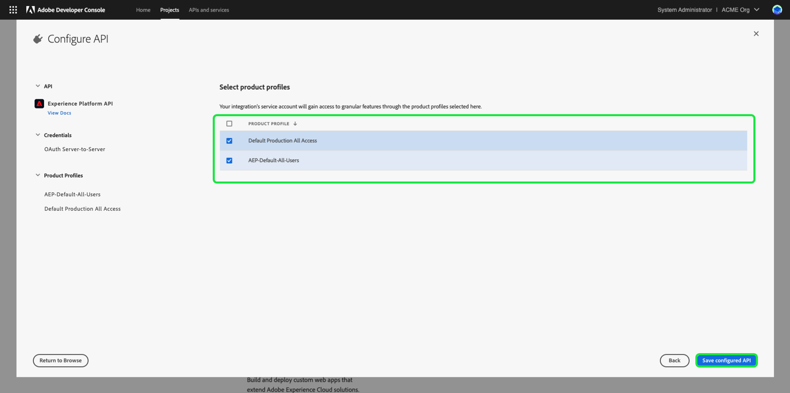

# Authentifizieren und Zugreifen auf Experience Platform-APIs

Dieses Dokument enthält eine Schritt-für-Schritt-Anleitung, wie Sie Zugriff auf ein Adobe Experience Platform-Entwicklerkonto erhalten, um Aufrufe an Experience Platform-APIs durchzuführen. Am Ende dieses Tutorials haben Sie die folgenden Anmeldeinformationen generiert oder gesammelt, die als Kopfzeilen in allen Experience Platform-API-Aufrufen erforderlich sind:

* `{ACCESS_TOKEN}`
* `{API_KEY}`
* `{ORG_ID}`

>[!TIP]
>
>Zusätzlich zu den drei oben genannten Anmeldeinformationen benötigen viele Experience Platform-APIs auch eine gültige `{SANDBOX_NAME}` als Kopfzeile. Weitere Informationen zu Sandboxes und der Dokumentation [Sandbox-Management-Endpunkt](../sandboxes/home.md) finden Sie in der [Sandbox-Übersicht](/help/sandboxes/api/sandboxes.md#list) mit Informationen zur Auflistung der für Ihre Organisation verfügbaren Sandboxes.

Um die Sicherheit Ihrer Programme und Benutzer zu gewährleisten, müssen alle Anfragen an Experience Platform-APIs mithilfe von Standards wie OAuth authentifiziert und autorisiert werden.

In diesem Tutorial wird beschrieben, wie Sie die erforderlichen Anmeldeinformationen sammeln, um Experience Platform-API-Aufrufe zu authentifizieren, wie im folgenden Flussdiagramm beschrieben. Die meisten erforderlichen Anmeldeinformationen können bei der einmaligen Ersteinrichtung erfasst werden. Das Zugriffs-Token muss jedoch alle 24 Stunden aktualisiert werden.


## Voraussetzungen {#prerequisites}

Um Experience Platform-APIs erfolgreich aufrufen zu können, benötigen Sie Folgendes:

* Ein Unternehmen mit Zugriff auf Adobe Experience Platform.
* Ein Admin Console-Administrator, der Sie als Entwickler und Benutzende für ein Produktprofil hinzufügen kann.
* Ein Experience Platform-Systemadministrator, der Ihnen die erforderlichen attributbasierten Zugriffssteuerungen gewähren kann, um Lese- oder Schreibvorgänge über APIs für verschiedene Teile von Experience Platform durchzuführen.

Sie müssen auch über eine Adobe ID verfügen, um dieses Tutorial abzuschließen. Wenn Sie keine Adobe ID haben, können Sie wie folgt eine erstellen:

1. Zu [Adobe Developer Console](https://console.adobe.io).
2. Wählen Sie **[!UICONTROL Neues Konto erstellen]** aus.
3. Schließen Sie den Anmeldevorgang ab.

## Erhalten von Entwicklungs- und Benutzerzugriff für Experience Platform {#gain-developer-user-access}

Bevor Sie Integrationen in Adobe Developer Console erstellen können, muss Ihr Konto über Entwickler- und Benutzerberechtigungen für ein Experience Platform-Produktprofil in Adobe Admin Console verfügen.

### Erhalten von Entwicklerzugriff {#gain-developer-access}

Wenden Sie sich an einen Admin Console-Administrator in Ihrer Organisation, um Sie als Entwicklungsperson einem Experience Platform-Produktprofil hinzuzufügen. Admin Console Spezifische Anweisungen zum Verwalten des [ für Produktprofile finden Sie in der Dokumentation zu ](https://helpx.adobe.com/de/enterprise/admin-guide.html/enterprise/using/manage-developers.ug.html).

Sobald Sie als Entwickler zugewiesen sind, können Sie mit der Erstellung von Integrationen in [Adobe Developer Console](https://www.adobe.com/go/devs_console_ui) beginnen. Diese Integrationen sind eine Pipeline von externen Apps und Services zu Adobe-APIs.

### Erhalten von Benutzerzugriff {#gain-user-access}

Ihr Admin Console-Administrator muss Sie ebenfalls als Benutzende demselben Produktprofil hinzufügen. Beim Benutzerzugriff können Sie in der Benutzeroberfläche das Ergebnis der von Ihnen durchgeführten API-Vorgänge sehen.

Weitere Informationen finden Sie [ Handbuch unter „Verwalten von Benutzergruppen ](https://helpx.adobe.com/enterprise/admin-guide.html/enterprise/using/user-groups.ug.html) Admin Console&quot;.

## API-Schlüssel (Client-ID) und Organisations-ID generieren {#generate-credentials}

>[!NOTE]
>
>Wenn Sie diesem Dokument aus dem [Privacy Service-API-Handbuch](../privacy-service/api/getting-started.md) folgen, können Sie jetzt zu diesem Handbuch zurückkehren, um die für [!DNL Privacy Service] eindeutigen Zugriffsberechtigungen zu generieren.

Nachdem Sie über Admin Console Entwickler- und Benutzerzugriff auf Experience Platform erhalten haben, besteht der nächste Schritt darin, Ihre `{ORG_ID}`- und `{API_KEY}`-Anmeldeinformationen in Adobe Developer Console zu generieren. Diese Anmeldeinformationen müssen nur einmal generiert werden und können in zukünftigen Experience Platform-API-Aufrufen wiederverwendet werden.

>[!TIP]
>
>Anstatt zu Developer Console zu wechseln, können Sie alle Authentifizierungsdaten, die Sie für die Arbeit mit Experience Platform-APIs benötigen, direkt über die API-Referenzdokumentationsseiten abrufen. [Weitere Informationen](#get-credentials-functionality) über die Funktion.

### Experience Platform zu einem Projekt hinzufügen {#add-platform-to-project}

Wechseln Sie zur [Adobe-Entwicklerkonsole](https://www.adobe.com/go/devs_console_ui) und melden Sie sich mit Ihrer Adobe ID an. Führen Sie anschließend die Schritte aus, die im Tutorial [Erstellen eines leeren Projekts](https://developer.adobe.com/developer-console/docs/guides/projects/projects-empty/) in der Dokumentation zu Adobe Developer Console beschrieben werden.

Nachdem Sie ein neues Projekt erstellt haben, wählen Sie **[!UICONTROL API hinzufügen]** auf dem Bildschirm **[!UICONTROL Projektübersicht]** aus.

>[!TIP]
>
>Wenn Sie für mehrere Organisationen bereitgestellt wurden, verwenden Sie die Organisationsauswahl in der rechten oberen Ecke der Benutzeroberfläche von , um sicherzustellen, dass Sie sich in der gewünschten Organisation befinden.


Der Bildschirm **[!UICONTROL API hinzufügen]** wird angezeigt. Wählen Sie das Produktsymbol für **[!UICONTROL Adobe Experience Platform]** und dann **[!UICONTROL Experience Platform API]** aus, bevor Sie auf **[!UICONTROL Weiter]** klicken.


>[!TIP]
>
>Wählen Sie die Option **[!UICONTROL Dokumente anzeigen]**, um in einem separaten Browserfenster zur vollständigen [Experience Platform API-Referenzdokumentation zu navigieren](https://developer.adobe.com/experience-platform-apis/).

### Wählen Sie den Authentifizierungstyp [!UICONTROL OAuth Server-zu-Server] aus {#select-oauth-server-to-server}

Wählen Sie als Nächstes den **[!UICONTROL OAuth Server-zu-Server]**-Authentifizierungstyp aus, um Zugriffstoken zu generieren und auf die Experience Platform-API zuzugreifen. Geben Sie Ihrer Berechtigung einen aussagekräftigen Namen im Textfeld **[!UICONTROL Berechtigungsname]**, bevor Sie auf **[!UICONTROL Weiter]** klicken.

>[!IMPORTANT]
>
>Die **[!UICONTROL OAuth Server-zu-Server]**-Methode ist die einzige Token-Erzeugungsmethode, die in Zukunft unterstützt wird. Die zuvor unterstützte Methode **[!UICONTROL Service Account (JWT]** ist veraltet und kann nicht für neue Integrationen ausgewählt werden. Während bestehende Integrationen, die die JWT-Authentifizierungsmethode verwenden, bis zum 30. Juni 2025 weiterhin funktionieren, empfiehlt Adobe dringend, vorhandene Integrationen vor diesem Datum zu der neuen [!UICONTROL OAuth Server-to-Server]-Methode zu migrieren. Weitere Informationen finden Sie im Abschnitt [!BADGE Veraltet]{type=negative} [Generieren eines JSON-Web-Tokens (JWT)](#jwt).


### Auswählen der Produktprofile für Ihre Integration {#select-product-profiles}

Wählen Sie auf dem **[!UICONTROL API konfigurieren]** die Option **[!UICONTROL AEP-Default-All-Users]** sowie alle weiteren Produktprofile aus, auf die Sie Zugriff erhalten möchten.

>[!IMPORTANT]
>
>Um Zugriff auf bestimmte Funktionen in Experience Platform zu erhalten, benötigen Sie außerdem einen Systemadministrator, der Ihnen die erforderlichen attributbasierten Zugriffssteuerungsberechtigungen gewährt. Weitere Informationen finden Sie im Abschnitt [Abrufen der erforderlichen attributbasierten Zugriffssteuerungsberechtigungen](#get-abac-permissions).



Wählen Sie **[!UICONTROL Konfigurierte API speichern]** wenn Sie bereit sind.

Eine exemplarische Vorgehensweise der oben beschriebenen Schritte zum Einrichten einer Integration mit der Experience Platform-API ist ebenfalls im folgenden Video-Tutorial verfügbar:

>[!VIDEO](https://video.tv.adobe.com/v/28832/?learn=on)

### Sammeln von Anmeldeinformationen {#gather-credentials}

Nachdem die API zum Projekt hinzugefügt wurde, zeigt die Seite **[!UICONTROL OAuth Server-zu-Server]** für das Projekt die folgenden Anmeldeinformationen an, die für alle Aufrufe an Experience Platform-APIs erforderlich sind:


* `{API_KEY}` ([!UICONTROL Client ID])
* `{ORG_ID}` ([!UICONTROL Organization ID])

<!--


<!--

In addition to the above credentials, you also need the generated **[!UICONTROL Client Secret]** for a future step. Select **[!UICONTROL Retrieve client secret]** to reveal the value, and then copy it for later use.


-->

## Erstellen eines Zugriffs-Tokens {#generate-access-token}

Der nächste Schritt besteht darin, eine `{ACCESS_TOKEN}` für die Verwendung in Experience Platform-API-Aufrufen zu generieren. Im Gegensatz zu den Werten für `{API_KEY}` und `{ORG_ID}` muss alle 24 Stunden ein neues Token generiert werden, um Experience Platform-APIs weiterhin verwenden zu können. Wählen Sie **[!UICONTROL Zugriffs-Token generieren]** aus, wodurch Ihr Zugriffs-Token generiert wird, wie unten dargestellt.


>[!TIP]
>
>Sie können auch eine Postman-Umgebung und -Sammlung verwenden, um Zugriffs-Token zu generieren. Weitere Informationen finden Sie im Abschnitt über [Verwenden von Postman zum Authentifizieren und Testen von API-Aufrufen](#use-postman).

## Authentifizierungsdaten direkt in der API-Referenzdokumentation erstellen und abrufen {#get-credentials-functionality}

Ab der Experience Platform-Version vom November 2024 können Sie Anmeldedaten für die Verwendung der Experience Platform-APIs direkt von den API-Referenzseiten aus erhalten, ohne zu [!UICONTROL Developer Console wechseln zu &#x200B;]. Sehen Sie sich das folgende Beispiel auf der Seite [Flow Service-API - Ziele“ ](https://developer.adobe.com/experience-platform-apis/references/destinations/).


Um Anmeldeinformationen zum Aufrufen von Experience Platform-APIs zu erhalten, navigieren Sie zu einer beliebigen Experience Platform-API-Referenzseite und wählen **[!UICONTROL Anmelden]** oben auf der Seite aus. Melden Sie sich mit Ihrem **[!UICONTROL Persönlichen Konto]** oder **[!UICONTROL Firmen- oder Schulkonto]** an.

Wählen Sie nach der Anmeldung **[!UICONTROL Neue Anmeldedaten erstellen]** aus, um einen neuen Satz von Anmeldedaten für den Zugriff auf Experience Platform-APIs zu erstellen.


Verwenden Sie als Nächstes die Dropdown-Auswahl, um das Fenster mit den Anmeldedaten zu öffnen, ein Zugriffstoken zu generieren und Ihren API-Schlüssel und Ihre Organisations-ID abzurufen. Kopieren Sie die Anmeldeinformationen in die [**[!UICONTROL Probieren Sie es aus]**](/help/release-notes/2024/may-2024.md#interactive-api-documentation) Blöcke auf den API-Referenzseiten, um mit der Arbeit mit Experience Platform-APIs zu beginnen.


>[!TIP]
>
>Der Anmeldedaten-Block „Seitenanfang“ wird weiterhin angezeigt, wenn Sie zwischen verschiedenen Endpunktseiten in der Experience Platform-API-Referenzdokumentation navigieren.

## [!BADGE Veraltet]{type=negative} Erstellen eines JSON Web Token (JWT) {#jwt}

>[!WARNING]
>
>Die JWT-Methode zum Generieren von Zugriffs-Token wird nicht mehr unterstützt. Alle neuen Integrationen müssen mit der [Authentifizierungsmethode OAuth-Server-zu-Server](#select-oauth-server-to-server) erstellt werden. Adobe erfordert außerdem, dass Sie Ihre vorhandenen Integrationen bis zum 30. Juni 2025 zur OAuth-Methode migrieren, damit Ihre Integrationen weiterhin funktionieren. Lesen Sie die folgende wichtige Dokumentation:
> 
> * [Migrationshandbuch für Ihre Programme von JWT zu OAuth](https://developer.adobe.com/developer-console/docs/guides/authentication/ServerToServerAuthentication/migration/)
> * [Implementierungshandbuch für neue und alte Programme mit OAuth](https://developer.adobe.com/developer-console/docs/guides/authentication/ServerToServerAuthentication/implementation/)
> * [Vorteile der Verwendung der OAuth Server-zu-Server-Anmeldedaten-Methode](https://developer.adobe.com/developer-console/docs/guides/authentication/ServerToServerAuthentication/migration/#why-oauth-server-to-server-credentials)

+++ Anzeigen veralteter Informationen

Der nächste Schritt besteht darin, ein JSON Web Token (JWT) basierend auf Ihren Kontoanmeldeinformationen zu generieren. Dieser Wert wird verwendet, um Ihre `{ACCESS_TOKEN}` Anmeldedaten für die Verwendung in Experience Platform-API-Aufrufen zu generieren, die alle 24 Stunden neu generiert werden müssen.

>[!IMPORTANT]
>
>In diesem Tutorial wird in den folgenden Schritten beschrieben, wie Sie ein JWT in Developer Console generieren. Diese Erzeugungsmethode sollte jedoch nur zu Test- und Auswertungszwecken verwendet werden.
>
>Für die reguläre Verwendung muss der JWT automatisch generiert werden. Weitere Informationen zum programmgesteuerten Generieren von JWTs finden Sie im [Service Account Authentication Guide](https://www.adobe.io/developer-console/docs/guides/authentication/JWT/) auf Adobe Developer.

Wählen Sie **[!UICONTROL linken Navigationsbereich Dienstkonto (]**) und dann **[!UICONTROL JWT generieren]** aus.


Fügen Sie in das Textfeld unter **[!UICONTROL Benutzerdefiniertes JWT generieren]** den Inhalt des privaten Schlüssels ein, den Sie zuvor beim Hinzufügen der Experience Platform-API zu Ihrem Service-Konto generiert haben. Wählen Sie dann **[!UICONTROL Token generieren]** aus.


Die Seite wird aktualisiert und zeigt das generierte JWT zusammen mit einem cURL-Beispielbefehl an, mit dem Sie ein Zugriffs-Token generieren können. Wählen Sie für die Zwecke dieses Tutorials die Option **[!UICONTROL Kopieren]** neben **[!UICONTROL Generiertes JWT]** aus, um das Token in die Zwischenablage zu kopieren.


**Erstellen eines Zugriffstokens**

Nachdem Sie ein JWT generiert haben, können Sie es in einem API-Aufruf verwenden, um Ihre `{ACCESS_TOKEN}` zu generieren. Im Gegensatz zu den Werten für `{API_KEY}` und `{ORG_ID}` muss alle 24 Stunden ein neues Token generiert werden, um Experience Platform-APIs weiterhin verwenden zu können.

**Anfrage**

Die folgende Anfrage generiert eine neue `{ACCESS_TOKEN}` basierend auf den in der Payload angegebenen Anmeldeinformationen. Dieser Endpunkt akzeptiert ausschließlich Formulardaten als Payload und muss daher mit einem `Content-Type`-Header von `multipart/form-data` versehen werden.

```shell
curl -X POST https://ims-na1.adobelogin.com/ims/exchange/jwt \
  -H 'Content-Type: multipart/form-data' \
  -F 'client_id={API_KEY}' \
  -F 'client_secret={SECRET}' \
  -F 'jwt_token={JWT}'
```

| Eigenschaft | Beschreibung |
| --- | --- |
| `{API_KEY}` | Die `{API_KEY}` ([!UICONTROL Client ID]), die Sie in einem [vorherigen Schritt) ](#api-ims-secret). |
| `{SECRET}` | Das Client-Geheimnis, das Sie in einem [vorherigen Schritt) abgerufen ](#api-ims-secret). |
| `{JWT}` | Das JWT, das Sie in einem [vorherigen Schritt“ generiert ](#jwt). |

>[!NOTE]
>
>Sie können denselben API-Schlüssel, denselben geheimen Client-Schlüssel und denselben JWT verwenden, um für jede Sitzung ein neues Zugriffs-Token zu generieren. Auf diese Weise können Sie die Erstellung von Zugriffstoken in Ihren Programmen automatisieren.

**Antwort**

```json
{
  "token_type": "bearer",
  "access_token": "{ACCESS_TOKEN}",
  "expires_in": 86399992
}
```

| Eigenschaft | Beschreibung |
| --- | --- |
| `token_type` | Der Typ des zurückgegebenen Tokens. Bei Zugriffs-Token ist dieser Wert immer `bearer`. |
| `access_token` | Die generierte `{ACCESS_TOKEN}`. Dieser Wert, dem das Wort `Bearer` vorangestellt ist, ist als `Authentication` für alle Experience Platform-API-Aufrufe erforderlich. |
| `expires_in` | Die Anzahl der Millisekunden, die bis zum Ablauf des Zugriffstokens verbleiben. Sobald dieser Wert 0 erreicht, muss ein neues Zugriffstoken generiert werden, um Experience Platform-APIs weiterhin verwenden zu können. |

+++

## Testen von Zugriffsberechtigungen {#test-credentials}

Nachdem Sie alle drei erforderlichen Anmeldeinformationen - Zugriffstoken, API-Schlüssel und Organisations-ID - erfasst haben, können Sie versuchen, den folgenden API-Aufruf durchzuführen. Dieser Aufruf listet alle standardmäßigen [!DNL Experience Data Model] (XDM)-Klassen auf, die für Ihre Organisation verfügbar sind. Importieren und Ausführen des Aufrufs in [Postman](#use-postman).

>[!BEGINSHADEBOX]

**Anfrage**

```SHELL
curl -X GET https://platform.adobe.io/data/foundation/schemaregistry/global/classes \
  -H 'Accept: application/vnd.adobe.xed-id+json' \
  -H 'Authorization: Bearer {{ACCESS_TOKEN}}' \
  -H 'x-api-key: {{API_KEY}}' \
  -H 'x-gw-ims-org-id: {{ORG_ID}}'
```

**Antwort**

Wenn Ihre Antwort der unten gezeigten ähnelt, sind Ihre Anmeldedaten gültig und funktionieren. (Diese Antwort wurde aus Platzgründen abgeschnitten.)

```JSON
{
  "results": [
    {
        "title": "XDM ExperienceEvent",
        "$id": "https://ns.adobe.com/xdm/context/experienceevent",
        "meta:altId": "_xdm.context.experienceevent",
        "version": "1"
    },
    {
        "title": "XDM Individual Profile",
        "$id": "https://ns.adobe.com/xdm/context/profile",
        "meta:altId": "_xdm.context.profile",
        "version": "1"
    }
  ]
}
```

>[!ENDSHADEBOX]

>[!IMPORTANT]
>
>Der obige Aufruf reicht zwar aus, um Ihre Zugriffsberechtigungen zu testen, doch beachten Sie, dass Sie ohne die richtigen attributbasierten Zugriffssteuerungsberechtigungen nicht auf mehrere Ressourcen zugreifen oder diese ändern können. Weitere Informationen finden Sie **folgenden Abschnitt Abrufen der erforderlichen attributbasierten Zugriffssteuerungsberechtigungen**.

## Abrufen der erforderlichen attributbasierten Zugriffssteuerungsberechtigungen {#get-abac-permissions}

Um auf mehrere Ressourcen in Experience Platform zugreifen oder diese ändern zu können, benötigen Sie die entsprechenden Zugriffssteuerungsberechtigungen. Systemadministratoren können Ihnen die [erforderlichen Berechtigungen“ ](/help/access-control/ui/permissions.md). Weitere Informationen finden Sie im Abschnitt [Verwalten von API-Anmeldeinformationen für eine Rolle](/help/access-control/abac/ui/permissions.md#manage-api-credentials-for-role).

Detaillierte Informationen dazu, wie ein Systemadministrator bzw. eine Systemadministratorin die erforderlichen Berechtigungen für den Zugriff auf Experience Platform-Ressourcen über die API gewähren kann, finden Sie im folgenden Video-Tutorial:

>[!VIDEO](https://video.tv.adobe.com/v/28832/?learn=on&t=159)

## Verwenden von Postman zum Authentifizieren und Testen von API-Aufrufen {#use-postman}

[Postman](https://www.postman.com/) ist ein beliebtes Tool, mit dem Entwickler RESTful-APIs untersuchen und testen können. Sie können Experience Platform Postman-Sammlungen und -Umgebungen verwenden, um Ihre Arbeit mit Experience Platform-APIs zu beschleunigen. Lesen Sie mehr über [Verwendung von Postman in Experience Platform](/help/landing/postman.md) und die ersten Schritte mit Sammlungen und Umgebungen.

Detaillierte Informationen zur Verwendung von Postman mit Experience Platform-Sammlungen und -Umgebungen finden Sie in den folgenden Video-Tutorials:

**Herunterladen und Importieren einer Postman-Umgebung zur Verwendung mit Experience Platform-APIs**

>[!VIDEO](https://video.tv.adobe.com/v/28832/?learn=on&t=106)

**Verwenden Sie eine Postman-Sammlung, um Zugriffstoken zu generieren**

Laden Sie die Postman-Sammlung für den [Identity Management](https://github.com/adobe/experience-platform-postman-samples/tree/master/apis/ims)Service herunter und sehen Sie sich das folgende Video an, um zu erfahren, wie Sie Zugriffs-Token generieren.

>[!VIDEO](https://video.tv.adobe.com/v/29698/?learn=on)

**Herunterladen von Postman-Sammlungen der Experience Platform-API und Interaktion mit den APIs**

>[!VIDEO](https://video.tv.adobe.com/v/29704/?learn=on)

<!--
This [Medium post](https://medium.com/adobetech/using-postman-for-jwt-authentication-on-adobe-i-o-7573428ffe7f) describes how you can set up Postman to automatically perform JWT authentication and use it to consume Experience Platform APIs.
-->

## Systemadministratoren: Gewähren von Entwickler- und API-Zugriffskontrolle mit Experience Platform-Berechtigungen {#grant-developer-and-api-access-control}

Bevor Sie Integrationen in Adobe Developer Console erstellen können, muss Ihr Konto über Entwickler- und Benutzerberechtigungen für ein Experience Platform-Produktprofil verfügen.

>[!NOTE]
>
>Nur Systemadministratoren können API-Anmeldeinformationen in Berechtigungen anzeigen und verwalten.

### Hinzufügen von Entwicklern zum Produktprofil {#add-developers-to-product-profile}

Navigieren Sie zur [Admin Console](https://adminconsole.adobe.com/) und melden Sie sich mit Ihrer Adobe ID an.

Wählen **[!UICONTROL in]** Navigationsleiste „Produkte“ und dann **[!UICONTROL Adobe Experience Platform]** aus der Liste der Produkte aus.


Wählen Sie auf der **[!UICONTROL Produktprofile]** die Option **[!UICONTROL AEP-Default-All-Users]** aus. Alternativ können Sie über die Suchleiste nach dem Produktprofil suchen, indem Sie den Namen eingeben.


Wählen Sie die Registerkarte **[!UICONTROL Entwickler]** und dann **[!UICONTROL Entwickler hinzufügen]** aus.


Das **[!UICONTROL Entwickler hinzufügen]** wird angezeigt. Geben Sie die E-**[!UICONTROL -Adresse oder den Benutzernamen des Entwicklers]**. Eine gültige [!UICONTROL E-Mail oder Benutzername] zeigt die Details für den Entwickler an. Wählen Sie **[!UICONTROL Speichern]** aus.


Der Entwickler wurde erfolgreich hinzugefügt und wird auf der Registerkarte **[!UICONTROL Entwickler]** angezeigt.


### Zuweisen von API-Anmeldeinformationen zu einer Rolle

>[!NOTE]
>
> Nur ein Systemadministrator kann in der Experience Platform-Benutzeroberfläche APIs zu Rollen zuweisen.

Um Experience Platform-APIs verwenden und Vorgänge damit durchführen zu können, muss ein Systemadministrator die API-Anmeldeinformationen zusätzlich zu den jeweiligen Berechtigungen einer Rolle hinzufügen. Weitere Informationen finden Sie im Abschnitt [Verwalten von API-Anmeldeinformationen für eine Rolle](../access-control/abac/ui/permissions.md#manage-api-credentials-for-a-role).

Eine exemplarische Vorgehensweise der oben beschriebenen Schritte zum Hinzufügen von Entwicklern zu Produktprofilen und zum Zuweisen von APIs zu Rollen ist ebenfalls im folgenden Video-Tutorial verfügbar:

>[!VIDEO](https://video.tv.adobe.com/v/3426407/?learn=on)

## Zusätzliche Ressourcen {#additional-resources}

Weitere Informationen zu den ersten Schritten mit Experience Platform-APIs finden Sie in den unten verlinkten zusätzlichen Ressourcen

* Seite [Experience Platform-APIs authentifizieren und aufrufen](https://experienceleague.adobe.com/docs/platform-learn/tutorials/platform-api-authentication.html?lang=de) Video-Tutorials
* [Identity Management Service Postman Collection](https://github.com/adobe/experience-platform-postman-samples/tree/master/apis/ims) zum Generieren von Zugriffstoken
* [Experience Platform API Postman-Sammlungen](https://github.com/adobe/experience-platform-postman-samples/tree/master/apis/experience-platform)

## Nächste Schritte {#next-steps}

Durch das Lesen dieses Dokuments haben Sie Ihre Zugriffsberechtigungen für Experience Platform-APIs gesammelt und erfolgreich getestet. Sie können jetzt den Beispiel-API-Aufrufen folgen, die in der ([) bereitgestellt ](../landing/documentation/overview.md).

Zusätzlich zu den Authentifizierungswerten, die Sie in diesem Tutorial gesammelt haben, benötigen viele Experience Platform-APIs auch eine gültige `{SANDBOX_NAME}` als Kopfzeile. Weiterführende Informationen dazu finden Sie unter [Sandbox-Übersicht](../sandboxes/home.md).
