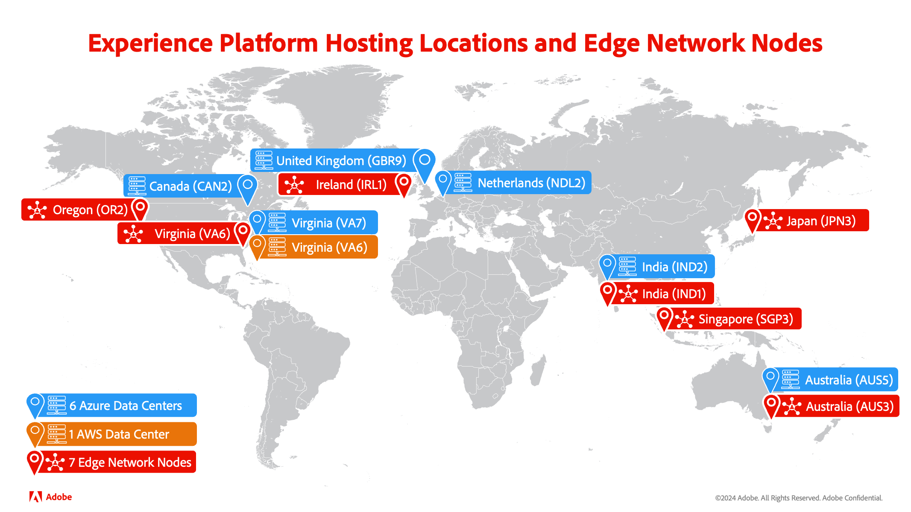

# Vergleich von Edge Network und Hub

Adobe Experience Platform ist eines der leistungsfähigsten, flexibelsten und offensten auf dem Markt verfügbaren Systeme für die Einrichtung und Verwaltung umfassender Lösungen zur Umsetzung starker Kundenerlebnisse. Mit Experience Platform können Sie Kundendaten und Inhalte aus beliebigen Systemen zentral zusammenführen und standardisieren. Zusätzlich können Sie mithilfe von Datenwissenschaft und maschinellem Lernen die Gestaltung und Bereitstellung umfassender, personalisierter Erlebnisse erheblich verbessern. Platform bietet daher mehrere Möglichkeiten zur Verarbeitung Ihrer Daten, sodass Sie Ihre Daten optimal auswerten können.

## Servertypen

In Platform können Daten auf zwei verschiedenen Pfaden verarbeitet werden: Adobe Experience Platform Hub für Batch- und Streaming-Workflows und Edge Network für Echtzeit-Erlebnisse.

### Adobe Experience Platform Hub

Hub ist ein zentrales Rechenzentrum, das sich zentral befindet und alle historischen Daten und den umfangreichen Profilkontext enthält, die in Adobe Experience Platform erfasst wurden. Auf diese Weise können Sie stabilere und vollständigere Daten an Ihre nachgelagerten -Services senden und empfangen. Daher sollte „hub“ in Szenarien verwendet werden, in denen die **Gründlichkeit** der Daten wichtiger ist.

Zu den verfügbaren Services auf dem -Hub gehören die folgenden:

- Batch-Segmentierung
- Streaming-Segmentierung 
- Profile
- Ziele
- Identitätsdiagramm
- Data Distiller - Abfrage-Service
- Quell-Connectoren

### Experience Platform Edge Network

Edge Network ist ein Server, der sich physisch in der Nähe verschiedener geografischer Standorte befindet. Diese Rechenzentren verarbeiten alle Daten, die über die SDK Extensions und Edge Network-APIs erfasst werden. Die einzigen Daten, die in der Edge Network vorhanden sind, sind die Zielgruppenzugehörigkeiten, Profilidentitäten und Attribute, die für die Personalisierung erforderlich sind.

Mit Edge Network können Sie Daten aufgrund ihrer größeren Nähe zum Endbenutzer schneller an Ihre Kunden senden und empfangen. Darüber hinaus können Sie Edge Network verwenden, um Anfragen zur Ereignisweiterleitung und Tag-Management-Anfragen zu verarbeiten. Edge Network verarbeitet jedoch nur **Verhaltensdaten**. Daher sollte Edge Network in Szenarien verwendet werden, in denen die **Geschwindigkeit** der Daten wichtiger ist.

Zu den verfügbaren Services auf Edge Network gehören die folgenden:

- Edge-Segmentierung
- Edge-Profile
- Edge-Ziele
- Datenerfassung
- SDK-Erweiterungen

## Standorte

Im folgenden Abschnitt werden die Speicherorte für Hub und Edge Network aufgelistet.

**Hub**

- VA7 (Virginia, USA)
- NLD2 (Niederlande)
- AUS5 (Australien)
- CAN2 (Kanada)
- GBR9 (Vereinigtes Königreich)
- IND1 (Indien)

**Edge Network**

- OR2 (Oregon, USA)
- VA6 (Virginia, USA)
- IRL1 (Irland)
- IND1 (Indien)
- SGP3 (Singapur)
- AUS3 (Australien)
- JPN3 (Japan)

Detailliertere Informationen zu den verfügbaren Serverstandorten finden Sie in der [Multi-Cloud-Übersicht](./multi-cloud.md#available-cloud-regions).

## Nächste Schritte

Nach dem Lesen dieser Übersicht wissen Sie jetzt, welche Unterschiede es zwischen der Verarbeitung von Daten auf Adobe Experience Platform Hub und Adobe Experience Platform Edge Network gibt.

## Anhang

Im folgenden Abschnitt finden Sie zusätzliche Informationen zur Verarbeitung von Daten in Adobe Experience Platform.

### Häufig gestellte Fragen

Im folgenden Abschnitt finden Sie häufig gestellte Fragen zu Hub und Edge Network:

#### Welche Szenarien eignen sich am besten für einen Hub?

Hub eignet sich am besten für Szenarien **in denen die** der Daten wichtiger ist. Angenommen, Sie möchten eine Marketing-Kampagne erstellen, die sich an alle Kunden richtet, die ihren Warenkorb verlassen haben. In diesem Fall können Sie die Batch-Segmentierung verwenden, eine Zielgruppe erstellen, die mit den Benutzenden des Transaktionsabbruchs übereinstimmt, und sie an ein Batch-Ziel exportieren.

#### Welche Szenarien eignen sich am besten für Edge Network?

Edge Network eignet sich am besten für Szenarien **in denen die** der Daten wichtiger ist. Angenommen, Sie müssen einen begrenzten Flash-Verkauf erstellen, um einen Kunden anzusprechen, der Ihre Site mit einem Produkt in seinem Warenkorb durchsucht. In diesem Anwendungsfall können Sie die Edge-Segmentierung verwenden, sodass Sie Benutzende mit einem Produkt im Warenkorb sofort ansprechen und eine personalisierte Benachrichtigung mit einem „Flash-Verkauf“ senden können.

#### Welche Daten werden vom Hub an Edge Network übermittelt?

Nur Daten, die für die Bereitstellung von Echtzeit-Erlebnissen am Edge benötigt werden, werden vom Hub in Edge Network geladen. Diese Daten werden automatisch vom Hub an Edge Network gesendet, um letztendlich konsistent zu bleiben, und nur für bis zu 14 Tage aufbewahrt. Dies bedeutet jedoch **nicht** dass die Daten perfekt mit den Daten im Hub synchronisiert sind. Daher kann es zwischen dem Hub und Edge Network zu Unterschieden bei den verfügbaren Daten kommen.
