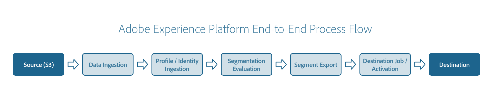

# Adobe Experience Platform-Beispiel-Workflow

Adobe Experience Platform ist eines der leistungsfähigsten, flexibelsten und offensten auf dem Markt verfügbaren Systeme für die Einrichtung und Verwaltung umfassender Lösungen zur Umsetzung starker Kundenerlebnisse. Mit Platform können Unternehmen Kundendaten und Inhalte aus beliebigen Systemen zentral zusammenführen und standardisieren sowie mithilfe von Datenwissenschaft und maschinellem Lernen die Gestaltung und Bereitstellung umfassender, personalisierter Erlebnisse erheblich verbessern.

Basierend auf RESTful-APIs stellt Platform Entwicklern die vollständige Funktionalität des Systems zur Verfügung und unterstützt so die einfache Integration von Unternehmenslösungen mit vertrauten Tools. Mit Platform können Sie eine ganzheitliche Sicht auf Ihre Kunden gewinnen, indem Sie Ihre Kundendaten erfassen, Ihre Daten auf die Zielgruppen segmentieren und diese Zielgruppen für ein externes Ziel aktivieren. Das folgende Tutorial zeigt einen durchgehenden Workflow, der alle Schritte von der Erfassung über Quellen bis zur Aktivierung der Zielgruppe über Ziele enthält.

## Erste Schritte

Dieser durchgängige Workflow verwendet mehrere Adobe Experience Platform-Dienste. Im Folgenden finden Sie eine Liste der in diesem Workflow verwendeten Dienste mit Links zu ihren Übersichten:

- [[!DNL Experience Data Model (XDM)]](../xdm/home.md): Das standardisierte Framework, mit dem Kundenerlebnisdaten durch [!DNL Platform] organisiert werden. Um die Segmentierung optimal zu nutzen, stellen Sie sicher, dass Ihre Daten als Profile und Ereignisse gemäß den [Best Practices für die Datenmodellierung](../xdm/schema/best-practices.md) aufgenommen werden.
- [[!DNL Identity Service]](../identity-service/home.md): Bietet Ihnen einen umfassenden Überblick über Ihre Kunden und ihr Verhalten, indem Sie Identitäten zwischen Geräten und Systemen überbrücken.
- [Quellen](../sources/home.md): [!DNL Experience Platform] ermöglicht die Aufnahme von Daten aus verschiedenen Quellen und bietet Ihnen die Möglichkeit, die eingehenden Daten mithilfe von [!DNL Platform]-Services zu strukturieren, zu kennzeichnen und anzureichern.
- [[!DNL Segmentation Service]](../segmentation/home.md): [!DNL Segmentation Service] ermöglicht die Aufteilung der in [!DNL Experience Platform] gespeicherten Daten, die sich auf Einzelanwender (wie Kunden, Interessenten, Benutzer oder Organisationen) beziehen, in kleinere Gruppen.
- [[!DNL Real-Time Customer Profile]](../profile/home.md): Bietet ein einheitliches Echtzeit-Kundenprofil, das auf aggregierten Daten aus verschiedenen Quellen basiert.
- [Datensätze](../catalog/datasets/overview.md): Das Speicher- und Verwaltungskonstrukt für die Datenpersistenz in [!DNL Experience Platform].
- [Ziele](../destinations/home.md): Ziele sind vordefinierte Integrationen mit häufig verwendeten Anwendungen, die die nahtlose Aktivierung von Daten aus Platform für kanalübergreifende Marketing-Kampagnen, E-Mail-Kampagnen, zielgruppengerechte Werbung und viele andere Anwendungsfälle ermöglichen.

## Erstellen eines XDM-Schemas

Bevor Sie Daten in Platform erfassen, müssen Sie zunächst ein XDM-Schema erstellen, um die Struktur dieser Daten zu beschreiben. Wenn Sie Ihre Daten im nächsten Schritt erfassen, ordnen Sie die eingehenden Daten diesem Schema zu. Informationen zum Erstellen eines Beispiel-XDM-Schemas finden Sie im Tutorial zu [Erstellen eines Schemas mit dem Schema Editor](../xdm/tutorials/create-schema-ui.md).

Im obigen Tutorial erfahren Sie, wie Sie Identitätsfelder für Ihre Schemas festlegen. Ein Identitätsfeld stellt ein Feld dar, das zur Identifizierung einer Einzelperson verwendet werden kann, die mit einem Datensatz- oder Zeitreihenereignis verbunden ist. Identitätsfelder sind eine entscheidende Komponente bei der Erstellung von Identitätsdiagrammen für Kunden in Platform. Dies hat letztendlich Auswirkungen darauf, wie Echtzeit-Kundenprofil verschiedene Datenfragmente zusammenführt, um eine vollständige Ansicht des Kunden zu erhalten. Weitere Informationen zum Anzeigen von Identitätsdiagrammen in Platform finden Sie im Tutorial zu [Verwendung des Identitätsdiagramm-Viewers](../identity-service/features/identity-graph-viewer.md).

Sie müssen Ihr Schema für die Verwendung im Echtzeit-Kundenprofil aktivieren, damit Kundenprofile anhand der Daten basierend auf Ihrem Schema erstellt werden können. Siehe Abschnitt zu [Aktivieren eines Schemas für Profil](../xdm/ui/resources/schemas.md#profile) Weitere Informationen finden Sie im Handbuch zur Schemabenutzeroberfläche .

## Daten in Platform erfassen

Nachdem Sie ein XDM-Schema erstellt haben, können Sie damit beginnen, Ihre Daten in das System zu übertragen.

Alle Daten, die in Platform eingehen, werden bei der Erfassung in einzelnen Datensätzen gespeichert. Ein Datensatz ist eine Sammlung von Datensätzen, die einem bestimmten XDM-Schema zugeordnet sind. Bevor Ihre Daten von [!DNL Real-Time Customer Profile], muss der betreffende Datensatz spezifisch konfiguriert werden. Vollständige Anweisungen zum Aktivieren eines Datensatzes für Profile finden Sie in der [Handbuch zur Benutzeroberfläche von Datensätzen](../catalog/datasets/user-guide.md#enable-profile) und [API-Tutorial zur Datensatzkonfiguration](../profile/tutorials/dataset-configuration.md). Nachdem der Datensatz konfiguriert wurde, können Sie mit der Aufnahme von Daten beginnen.

Platform ermöglicht die Aufnahme von Daten aus externen Quellen und bietet spezielle Services, mittels derer Sie eingehende Daten strukturieren, beschriften und erweitern können. Daten können aus verschiedensten Quellen aufgenommen werden, darunter etwa Adobe-Anwendungen, Cloud-basierte Datenspeicher und Datenbanken. Sie können Ihre Daten beispielsweise mithilfe von [Amazon S3](../sources/tutorials/api/create/cloud-storage/s3.md). Eine vollständige Liste der verfügbaren Quellen finden Sie im [Übersicht über Quell-Connectoren](../sources/home.md).

Wenn Sie Amazon S3 als Quell-Connector verwenden, folgen Sie den Anweisungen im API-Tutorial zu [Erstellen eines Amazon S3-Connectors](../sources/tutorials/api/create/cloud-storage/s3.md) oder das UI-Tutorial in [Erstellen eines Amazon S3-Connectors](../sources/tutorials/ui/create/cloud-storage/s3.md) , um zu erfahren, wie Sie Daten im Connector erstellen, verbinden und erfassen.

Detaillierte Anweisungen zu Quell-Connectoren finden Sie im Abschnitt [Übersicht über Quell-Connectoren](../sources/home.md). Weitere Informationen zu Flow Service, der API, auf der die Quellen basieren, finden Sie in der [Referenz zur Flow Service-API](https://www.adobe.io/experience-platform-apis/references/flow-service/).

Sobald Ihre Daten über den Quell-Connector in Platform eingehen und in Ihrem Profil-aktivierten Datensatz gespeichert sind, werden Kundenprofile automatisch anhand der Identitätsdaten erstellt, die Sie in Ihrem XDM-Schema konfiguriert haben.

Beim erstmaligen Hochladen von Daten in einen neuen Datensatz oder beim Einrichten eines neuen ETL-Prozesses oder einer neuen Datenquelle wird empfohlen, die Daten sorgfältig zu überprüfen, um sicherzustellen, dass sie korrekt hochgeladen wurden und die generierten Profile die erwarteten Daten enthalten. Weitere Informationen zum Zugriff auf Kundenprofile in der Platform-Benutzeroberfläche finden Sie unter [Handbuch zur Benutzeroberfläche des Echtzeit-Kundenprofils](../profile/ui/user-guide.md). Weitere Informationen zum Zugriff auf Profile mithilfe der Echtzeit-Kundenprofil-API finden Sie im Handbuch unter [Verwenden des Entitäts-Endpunkts](../profile/api/entities.md).

## Daten bewerten

Nachdem Sie Profile aus Ihren erfassten Daten erfolgreich generiert haben, können Sie Ihre Daten mithilfe der Segmentierung bewerten. Bei der Segmentierung handelt es sich um den Prozess der Definition spezifischer Attribute oder Verhaltensweisen, die von einer Untergruppe von Einzelanwendern aus Ihrem Profilspeicher gemeinsam genutzt werden, um eine vermarktbare Personengruppe von Ihrem Kundenstamm zu unterscheiden. Weitere Informationen zur Segmentierung finden Sie in der [Übersicht über den Segmentierungsdienst](../segmentation/home.md).

### Erstellen einer Segmentdefinition

Zunächst müssen Sie eine Segmentdefinition erstellen, um Ihre Kunden zu einem Cluster zusammenzuführen und so Ihre Zielgruppe zu erstellen. Eine Segmentdefinition ist eine Sammlung von Regeln, mit denen Sie die Zielgruppe definieren können. Um eine Segmentdefinition zu erstellen, folgen Sie den Anweisungen im UI-Handbuch zur Verwendung der [Segment Builder](../segmentation/ui/segment-builder.md) oder das API-Tutorial in [Erstellen eines Segments](../segmentation/tutorials/create-a-segment.md).

Nachdem Sie eine Segmentdefinition erstellt haben, stellen Sie sicher, dass Sie die Segmentdefinitions-ID beachten.

### Segmentdefinition bewerten

Nachdem Sie Ihre Segmentdefinition erstellt haben, können Sie entweder einen Segmentauftrag erstellen, um das Segment als einmalige Instanz zu bewerten, oder einen Zeitplan erstellen, um das Segment laufend zu bewerten.

Um eine Segmentdefinition nach Bedarf zu bewerten, können Sie einen Segmentauftrag erstellen. Ein Segmentauftrag ist ein asynchroner Prozess, der ein neues Zielgruppensegment basierend auf der referenzierten Segmentdefinition und Zusammenführungsrichtlinien erstellt. Eine Zusammenführungsrichtlinie ist ein Regelsatz, mit dem Platform bestimmt, welche Daten zur Erstellung von Kundenprofilen verwendet werden und welche Daten bei Abweichungen zwischen Quellen priorisiert werden. Informationen zum Arbeiten mit Zusammenführungsrichtlinien finden Sie unter [UI-Handbuch zu Zusammenführungsrichtlinien](../profile/merge-policies/ui-guide.md).

Nachdem der Segmentauftrag erstellt und ausgewertet wurde, können Sie Informationen über das Segment abrufen, z. B. die Größe Ihrer Audience oder Fehler, die während der Verarbeitung aufgetreten sein können. Informationen zum Erstellen eines Segmentauftrags, einschließlich aller erforderlichen Details, finden Sie im Abschnitt [Entwicklerhandbuch für Segmentaufträge](../segmentation/api/segment-jobs.md).

Um eine Segmentdefinition laufend zu bewerten, können Sie einen Zeitplan erstellen und aktivieren. Ein Zeitplan ist ein Tool, mit dem automatisch ein Segmentauftrag einmal täglich zu einer bestimmten Zeit ausgeführt werden kann. Um zu erfahren, wie Sie einen Zeitplan erstellen und aktivieren, befolgen Sie die Anweisungen im API-Handbuch im [Endpunkt der Zeitpläne](../segmentation/api/schedules.md).

## Exportieren Sie die ausgewerteten Daten

Nachdem Sie Ihren einmaligen Segmentauftrag oder Ihren laufenden Zeitplan erstellt haben, können Sie entweder einen Segmentexportauftrag erstellen, um die Ergebnisse in einen Datensatz zu exportieren, oder die Ergebnisse an ein Ziel exportieren. Die folgenden Abschnitte enthalten Anleitungen zu beiden Optionen.

### Exportieren Sie Ihre ausgewerteten Daten in einen Datensatz

Nachdem Sie entweder Ihren einmaligen Segmentauftrag oder Ihren laufenden Zeitplan erstellt haben, können Sie die Ergebnisse exportieren, indem Sie einen Segmentexportauftrag erstellen. Ein Segmentexportauftrag ist eine asynchrone Aufgabe, die Informationen über die ausgewertete Zielgruppe an einen Datensatz sendet.

Bevor Sie einen Exportauftrag erstellen, müssen Sie zunächst einen Datensatz erstellen, in den die Daten exportiert werden sollen. Informationen zum Erstellen eines Datensatzes finden Sie im Abschnitt unter [Erstellen eines Zieldatensatzes](../segmentation/tutorials/evaluate-a-segment.md#create-dataset) im Tutorial zum Auswerten eines Segments, stellen Sie sicher, dass Sie die Datensatz-ID nach der Erstellung notieren. Nachdem Sie einen Datensatz erstellt haben, können Sie einen Exportauftrag erstellen. Um zu erfahren, wie Sie einen Exportauftrag erstellen, befolgen Sie die Anweisungen im API-Handbuch im [Endpunkt der Exportaufträge](../segmentation/api/export-jobs.md).

### Exportieren Sie Ihre ausgewerteten Daten in ein Ziel

Alternativ können Sie die Ergebnisse nach der Erstellung Ihres einmaligen Segmentauftrags oder Ihres fortlaufenden Zeitplans an ein Ziel exportieren. Ein Ziel ist ein Endpunkt, z. B. eine Adobe-Anwendung für einen externen Dienst, in der eine Zielgruppe aktiviert und bereitgestellt werden kann. Eine vollständige Liste der verfügbaren Ziele finden Sie im [Zielkatalog](../destinations/catalog/overview.md).

Anweisungen zum Aktivieren von Daten für Batch- oder E-Mail-Marketing-Ziele finden Sie im Tutorial zu [Aktivieren von Zielgruppendaten für Batch-Profil-Exportziele mithilfe der Platform-Benutzeroberfläche](../destinations/ui/activate-batch-profile-destinations.md) und [Anleitung zum Herstellen einer Verbindung zu Batch-Zielen und Aktivieren von Daten mithilfe der Flow Service-API](../destinations/api/connect-activate-batch-destinations.md).

## Überwachen von Platform-Datenaktivitäten

Mit Platform können Sie verfolgen, wie Daten mithilfe von Datenflüssen verarbeitet werden. Dabei handelt es sich um Darstellungen von Aufträgen, die Daten über die verschiedenen Komponenten von Platform hinweg verschieben. Diese Datenflüsse werden über verschiedene Dienste hinweg konfiguriert und helfen dabei, Daten aus Quell-Connectoren in Zieldatensätze zu verschieben, wo sie dann von [!DNL Identity Service] und [!DNL Real-Time Customer Profile] bevor sie schließlich für Ziele aktiviert werden. Das Monitoring-Dashboard bietet eine visuelle Darstellung des Journey eines Datenflusses. Informationen zum Überwachen von Datenflüssen in der Platform-Benutzeroberfläche finden Sie in den Tutorials zu [Überwachung von Datenflüssen für Quellen](../dataflows/ui/monitor-sources.md) und [Überwachen von Datenflüssen für Ziele](../dataflows/ui/monitor-destinations.md).

Sie können Platform-Aktivitäten auch mithilfe statistischer Metriken und Ereignisbenachrichtigungen überwachen, indem Sie [!DNL Observability Insights]. Sie können Benachrichtigungen über die Platform-Benutzeroberfläche abonnieren oder an einen konfigurierten Webhook senden. Weitere Informationen zum Anzeigen, Aktivieren, Deaktivieren und Abonnieren von verfügbaren Warnhinweisen über die Experience Platform-Benutzeroberfläche finden Sie in der [[!UICONTROL Warnhinweise] UI-Handbuch](../observability/alerts/ui.md). Weitere Informationen zum Empfang von Warnungen über Webhooks finden Sie im Handbuch unter [Abonnieren von Adobe I/O-Ereignisbenachrichtigungen](../observability/alerts/subscribe.md).

## Nächste Schritte

Durch Lesen dieses Tutorials erhalten Sie eine grundlegende Einführung in einen einfachen End-to-End-Fluss für Platform. Weitere Informationen zu Adobe Experience Platform finden Sie unter [Plattformübersicht](./home.md). Weitere Informationen zur Verwendung der Platform-Benutzeroberfläche und der Platform-API finden Sie in der [Handbuch zur Platform-Benutzeroberfläche](./ui-guide.md) und [Handbuch zur Platform-API](./api-guide.md) bzw.
