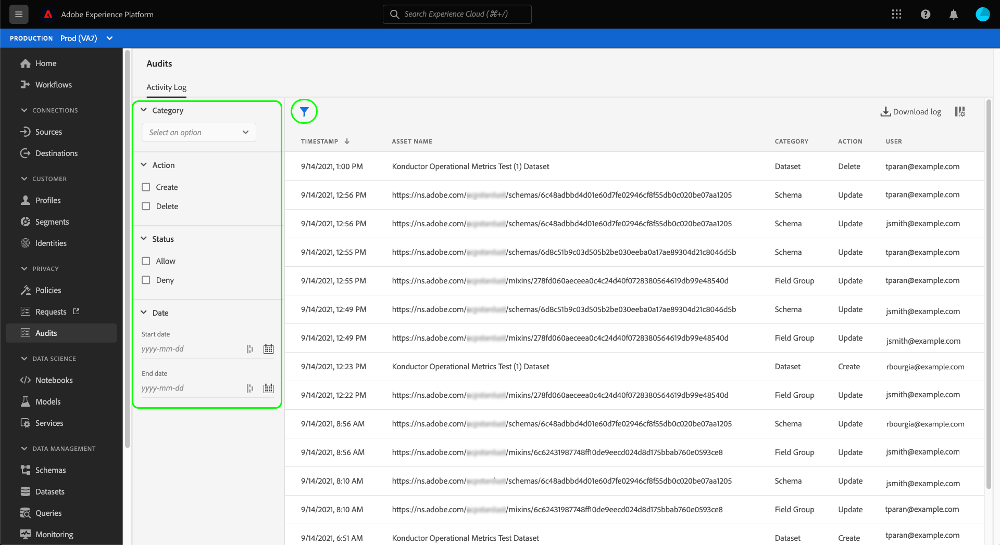

# Audit-Protokolle (Beta)

>[!IMPORTANT]
>
>Die Funktion &quot;Prüfprotokolle&quot;in Adobe Experience Platform befindet sich derzeit in der Betaphase und Ihr Unternehmen hat möglicherweise noch keinen Zugriff darauf. Die in dieser Dokumentation beschriebene Funktionalität kann sich ändern.

Um die Transparenz und Sichtbarkeit der im System durchgeführten Aktivitäten zu erhöhen, ermöglicht es Ihnen Adobe Experience Platform, die Benutzeraktivität für verschiedene Dienste und Funktionen in Form von &quot;Auditprotokollen&quot;zu überprüfen. Diese Protokolle bilden ein Audit-Protokoll, das Ihnen bei der Fehlerbehebung in Platform helfen und Ihrem Unternehmen helfen kann, die Richtlinien der Unternehmensdatenverwaltung und die gesetzlichen Anforderungen effektiv zu erfüllen.

In einem Prüfprotokoll wird **who** ausgeführt **what** Aktion und **when**. Jede in einem Protokoll aufgezeichnete Aktion enthält Metadaten, die den Aktionstyp, das Datum und die Uhrzeit, die E-Mail-ID des Benutzers, der die Aktion ausgeführt hat, und zusätzliche Attribute für den Aktionstyp angeben.

In diesem Dokument werden Auditprotokolle in Platform behandelt, einschließlich der Anzeige und Verwaltung in der Benutzeroberfläche oder API.

## Von Prüfprotokollen erfasste Ereignistypen {#category}

In der folgenden Tabelle sind die Aktionen aufgeführt, für die Ressourcen in Auditprotokollen aufgezeichnet werden:

| Ressource | Aktionen |
| --- | --- |
| [Datensatz](../../../catalog/datasets/overview.md) | <ul><li>Erstellung</li><li>Update</li><li>Löschen</li><li>Aktivieren für [Echtzeit-Kundenprofil](../../../profile/home.md)</li></ul> |
| [Schema](../../../xdm/schema/composition.md) | <ul><li>Erstellung</li><li>Aktualisieren</li><li>Löschen</li></ul> |
| [Klasse](../../../xdm/schema/composition.md#class) | <ul><li>Erstellung</li><li>Aktualisieren</li><li>Löschen</li></ul> |
| [Feldergruppe](../../../xdm/schema/composition.md#field-group) | <ul><li>Erstellung</li><li>Aktualisieren</li><li>Löschen</li></ul> |
| [Datentyp](../../../xdm/schema/composition.md#data-type) | <ul><li>Erstellung</li><li>Aktualisieren</li><li>Löschen</li></ul> |
| [Sandbox](../../../sandboxes/home.md) | <ul><li>Erstellung</li><li>Aktualisieren</li><li>Zurücksetzen</li><li>Löschen</li></ul> |
| [Ziel](../../../destinations/home.md) | <ul><li>Aktivieren</li></ul> |

## Zugriff auf Prüfprotokolle

Wenn die Funktion für Ihr Unternehmen aktiviert ist, werden bei auftretenden Aktivitäten automatisch Prüfprotokolle erfasst. Sie müssen die Protokollerfassung nicht manuell aktivieren.

Um Prüfprotokolle anzeigen und exportieren zu können, benötigen Sie die **[!UICONTROL Protokoll zu Benutzeraktivitäten anzeigen]** Zugriffskontrollberechtigung erteilt (zu finden unter [!UICONTROL Data Governance] Kategorie). Informationen zum Verwalten individueller Berechtigungen für Platform-Funktionen finden Sie im Abschnitt [Zugriffssteuerungsdokumentation](../../../access-control/home.md).

## Verwalten von Prüfprotokollen in der Benutzeroberfläche

Sie können Prüfprotokolle für verschiedene Funktionen der Experience Platform im **[!UICONTROL Prüfungen]** Arbeitsbereich in der Platform-Benutzeroberfläche. Der Arbeitsbereich zeigt eine Liste der aufgezeichneten Protokolle an, die standardmäßig von der letzten zur letzten sortiert sind.

Das System zeigt nur Prüfprotokolle aus dem letzten Jahr an. Alle Protokolle, die diese Beschränkung überschreiten, werden automatisch aus dem System entfernt.

Wählen Sie ein Ereignis aus der Liste aus, um seine Details in der rechten Leiste anzuzeigen.

### Auditprotokolle filtern

Wählen Sie das Trichtersymbol (), um eine Liste von Filtersteuerelementen anzuzeigen, die die Eingrenzung der Ergebnisse unterstützen.

Die folgenden Filter sind für Prüfereignisse in der Benutzeroberfläche verfügbar:

| Filter | Beschreibung |
| --- | --- |
| [!UICONTROL Kategorie] | Verwenden Sie das Dropdown-Menü, um die angezeigten Ergebnisse nach [category](#category). |
| [!UICONTROL Aktion] | Nach Aktion filtern. Derzeit nur [!UICONTROL Erstellen] und [!UICONTROL Löschen] -Aktionen gefiltert werden. |
| [!UICONTROL Zugriffssteuerungsstatus] | Filtern Sie nach, ob die Aktion zulässig (abgeschlossen) oder verweigert wurde, weil [Zugriffskontrolle](../../../access-control/home.md) Berechtigungen. |
| [!UICONTROL Datum] | Wählen Sie ein Startdatum und/oder ein Enddatum aus, um einen Datumsbereich zu definieren, nach dem die Ergebnisse gefiltert werden sollen. |

Um einen Filter zu entfernen, wählen Sie das &quot;X&quot;auf dem Pillensymbol für den betreffenden Filter aus oder wählen Sie **[!UICONTROL Alle löschen]** um alle Filter zu entfernen.

### Audit-Protokolle exportieren

Um die aktuelle Liste der Prüfprotokolle zu exportieren, wählen Sie **[!UICONTROL Protokoll herunterladen]**.

Wählen Sie im angezeigten Dialogfeld Ihr bevorzugtes Format aus (entweder **[!UICONTROL CSV]** oder **[!UICONTROL JSON]**), wählen Sie **[!UICONTROL Download]**. Der Browser lädt die generierte Datei herunter und speichert sie auf Ihrem Computer.

## Verwalten von Auditprotokollen in der API

Alle Aktionen, die Sie in der Benutzeroberfläche ausführen können, können auch über API-Aufrufe ausgeführt werden. Siehe [API-Referenzdokument](https://www.adobe.io/experience-platform-apis/references/audit-query/) für weitere Informationen.

## Verwalten von Auditprotokollen für Adobe Admin Console

Informationen zum Verwalten von Auditprotokollen für Aktivitäten in Adobe Admin Console finden Sie in den folgenden Abschnitten. [Dokument](https://helpx.adobe.com/enterprise/using/audit-logs.html).

## Nächste Schritte

In diesem Handbuch wurde beschrieben, wie Prüfprotokolle in Experience Platform verwaltet werden. Weitere Informationen zum Überwachen von Platform-Aktivitäten finden Sie in der Dokumentation zu [Observability Insights](../../../observability/home.md) und [Überwachen der Datenerfassung](../../../ingestion/quality/monitor-data-ingestion.md).
