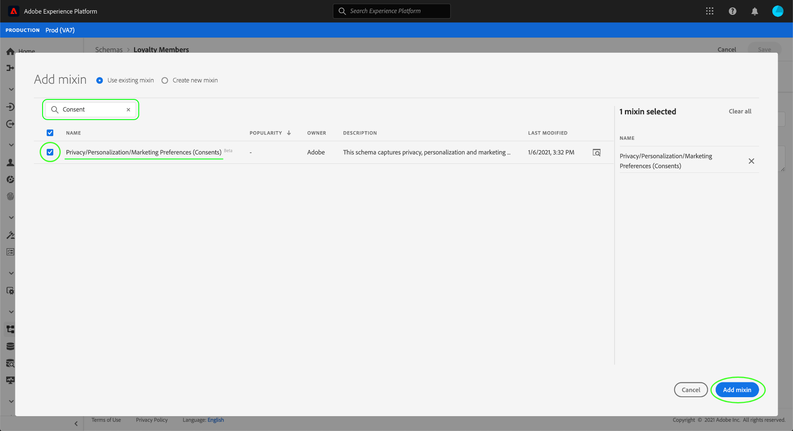

# Dataset zur Erfassung von Einwilligungs- und Präferenzdaten konfigurieren

Damit Adobe Experience Platform Ihre Daten zur Kundengenehmigung bzw. -präferenz verarbeiten kann, müssen diese Daten an ein Dataset gesendet werden, dessen Schema die Felder für die Zustimmung und andere Berechtigungen enthält. Insbesondere muss dieser Datensatz auf der [!DNL XDM Individual Profile]-Klasse basieren und für die Verwendung in [!DNL Real-time Customer Profile] aktiviert sein.

In diesem Dokument werden Schritte zum Konfigurieren eines Datensatzes zur Verarbeitung von Genehmigungsdaten in der Experience Platform beschrieben. Einen Überblick über den vollständigen Arbeitsablauf zur Verarbeitung von Einwilligungs-/Voreinstellungsdaten in der Plattform finden Sie in der [Übersicht zur Verarbeitung der Einwilligung](./overview.md).

>[!IMPORTANT]
>
>Die Beispiele in diesem Handbuch verwenden einen standardisierten Satz von Feldern, um die Werte für die Zustimmung des Kunden zu repräsentieren, wie durch den XDM-Datentyp [Zustimmung und Voreinstellungen](../../../../xdm/data-types/consents.md) definiert. Die Struktur dieser Felder soll ein effizientes Datenmodell bieten, das viele gängige Nutzungsszenarien für die Einholung von Genehmigungen abdeckt.
>
>Sie können jedoch auch eigene Mixins definieren, um die Zustimmung gemäß Ihren eigenen Datenmodellen zu repräsentieren. Bitte wenden Sie sich an Ihr Juristenteam, um die Genehmigung für ein Datenmodell für die Zustimmung zu erhalten, das Ihren geschäftlichen Anforderungen entspricht. Die folgenden Optionen sind verfügbar:
>
>* Das standardisierte Zustimmungsmixin
>* Ein von Ihrer Organisation erstellter Mix für eine benutzerdefinierte Einwilligung
>* Eine Kombination aus dem standardisierten Zustimmungsmixin und zusätzlichen Feldern, die durch ein benutzerdefiniertes Zustimmungsmixin bereitgestellt werden


## Voraussetzungen

Dieses Tutorial setzt ein Grundverständnis der folgenden Komponenten von Adobe Experience Platform voraus:

* [Experience-Datenmodell (XDM)](../../../../xdm/home.md)[!DNL Experience Platform]: Das standardisierte Framework, mit dem Kundenerlebnisdaten organisiert.
   * [Grundlagen der Schemakomposition](../../../../xdm/schema/composition.md): Erfahren Sie mehr über die Grundbausteine von XDM-Schemas.
* [Echtzeit-Profil](../../../../profile/home.md): Fasst Kundendaten aus unterschiedlichen Quellen in eine vollständige, einheitliche Ansicht zusammen und bietet gleichzeitig ein umsetzbares Zeitstempelkonto für jede Kundeninteraktion.

>[!IMPORTANT]
>
>In diesem Lernprogramm wird davon ausgegangen, dass Sie das [!DNL Profile]-Schema in Platform kennen, mit dem Sie Kundenattributinformationen erfassen möchten. Unabhängig von der Methode, die Sie zur Erfassung von Genehmigungsdaten verwenden, muss dieses Schema für Echtzeit-Kundendaten](../../../../xdm/ui/resources/schemas.md#profile) aktiviert sein. [ Darüber hinaus kann die primäre Identität des Schemas kein direkt identifizierbares Feld sein, das für interessensbasierte Werbung wie eine E-Mail-Adresse nicht verwendet werden darf. Wenden Sie sich an Ihren Rechtsbeistand, wenn Sie nicht sicher sind, welche Felder eingeschränkt sind.

## Zustimmung und Voreinstellungen - Mixin-Struktur {#structure}

Das [!UICONTROL Privacy/Personalization/Marketing Preferences (Consents)] mixin (nachfolgend &quot;Consents &amp; Preferences mixin&quot; genannt) stellt standardisierte Einwilligungsfelder für ein Schema bereit. Dieses Mixin ist derzeit nur mit Schemas kompatibel, die auf der [!DNL XDM Individual Profile]-Klasse basieren.

Das Mixin bietet ein einzelnes Objekttypfeld, `consents`, dessen Untereigenschaften einen Satz standardisierter Zustimmungsfelder erfassen. Die folgende JSON-Datei ist ein Beispiel für die Art von Daten, die `consents` bei der Datenerfassung erwartet:

```json
{
  "consents": {
    "collect": {
      "val": "y",
    },
    "share": {
      "val": "y",
    },
    "personalize": {
      "content": {
        "val": "y"
      }
    },
    "marketing": {
      "preferred": "email",
      "any": {
        "val": "y"
      },
      "push": {
        "val": "n",
        "reason": "Too Frequent",
        "time": "2019-01-01T15:52:25+00:00"
      }
    },
    "idSpecific": {
      "email": {
        "jdoe@example.com": {
          "marketing": {
            "email": {
              "val": "n"
            }
          }
        }
      }
    }
  },
  "metadata": {
    "time": "2019-01-01T15:52:25+00:00"
  }
}
```

>[!NOTE]
>
>Weitere Informationen zur Struktur und Bedeutung der Untereigenschaften in `consents` finden Sie in der Übersicht zum Datentyp [Einwilligungen und Voreinstellungen](../../../../xdm/data-types/consents.md).

## hinzufügen Sie das Mixin &quot;Einwilligungen und Voreinstellungen&quot;mit Ihrem [!DNL Profile]-Schema {#add-mixin}

Wählen Sie in der Benutzeroberfläche &quot;Plattform&quot;in der linken Navigation **[!UICONTROL Schema]** und wählen Sie dann die Registerkarte **[!UICONTROL Durchsuchen]**, um eine Liste der vorhandenen Schema anzuzeigen. Wählen Sie hier den Namen des [!DNL Profile]-aktivierten Schemas aus, dem Sie die Felder für die Zustimmung hinzufügen möchten. Die Screenshots in diesem Abschnitt verwenden das Schema &quot;Treuemitglieder&quot;, das im Tutorial [Erstellung von Schemas](../../../../xdm/tutorials/create-schema-ui.md) erstellt wurde.


>[!TIP]
>
>Sie können die Such- und Filterfunktionen des Arbeitsbereichs verwenden, um Ihr Schema leichter zu finden. Weitere Informationen finden Sie im Handbuch [XDM-Ressourcen](../../../../xdm/ui/explore.md) zu erkunden.

Das Symbol [!DNL Schema Editor] wird angezeigt und zeigt die Struktur des Schemas auf der Arbeitsfläche an. Wählen Sie auf der linken Seite der Arbeitsfläche **[!UICONTROL Hinzufügen]** unter dem Abschnitt **[!UICONTROL Mixins]**.


Das Dialogfeld **[!UICONTROL Hinzufügen mixin]** wird angezeigt. Wählen Sie **[!UICONTROL Datenschutz/Personalisierung/Marketing-Voreinstellungen (Zusätze)]** aus der Liste. Sie können optional die Suchleiste verwenden, um die Ergebnisse einzuschränken, um das Mixin einfacher zu finden. Wenn das Mixin ausgewählt ist, wählen Sie **[!UICONTROL Hinzufügen mixin]**.



Die Arbeitsfläche wird wieder angezeigt und zeigt an, dass das `consents`-Objekt zur Schema-Struktur hinzugefügt wurde. Wenn Sie zusätzliche Zustimmungs- und Voreinstellungsfelder benötigen, die nicht vom Standardmixin erfasst werden, finden Sie weitere Informationen im Anhang zu [Hinzufügen von benutzerdefinierten Einwilligungs- und Voreinstellungsfeldern zum Schema](#custom-consent). Andernfalls wählen Sie **[!UICONTROL Speichern]**, um die Änderungen am Schema abzuschließen.


Wenn das bearbeitete Schema von dem [!UICONTROL Profil-Datensatz] verwendet wird, der in Ihrer Platform Web SDK-Edge-Konfiguration angegeben ist, enthält dieser Datensatz jetzt die neuen Zustimmungsfelder. Sie können nun zum Handbuch [Verarbeitung der Einwilligung](./overview.md#merge-policies) zurückkehren, um die Konfiguration der Experience Platform zur Verarbeitung der Einwilligungsdaten fortzusetzen.

Wenn Sie keinen Datensatz für dieses Schema erstellt haben, führen Sie die Schritte im nächsten Abschnitt aus.

## Erstellen Sie einen Datensatz basierend auf Ihrem Zustimmungs-Schema {#dataset}

Nachdem Sie ein Schema mit Einwilligungsfeldern erstellt haben, müssen Sie einen Datensatz erstellen, der letztendlich die Einwilligungsdaten Ihrer Kunden erfasst. Dieser Datensatz muss für [!DNL Real-time Customer Profile] aktiviert werden.

Wählen Sie zunächst **[!UICONTROL Datensätze]** in der linken Navigation und dann **[!UICONTROL Datensatz erstellen]** in der oberen rechten Ecke aus.


Wählen Sie auf der nächsten Seite **[!UICONTROL Datensatz aus Schema]** erstellen.


Der Arbeitsablauf **[!UICONTROL Datensatz aus Schema]** erstellen wird angezeigt, beginnend mit dem Schritt **[!UICONTROL Schema auswählen]**. Suchen Sie in der bereitgestellten Liste nach einem der Schema für die Zustimmung, die Sie zuvor erstellt haben. Sie können optional die Suchleiste verwenden, um die Ergebnisse einzugrenzen und Ihr Schema einfacher zu finden. Klicken Sie auf das Optionsfeld neben dem gewünschten Schema und wählen Sie dann **[!UICONTROL Weiter]** aus, um fortzufahren.


Der Schritt **[!UICONTROL Datensatz konfigurieren]** wird angezeigt. Geben Sie einen eindeutigen, leicht identifizierbaren Namen und eine Beschreibung für den Datensatz ein, bevor Sie **[!UICONTROL Fertigstellen]** auswählen.


Die Detailseite für den neu erstellten Datensatz wird angezeigt. Wenn der Datensatz auf Ihrem Zeitreihen-Schema basiert, ist der Vorgang abgeschlossen. Wenn der Datensatz auf Ihrem Record-Schema basiert, besteht der letzte Schritt darin, den Datensatz für die Verwendung in [!DNL Real-time Customer Profile] zu aktivieren.

Wählen Sie in der rechten Leiste den Umschalter **[!UICONTROL Profil]**.


Wählen Sie schließlich **[!UICONTROL Aktivieren]** im Bestätigungs-Popup, um das Schema für [!DNL Profile] zu aktivieren.


Der Datensatz wird jetzt gespeichert und für die Verwendung in [!DNL Profile] aktiviert. Wenn Sie planen, mit dem Platform Web SDK Genehmigungsdaten an Profil zu senden, müssen Sie diesen Datensatz beim Einrichten Ihrer [Edge-Konfiguration](../../../../edge/fundamentals/edge-configuration.md) als [!UICONTROL Profil-Datensatz] auswählen.

## Nächste Schritte

In diesem Lernprogramm haben Sie einem [!DNL Profile]-aktivierten Schema Zustimmungsfelder hinzugefügt, deren Dataset zum Erfassen von Einwilligungsdaten mit dem Platform Web SDK oder der direkten XDM-Erfassung verwendet wird.

Sie können nun zur Übersicht zur Verarbeitung der Einwilligung [zurückkehren, um die Konfiguration der Experience Platform zur Verarbeitung der Einwilligungsdaten fortzusetzen.](./overview.md#merge-policies)

## Anhang

Der folgende Abschnitt enthält weitere Informationen zum Erstellen eines Datensatzes zum Erfassen von Daten zur Kundengenehmigung und zu den Kundenpräferenzen.

### hinzufügen benutzerdefinierte Felder für die Zustimmung und die Voreinstellung zum Schema {#custom-consent}

Wenn Sie zusätzliche Zustimmungssignale außerhalb der durch das standardmäßige [!DNL Consents & Preferences]-Mixin repräsentierten Signale erfassen müssen, können Sie benutzerdefinierte XDM-Komponenten verwenden, um Ihr Schema für die Zustimmung entsprechend Ihren jeweiligen Geschäftsanforderungen zu verbessern. In diesem Abschnitt werden die Grundprinzipien erläutert, wie Sie Ihr Schema für die Zustimmung so anpassen können, dass es mit den Befehlen zur Änderung der Zustimmung, die von Adobe Experience Platform Mobile- und Web-SDKs ausgeführt werden, kompatibel ist.

>[!IMPORTANT]
>
>Sie müssen das [!DNL Consents & Preferences]-Mixin als Grundlage für die Struktur Ihrer Genehmigungsdaten verwenden und bei Bedarf zusätzliche Felder hinzufügen, anstatt zu versuchen, die gesamte Struktur von Grund auf zu erstellen.

Um benutzerdefinierte Felder zur Struktur eines Standardmixins hinzuzufügen, müssen Sie zunächst ein benutzerdefiniertes Mixin erstellen. Nachdem Sie die [!DNL Consents & Preferences]-Mischung zum Schema hinzugefügt haben, wählen Sie im Abschnitt **[!UICONTROL Mixins]** das Symbol **plus (+)** aus und wählen Sie **[!UICONTROL Neue Mischung erstellen]**. Geben Sie einen Namen und eine optionale Beschreibung für das Mixin ein und wählen Sie **[!UICONTROL Hinzufügen mixin]**.


Das [!DNL Schema Editor] wird wieder angezeigt, wenn das neue benutzerdefinierte Mixin in der linken Leiste ausgewählt ist. Auf der Arbeitsfläche werden Steuerelemente angezeigt, mit denen Sie benutzerdefinierte Felder zur Schema-Struktur hinzufügen können. Um ein neues Feld für die Zustimmung oder Voreinstellung hinzuzufügen, wählen Sie das Symbol **plus (+)** neben dem Objekt `consents` aus.


Innerhalb des Objekts `consents` wird ein neues Feld angezeigt. Da Sie ein benutzerdefiniertes Feld zu einem Standard-XDM-Objekt hinzufügen, wird das neue Feld unter einem Objekt erstellt, das Ihrer Mandant-ID zugeordnet ist.


Geben Sie in der rechten Leiste unter **[!UICONTROL Feldeigenschaften]** einen Namen und eine Beschreibung für das Feld ein. Bei der Auswahl des Felds **[!UICONTROL Typ]** müssen Sie den entsprechenden Standarddatentyp für ein benutzerspezifisches Einwilligungs- oder Vorgabefeld verwenden:

* [[!UICONTROL Allgemeines Feld für Zustimmung]](../../../../xdm/data-types/consent-field.md)
* [[!UICONTROL Feld für allgemeine Marketingpräferenzen]](../../../../xdm/data-types/marketing-field.md)
* [[!UICONTROL Allgemeines Feld für Marketingpräferenzen mit Abonnements]](../../../../xdm/data-types/marketing-field-subscriptions.md)
* [[!UICONTROL Feld für allgemeine Personalisierungseinstellungen]](../../../../xdm/data-types/personalization-field.md)

Wenn Sie fertig sind, wählen Sie **[!UICONTROL Apply]**.


Das Feld &quot;Zustimmung&quot;oder &quot;Präferenz&quot;wird der Schema-Struktur hinzugefügt. Beachten Sie, dass der in der rechten Leiste angezeigte [!UICONTROL Pfad] den Namensraum `_tenantId` enthält. Dieser Namensraum muss immer dann einbezogen werden, wenn Sie in Ihren Datenvorgängen auf den Pfad zu diesem Feld verweisen.


Gehen Sie wie oben beschrieben vor, um die erforderlichen Felder für die Zustimmung und die Voreinstellung hinzuzufügen. Wenn Sie fertig sind, wählen Sie **[!UICONTROL Speichern]**, um Ihre Änderungen zu bestätigen.

Wenn das bearbeitete Schema von dem [!UICONTROL Profil-Datensatz] verwendet wird, der in Ihrer Platform Web SDK-Edge-Konfiguration angegeben ist, enthält dieser Datensatz jetzt die neuen Zustimmungsfelder. Sie können nun zum Handbuch [Verarbeitung der Einwilligung](./overview.md#merge-policies) zurückkehren, um die Konfiguration der Experience Platform zur Verarbeitung der Einwilligungsdaten fortzusetzen.

Wenn Sie für dieses Schema keinen Datensatz erstellt haben, fahren Sie mit dem Abschnitt [Erstellen eines Datensatzes](#dataset) fort.
