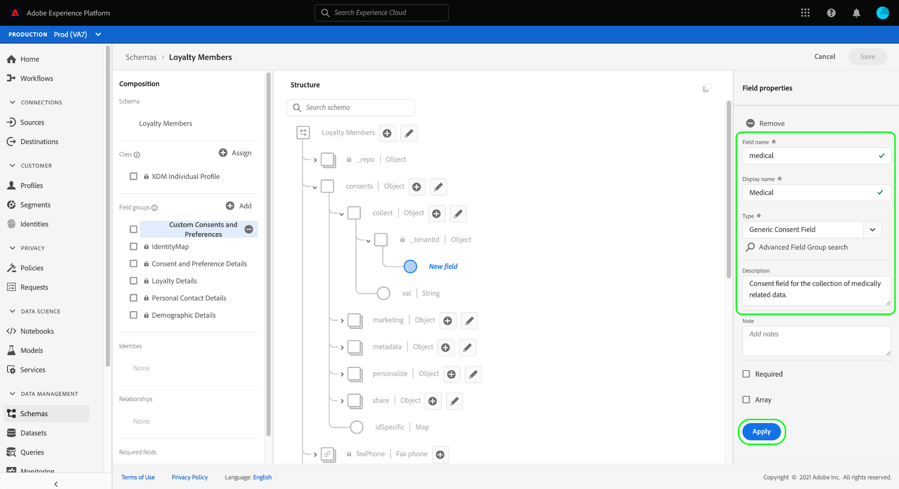

# Konfigurieren eines Datensatzes zur Erfassung von Einwilligungs- und Präferenzdaten

Damit Adobe Experience Platform Ihre Zustimmungs-/Präferenzdaten von Kunden verarbeiten kann, müssen diese Daten an einen Datensatz gesendet werden, dessen Schema Felder enthält, die mit Zustimmung und anderen Berechtigungen zusammenhängen. Insbesondere muss dieser Datensatz auf der [!DNL XDM Individual Profile] und für die Verwendung in [!DNL Real-Time Customer Profile].

In diesem Dokument werden Schritte zum Konfigurieren eines Datensatzes zur Verarbeitung von Einwilligungsdaten in Experience Platform beschrieben. Einen Überblick über den gesamten Workflow zur Verarbeitung von Einwilligungs-/Einverständnisdaten in Platform erhalten Sie im Abschnitt [Übersicht zur Zustimmungsverarbeitung](./overview.md).

>[!IMPORTANT]
>
>Die Beispiele in diesem Handbuch verwenden einen standardisierten Satz von Feldern, um die Zustimmungswerte von Kunden darzustellen, wie in der Variablen [[!UICONTROL Einverständnis und Präferenzdetails] Schemafeldgruppe](../../../../xdm/field-groups/profile/consents.md). Die Struktur dieser Felder soll ein effizientes Datenmodell für viele gängige Nutzungsszenarien bei der Einwilligungserfassung bieten.
>
>Sie können jedoch auch Ihre eigenen Feldergruppen definieren, um die Zustimmung gemäß Ihren eigenen Datenmodellen darzustellen. Wenden Sie sich an Ihr Rechtsteam, um die Genehmigung für ein Datenmodell zur Einwilligung zu erhalten, das Ihren geschäftlichen Anforderungen entspricht. Mögliche Optionen sind:
>
>* Die standardisierte Einwilligungsfeldgruppe
>* Eine benutzerdefinierte Einwilligungsfeldgruppe, die von Ihrer Organisation erstellt wurde
>* Eine Kombination aus der standardisierten Einwilligungsfeldgruppe und zusätzlichen Feldern, die von einer benutzerdefinierten Einwilligungsfeldgruppe bereitgestellt werden


## Voraussetzungen

Dieses Tutorial setzt ein Grundverständnis der folgenden Komponenten von Adobe Experience Platform voraus:

* [Experience-Datenmodell (XDM)](../../../../xdm/home.md): Das standardisierte Framework, mit dem [!DNL Experience Platform] Kundenerlebnisdaten organisiert.
   * [Grundlagen der Schemakomposition](../../../../xdm/schema/composition.md): Erfahren Sie mehr über die Grundbausteine von XDM-Schemas.
* [Echtzeit-Kundenprofil](../../../../profile/home.md): Fasst Kundendaten aus unterschiedlichen Quellen in einer vollständigen, einheitlichen Ansicht zusammen und bietet gleichzeitig eine verwertbare, mit Zeitstempel versehene Übersicht über jede Kundeninteraktion.

>[!IMPORTANT]
>
>In diesem Tutorial wird davon ausgegangen, dass Sie die [!DNL Profile] -Schema in Platform, das Sie zum Erfassen von Kundenattributinformationen verwenden möchten. Unabhängig von der Methode, mit der Sie Einwilligungsdaten erfassen, muss dieses Schema [aktiviert für Echtzeit-Kundenprofil](../../../../xdm/ui/resources/schemas.md#profile). Darüber hinaus darf die primäre Identität des Schemas nicht ein direkt identifizierbares Feld sein, das in interessensbasierter Werbung, wie z. B. einer E-Mail-Adresse, nicht verwendet werden darf. Wenden Sie sich an Ihren Rechtsbeistand, wenn Sie sich nicht sicher sind, welche Felder eingeschränkt sind.

## [!UICONTROL Einverständnis und Präferenzdetails] Feldergruppenstruktur {#structure}

Die [!UICONTROL Einverständnis und Präferenzdetails] Feldergruppe stellt standardisierte Einwilligungsfelder für ein Schema bereit. Diese Feldergruppe ist derzeit nur mit Schemata kompatibel, die auf der Variablen [!DNL XDM Individual Profile] -Klasse.

Die Feldergruppe stellt ein einzelnes Feld vom Typ Objekt bereit, `consents`, deren Untereigenschaften eine Reihe standardisierter Zustimmungsfelder erfassen. Die folgende JSON-Datei ist ein Beispiel für die Art von Daten `consents` erwartet bei der Datenerfassung:

```json
{
  "consents": {
    "collect": {
      "val": "y",
    },
    "share": {
      "val": "y",
    },
    "personalize": {
      "content": {
        "val": "y"
      }
    },
    "marketing": {
      "preferred": "email",
      "any": {
        "val": "y"
      },
      "push": {
        "val": "n",
        "reason": "Too Frequent",
        "time": "2019-01-01T15:52:25+00:00"
      }
    },
    "idSpecific": {
      "email": {
        "jdoe@example.com": {
          "marketing": {
            "email": {
              "val": "n"
            }
          }
        }
      }
    }
  },
  "metadata": {
    "time": "2019-01-01T15:52:25+00:00"
  }
}
```

>[!NOTE]
>
>Weitere Informationen zur Struktur und Bedeutung der Untereigenschaften finden Sie unter `consents`, siehe die Übersicht auf der [[!UICONTROL Einverständnis und Präferenzdetails] Feldergruppe](../../../../xdm/field-groups/profile/consents.md).

## Fügen Sie erforderliche Feldergruppen zu Ihrer [!DNL Profile] schema {#add-field-group}

Um Einwilligungsdaten mithilfe des Adobe-Standards zu erfassen, müssen Sie über ein Profil-aktiviertes Schema verfügen, das die beiden folgenden Feldgruppen enthält:

* [!UICONTROL Einverständnis und Präferenzdetails]
* [!UICONTROL IdentityMap] (erforderlich, wenn das Platform Web oder Mobile SDK zum Senden von Zustimmungssignalen verwendet wird)

Wählen Sie in der Platform-Benutzeroberfläche die Option **[!UICONTROL Schemas]** Wählen Sie im linken Navigationsbereich die Option **[!UICONTROL Durchsuchen]** um eine Liste der vorhandenen Schemata anzuzeigen. Wählen Sie hier den Namen der [!DNL Profile]-aktiviertes Schema, dem Sie Einwilligungsfelder hinzufügen möchten. Die Screenshots in diesem Abschnitt verwenden das Schema &quot;Mitglieder des Treueprogramms&quot;, das im [Tutorial zur Schemaerstellung](../../../../xdm/tutorials/create-schema-ui.md) als Beispiel.


>[!TIP]
>
>Sie können die Such- und Filterfunktionen des Arbeitsbereichs verwenden, um Ihr Schema leichter zu finden. Siehe Handbuch unter [Erkunden von XDM-Ressourcen](../../../../xdm/ui/explore.md) für weitere Informationen.

Die [!DNL Schema Editor] angezeigt, um die Struktur des Schemas auf der Arbeitsfläche anzuzeigen. Wählen Sie auf der linken Seite der Arbeitsfläche die Option **[!UICONTROL Hinzufügen]** unter **[!UICONTROL Feldergruppen]** Abschnitt.


Die **[!UICONTROL Feldergruppe hinzufügen]** angezeigt. Wählen Sie von hier aus **[!UICONTROL Einverständnis und Präferenzdetails]** aus der Liste. Sie können optional die Suchleiste verwenden, um Ergebnisse einzugrenzen und die Feldergruppe leichter zu finden.


Suchen Sie als Nächstes die **[!UICONTROL IdentityMap]** Feldergruppe aus der Liste aus und wählen Sie sie ebenfalls aus. Sobald beide Feldergruppen in der rechten Leiste aufgelistet sind, wählen Sie **[!UICONTROL Feldergruppen hinzufügen]**.


Die Arbeitsfläche wird wieder angezeigt und zeigt an, dass die `consents` und `identityMap` -Felder zur Schemastruktur hinzugefügt. Wenn Sie zusätzliche Einverständnisfelder und Voreinstellungsfelder benötigen, die nicht von der Standardfeldgruppe erfasst werden, lesen Sie den Anhang unter [Hinzufügen benutzerdefinierter Zustimmungs- und Voreinstellungsfelder zum Schema](#custom-consent). Andernfalls wählen Sie **[!UICONTROL Speichern]** um die Änderungen am Schema abzuschließen.


>[!IMPORTANT]
>
>Wenn Sie ein neues Schema erstellen oder ein vorhandenes Schema bearbeiten, das nicht für Profil aktiviert wurde, müssen Sie [Aktivieren des Schemas für Profil](../../../../xdm/ui/resources/schemas.md#profile) vor dem Speichern.

Wenn das bearbeitete Schema von der [!UICONTROL Profildatensatz] in Ihrem Platform Web SDK-Datenspeicher angegeben ist, enthält dieser Datensatz jetzt die neuen Einwilligungsfelder. Sie können jetzt zum [Handbuch zur Einverständnisverarbeitung](./overview.md#merge-policies) , um die Konfiguration der Experience Platform zur Verarbeitung von Einwilligungsdaten fortzusetzen. Wenn Sie keinen Datensatz für dieses Schema erstellt haben, führen Sie die Schritte im nächsten Abschnitt aus.

## Datensatz basierend auf Ihrem Einverständnisschema erstellen {#dataset}

Nachdem Sie ein Schema mit Einverständnisfeldern erstellt haben, müssen Sie einen Datensatz erstellen, in dem letztendlich die Einwilligungsdaten Ihrer Kunden erfasst werden. Dieser Datensatz muss für [!DNL Real-Time Customer Profile].

Wählen Sie zunächst **[!UICONTROL Datensätze]** Wählen Sie im linken Navigationsbereich die Option **[!UICONTROL Datensatz erstellen]** in der oberen rechten Ecke.


Wählen Sie auf der nächsten Seite **[!UICONTROL Datensatz aus Schema erstellen]**.


Die **[!UICONTROL Datensatz aus Schema erstellen]** wird der Workflow angezeigt, beginnend mit dem **[!UICONTROL Schema auswählen]** Schritt. Suchen Sie in der bereitgestellten Liste eines der zuvor erstellten Einwilligungsschemas. Sie können optional die Suchleiste verwenden, um Ergebnisse einzuschränken und Ihr Schema leichter zu finden. Wählen Sie das Optionsfeld neben dem gewünschten Schema aus und wählen Sie dann **[!UICONTROL Nächste]** , um fortzufahren.


Der Schritt **[!UICONTROL Datensatz konfigurieren]** wird angezeigt. Geben Sie einen eindeutigen, leicht identifizierbaren Namen und eine Beschreibung für den Datensatz an, bevor Sie **[!UICONTROL Beenden]**.


Die Detailseite für den neu erstellten Datensatz wird angezeigt. Wenn der Datensatz auf Ihrem Zeitreihenschema basiert, ist der Prozess abgeschlossen. Wenn der Datensatz auf Ihrem Datensatzschema basiert, besteht der letzte Schritt im Prozess darin, den Datensatz zur Verwendung in [!DNL Real-Time Customer Profile].

Wählen Sie in der rechten Leiste die **[!UICONTROL Profil]** umschalten.


Wählen Sie abschließend **[!UICONTROL Aktivieren]** im Bestätigungs-Popup, um das Schema für [!DNL Profile].


Der Datensatz wird jetzt gespeichert und für die Verwendung in [!DNL Profile]. Wenn Sie planen, das Platform Web SDK zum Senden von Zustimmungsdaten an Profile zu verwenden, müssen Sie diesen Datensatz als [!UICONTROL Profildatensatz] bei der Einrichtung der [datastream](../../../../edge/datastreams/overview.md).

## Nächste Schritte

In diesem Tutorial haben Sie Einwilligungsfelder zu einem [!DNL Profile]-aktiviertes Schema, dessen Datensatz zum Erfassen von Einwilligungsdaten mithilfe des Platform Web SDK oder der direkten XDM-Erfassung verwendet wird.

Sie können jetzt zum [Übersicht zur Zustimmungsverarbeitung](./overview.md#merge-policies) , um die Konfiguration der Experience Platform zur Verarbeitung von Einwilligungsdaten fortzusetzen.

## Anhang

Der folgende Abschnitt enthält zusätzliche Informationen zum Erstellen eines Datensatzes zur Erfassung von Einwilligungs- und Präferenzdaten von Kunden.

### Hinzufügen benutzerdefinierter Einverständnisfelder und Präferenzfelder zum Schema {#custom-consent}

Wenn Sie zusätzliche Zustimmungssignale erfassen müssen, die nicht durch die standardmäßigen [!UICONTROL Einverständnis und Präferenzdetails] Feldergruppe verwenden, können Sie benutzerdefinierte XDM-Komponenten verwenden, um Ihr Einwilligungsschema entsprechend Ihren jeweiligen Geschäftsanforderungen zu erweitern. In diesem Abschnitt werden die grundlegenden Prinzipien erläutert, wie Sie Ihr Einverständnisschema anpassen können, um diese Signale in das Profil aufzunehmen.

>[!IMPORTANT]
>
>Die Platform Web- und Mobile-SDKs unterstützen keine benutzerdefinierten Felder in ihren Befehlen zur Änderung der Zustimmung. Die einzige Möglichkeit, benutzerdefinierte Einwilligungsfelder in Profile zu erfassen, besteht derzeit darin, [Batch-Erfassung](../../../../ingestion/batch-ingestion/overview.md) oder [Quellverbindung](../../../../sources/home.md).

Es wird dringend empfohlen, die Variable [!UICONTROL Einverständnis und Präferenzdetails] Feldergruppe als Grundlage für die Struktur Ihrer Zustimmungsdaten und fügen Sie bei Bedarf zusätzliche Felder hinzu, anstatt zu versuchen, die gesamte Struktur von Grund auf neu zu erstellen.

Um der Struktur einer Standardfeldgruppe benutzerdefinierte Felder hinzuzufügen, müssen Sie zunächst eine benutzerdefinierte Feldergruppe erstellen. Nach dem Hinzufügen der [!UICONTROL Einverständnis und Präferenzdetails] Feldergruppe zum Schema, wählen Sie die **plus (+)** im **[!UICONTROL Feldergruppen]** und wählen Sie **[!UICONTROL Neue Feldergruppe erstellen]**. Geben Sie einen Namen und eine optionale Beschreibung für die Feldergruppe ein und wählen Sie dann **[!UICONTROL Feldergruppe hinzufügen]**.


Die [!DNL Schema Editor] wird erneut angezeigt, wobei die neue benutzerdefinierte Feldergruppe in der linken Leiste ausgewählt ist. Auf der Arbeitsfläche werden Steuerelemente angezeigt, mit denen Sie benutzerdefinierte Felder zur Schemastruktur hinzufügen können. Um ein neues Einverständnis- oder Vorgabefeld hinzuzufügen, wählen Sie die **plus (+)** Symbol neben `consents` -Objekt.


Ein neues Feld wird im `consents` -Objekt. Da Sie ein benutzerdefiniertes Feld zu einem Standard-XDM-Objekt hinzufügen, wird das neue Feld unter einem Objekt erstellt, das mit Ihrer Mandanten-ID benannt ist.


In der rechten Leiste unter **[!UICONTROL Feldeigenschaften]**, geben Sie einen Namen und eine Beschreibung für das Feld ein. Bei der Auswahl der **[!UICONTROL Typ]** müssen Sie den entsprechenden Standarddatentyp für ein benutzerdefiniertes Einwilligungs- oder Präferenzfeld verwenden:

* [[!UICONTROL Generisches Einverständnisfeld]](../../../../xdm/data-types/consent-field.md)
* [[!UICONTROL Feld für allgemeine Marketing-Voreinstellungen]](../../../../xdm/data-types/marketing-field.md)
* [[!UICONTROL Feld für allgemeine Marketing-Präferenz mit Abonnements]](../../../../xdm/data-types/marketing-field-subscriptions.md)
* [[!UICONTROL Feld für allgemeine Personalisierungseinstellungen]](../../../../xdm/data-types/personalization-field.md)

Wenn Sie fertig sind, wählen Sie **[!UICONTROL Anwenden]**.



Das Einverständnis- oder Präferenzfeld wird der Schemastruktur hinzugefügt. Beachten Sie Folgendes: [!UICONTROL Pfad] in der rechten Leiste enthält die `_tenantId` Namespace. Dieser Namespace muss immer dann enthalten sein, wenn Sie in Ihren Datenvorgängen auf den Pfad zu diesem Feld verweisen.


Führen Sie die oben beschriebenen Schritte aus, um mit dem Hinzufügen der erforderlichen Zustimmungs- und Voreinstellungsfelder fortzufahren. Wenn Sie fertig sind, wählen Sie **[!UICONTROL Speichern]** um Ihre Änderungen zu bestätigen.

Wenn Sie keinen Datensatz für dieses Schema erstellt haben, fahren Sie mit dem Abschnitt zu [Erstellen eines Datensatzes](#dataset).
