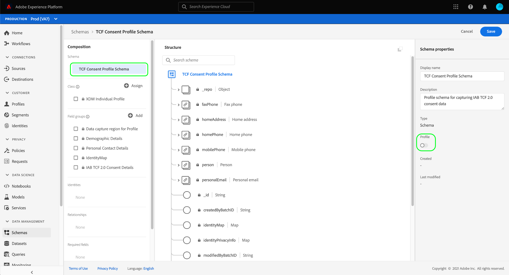

# Erstellen von Datensätzen zur Erfassung von IAB TCF 2.0-Einwilligungsdaten

Damit Adobe Experience Platform Kundenzustimmungsdaten gemäß IAB verarbeiten kann [!DNL Transparency & Consent Framework] (TCF) 2.0, müssen diese Daten an Datensätze gesendet werden, deren Schemas TCF 2.0-Einwilligungsfelder enthalten.

Für die Erfassung von TCF 2.0-Einwilligungsdaten sind zwei Datensätze erforderlich:

* Ein Datensatz, der auf der [!DNL XDM Individual Profile] -Klasse, die für die Verwendung in aktiviert ist [!DNL Real-Time Customer Profile].
* Ein Datensatz, der auf der [!DNL XDM ExperienceEvent] -Klasse.

>[!IMPORTANT]
>
>Platform erzwingt nur die TCF-Zeichenfolgen, die im Datensatz &quot;Individuelles Profil&quot;erfasst werden. Auch wenn ein ExperienceEvent-Datensatz im Rahmen dieses Workflows weiterhin benötigt wird, um einen Datastream zu erstellen, müssen Sie nur Daten in den Profildatensatz aufnehmen. Der ExperienceEvent-Datensatz kann weiterhin verwendet werden, wenn Sie Zustimmungsänderungsereignisse im Laufe der Zeit verfolgen möchten. Diese Werte werden jedoch nicht bei der Erzwingung der Segmentaktivierung verwendet.

In diesem Dokument werden die Schritte zum Einrichten dieser beiden Datensätze beschrieben. Einen Überblick über den vollständigen Workflow zur Konfiguration Ihrer Platform-Datenvorgänge für TCF 2.0 erhalten Sie im Abschnitt [IAB TCF 2.0 - Überblick über die Kompatibilität](./overview.md).

## Voraussetzungen

Dieses Tutorial setzt ein Grundverständnis der folgenden Komponenten von Adobe Experience Platform voraus:

* [Experience-Datenmodell (XDM)](../../../../xdm/home.md): Das standardisierte Framework, mit dem [!DNL Experience Platform] Kundenerlebnisdaten organisiert.
   * [Grundlagen der Schemakomposition](../../../../xdm/schema/composition.md): Erfahren Sie mehr über die Grundbausteine von XDM-Schemas.
* [Adobe Experience Platform Identity Service](../../../../identity-service/home.md): Ermöglicht es Ihnen, Kundenidentitäten von unterschiedlichen Datenquellen über Geräte und Systeme hinweg zu verbinden.
   * [Identitäts-Namespaces](../../../../identity-service/namespaces.md): Kundenidentitätsdaten müssen unter einem bestimmten Identitäts-Namespace bereitgestellt werden, der vom Identity Service erkannt wird.
* [Echtzeit-Kundenprofil](../../../../profile/home.md): Nutzung [!DNL Identity Service] , damit Sie aus Ihren Datensätzen in Echtzeit detaillierte Kundenprofile erstellen können. [!DNL Real-Time Customer Profile] ruft Daten aus dem Data Lake ab und behält Kundenprofile in einem eigenen separaten Datenspeicher bei.

## TCF 2.0-Feldergruppen {#field-groups}

Die [!UICONTROL IAB TCF 2.0-Einverständnisdetails] Schemafeldgruppe stellt Felder zur Kundenzustimmung bereit, die für die Unterstützung von TCF 2.0 erforderlich sind. Es gibt zwei Versionen dieser Feldergruppe: mit dem [!DNL XDM Individual Profile] -Klasse und die andere mit der [!DNL XDM ExperienceEvent] -Klasse.

In den folgenden Abschnitten wird die Struktur der einzelnen Feldergruppen beschrieben, einschließlich der Daten, die sie bei der Erfassung erwarten.

### Profilfeldgruppe {#profile-field-group}

Für Schemata, die auf [!DNL XDM Individual Profile], die [!UICONTROL IAB TCF 2.0-Einverständnisdetails] Feldergruppe stellt ein einzelnes Feld vom Typ Zuordnung bereit; `identityPrivacyInfo`, die Kundenidentitäten ihren TCF-Zustimmungsvoreinstellungen zuordnet. Diese Feldergruppe muss in einem datensatzbasierten Schema enthalten sein, das für das Echtzeit-Kundenprofil aktiviert ist, damit die automatische Durchsetzung erfolgt.

Siehe [Referenzhandbuch](../../../../xdm/field-groups/profile/iab.md) für diese Feldergruppe , um mehr über deren Struktur und Anwendungsfall zu erfahren.

### Ereignisfeldgruppe {#event-field-group}

Wenn Sie Zustimmungsänderungsereignisse im Laufe der Zeit verfolgen möchten, können Sie die [!UICONTROL IAB TCF 2.0-Einverständnisdetails] Feldergruppe zu [!UICONTROL XDM ExperienceEvent] Schema.

Wenn Sie nicht planen, Zustimmungsänderungsereignisse im Laufe der Zeit zu verfolgen, müssen Sie diese Feldergruppe nicht in Ihr Ereignisschema aufnehmen. Beim automatischen Erzwingen von TCF-Zustimmungswerten verwendet Experience Platform nur die neuesten Zustimmungsinformationen, die in der [Profilfeldgruppe](#profile-field-group). Die von Ereignissen erfassten Zustimmungswerte nehmen nicht an automatischen Durchsetzungs-Workflows teil.

Siehe [Referenzhandbuch](../../../../xdm/field-groups/event/iab.md) für diese Feldergruppe weitere Informationen zu ihrer Struktur und ihrem Anwendungsfall.

## Erstellen von Einverständnisschemata für Kunden {#create-schemas}

Um Datensätze zu erstellen, die Einwilligungsdaten erfassen, müssen Sie zunächst XDM-Schemas erstellen, auf denen diese Datensätze basieren.

Wie im vorherigen Abschnitt erwähnt, ein Schema, das die [!UICONTROL XDM Individual Profile] -Klasse ist erforderlich, um die Zustimmung in nachgelagerten Platform-Workflows zu erzwingen. Sie können optional auch ein separates Schema erstellen, das auf [!UICONTROL XDM ExperienceEvent] , wenn Sie Änderungen der Einwilligung im Laufe der Zeit verfolgen möchten. Beide Schemata müssen eine `identityMap` und einer entsprechenden TCF 2.0-Feldergruppe.

Wählen Sie in der Platform-Benutzeroberfläche die Option **[!UICONTROL Schemas]** im linken Navigationsbereich, um die [!UICONTROL Schemas] Arbeitsbereich. Führen Sie von hier aus die Schritte in den folgenden Abschnitten aus, um jedes erforderliche Schema zu erstellen.

>[!NOTE]
>
>Wenn Sie über vorhandene XDM-Schemas verfügen, mit denen Sie stattdessen Einwilligungsdaten erfassen möchten, können Sie diese Schemas bearbeiten, anstatt neue Schemas zu erstellen. Wenn jedoch ein vorhandenes Schema für die Verwendung im Echtzeit-Kundenprofil aktiviert wurde, kann seine primäre Identität nicht ein direkt identifizierbares Feld sein, das nicht in interessensbasierter Werbung verwendet werden darf, z. B. eine E-Mail-Adresse. Wenden Sie sich an Ihren Rechtsbeistand, wenn Sie sich nicht sicher sind, welche Felder eingeschränkt sind.
>
>Darüber hinaus können bei der Bearbeitung vorhandener Schemas nur additive (nicht brechende) Änderungen vorgenommen werden. Siehe Abschnitt im Abschnitt [Grundsätze der Schemaentwicklung](../../../../xdm/schema/composition.md#evolution) für weitere Informationen.

### Erstellen eines Profilzustimmungsschemas {#profile-schema}

Auswählen **[!UICONTROL Schema erstellen]**, wählen Sie **[!UICONTROL XDM Individual Profile]** aus dem Dropdown-Menü aus.

Die **[!UICONTROL Feldergruppen hinzufügen]** angezeigt, sodass Sie sofort mit dem Hinzufügen von Feldergruppen zum Schema beginnen können. Wählen Sie von hier aus **[!UICONTROL IAB TCF 2.0-Einverständnisdetails]** aus der Liste. Sie können optional die Suchleiste verwenden, um Ergebnisse einzugrenzen und die Feldergruppe leichter zu finden.

Suchen Sie als Nächstes die **[!UICONTROL IdentityMap]** Feldergruppe aus der Liste aus und wählen Sie sie ebenfalls aus. Sobald beide Feldergruppen in der rechten Leiste aufgelistet sind, wählen Sie **[!UICONTROL Feldergruppen hinzufügen]**.

Die Arbeitsfläche wird wieder angezeigt und zeigt an, dass die `identityPrivacyInfo` und `identityMap` -Felder zur Schemastruktur hinzugefügt.

Wählen Sie vor dem Hinzufügen weiterer Felder zum Schema das Stammfeld aus, das angezeigt werden soll **[!UICONTROL Schemaeigenschaften]** in der rechten Leiste, wo Sie einen Namen und eine Beschreibung für das Schema angeben können.

Nachdem Sie einen Namen und eine Beschreibung angegeben haben, können Sie dem Schema optional weitere Felder hinzufügen, indem Sie **[!UICONTROL Hinzufügen]** unter **[!UICONTROL Feldergruppen]** auf der linken Seite der Arbeitsfläche.

Wenn Sie ein vorhandenes Schema bearbeiten, das bereits für die Verwendung in [!DNL Real-Time Customer Profile]auswählen **[!UICONTROL Speichern]** , um Ihre Änderungen zu bestätigen, bevor Sie mit dem Abschnitt zum [Erstellen eines Datensatzes basierend auf Ihrem Einverständnisschema](#dataset). Wenn Sie ein neues Schema erstellen, führen Sie die im folgenden Unterabschnitt beschriebenen Schritte aus.

#### Aktivieren Sie das Schema zur Verwendung in [!DNL Real-Time Customer Profile]

Damit Platform die eingehenden Zustimmungsdaten bestimmten Kundenprofilen zuordnen kann, muss das Einwilligungsschema für die Verwendung in [!DNL Real-Time Customer Profile].

>[!NOTE]
>
>Das in diesem Abschnitt gezeigte Beispielschema verwendet seine `identityMap` als primäre Identität. Wenn Sie ein anderes Feld als primäre Identität festlegen möchten, stellen Sie sicher, dass Sie eine indirekte Kennung wie eine Cookie-ID verwenden und nicht ein direkt identifizierbares Feld, das in interessensbasierter Werbung nicht verwendet werden darf, z. B. eine E-Mail-Adresse. Wenden Sie sich an Ihren Rechtsbeistand, wenn Sie sich nicht sicher sind, welche Felder eingeschränkt sind.
>
>Schritte zum Festlegen eines primären Identitätsfelds für ein Schema finden Sie im Abschnitt [[!UICONTROL Schemas] UI-Handbuch](../../../../xdm/ui/fields/identity.md).

So aktivieren Sie das Schema für [!DNL Profile], wählen Sie in der linken Leiste den Namen des Schemas aus, um die **[!UICONTROL Schemaeigenschaften]** Abschnitt. Wählen Sie von hier aus die **[!UICONTROL Profil]** Schaltfläche ein/aus.

Es wird ein Popup angezeigt, das auf eine fehlende primäre Identität hinweist. Aktivieren Sie das Kontrollkästchen für die Verwendung einer alternativen primären Identität, da die primäre Identität im `identityMap` -Feld.

Wählen Sie abschließend **[!UICONTROL Speichern]** um Ihre Änderungen zu bestätigen.

### Erstellen eines Zustimmungsschemas für Ereignisse {#event-schema}

>[!NOTE]
>
>Einwilligungsschemata für Ereignisse werden nur verwendet, um Einwilligungsänderungen im Laufe der Zeit zu verfolgen, und nehmen nicht an nachgelagerten Durchsetzungs-Workflows teil. Wenn Sie Zustimmungsänderungen nicht im Laufe der Zeit verfolgen möchten, können Sie mit dem nächsten Abschnitt fortfahren [Erstellen von Zustimmungsdatensätzen](#datasets).

Im **[!UICONTROL Schemas]** Arbeitsbereich, wählen Sie **[!UICONTROL Schema erstellen]**, wählen Sie **[!UICONTROL XDM ExperienceEvent]** aus dem Dropdown-Menü aus.

Die **[!UICONTROL Feldergruppen hinzufügen]** angezeigt. Wählen Sie von hier aus **[!UICONTROL IAB TCF 2.0-Einverständnisdetails]** aus der Liste. Sie können optional die Suchleiste verwenden, um Ergebnisse einzugrenzen und die Feldergruppe leichter zu finden.

Suchen Sie als Nächstes die **[!UICONTROL IdentityMap]** Feldergruppe aus der Liste aus und wählen Sie sie ebenfalls aus. Sobald beide Feldergruppen in der rechten Leiste aufgelistet sind, wählen Sie **[!UICONTROL Feldergruppen hinzufügen]**.

Die Arbeitsfläche wird wieder angezeigt und zeigt an, dass die `consentStrings` und `identityMap` -Felder zur Schemastruktur hinzugefügt.

Wählen Sie vor dem Hinzufügen weiterer Felder zum Schema das Stammfeld aus, das angezeigt werden soll **[!UICONTROL Schemaeigenschaften]** in der rechten Leiste, wo Sie einen Namen und eine Beschreibung für das Schema angeben können.

Nachdem Sie einen Namen und eine Beschreibung angegeben haben, können Sie dem Schema optional weitere Felder hinzufügen, indem Sie **[!UICONTROL Hinzufügen]** unter **[!UICONTROL Feldergruppen]** auf der linken Seite der Arbeitsfläche.

Nachdem die erforderlichen Feldergruppen hinzugefügt wurden, schließen Sie die Auswahl ab **[!UICONTROL Speichern]**.

## Erstellen von Datensätzen basierend auf Ihren Einwilligungsschemas {#datasets}

Für jedes der oben beschriebenen erforderlichen Schemas müssen Sie einen Datensatz erstellen, in dem letztendlich die Zustimmungsdaten Ihrer Kunden erfasst werden. Der Datensatz, der auf dem Datensatzschema basiert, muss für [!DNL Real-Time Customer Profile], während der Datensatz auf der Grundlage des Zeitreihenschemas **nicht** be [!DNL Profile]-enabled.

Wählen Sie zunächst **[!UICONTROL Datensätze]** Wählen Sie im linken Navigationsbereich die Option **[!UICONTROL Datensatz erstellen]** in der oberen rechten Ecke.

Wählen Sie auf der nächsten Seite **[!UICONTROL Datensatz aus Schema erstellen]**.

Die **[!UICONTROL Datensatz aus Schema erstellen]** wird der Workflow angezeigt, beginnend mit dem **[!UICONTROL Schema auswählen]** Schritt. Suchen Sie in der bereitgestellten Liste eines der zuvor erstellten Einwilligungsschemas. Sie können optional die Suchleiste verwenden, um Ergebnisse einzuschränken und Ihr Schema leichter zu finden. Wählen Sie das Optionsfeld neben dem gewünschten Schema aus und wählen Sie dann **[!UICONTROL Nächste]** , um fortzufahren.

Der Schritt **[!UICONTROL Datensatz konfigurieren]** wird angezeigt. Geben Sie einen eindeutigen, leicht identifizierbaren Namen und eine Beschreibung für den Datensatz an, bevor Sie **[!UICONTROL Beenden]**.

Die Detailseite für den neu erstellten Datensatz wird angezeigt. Wenn der Datensatz auf Ihrem Zeitreihenschema basiert, ist der Prozess abgeschlossen. Wenn der Datensatz auf Ihrem Datensatzschema basiert, besteht der letzte Schritt im Prozess darin, den Datensatz zur Verwendung in [!DNL Real-Time Customer Profile].

Wählen Sie in der rechten Leiste die **[!UICONTROL Profil]** Umschalten und dann auswählen **[!UICONTROL Aktivieren]** im Bestätigungs-Popup, um das Schema für [!DNL Profile].

Führen Sie die oben genannten Schritte erneut aus, um einen ereignisbasierten Datensatz zu erstellen, wenn Sie ein Schema dafür erstellt haben.

## Nächste Schritte

In diesem Tutorial haben Sie mindestens einen Datensatz erstellt, der jetzt zur Erfassung von Kundenzustimmungsdaten verwendet werden kann:

* Ein datensatzbasierter Datensatz, der für die Verwendung im Echtzeit-Kundenprofil aktiviert ist. **(Erforderlich)**
* Ein zeitreihenbasierter Datensatz, der nicht aktiviert ist für [!DNL Profile]. (Optional)

Sie können jetzt zum [Übersicht über IAB TCF 2.0](./overview.md#merge-policies) um den Prozess der Konfiguration von Platform für die TCF 2.0-Konformität fortzusetzen.
