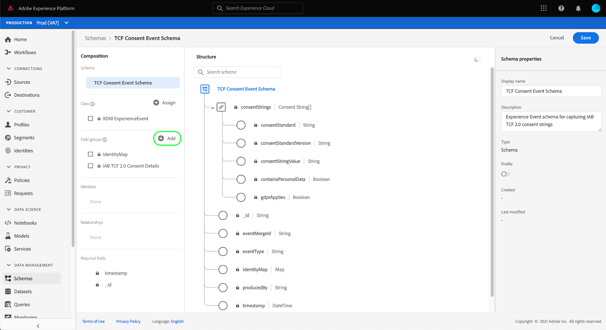

# Erstellen von Datensätzen zur Erfassung von IAB TCF 2.0-Einwilligungsdaten

Damit Adobe Experience Platform Kundeneinwilligungsdaten gemäß IAB [!DNL Transparency & Consent Framework] (TCF) 2.0 verarbeiten kann, müssen diese Daten an Datensätze gesendet werden, deren Schemas TCF 2.0-Einwilligungsfelder enthalten.

Für die Erfassung von TCF 2.0-Einwilligungsdaten sind zwei Datensätze erforderlich:

* Ein Datensatz, der auf der [!DNL XDM Individual Profile]-Klasse basiert und für die Verwendung in [!DNL Real-time Customer Profile] aktiviert ist.
* Ein Datensatz, der auf der [!DNL XDM ExperienceEvent]-Klasse basiert.

>[!IMPORTANT]
>
>Platform erzwingt nur die TCF-Zeichenfolgen, die im Datensatz &quot;Individuelles Profil&quot;erfasst werden. Auch wenn ein ExperienceEvent-Datensatz im Rahmen dieses Workflows weiterhin benötigt wird, um einen Datastream zu erstellen, müssen Sie nur Daten in den Profildatensatz aufnehmen. Der ExperienceEvent-Datensatz kann weiterhin verwendet werden, wenn Sie Zustimmungsänderungsereignisse im Laufe der Zeit verfolgen möchten. Diese Werte werden jedoch nicht bei der Erzwingung der Segmentaktivierung verwendet.

In diesem Dokument werden die Schritte zum Einrichten dieser beiden Datensätze beschrieben. Einen Überblick über den vollständigen Workflow zur Konfiguration Ihrer Platform-Datenvorgänge für TCF 2.0 finden Sie in der [IAB TCF 2.0 Compliance Overview](./overview.md).

## Voraussetzungen

Dieses Tutorial setzt ein Grundverständnis der folgenden Komponenten von Adobe Experience Platform voraus:

* [Experience-Datenmodell (XDM)](../../../../xdm/home.md): Das standardisierte Framework, mit dem [!DNL Experience Platform] Kundenerlebnisdaten organisiert.
   * [Grundlagen der Schemakomposition](../../../../xdm/schema/composition.md): Erfahren Sie mehr über die Grundbausteine von XDM-Schemas.
* [Adobe Experience Platform Identity-Dienst](../../../../identity-service/home.md): Ermöglicht es Ihnen, Kundenidentitäten von unterschiedlichen Datenquellen über Geräte und Systeme hinweg zu verbinden.
   * [Identitäts-Namespaces](../../../../identity-service/namespaces.md): Kundenidentitätsdaten müssen unter einem bestimmten Identitäts-Namespace bereitgestellt werden, der vom Identity Service erkannt wird.
* [Echtzeit-Kundenprofil](../../../../profile/home.md): Ermöglicht  [!DNL Identity Service] die Erstellung detaillierter Kundenprofile aus Ihren Datensätzen in Echtzeit. [!DNL Real-time Customer Profile] ruft Daten aus dem Data Lake ab und behält Kundenprofile in einem eigenen separaten Datenspeicher bei.

## TCF 2.0-Feldergruppen {#field-groups}

Die Schemafeldgruppe [!UICONTROL IAB TCF 2.0 Consent Details] enthält Felder für die Kundenzustimmung, die für die Unterstützung von TCF 2.0 erforderlich sind. Es gibt zwei Versionen dieser Feldergruppe: eine mit der Klasse [!DNL XDM Individual Profile] und die andere mit der Klasse [!DNL XDM ExperienceEvent] kompatibel ist.

In den folgenden Abschnitten wird die Struktur der einzelnen Feldergruppen beschrieben, einschließlich der Daten, die sie bei der Erfassung erwarten.

### Profilfeldgruppe {#profile-field-group}

Bei Schemas, die auf [!DNL XDM Individual Profile] basieren, stellt die Feldergruppe [!UICONTROL IAB TCF 2.0 Consent Details] ein einzelnes Zuordnungsfeld bereit, `identityPrivacyInfo`, das Kundenidentitäten ihren TCF-Zustimmungsvoreinstellungen zuordnet. Diese Feldergruppe muss in einem datensatzbasierten Schema enthalten sein, das für das Echtzeit-Kundenprofil aktiviert ist, damit die automatische Durchsetzung erfolgt.

Weitere Informationen zu Struktur und Anwendungsfall finden Sie im [Referenzhandbuch](../../../../xdm/field-groups/profile/iab.md) für diese Feldergruppe.

### Ereignisfeldgruppe {#event-field-group}

Wenn Sie Zustimmungsänderungs-Ereignisse im Zeitverlauf verfolgen möchten, können Sie die Feldergruppe [!UICONTROL IAB TCF 2.0 Consent Details] zu Ihrem [!UICONTROL XDM ExperienceEvent]-Schema hinzufügen.

Wenn Sie nicht planen, Zustimmungsänderungsereignisse im Laufe der Zeit zu verfolgen, müssen Sie diese Feldergruppe nicht in Ihr Ereignisschema aufnehmen. Beim automatischen Erzwingen von TCF-Zustimmungswerten verwendet Experience Platform nur die neuesten Zustimmungsinformationen, die in der [Profilfeldgruppe](#profile-field-group) erfasst werden. Die von Ereignissen erfassten Zustimmungswerte nehmen nicht an automatischen Durchsetzungs-Workflows teil.

Weitere Informationen zu Struktur und Anwendungsfall finden Sie im [Referenzhandbuch](../../../../xdm/field-groups/event/iab.md) für diese Feldergruppe.

## Erstellen von Einverständnisschemata für Kunden {#create-schemas}

Um Datensätze zu erstellen, die Einwilligungsdaten erfassen, müssen Sie zunächst XDM-Schemas erstellen, auf denen diese Datensätze basieren.

Wie im vorherigen Abschnitt erwähnt, ist ein Schema erforderlich, das die Klasse [!UICONTROL XDM Individual Profile] verwendet, um die Zustimmung in nachgelagerten Platform-Workflows zu erzwingen. Sie können optional auch ein separates Schema basierend auf [!UICONTROL XDM ExperienceEvent] erstellen, wenn Sie Zustimmungsänderungen im Laufe der Zeit verfolgen möchten. Beide Schemas müssen ein `identityMap`-Feld und eine entsprechende TCF 2.0-Feldergruppe enthalten.

Wählen Sie in der Platform-Benutzeroberfläche **[!UICONTROL Schemas]** im linken Navigationsbereich aus, um den Arbeitsbereich [!UICONTROL Schemas] zu öffnen. Führen Sie von hier aus die Schritte in den folgenden Abschnitten aus, um jedes erforderliche Schema zu erstellen.

>[!NOTE]
>
>Wenn Sie über vorhandene XDM-Schemas verfügen, mit denen Sie stattdessen Einwilligungsdaten erfassen möchten, können Sie diese Schemas bearbeiten, anstatt neue Schemas zu erstellen. Wenn jedoch ein vorhandenes Schema für die Verwendung im Echtzeit-Kundenprofil aktiviert wurde, kann seine primäre Identität nicht ein direkt identifizierbares Feld sein, das in interessensbasierter Werbung, wie z. B. einer E-Mail-Adresse, nicht verwendet werden darf. Wenden Sie sich an Ihren Rechtsbeistand, wenn Sie sich nicht sicher sind, welche Felder eingeschränkt sind.
>
>Darüber hinaus können bei der Bearbeitung vorhandener Schemas nur additive (nicht brechende) Änderungen vorgenommen werden. Weitere Informationen finden Sie im Abschnitt zu den [Prinzipien der Schemaentwicklung](../../../../xdm/schema/composition.md#evolution) .

### Erstellen eines Profilzustimmungsschemas {#profile-schema}

Wählen Sie **[!UICONTROL Schema]** erstellen und dann **[!UICONTROL XDM Individual Profile]** aus dem Dropdown-Menü.

Das Dialogfeld **[!UICONTROL Feldergruppen hinzufügen]** wird angezeigt, über das Sie sofort mit dem Hinzufügen von Feldergruppen zum Schema beginnen können. Wählen Sie von hier aus **[!UICONTROL IAB TCF 2.0 Consent Details]** aus der Liste aus. Sie können optional die Suchleiste verwenden, um die Ergebnisse einzugrenzen und die Feldergruppe leichter zu finden.

Suchen Sie dann die Feldergruppe **[!UICONTROL IdentityMap]** aus der Liste und wählen Sie sie auch aus. Sobald beide Feldergruppen in der rechten Leiste aufgelistet sind, wählen Sie **[!UICONTROL Feldergruppen hinzufügen]** aus.

Die Arbeitsfläche wird wieder angezeigt und zeigt an, dass die Felder `identityPrivacyInfo` und `identityMap` zur Schemastruktur hinzugefügt wurden.

Bevor Sie dem Schema weitere Felder hinzufügen, wählen Sie das Stammfeld aus, um **[!UICONTROL Schemaeigenschaften]** in der rechten Leiste anzuzeigen, wo Sie einen Namen und eine Beschreibung für das Schema angeben können.

Nachdem Sie einen Namen und eine Beschreibung angegeben haben, können Sie dem Schema optional weitere Felder hinzufügen, indem Sie **[!UICONTROL Hinzufügen]** unter dem Abschnitt **[!UICONTROL Feldergruppen]** auf der linken Seite der Arbeitsfläche auswählen.

Wenn Sie ein vorhandenes Schema bearbeiten, das bereits für die Verwendung in [!DNL Real-time Customer Profile] aktiviert wurde, wählen Sie **[!UICONTROL Speichern]** aus, um Ihre Änderungen zu bestätigen, bevor Sie mit dem Abschnitt [Erstellen eines Datensatzes basierend auf Ihrem Einwilligungsschema](#dataset) fortfahren. Wenn Sie ein neues Schema erstellen, führen Sie die im folgenden Unterabschnitt beschriebenen Schritte aus.

#### Aktivieren Sie das Schema zur Verwendung in [!DNL Real-time Customer Profile]

Damit Platform die eingehenden Zustimmungsdaten bestimmten Kundenprofilen zuordnen kann, muss das Einwilligungsschema für die Verwendung in [!DNL Real-time Customer Profile] aktiviert sein.

>[!NOTE]
>
>Das in diesem Abschnitt gezeigte Beispielschema verwendet sein `identityMap` -Feld als primäre Identität. Wenn Sie ein anderes Feld als primäre Identität festlegen möchten, stellen Sie sicher, dass Sie eine indirekte Kennung wie eine Cookie-ID verwenden und nicht ein direkt identifizierbares Feld, das in interessensbasierter Werbung nicht verwendet werden darf, z. B. eine E-Mail-Adresse. Wenden Sie sich an Ihren Rechtsbeistand, wenn Sie sich nicht sicher sind, welche Felder eingeschränkt sind.
>
>Schritte zum Festlegen eines primären Identitätsfelds für ein Schema finden Sie im [[!UICONTROL Schemas] UI-Handbuch](../../../../xdm/ui/fields/identity.md).

Um das Schema für [!DNL Profile] zu aktivieren, wählen Sie in der linken Leiste den Namen des Schemas aus, um den Abschnitt **[!UICONTROL Schemaeigenschaften]** zu öffnen. Wählen Sie hier die Schaltfläche **[!UICONTROL Profil]** aus.

Es wird ein Popup angezeigt, das auf eine fehlende primäre Identität hinweist. Aktivieren Sie das Kontrollkästchen für die Verwendung einer alternativen primären Identität, da die primäre Identität im Feld `identityMap` enthalten sein wird.

Wählen Sie abschließend **[!UICONTROL Speichern]** aus, um Ihre Änderungen zu bestätigen.

### Erstellen eines Zustimmungsschemas für Ereignisse {#event-schema}

>[!NOTE]
>
>Einwilligungsschemata für Ereignisse werden nur verwendet, um Einwilligungsänderungen im Laufe der Zeit zu verfolgen, und nehmen nicht an nachgelagerten Durchsetzungs-Workflows teil. Wenn Sie Zustimmungsänderungen nicht im Laufe der Zeit verfolgen möchten, können Sie mit dem nächsten Abschnitt [Erstellen von Zustimmungsdatensätzen](#datasets) fortfahren.

Wählen Sie im Arbeitsbereich **[!UICONTROL Schemas]** die Option **[!UICONTROL Schema erstellen]** und dann **[!UICONTROL XDM ExperienceEvent]** aus der Dropdown-Liste.

Das Dialogfeld **[!UICONTROL Feldgruppen hinzufügen]** wird angezeigt. Wählen Sie von hier aus **[!UICONTROL IAB TCF 2.0 Consent Details]** aus der Liste aus. Sie können optional die Suchleiste verwenden, um die Ergebnisse einzugrenzen und die Feldergruppe leichter zu finden.

Suchen Sie dann die Feldergruppe **[!UICONTROL IdentityMap]** aus der Liste und wählen Sie sie auch aus. Sobald beide Feldergruppen in der rechten Leiste aufgelistet sind, wählen Sie **[!UICONTROL Feldergruppen hinzufügen]** aus.

Die Arbeitsfläche wird wieder angezeigt und zeigt an, dass die Felder `consentStrings` und `identityMap` zur Schemastruktur hinzugefügt wurden.

Bevor Sie dem Schema weitere Felder hinzufügen, wählen Sie das Stammfeld aus, um **[!UICONTROL Schemaeigenschaften]** in der rechten Leiste anzuzeigen, wo Sie einen Namen und eine Beschreibung für das Schema angeben können.

Nachdem Sie einen Namen und eine Beschreibung angegeben haben, können Sie dem Schema optional weitere Felder hinzufügen, indem Sie **[!UICONTROL Hinzufügen]** unter dem Abschnitt **[!UICONTROL Feldergruppen]** auf der linken Seite der Arbeitsfläche auswählen.

Nachdem die erforderlichen Feldergruppen hinzugefügt wurden, beenden Sie die Auswahl von **[!UICONTROL Speichern]**.

## Erstellen von Datensätzen basierend auf Ihren Einwilligungsschemas {#datasets}

Für jedes der oben beschriebenen erforderlichen Schemas müssen Sie einen Datensatz erstellen, in dem letztendlich die Zustimmungsdaten Ihrer Kunden erfasst werden. Der Datensatz, der auf dem Datensatzschema basiert, muss für [!DNL Real-time Customer Profile] aktiviert sein, während der Datensatz, der auf dem Zeitreihenschema **basiert, nicht** [!DNL Profile] aktiviert sein sollte.

Wählen Sie zunächst **[!UICONTROL Datensätze]** im linken Navigationsbereich und dann **[!UICONTROL Datensatz erstellen]** in der oberen rechten Ecke aus.

Wählen Sie auf der nächsten Seite **[!UICONTROL Datensatz aus Schema]** erstellen.

Der Workflow **[!UICONTROL Datensatz aus Schema]** erstellen wird angezeigt, beginnend mit dem Schritt **[!UICONTROL Schema]** auswählen . Suchen Sie in der bereitgestellten Liste eines der zuvor erstellten Einwilligungsschemas. Sie können optional die Suchleiste verwenden, um Ergebnisse einzuschränken und Ihr Schema leichter zu finden. Wählen Sie das Optionsfeld neben dem gewünschten Schema aus und wählen Sie dann **[!UICONTROL Weiter]** aus, um fortzufahren.

Der Schritt **[!UICONTROL Datensatz konfigurieren]** wird angezeigt. Geben Sie einen eindeutigen, leicht identifizierbaren Namen und eine Beschreibung für den Datensatz ein, bevor Sie **[!UICONTROL Finish]** auswählen.

Die Detailseite für den neu erstellten Datensatz wird angezeigt. Wenn der Datensatz auf Ihrem Zeitreihenschema basiert, ist der Prozess abgeschlossen. Wenn der Datensatz auf Ihrem Datensatzschema basiert, besteht der letzte Schritt im Prozess darin, den Datensatz zur Verwendung in [!DNL Real-time Customer Profile] zu aktivieren.

Wählen Sie in der rechten Leiste den Umschalter **[!UICONTROL Profil]** und dann **[!UICONTROL Aktivieren]** im Bestätigungs-Popup, um das Schema für [!DNL Profile] zu aktivieren.

Führen Sie die oben genannten Schritte erneut aus, um einen ereignisbasierten Datensatz zu erstellen, wenn Sie ein Schema dafür erstellt haben.

## Nächste Schritte

In diesem Tutorial haben Sie mindestens einen Datensatz erstellt, der jetzt zur Erfassung von Kundenzustimmungsdaten verwendet werden kann:

* Ein datensatzbasierter Datensatz, der für die Verwendung im Echtzeit-Kundenprofil aktiviert ist. **(Erforderlich)**
* Ein zeitreihenbasierter Datensatz, der nicht für [!DNL Profile] aktiviert ist. (Optional)

Sie können jetzt zur [IAB TCF 2.0-Übersicht](./overview.md#merge-policies) zurückkehren, um den Prozess der Konfiguration von Platform für die TCF 2.0-Konformität fortzusetzen.
