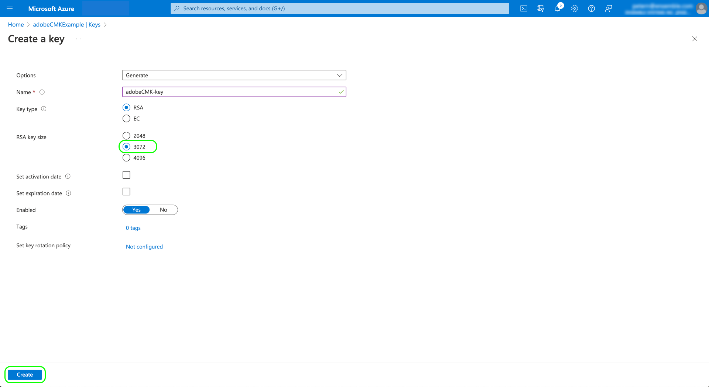

# Vom Kunden verwaltete Schlüssel in Adobe Experience Platform

In Adobe Experience Platform gespeicherte Daten werden im Ruhezustand mithilfe von Schlüsseln auf Systemebene verschlüsselt. Wenn Sie ein Programm verwenden, das auf Platform aufbaut, können Sie stattdessen eigene Verschlüsselungsschlüssel verwenden, um die Datensicherheit zu verbessern.

In diesem Dokument wird der Prozess zum Aktivieren der Funktion für kundenverwaltete Schlüssel (CMK) in Platform beschrieben.

## Voraussetzungen

Um CMK zu aktivieren, benötigen Sie Zugriff auf **all** der folgenden Funktionen in [!DNL Microsoft Azure]:

* [Rollenbasierte Zugriffssteuerungsrichtlinien](https://learn.microsoft.com/en-us/azure/role-based-access-control/) (nicht zu verwechseln mit derselben Funktion in Experience Platform)
* [Key Vault soft-delete](https://learn.microsoft.com/en-us/azure/key-vault/general/soft-delete-overview)
* [Bereinigungsschutz](https://learn.microsoft.com/en-us/azure/key-vault/general/soft-delete-overview#purge-protection)

## Prozesszusammenfassung

CMK ist Teil des Healthcare Shield- und des Privacy and Security Shield-Angebots von Adobe. Nachdem Ihr Unternehmen eine Lizenz für eines dieser Angebote erworben hat, können Sie einen einmaligen Prozess zur Einrichtung der Funktion starten.

>[!WARNING]
>
>Nach dem Einrichten von CMK können Sie nicht zu systemverwalteten Schlüsseln zurückkehren. Sie sind dafür verantwortlich, Ihre Schlüssel sicher zu verwalten und den Zugriff auf Ihre Schlüsseltresor-, Schlüssel- und CMK-App innerhalb von [!DNL Azure] bereitzustellen, um zu verhindern, dass der Zugriff auf Ihre Daten verloren geht.

Der Prozess sieht folgendermaßen aus:

1. [Konfigurieren Sie einen  [!DNL Azure] Schlüsseltresor](#create-key-vault) auf der Grundlage der Richtlinien Ihrer Organisation und generieren Sie dann [einen Verschlüsselungsschlüssel](#generate-a-key), der letztendlich an Adobe weitergegeben wird.
1. Verwenden Sie API-Aufrufe zum [Einrichten der CMK-App](#register-app) mit Ihrem [!DNL Azure]-Mandanten.
1. Verwenden Sie API-Aufrufe, um [Ihre Verschlüsselungsschlüssel-ID an Adobe zu senden](#send-to-adobe), und starten Sie den Aktivierungsprozess für die Funktion.
1. [Prüfen Sie den Status der Konfiguration](#check-status), um zu überprüfen, ob CMK aktiviert wurde.

Sobald der Einrichtungsprozess abgeschlossen ist, werden alle Daten aus allen Sandboxes, die in Platform integriert sind, mit Ihrer [!DNL Azure]-Schlüsseleinrichtung verschlüsselt. Zur Verwendung von CMK nutzen Sie die [!DNL Microsoft Azure]-Funktionen, die Teil des [öffentlichen Vorschauprogramms](https://azure.microsoft.com/de-de/support/legal/preview-supplemental-terms/) sein können.

## Konfigurieren eines [!DNL Azure]-Schlüsseltresors {#create-key-vault}

CMK unterstützt nur Schlüssel aus einem [!DNL Microsoft Azure]-Schlüsseltresor. Zunächst müssen Sie mit [!DNL Azure] arbeiten, um ein neues Unternehmenskonto zu erstellen, oder Sie verwenden ein vorhandenes Unternehmenskonto und führen die folgenden Schritte aus, um den Schlüsseltresor zu erstellen.

>[!IMPORTANT]
>
>Nur die Service-Stufen Premium und Standard werden für den [!DNL Azure]-Schlüsseltresor unterstützt. [!DNL Azure Managed HSM], [!DNL Azure Dedicated HSM] und [!DNL Azure Payments HSM] werden nicht unterstützt. Siehe die [[!DNL Azure] Dokumentation](https://learn.microsoft.com/de-de/azure/security/fundamentals/key-management#azure-key-management-services) für weitere Informationen über angebotene Schlüsselverwaltungsdienste.

>[!NOTE]
>
>Die folgende Dokumentation behandelt nur die grundlegenden Schritte zum Erstellen des Schlüsseltresors. Außerhalb dieser Anleitung sollten Sie den Schlüsselwert gemäß den Richtlinien Ihrer Organisation konfigurieren.

Melden Sie sich beim [!DNL Azure]-Portal an und suchen Sie mithilfe der Suchleiste unter der Liste der Dienste nach **[!DNL Key vaults]**.


Die **[!DNL Key vaults]**-Seite wird angezeigt, nachdem Sie den Dienst ausgewählt haben. Klicken Sie von hier aus auf **[!DNL Create]**.


Füllen Sie mithilfe des bereitgestellten Formulars die grundlegenden Details für den Schlüsseltresor aus, einschließlich eines Namens und einer zugewiesenen Ressourcengruppe.

>[!WARNING]
>
>Die meisten Optionen können als Standardwerte beibehalten werden. **Stellen Sie sicher, dass Sie die Schutzoptionen für Soft-Löschen und Bereinigen aktivieren**. Wenn Sie diese Funktionen nicht aktivieren, riskieren Sie, den Zugriff auf Ihre Daten zu verlieren, falls der Schlüsseltresor gelöscht wird.
>
>

Fahren Sie von hier aus mit dem Workflow zur Erstellung des Schlüsseltresors fort und konfigurieren Sie die verschiedenen Optionen entsprechend den Richtlinien Ihrer Organisation.

Wenn Sie beim Schritt **[!DNL Review + create]** ankommen, können Sie die Details des Schlüsseltresors während der Validierung überprüfen. Nachdem die Validierung erfolgreich abgeschlossen wurde, klicken Sie auf **[!DNL Create]**, um den Prozess abzuschließen.


### Konfigurieren von Netzwerkoptionen

Wenn Ihr Schlüsseltresor so konfiguriert ist, dass der öffentliche Zugriff auf bestimmte virtuelle Netzwerke eingeschränkt oder der öffentliche Zugriff vollständig deaktiviert ist, müssen Sie Microsoft eine Firewall-Ausnahme gewähren.

Wählen Sie **[!DNL Networking]** in der linken Navigation aus. Markieren Sie unter **[!DNL Firewalls and virtual networks]** das Kontrollkästchen **[!DNL Allow trusted Microsoft services to bypass this firewall]** und klicken Sie dann auf **[!DNL Apply]**.


### Generieren eines Schlüssels {#generate-a-key}

Nachdem Sie einen Schlüsseltresor erstellt haben, können Sie einen neuen Schlüssel generieren. Navigieren Sie zur Registerkarte **[!DNL Keys]** und wählen Sie **[!DNL Generate/Import]** aus.


Verwenden Sie das bereitgestellte Formular, um einen Namen für den Schlüssel anzugeben, und wählen Sie **RSA** für den Schlüsseltyp aus. Die Variable **[!DNL RSA key size]** darf nicht kleiner sein als **3072** Bit, wie von [!DNL Cosmos DB] vorgeschrieben. [!DNL Azure Data Lake Storage] ist auch mit RSA 3027 kompatibel.

>[!NOTE]
>
>Merken Sie sich den Namen, den Sie für den Schlüssel angeben, da er in einem späteren Schritt verwendet wird, wenn [der Schlüssel an Adobe gesendet wird](#send-to-adobe).

Verwenden Sie die restlichen Steuerelemente, um den Schlüssel zu konfigurieren, den Sie erstellen oder importieren möchten. Wenn Sie fertig sind, wählen Sie **[!DNL Create]** aus.



Der konfigurierte Schlüssel wird in der Liste der Schlüssel für den Tresor angezeigt.


## Einrichten der CMK-App {#register-app}

Nachdem Sie Ihren Schlüsseltresor konfiguriert haben, müssen Sie sich für das CMK-Programm registrieren, die sich mit Ihrem [!DNL Azure]-Mandanten verbindet.

### Erste Schritte

Zum Registrieren des CMK-Programms müssen Sie Aufrufe an Platform-APIs durchführen. Weitere Informationen dazu, wie Sie die erforderlichen Authentifizierungskopfzeilen für diese Aufrufe erfassen, finden Sie im [Handbuch zur Platform-API-Authentifizierung](../../landing/api-authentication.md).

Während das Authentifizierungshandbuch Anweisungen zum Generieren Ihres eigenen eindeutigen Werts für die erforderliche `x-api-key`-Anfragekopfzeile enthält, verwenden alle API-Vorgänge in diesem Handbuch stattdessen den statischen Wert `acp_provisioning`. Sie müssen allerdings weiterhin eigene Werte für `{ACCESS_TOKEN}` und `{ORG_ID}` angeben.

In allen in diesem Handbuch angezeigten API-Aufrufen: `platform.adobe.io` wird als Stammpfad verwendet, der standardmäßig auf den VA7-Bereich verweist. Wenn Ihr Unternehmen eine andere Region verwendet, `platform` muss ein Bindestrich und der Ihrer Organisation zugewiesene Regions-Code folgen: `nld2` für NLD2 oder `aus5` für AUS5 (z. B.: `platform-aus5.adobe.io`). Wenn Sie die Region Ihres Unternehmens nicht kennen, wenden Sie sich an Ihren Systemadministrator.

### Abrufen einer Authentifizierungs-URL

Um den Registrierungsprozess zu starten, stellen Sie eine GET-Anfrage an den App-Registrierungsendpunkt, um die erforderliche Authentifizierungs-URL für Ihre Organisation abzurufen.

**Anfrage**

```shell
curl -X GET \
  https://platform.adobe.io/data/infrastructure/manager/byok/app-registration \ 
  -H 'Authorization: Bearer {ACCESS_TOKEN}' \
  -H 'x-api-key: acp_provisioning' \
  -H 'x-gw-ims-org-id: {ORG_ID}'
```

**Antwort**

Eine erfolgreiche Antwort gibt eine `applicationRedirectUrl`-Eigenschaft zurück, die die Authentifizierungs-URL enthält.

```json
{
    "id": "byok",
    "name": "acpebae9422Caepcmkmultitenantapp",
    "applicationUri": "https://adobe.com/acpebae9422Caepcmkmultitenantapp",
    "applicationId": "e463a445-c6ac-4ca2-b36a-b5146fcf6a52",
    "applicationRedirectUrl": "https://login.microsoftonline.com/common/oauth2/authorize?response_type=code&client_id=e463a445-c6ac-4ca2-b36a-b5146fcf6a52&redirect_uri=https://adobe.com/acpebae9422Caepcmkmultitenantapp&scope=user.read"
}
```

Kopieren Sie die `applicationRedirectUrl`-Adresse und fügen Sie sie in einen Browser ein, um ein Authentifizierungsdialogfeld zu öffnen. Wählen Sie **[!DNL Accept]** aus, um den Service-Prinzipal der CMK-App zu Ihrem [!DNL Azure]-Mandanten hinzuzufügen.


### Zuweisen der CMK-App zu einer Rolle {#assign-to-role}

Navigieren Sie nach Abschluss des Authentifizierungsprozesses zu Ihrem [!DNL Azure]-Schlüsseltresor und wählen Sie **[!DNL Access control]** in der linken Navigation aus. Wählen Sie von hier aus **[!DNL Add]** gefolgt von **[!DNL Add role assignment]** aus.


Im nächsten Bildschirm werden Sie aufgefordert, eine Rolle für diese Zuweisung auszuwählen. Wählen Sie **[!DNL Key Vault Crypto Service Encryption User]** aus, bevor Sie auf **[!DNL Next]** klicken, um fortzufahren.


Wählen Sie auf dem nächsten Bildschirm **[!DNL Select members]** aus, um ein Dialogfeld in der rechten Leiste zu öffnen. Verwenden Sie die Suchleiste, um den Service-Prinzipal für das CMK-Programm zu suchen und ihn aus der Liste auszuwählen. Wenn Sie fertig sind, klicken Sie auf **[!DNL Save]**.

>[!NOTE]
>
>Wenn Sie Ihr Programm in der Liste nicht finden, wurde Ihr Service-Prinzipal in Ihrem Mandanten nicht akzeptiert. Arbeiten Sie bitte mit Ihrem Administrator oder Kundenbetreuer von [!DNL Azure] zusammen, um sicherzustellen, dass Sie über die richtigen Berechtigungen verfügen.

## Aktivieren der Konfiguration des Verschlüsselungsschlüssels auf Experience Platform {#send-to-adobe}

Nach der Installation der CMK-App in [!DNL Azure] können Sie Ihre Verschlüsselungsschlüssel-ID an Adobe senden. Wählen Sie in der linken Navigation **[!DNL Keys]** aus, gefolgt vom Namen des Schlüssels, den Sie senden möchten.


Wählen Sie die neueste Version des Schlüssels aus, und seine Detailseite wird angezeigt. Von hier aus können Sie optional die zulässigen Vorgänge für den Schlüssel konfigurieren. Dem Schlüssel müssen mindestens die Berechtigungen **[!DNL Wrap Key]** und **[!DNL Unwrap Key]** gewährt werden.

Das Feld **[!UICONTROL Schlüsselkennung]** zeigt die URI-Kennung für den Schlüssel an. Kopieren Sie diesen URI-Wert zur Verwendung im nächsten Schritt.


Nachdem Sie den Schlüsseltresor-URI erhalten haben, können Sie ihn mit einer POST-Anfrage an den CMK-Konfigurations-Endpunkt senden.

>[!NOTE]
>
>Nur der Schlüssel und der Schlüsselname werden bei Adobe gespeichert, nicht die Schlüsselversion.

**Anfrage**

```shell
curl -X POST \
  https://platform.adobe.io/data/infrastructure/manager/customer/config \ 
  -H 'Authorization: Bearer {ACCESS_TOKEN}' \
  -H 'x-api-key: acp_provisioning' \
  -H 'x-gw-ims-org-id: {ORG_ID}' \
  -d '{
        "name": "Config1",
        "type": "BYOK_CONFIG",
        "imsOrgId": "{ORG_ID}",
        "configData": {
          "providerType": "AZURE_KEYVAULT",
          "keyVaultKeyIdentifier": "https://adobecmkexample.vault.azure.net/keys/adobeCMK-key/7c1d50lo28234cc895534c00d7eb4eb4"
        }
      }'
```

| Eigenschaft | Beschreibung |
| --- | --- |
| `name` | Ein Name für die Konfiguration. Stellen Sie sicher, dass Sie sich diesen Wert merken, da er erforderlich ist, um den Konfigurationsstatus in einem [späteren Schritt](#check-status) zu überprüfen. Bei dem Wert ist die Groß-/Kleinschreibung zu beachten. |
| `type` | Der Konfigurationstyp. Muss auf `BYOK_CONFIG` festgelegt werden. |
| `imsOrgId` | Die Kennung Ihrer IMS-Organisation. Dieser Wert muss mit dem Wert übereinstimmen, der unter der `x-gw-ims-org-id`-Kopfzeile angegeben wird. |
| `configData` | Enthält die folgenden Details zur Konfiguration:<ul><li>`providerType`: Muss auf `AZURE_KEYVAULT` festgelegt werden.</li><li>`keyVaultKeyIdentifier`: Der URI für den Schlüsseltresor, den Sie [zuvor](#send-to-adobe) kopiert haben.</li></ul> |

**Antwort**

Eine erfolgreiche Antwort gibt die Details des angegebenen Konfigurationsvorgangs zurück.

```json
{
  "id": "4df7886b-a122-4391-880b-47888d5c5b92",
  "config": {
    "configData": {
      "keyVaultUri": "https://adobecmkexample.vault.azure.net",
      "keyVaultKeyIdentifier": "https://adobecmkexample.vault.azure.net/keys/adobeCMK-key/7c1d50lo28234cc895534c00d7eb4eb4",
      "keyVersion": "7c1d50lo28234cc895534c00d7eb4eb4",
      "keyName": "Config1",
      "providerType": "AZURE_KEYVAULT"
    },
    "name": "acpcf978863Aaepcmkmultitenantapp",
    "type": "BYOK_CONFIG",
    "imsOrgId": "{IMS_ORG}",
    "status": "NEW"
  },
  "status": "CREATED"
}
```

Der Vorgang sollte die Verarbeitung innerhalb weniger Minuten abschließen.

## Überprüfen des Konfigurationsstatus {#check-status}

Um den Status der Konfigurationsanfrage zu überprüfen, können Sie eine GET-Anfrage stellen.

**Anfrage**

Sie müssen den `name` der Konfiguration, die Sie überprüfen möchten, an den Pfad (`config1` im Beispiel unten) anhängen und einen `configType`-Abfrageparameter, der auf `BYOK_CONFIG` gesetzt ist, einfügen.

```shell
curl -X GET \
  https://platform.adobe.io/data/infrastructure/manager/customer/config/config1?configType=BYOK_CONFIG \ 
  -H 'Authorization: Bearer {ACCESS_TOKEN}' \
  -H 'x-api-key: acp_provisioning' \
  -H 'x-gw-ims-org-id: {ORG_ID}'
```

**Antwort**

Eine erfolgreiche Antwort gibt den Status des Vorgangs zurück.

```json
{
  "name": "acpcf978863Aaepcmkmultitenantapp",
  "type": "BYOK_CONFIG",
  "status": "COMPLETED",
  "configData": {
    "keyVaultUri": "https://adobecmkexample.vault.azure.net",
    "keyVaultKeyIdentifier": "https://adobecmkexample.vault.azure.net/keys/adobeCMK-key/7c1d50lo28234cc895534c00d7eb4eb4",
    "keyVersion": "7c1d50lo28234cc895534c00d7eb4eb4",
    "keyName": "Config1",
    "providerType": "AZURE_KEYVAULT"
  },
  "imsOrgId": "{IMS_ORG}",
  "subscriptionId": "cf978863-7325-47b1-8fd9-554b9fdb6c36",
  "id": "4df7886b-a122-4391-880b-47888d5c5b92",
  "rowType": "BYOK_KEY"
}
```

Das `status`-Attribut kann einen von vier Werten mit folgenden Bedeutungen haben:

1. `RUNNING`: Überprüft, ob Platform Zugriff auf den Schlüssel und den Schlüsseltresor hat.
1. `UPDATE_EXISTING_RESOURCES`: Das System fügt den Schlüsseltresor und den Schlüsselnamen zu den Datenspeichern in allen Sandboxes in Ihrer Organisation hinzu.
1. `COMPLETED`: Der Schlüsseltresor und der Schlüsselname wurden den Datenspeichern hinzugefügt.
1. `FAILED`: Es ist ein Problem aufgetreten, das in erster Linie mit dem Schlüssel, dem Schlüsseltresor oder der Einrichtung der Multi-Mandanten-App-zusammenhängt.

## Nächste Schritte

Durch Ausführung der oben genannten Schritte haben Sie CMK für Ihre Organisation erfolgreich aktiviert. Daten, die in Platform aufgenommen werden, werden jetzt mit dem oder den Schlüssel(n) in Ihrem [!DNL Azure]-Schlüsseltresor ver- und entschlüsselt. Wenn Sie den Platform-Zugriff auf Ihre Daten sperren möchten, können Sie die mit dem Programm verknüpfte Benutzerrolle aus dem Schlüsseltresor in [!DNL Azure] entfernen.

Nachdem Sie den Zugriff auf das Programm deaktiviert haben, kann es einige Minuten bis 24 Stunden dauern, bis die Daten nicht mehr in Platform verfügbar sind. Die gleiche Zeitverzögerung gilt für Daten, die erneut verfügbar werden, wenn der Zugriff auf das Programm erneut aktiviert wird.

>[!WARNING]
>
>Sobald die Schlüsseltresor-, Schlüssel- oder CMK-App deaktiviert ist und Daten in Platform nicht mehr verfügbar sind, sind alle nachgelagerten Vorgänge im Zusammenhang mit diesen Daten nicht mehr möglich. Stellen Sie sicher, dass Sie die nachgelagerten Auswirkungen einer Sperrung des Platform-Zugriffs auf Ihre Daten verstehen, bevor Sie Änderungen an Ihrer Konfiguration vornehmen.
