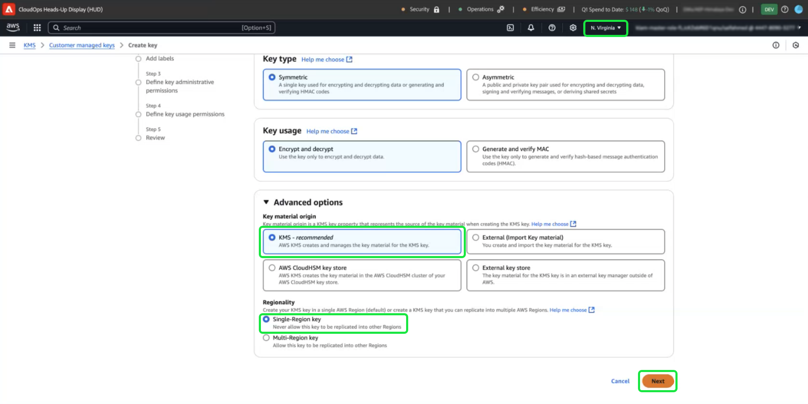

# Konfigurieren von AWS KMS für kundenverwaltete Schlüssel

>[!AVAILABILITY]
>
>Dieses Dokument gilt für Implementierungen von Experience Platform, die auf Amazon Web Services (AWS) ausgeführt werden. Experience Platform, das auf AWS ausgeführt wird, steht derzeit einer begrenzten Anzahl von Kunden zur Verfügung. Weitere Informationen zur unterstützten Experience Platform-Infrastruktur finden Sie in der Übersicht zur [Experience Platform Multi-Cloud](https://experienceleague.adobe.com/de/docs/experience-platform/landing/multi-cloud).
>
>[Vom Kunden verwaltete Schlüssel](../overview.md) (CMK) auf AWS werden für Privacy und Security Shield unterstützt, sind jedoch nicht für Healthcare Shield verfügbar. CMK wird auf Azure sowohl für Privacy und Security Shield als auch für Healthcare Shield unterstützt.

Verwenden Sie dieses Handbuch, um Ihre Daten mit Amazon Web Services (AWS) Key Management Service (KMS) zu schützen, indem Sie Verschlüsselungsschlüssel für Adobe Experience Platform erstellen, verwalten und steuern. Diese Integration vereinfacht die Compliance, optimiert den Betrieb durch Automatisierung und macht die Pflege Ihrer eigenen Schlüsselverwaltungsinfrastruktur überflüssig.

Spezifische Anweisungen für Customer Journey Analytics finden Sie in der Dokumentation zu [Customer Journey Analytics CMK](https://experienceleague.adobe.com/de/docs/analytics-platform/using/cja-privacy/cmk)

>[!IMPORTANT]
>
>Adobe Experience Platform verschlüsselt Daten im Ruhezustand standardmäßig mit systemverwalteten Schlüsseln. Durch die Aktivierung von kundenverwalteten Schlüsseln (CMK) übernehmen Sie die volle Kontrolle über Ihre Datensicherheit. Diese Änderung kann jedoch nicht rückgängig gemacht werden. Sobald CMK aktiviert ist, können Sie nicht mehr zu systemverwalteten Schlüsseln zurückkehren. Sie sind dafür verantwortlich, Ihre Schlüssel sicher zu verwalten, um den unterbrechungsfreien Zugriff auf Ihre Daten sicherzustellen und potenzielle Unzugänglichkeiten zu verhindern.

Verwenden Sie AWS KMS, um die Datensicherheit mit integrierter Verschlüsselungsschlüsselverwaltung für Adobe Experience Platform zu verbessern. Befolgen Sie diese Anleitung zum Erstellen und Verwalten von Verschlüsselungsschlüsseln, um sicherzustellen, dass Ihre Daten geschützt bleiben.

## Voraussetzungen {#prerequisites}

Bevor Sie mit diesem Dokument fortfahren, sollten Sie über gute Kenntnisse der folgenden Schlüsselkonzepte und -funktionen verfügen:

- **AWS Key Management Service (KMS)**: Machen Sie sich mit den Grundlagen von AWS KMS vertraut, einschließlich der Erstellung, Verwaltung und Rotation von Verschlüsselungsschlüsseln. Weitere Informationen finden Sie in der [offiziellen KMS](https://docs.aws.amazon.com/kms/)Dokumentation.
- **Richtlinien zur Identitäts- und Zugriffsverwaltung (IAM) in AWS**: IAM ist ein Service, mit dem Sie den Zugriff auf AWS-Services und -Ressourcen sicher verwalten können. Verwenden Sie IAM für Folgendes:
   - Definieren Sie, welche Benutzenden, Gruppen und Rollen Zugriff auf bestimmte Ressourcen haben.
   - Geben Sie an, welche Aktionen Benutzenden erlaubt oder verweigert werden sollen.
   - Implementieren Sie eine differenzierte Zugriffssteuerung, indem Sie Berechtigungen mithilfe von IAM-Richtlinien zuweisen.
Weitere Informationen finden [ in der offiziellen Dokumentation ](https://docs.aws.amazon.com/kms/latest/developerguide/iam-policies.html) IAM-Richtlinien für AWS KMS .
- **Datensicherheit in Experience Platform**: Erfahren Sie, wie Experience Platform die Datensicherheit gewährleistet und zur Verschlüsselung mit externen Services wie AWS KMS integriert. Experience Platform schützt Daten mit HTTPS TLS v1.2 für die Übertragung, Cloud-Anbieterverschlüsselung im Ruhezustand, isolierten Speicher und anpassbare Authentifizierungs- und Verschlüsselungsoptionen. Experience Platform Weitere Informationen zur [ Ihrer Daten finden Sie unter ](../overview.md)Governance, Datenschutz und Sicherheit“ oder im Dokument [Datenverschlüsselung in ](../../encryption.md)).
- **AWS-Verwaltungskonsole**: Ein zentraler Hub, über den Sie von einem webbasierten Programm aus auf alle AWS-Services zugreifen und diese verwalten können. Verwenden Sie die Suchleiste, um schnell Tools zu finden, Benachrichtigungen zu überprüfen, Ihr Konto und Ihre Abrechnung zu verwalten und Ihre Einstellungen anzupassen. Weitere Informationen finden [ in der offiziellen Dokumentation ](https://docs.aws.amazon.com/awsconsolehelpdocs/latest/gsg/what-is.html) AWS-Verwaltungskonsole .

## Erste Schritte {#get-started}

Für dieses Handbuch müssen Sie bereits Zugriff auf ein Amazon Web Services-Konto und die Verwaltungskonsole haben. Gehen Sie wie folgt vor, um loszulegen:

### Unterstützte Region auswählen {#select-supported-region}

AWS KMS ist in bestimmten Regionen verfügbar. Stellen Sie sicher, dass Sie in einer Region arbeiten, in der KMS unterstützt wird. Sie können eine vollständige Liste der unterstützten Regionen in der Liste [AWS KMS-Endpunkte und -Kontingente](https://aws.amazon.com/about-aws/global-infrastructure/regional-product-services/) anzeigen.

Stellen Sie sicher, dass sich Ihr AWS KMS-Verschlüsselungsschlüssel in derselben Region wie Ihre Adobe Experience Platform-Instanz befindet, um die Einhaltung von Datenresidenzanforderungen zu gewährleisten, die Leistung zu optimieren und zusätzliche regionenübergreifende Kosten zu vermeiden. Fehlerhafte Regionen können zu Datenzugriff und Integrationsfehlern führen.

### Berechtigungen überprüfen {#verify-permissions}

Stellen Sie sicher, dass Sie über die erforderlichen AWS Identity and Access Management (IAM)-Berechtigungen verfügen, um Verschlüsselungsschlüssel in KMS zu erstellen, zu verwalten und zu verwenden. So überprüfen Sie Ihre Berechtigungen:

1. Rufen Sie den [IAM-Richtliniensimulator](https://policysim.aws.amazon.com/) auf.
2. Wählen Sie Ihr Benutzerkonto oder die Rolle aus.
3. Simulieren von KMS-Aktionen wie `kms:CreateKey` oder `kms:Encrypt`.

Wenn die Simulation einen Fehler zurückgibt oder Sie sich bezüglich Ihrer Berechtigungen nicht sicher sind, wenden Sie sich an Ihren AWS-Administrator, um Hilfe zu erhalten.

### Überprüfen der AWS-Kontokonfiguration

Vergewissern Sie sich, dass Ihr AWS-Konto für die Verwendung von AWS KMS-Services aktiviert ist. Für die meisten Konten ist der KMS-Zugriff standardmäßig aktiviert. Sie können die Einrichtung Ihres Kontos jedoch überprüfen, indem Sie die [AWS-Verwaltungskonsole aufrufen](https://aws.amazon.com/console/). Weitere Informationen finden Sie im Entwicklerhandbuch für den [AWS Key Management Service](https://docs.aws.amazon.com/kms/latest/developerguide/overview.html).

### Navigieren Sie zu AWS KMS, um die Tasteneinrichtung zu starten

Um mit der Einrichtung und Verwaltung Ihres Verschlüsselungsschlüssels zu beginnen, melden Sie sich bei Ihrem AWS-Konto an und navigieren Sie zu AWS Key Management Service (KMS). Wählen Sie in der AWS-Verwaltungskonsole die Option **Key Management Service (KMS)** aus dem Menü „Services“ aus.

## Neuen Schlüssel erstellen {#create-a-key}

>[!IMPORTANT]
>
>Sicherstellen der sicheren Speicherung, des Zugriffs und der Verfügbarkeit der Verschlüsselungsschlüssel Sie sind dafür verantwortlich, Ihre Schlüssel zu verwalten und Unterbrechungen des Experience Platform-Betriebs zu verhindern.

Wählen Sie im Arbeitsbereich [!DNL Key Management Service (KMS)] die Option **[!DNL Create a key]** aus.

## Konfigurieren der Schlüsseleinstellungen {#configure-key}

Der [!DNL Configure Key] Workflow wird angezeigt. Standardmäßig ist der Schlüsseltyp auf **[!DNL Symmetric]** und die Schlüsselverwendung auf **[!DNL Encrypt and Decrypt]** festgelegt. Stellen Sie sicher, dass diese Optionen ausgewählt sind, bevor Sie fortfahren.

Erweitern Sie das Dropdown-Menü **[!DNL Advanced options]** . Es wird empfohlen, die Option **[!DNL KMS]** zu verwenden, mit der AWS das Schlüsselmaterial erstellen und verwalten kann. Die Option **[!DNL KMS]** ist standardmäßig ausgewählt.

>[!NOTE]
>
>Wenn Sie bereits über einen Schlüssel verfügen, können Sie externes Schlüsselmaterial importieren oder den AWS [!DNL CloudHSM]-Schlüsselspeicher verwenden. Diese Optionen werden in diesem Dokument nicht behandelt.

Wählen Sie als Nächstes die [!DNL Regionality] aus, die den Regionsbereich des Schlüssels angibt. Wählen Sie **[!DNL Single-Region key]** und dann **[!DNL Next]** aus, um mit Schritt zwei fortzufahren.

>[!IMPORTANT]
>
>AWS erzwingt Regionsbeschränkungen für KMS-Schlüssel. Diese Regionsbeschränkung bedeutet, dass sich der Schlüssel in derselben Region wie Ihr Adobe-Konto befinden muss. Adobe kann nur auf KMS-Schlüssel zugreifen, die sich in der Region Ihres Kontos befinden. Stellen Sie sicher, dass die ausgewählte Region mit der Region Ihres Adobe-Einzelmandantenkontos übereinstimmt.

## Kennzeichnen und Markieren des Schlüssels {#add-labels-and-tags-to-key}

Die zweite, [!DNL Add labels] Phase des Workflows wird angezeigt. Hier konfigurieren Sie die Felder [!DNL Alias] und [!DNL Tags], um Ihren Verschlüsselungsschlüssel über die AWS KMS-Konsole zu verwalten und zu finden.

Geben Sie im Eingabefeld **[!DNL Alias]** einen beschreibenden Titel für Ihren Schlüssel ein. Der Alias dient als benutzerfreundliche Kennung, mit der Sie den Schlüssel schnell über die Suchleiste in der AWS KMS-Konsole finden können. Um Verwirrung zu vermeiden, wählen Sie einen aussagekräftigen Namen aus, der den Zweck des Schlüssels widerspiegelt, z. B. &quot;Adobe-Experience-Platform-Key“ oder „Customer-Encryption-Key“. Sie können auch eine Beschreibung des Schlüssels einfügen, wenn der Schlüsselalias nicht ausreicht, um seinen Zweck zu beschreiben.

Weisen Sie abschließend Ihrem Schlüssel Metadaten zu, indem Sie im Abschnitt [!DNL Tags] Schlüssel-Wert-Paare hinzufügen. Dieser Schritt ist optional, Sie sollten jedoch Tags hinzufügen, um AWS-Ressourcen zu kategorisieren und zu filtern und so die Verwaltung zu erleichtern. Wenn Ihr Unternehmen beispielsweise mehrere Adobe-bezogene Ressourcen verwendet, können Sie diese mit &quot;Adobe&quot; oder „Experience Platform“ taggen. Dieser zusätzliche Schritt erleichtert die Suche und Verwaltung aller zugehörigen Ressourcen in der Verwaltungskonsole von AWS. Wählen Sie **[!DNL Add tag]** aus, um den Prozess zu starten.

<!-- I do not have an AWS account with which to document the Add tag process as yet. -->

Wenn Sie mit Ihren Einstellungen zufrieden sind, wählen Sie **[!DNL Next]** aus, um den Workflow fortzusetzen.

## Definieren der wichtigsten Administratorberechtigungen {#define-key-admins}

Schritt 3 des Workflows zur Schlüsselerstellung wird angezeigt. Um einen sicheren und kontrollierten Zugriff zu gewährleisten, können Sie auswählen, welche der IAM-Benutzer und -Rollen den Schlüssel verwalten können. Zum jetzigen Zeitpunkt gibt es zwei Optionen, [!DNL Key administrators] und [!DNL Key deletion]. Aktivieren Sie im Abschnitt **[!DNL Key administrators]** ein oder mehrere Kontrollkästchen neben dem Namen eines Benutzers bzw. einer Rolle, dem bzw. der Administratorberechtigungen für diesen Schlüssel erteilt werden sollen.

>[!NOTE]
>
>In diesem Schritt des Workflows können keine Administratoren erstellt werden.

Aktivieren Sie im Abschnitt **[!DNL Key deletion]** das Kontrollkästchen, um Schlüsseladministratoren das Recht zu geben, diesen Schlüssel zu löschen. Wenn Sie das Kontrollkästchen nicht aktivieren, dürfen keine Benutzer mit Administratorrechten diesen Vorgang ausführen.

Wählen Sie **[!DNL Next]** aus, um den Workflow fortzusetzen.

## Schlüsselbenutzern Zugriff gewähren {#assign-key-users}

In Schritt 4 des Workflows können Sie Folgendes [!DNL Define key usage permissions]. Aktivieren Sie in der Liste **[!DNL Key users]** die Kontrollkästchen für alle IAM-Benutzer und -Rollen, für die Sie über die Berechtigung zur Verwendung dieses Schlüssels verfügen möchten.

Aus dieser Ansicht können Sie auch [!DNL Add another AWS account]. Es wird jedoch dringend davon abgeraten, weitere AWS-Konten hinzuzufügen. Das Hinzufügen eines weiteren Kontos kann Risiken mit sich bringen und die Berechtigungsverwaltung für Verschlüsselungs- und Entschlüsselungsvorgänge verkomplizieren. Da der Schlüssel mit einem einzigen AWS-Konto verknüpft ist, stellt Adobe eine sichere Integration mit AWS KMS sicher, minimiert Risiken und sorgt für einen zuverlässigen Betrieb.

Wählen Sie **[!DNL Next]** aus, um den Workflow fortzusetzen.

## Schlüsselkonfiguration überprüfen {#review}

Die Überprüfungsphase der Schlüsselkonfiguration wird angezeigt. Überprüfen Sie die wichtigsten Details in den Abschnitten [!DNL Key configuration] und [!DNL Alias and description] .

>[!NOTE]
>
>Stellen Sie sicher, dass die Schlüsselregion mit dem AWS-Konto identisch ist.

Wählen Sie **[!DNL Confirm]** aus, um den Vorgang abzuschließen. Sie kehren zum Arbeitsbereich KMS Customer Managed Keys zurück, in dem alle verfügbaren Schlüssel aufgelistet sind.

## Nächste Schritte

Sobald AWS KMS konfiguriert ist, fahren Sie mit der Einrichtung der Integration über die [!UICONTROL Platform-Verschlüsselungskonfiguration]-Benutzeroberfläche oder die Adobe Experience Platform-API fort. Um den einmaligen Prozess zum Einrichten der Funktion für kundenseitig verwaltete Schlüssel fortzusetzen, fahren Sie mit dem [UI-Einrichtungshandbuch](./ui-set-up.md) fort.
