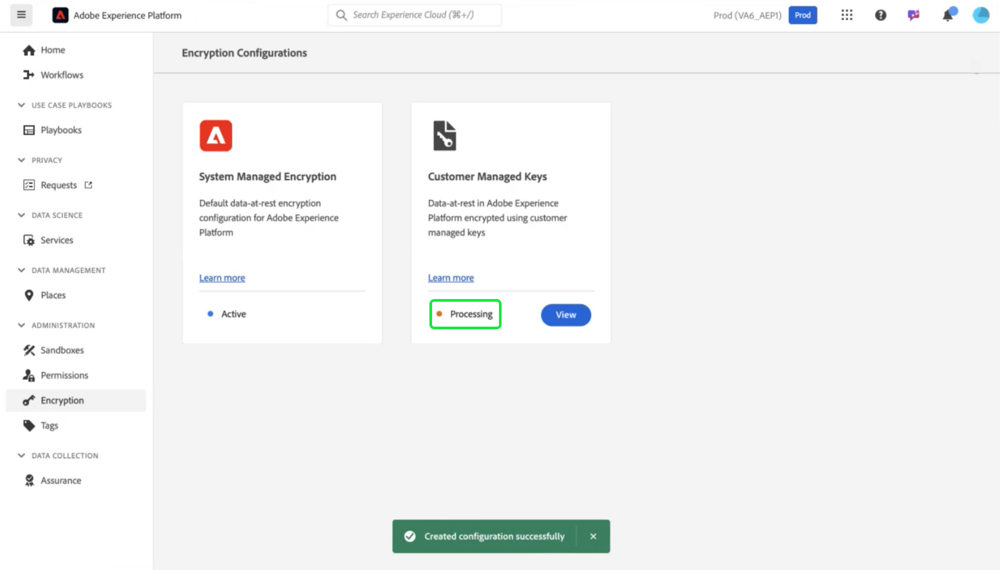

# Einrichten und Konfigurieren von kundenverwalteten Schlüsseln mit AWS mithilfe der Experience Platform-Benutzeroberfläche

Verwenden Sie dieses Handbuch, um kundenseitig verwaltete Schlüssel (CMK) für auf AWS gehostete Experience Platform-Instanzen über die Experience Platform-Benutzeroberfläche zu aktivieren.

>[!IMPORTANT]
>
>Bevor Sie mit diesem Handbuch fortfahren, stellen Sie sicher, dass Sie die Einrichtung abgeschlossen haben, die im Dokument [Konfigurieren von AWS KMS für CMK“ beschrieben ](./configure-kms.md).

## Aktualisieren Sie die AWS-Schlüsselrichtlinie, um den Schlüssel in Experience Platform zu integrieren

Um Ihren AWS-Schlüssel mit Experience Platform zu integrieren, müssen Sie die JSON-Datei im **[!DNL Key Policy]** Abschnitt des KMS-Arbeitsbereichs bearbeiten. Eine Standardschlüsselrichtlinie sieht ähnlich wie die unten stehende JSON aus.

<!-- The AWS ID below is fake. Q) Can I refer to it simply as AWS_ACCOUNT_ID ? Is that suitable? -->

```JSON
{
  "Id": "key-consolepolicy-3",
  "Version": "2012-10-17",
  "Statement": [
    {
      "Sid": "Enable IAM User Permissions",
      "Effect": "Allow",
      "Principal": {
        "AWS": "arn:aws:iam::123464903283:root" // this is a mock AWS Principal ID, your ID will differ
      },
      "Action": "kms:*",
      "Resource": "*"
    }
  ]
}
```

Im obigen Beispiel können alle Ressourcen (`"Resource": "*"`) innerhalb desselben Kontos (`Principal.AWS`) auf den Schlüssel zugreifen. Diese Richtlinie ermöglicht es den Diensten im Konto, Verschlüsselungs- und Entschlüsselungsvorgänge durchzuführen, die auf das angegebene Konto beschränkt sind. Um Ihrem Experience Platform-Einzelmandantenkonto Zugriff auf diesen Schlüssel zu gewähren, fügen Sie der standardmäßigen AWS-Richtlinie neue Anweisungen hinzu. Sie können die erforderliche JSON-Richtlinie über die Experience Platform-Benutzeroberfläche abrufen und auf Ihren AWS-KMS-Schlüssel anwenden, um eine sichere Verbindung mit Adobe Experience Platform herzustellen.

Wechseln Sie in der Experience Platform-Benutzeroberfläche zum Abschnitt **[!UICONTROL Administration]** in der linken Navigationsleiste und wählen Sie **[!UICONTROL Verschlüsselung]**. Wählen [!UICONTROL  Arbeitsbereich „Verschlüsselungskonfiguration] auf der Karte **[!UICONTROL Kundenseitig [!UICONTROL  Schlüssel] die Option]** Konfigurieren“ aus.


Die [!UICONTROL Konfiguration Kundenseitig verwalteter Schlüssel] wird angezeigt. Kopieren Sie das `statement`-Objekt aus der CMK-KMS-Richtlinie, die in der Konfiguration [!UICONTROL Kundenseitig verwaltete Schlüssel] [!UICONTROL  angezeigt ].

<!-- Select the copy icon () to copy the CMK KMS policy to your clipboard. A green pop-up notification confirms that the policy was copied.  -->

<!-- I cannot add the 'and the copy icon highlighted.' to the alt text below as i do not have access to this UI. -->


<!-- This part of the workflow was in contention at the time of the demo.  -->

Kehren Sie anschließend zum AWS KMS-Arbeitsbereich zurück und aktualisieren Sie die unten dargestellte Schlüsselrichtlinie.


Fügen Sie der Standardrichtlinie die vier Anweisungen aus dem Arbeitsbereich [!UICONTROL Platform-Verschlüsselungskonfiguration] hinzu, wie unten dargestellt: `Enable IAM User Permissions`, `CJA Flow IAM User Permissions`, `CJA Integrity IAM User Permissions`, `CJA Oberon IAM User Permissions`.

```json
{
    "Version": "2012-10-17",
    "Id": "key-consolepolicy",
    "Statement": [
        {
            "Sid": "Enable IAM User Permissions",
            "Effect": "Allow",
            "Principal": {
                "AWS": "arn:aws:iam::975049898882:root" // this is a mock AWS Principal ID, your ID will differ
            },
            "Action": [
                "kms:Decrypt",
                "kms:Encrypt",
                "kms:ReEncrypt*",
                "kms:GenerateDataKey*",
                "kms:DescribeKey",
                "kms:CreateGrant"
            ],
            "Resource": "*",
            "Condition": {
                "StringEquals": {
                    "aws:PrincipalAccount": "975049898882" // this is a mock AWS Principal ID, your ID will differ
                }
            }
        },
        {
            "Sid": "CJA Flow IAM User Permissions",
            "Effect": "Allow",
            "Principal": {
                "AWS": "arn:aws:iam::767397686373:root"
            },
            "Action": [
                "kms:Decrypt",
                "kms:Encrypt",
                "kms:ReEncrypt*",
                "kms:GenerateDataKey*",
                "kms:DescribeKey",
                "kms:CreateGrant"
            ],
            "Resource": "*",
            "Condition": {
                "StringEquals": {
                    "aws:PrincipalAccount": "767397686373"
                }
            }
        },
        {
            "Sid": "CJA Integrity IAM User Permissions",
            "Effect": "Allow",
            "Principal": {
                "AWS": "arn:aws:iam::730335345392:root"
            },
            "Action": [
                "kms:Decrypt",
                "kms:Encrypt",
                "kms:ReEncrypt*",
                "kms:GenerateDataKey*",
                "kms:DescribeKey",
                "kms:CreateGrant"
            ],
            "Resource": "*",
            "Condition": {
                "StringEquals": {
                    "aws:PrincipalAccount": "730335345392"
                }
            }
        },
        {
            "Sid": "CJA Oberon IAM User Permissions",
            "Effect": "Allow",
            "Principal": {
                "AWS": "arn:aws:iam::891377157113:root"
            },
            "Action": [
                "kms:Decrypt",
                "kms:Encrypt",
                "kms:ReEncrypt*",
                "kms:GenerateDataKey*",
                "kms:DescribeKey",
                "kms:CreateGrant"
            ],
            "Resource": "*",
            "Condition": {
                "StringEquals": {
                    "aws:PrincipalAccount": "891377157113"
                }
            }
        }
    ]
}
```

Wählen Sie **[!DNL Finish]** aus, um die aktualisierte Richtlinie zu bestätigen und den Schlüssel zu erstellen. Die Konfiguration enthält jetzt fünf Anweisungen, sodass Ihr AWS-Konto mit Adobe Experience Platform kommunizieren kann. Die Änderungen treten sofort in Kraft.

Der aktualisierte [!DNL Customer Managed Keys]-Arbeitsbereich des AWS-[!DNL Key Management Service] wird angezeigt.

### Hinzufügen von AWS-Verschlüsselungsschlüsseldetails zu Experience Platform

Um die Verschlüsselung zu aktivieren, fügen Sie als Nächstes den Amazon Resource Name (ARN) des Schlüssels zu Ihrer Experience Platform-Konfiguration [!UICONTROL Kundenseitig verwaltete Schlüssel] hinzu. Wählen Sie im Abschnitt [!DNL Customer Managed Keys] von AWS den Alias Ihres neuen Schlüssels aus der Liste im [!DNL Key Management Service] aus.


Die Details Ihres Schlüssels werden angezeigt. Alles in AWS verfügt über einen Amazon Resource Name (ARN), der
ist eine eindeutige Kennung, die verwendet wird, um Ressourcen über AWS-Services hinweg anzugeben. Es folgt einem standardisierten Format: `arn:partition:service:region:account-id:resource`.

Wählen Sie das Kopiersymbol aus, um Ihren ARN zu kopieren. Ein Bestätigungsdialogfeld wird angezeigt.


Navigieren Sie jetzt zurück zur Experience Platform-Benutzeroberfläche [!UICONTROL Konfiguration kundenverwalteter Schlüssel]. Fügen Sie **[!UICONTROL Abschnitt „Details zum AWS]** Verschlüsselungsschlüssel hinzufügen“ einen **[!UICONTROL Konfigurationsnamen]** und den **[!UICONTROL KMS-Schlüssel ARN]** hinzu, den Sie aus der AWS-Benutzeroberfläche kopiert haben.


Wählen Sie als Nächstes **[!UICONTROL SPEICHERN]**, um den Konfigurationsnamen und den KMS-Schlüssel ARN zu übermitteln und mit der Validierung des Schlüssels zu beginnen.


Sie kehren zum Arbeitsbereich [!UICONTROL Verschlüsselungskonfigurationen] zurück. Der Status der Verschlüsselungskonfiguration wird unten auf der Karte **[!UICONTROL Kundenseitig verwaltete Schlüssel]** angezeigt.



Sobald der Schlüssel validiert wurde, werden die Schlüsseltresorkennungen zum Data Lake und zu den Profildatenspeichern für alle Sandboxes hinzugefügt.

>[!NOTE]
>
>Die Dauer des Vorgangs hängt von Ihrer Datengröße ab. Normalerweise wird der Prozess in weniger als 24 Stunden abgeschlossen. Jede Sandbox wird in der Regel in zwei bis drei Minuten aktualisiert.

## Schlüsselsperrung {#key-revocation}

>[!IMPORTANT]
>
>Machen Sie sich mit den Auswirkungen eines Schlüsselwiderrufs auf nachgelagerte Anwendungen vertraut, bevor Sie den Zugriff widerrufen.

Im Folgenden finden Sie wichtige Überlegungen zum Sperren von Schlüsseln:

- Durch Widerrufen oder Deaktivieren des Schlüssels sind Ihre Experience Platform-Daten nicht mehr zugänglich. Diese Aktion ist irreversibel und sollte mit Vorsicht durchgeführt werden.
- Berücksichtigen Sie die Übertragungszeitpläne, wenn der Zugriff auf Verschlüsselungsschlüssel widerrufen wird. Auf Primäre Datenspeicher kann innerhalb weniger Minuten bis zu 24 Stunden nicht mehr zugegriffen werden. Zwischengespeicherte oder vorübergehende Datenspeicher sind innerhalb von sieben Tagen nicht mehr zugänglich.

Um einen Schlüssel zu widerrufen, navigieren Sie zum AWS KMS-Arbeitsbereich. Im Abschnitt **[!DNL Customer managed keys]** werden alle verfügbaren Schlüssel für Ihr AWS-Konto angezeigt. Wählen Sie den Alias Ihres Schlüssels aus der Liste aus.


Die Details Ihres Schlüssels werden angezeigt. Um die Taste zu deaktivieren, wählen Sie **[!DNL Key actions]** und dann **[!DNL Disable]** aus dem Dropdown-Menü aus.


Ein Bestätigungsdialogfeld wird angezeigt. Wählen Sie **[!DNL Disable key]** aus, um Ihre Auswahl zu bestätigen. Die Auswirkungen der Deaktivierung des Schlüssels sollten in Experience Platform-Programmen und in der Benutzeroberfläche innerhalb von etwa fünf Minuten widergespiegelt werden.

>[!NOTE]
>
>Nachdem Sie den Schlüssel deaktiviert haben, können Sie ihn bei Bedarf mit der oben beschriebenen Methode erneut aktivieren. Diese Option ist im Dropdown-Menü **[!DNL Key actions]** verfügbar.


Wenn Ihr Schlüssel in anderen Services verwendet wird, können Sie den Zugriff für Experience Platform auch direkt aus der Schlüsselrichtlinie entfernen. Wählen **[!UICONTROL Bearbeiten]** im **[!DNL Key Policy]** Abschnitt aus.


Die Seite **[!DNL Edit key policy]** wird angezeigt. Markieren und löschen Sie die Richtlinienanweisung, die aus der Experience Platform-Benutzeroberfläche kopiert wurde, um die Berechtigungen für die App „Kundenseitig verwaltete Schlüssel“ zu entfernen. Wählen Sie dann **[!DNL Save changes]** aus, um den Vorgang abzuschließen.


## Tastendrehung {#key-rotation}

AWS bietet eine automatische und bedarfsgesteuerte Tastenrotation. Um das Risiko von Schlüsselkompromittierungen zu verringern oder die Sicherheitsanforderungen zu erfüllen, können Sie bei Bedarf oder in regelmäßigen Abständen automatisch neue Verschlüsselungsschlüssel generieren. Planen Sie die automatische Schlüsselrotation, um die Lebensdauer eines Schlüssels zu begrenzen, und stellen Sie sicher, dass ein Schlüssel, der kompromittiert ist, nach der Drehung unbrauchbar wird. Moderne Verschlüsselungsalgorithmen sind zwar hochsicher, die Schlüsselrotation ist jedoch eine wichtige Sicherheitsmaßnahme und zeigt die Einhaltung der Best Practices für die Sicherheit an.

### Automatische Tastendrehung {#automatic-key-rotation}

Die automatische Schlüsselrotation ist standardmäßig deaktiviert. Um die automatische Schlüsselrotation im KMS-Arbeitsbereich zu planen, wählen Sie die Registerkarte **[!DNL Key rotation]** und dann **[!DNL Edit]** im **[!DNL Automatic key rotation section]** aus.


Der **[!DNL Edit automatic key rotation]** Arbeitsbereich wird angezeigt. Wählen Sie hier das Optionsfeld aus, um die automatische Schlüsselrotation zu aktivieren oder zu deaktivieren. Verwenden Sie dann das Texteingabefeld oder das Dropdown-Menü, um einen Zeitraum für die Tastendrehung auszuwählen. Wählen Sie **[!DNL Save]** aus, um Ihre Einstellungen zu bestätigen und zum Arbeitsbereich Wichtige Details zurückzukehren.

>[!NOTE]
>
>Der Mindestzeitraum für die Drehung des Schlüssels beträgt 90 Tage, der Höchstzeitraum 2560 Tage.


### Tastendrehung bei Bedarf {#on-demand-key-rotation}

Wählen Sie **[!DNL Rotate Now]** aus, um eine sofortige Tastendrehung durchzuführen, wenn der aktuelle Schlüssel kompromittiert ist. AWS beschränkt diese Funktion auf 10 Umdrehungen. Planen Sie stattdessen automatische Schlüsselrotationen für die regelmäßige Wartung.


## Nächste Schritte

Nach dem Lesen dieses Dokuments haben Sie gelernt, wie Sie Verschlüsselungsschlüssel in AWS KMS für Adobe Experience Platform erstellen, konfigurieren und verwalten. Überprüfen Sie anschließend die Sicherheits- und Compliance-Policys Ihres Unternehmens, um Best Practices zu implementieren, z. B. die Planung von Schlüsselrotationen und die Sicherstellung eines sicheren Schlüsselspeichers.
