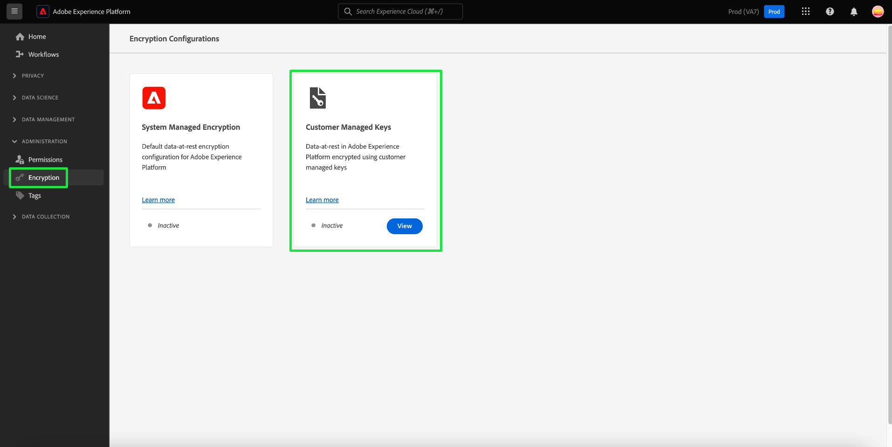

# Einrichten und Konfigurieren von kundenverwalteten Schlüsseln über die Platform-Benutzeroberfläche

In diesem Dokument wird der Prozess zum Aktivieren der Funktion für kundenverwaltete Schlüssel (CMK) in Platform mithilfe der Benutzeroberfläche beschrieben. Anweisungen zum Ausführen dieses Prozesses mithilfe der API finden Sie im Abschnitt [API-CMK-Setup-Dokument](./api-set-up.md).

## Voraussetzungen

So zeigen Sie die [!UICONTROL Verschlüsselung] in Adobe Experience Platform müssen Sie eine Rolle erstellt und der [!UICONTROL Verwalten des kundenverwalteten Schlüssels] Berechtigung für diese Rolle. Jeder Benutzer, der über [!UICONTROL Verwalten des kundenverwalteten Schlüssels] -Berechtigung kann CMK für ihre Organisation aktivieren.

Weiterführende Informationen zum Zuweisen von Rollen und Berechtigungen in Experience Platform finden Sie im Abschnitt [Berechtigungsdokumentation konfigurieren](https://experienceleague.adobe.com/docs/platform-learn/getting-started-for-data-architects-and-data-engineers/configure-permissions.html?lang=de).

Um CMK zu aktivieren, muss Ihre [[!DNL Azure] Key Vault muss konfiguriert werden](./azure-key-vault-config.md) mit den folgenden Einstellungen:

* [Bereinigungsschutz aktivieren](https://learn.microsoft.com/en-us/azure/key-vault/general/soft-delete-overview#purge-protection)
* [Soft-Löschen aktivieren](https://learn.microsoft.com/en-us/azure/key-vault/general/soft-delete-overview)
* [Zugriff konfigurieren mit [!DNL Azure] rollenbasierte Zugriffssteuerung](https://learn.microsoft.com/en-us/azure/role-based-access-control/)
* [Konfigurieren eines  [!DNL Azure] -Schlüsseltresors](./azure-key-vault-config.md)

## Einrichten der CMK-App {#register-app}

Nachdem Sie Ihren KeyVault konfiguriert haben, müssen Sie die CMK-Anwendung registrieren, die mit Ihrer [!DNL Azure] Mandanten.

### Erste Schritte

So zeigen Sie die [!UICONTROL Verschlüsselungskonfigurationen] Dashboard, auswählen **[!UICONTROL Verschlüsselung]** unter [!UICONTROL Administration] -Überschrift der linken Navigationsseitenleiste.

Auswählen **[!UICONTROL Konfigurieren]** , um die [!UICONTROL Konfiguration von kundenverwalteten Schlüsseln] anzeigen. Dieser Arbeitsbereich enthält alle erforderlichen Werte, um die unten beschriebenen Schritte durchzuführen und die Integration mit Ihrem Azure Key-Vault durchzuführen.

### Authentifizierungs-URL kopieren {#copy-authentication-url}

Um den Registrierungsprozess zu starten, kopieren Sie die URL für die Anwendungsauthentifizierung für Ihr Unternehmen aus dem [!UICONTROL Konfiguration von kundenverwalteten Schlüsseln] anzeigen und in Ihre [!DNL Azure] Umgebung **[!DNL Key Vault Crypto Service Encryption User]**. Details zum [Rollen zuweisen](#assign-to-role) werden im nächsten Abschnitt beschrieben.

Wählen Sie das Kopiersymbol () durch die [!UICONTROL Anwendungsauthentifizierungs-URL].

![Die [!UICONTROL Konfiguration von kundenverwalteten Schlüsseln] anzeigen, wobei der Abschnitt Anwendungsauthentifizierungsurl hervorgehoben ist.](../../images/governance-privacy-security/customer-managed-keys/application-authentication-url.png)

Kopieren und einfügen Sie die [!UICONTROL Anwendungsauthentifizierungs-URL] in einen Browser, um ein Authentifizierungsdialogfeld zu öffnen. Wählen Sie **[!DNL Accept]** aus, um den Service-Prinzipal der CMK-App zu Ihrem [!DNL Azure]-Mandanten hinzuzufügen. Durch Bestätigung der Authentifizierung gelangen Sie zur Landingpage der Experience Cloud.

![Dialogfeld für Microsoft-Berechtigungsanfragen mit [!UICONTROL Accept] hervorgehoben.](../../images/governance-privacy-security/customer-managed-keys/app-permission.png)

>[!IMPORTANT]
>
>Wenn Sie mehrere [!DNL Microsoft Azure] -Abonnements verwenden, können Sie Ihre Platform-Instanz mit dem falschen SchlüsselVault verbinden. In diesem Fall müssen Sie die Variable `common` des Namens der Anwendungs-Authentifizierungs-URL für die CMK-Verzeichnis-ID. Kopieren Sie die Kennung des CMK-Ordners von der Seite &quot;Portal-Einstellungen&quot;, &quot;Verzeichnisse&quot;und &quot;Abonnements&quot; [!DNL Microsoft Azure] Applikation ![Die [!DNL Microsoft Azure] App Portal-Einstellungen, Verzeichnisse und Abonnements , wobei die Verzeichnis-ID hervorgehoben ist.](../../images/governance-privacy-security/customer-managed-keys/directory-id.png) Fügen Sie ihn anschließend in die Adressleiste Ihres Browsers ein. 

### Zuweisen der CMK-App zu einer Rolle {#assign-to-role}

Navigieren Sie nach Abschluss des Authentifizierungsprozesses zu Ihrem [!DNL Azure]-Schlüsseltresor und wählen Sie **[!DNL Access control]** in der linken Navigation aus. Wählen Sie von hier aus **[!DNL Add]** gefolgt von **[!DNL Add role assignment]** aus.

![Die [!DNL Microsoft Azure] Dashboard mit [!DNL Add] und [!DNL Add role assignment] hervorgehoben.](../../images/governance-privacy-security/customer-managed-keys/add-role-assignment.png)

Im nächsten Bildschirm werden Sie aufgefordert, eine Rolle für diese Zuweisung auszuwählen. Wählen Sie **[!DNL Key Vault Crypto Service Encryption User]** aus, bevor Sie auf **[!DNL Next]** klicken, um fortzufahren.

![Die [!DNL Microsoft Azure] Dashboard mit dem [!DNL Key Vault Crypto Service Encryption User] hervorgehoben.](../../images/governance-privacy-security/customer-managed-keys/select-role.png)

Wählen Sie auf dem nächsten Bildschirm **[!DNL Select members]** aus, um ein Dialogfeld in der rechten Leiste zu öffnen. Verwenden Sie die Suchleiste, um den Service-Prinzipal für das CMK-Programm zu suchen und ihn aus der Liste auszuwählen. Wenn Sie fertig sind, klicken Sie auf **[!DNL Save]**.

>[!NOTE]
>
>Wenn Sie Ihr Programm in der Liste nicht finden, wurde Ihr Service-Prinzipal in Ihrem Mandanten nicht akzeptiert. Arbeiten Sie mit Ihrem [!DNL Azure] Administrator oder Vertreter.

Sie können die Anwendung überprüfen, indem Sie die [!UICONTROL Bewerbungs-ID] im [!UICONTROL Konfiguration von kundenverwalteten Schlüsseln] Ansicht mit der [!DNL Application ID] im [!DNL Microsoft Azure] Anwendungsübersicht.

![Die [!UICONTROL Konfiguration von kundenverwalteten Schlüsseln] Ansicht mit der [!UICONTROL Bewerbungs-ID] hervorgehoben.](../../images/governance-privacy-security/customer-managed-keys/application-id.png)

Alle Details, die zur Überprüfung der Azure-Tools erforderlich sind, sind in der Benutzeroberfläche von Platform enthalten. Diese Granularität wird bereitgestellt, da viele Benutzer andere Azure-Tools verwenden möchten, um ihre Fähigkeit zur Überwachung und Protokollierung des Zugriffs auf diese Anwendungen auf ihre SchlüsselVault zu verbessern. Das Verständnis dieser Kennungen ist für diesen Zweck und die Unterstützung der Adobe-Dienste beim Zugriff auf den Schlüssel von entscheidender Bedeutung.

## Aktivieren der Konfiguration des Verschlüsselungsschlüssels auf Experience Platform {#send-to-adobe}

Nach der Installation der CMK-App in [!DNL Azure] können Sie Ihre Verschlüsselungsschlüssel-ID an Adobe senden. Wählen Sie in der linken Navigation **[!DNL Keys]** aus, gefolgt vom Namen des Schlüssels, den Sie senden möchten.

![Das Microsoft Azure-Dashboard mit dem [!DNL Keys] -Objekt und der Schlüsselname hervorgehoben.](../../images/governance-privacy-security/customer-managed-keys/select-key.png)

Wählen Sie die neueste Version des Schlüssels aus, und seine Detailseite wird angezeigt. Von hier aus können Sie optional die zulässigen Vorgänge für den Schlüssel konfigurieren.

>[!IMPORTANT]
>
>Die für den Schlüssel mindestens erforderlichen Vorgänge sind die **[!DNL Wrap Key]** und **[!DNL Unwrap Key]** Berechtigungen. Sie können [!DNL Encrypt], [!DNL Decrypt], [!DNL Sign], und [!DNL Verify] sollte man wollen.

Das Feld **[!UICONTROL Schlüsselkennung]** zeigt die URI-Kennung für den Schlüssel an. Kopieren Sie diesen URI-Wert zur Verwendung im nächsten Schritt.

![Die Schlüsseldetails des Microsoft Azure-Dashboards mit dem [!DNL Permitted operations] und die Abschnitte Schlüssel-URL kopieren hervorgehoben sind.](../../images/governance-privacy-security/customer-managed-keys/copy-key-url.png)

Sobald Sie die [!DNL Key vault URI], kehren Sie zu [!UICONTROL Konfiguration von kundenverwalteten Schlüsseln] Ansicht anzeigen und eine Beschreibung eingeben **[!UICONTROL Konfigurationsname]**. Fügen Sie als Nächstes die [!DNL Key Identifier] von der Seite mit den Azure Key-Details in die **[!UICONTROL Schlüsselschlüsselkennung]** und wählen **[!UICONTROL Speichern]**.

![Die [!UICONTROL Konfiguration von kundenverwalteten Schlüsseln] Ansicht mit der [!UICONTROL Konfigurationsname] und [!UICONTROL Schlüsselschlüsselkennung] hervorgehobene Abschnitte.](../../images/governance-privacy-security/customer-managed-keys/configuration-name.png)

Sie kehren zum [!UICONTROL Dashboard &quot;Verschlüsselungskonfigurationen&quot;]. Der Status der [!UICONTROL Vom Kunden verwaltete Schlüssel] -Konfiguration angezeigt als [!UICONTROL Verarbeitung].

![Die [!UICONTROL Verschlüsselungskonfigurationen] Dashboard mit [!UICONTROL Verarbeitung] auf [!UICONTROL Vom Kunden verwaltete Schlüssel] Karte.](../../images/governance-privacy-security/customer-managed-keys/processing.png)

## Überprüfen des Konfigurationsstatus {#check-status}

Warten Sie eine beträchtliche Zeit für die Verarbeitung. Um den Status der Konfiguration zu überprüfen, kehren Sie zum [!UICONTROL Konfiguration von kundenverwalteten Schlüsseln] Ansicht anzeigen und nach unten scrollen [!UICONTROL Konfigurationsstatus]. Die Fortschrittsleiste wurde in Schritt 1 von drei überarbeitet und erklärt, dass das System prüft, ob Platform Zugriff auf den Schlüssel und den Schlüsselwert hat.

Es gibt vier potenzielle Status der CMK-Konfiguration. Diese sind wie folgt:

* Schritt 1: Validiert, dass Platform auf den Schlüssel und den Schlüssel zugreifen kann.
* Schritt 2: Der Schlüssel und der Schlüsselname werden derzeit allen Datenspeichern in Ihrer Organisation hinzugefügt.
* Schritt 3: Der Schlüssel und der Schlüsselname wurden den Datenspeichern erfolgreich hinzugefügt.
* `FAILED`: Es ist ein Problem aufgetreten, das in erster Linie mit dem Schlüssel, dem Schlüsseltresor oder der Einrichtung der Multi-Mandanten-App-zusammenhängt.

## Nächste Schritte

Durch Ausführung der oben genannten Schritte haben Sie CMK für Ihre Organisation erfolgreich aktiviert. Daten, die in Primärdatenspeicher erfasst werden, werden jetzt mit den Schlüsseln in Ihrer [!DNL Azure] Key Vault.
