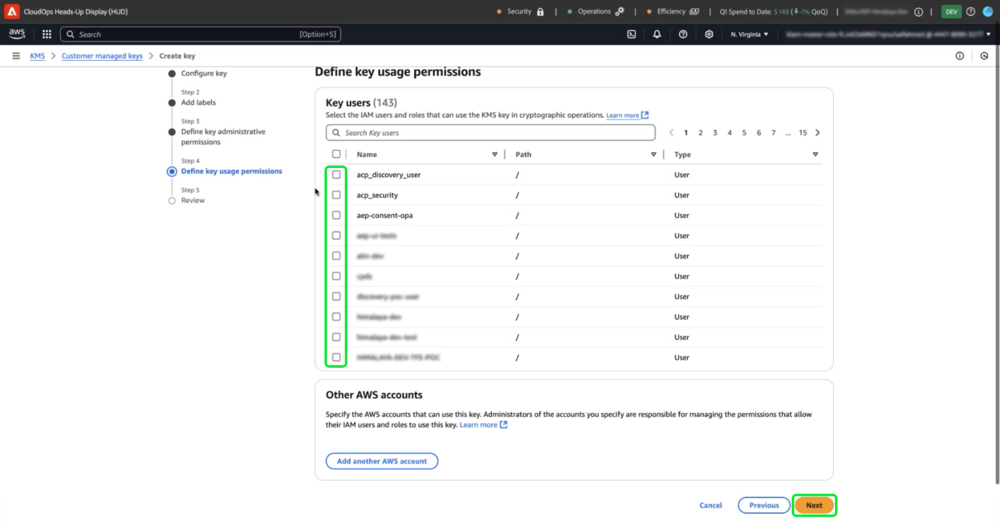
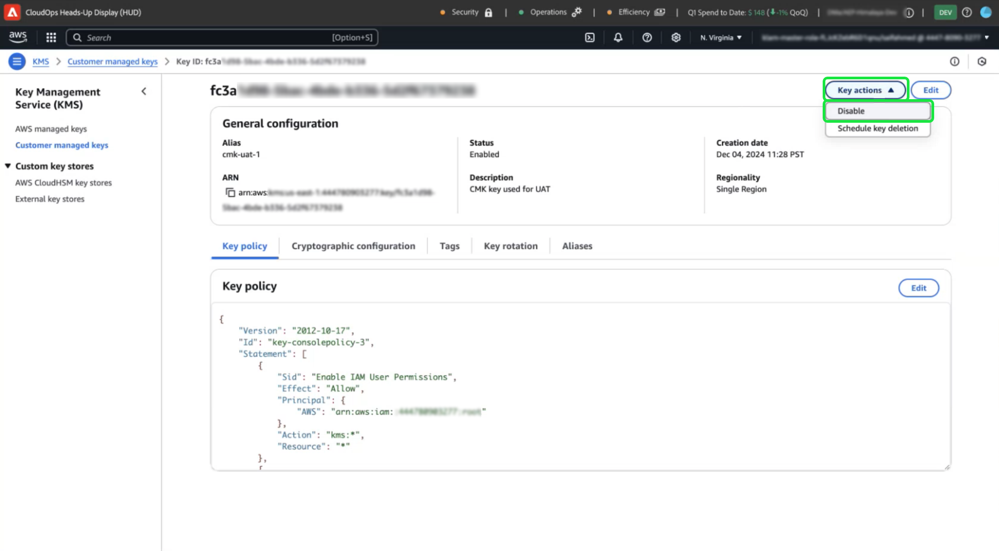

# Verwenden des Amazon Web Services-Schlüsselverwaltungs-Service für die Adobe Experience Platform-Datenverschlüsselung

>[!AVAILABILITY]
>
>Dieses Dokument gilt für Implementierungen von Experience Platform, die auf Amazon Web Services (AWS) ausgeführt werden. Experience Platform, das auf AWS ausgeführt wird, steht derzeit einer begrenzten Anzahl von Kunden zur Verfügung. Weitere Informationen zur unterstützten Experience Platform-Infrastruktur finden Sie in der Übersicht zur [Experience Platform-Multi-Cloud](https://experienceleague.adobe.com/en/docs/experience-platform/landing/multi-cloud).
>
>[Vom Kunden verwaltete Schlüssel](../customer-managed-keys/overview.md) (CMK) auf AWS werden für Privacy und Security Shield unterstützt, sind jedoch nicht für Healthcare Shield verfügbar. CMK wird auf Azure sowohl für Privacy und Security Shield als auch für Healthcare Shield unterstützt.

Verwenden Sie dieses Handbuch, um Ihre Daten mit Amazon Web Services (AWS) Key Management Service (KMS) zu schützen, indem Sie Verschlüsselungsschlüssel für Adobe Experience Platform erstellen, verwalten und steuern. Diese Integration vereinfacht die Compliance, optimiert den Betrieb durch Automatisierung und macht die Pflege Ihrer eigenen Schlüsselverwaltungsinfrastruktur überflüssig.

Informationen zu Customer Journey Analytics-spezifischen Anweisungen finden Sie in der Dokumentation zu [Customer Journey Analytics CMK](https://experienceleague.adobe.com/en/docs/analytics-platform/using/cja-privacy/cmk)

>[!IMPORTANT]
>
>Adobe Experience Platform verschlüsselt Daten im Ruhezustand standardmäßig mit systemverwalteten Schlüsseln. Durch die Aktivierung von kundenverwalteten Schlüsseln (CMK) übernehmen Sie die volle Kontrolle über Ihre Datensicherheit. Diese Änderung kann jedoch nicht rückgängig gemacht werden. Sobald CMK aktiviert ist, können Sie nicht mehr zu systemverwalteten Schlüsseln zurückkehren. Sie sind dafür verantwortlich, Ihre Schlüssel sicher zu verwalten, um den unterbrechungsfreien Zugriff auf Ihre Daten sicherzustellen und potenzielle Unzugänglichkeiten zu verhindern.

In diesem Handbuch wird der Prozess zum Erstellen und Verwalten von Verschlüsselungsschlüsseln in AWS KMS beschrieben, um Ihre Daten auf Experience Platform zu schützen.

## Voraussetzungen {#prerequisites}

Bevor Sie mit diesem Dokument fortfahren, sollten Sie über gute Kenntnisse der folgenden Schlüsselkonzepte und -funktionen verfügen:

- **AWS Key Management Service (KMS)**: Machen Sie sich mit den Grundlagen von AWS KMS vertraut, einschließlich der Erstellung, Verwaltung und Rotation von Verschlüsselungsschlüsseln. Weitere Informationen finden Sie in der [offiziellen KMS](https://docs.aws.amazon.com/kms/)Dokumentation.
- **Richtlinien zur Identitäts- und Zugriffsverwaltung (IAM) in AWS**: IAM ist ein Service, mit dem Sie den Zugriff auf AWS-Services und -Ressourcen sicher verwalten können. Verwenden Sie IAM für Folgendes:
   - Definieren Sie, welche Benutzenden, Gruppen und Rollen Zugriff auf bestimmte Ressourcen haben.
   - Geben Sie an, welche Aktionen Benutzenden erlaubt oder verweigert werden sollen.
   - Implementieren Sie eine differenzierte Zugriffssteuerung, indem Sie Berechtigungen mithilfe von IAM-Richtlinien zuweisen.
Weitere Informationen finden [ in der offiziellen Dokumentation ](https://docs.aws.amazon.com/kms/latest/developerguide/iam-policies.html) IAM-Richtlinien für AWS KMS .
- **Datensicherheit in Experience Platform**: Erfahren Sie, wie Platform die Datensicherheit gewährleistet und zur Verschlüsselung mit externen Services wie AWS KMS integriert. Platform schützt Daten mit HTTPS TLS v1.2 für die Übertragung, Cloud-Provider-Verschlüsselung im Ruhezustand, isolierten Speicher und anpassbare Authentifizierungs- und Verschlüsselungsoptionen. Weitere Informationen zur [ Ihrer Daten finden Sie unter ](../overview.md)Governance, Datenschutz und Sicherheit“ oder im Dokument [Datenverschlüsselung in Platform](../encryption.md) .
- **AWS-Verwaltungskonsole**: Ein zentraler Hub, über den Sie von einem webbasierten Programm aus auf alle AWS-Services zugreifen und diese verwalten können. Verwenden Sie die Suchleiste, um schnell Tools zu finden, Benachrichtigungen zu überprüfen, Ihr Konto und Ihre Abrechnung zu verwalten und Ihre Einstellungen anzupassen. Weitere Informationen finden [ in der offiziellen Dokumentation ](https://docs.aws.amazon.com/awsconsolehelpdocs/latest/gsg/what-is.html) AWS-Verwaltungskonsole .

## Erste Schritte {#get-started}

Für dieses Handbuch müssen Sie bereits Zugriff auf ein Amazon Web Services-Konto und die Verwaltungskonsole haben. Gehen Sie wie folgt vor, um loszulegen:

1. **Berechtigungen überprüfen**: Stellen Sie sicher, dass Sie über die erforderlichen AWS Identity and Access Management (IAM)-Berechtigungen verfügen, um Verschlüsselungsschlüssel in KMS zu erstellen, zu verwalten und zu verwenden. So überprüfen Sie Ihre Berechtigungen:
   1. Rufen Sie den [IAM-Richtliniensimulator](https://policysim.aws.amazon.com/) auf.
   1. Wählen Sie Ihr Benutzerkonto oder die Rolle aus.
   1. Simulieren von KMS-Aktionen wie `kms:CreateKey` oder `kms:Encrypt`.
Wenn die Simulation einen Fehler zurückgibt oder Sie sich bezüglich Ihrer Berechtigungen nicht sicher sind, wenden Sie sich an Ihren AWS-Administrator, um Hilfe zu erhalten.

1. **Überprüfen Sie Ihre AWS-Kontokonfiguration**: Überprüfen Sie, ob Ihr AWS-Konto für die Verwendung von AWS KMS-Services aktiviert ist. Für die meisten Konten ist der KMS-Zugriff standardmäßig aktiviert. Sie können die Einrichtung Ihres Kontos jedoch überprüfen, indem Sie die [AWS-Verwaltungskonsole aufrufen](https://aws.amazon.com/console/). Weitere Informationen finden Sie im Entwicklerhandbuch für den [AWS Key Management Service](https://docs.aws.amazon.com/kms/latest/developerguide/overview.html).

1. **Unterstützte Region auswählen**: AWS KMS ist in bestimmten Regionen verfügbar. Stellen Sie sicher, dass Sie in einer Region arbeiten, in der KMS unterstützt wird. Sie können eine vollständige Liste der unterstützten Regionen in der Liste [AWS KMS-Endpunkte und -Kontingente](https://aws.amazon.com/about-aws/global-infrastructure/regional-product-services/) anzeigen.

### Navigieren Sie zu AWS KMS, um die Tasteneinrichtung zu starten

>[!IMPORTANT]
>
>Sicherstellen der sicheren Speicherung, des Zugriffs und der Verfügbarkeit der Verschlüsselungsschlüssel Sie sind dafür verantwortlich, Ihre Schlüssel zu verwalten und Unterbrechungen des Platform-Betriebs zu verhindern.

Um mit der Einrichtung und Verwaltung Ihres Verschlüsselungsschlüssels zu beginnen, melden Sie sich bei Ihrem AWS-Konto an und navigieren Sie zu AWS Key Management Service (KMS). Wählen Sie in der AWS-Verwaltungskonsole die Option **Key Management Service (KMS)** aus dem Menü „Services“ aus.


## Neuen Schlüssel erstellen {#create-a-key}

Der [!DNL Key Management Service (KMS)] Arbeitsbereich wird angezeigt. Wählen Sie **[!DNL Create a key]** aus.


## Konfigurieren der Schlüsseleinstellungen {#configure-key}

Der [!DNL Configure Key] Workflow wird angezeigt. Standardmäßig ist der Schlüsseltyp auf **[!DNL Symmetric]** und die Schlüsselverwendung auf **[!DNL Encrypt and Decrypt]** festgelegt. Stellen Sie sicher, dass diese Optionen ausgewählt sind, bevor Sie fortfahren.


Erweitern Sie das Dropdown-Menü **[!DNL Advanced options]** . Es wird empfohlen, die Option **[!DNL KMS]** zu verwenden, mit der AWS das Schlüsselmaterial erstellen und verwalten kann. Die Option **[!DNL KMS]** ist standardmäßig ausgewählt.

>[!NOTE]
>
>Wenn Sie bereits über einen Schlüssel verfügen, können Sie externes Schlüsselmaterial importieren oder den AWS [!DNL CloudHSM]-Schlüsselspeicher verwenden. Diese Optionen werden in diesem Dokument nicht behandelt.

Wählen Sie als Nächstes die [!DNL Regionality] aus, die den Regionsbereich des Schlüssels angibt. Wählen Sie **[!DNL Single-Region key]** und dann **[!DNL Next]** aus, um mit Schritt zwei fortzufahren.

>[!IMPORTANT]
>
>AWS erzwingt Regionsbeschränkungen für KMS-Schlüssel. Diese Regionsbeschränkung bedeutet, dass der Schlüssel in derselben Region wie Ihr Adobe-Konto liegen muss. Adobe kann nur auf KMS-Schlüssel zugreifen, die sich in der Region Ihres Kontos befinden. Stellen Sie sicher, dass die ausgewählte Region mit der Region Ihres Adobe-Einzelmandantenkontos übereinstimmt.


## Kennzeichnen und Markieren des Schlüssels {#add-labels-and-tags-to-key}

Die zweite, [!DNL Add labels] Phase des Workflows wird angezeigt. Hier konfigurieren Sie die Felder [!DNL Alias] und [!DNL Tags], um Ihren Verschlüsselungsschlüssel über die AWS KMS-Konsole zu verwalten und zu finden.

Geben Sie im Eingabefeld **[!DNL Alias]** einen beschreibenden Titel für Ihren Schlüssel ein. Der Alias dient als benutzerfreundliche Kennung, mit der Sie den Schlüssel schnell über die Suchleiste in der AWS KMS-Konsole finden können. Um Verwirrung zu vermeiden, wählen Sie einen aussagekräftigen Namen, der den Zweck des Schlüssels widerspiegelt, z. B. &quot;Adobe-Platform-Key“ oder „Customer-Encryption-Key“. Sie können auch eine Beschreibung des Schlüssels einfügen, wenn der Schlüsselalias nicht ausreicht, um seinen Zweck zu beschreiben.

Weisen Sie abschließend Ihrem Schlüssel Metadaten zu, indem Sie im Abschnitt [!DNL Tags] Schlüssel-Wert-Paare hinzufügen. Dieser Schritt ist optional, Sie sollten jedoch Tags hinzufügen, um AWS-Ressourcen zu kategorisieren und zu filtern und so die Verwaltung zu erleichtern. Wenn Ihr Unternehmen beispielsweise mehrere Adobe-bezogene Ressourcen verwendet, können Sie diese mit &quot;Adobe&quot; oder „Experience Platform“ taggen. Dieser zusätzliche Schritt erleichtert die Suche und Verwaltung aller zugehörigen Ressourcen in der Verwaltungskonsole von AWS. Wählen Sie **[!DNL Add tag]** aus, um den Prozess zu starten.

<!-- I do not have an AWS account with which to document the Add tag process as yet. -->

Wenn Sie mit Ihren Einstellungen zufrieden sind, wählen Sie **[!DNL Next]** aus, um den Workflow fortzusetzen.


## Definieren der wichtigsten Administratorberechtigungen {#define-key-admins}

Schritt 3 des Workflows zur Schlüsselerstellung wird angezeigt. Um einen sicheren und kontrollierten Zugriff zu gewährleisten, können Sie auswählen, welche der IAM-Benutzer und -Rollen den Schlüssel verwalten können. Zum jetzigen Zeitpunkt gibt es zwei Optionen, [!DNL Key administrators] und [!DNL Key deletion]. Aktivieren Sie im Abschnitt **[!DNL Key administrators]** ein oder mehrere Kontrollkästchen neben dem Namen eines Benutzers bzw. einer Rolle, dem bzw. der Administratorberechtigungen für diesen Schlüssel erteilt werden sollen.

>[!NOTE]
>
>In diesem Schritt des Workflows können keine Administratoren erstellt werden.

Aktivieren Sie im Abschnitt **[!DNL Key deletion]** das Kontrollkästchen, um Schlüsseladministratoren das Recht zu geben, diesen Schlüssel zu löschen. Wenn Sie das Kontrollkästchen nicht aktivieren, dürfen keine Benutzer mit Administratorrechten diesen Vorgang ausführen.

Wählen Sie **[!DNL Next]** aus, um den Workflow fortzusetzen.


## Schlüsselbenutzern Zugriff gewähren {#assign-key-users}

In Schritt 4 des Workflows können Sie Folgendes [!DNL Define key usage permissions]. Aktivieren Sie in der Liste **[!DNL Key users]** die Kontrollkästchen für alle IAM-Benutzer und -Rollen, für die Sie über die Berechtigung zur Verwendung dieses Schlüssels verfügen möchten.

Aus dieser Ansicht können Sie auch [!DNL Add another AWS account]. Es wird jedoch dringend davon abgeraten, weitere AWS-Konten hinzuzufügen. Das Hinzufügen eines weiteren Kontos kann Risiken mit sich bringen und die Berechtigungsverwaltung für Verschlüsselungs- und Entschlüsselungsvorgänge verkomplizieren. Durch die Beibehaltung des Schlüssels, der mit einem einzigen AWS-Konto verknüpft ist, gewährleistet Adobe eine sichere Integration mit AWS KMS, minimiert Risiken und sorgt für einen zuverlässigen Betrieb.

Wählen Sie **[!DNL Next]** aus, um den Workflow fortzusetzen.



## Schlüsselkonfiguration überprüfen {#review}

Die Überprüfungsphase der Schlüsselkonfiguration wird angezeigt. Überprüfen Sie die wichtigsten Details in den Abschnitten [!DNL Key configuration] und [!DNL Alias and description] .

>[!NOTE]
>
>Stellen Sie sicher, dass die Schlüsselregion mit dem AWS-Konto identisch ist.


### Aktualisieren Sie die Schlüsselrichtlinie, um den Schlüssel mit Experience Platform zu integrieren.

Bearbeiten Sie als Nächstes die JSON im **[!DNL Key Policy]** Abschnitt, um den -Schlüssel mit Experience Platform zu integrieren. Eine Standardschlüsselrichtlinie sieht ähnlich wie die unten stehende JSON aus.

<!-- The AWS ID below is fake. Q) Can I refer to it simply as AWS_ACCOUNT_ID ? Is that suitable? -->

```JSON
{
  "Id": "key-consolepolicy-3",
  "Version": "2012-10-17",
  "Statement": [
    {
      "Sid": "Enable IAM User Permissions",
      "Effect": "Allow",
      "Principal": {
        "AWS": "arn:aws:iam::123464903283:root" // this is a mock AWS Principal ID, your ID will differ
      },
      "Action": "kms:*",
      "Resource": "*"
    }
  ]
}
```

Im obigen Beispiel können alle Ressourcen (`"Resource": "*"`) im selben Konto (`Principal.AWS`) auf diesen Schlüssel zugreifen. Die Richtlinie ermöglicht es anderen Services im selben Konto, den Schlüssel für die Verschlüsselung und Entschlüsselung zu verwenden. Die Dienste verfügen nur über Berechtigungen für dieses Konto.

Gewähren Sie als Nächstes Ihrem Platform-Einzelmandantenkonto Zugriff auf diesen Schlüssel, indem Sie dieser Richtlinie neue Anweisungen hinzufügen. Sie können die JSON-Richtlinie über die Platform-Benutzeroberfläche abrufen und auf Ihren AWS-KMS-Schlüssel anwenden, um ihn sicher mit der Plattform zu verknüpfen.

Navigieren Sie zur Platform-Benutzeroberfläche. Wählen Sie **[!UICONTROL Abschnitt]** Administration“ in der linken Navigationsleiste die Option **[!UICONTROL Verschlüsselung]** aus. Der [!UICONTROL Verschlüsselungskonfiguration] wird angezeigt. Wählen Sie dann **[!UICONTROL Konfigurieren]** auf der Karte [!UICONTROL Kundenseitig verwaltete Schlüssel] aus.


Die [!UICONTROL Konfiguration Kundenseitig verwalteter Schlüssel] wird angezeigt. Wählen Sie das Kopiersymbol (), um die CMK-KMS-Richtlinie in die Zwischenablage zu kopieren. Eine grüne Popup-Benachrichtigung bestätigt, dass die Richtlinie kopiert wurde.


<!-- This part of the workflow was in contention at the time of the demo.  -->

Kehren Sie anschließend zum AWS KMS-Arbeitsbereich zurück und aktualisieren Sie die unten dargestellte Schlüsselrichtlinie.


Fügen Sie der Standardrichtlinie die vier Anweisungen aus dem Arbeitsbereich [!UICONTROL Platform-Verschlüsselungskonfiguration] hinzu, wie unten dargestellt: `Enable IAM User Permissions`, `CJA Flow IAM User Permissions`, `CJA Integrity IAM User Permissions`, `CJA Oberon IAM User Permissions`.

```json
{
    "Version": "2012-10-17",
    "Id": "key-consolepolicy",
    "Statement": [
        {
            "Sid": "Enable IAM User Permissions",
            "Effect": "Allow",
            "Principal": {
                "AWS": "arn:aws:iam::975049898882:root" // this is a mock AWS Principal ID, your ID will differ
            },
            "Action": [
                "kms:Decrypt",
                "kms:Encrypt",
                "kms:ReEncrypt*",
                "kms:GenerateDataKey*",
                "kms:DescribeKey",
                "kms:CreateGrant"
            ],
            "Resource": "*",
            "Condition": {
                "StringEquals": {
                    "aws:PrincipalAccount": "975049898882" // this is a mock AWS Principal ID, your ID will differ
                }
            }
        },
        {
            "Sid": "CJA Flow IAM User Permissions",
            "Effect": "Allow",
            "Principal": {
                "AWS": "arn:aws:iam::767397686373:root"
            },
            "Action": [
                "kms:Decrypt",
                "kms:Encrypt",
                "kms:ReEncrypt*",
                "kms:GenerateDataKey*",
                "kms:DescribeKey",
                "kms:CreateGrant"
            ],
            "Resource": "*",
            "Condition": {
                "StringEquals": {
                    "aws:PrincipalAccount": "767397686373"
                }
            }
        },
        {
            "Sid": "CJA Integrity IAM User Permissions",
            "Effect": "Allow",
            "Principal": {
                "AWS": "arn:aws:iam::730335345392:root"
            },
            "Action": [
                "kms:Decrypt",
                "kms:Encrypt",
                "kms:ReEncrypt*",
                "kms:GenerateDataKey*",
                "kms:DescribeKey",
                "kms:CreateGrant"
            ],
            "Resource": "*",
            "Condition": {
                "StringEquals": {
                    "aws:PrincipalAccount": "730335345392"
                }
            }
        },
        {
            "Sid": "CJA Oberon IAM User Permissions",
            "Effect": "Allow",
            "Principal": {
                "AWS": "arn:aws:iam::891377157113:root"
            },
            "Action": [
                "kms:Decrypt",
                "kms:Encrypt",
                "kms:ReEncrypt*",
                "kms:GenerateDataKey*",
                "kms:DescribeKey",
                "kms:CreateGrant"
            ],
            "Resource": "*",
            "Condition": {
                "StringEquals": {
                    "aws:PrincipalAccount": "891377157113"
                }
            }
        }
    ]
}
```


Wählen Sie **[!DNL Finish]** aus, um Ihre Schlüsseldetails mit Ihrer aktualisierten Richtlinie zu bestätigen und den Schlüssel zu erstellen. Der Schlüssel und die Richtlinie wurden jetzt mit insgesamt fünf Anweisungen konfiguriert, damit Ihr AWS-Konto mit Ihrem Experience Platform-Konto kommunizieren kann. Der Effekt tritt sofort ein.

Der aktualisierte [!DNL Customer managed keys]-Arbeitsbereich des AWS-[!DNL Key Management Service] wird angezeigt.

### Hinzufügen von AWS-Verschlüsselungsschlüsseldetails zu Platform

Um die Verschlüsselung zu aktivieren, fügen Sie als Nächstes den Amazon Resource Name (ARN) des Schlüssels zu Ihrer Platform [!UICONTROL Konfiguration Kundenverwaltete Schlüssel] hinzu. Wählen Sie im Abschnitt [!DNL Customer Managed Keys] von AWS den Alias Ihres neuen Schlüssels aus der Liste im [!DNL Key Management Service] aus.


Die Details Ihres Schlüssels werden angezeigt. Alles in AWS verfügt über einen Amazon Resource Name (ARN), der
ist eine eindeutige Kennung, die verwendet wird, um Ressourcen über AWS-Services hinweg anzugeben. Es folgt einem standardisierten Format: `arn:partition:service:region:account-id:resource`.

Wählen Sie das Kopiersymbol aus, um Ihren ARN zu kopieren. Ein Bestätigungsdialogfeld wird angezeigt.


Navigieren Sie jetzt zurück zur Benutzeroberfläche [!UICONTROL Konfiguration kundenverwalteter Schlüssel] von Platform. Fügen Sie **[!UICONTROL Abschnitt „Details zum AWS]** Verschlüsselungsschlüssel hinzufügen“ einen **[!UICONTROL Konfigurationsnamen]** und den **[!UICONTROL KMS-Schlüssel ARN]** hinzu, den Sie aus der AWS-Benutzeroberfläche kopiert haben.


Wählen Sie als Nächstes **[!UICONTROL SPEICHERN]**, um den Konfigurationsnamen und den KMS-Schlüssel ARN zu übermitteln und mit der Validierung des Schlüssels zu beginnen.


Sie kehren zum Arbeitsbereich [!UICONTROL Verschlüsselungskonfigurationen] zurück. Der Status der Verschlüsselungskonfiguration wird unten auf der Karte **[!UICONTROL Kundenseitig verwaltete Schlüssel]** angezeigt.


Sobald der Schlüssel validiert wurde, werden die Schlüsseltresorkennungen zum Data Lake und zu den Profildatenspeichern für alle Sandboxes hinzugefügt.

>[!NOTE]
>
>Die Dauer des Vorgangs hängt von Ihrer Datengröße ab. Normalerweise wird der Prozess in weniger als 24 Stunden abgeschlossen. Jede Sandbox wird in der Regel in zwei bis drei Minuten aktualisiert.

## Schlüsselsperrung {#key-revocation}

>[!IMPORTANT]
>
>Machen Sie sich mit den Auswirkungen eines Schlüsselwiderrufs auf nachgelagerte Anwendungen vertraut, bevor Sie den Zugriff widerrufen.

Im Folgenden finden Sie wichtige Überlegungen zum Sperren von Schlüsseln:

- Durch Widerrufen oder Deaktivieren des Schlüssels sind Ihre Platform-Daten nicht mehr zugänglich. Diese Aktion ist irreversibel und sollte mit Vorsicht durchgeführt werden.
- Berücksichtigen Sie die Übertragungszeitpläne, wenn der Zugriff auf Verschlüsselungsschlüssel widerrufen wird. Auf Primäre Datenspeicher kann innerhalb weniger Minuten bis zu 24 Stunden nicht mehr zugegriffen werden. Zwischengespeicherte oder vorübergehende Datenspeicher sind innerhalb von sieben Tagen nicht mehr zugänglich.

Um einen Schlüssel zu widerrufen, navigieren Sie zum AWS KMS-Arbeitsbereich. Im Abschnitt **[!DNL Customer managed keys]** werden alle verfügbaren Schlüssel für Ihr AWS-Konto angezeigt. Wählen Sie den Alias Ihres Schlüssels aus der Liste aus.


Die Details Ihres Schlüssels werden angezeigt. Um die Taste zu deaktivieren, wählen Sie **[!DNL Key actions]** und dann **[!DNL Disable]** aus dem Dropdown-Menü aus.



Ein Bestätigungsdialogfeld wird angezeigt. Wählen Sie **[!DNL Disable key]** aus, um Ihre Auswahl zu bestätigen. Die Auswirkungen der Deaktivierung des Schlüssels sollten in Platform-Anwendungen und der Benutzeroberfläche innerhalb von etwa fünf Minuten widergespiegelt werden.

>[!NOTE]
>
>Nachdem Sie den Schlüssel deaktiviert haben, können Sie ihn bei Bedarf mit der oben beschriebenen Methode erneut aktivieren. Diese Option ist im Dropdown-Menü **[!DNL Key actions]** verfügbar.


Wenn Ihr Schlüssel in anderen Services verwendet wird, können Sie den Zugriff für Experience Platform auch direkt aus der Schlüsselrichtlinie entfernen. Wählen **[!UICONTROL Bearbeiten]** im **[!DNL Key Policy]** Abschnitt aus.


Die Seite **[!DNL Edit key policy]** wird angezeigt. Markieren und löschen Sie die Richtlinienanweisung, die aus der Platform-Benutzeroberfläche kopiert wurde, um die Berechtigungen für die App „Kundenseitig verwaltete Schlüssel“ zu entfernen. Wählen Sie dann **[!DNL Save changes]** aus, um den Vorgang abzuschließen.


## Tastendrehung {#key-rotation}

AWS bietet eine automatische und bedarfsgesteuerte Tastenrotation. Um das Risiko von Schlüsselkompromittierungen zu verringern oder die Sicherheitsanforderungen zu erfüllen, können Sie bei Bedarf oder in regelmäßigen Abständen automatisch neue Verschlüsselungsschlüssel generieren. Planen Sie die automatische Schlüsselrotation, um die Lebensdauer eines Schlüssels zu begrenzen, und stellen Sie sicher, dass ein Schlüssel, der kompromittiert ist, nach der Drehung unbrauchbar wird. Moderne Verschlüsselungsalgorithmen sind zwar hochsicher, die Schlüsselrotation ist jedoch eine wichtige Sicherheitsmaßnahme und zeigt die Einhaltung der Best Practices für die Sicherheit an.

### Automatische Tastendrehung {#automatic-key-rotation}

Die automatische Schlüsselrotation ist standardmäßig deaktiviert. Um die automatische Schlüsselrotation im KMS-Arbeitsbereich zu planen, wählen Sie die Registerkarte **[!DNL Key rotation]** und dann **[!DNL Edit]** im **[!DNL Automatic key rotation section]** aus.


Der **[!DNL Edit automatic key rotation]** Arbeitsbereich wird angezeigt. Wählen Sie hier das Optionsfeld aus, um die automatische Schlüsselrotation zu aktivieren oder zu deaktivieren. Verwenden Sie dann das Texteingabefeld oder das Dropdown-Menü, um einen Zeitraum für die Tastendrehung auszuwählen. Wählen Sie **[!DNL Save]** aus, um Ihre Einstellungen zu bestätigen und zum Arbeitsbereich Wichtige Details zurückzukehren.

>[!NOTE]
>
>Der Mindestzeitraum für die Drehung des Schlüssels beträgt 90 Tage, der Höchstzeitraum 2560 Tage.


### Tastendrehung bei Bedarf {#on-demand-key-rotation}

Wenn der aktuelle Schlüssel kompromittiert ist, wählen Sie **[!DNL Rotate Now]** aus, um ihn sofort zu drehen. AWS erlaubt nur 10 Rotationen auf Anfrage. Verwenden Sie eine geplante Schlüsselrotation, es sei denn, die Sicherheit wurde bereits beeinträchtigt.


## Nächste Schritte

Nach dem Lesen dieses Dokuments haben Sie gelernt, wie Sie Verschlüsselungsschlüssel in AWS KMS für die Verwendung mit Adobe Experience Platform erstellen, konfigurieren und verwalten. Als nächsten Schritt sollten Sie die Sicherheits- und Compliance-Richtlinien Ihres Unternehmens überprüfen, um ordnungsgemäße Schlüsselverwaltungsmethoden sicherzustellen, z. B. die geplante Schlüsselrotation und die sichere Schlüsselspeicherung.
