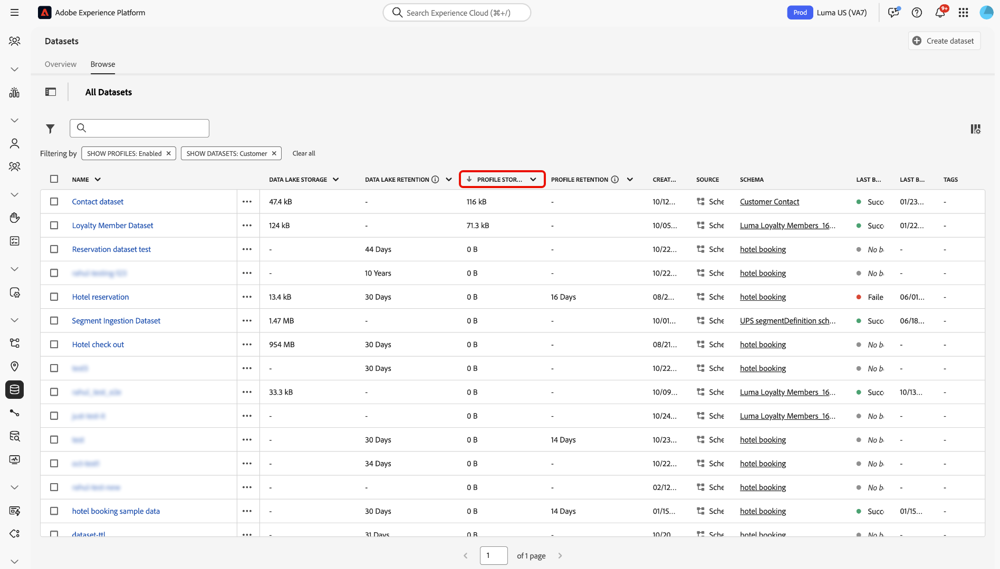

# Best Practices für die Verwaltung von Daten im Rahmen von Lizenzberechtigungen

Adobe Experience Platform ist ein offenes System, das Ihre Daten in Kundenprofile umwandelt, die in Echtzeit aktualisiert werden. Darüber hinaus nutzt Adobe Experience Platform KI-gestützte Einblicken, mithilfe derer Sie auf allen Kanälen ansprechende Erlebnisse bereitstellen können. Sie können Daten unterschiedlicher Art, Menge und Historie mit Hilfe von Quellen in Experience Platform einspeisen und diese Daten dann für Anwendungsfälle nutzen – von der Segmentierung und Personalisierung bis hin zu Analysen und maschinellem Lernen.

Experience Platform bietet Lizenzen an, die die Anzahl der Profile, die Sie erstellen können, und die Menge der Daten, die Sie einbringen können, festlegen. Da Sie Daten aus beliebigen Quellen, mit beliebigem Volumen und beliebiger Historie einbringen können, kann es vorkommen, dass Sie das Limit Ihrer Lizenzberechtigungen überschreiten, wenn Ihr Datenvolumen wächst.

Lesen Sie dieses Handbuch, um zu erfahren, welche Best Practices Sie befolgen sollten, und welche Tools Sie verwenden können, um Ihre Lizenzberechtigungen mit Experience Platform besser zu verwalten.

## Zusammenfassung der Funktionen {#summary-of-features}

Verwenden Sie die in diesem Dokument beschriebenen Best Practices und Tools, um die Nutzung Ihrer Lizenzberechtigungen in Experience Platform besser zu verwalten. Dieses Dokument wird aktualisiert, sobald zusätzliche Funktionen veröffentlicht werden, um allen Experience Platform-Kunden Transparenz und Kontrolle zu bieten.

In der folgenden Tabelle finden Sie eine Liste der derzeit verfügbaren Funktionen, mit denen Sie Ihre Lizenznutzungsberechtigung besser verwalten können.

| Funktion | Beschreibung |
| --- | --- |
| [Datensatz-Benutzeroberfläche - Aufbewahrung von Erlebnisereignisdaten](../../catalog/datasets/user-guide.md#data-retention-policy) | Konfigurieren Sie eine feste Aufbewahrungsfrist für Daten im Data Lake und Profilspeicher. Datensätze werden gelöscht, wenn die konfigurierte Aufbewahrungsfrist endet. |
| [Aktivieren/Deaktivieren von Datensätzen für das Echtzeit-Kundenprofil](../../catalog/datasets/user-guide.md) | Aktivieren oder Deaktivieren der Datensatzaufnahme in das Echtzeit-Kundenprofil. |
| [Gültigkeitsdauern von Erlebnisereignissen im Profilspeicher](../../profile/event-expirations.md) | Wenden Sie eine Ablaufzeit auf alle Ereignisse an, die in einen profilaktivierten Datensatz aufgenommen werden. Wenden Sie sich an Ihr Adobe-Accountteam oder die Kundenunterstützung, um diese Funktion zu aktivieren. |
| [Adobe Analytics-Datenvorbereitungsfilter](../../sources/tutorials/ui/create/adobe-applications/analytics.md#filtering-for-real-time-customer-profile) | Wenden Sie [!DNL Kafka] Filter an, um unnötige Daten von der Aufnahme auszuschließen. |
| [Quell-Connector-Filter von Adobe Audience Manager](../../sources/tutorials/ui/create/adobe-applications/audience-manager.md) | Wenden Sie Audience Manager-Quellverbindungsfilter an, um unnötige Daten von der Aufnahme auszuschließen. |
| [Datenfilter für die Ereignisweiterleitung](../../tags/ui/event-forwarding/overview.md) | Anwenden von Server-seitigen [!DNL Kafka]-Filtern, um unnötige Daten von der Aufnahme auszuschließen.  Weitere Informationen finden Sie in der Dokumentation unter [Tag-Regeln](../../tags/ui/managing-resources/rules.md). |
| [Lizenznutzungs-Dashboard](../../dashboards/guides/license-usage.md#license-usage-dashboard-data) | Überwachen Sie die Nutzung von Experience Platform-Produkten durch Ihr Unternehmen im Hinblick auf lizenzierte Berechtigungen. Greifen Sie auf Momentaufnahmen der täglichen Nutzung, Prognosetrends und detaillierte Daten auf Sandbox-Ebene zu, um die proaktive Lizenzverwaltung zu unterstützen. |
| [Dataset Overlap Report API](../../profile/tutorials/dataset-overlap-report.md) | Gibt die Datensätze aus, die am meisten zu Ihrer Addressable Audience beitragen. |
| [Identity Overlap Report API](../../profile/api/preview-sample-status.md#generate-the-identity-namespace-overlap-report) | Gibt die Identity-Namespaces an, die am meisten zu Ihrer Addressable Audience beitragen. |
| [Ablauf von Daten pseudonymer Profile](../../profile/pseudonymous-profiles.md) | Konfigurieren Sie Datenablaufzeiten für pseudonyme Profile und entfernen Sie automatisch Daten aus dem Profilspeicher. |

{style="table-layout:auto"}

## Grundlagen zur Datenspeicherung in Experience Platform

Experience Platform besteht im Wesentlichen aus zwei Datenspeichern: dem Data Lake und dem Profilspeicher.

Data Lake dient hauptsächlich folgenden Zwecken:

* Fungiert als Staging-Bereich für das Onboarding von Daten in Experience Platform;
* Fungiert als langfristiger Datenspeicher für alle Daten in Experience Platform;
* Ermöglicht Anwendungsfälle wie die Datenanalyse und Datenwissenschaft.

Der **Profilspeicher** ist der Ort, an dem Kundenprofile erstellt werden. Er hat vor allem folgende Aufgaben:

* Fungiert als Datenspeicher für Profile, die zur Bereitstellung von Echtzeit-Erlebnissen verwendet werden;
* Aktiviert Anwendungsfälle wie die Segmentierung, Aktivierung und Personalisierung.

>[!NOTE]
>
>Ihr Zugriff auf den [!DNL data lake] kann von der von Ihnen erworbenen Produkt-SKU abhängen. Weitere Informationen zu Produkt-SKUs erhalten Sie von Ihrem Adobe-Support-Mitarbeiter.

## Lizenznutzung {#license-usage}

Wenn Sie eine Lizenz für Experience Platform erwerben, erhalten Sie Lizenznutzungsberechtigungen, die je nach SKU variieren:

**[!DNL Addressable Audience]**: Die Gesamtzahl der Kundenprofile, die vertraglich für Experience Platform zugelassen sind, einschließlich bekannter und pseudonymer Profile.

**[!DNL Total Data Volume]**: Die Gesamtmenge der für das Echtzeit-Kundenprofil verfügbaren Daten, die in Interaktions-Workflows verwendet werden können.

Die Verfügbarkeit und spezifische Definition dieser Metriken hängen von der von Ihrem Unternehmen erworbenen Lizenz ab.

## Lizenznutzungs-Dashboard

Die Adobe Experience Platform-Benutzeroberfläche bietet ein Dashboard, über das Sie einen Schnappschuss der Lizenzdaten Ihres Unternehmens für Experience Platform anzeigen können. Die Daten im Dashboard werden genau so angezeigt, wie sie zu dem Zeitpunkt erscheinen, an dem der Snapshot erstellt wurde. Der Snapshot ist weder ein Näherungswert noch eine Stichprobe von Daten, und das Dashboard wird nicht in Echtzeit aktualisiert.

Weitere Informationen finden Sie im Handbuch unter [Verwenden des Lizenznutzungs-Dashboards in der Experience Platform-Benutzeroberfläche](../../dashboards/guides/license-usage.md#license-usage-dashboard-data).

## Best Practices für das Daten-Management

In den folgenden Abschnitten finden Sie Best Practices für eine bessere Verwaltung Ihrer Daten.

### Grundlegendes zu Daten

Nicht alle Daten in Adobe Experience Platform sind gleich. Einige Daten mögen zwar reichlich vorhanden, aber von geringem Wert sein, während andere spärlich, aber von hohem Wert sind. Manche Daten können unmittelbar nach ihrer Erstellung an Wert verlieren, während andere monatelang, wenn nicht sogar jahrelang ihren Wert behalten.

Bei der Einschätzung des Werts Ihrer Daten sind drei Dimensionen zu beachten:

| Dimension | Beschreibung | Beispiel |
| --- | --- | --- |
| Volumen | Stellt die Menge und Gesamtheit der erfassten Daten dar. | Web-Klicks – hohes Volumen und mäßige Aussagekraft. Der Wert kann schnell abnehmen. |
| Zeitpanne | Stellt die Zeitdauer dar, während der die erfassten Daten nützlich sind. | Offline-Käufe – moderates Volumen und Aussagekraft, können aber über lange Zeit nützlich sein. |
| Aussagekraft | Gibt an, wie reich die Daten an Informationen sind. | Kundenkonten – geringes Datenvolumen, aber große Aussagekraft. Kann über die Kundenlebensdauer hinaus nützlich sein. |

### Daten-Management-Tools {#data-management-tools}

Es gibt zwei zentrale Überlegungen, die Sie berücksichtigen sollten, wenn Sie sicherstellen möchten, dass Ihre Datennutzung innerhalb der Limits Ihrer Lizenzberechtigung bleibt:

### Welche Daten integrieren Sie in Experience Platform?

Daten können in Experience Platform in ein oder mehrere Systeme aufgenommen werden, nämlich den [!DNL data lake] und/oder den Profilspeicher. Dies bedeutet, dass in beiden Systemen für eine Vielzahl verschiedener Anwendungsfälle unterschiedliche Daten vorhanden sein können. Beispielsweise können Sie historische Daten im [!DNL data lake] speichern, jedoch nicht im Profilspeicher. Sie können auswählen, welche Daten an den Profilspeicher gesendet werden sollen, indem Sie einen Datensatz für die Profilaufnahme aktivieren.

>[!NOTE]
>
>Ihr Zugriff auf den [!DNL data lake] kann von der von Ihnen erworbenen Produkt-SKU abhängen. Weitere Informationen zu Produkt-SKUs erhalten Sie von Ihrem Adobe-Support-Mitarbeiter.

Sie müssen auch entscheiden, ob Sie Such-Datensätze für das Echtzeit-Kundenprofil aktivieren möchten, und sie nicht nur für allgemeine Suchzwecke verwenden. Befolgen Sie die unten stehenden Anweisungen, um eine Überschreitung Ihrer Lizenzbeschränkungen zu vermeiden.

#### Profilaktivierung für Lookup-Datensätze {#profile-enablement-lookup-datasets}

Ein Lookup-Datensatz ist ein Datensatz, den Sie in Experience Platform aktivieren, damit Anwendungen zur Laufzeit darauf verweisen können. Verwenden Sie Lookup-Datensätze, um relativ statische, schlüsselbezogene Informationen wie Produktdetails, Store-Metadaten oder Angebotskonfigurationen zu speichern, und nicht Datensätze, deren Hauptzweck darin besteht, Profilattribute (z. B. Name, E-Mail oder Treuestufe) oder Erlebnisereignisse (z. B. Seitenansichten oder Käufe) beizutragen.

Experience Platform-Programme wie [!DNL Journey Optimizer] und andere Decisioning-Programme verwenden diese Datensätze, um zusätzliche Felder basierend auf einem Schlüssel abzurufen (z. B. Produkt-ID oder Store-ID) und um Personalisierungs-, Entscheidungs- und Orchestrierungs-Workflows zu ergänzen. Die Aktivierung von Lookup-Datensätzen für das Echtzeit-Kundenprofil wirkt sich auf Ihr Profildatenvolumen aus. Verwenden Sie daher die folgende Anleitung, um innerhalb Ihrer Lizenzberechtigungen zu bleiben.

Beachten Sie beim Konfigurieren von Datensätzen für Suchzwecke die beiden Rollen, die ein Datensatz in Experience Platform spielen kann:

* **Lookup-Datensätze**: Zulassen, dass Anwendungen Referenzdaten für Services wie Personalisierung und Entscheidungsfindung in [!DNL Journey Optimizer] abrufen können.
* **Profil-aktivierte Datensätze**: Tragen Sie Attribute und Ereignisse zu vereinheitlichten Kundenprofilen im Echtzeit-Kundenprofil bei. Diese Datensätze stellen ihre Felder für Anwendungsfälle der Segmentierung und Aktivierung zur Verfügung.

>[!IMPORTANT]
>
>Aktivieren Sie nur dann einen Lookup-Datensatz für das Echtzeit-Kundenprofil, wenn Sie Felder aus diesem Datensatz im Echtzeit-Kundenprofil verwenden müssen (z. B. für Zielgruppendefinitionen, Aktivierung oder Segmentierung mehrerer Entitäten). Die Aktivierung eines Lookup-Datensatzes für das Echtzeit-Kundenprofil erhöht das Volumen Ihrer Profildaten. Weitere Informationen finden Sie im Tutorial [Segmentierung mehrerer Entitäten](../../segmentation/tutorials/multi-entity-segmentation.md).

**Wann Datensätze für das Echtzeit-Kundenprofil aktiviert werden:**

Aktivieren Sie in den folgenden Fällen einen Datensatz für das Echtzeit-Kundenprofil:

* Der Datensatz enthält Kundenattribute, die Sie in Kundenprofilen zusammenführen müssen (z. B. Treuestufe, Voreinstellungen, Kontoinformationen).
* Der Datensatz enthält Erlebnisereignisse, die zur Analyse des Kundenverhaltens und zur Segmentierung beitragen.
* Der Datensatz enthält Referenz- oder Anreicherungsattribute (z. B. Produkt-, Store- oder Kontoattribute), die Sie in Zielgruppendefinitionen, einschließlich Segmentierung mit mehreren Entitäten, oder in der nachgelagerten Aktivierung verwenden müssen.

**Wann Datensätze für das Echtzeit-Kundenprofil NICHT aktiviert werden sollten:**

Vermeiden Sie in den folgenden Fällen die Aktivierung eines Datensatzes für das Echtzeit-Kundenprofil:

* Der Datensatz enthält Referenzdaten wie Produktkataloge, SKU-Details, Speicherorte oder andere Nicht-Kundendaten, und Sie benötigen diese Attribute nicht im Echtzeit-Kundenprofil für die Segmentierung oder Aktivierung, einschließlich der Segmentierung mehrerer Entitäten.
* Der Datensatz enthält Anreicherungsdaten, die nur zur Laufzeit in Suchvorgängen verwendet werden und nicht als Teil der Kundenidentität oder in Zielgruppendefinitionen erforderlich sind.

### Welche Daten behalten Sie?

Sie können sowohl Datenaufnahme-Filter als auch Ablaufregeln anwenden, um Daten zu entfernen, die für Ihre Anwendungsfälle veraltet sind. In der Regel verbrauchen Verhaltensdaten (z. B. Analytics-Daten) wesentlich mehr Speicher als Eintragsdaten (z. B. CRM-Daten). Viele Experience Platform-Benutzer weisen beispielsweise bis zu 90 % Profile auf, die ausschließlich Verhaltensdaten enthalten, verglichen mit Datensatzdaten. Daher ist die Verwaltung Ihrer Verhaltensdaten von entscheidender Bedeutung, um die Einhaltung Ihrer Lizenzberechtigungen sicherzustellen.

Es gibt eine Reihe von Tools, die Ihnen helfen, Ihre Lizenznutzungsberechtigungen einzuhalten:

* [Aufnahmefilter](#ingestion-filters)
* [Profilspeicher](#profile-service)

### Identity Service und adressierbare Zielgruppe {#identity-service}

Identitätsdiagramme werden nicht auf Ihre gesamte adressierbare Zielgruppenberechtigung angerechnet, da sich adressierbare Zielgruppe auf Ihre Gesamtzahl an Kundenprofilen bezieht.

Aufgrund der Aufteilung von Identitäten können sich jedoch Beschränkungen des Identitätsdiagramms auf Ihre adressierbare Zielgruppe auswirken. Wenn beispielsweise die älteste ECID aus dem Diagramm entfernt wird, bleibt die ECID im Echtzeit-Kundenprofil als pseudonymes Profil bestehen. Sie können [Ablauf von Daten pseudonymer Profile](../../profile/pseudonymous-profiles.md) festlegen, um dieses Verhalten zu umgehen. Weitere Informationen finden Sie unter [ für Identity Service-Daten](../../identity-service/guardrails.md).

### Aufnahmefilter {#ingestion-filters}

Aufnahmefilter ermöglichen Ihnen, nur die für Ihre Anwendungsfälle erforderlichen Daten aufzunehmen und alle nicht erforderlichen Ereignisse herauszufiltern.

| Aufnahmefilter | Beschreibung |
| --- | --- |
| Adobe Audience Manager-Quellfilter | Wenn Sie eine Adobe Audience Manager-Quellverbindung erstellen, können Sie auswählen, welche Segmente und Merkmale in das [!DNL data lake]- und Echtzeit-Kundenprofil eingebracht werden sollen, anstatt alle Audience Manager-Daten zu erfassen. Weitere Informationen finden Sie in der Anleitung zum [Erstellen einer Audience Manager-Quellverbindung](../../sources/tutorials/ui/create/adobe-applications/audience-manager.md). |
| Adobe Analytics Data Prep | Sie können beim Erstellen einer Analytics-Quellverbindung mit [!DNL Data Prep]-Funktionen Daten herausfiltern, die für Ihre Anwendungsfälle nicht erforderlich sind. Mit [!DNL Data Prep] können Sie festlegen, welche Attribute/Spalten für das jeweilige Profil veröffentlicht werden sollen. Sie können auch bedingte Anweisungen erstellen, um Experience Platform darüber zu informieren, ob Daten für das Profil oder nur für den [!DNL data lake] veröffentlicht werden sollen. Weitere Informationen finden Sie in der Anleitung zum [Erstellen einer Analytics-Quellverbindung](../../sources/tutorials/ui/create/adobe-applications/analytics.md). |
| Unterstützung für das Aktivieren/Deaktivieren von Datensätzen für ein Profil | Um Daten in das Echtzeit-Kundenprofil aufzunehmen, müssen Sie einen Datensatz für die Verwendung im Profilspeicher aktivieren. Dadurch wird ein höherer Anteil Ihrer [!DNL Addressable Audience]- und [!DNL Total Data Volume]-Berechtigungen verbraucht. Sobald ein Datensatz für Anwendungsfälle von Kundenprofilen nicht mehr erforderlich ist, können Sie die Integration dieses Datensatzes in das Profil deaktivieren, um sicherzustellen, dass Ihre Daten weiterhin lizenzkonform sind. Weitere Informationen dazu finden Sie in der Anleitung zum [Aktivieren und Deaktivieren von Datensätzen für ein Profil](../../catalog/datasets/enable-for-profile.md). |
| Ausschließen von Web SDK- und Mobile SDK-Daten | Es gibt zwei Arten von Daten, die vom Web- und Mobile-SDK erfasst werden: automatisch erfasste Daten und explizit von Ihrem Entwickler erfasste Daten. Um die Einhaltung Ihrer Lizenz zu gewährleisten, können Sie die automatische Datenerfassung in der SDK-Konfiguration über die Kontexteinstellung deaktivieren. Benutzerdefinierte Daten können auch von Ihrem Entwickler entfernt oder nicht festgelegt werden. |
| Datenausschluss bei Server-seitiger Weiterleitung | Wenn Sie Daten mithilfe der Server-seitigen Weiterleitung an Experience Platform senden, können Sie festlegen, welche Daten nicht gesendet werden sollen, indem Sie entweder die Zuordnung in einer Regelaktion entfernen, um sie für alle Ereignisse auszuschließen, oder Bedingungen zur Regel hinzufügen, sodass Daten nur für bestimmte Ereignisse ausgelöst werden. Weitere Informationen finden Sie in der Dokumentation unter [Ereignisse und Bedingungen](/help/tags/ui/managing-resources/rules.md#events-and-conditions-if). |
| Filtern von Daten auf Quellebene | Sie können logische Operatoren und Vergleichsoperatoren verwenden, um Daten auf Zeilenebene aus Ihren Quellen zu filtern, bevor Sie eine Verbindung erstellen und Daten in Experience Platform aufnehmen. Weitere Informationen finden Sie im Handbuch unter [Filtern von Daten auf Zeilenebene für eine Quelle mithilfe der  [!DNL Flow Service] -API](../../sources/tutorials/api/filter.md). |

{style="table-layout:auto"}

### Profilspeicher {#profile-service}

Der Profilspeicher besteht aus den folgenden Komponenten:

| Profilspeicherkomponente | Beschreibung |
| --- | --- |
| Profilfragmente | Jedes Kundenprofil besteht aus mehreren **Profilfragmenten**, die zu einer einzigen Ansicht dieses Kunden zusammengeführt werden. Wenn ein Kunde beispielsweise über mehrere Kanäle mit Ihrer Marke interagiert, verfügt Ihr Unternehmen über mehrere **Profilfragmente**, die sich auf diesen Kunden beziehen und in mehreren Datensätzen enthalten sind. Wenn diese Fragmente in Experience Platform aufgenommen werden, werden sie mithilfe des Identitätsdiagramms zusammengeführt, sodass ein einziges Profil für diesen Kunden entsteht. **Profilfragmente** bestehen aus einem Identity-Namespace als Kennung sowie den zugehörigen Eintragsdaten und/oder Zeitreihendaten. |
| Eintragsdaten (Attribute) | Ein Profil ist eine Darstellung eines Subjekts, einer Organisation oder einer Einzelperson, die aus vielen **Attributen** besteht (auch als **Eintragsdaten** bezeichnet). So kann etwa ein Produktprofil eine SKU und eine Beschreibung enthalten, während in einem Personenprofil Informationen wie Vorname, Nachname und E-Mail-Adresse erfasst sind. **Eintragsdaten** haben normalerweise geringes/mäßiges Volumen, sind aber über einen langen Zeitraum hinweg wertvoll. |
| Zeitreihedaten (Verhalten) | **Zeitreihedaten** liefern Informationen zum Benutzerverhalten. Zeitreihedaten werden durch die Standard-Schemaklasse Experience-Datenmodell (XDM) [!DNL ExperienceEvent] dargestellt. Sie beschreiben Ereignisse wie etwa das Hinzufügen eines Artikels zu einem Warenkorb, das Klicken auf einen Link, das Abspielen eines Videos usw. Der Wert der Verhaltensdaten kann mit der Zeit abnehmen. |
| Identity-Namespace (Identitäten) | Wenn Kundendaten erfasst werden, werden sie mithilfe von **Identity-Namespaces** zu einem einzigen Profil zusammengeführt. Zudem besteht die Möglichkeit, solche Identitäten zu verknüpfen, sobald mehr Informationen über den jeweiligen Kunden bekannt werden. Weiterführende Informationen dazu finden Sie unter [Übersicht zu Identity-Namespaces](../../identity-service/features/namespaces.md). |

{style="table-layout:auto"}

### Berichte zur Zusammensetzung des Profilspeichers

Es stehen eine Reihe von Berichten zur Verfügung, die Ihnen dabei helfen, die Zusammensetzung des Profilspeichers zu verstehen. Diese Berichte helfen Ihnen dabei, fundierte Entscheidungen darüber zu treffen, wie und wo Sie Ihren Ablauf von Erlebnisereignissen festlegen können, um Ihre Lizenznutzung zu optimieren:

* **Dataset Overlap Report API**: Zeigt die Datensätze, die am meisten zu Ihrer adressierbaren Zielgruppe beitragen. Sie können diesen Bericht verwenden, um zu ermitteln, für welche [!DNL ExperienceEvent] Datensätze eine Gültigkeit festgelegt werden soll. Weitere Informationen dazu finden Sie im Tutorial zum [Erstellen des Dataset Overlap Reports](../../profile/tutorials/dataset-overlap-report.md).
* **Identity Overlap Report API**: Zeigt die Identity-Namespaces, die am meisten zu Ihrer adressierbaren Zielgruppe beitragen. Weitere Informationen dazu finden Sie im Tutorial zum [Erstellen des Identity Overlap Reports](../../profile/api/preview-sample-status.md#generate-the-identity-namespace-overlap-report).
<!-- * **Unknown Profiles Report API**: Exposes the impact of applying pseudonymous expirations for different time thresholds. You can use this report to identify which pseudonymous expirations threshold to apply. See the tutorial on [generating the unknown profiles report](../../profile/api/preview-sample-status.md#generate-the-unknown-profiles-report) for more information.
-->

### Ablauf von Daten pseudonymer Profile {#pseudonymous-profile-expirations}

Verwenden Sie die Datenablauffunktion für pseudonyme Profile, um automatisch Daten aus zu entfernen, die für Ihre Anwendungsfälle nicht mehr gültig oder nützlich sind, und zwar aus dem Profilspeicher. Ablauf von Daten pseudonymer Profile entfernt Ereignis- und Profildatensätze. Daher reduziert diese Einstellung die Anzahl der adressierbaren Zielgruppen. Weitere Informationen zu dieser Funktion finden Sie im Abschnitt [Ablauf von Daten pseudonymer Profile - Übersicht](../../profile/pseudonymous-profiles.md).

### Datensatz-Benutzeroberfläche - Aufbewahrung von Erlebnisereignis-Datensätzen {#data-retention}

Konfigurieren Sie die Einstellungen für die Gültigkeit und Aufbewahrung von Datensätzen, um eine feste Aufbewahrungsfrist für Ihre Daten im Data Lake und Profilspeicher zu erzwingen. Nach Ablauf der Aufbewahrungsfrist werden die Daten gelöscht. Ablauf von Erlebnisereignisdaten entfernt nur Ereignisse, keine Profilklassendaten, wodurch das [Gesamtdatenvolumen) ](total-data-volume.md) Lizenznutzungsmetriken reduziert wird. Weitere Informationen finden Sie im Handbuch unter [Festlegen der Datenspeicherungsrichtlinie](../../catalog/datasets/user-guide.md#data-retention-policy).

### Gültigkeitsdauern von Profilerlebnisereignissen {#event-expirations}

Konfigurieren Sie Ablaufzeiten, um Verhaltensdaten automatisch aus Ihrem profilaktivierten Datensatz zu entfernen, sobald sie für Ihre Anwendungsfälle nicht mehr nützlich sind. Weitere Informationen finden Sie in der Übersicht [ Gültigkeitsdauern ](../../profile/event-expirations.md) Erlebnisereignissen .

## Zusammenfassung der Best Practices für die Lizenznutzung {#best-practices}

Im Folgenden finden Sie eine Liste empfohlener Best Practices, die Sie befolgen können, um die optimale Nutzung Ihrer Lizenz sicherzustellen:

* Verwenden Sie das [Lizenznutzungs-Dashboard](../../dashboards/guides/license-usage.md), um die Nutzung durch Kunden zu verfolgen und zu überwachen. Dadurch können Sie potenziellen Überschreitungen rechtzeitig gegensteuern.
* Konfigurieren Sie [Aufnahmefilter](#ingestion-filters), indem Sie die Ereignisse bestimmen, die für Ihre Segmentierungs- und Personalisierungs-Anwendungsfälle erforderlich sind. Dies ermöglicht Ihnen, nur wichtige Ereignisse zu senden, die für Ihre Anwendungsfälle nötig sind.
* Stellen Sie sicher, dass Sie nur [Datensätze für Profile aktiviert haben](#ingestion-filters), die für Ihre Segmentierungs- und Personalisierungs-Anwendungsfälle erforderlich sind.
* Konfigurieren Sie [Ablauf von Erlebnisereignissen](../../catalog/datasets/user-guide.md#data-retention-policy) und [Ablauf von Daten pseudonymer Profile](../../profile/pseudonymous-profiles.md) für sehr häufige Daten wie Web-Daten.
* Konfigurieren Sie [Time-to-Live (TTL)-Aufbewahrungsrichtlinien für Erlebnisereignis](../../catalog/datasets/experience-event-dataset-retention-ttl-guide.md)Datensätze im Data Lake, um veraltete Datensätze automatisch zu entfernen und die Speichernutzung entsprechend Ihren Lizenzberechtigungen zu optimieren.
* Überprüfen Sie regelmäßig die [Berichte zur Profilzusammensetzung](#profile-store-composition-reports), um sich ein Bild über die Zusammensetzung des Profilspeichers zu machen. Auf diese Weise können Sie die Datenquellen ermitteln, die im Rahmen Ihrer Lizenzberechtigung die meisten Daten nutzen.

## Anwendungsfall: Lizenznutzungs-Compliance

### Gründe für diesen Anwendungsfall

Indem Sie die **Lizenznutzungsbestimmungen** sowohl für den Data Lake als auch für die Profilspeicherung einhalten, können Sie Überschüsse zuverlässig verhindern, Kosten optimieren und Ihre Richtlinien zur Datenspeicherung an Ihre Geschäftsanforderungen anpassen.

### Voraussetzungen und Planung

Beachten Sie die folgenden Voraussetzungen in Ihrem Planungsprozess:

* **Zugriff und**:
   * Stellen Sie sicher, dass Sie über die Berechtigung **Datensätze verwalten** zur Verwendung der TTL für Erlebnisereignisse verfügen.
   * Stellen Sie sicher, dass Sie über die **Profileinstellungen verwalten** verfügen, um die TTL für pseudonyme Profile zu verwenden.
* **Grundlagen zur Datenspeicherungsrichtlinie**:
   * Organisatorische Policies zur Datenaufbewahrung und Compliance
   * Geschäftsanforderungen an Lookback-Fenster für die Datenanalyse und Segmentierung

### Benutzeroberflächenfunktionen, Experience Platform-Komponenten und Experience Cloud-Produkte, die Sie verwenden werden

Um diesen Anwendungsfall erfolgreich zu implementieren, müssen Sie mehrere Bereiche von Adobe Experience Platform verwenden. Stellen Sie sicher, dass Sie über die erforderlichen attributbasierten Zugriffssteuerungsberechtigungen für alle diese Bereiche verfügen, oder bitten Sie Ihren Systemadministrator, diese Berechtigungen zu gewähren.

* Lizenznutzungs-Dashboard : Zeigen Sie Ihre aktuelle Berechtigungsnutzung auf Sandbox-Ebene an.
* Datensatz-Management - Überwachen und Verwalten von Aufbewahrungsrichtlinien auf Datensatzebene.
* Zielgruppen (Echtzeit-Kundenprofil): Stellen Sie sicher, dass die Segmentierungsregeln im Lookback-Fenster an die Datenaufbewahrungsfenster angepasst sind.
* Überwachung und Warnhinweise - Verfolgen Sie Aktualisierungen und erhalten Sie Einblicke in Vorgänge zur Datensatzaufbewahrung.

### Erreichen des Anwendungsfalls: Schrittweise Anweisungen

Lesen Sie die folgenden Abschnitte, die Links zu weiteren Dokumentationen enthalten, durch, um die einzelnen Schritte in der allgemeinen Übersicht oben abzuschließen.

**Überprüfen Sie Ihre aktuelle Lizenznutzung**

Navigieren Sie zunächst zum **Lizenznutzungs-Dashboard** und überprüfen Sie die Nutzung Ihrer Berechtigungen auf Sandbox-Ebene.

>[!BEGINTABS]

>[!TAB Produktions-Sandbox]

Verwenden Sie die [!UICONTROL Metrics], um Ihre Lizenznutzungsmetriken anzuzeigen. Auf der -Benutzeroberfläche werden standardmäßig Informationen zu Ihrer Produktions-Sandbox angezeigt.

>[!TAB Entwicklungs-Sandbox]

Wählen Sie [!UICONTROL Development] aus, um Lizenznutzungsmetriken für Ihre Entwicklungs-Sandboxes anzuzeigen.

>[!ENDTABS]

Weitere Informationen finden Sie in der Dokumentation unter [Verwenden des Lizenznutzungs-Dashboards](../../dashboards/guides/license-usage.md).

**Analysieren der Speicherverwendung auf Datensatzebene**

Verwenden Sie die **Datensatz durchsuchen**, um Ihre Datensatznutzungsmetriken sowohl für den Data Lake als auch für das Echtzeit-Kundenprofil zu überprüfen. Wählen Sie die Spaltenüberschriften für **[!UICONTROL Data Lake Storage]** oder **[!UICONTROL Profile Storage]** und dann **[!UICONTROL Sort Descending]** aus dem Popup-Fenster aus.

>[!BEGINTABS]

>[!TAB Data Lake Storage]

Ihre Datensätze im Data Lake werden nach Speichergröße sortiert. Verwenden Sie diese Funktion, um die größten Speicherverbraucher im Data Lake zu identifizieren.

>[!TAB Profilspeicher]

Die Datensätze im Profil werden nach Speichergröße sortiert. Verwenden Sie diese Funktion, um die größten Nutzer von Speicher im Profil zu identifizieren.

>[!ENDTABS]

**Auswerten und Konfigurieren der Aufbewahrungsregel**

Bestimmen Sie anschließend, ob Ihre Datensätze über die entsprechenden Aufbewahrungs-Policys verfügen, die auf Lizenzbeschränkungen und Geschäftsanforderungen für Analytics und die Segmentierung basieren. Um die Aufbewahrungsrichtlinie eines Datensatzes anzuzeigen, wählen Sie die Auslassungszeichen (`...`) neben Ihrem Datensatz aus und klicken Sie dann auf **[!UICONTROL Set data retention policy]**.

Die *[!UICONTROL Set dataset retention]* wird angezeigt. Verwenden Sie diese Schnittstelle, um eine Aufbewahrungsrichtlinie für Ihren Datensatz zu konfigurieren. Sie können damit auch anzeigen, wie viel Speicherplatz Ihr Datensatz im Data Lake oder im Profil belegt.

Sie können die Auswirkungen Ihres Datensatzes auf die Datenspeicherung mithilfe des Auswirkungs-Forecasters weiter analysieren. Wählen Sie **[!UICONTROL View ExperienceEvent data distribution]** aus, um ein Diagramm anzuzeigen, das Ihr Aufbewahrungsfenster und den Prozentsatz des gesamten Speichers anzeigt, der ablaufen wird.

Wenn Sie fertig sind, wählen Sie **[!UICONTROL Save]** aus

**Validieren von Aufbewahrungsänderungen**

Nachdem Sie Ihre Aufbewahrungsrichtlinien angewendet haben, können Sie die folgenden Tools verwenden, um Ihre Änderungen zu validieren:

* [Metriken zur Datensatznutzung](../../catalog/datasets/user-guide.md#enhanced-visibility-of-retention-periods-and-storage-metrics) in der Ansicht zum Durchsuchen von Datensätzen.
* Das [Überwachungs-Dashboard](../../dataflows/ui/monitor.md) zum Anzeigen und Analysieren der Auswirkungen der Datenspeicherung.
* Das [Lizenznutzungs-Dashboard](../../dashboards/guides/license-usage.md), um tägliche Momentaufnahmen, Prognosetrends und Einblicke auf Sandbox-Ebene anzuzeigen.
