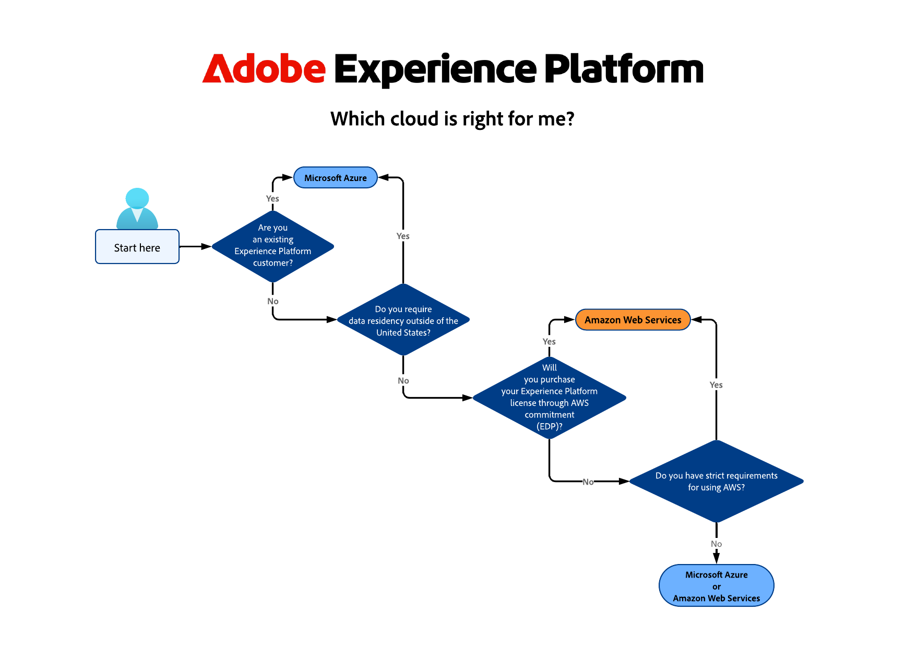
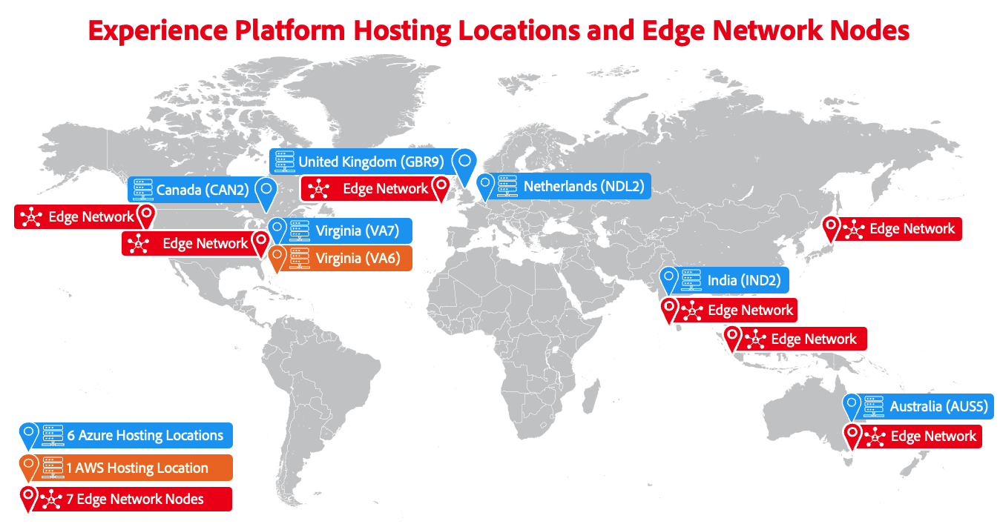

# Überblick über Adobe Experience Platform Multi-Cloud

Adobe Experience Platform ist ein Multi-Cloud-Produkt, bei dem Sie zwischen der Ausführung auf [[!DNL Microsoft Azure]](https://azure.microsoft.com/en-us) oder [[!DNL Amazon Web Services (AWS)]](https://aws.amazon.com/) wählen können. Diese Flexibilität ermöglicht es Ihnen, die beste Wahl für Ihre geschäftlichen und technischen Anforderungen zu wählen.

>[!AVAILABILITY]
>
>Adobe Experience Platform, das auf Amazon Web Services (AWS) ausgeführt wird, steht derzeit einer begrenzten Anzahl von Kunden zur Verfügung. Weitere Informationen zu Experience Platform in AWS erhalten Sie von Ihrem Adobe Account Team.

Diese Seite bietet einen allgemeinen Überblick über die beiden verfügbaren Cloud-Infrastrukturen und enthält Anleitungen zur Auswahl der richtigen für Ihr Unternehmen.

## Welche Cloud-Implementierung ist das Richtige für mich? {#which-cloud-is-right}

Die Auswahl zwischen Experience Platform auf Azure oder AWS hängt von mehreren Faktoren ab, die für Ihr Unternehmen spezifisch sind:

* **Geschäftliche und technische Anforderungen**: Bewerten Sie die Anforderungen Ihres Unternehmens und die langfristige Cloud-Strategie.
* **Vorhandene Infrastruktur**: Berücksichtigen Sie Ihre aktuellen Cloud-Infrastruktur- und Integrationsanforderungen.
* **Cloud-Technologie**: Wenn Ihr Unternehmen stark von Microsoft-Technologien abhängig ist, eignet sich Azure möglicherweise besser. Wenn Sie sich stärker auf Amazon-Services verlassen, könnte AWS die bessere Option sein.
* **Überlegungen zur Datenresidenz**: Bewerten Sie die Anforderungen an die Datenresidenz für Ihr Unternehmen und stellen Sie sicher, dass die ausgewählte Cloud-Plattform Regionen bietet, die diese Vorschriften erfüllen.

Verwenden Sie unter Berücksichtigung der oben genannten Faktoren diesen vereinfachten Entscheidungsbaum, um bei der Entscheidung über die richtige Cloud-Implementierung für Ihre Geschäftsanforderungen zu helfen.

{align="center" zoomable="yes"}

## Hosting-Standorte {#available-cloud-regions}

Die Auswahl der richtigen Cloud-Region ist entscheidend, um die Anforderungen an die Datenresidenz zu erfüllen und eine optimale Leistung sicherzustellen.

{align="center" zoomable="yes"}

Experience Platform ist an sechs Microsoft Azure-Hosting-Standorten und an einem Amazon Web Services (AWS)-Hosting-Standort verfügbar und leitet Daten über sieben [Edge Network-Knoten](../collection/home.md#edge) die weltweit verteilt sind, an Adobe-Services weiter.

### Regionen Microsoft Azure {#azure-regions}

Die nachstehende Tabelle zeigt die Regionen von Microsoft Azure, in denen Experience Platform gehostet wird.

| Land | Regionscode | Standort |
|---------|-------------|----------|
| Vereinigte Staaten von Amerika | VA7 | Virgina |
| Vereinigtes Königreich | GBR9 | London |
| Niederlande | NDL2 | Amsterdam |
| Kanada | CAN2 | Toronto |
| Indien | IND2 | Maharashtra |
| Australien | AUS5 | New South Wales |

{style="table-layout:auto"}

### Regionen Amazon Web Services (AWS) {#aws-regions}

In der folgenden Tabelle sind die AWS-Regionen aufgeführt, in denen Experience Platform gehostet wird. Schauen Sie regelmäßig vorbei, ob weitere Standorte hinzugefügt wurden.

| Land | Regionscode | Standort |
|---------|-------------|----------|
| Vereinigte Staaten von Amerika | VA6 | Virgina |

{style="table-layout:auto"}

## Parität der Funktionen {#feature-parity}

Adobe ist bestrebt, für alle auf Experience Platform ausgeführten Anwendungen Funktionsgleichheit über Cloud-Plattformen hinweg zu bieten, z. B.:

* [Real-Time Customer Data Platform](../rtcdp/home.md)
* [Adobe Journey Optimizer](https://experienceleague.adobe.com/de/docs/journey-optimizer/using/ajo-home)
* [Customer Journey Analytics](https://experienceleague.adobe.com/de/docs/analytics-platform/using/cja-landing)

Einige Funktionen können jedoch zwischen Azure- und AWS-Implementierungen unterschiedlich sein. Diese Unterschiede werden im folgenden Abschnitt und gegebenenfalls in anderen Teilen der Produktdokumentation beschrieben.

### Unterschiede zwischen der Ausführung von Experience Platform auf Microsoft Azure und AWS {#azure-aws-differences}

In der folgenden Tabelle werden die wichtigsten Unterschiede zwischen der Ausführung von Experience Platform auf Microsoft Azure und AWS hervorgehoben.

| Funktion/Funktionalität | Microsoft Azure | Amazon Web Services |
| --- | --- | --- |
| [HIPAA-Konformität](https://www.adobe.com/trust/compliance/hipaa-ready.html) | Unterstützt | Nicht unterstützt |
| [Katalog der Quell-Connectoren](/help/sources/home.md) | Alle Connectoren im Quellkatalog werden unterstützt | Eine begrenzte Anzahl von Quell-Connectoren ist verfügbar. Alle für AWS-Implementierungen verfügbaren Quell-Connectoren werden in einem Hinweis oben auf der Seite auf den jeweiligen Dokumentationsseiten aufgeführt. |

{style="table-layout:auto"}

<!-- 
To be determined if we need to add this part about the AI Assistant 

| [Experience Platform AI Assistant](/help/ai-assistant/home.md) | Supported | Not supported |

-->

## Zusammenfassung {#conclusion}

Experience Platform bietet Flexibilität und Auswahlmöglichkeiten, da Sie die Möglichkeit haben, auf Microsoft Azure oder Amazon Web Services auszuführen. Bewerten Sie Ihre geschäftlichen Anforderungen und die vorhandene Infrastruktur, um eine fundierte Entscheidung über die zu verwendende Cloud-Plattform zu treffen.
