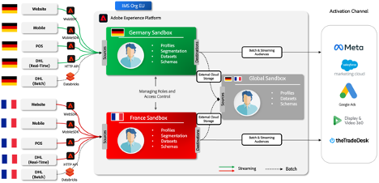
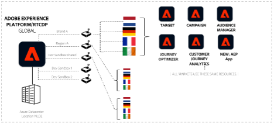

# Adobe Experience Platform für Unternehmen mit mehreren Regionen und mehreren Marken

## Einführung

Adobe Experience Platform steht bei transformativen Lösungen an der Spitze und ermöglicht es Ihnen, das Potenzial Ihrer Kundendaten und -inhalte voll auszuschöpfen. Mit Experience Platform können Sie Daten aus verschiedenen Systemen zentral zusammenführen und standardisieren und die Leistungsfähigkeit von Datenwissenschaft und maschinellem Lernen nutzen. Das Ergebnis ist eine verbesserte Erstellung und Bereitstellung personalisierter Erlebnisse, die bei Ihren Kunden Anklang finden.

Mit Experience Platform können Sie Ihre Geschäftsdaten für skalierbare, flexible Implementierungen darstellen, strukturieren und steuern. Die Implementierung von Platform-Anwendungen ist eine wichtige Journey, die strategische Planung und sorgfältige Überlegungen erfordert, insbesondere wenn Sie global, regional und markenspezifisch oder mit einer Kombination all dieser Aspekte arbeiten.

Dieses Whitepaper dient als Referenz und bietet einen Produktansatz sowie eine Reihe von Richtlinien. Ihr Hauptziel ist es, Sie und Ihre Implementierungsteams mit den Tools und Erkenntnissen auszustatten, die für eine effektive Navigation durch die Feinheiten von Experience Platform erforderlich sind. Durch die Bereitstellung eines strukturierten Frameworks zur Bewertung Ihrer spezifischen Anforderungen, Überlegungen und Anwendungsfälle in der Praxis erhalten Sie das erforderliche Wissen, um das Potenzial von Experience Platform und plattformbasierten Anwendungen voll auszuschöpfen. Beim Lesen der folgenden Abschnitte erhalten Sie wertvolle Einblicke und Empfehlungen zur Optimierung des Implementierungsprozesses und zur Steigerung der Fähigkeit Ihres Unternehmens, Ihrer Zielgruppe außergewöhnliche Erlebnisse bereitzustellen und gleichzeitig die Governance und die Kontrollen zur Wahrung des Datenschutzes und der Compliance bereitzustellen.


## Grundlegendes zum Unternehmen mit mehreren Marken und mehreren Regionen

Wenn Sie ein Unternehmen mit mehreren Marken und mehreren Regionen betreiben, gelten in Experience Platform höchstwahrscheinlich eigene Datenverwaltungsanforderungen. Um die Experience Platform-Implementierung an Ihre spezifischen Anforderungen anzupassen, ist es von entscheidender Bedeutung, dass Sie Ihre individuellen Anforderungen verstehen.

Beim Untersuchen von Bereitstellungsoptionen müssen Sie die Rollen verstehen und berücksichtigen, die mit Experience Platform und plattformbasierten Anwendungen interagieren werden. Die Gestaltung ihrer Erfahrungen auf der Grundlage ihrer Rollen und Interessen stellt eine erfolgreiche Implementierung sicher. Im Folgenden finden Sie drei wichtige Rollen, die Sie bei der Untersuchung der Optionen berücksichtigen sollten:

**Mary, die Marketingexpertin:**

- Schwerpunkt: Kundenakquise und skalierte Erlebnispersonalisierung.
- Ziele: Erstellen umfassender Profile, Steigerung der Medieneffizienz.

**Ted, der Technologe**

- Schwerpunkt: Organisatorisches Daten-Management.
- Ziele: Gewährleistung der Compliance, Verwaltung von Datensilos, Wartung verschiedener Geschäftsbereiche.

**Dan, der Datenarchitekt**

- Schwerpunkt: Datengenauigkeit und -qualität.
- Ziele: Gewährleistung von Datenschutz und Vertrauen, Entwerfen von Schemata und Datenmodellen, Verwalten von Datenquellen.

### &#x200B;1. Ein Unternehmen, das mit begrenzter Datenisolierung arbeitet

Ein wichtiges Architekturprinzip in Experience Platform besteht darin, dass Kundendaten auf der Grundlage von Governance-Richtlinien und -Anforderungen auf eine bestimmte Produktions-Sandbox beschränkt sind.

Wenn Ihr Unternehmen eine einzige Datenumgebung benötigt, um Ihr Marketing-Erlebnis skaliert zu betreiben, können Sie es vorziehen, alle Ihre Daten in einer einzigen Experience Platform-Sandbox mit minimalen Anforderungen an die Datenisolierung zu konsolidieren. Im Rahmen dieses Setups werden Daten in eine Sandbox aufgenommen, und alle zugehörigen Identitäten werden als einzelnes einheitliches Profil dargestellt, unabhängig davon, ob sie durch eine pseudonyme oder bekannte Identität identifiziert werden. Das bedeutet, dass Ihre Marketing-Fachleute unternehmensweit auf alle Profilattribute und Erlebnisereignisdaten in Experience Platform zugreifen können. Sie können diese Daten mit plattformbasierten Programmen verwenden, um Zielgruppen und Journey zu erstellen, ohne dass Marketing-Fachleute die Verwendung aller Daten unabhängig von Marke oder Region einschränken müssen. Dieser Ansatz ermöglicht eine nahtlose Segmentierung und Zielgruppenaktivierung in die Ziele, die von Experience Platform-Programmen unterstützt werden. Diese Strategie funktioniert gut, wenn Sie Ihren gesamten Kundenstamm unabhängig von regionalen oder markenspezifischen Unterschieden für einheitliche und kohärente Marketing-Maßnahmen nutzen möchten.


#### Funktionsweise

Beginnen wir mit der Planung Ihrer Implementierung und der Konfiguration Ihrer Top-Level-Umgebung. Als Nächstes entscheiden Sie über die Anzahl der Sandboxes, Rollen und Berechtigungen, die für den optimalen Betrieb von Experience Platform und plattformbasierten Anwendungen für Ihr Unternehmen erforderlich sind.

##### Allgemeine Einrichtung für Ihre Implementierung

- Konfigurieren Sie Sandboxes, um das Erstellen einheitlicher Kundenprofile zu ermöglichen.
- Richten Sie Rollen und Zugriffssteuerungen ein, um Sandboxes und den Zugriff auf Funktionen für jede Rolle zu verwalten.
- Verwalten Sie den Entwicklungslebenszyklus mit einer Entwicklungs-Sandbox und Sandbox-Tools.

**Sandboxes**

Sandboxes sind virtuelle Partitionen innerhalb einer Instanz von Experience Platform, die eine nahtlose Integration in den Entwicklungsprozess Ihrer Programme für digitale Erlebnisse ermöglichen. Alle Inhalte und Aktionen, die innerhalb einer Sandbox ausgeführt werden, sind auf diese Sandbox beschränkt und wirken sich nicht auf andere Sandboxes aus, einschließlich Daten und Zugriff auf Daten. Es werden zwei Arten von Sandboxes für Experience Platform unterstützt:

- **Produktions-Sandbox**: Eine Produktions-Sandbox ist für die Verwendung mit Profilen in Ihrer Produktionsumgebung vorgesehen. Mit Experience Platform können Sie mehrere Produktions-Sandboxes erstellen, um die richtigen Datenfunktionen bereitzustellen und gleichzeitig die betriebliche Isolation beizubehalten.

- **Entwicklungs-Sandbox**: Eine Entwicklungs-Sandbox kann ausschließlich für die Entwicklung und Tests mit Nicht-Produktionsprofilen verwendet werden.

Sie können mehrere Sandboxes beliebigen Typs erstellen. Für diesen Unternehmenstyp verwenden wir eine Produktions- und eine Entwicklungs-Sandbox, um zu veranschaulichen, wie dieser Unternehmenstyp ausgeführt und betrieben wird.


Wir erwarten, dass Sie in der Produktions-Sandbox Ihr Produktionsprofil und Ihre Erlebnisereignisdaten aufnehmen, um ein einheitliches Profil für Ihre Marketing-Aktivitäten zu erstellen. Weitere Informationen dazu, wie Sie bekannte und anonyme Daten aus verschiedenen Unternehmensquellen kombinieren können, um Kundenprofile zu erstellen, mit denen in Echtzeit personalisierte Kundenerlebnisse auf allen Kanälen und Geräten bereitgestellt werden können, finden Sie in der [Adobe Real-Time Customer Data Platform-Dokumentation](https://experienceleague.adobe.com/de/docs/experience-platform/rtcdp/home).

**Zugriffssteuerungen**

Sie können Zugriffssteuerungen mit Rollen und Berechtigungen definieren, um den Zugriff auf Anwendungsressourcen je nach Rolle und erforderlicher Funktionalität zu steuern. Darüber hinaus haben Sie die Möglichkeit, den Zugriff auf bestimmte Felder der Profildaten zu beschränken. Sie sollten diesen Schritt gründlich durchdenken, um die Nutzung von Experience Platform, plattformbasierten Anwendungen und Kundendaten besser steuern zu können.

Ein Datentechniker muss möglicherweise nicht auf alle Experience Platform- und plattformbasierten Anwendungsfunktionen zugreifen. Sie sind in der Regel für die Erstellung von Datendefinitionen (Schemata), die Konfiguration von Datenquellen für die Aufnahme von Daten und die Erstellung von Datensätzen verantwortlich. Es kann jedoch sein, dass es sich nicht um dieselbe Rolle handelt, die Zielgruppen für personalisierte Kundenerlebnisse erstellt und aktiviert. Erstellen Sie für diese Rolle eine Rolle, fügen Sie die entsprechenden Berechtigungen hinzu und gewähren Sie nur Zugriff auf die erforderlichen Funktionen. Eine Marketer-Rolle hingegen würde nicht Schemata erstellen und Daten erfassen, sondern sich auf die Erstellung und Aktivierung von Zielgruppen konzentrieren, um personalisierte Kundenerlebnisse zu ermöglichen.

Falls gewünscht, sollten Sie granulare Zugriffssteuerungen hinzufügen, um den Zugriff auf bestimmte Felder im einheitlichen Kundenprofil mit attributbasierter Zugriffssteuerung/Zugriffssteuerungsfunktion auf Feldebene zu beschränken. Dies sind Governance-Mechanismen in Experience Platform, mit denen Sie den Zugriff auf Datenattribute auf der Grundlage vordefinierter Kennzeichnungen einschränken können. Mit der Zugriffssteuerung auf Feldebene können personenbezogene Daten verwaltet werden, und der Zugriff ist auf alle Experience Platform- und Programm-Workflows beschränkt. Weitere Informationen zu den Funktionen der Zugriffssteuerung finden Sie unter [Dokumentation zur Zugriffssteuerung](https://experienceleague.adobe.com/de/docs/experience-platform/access-control/home).


**Entwicklungslebenszyklus mit Entwicklungs-Sandboxes**

Eine Entwicklungs-Sandbox verhält sich in allen funktionalen Aspekten genauso wie eine Produktions-Sandbox. Der Unterschied besteht darin, dass es einige vertragliche Leitplanken gibt, um Sie innerhalb Ihrer Lizenzbeschränkungen zu halten. Sie wurde ausschließlich für die Entwicklung und Tests mit Nicht-Produktionsprofilen entwickelt und unterstützt bis zu 10 % Ihrer lizenzierten Profilverpflichtung (kumulativ über alle autorisierten Entwicklungs-Sandboxes gemessen). Weitere Informationen und Leitplanken finden Sie in der [Sandbox-Übersichtsdokumentation](https://experienceleague.adobe.com/de/docs/experience-platform/sandbox/home) und auf der [Produktbeschreibungsseite](https://helpx.adobe.com/de/legal/product-descriptions.html) für Berechtigungsdetails.

Sie können mehrere Entwicklungs-Sandboxes (bis zu 4 in diesem Unternehmensbeispiel, da wir eine einzige Produktions-Sandbox verwenden) für den Entwicklungs- und Testlebenszyklus verwenden.

**Exportieren und Importieren von Paketen mit Sandbox-Tools**

Die Sandbox-Tooling-Funktion ermöglicht es Benutzenden mit entsprechenden Berechtigungen, ihre Arbeit aus einer Entwicklungs-Sandbox zu verpacken und in ein Repository zu exportieren. Auf dieses Repository können andere Benutzer zugreifen, die diese Pakete in ihre vorgesehenen Sandboxes importieren können. Diese Funktion stellt konsistente Konfigurationen über Sandboxes hinweg sicher und erleichtert nahtlose Export- und Importprozesse.

Die Verwendung von Sandbox-Tools verbessert die Konfigurationsgenauigkeit erheblich und reduziert den Zeitaufwand für die Implementierung. Dies ermöglicht die effiziente Verschiebung erfolgreicher Konfigurationen über verschiedene Sandboxes hinweg.

Mit der Sandbox-Tooling-Funktion können Sie verschiedene Objekte auswählen und in ein Paket exportieren. Ein Paket kann ein einzelnes Objekt oder mehrere Objekte enthalten, aber alle Objekte müssen aus derselben Sandbox stammen.

**Sandbox-Automatisierung über APIs**

Sie haben die Möglichkeit, Experience Platform-APIs zur Automatisierung von Sandbox-Bereitstellungen und Konfigurationsaufgaben zu verwenden. APIs ermöglichen eine programmierbare Steuerung für sich wiederholende Aufgaben wie das Exportieren, Importieren oder Ändern von Sandbox-Konfigurationen und bieten so Flexibilität, wenn Sie automatisierte Workflows bevorzugen.

Weitere Informationen zum Sandbox-Tooling finden Sie in der [Sandbox-Tooling-Dokumentation](https://experienceleague.adobe.com/en/docs/experience-platform/sandbox/ui/sandbox-tooling).

|  |  |
| --- | --- |

### &#x200B;2. Region oder markenspezifische Datenisolierung

Wenn Sie eine vollständige Isolation benötigen (z. B. regional oder markenbasiert), können Sie unter Einhaltung strenger Datenzugriffsrichtlinien oder gesetzlicher Anforderungen arbeiten, die den Zugriff Ihrer Markenteams auf Daten beschränken, die für ihre jeweiligen Regionen oder Marken spezifisch sind. Sie definieren Zugriffsmuster auf der Grundlage von Regions- oder markenspezifischen Daten und stellen so die Einhaltung interner, behördlicher und Data Governance-Protokolle sicher. Dieser Ansatz ist wichtig, wenn Sie in stark regulierten Branchen tätig sind (z. B. bei der Verarbeitung von personenbezogenen Daten) oder für verschiedene geografische Regionen oder Markenidentitäten unterschiedliche und segmentierte Daten pflegen müssen.


#### Funktionsweise

Beginnen wir mit der Planung Ihrer Implementierung, der Konfiguration Ihrer Umgebung auf oberster Ebene und der Entscheidung über die Anzahl der Sandboxes, Rollen und Berechtigungen, die erforderlich sind, um Experience Platform und plattformbasierte Anwendungen optimal für Ihr Unternehmen zu betreiben.

##### Allgemeine Einrichtung für Ihre Multi-Sandbox-Implementierung

- Konfigurieren Sie mehrere Produktions-Sandboxes, um das Erstellen einheitlicher Kundenprofile in jeder Sandbox zu ermöglichen.

- Richten Sie Rollen und Zugriffssteuerungen ein, um Sandboxes und den Zugriff auf Funktionen für jede Rolle zu verwalten.

- Verwalten des Entwicklungslebenszyklus mit Sandbox-Tools.

- Globales Reporting und globale Aktivierung (Aggregieren von Daten aus mehreren Sandboxes für organisationsübergreifende Einblicke mit Customer Journey Analytics).

**Sandboxes**

Im Gegensatz zu einem Setup mit einer einzigen Produktions-Sandbox benötigen Sie möglicherweise einen komplexeren Ansatz, wenn Sie Daten und Workflows vollständig isolieren müssen. An dieser Stelle kommen mehrere Produktions-Sandboxes ins Spiel, die jeweils eine auf Ihre spezifischen Anforderungen zugeschnittene Isolierungseinheit darstellen.

Wie bereits erwähnt, ist jede Sandbox eine virtuelle Partition innerhalb einer einzelnen Platform-Instanz. Diese Sandboxes ermöglichen es Ihnen, Ihre Daten, Workflows und Prozesse in einer kontrollierten Umgebung zu verwalten, die andere Sandboxes nicht beeinträchtigt. Während Entwicklungs-Sandboxes für Test- und Entwicklungsaktivitäten mit Nicht-Produktionsprofilen vorgesehen sind, sind Produktions-Sandboxes das Rückgrat von Live-Vorgängen und unterstützen die Aufnahme tatsächlicher Produktionsdaten für Marketing-Aktivitäten in der realen Welt.

Die wichtigsten Vorteile einer sauberen Isolation in Produktions-Sandboxes:

1. **Data Governance und Compliance:** Wenn Sie in regulierten Branchen oder Regionen mit strengen Datenschutzgesetzen tätig sind, müssen Sie sicherstellen, dass Daten aus einer Region oder Marke isoliert bleiben. Mehrere Produktions-Sandboxes ermöglichen es Ihnen, Governance-Anforderungen oder branchenspezifische Standards zu erfüllen, indem sie sicherstellen, dass Daten nur innerhalb der entsprechenden Sandbox zugänglich sind.

2. **Betriebliche Effizienz:** Durch die Isolierung von Daten und Workflows können Sie Ihre Abläufe effizienter verwalten. Ihre für verschiedene Regionen oder Marken zuständigen Teams können innerhalb ihrer eigenen Sandboxes unabhängig voneinander arbeiten, ohne sich um versehentliche Datenlecks oder unbefugten Zugriff sorgen zu müssen.

3. **Angepasste Workflows:** Sie können jede Produktions-Sandbox an die spezifischen Anforderungen Ihrer Region oder die Marke, die sie darstellt, anpassen. Auf diese Weise können Sie benutzerdefinierte Workflows, Datenmodelle und Marketing-Strategien implementieren, die für dieses Segment optimiert sind.

4. **Skalierbarkeit:** Sie können auf einfache Weise zusätzliche Produktions-Sandboxes erstellen, um neue Regionen oder Marken aufzunehmen. Diese Skalierbarkeit stellt sicher, dass sich die Plattform an Ihre sich verändernden Anforderungen anpassen kann, ohne die Datenintegrität oder -leistung zu beeinträchtigen.

5. **Verbesserte Kontrolle:** Mit mehreren Produktions-Sandboxes haben Ihre Admins eine differenzierte Kontrolle über Zugriffsberechtigungen, Datenaufnahme und Workflow-Ausführung. Auf diese Weise können Sie die Verwaltung komplexer Abläufe im gesamten globalen Unternehmen sicherer und besser organisieren.

**Zugriffssteuerungen**

Im Kontext mehrerer Produktions-Sandboxes bleiben Zugriffssteuerungen eine wichtige Komponente bei der Verwaltung von Daten und Workflows in Experience Platform. Die Komplexität steigt jedoch, da Ihre Admins sicherstellen müssen, dass Benutzende nur auf die Sandboxes zugreifen können, die für ihre Rollen relevant sind, während sie gleichzeitig Sandbox-übergreifende Vorgänge für Benutzende aktivieren müssen, die sie benötigen, z. B. Ihre Marketing-Teams in mehreren Regionen oder Dateningenieure, die für die globale Datenaufnahme und Datenmodellierung verantwortlich sind.

**Rollen und Berechtigungen in Sandboxes definieren:**

Wie im Szenario mit einer einzigen Produktions-Sandbox können Sie Zugriffssteuerungsrichtlinien mit Rollen und Berechtigungen definieren, die auf die Bedürfnisse verschiedener Rollen und Rollen zugeschnitten sind. Sie müssen jedoch berücksichtigen, wie sich diese Rollen in einer Multi-Sandbox-Umgebung auf verschiedene Sandboxes erstrecken.

Beispiel:

- **Regionale Marketer:** Wenn Ihre Marketer in mehreren Regionen tätig sind, müssen ihre Rollen möglicherweise mehr als eine Sandbox umfassen. Sie können ihnen die erforderlichen Berechtigungen für den Zugriff auf Ressourcen in mehreren Sandboxes gewähren und gleichzeitig sicherstellen, dass ihr Zugriff weiterhin auf die entsprechenden Daten und Workflows in jeder Sandbox beschränkt ist.

- **Dateningenieure:** Dateningenieure, die für die Erstellung von Datenmodellen, die Definition von Schemata und die Verwaltung der Datenaufnahme verantwortlich sind, benötigen möglicherweise Zugriff auf alle Sandboxes. Sie können ihre Rollen so entwerfen, dass sie über die gesamte Plattform ausgeführt werden können, während ihr Zugriff auf die für ihre Aufgaben relevanten Funktionen und Daten beschränkt bleibt. Ein Dateningenieur, der an Datenmodellen für Europa und Nordamerika arbeitet, könnte beispielsweise auf die Produktions-Sandboxes für diese Regionen zugreifen und dort die Berechtigung haben, Schemata zu ändern und Daten aufzunehmen. Sie wären jedoch nicht in der Lage, auf Marketing-Funktionen wie die Erstellung und Aktivierung von Zielgruppen zuzugreifen.

**Überlegungen zur granularen Zugriffssteuerung:**

In einer Multi-Sandbox-Umgebung wird die granulare Zugriffskontrolle sogar noch wichtiger. Die attributbasierte Zugriffssteuerung (Zugriffssteuerung auf Feldebene/Zugriffssteuerung auf Objektebene) ermöglicht es Ihnen, den Zugriff auf bestimmte Datenfelder innerhalb von Profilen oder bestimmten Zielgruppen weiter einzuschränken und so sicherzustellen, dass sensible oder persönlich identifizierbare Informationen (PII) in allen Ihren Sandboxes geschützt sind. Beispiel:

- Sie können den Zugriff auf bestimmte Datenfelder innerhalb einer Sandbox nur auf Benutzer innerhalb dieser Region beschränken. Dadurch wird sichergestellt, dass personenbezogene Daten oder vertrauliche Daten nur für diejenigen sichtbar sind, die sie benötigen. Dies erfolgt in Übereinstimmung mit Datenschutzbestimmungen und internen Governance-Richtlinien.

- Für Benutzer mit Sandbox-übergreifendem Zugriff stellt die attributbasierte Zugriffssteuerung sicher, dass ihre Sichtbarkeit von sensiblen Daten durch ihre Rolle und eine „Kenntnis nur nach Bedarf“ beschränkt wird, selbst wenn sie Zugriff auf mehrere Sandboxes haben.

Vorteile der rollenbasierten und attributbasierten Zugriffssteuerung:

1. Durch die Zugriffssteuerung auf der Grundlage von Rollen und Attributen können Sie das Risiko eines nicht autorisierten Datenzugriffs erheblich reduzieren und sicherstellen, dass nur diejenigen mit den entsprechenden Berechtigungen vertrauliche Informationen anzeigen oder bearbeiten können.

2. Klare und klar definierte Rollen und Berechtigungen optimieren den Arbeitsablauf, da jede Rolle ohne unnötigen Aufwand und Risiken Zugriff auf die benötigten Funktionen und Daten hat. Diese Klarheit unterstützt effiziente Workflows und verringert Reibungsverluste.

3. Wenn Ihr Unternehmen wächst und sich weiterentwickelt, können die Zugriffssteuerungen angepasst werden, um neue Regionen, Marken oder Rollen aufzunehmen. Die Flexibilität, den Zugriff zu ändern, ohne bestehende Workflows zu unterbrechen, ist für die Skalierung Ihrer Vorgänge entscheidend.

4. Administratoren können die zentrale Kontrolle über alle Sandboxes behalten und somit eine konsistente Anwendung der Zugriffssteuerungen im gesamten Unternehmen sicherstellen, während gleichzeitig Anpassungen für verschiedene Regionen oder Marken möglich sind.

**Entwicklungslebenszyklus mit Entwicklungs-Sandboxes**

Die Verwaltung Ihres Entwicklungs-Lebenszyklus über mehrere Regionen und Marken hinweg in Experience Platform erfordert einen robusten Ansatz, der Konsistenz, Effizienz und Skalierbarkeit gewährleistet. Entwicklungs-Sandboxes unterstützen den Entwicklungs-Lebenszyklus in einer komplexen Umgebung mit zahlreichen Produktions-Sandboxes. Sie werden durch die Sandbox-Tooling-Funktion verbessert, die eine nahtlose Konfigurationsfreigabe und Bereitstellung in verschiedenen Umgebungen ermöglicht.

Entwicklungs-Sandboxes spielen eine entscheidende Rolle im Entwicklungslebenszyklus. Diese Sandboxes bieten eine isolierte Umgebung, in der Entwickler und Dateningenieure Konfigurationen erstellen, testen und iterieren können, ohne die Produktionsdaten zu beeinträchtigen. Entwicklungs-Sandboxes unterscheiden sich zwar funktional ähnlich wie Produktions-Sandboxes, da sie für Tests mit Nicht-Produktionsprofilen vorgesehen sind und vertraglichen Beschränkungen unterliegen, z. B. der Unterstützung von bis zu 10 % Ihrer lizenzierten Profilverpflichtung für alle autorisierten Entwicklungs-Sandboxes.

Sie können mehrere Entwicklungs-Sandboxes erstellen, um verschiedene Teams oder Regionen zu unterstützen. Auf diese Weise kann jedes Ihrer Teams mit Workflows experimentieren, die für seine Region oder Marke spezifisch sind, und sicherstellen, dass die Produktionsumgebungen während der Entwicklung stabil und sicher bleiben. Wenn Sie über viele Produktions-Sandboxes verfügen, empfehlen wir die Verwendung eines Pools von Entwicklungs-Sandboxes zur Unterstützung mehrerer Regionen/Marken.

**Exportieren und Importieren von Paketen mit Sandbox-Tools**

Die Sandbox-Tooling-Funktion ist ein leistungsstarkes Tool, wenn Sie mehrere Sandboxes verwalten. Damit können Entwickler, Dateningenieure und Marketing-Experten ihre Arbeit in einer Entwicklungs-Sandbox zusammenfassen, einschließlich Schemas, Datenmodellen und anderer Konfigurationen, und sie dann in ein Repository exportieren. Von dort aus können andere Benutzer auf diese Pakete zugreifen und sie in ihre vorgesehenen Sandboxes importieren, was die nahtlose Freigabe und Bereitstellung erfolgreicher Konfigurationen im gesamten Unternehmen erleichtert.

Ihr Dateningenieur, der in einer Entwicklungs-Sandbox für die nordamerikanische Region arbeitet, kann beispielsweise ein Schema erstellen und es mit allen seinen Abhängigkeiten verpacken. Ein anderer Datentechniker in einer anderen Region, z. B. in Europa, kann auf dieses Paket zugreifen und es in seine regionale Sandbox importieren. Dieser Prozess stellt die Konsistenz bei der Datenmodellierung und -konfiguration im gesamten Unternehmen sicher, reduziert das Fehlerrisiko und verbessert die betriebliche Effizienz.

Vorteile der Sandbox-Tools in einer Multi-Sandbox-Umgebung:

1. Sandbox-Tools optimieren den Entwicklungslebenszyklus, indem sie die einfache Freigabe erfolgreicher Konfigurationen über mehrere Sandboxes hinweg ermöglichen. Dies reduziert Doppelarbeit und stellt sicher, dass Best Practices in allen Regionen oder Marken konsistent implementiert werden.

2. Die Möglichkeit, Pakete über verschiedene Sandboxes hinweg zu exportieren und zu importieren, verbessert die Interoperabilität innerhalb des Unternehmens. Teams in verschiedenen Regionen können effektiver zusammenarbeiten und sicherstellen, dass ihre Konfigurationen mit den allgemeinen Unternehmenszielen übereinstimmen, während sie gleichzeitig regionalen oder markenspezifischen Anforderungen gerecht werden.

3. Wenn Unternehmen wachsen und mehr Sandboxes hinzufügen, um neue Regionen oder Marken aufzunehmen, bieten Sandbox-Tools die Skalierbarkeit, die für das effiziente Management dieser Umgebungen erforderlich ist. Neue Sandboxes können schnell mit vorhandenen Paketen konfiguriert werden, wodurch der Onboarding-Prozess beschleunigt und die Zeit bis zur Live-Schaltung reduziert wird.

4. Durch das Verpacken von Konfigurationen und Abhängigkeiten in einer Entwicklungs-Sandbox und ihre anschließende Bereitstellung in Produktions-Sandboxes können Unternehmen sicherstellen, dass ihre Konfigurationen insgesamt korrekt und konsistent sind. Dies reduziert die Fehlerwahrscheinlichkeit und erhöht die Gesamtzuverlässigkeit der Plattform.

5. Mit Sandbox-Tools ist der Übergang von der Entwicklung zur Produktion reibungslos und kontrolliert. Nachdem Konfigurationen in einer Entwicklungs-Sandbox getestet und validiert wurden, können sie exportiert und in eine Produktions-Sandbox importiert werden, damit Sie sich darauf verlassen können, dass sie wie erwartet funktionieren.

**Globale Berichterstellung und Aktivierung**

Dazu gehören die Aggregation von Daten aus mehreren Sandboxes für organisationsübergreifende Einblicke, die häufig eine dedizierte Reporting-Sandbox für die Integration mit Customer Journey Analytics erfordern.

Während der Ansatz der mehrfachen Produktions-Sandbox eindeutig Isolationsvorteile für regionale und markenspezifische Vorgänge bietet, bringt er auch Herausforderungen mit sich, die kreative Lösungen erfordern. Eine wichtige Herausforderung besteht in der Möglichkeit, Daten über Sandboxes hinweg für globale Reporting- und Kampagnenzwecke zu analysieren. Unternehmen müssen häufig die Kunden-Journey auf globaler Ebene verstehen, was die Integration von Daten aus mehreren Sandboxes und die Ermöglichung von Cross-Sandbox-Marketing-Maßnahmen beinhaltet. Nachfolgend beschreiben wir Ansätze zur Bewältigung dieser Herausforderungen.

**Globale Berichterstellung über Sandboxes hinweg**

Wenn ein Unternehmen mit mehreren Produktions-Sandboxes arbeitet, die jeweils eine Region oder Marke darstellen, wird die Analyse von Kundendaten über alle Sandboxes hinweg komplex. Um beispielsweise eine einheitliche Ansicht des Kunden-Journey über verschiedene Marken hinweg zu erstellen, müssen Daten aus diesen isolierten Umgebungen konsolidiert werden.

**Dedizierte globale Sandbox**



Diese Sandbox dient als zentrales Repository, in dem Daten aus einzelnen regionalen oder markenspezifischen Sandboxes konsolidiert werden. Eine gängige Lösung besteht darin, den Abfrage-Service innerhalb jeder Sandbox zu verwenden, um relevante Kundendaten zu extrahieren. Dazu können Profile und Erlebnisereignisse gehören, die regionsübergreifend oder markenübergreifend analysiert werden müssen. Sobald die Daten aus jeder Sandbox vorbereitet wurden, werden sie zur Analyse und Zielgruppenerstellung in die globale Reporting-Sandbox aufgenommen.

Verwenden Sie Customer Journey Analytics, um Markt- und markenübergreifende Analysen der aggregierten Daten in der globalen Sandbox durchzuführen und sich einen umfassenden Überblick über Kundeninteraktionen in allen Marken und Regionen zu verschaffen. Auf diese Weise können sie wertvolle Einblicke gewinnen, z. B. um Kunden zu identifizieren, die mit mehreren Marken interagieren, und um marken- oder regionenübergreifende Zielgruppen zu erstellen. Diese Erkenntnisse können für verschiedene Zwecke verwendet werden, einschließlich der Aktivierung von Marketing-Strategien, der Personalisierung von Kundenerlebnissen und der Förderung des Unternehmenswachstums.

**Zielgruppenfreigabe**

Die globale Sandbox ermöglicht es auch globalen Marketing-Teams, Zielgruppen in größerem Maßstab zu definieren und zu verwalten. Mithilfe von Sandbox-Tools können diese globalen Zielgruppen (nur Definitionen, nicht Daten) aus der globalen Sandbox in einzelne Marken- oder regionale Sandboxes exportiert werden, sodass lokale Marketing-Teams sie in ihren jeweiligen Märkten bewerten und aktivieren können.

Darüber hinaus können Sie Experience Platform Segment Match verwenden, eine Funktion in Platform, die die Sandbox-übergreifende Segmentfreigabe (qualifizierte Zielgruppe) zwischen verschiedenen Organisationseinheiten oder Geschäftseinheiten ermöglicht.

Dieser Segmentfreigabedienst ermöglicht es zwei oder mehr Benutzern, Segmentdaten auf sichere, verwaltete und datenschutzfreundliche Weise auszutauschen.

Weitere Informationen zur Funktion Segment Match finden Sie in der [Dokumentation zu Segment Match](https://experienceleague.adobe.com/en/docs/experience-platform/segmentation/ui/segment-match/overview).

### 3. Eine Mischung aus Ansätzen für globale Operationen, regionale und markenspezifische

Viele Unternehmen mit mehreren Marken sind auf globaler Ebene tätig und streben daher häufig eine Mischung aus einheitlichen und isolierten Datenmanagement-Ansätzen an. In diesem Szenario sollen Daten für mehrere Regionen oder Länder getrennt werden. Marken innerhalb des Unternehmens können damit rechnen, ausschließlich mit den Daten zu arbeiten, die mit ihrer jeweiligen Marke verknüpft sind, und das alles innerhalb derselben Datengrenzen einer Region oder eines Landes. Dieser Ansatz ermöglicht ein zentralisiertes regionales oder länderspezifisches Daten-Management und erleichtert gleichzeitig markenspezifische Marketing- und Datenoperationen. Dieses Modell kombiniert die Vorteile eines einheitlichen Daten-Managements mit der Notwendigkeit einer marken- und regionsspezifischen Isolierung.

Angesichts dieser unterschiedlichen Anforderungen kann Experience Platform so konfiguriert werden, dass Sie über eine hochgradig anpassbare und flexible Datenverwaltungslösung verfügen, mit der Mehrmarken- und Multiregionenunternehmen Ihr Unternehmen effektiv innerhalb der Plattform repräsentieren können. Unabhängig davon, ob es darum geht, die kollektiven Kundendaten zu maximieren, eine strikte Datenisolierung aufrechtzuerhalten oder ein Gleichgewicht zwischen ihnen zu erreichen, Experience Platform ist für die vielfältigen Anforderungen Ihres Unternehmens gerüstet.



#### Funktionsweise

Beginnen wir mit der Planung Ihrer Implementierung, der Konfiguration Ihrer Umgebung auf oberster Ebene und der Entscheidung über die Anzahl der Sandboxes, Rollen und Berechtigungen, die für den optimalen Betrieb von Experience Platform und plattformbasierten Anwendungen für dieses Unternehmen erforderlich sind.

##### Allgemeine Einrichtung für dieses Unternehmen

- Konfigurieren Sie mehrere Produktions-Sandboxes, um das Erstellen der einheitlichen Kundenprofile zu ermöglichen.

- Richten Sie Rollen und Zugriffssteuerungen ein, um Sandboxes und den Zugriff auf Funktionen für jede Rolle zu verwalten.

- Einrichten einer attributbasierten Zugriffssteuerung: Zugriffssteuerung auf Feldebene/Zugriffssteuerung auf Objektebene für granulare Steuerelemente über Profilattribute und Zielgruppen.

- Verwalten Sie den Entwicklungslebenszyklus mit Entwicklungs-Sandboxes und Sandbox-Tools.

- Globale Berichterstellung

**Sandboxes**

Richten Sie eine Sandbox pro Marke/Region ein. Informationen zum Erstellen mehrerer Produktions-Sandboxes finden Sie in den obigen Abschnitten.

**Zugriffssteuerungen**

Rollen und Benutzerberechtigungen:

- Erstellen Sie die Rolle **Marketer—Global** und gewähren Sie die Berechtigung zum Erstellen, Anzeigen und Verwalten von Zielgruppen. Darüber hinaus erhält diese Rolle die Berechtigung zum Anzeigen aller Kundendaten.

- Erstellen Sie Rollen und gewähren Sie nur Zugriff auf bestimmte Funktionen für die richtige Rolle. Beispielsweise erhielten die Benutzerrollen &quot;**Marketer—Germany**&quot; und &quot;**Marketer—France**&quot; nur die Berechtigung zum Erstellen, Anzeigen und Verwalten von Zielgruppen für Länderdaten, die durch eine Kombination aus Zugriffssteuerung auf Feldebene, Zugriffssteuerung auf Objektebene und Standard-Zielgruppen ermöglicht wird.

- Erstellen Sie die Rolle &quot;**Technologe - Global** und gewähren Sie die richtigen Berechtigungen zum Erstellen und Verwalten von Schemas, Datensätzen, Richtlinien, Quellen usw. Diese Rolle wäre für alle erforderlichen Administrations- und Konfigurationsvorgänge verantwortlich.

###### Schema-Design und attributbasierte Zugriffssteuerung: Zugriffssteuerung auf Feldebene

**Experience-Datenmodell (XDM)**

Ein standardisiertes Datenschema in Experience Platform, das eine konsistente Datenstruktur und Interoperabilität für alle plattformbasierten Anwendungen sicherstellt.

**Attributbasierte Zugriffssteuerung: Option für Zugriffssteuerung auf Feldebene und Datenmodellierung:**

- Erstellen Sie ein Datenmodell, um mandantenspezifische XDM-Felder (PII) einzuschließen, die für jedes Land eingeschränkt werden sollten.

- Erstellen und Anwenden von Länderkennzeichnungen auf XDM-Felder. Kennzeichnungen = Deutschland, Frankreich, Irland, Niederlande, etc.

- Fügen Sie Kennzeichnungen zur richtigen Rolle hinzu. Fügen Sie beispielsweise den Titel „Deutschland“ in die Rolle „Marketer-Deutschland“ ein.

Schema für individuelles XDM-Profil:

```
\- PII
\- Germany
    \- name --> Label: "Germany"
    \- email --> Label: "Germany"
    \- birthdate --> Label: "Germany"

\- France
    \- name --> Label: "France"
    \- email --> Label: "France"
    \- birthdate --> Label: "France"

\- Netherland
    \- name --> Label: "Netherland", "Germany"
    \- email --> Label: "Netherland", "Germany"
    \- birthdate --> Label: "Netherland", "Germany"

\- Loyalty
    \- member
    \- registrationDate
```

###### Zielgruppen: Attributbasierte Zugriffssteuerung verwenden: Zugriffssteuerung auf Objektebene zur Steuerung des Zugriffs auf marken-/länderspezifische Zielgruppen

**Attributbasierte Zugriffssteuerung: Zugriffssteuerung auf Objektebene für Zielgruppen:**

- Erstellen Sie Zielgruppen und steuern Sie, wer sie anzeigen kann.

- Erstellen Sie Länderkennzeichnungen für Audiences und wenden Sie diese an. Kennzeichnungen = Deutschland, Frankreich, Irland, Niederlande usw.

- Fügen Sie Kennzeichnungen zur richtigen Rolle hinzu. Fügen Sie beispielsweise die Bezeichnung „Deutschland“ zur Rolle „Marketer-Deutschland“ hinzu.


###### Standard-Zielgruppen beim Erstellen marken-/länderspezifischer Zielgruppen einbeziehen

**Standardzielgruppe: Alternative zur Zugriffssteuerung auf Zeilenebene:**

- Derzeit können Sie mit Audience Builder vorhandene Zielgruppen als Bausteine in Ihren Prozess zur Erstellung von Zielgruppen einbeziehen.

- Das Ergebnis wird aus der Zielgruppe abgeleitet, gefolgt von Attributen und Ereignissen.

- Es gibt keinen Mechanismus zum automatischen Hinzufügen einer oder mehrerer Zielgruppen zum Zeitpunkt der Komposition.


###### Aktivierung und Filterung des Profils auf Marken-/Länderebene

**Option für benutzerdefinierte Einverständnisrichtlinie:**

Auf diese Weise können Sie Profile zum Zeitpunkt der Aktivierung steuern oder filtern:

- Marketing-Aktion erstellen.

- Erstellen Sie ein Ziel und verknüpfen Sie die Marketing-Aktion.

- Erstellen einer benutzerdefinierten Einverständnisrichtlinie.

>[!NOTE]
>
> Die Privacy und Security Shield SKU ist erforderlich, um Einverständnisrichtlinien zu erstellen.


Mehrmarkenaktivierung und -zustimmung - Richtlinienkomplexität:

Die Verwaltung der Zielgruppenaktivierung über mehrere Marken hinweg erfordert eine detaillierte Governance der Einverständnisrichtlinien, um sicherzustellen, dass die individuellen Anforderungen jeder Marke erfüllt werden. Darüber hinaus kann Adobe Privacy and Security Shield (eine Compliance-Funktion in Experience Platform, die Datenschutzrichtlinien durchsetzt und die Angleichung der Vorschriften über verschiedene Aktivierungskanäle hinweg sicherstellt) spezifische Einschränkungen hinsichtlich der Durchsetzung von Einverständnisrichtlinien über verschiedene Aktivierungskanäle hinweg auferlegen. Sie sollten diese Überlegungen sorgfältig bewerten und Governance-Frameworks implementieren, um die Einhaltung von Vorschriften und die betriebliche Effizienz zu gewährleisten.

Sie müssen auch sorgfältig durch die Komplexität von Konfigurationen von Einverständnisrichtlinien und kanalspezifischen Aktivierungen navigieren. Die explizite Definition von Einverständnisrichtlinien für jede Region oder Marke und die konsistente Verwaltung dieser Konfigurationen sind für die Compliance und die betriebliche Effizienz von entscheidender Bedeutung.

## Allgemeine Überlegungen

In einigen Szenarien können Sie sich dafür entscheiden, Experience Platform- und plattformbasierte Programme über mehrere Organisations-IDs hinweg bereitzustellen, anstatt eine einzige Organisations-ID mit vielen Sandboxes zu verwenden. Dieser Ansatz kann Vorteile in Bezug auf die Datenresidenz, die Sicherheit und die Administration bieten, führt aber auch zu Komplexität. Im Folgenden finden Sie wichtige Überlegungen, um zu bestimmen, wann ein Ansatz mit mehreren Organisationen geeignet sein könnte.

### Was ist eine Organisations-ID

- Eine Organisations-ID ist die Adobe-Implementierung des Federated ID- und OAuth 2.0-Protokolls.

- Eine Organisations-ID ist eine Sammlung aller Programme, Benutzer und Berechtigungen, zu denen eine Organisation gemäß ihren Adobe-Vertragsbedingungen berechtigt ist.

- Benutzerkonten und Berechtigungen werden über die Admin Console der einzelnen Organisationen verwaltet.

- Organisations-IDs steuern auch, wie Adobe-Lösungen miteinander interagieren. Lösungen innerhalb derselben Organisation können interoperabel sein.

- Im Allgemeinen wird eine Organisations-ID in einer einzigen geografischen Region bereitgestellt.


**Mehrere Organisations-IDs: Vorteile und Überlegungen&#x200B;**

| Vorteile | Zu beachten |
| -------- | -------------- |
| Im Folgenden finden Sie eine Liste der Vorteile, die sich aus der Verwendung mehrerer Organisations-IDs ergeben: <ul><li>Flexibilität bei der Speicherung von Daten in bestimmten globalen Regionen.</li><li>&#x200B;Separate Benutzeranmeldungen pro Instanz - Wholefoods kann sich also nicht bei Audible anmelden&#x200B;</li><li>Dedizierte API-Endpunkte, die jeder Market/BU die Möglichkeit geben, nach Bedarf benutzerdefinierte Verbindungen in ihrer eigenen Umgebung zu erstellen&#x200B;.</li><li>Jede Geschäftseinheit verfügt über eigene kundenverwaltete Schlüssel&#x200B;.</li><li>DSGVO-Anfragen können pro Geschäftseinheit gestellt &#x200B;.</li><li>Komplett isolierte Speicherung und Datenverarbeitung zwischen Geschäftseinheiten&#x200B;.</li><li>Erleichtert einige leistungsbezogene Leitplanken/-beschränkungen auf &#x200B;.</li><li>Mehr Flexibilität bei der Bereitstellung und Mischung von SKUs zwischen Geschäftseinheiten. Beispielsweise kann eine Organisation eine andere SKU von Adobe Journey Optimizer als eine andere Organisation haben.</li></ul> | Beachten Sie bei der Eingabe mehrerer Organisations-IDs Folgendes: <ul><li>Mehrere zu verwaltende Organisations-IDs im Vergleich zu einer&#x200B;</li><li>Mehrere separate Instanzen/Umgebungen, die verwaltet werden sollen (Integrationen, Datenladevorgänge usw.).</li><li>&#x200B;ECIDs sind je Organisation eindeutig, sodass es schwierig ist, die Daten zwischen den Geschäftseinheiten abzugleichen&#x200B;.</li><li>Müsste Analytics und Target pro Organisation migrieren/erneut implementieren - globale Datenaggregation verlieren (wenn derzeit verwendet)&#x200B;</li><li>Eine stärkere Orchestrierung ist erforderlich, um DSGVO-Anfragen über Geschäftsbereiche hinweg zu &#x200B;.</li><li>Einige Experience Platform-basierte Anwendungsintegrationen speichern Metadaten auf Unternehmensebene. Nicht alles wird von Sandboxes „Sandbox“ hinzugefügt&#x200B;</li><li>Die Organisations-ID wird an eine Region angeheftet. Der Hostingstandort Adobe AWS befindet sich derzeit nur in den USA. Adobe unterstützt nicht die Migration von einer Hosting-Region in eine andere&#x200B;</li><li>Edge unterstützt keine Sandbox (für die Ereignisweiterleitung).</li></ul> |

**Einzel-Organisations-ID: Vorteile und Überlegungen**


| Vorteile | Zu beachten |
| -------- | -------------- |
| Im Folgenden finden Sie eine Liste der Vorteile einer einzelnen Organisations-ID: <ul><li>Bereitstellen einzelner Sandboxes zur Erstellung einer logischen Trennung zwischen Geschäftseinheiten innerhalb einer bereitgestellten Region</li><li>Eine einzige Organisations-ID, die von der IT für Benutzer, Bereitstellung usw. verwaltet werden kann.</li><li>Keine Migration von Adobe Tags, Target, Analytics und mehr, wenn diese in derselben Organisations-ID verbleiben.</li><li>Kein Zurücksetzen für bestehende ECIDs erforderlich - Verhindert „Cliffing“ in Adobe Analytics-Daten.</li><li>Einzelanmeldung für globale Marketing-Ressourcen.</li><li>Benutzerzugriffsrechte steuern, wer Zugriff auf welche Sandboxes hat, mit entsprechenden rollenbasierten Zugriffssteuerungsebenen.</li><li>Nutzen Sie globale Analytics- und Target-Instanzen und Report Suite-Daten.</li></ul> | Beachten Sie bei einer einzelnen Organisations-ID die folgenden Punkte: <ul><li>Die Daten werden in einer einzigen Region gespeichert.</li><li>Potenzielle Notwendigkeit, Daten in einer einzigen Organisations-ID zu konsolidieren.</li><li>Alle Geschäftsbereiche nutzen dieselbe Infrastruktur in allen Anwendungen (Core Experience Platform, Real-Time CDP, Adobe Journey Optimizer, Customer Journey Analytics).</li><li>Leitplanken: Einige sind global pro Organisation, z. B. Streaming-Segmentierung, die 1,5 KB RPS beträgt.</li><li>DSGVO-Anfragen werden auf Unternehmensebene ausgeführt und können nicht auf bestimmte Sandboxes ausgerichtet werden.</li><li>Kundenverwaltete Schlüssel werden auf der Organisations-ID-Ebene festgelegt, sodass bei diesem Ansatz alle Sandboxes von Geschäftseinheiten denselben Verschlüsselungsschlüssel verwenden.</li><li>Erfordert Klarheit bei der DX- und CC-übergreifenden Unternehmenslizenzierung, um sicherzustellen, dass die Anwendungen mit den richtigen Organisations-IDs bereitgestellt werden.</ul></li> |

**Vorteile und Überlegungen**

Mehrere Organisations-IDs regeln den Benutzerzugriff, die Berechtigungen und die Datensegregation auf Organisationsebene gegenüber einer einzelnen Organisations-ID, die auf Sandbox-Ebene geregelt wird.

| Szenario/Anforderung | Mehrere Organisations-IDs | Mehrere Sandboxes (einzelne Organisations-ID) |
| ----------------------------------- | --------------------------------------------------- | ----------------------------------------------- |
| Datenresidenz | Vollständige Isolation und regionsspezifische Organisations-IDs | Bereitstellung in einer Region |
| Data Governance und Isolierung | Vollständige Trennung und Isolierung | Operative Isolierung, Kennung der freigegebenen Organisation |
| Compliance-Management (z. B. DSGVO) | Separate Anfragen pro Organisations-ID | Einzelne Anfrage gilt für alle Sandboxes |
| Infrastrukturkosten und Lizenzierung | Potenziell höher aufgrund doppelter Einrichtung | Normalerweise niedriger bei zentralisierter Verabreichung |
| Globale Berichterstellung und Aktivierung | Herausforderungen durch isolierte Umgebungen | Einfacheres regionenübergreifendes Reporting und einfachere Aktivierung |
| Komplexität der Verwaltung | Höher aufgrund mehrerer isolierter Organisations-IDs | Niedrigere, zentralisierte Anwendung |

## Zusammenfassende Schlussfolgerung

Experience Platform bietet Unternehmen ein robustes Framework, um Kundendaten über mehrere Marken und mehrere Regionen hinweg zu zentralisieren, zu steuern und zu aktivieren. In diesem Whitepaper wurden wichtige Bereitstellungsstrategien, Governance-Modelle und Best Practices zur Optimierung der Experience Platform-Implementierung für Unternehmen mit unterschiedlichen Anforderungen an die Datenisolierung und den Betrieb untersucht.

## Wichtige Erkenntnisse

1. **Flexible Bereitstellungsmodelle**

   - Unternehmen können je nach ihren betrieblichen **Compliance- und Governance-Anforderungen zwischen (Single-Sandbox** Multi-Sandbox- oder Hybridansätzen) wählen.

   - **Globale Unternehmen** benötigen möglicherweise mehrere Produktions-Sandboxes, um die Governance-Anforderungen zu erfüllen und gleichzeitig die betriebliche Effizienz aufrechtzuerhalten.

2. **Data Governance und Zugriffskontrolle**

   - **Attributbasierte Zugriffssteuerung, Zugriffssteuerung auf Feldebene und Zugriffssteuerung auf Objektebene** ermöglichen eine präzise Steuerung des Datenzugriffs.

   - Sie müssen **klare Rollen und Berechtigungen** für verschiedene Rollen (z. B. Marketing-Experten, Datenarchitekten und IT-Teams) definieren, um eine ordnungsgemäße Datennutzung sicherzustellen.

3. **Sandbox-Tools und Automatisierung**

   - **Sandbox-Tools** vereinfachen die Konfigurationsverwaltung, sodass Teams Einstellungen effizient exportieren und importieren können.

   - **API-basierte Automatisierung** ist eine verfügbare Option für Unternehmen, die Sandbox-Bereitstellungen und Governance in großem Umfang optimieren möchten.

4. **Globale Reporting- und Aktivierungsstrategien**

   - Unternehmen, die **Customer Journey Analytics** nutzen, müssen bei der Konsolidierung der globalen Berichterstellung die Datensynchronisierung und die kommerziellen Auswirkungen berücksichtigen.

   - **Segment Match** bietet einen datenschutzkonformen Mechanismus für die Sandbox-übergreifende Zielgruppen-Freigabe, der eine nahtlose Marketing-Aktivierung gewährleistet.

5. **IDs für mehrere Organisationen vs. Überlegungen für mehrere Sandboxes**

   - Sie müssen sorgfältig abwägen, ob **mehrere Organisations-IDs oder mehrere Sandboxes** bereitgestellt werden sollen, je nach Datenresidenz, Compliance und betrieblichen Anforderungen.

   - **Organisations-IDs** bieten vollständige Isolierung** während Multi-Sandbox-Setups innerhalb eines gemeinsamen Governance-Frameworks für operative Flexibilität sorgen**.

## Abschließende Gedanken

Während Unternehmen ihre Funktionen für digitale Erlebnisse skalieren, dient Experience Platform als Grundlage für datengesteuertes Marketing, Kundenanalyse und kanalübergreifende Aktivierungen. Eine erfolgreiche Implementierung erfordert eine sorgfältige Planung von **Sandbox-Governance, Compliance-Richtlinien und operativen Workflows** um langfristig Effizienz und Skalierbarkeit sicherzustellen.

Mithilfe der in diesem Whitepaper beschriebenen Best Practices können Sie **Experience Platform für den Betrieb mehrerer Marken und mehrerer Regionen optimieren** um so ein nahtloses Daten-Management, Compliance und personalisierte Kundenerlebnisse im benötigten Umfang sicherzustellen.

## Bestätigung

Dieses Whitepaper wurde mit Einblicken und Feedback von Fachexperten aus verschiedenen Teams erstellt, um Genauigkeit, Klarheit und praktische Anleitungen sicherzustellen. Wir danken allen Kollegen für ihren wertvollen Beitrag und ihre Überprüfung. Ihr Fachwissen hat dazu beigetragen, dieses Dokument zu verfeinern, um Unternehmen bei der Implementierung von Adobe Experience Platform in Umgebungen mit mehreren Marken und mehreren Regionen besser unterstützen zu können.
