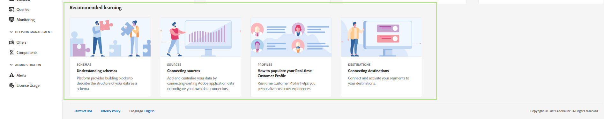

# Handbuch zur Benutzeroberfläche von Adobe Experience Platform

Dieses Handbuch bietet eine Einführung in die Verwendung der Adobe Experience Platform-Benutzeroberfläche, die erklärt, wofür die verschiedenen Komponenten verwendet werden, und Links zu weiteren Dokumentationen mit weiteren Informationen.

Um mehr über Adobe Experience Platform zu erfahren, lesen Sie [Experience Platform – Übersicht](home.md).

## Startbildschirm

Nach der Anmeldung bei Adobe Experience Platform befinden Sie sich auf der [!UICONTROL Startseite] Seite, die aus der [Metriken-Dashboard](#metrics), [aktuelle Daten](#recent-data), und [empfohlenes Lernen](#recommended-learning) Abschnitte.

### Metriken

Das Metriken-Dashboard bietet Karten, in denen Sie Informationen zu Datensätzen, Profilen, Segmenten und Zielen in Ihrer Organisation erhalten.

Die **[!UICONTROL Datensätze]** zeigt die Anzahl der Datensätze in Ihrer Organisation an. Diese Zahl wird aktualisiert, wenn ein neuer Datensatz erstellt wird. Weitere Informationen zu Datensätzen finden Sie im [Datensätze - Übersicht](../catalog/datasets/overview.md).

Die **[!UICONTROL Profile]** zeigt die Gesamtzahl der Personen mit Profilen in Ihrer Organisation, ausgenommen Profilfragmente. Diese Gesamtzahl an Personen stellt die gesamte adressierbare Zielgruppe dar und wird alle 24 Stunden aktualisiert. Weitere Informationen zu Profilen finden Sie im [Übersicht über das Echtzeit-Kundenprofil](../profile/home.md).

Die **[!UICONTROL Segmente]** zeigt die Gesamtzahl der in Ihrem Unternehmen erstellten Segmente an. Diese Zahl wird bei der Erstellung eines neuen Segments aktualisiert. Weitere Informationen zu Segmenten finden Sie im Abschnitt [Übersicht über den Segmentierungsdienst](../segmentation/home.md).

Die **[!UICONTROL Ziele]** zeigt die Gesamtzahl der Ziele an, die für die Organisation erstellt wurden. Diese Zahl wird aktualisiert, wenn ein neues Ziel erstellt wird. Weitere Informationen zu Zielen finden Sie im [Ziele - Übersicht](../destinations/home.md).

### Letzte Daten

Das Daten-Dashboard der letzten Zeit enthält Informationen zu kürzlich erstellten Datensätzen, Quellen, Segmenten und Zielen.

Die **[!UICONTROL Letzte Datensätze]** enthält die fünf zuletzt erstellten Datensätze in Ihrem Unternehmen. Diese Liste wird jedes Mal aktualisiert, wenn ein neuer Datensatz erstellt wird. Sie können einen Datensatz aus der Liste auswählen, um weitere Informationen zum angegebenen Datensatz anzuzeigen, oder **[!UICONTROL Alle anzeigen]** um eine Liste aller erstellten Datensätze anzuzeigen. Weitere Informationen zu Datensätzen finden Sie im [Datensätze - Übersicht](../catalog/datasets/overview.md).

Die **[!UICONTROL Letzte Quellen]** im Abschnitt werden die fünf zuletzt erstellten Quell-Connectoren innerhalb Ihres Unternehmens aufgelistet. Diese Liste wird jedes Mal aktualisiert, wenn ein neuer Quell-Connector erstellt wird. Sie können eine Quellverbindung aus der Liste auswählen, um weitere Informationen zum angegebenen Connector anzuzeigen, oder Sie können **[!UICONTROL Alle anzeigen]** um eine Liste aller erstellten Quellverbindungen anzuzeigen. Weitere Informationen zu Quellen finden Sie im [Quellen - Übersicht](../sources/home.md).

Die **[!UICONTROL Letzte Segmente]** enthält die fünf zuletzt erstellten Segmentdefinitionen in Ihrem Unternehmen. Diese Liste wird jedes Mal aktualisiert, wenn eine neue Segmentdefinition erstellt wird. Sie können eine Segmentdefinition aus der Liste auswählen, um weitere Informationen zur angegebenen Segmentdefinition anzuzeigen, oder Sie können **[!UICONTROL Alle anzeigen]** um eine Liste aller erstellten Segmentdefinitionen anzuzeigen. Weitere Informationen zu Segmenten finden Sie im Abschnitt [Übersicht über den Segmentierungsdienst](../segmentation/home.md).

Die **[!UICONTROL Letzte Ziele]** enthält die fünf Ziele, die Sie in Ihrem Unternehmen zuletzt erstellt haben. Diese Liste wird jedes Mal aktualisiert, wenn ein neues Ziel erstellt wird. Sie können ein Ziel aus der Liste auswählen, um weitere Informationen über das angegebene Ziel anzuzeigen, oder **[!UICONTROL Alle anzeigen]** um eine Liste aller erstellten Ziele anzuzeigen. Weitere Informationen zu Zielen finden Sie im [Ziele - Übersicht](../destinations/home.md).

### Empfohlenes Lernen

Die **[!UICONTROL Empfohlenes Lernen]** enthält Links zur nützlichen Dokumentation für die ersten Schritte mit Adobe Experience Platform.

## Navigationsleiste oben

In der oberen Navigationsleiste der Platform-Benutzeroberfläche wird die Organisation angezeigt, bei der Sie sich derzeit angemeldet haben, und es werden verschiedene wichtige Steuerelemente bereitgestellt.

Auf der linken Seite der Navigationsleiste befindet sich das Adobe Experience Platform-Logo. Wenn Sie dieses Logo jederzeit auswählen, gelangen Sie zurück zum Startbildschirm der Platform-Benutzeroberfläche.

### Organisationswechsel

Das erste Element auf der rechten Seite der oberen Navigationsleiste ist die **Organisationswechsel**.

Wenn Sie den Umschalter auswählen, wird ein Dropdown-Menü mit Organisationen geöffnet, auf die Sie Zugriff haben, sofern verfügbar. Um zu einer anderen Organisation zu wechseln, wählen Sie eine aufgelistete Option aus.

### Wechseln von Anwendungen

Das nächste Element auf der rechten Seite der oberen Navigation ist die **Anwendungsschalter** durch  Symbol. Wenn Sie dieses Symbol auswählen, können Sie zwischen Adobe-Anwendungen, auf die Ihr Unternehmen Zugriff hat, wie Experience Platform, Analytics, Assets und anderen wechseln.

### Hilfe

Rechts neben dem Anwendungsschalter befindet sich der **Hilfe- und Support-Menü**, der durch die  Symbol. Wenn Sie dieses Symbol auswählen, wird ein Popover-Menü mit mehreren Hilfe- und Support-Ressourcen angezeigt. Die **[!UICONTROL Hilfe]** zeigt eine Liste der relevanten Dokumentation für die Seite an, auf der Sie sich gerade befinden. Die **[!UICONTROL Support]** -Tab können Sie ein Support-Ticket beim Adobe-Supportteam erstellen. Die **[!UICONTROL Feedback]** -Tab können Sie Feedback zu Platform an Adobe senden.

### Benachrichtigungen und Ankündigungen

Im **Benachrichtigungsabschnitt**, der durch die  Symbol. Die **[!UICONTROL Benachrichtigungen]** -Tab wichtige Informationen zum Produkt und andere relevante Aktualisierungen anzeigen, während die **[!UICONTROL Mitteilungen]** enthält Informationen zur Serviceverwaltung.

### Benutzerprofil

Das letzte Element auf der oberen Navigationsleiste ist die **Benutzereinstellungen** durch  Symbol. Wählen Sie dieses Symbol aus, um Ihre Voreinstellungen zu bearbeiten oder sich abzumelden.

Sie können zwischen dem hellen und dem dunklen Design für die Platform-Oberfläche wechseln, wobei sich der Schalter direkt unter Ihrem Namen und Ihrer E-Mail befindet. Wählen Sie das gewünschte Design aus.

### Sandboxes

Unmittelbar unterhalb der oberen Navigationsleiste befindet sich die Sandbox-Leiste. Diese Leiste zeigt, welche Sandbox Sie derzeit für Platform verwenden. Weitere Informationen zu Sandboxes finden Sie im [Sandbox-Übersicht](../sandboxes/home.md).

## Linke Navigation {#left-nav}

Im Navigationsbereich auf der linken Bildschirmseite werden alle Dienste aufgelistet, die in der Platform-Benutzeroberfläche unterstützt werden.

Klicken Sie auf das Menüsymbol, um das linke Navigationsfenster ein- oder auszublenden.

Sie können die Navigation in der geöffneten Position sperren, indem Sie nach dem Anzeigen des Bedienfelds erneut auf klicken.

>[!IMPORTANT]
>
>In der linken Navigationsleiste werden nur die Funktionen angezeigt, auf die Sie zugreifen können. In früheren Versionen von Adobe Experience Platform wurden nicht verfügbare Elemente deaktiviert. Wenn Sie glauben, dass Sie Zugriff auf einen Abschnitt haben sollten, der nicht angezeigt wird, wenden Sie sich an Ihren Systemadministrator.

Die **[!UICONTROL Startseite]** -Abschnitt können Sie zur Startseite der Platform-Benutzeroberfläche zurückkehren.

Die **[!UICONTROL Workflows]** zeigt eine Liste mehrstufiger Workflows für die Ausführung von Vorgängen in Platform. Weitere Informationen zu Workflows finden Sie im Abschnitt [Übersicht über Workflows](./workflows.md).

### [!UICONTROL Verbindungen]

Die **[!UICONTROL Quellen]** -Bereich können Sie Quellverbindungen erstellen, aktualisieren und löschen, sodass Sie Daten aus externen Quellen in Platform erfassen können. Weitere Informationen zu Quellen finden Sie im [Quellen - Übersicht](../sources/home.md).

Die **[!UICONTROL Ziele]** -Bereich können Sie Ziele erstellen, aktualisieren und löschen, sodass Sie Daten von Platform an viele externe Ziele exportieren können. Weitere Informationen zu Zielen finden Sie im [Ziele - Übersicht](../destinations/home.md).

### [!UICONTROL Kunde]

Die **[!UICONTROL Profile]** können Sie Kundenprofile durchsuchen, Profilmetriken anzeigen, Zusammenführungsrichtlinien erstellen und verwalten und Vereinigungsschemata anzeigen. Weitere Informationen zur Verwendung des [!UICONTROL Profile] lesen Sie bitte die [[!DNL Profile] Benutzerhandbuch](../profile/ui/user-guide.md). Weitere Informationen zum Echtzeit-Kundenprofil finden Sie im [Übersicht über das Echtzeit-Kundenprofil](../profile/home.md).

Die **[!UICONTROL Segmente]** -Bereich können Sie Segmentdefinitionen erstellen und verwalten. Weitere Informationen zur Verwendung des [!UICONTROL Segmente] lesen Sie bitte die [Benutzerhandbuch zur Segmentierung](../segmentation/ui/overview.md). Weitere Informationen zum Segmentierungsdienst finden Sie im [Übersicht über den Segmentierungsdienst](../segmentation/home.md).

Die **[!UICONTROL Identitäten]** können Sie Identitäts-Namespaces erstellen und verwalten. Weitere Informationen zum [!UICONTROL Identitäten] , einschließlich Informationen zu Identitäts-Namespaces und zur Verwendung von Identitäten in der Platform-Benutzeroberfläche, finden Sie im Abschnitt [Übersicht über Identitäts-Namespace](../identity-service/features/namespaces.md).

### [!UICONTROL Datenschutz]

Die **[!UICONTROL Richtlinien]** können Sie Datennutzungsrichtlinien erstellen und verwalten. Weitere Informationen zur Verwendung des Abschnitts Richtlinien finden Sie im Abschnitt [Benutzerhandbuch zu Datennutzungsrichtlinien](../data-governance/policies/user-guide.md). Weitere Informationen zu Datennutzungsrichtlinien finden Sie im [Datennutzungsrichtlinien - Übersicht](../data-governance/policies/overview.md).

Die **[!UICONTROL Anforderungen]** können Sie Datenschutzanfragen erstellen und verwalten. Beachten Sie, dass Sie auf die Zulassungsliste gesetzt sein müssen, um Zugriff auf die Benutzeroberfläche von Privacy Service zu erhalten. Weitere Informationen zur Verwendung des Abschnitts Anforderungen finden Sie im Abschnitt [Benutzerhandbuch für Privacy Service](../privacy-service/ui/user-guide.md). Weitere Informationen zum Privacy Service finden Sie im [Übersicht über Privacy Service](../privacy-service/home.md).

### [!UICONTROL Datenwissenschaft]

Die **[!UICONTROL Notebooks]** bietet Zugriff auf JupyterLab, eine interaktive Entwicklungsumgebung, in der Sie Ihre Daten untersuchen, analysieren und modellieren können. Weitere Informationen zur Verwendung des Abschnitts Notebooks finden Sie im Abschnitt [JupyterLab-Benutzerhandbuch](../data-science-workspace/jupyterlab/overview.md). Weitere Informationen zu Data Science Workspace finden Sie im [Data Science Workspace - Übersicht](../data-science-workspace/home.md)

Die **[!UICONTROL Modelle]** können Sie maschinelles Lernen und künstliche Intelligenz verwenden, um Modelle zu erstellen, zu entwickeln, zu trainieren und anzupassen, um Prognosen zu erstellen. Weitere Informationen zum Abschnitt Modelle finden Sie im Tutorial zu [Schulung und Auswertung eines Modells](../data-science-workspace/models-recipes/train-evaluate-model-ui.md).

Die **[!UICONTROL Dienste]** können Sie veröffentlichte Modelle für geplante Schulungen und Auswertungen verwalten oder Adobe Intelligent Services verwenden, eine Reihe von KI-Diensten, die Echtzeit-Kundenerlebnisse bieten. Weitere Informationen zum Abschnitt &quot;Dienste&quot;finden Sie im [Tutorial zum Veröffentlichen eines Modells als Dienst](../data-science-workspace/models-recipes/publish-model-service-ui.md).

### [!UICONTROL Data Management]

Die **[!UICONTROL Schemas]** können Sie Experience-Datenmodell (XDM)-Schemas erstellen und verwalten. Weitere Informationen zu Schemata finden Sie im Tutorial zu [Erstellen eines Schemas](../xdm/tutorials/create-schema-ui.md). Weitere Informationen zu XDM finden Sie im [XDM-System - Übersicht](../xdm/home.md).

Die **[!UICONTROL Datensätze]** -Bereich können Sie Datensätze erstellen und verwalten. Weitere Informationen zu Datensätzen finden Sie im [Benutzerhandbuch zu Datensätzen](../catalog/datasets/user-guide.md).

Die **[!UICONTROL Abfragen]** -Abschnitt bietet Ihnen die Möglichkeit, Abfragen zu erstellen und zu verwalten, SQL-Abfragen von Adobe Experience Platform Query Service zu protokollieren und Ihre [!DNL PostgreSQL] Anmeldedaten. Weitere Informationen zu Abfragen finden Sie im Abschnitt [Benutzerhandbuch zu Query Service](../query-service/ui/overview.md).

Die **[!UICONTROL Überwachung]** -Bereich können Sie die Batch- und Streaming-Erfassung überwachen. Weitere Informationen zur Überwachung finden Sie im [Benutzerhandbuch zur Überwachung der Datenerfassung](../ingestion/quality/monitor-data-ingestion.md).

### [!UICONTROL Entscheidungsfindung]

Adobe Journey Optimizer ist ein Anwendungsdienst, der auf Experience Platform basiert. Damit können Sie leistungsstarke Entscheidungstechnologien nutzen, um Ihren Kunden zur richtigen Zeit und an allen Berührungspunkten das beste Angebot und Erlebnis bereitzustellen. Weitere Informationen zu Journey Optimizer, einschließlich der Arbeit mit [!UICONTROL Angebote] und [!UICONTROL Tätigkeiten] Besuch der [Journey Optimizer-Dokumentation](https://experienceleague.adobe.com/docs/journey-optimizer.html?lang=de).

### [!UICONTROL Administration]

Die Platform-Benutzeroberfläche bietet ein Dashboard, über das Sie wichtige Informationen zur Lizenznutzung Ihres Unternehmens anzeigen können, wie sie in einer täglichen Momentaufnahme erfasst werden. Rufen Sie dieses Dashboard auf, indem Sie **[!UICONTROL Lizenzverwendung]** in der Navigation. Weitere Informationen zum Dashboard zur Lizenznutzung finden Sie unter [Dashboard-Handbuch zur Lizenznutzung](./license-usage-and-guardrails/license-usage-dashboard.md).

>[!IMPORTANT]
>
>Die Dashboard-Funktion zur Lizenznutzung befindet sich derzeit in der Alpha-Phase und steht nicht allen Benutzern zur Verfügung. Dokumentation und Funktionalitäten können sich ändern.

## Nächste Schritte

Durch Lesen dieses Handbuchs wurden Sie nun mit der Startseite und den wichtigsten Navigationselementen der Platform-Benutzeroberfläche vertraut gemacht. Weiterführende Informationen zur Arbeit in der Benutzeroberfläche finden Sie in der Dokumentation für jeden einzelnen Platform-Dienst. Links zu dieser Dokumentation finden Sie im Abschnitt [linke Navigation](#left-nav) Abschnitt, der zuvor in diesem Dokument gefunden wurde.
