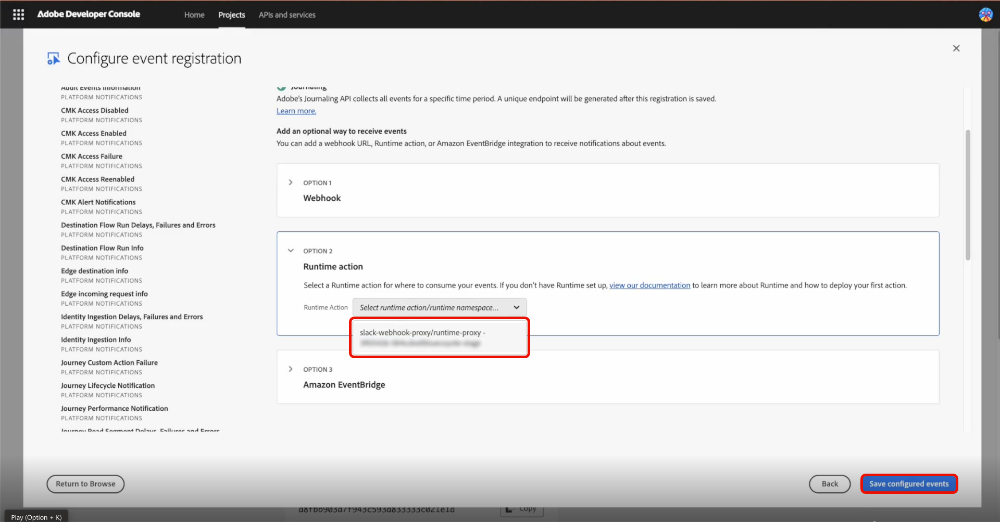

# Slack-Integration für Warnhinweise für Kunden

Mit Adobe Experience Platform können Sie einen Webhook-Proxy für [Adobe App Builder](https://developer.adobe.com/app-builder/docs/get_started/app_builder_get_started/first-app) verwenden, um [Adobe I/O Events](https://developer.adobe.com/events/docs/guides/) in [!DNL Slack] zu erhalten. Der Proxy verarbeitet den Verifizierungs-Handshake von Adobe und wandelt Ereignis-Payloads in [!DNL Slack] um, sodass Sie kundenorientierte Warnhinweise an Ihren Arbeitsbereich senden können.

## Voraussetzungen {#prerequisites}

Bevor Sie beginnen, stellen Sie Folgendes sicher:

* **Adobe Developer Console-Zugriff**: Eine Systemadministrator- oder Entwicklerrolle in einem Unternehmen mit aktiviertem App Builder.
* **Node.js und npm**: Node.js (LTS empfohlen), das npm für die Installation der Adobe-CLI und Projektabhängigkeiten enthält. Weitere Informationen finden Sie unter [Download Node.js](https://nodejs.org/) und [npm - Erste Schritte](https://docs.npmjs.com/getting-started).
* **Adobe I/O CLI**: Installieren Sie Adobe I/O CLI von Ihrem Terminal aus: `npm install -g @adobe/aio-cli`.
* **Slack-App mit eingehendem Webhook**: Eine Slack-App in Ihrem Arbeitsbereich mit aktiviertem **eingehender Webhook**. Siehe [Erstellen einer Slack-App](https://api.slack.com/apps) und das Handbuch [Eingehende Slack-Webhooks](https://api.slack.com/messaging/webhooks), um die App zu erstellen und die Webhook-URL abzurufen (Format: `https://hooks.slack.com/...`).

## Einrichten eines Vorlagenprojekts {#templated-project}

Um ein Vorlagenprojekt einzurichten, melden Sie sich bei Adobe Developer Console an und wählen Sie dann auf der Registerkarte **[!UICONTROL Create project from template]** die Option **[!UICONTROL Home]** aus.


Wählen Sie die **[!UICONTROL App Builder]** Vorlage aus, geben Sie dann einen **[!UICONTROL Project Title]** ein und klicken Sie auf **[!UICONTROL Add workspace]**. Wählen Sie abschließend **[!UICONTROL Save]** aus.


Sie erhalten eine Bestätigung, dass Ihr Projekt erstellt wurde und zur Registerkarte **[!UICONTROL Project overview]** weitergeleitet wird. Von hier aus können Sie eine **[!UICONTROL Project description]** hinzufügen.


## Projekt initialisieren {#initialize-project}

Nachdem Sie Ihr Vorlagenprojekt eingerichtet haben, initialisieren Sie das Projekt.

1. Öffnen Sie Ihr Terminal und geben Sie den folgenden Befehl ein, um sich bei Adobe I/O anzumelden.

   ```bash
   aio login
   ```

1. Initialisieren Sie die Anwendung und geben Sie einen Namen an.

   ```bash
   aio app init slack-webhook-proxy
   ```

1. Wählen Sie Ihren `Organization` mithilfe der Pfeiltasten und anschließend die zuvor in der Developer Console erstellte `Project` aus. Wählen Sie `Only Templates Supported By My Org` für die zu suchenden Vorlagen aus.

   

1. Drücken Sie als Nächstes **Eingabetaste**, um Vorlagen zu überspringen und eine eigenständige Anwendung zu installieren.

   

1. Geben Sie die Adobe I/O-App-Funktionen an, die Sie für dieses Projekt aktivieren möchten. Verwenden Sie die Pfeiltasten, um zu scrollen und `Actions: Deploy Runtime actions` auszuwählen.

   

1. Verwenden Sie die Pfeiltasten, um zu scrollen, und wählen Sie `Adobe Experience Platform: Realtime Customer Profile` für den Typ der Beispielaktionen aus, die Sie erstellen möchten.

   

1. Scrollen Sie und wählen Sie `Pure HTML/JS` für die Benutzeroberfläche aus, die Sie Ihrer Vorlage hinzufügen möchten. Drücken Sie **Eingabe**, um die Beispielaktionen als Standard zu belassen, und drücken Sie dann erneut **Eingabetaste**, um den Namen als Standard zu belassen.

   

   Sie erhalten eine Bestätigung, dass die App-Initialisierung abgeschlossen ist.

1. Navigieren Sie zum Projektverzeichnis.

   ```bash
   cd slack-webhook-proxy
   ```

1. Hinzufügen der Web-Aktion.

   ```bash
   aio app add action
   ```

1. Wählen Sie `Only Action Templates Supported By My Org` aus. Eine Liste von Vorlagen wird angezeigt.

   

1. Wählen Sie die Vorlage aus, indem Sie die Leertaste drücken, und navigieren Sie dann mit den `@adobe/generator-add-publish-events` Pfeilen **Nach oben“ und** Nach unten **zu**. Wählen Sie abschließend die Vorlage aus, indem Sie die **Leertaste** drücken und die **Eingabetaste** drücken.

   

   Eine Bestätigung, dass die `npm package @adobe/generator-add-publish-events` installiert wurde, wird angezeigt.

1. Benennen Sie die Aktion `webhook-proxy`.

   

   Eine Bestätigung, dass die Vorlage installiert wurde, wird angezeigt.

## Erstellen der Dateiaktionen und Bereitstellen {#create-file-actions}

Fügen Sie den Proxy-Code hinzu, legen Sie Umgebungsvariablen fest und stellen Sie dann bereit. Die Aktion steht dann in der Developer Console zur Registrierung zur Verfügung.

### Implementieren des Laufzeitproxys {#runtime-proxy}

>[!NOTE]
>
>Die Signaturüberprüfung und die Verarbeitung von Challenges erfolgen bei Verwendung der Laufzeitaktionsregistrierung automatisch.

Navigieren Sie zum Projektordner und öffnen Sie die `actions/webhook-proxy/index.js`. Löschen Sie den Inhalt und ersetzen Sie durch Folgendes:

```
const fetch = require("node-fetch");
const { Core } = require("@adobe/aio-sdk");
 
/**
 * Adobe I/O Events to Slack Runtime Proxy
 *
 * Receives events from Adobe I/O Events and forwards them to Slack.
 * Signature verification and challenge handling are automatic when
 * using Runtime Action registration (non-web action).
 */
async function main(params) {
  const logger = Core.Logger("runtime-proxy", { level: params.LOG_LEVEL || "info" });
 
  try {
    logger.info(`Event received: ${JSON.stringify(params)}`);
 
    // Forward to Slack
    return forwardToSlack(params, params.SLACK_WEBHOOK_URL, logger);
 
  } catch (error) {
    logger.error(`Error: ${error.message}`);
    return { statusCode: 500, body: { error: "Internal server error" } };
  }
}
 
/**
 * Forwards the event payload to Slack
 */
async function forwardToSlack(payload, webhookUrl, logger) {
  if (!webhookUrl) {
    logger.error("SLACK_WEBHOOK_URL not configured");
    return { statusCode: 500, body: { error: "Server configuration error" } };
  }
 
  // Extract Adobe headers passed to runtime action
  const headers = {
    "x-adobe-event-code": payload["x-adobe-event-code"],
    "x-adobe-event-id": payload["x-adobe-event-id"],
    "x-adobe-provider": payload["x-adobe-provider"]
  };
 
  const slackMessage = buildSlackMessage(payload, headers);
 
  const response = await fetch(webhookUrl, {
    method: "POST",
    headers: { "Content-Type": "application/json" },
    body: JSON.stringify(slackMessage)
  });
 
  if (!response.ok) {
    const errorText = await response.text();
    logger.error(`Slack API error: ${response.status} - ${errorText}`);
    return { statusCode: response.status, body: { error: errorText } };
  }
 
  logger.info("Event forwarded to Slack");
  return { statusCode: 200, body: { success: true } };
}
 
/**
 * Builds a Slack Block Kit message from the event payload
 */
function buildSlackMessage(payload, headers) {
  // Adobe passes event code as x-adobe-event-code header (available in params for runtime actions)
  const eventType = headers["x-adobe-event-code"] ||
                    payload["x-adobe-event-code"] ||
                    payload.event_code ||
                    payload.type ||
                    payload.event_type ||
                    "Adobe Event";
  const eventId = headers["x-adobe-event-id"] || payload["x-adobe-event-id"] || payload.event_id || payload.id || "N/A";
  const eventData = payload.data || payload.event || payload;
 
  return {
    blocks: [
      {
        type: "header",
        text: { type: "plain_text", text: `Event: ${eventType}`, emoji: true }
      },
      {
        type: "section",
        fields: formatDataFields(eventData)
      },
      { type: "divider" },
      {
        type: "context",
        elements: [{
          type: "mrkdwn",
          text: `*Event ID:* ${eventId}  |  *Time:* ${new Date().toISOString()}`
        }]
      }
    ]
  };
}
 
/**
 * Formats event data as Slack mrkdwn fields
 */
function formatDataFields(data, maxFields = 10) {
  if (typeof data !== "object" || data === null) {
    return [{ type: "mrkdwn", text: `*Payload:*\n${String(data)}` }];
  }
 
  const entries = Object.entries(data);
  if (entries.length === 0) {
    return [{ type: "mrkdwn", text: "_No data provided_" }];
  }
 
  return entries.slice(0, maxFields).map(([key, value]) => ({
    type: "mrkdwn",
    text: `*${key}:*\n${typeof value === "object" ? `\`\`\`${JSON.stringify(value)}\`\`\`` : value}`
  }));
}
 
exports.main = main;
```

### Konfigurieren der Aktion in app.config.yaml {#app-config}

>[!IMPORTANT]
>
>Die Aktionskonfiguration in `app.config.yaml` ist wichtig. Sie müssen `web: no` verwenden, um eine Nicht-Web-Aktion zu erstellen, die als Laufzeitaktion in der Developer Console registriert werden kann.

Navigieren Sie zum Projektordner und öffnen Sie `app.config.yaml`. Ersetzen Sie den Inhalt durch Folgendes:

```
application:
  runtimeManifest:
    packages:
      slack-webhook-proxy:
        license: Apache-2.0
        actions:
          webhook-proxy:
            function: actions/webhook-proxy/index.js
            web: no
            runtime: nodejs:22
            inputs:
              LOG_LEVEL: info
              SLACK_WEBHOOK_URL: $SLACK_WEBHOOK_URL
            annotations:
              require-adobe-auth: false
              final: true
```

### Umgebungsvariablen {#environment-variables}

>[!IMPORTANT]
>
>Die Anwendung kann ohne ordnungsgemäß konfigurierte .env-Datei nicht ausgeführt werden.

Verwenden Sie Umgebungsvariablen, um Anmeldeinformationen sicher zu verwalten. Ändern Sie die `.env` Datei im Stammverzeichnis Ihres Projekts und fügen Sie Folgendes hinzu:

```
SLACK_WEBHOOK_URL=https://hooks.slack.com/services/YOUR/WEBHOOK/URL
```

### Aktion bereitstellen {#deploy-action}

Stellen Sie nach dem Festlegen der Umgebungsvariablen die Aktion bereit. Stellen Sie sicher, dass Sie sich im Stammverzeichnis Ihres Projekts (`slack-webhook-proxy`) befinden, wenn Sie diesen Befehl am Terminal ausführen:

```bash
aio app deploy
```

Es wird eine Bestätigung angezeigt, dass die Bereitstellung erfolgreich war.

>[!IMPORTANT]
>
>Ihre Aktion wird in Adobe I/O Runtime bereitgestellt. Die Aktion steht jetzt in der Developer Console zur Registrierung zur Verfügung.

## Registrieren der Aktion bei Adobe I/O Events {#register-events}

Nachdem Ihre Aktion bereitgestellt wurde, registrieren Sie sie als Ziel für Adobe I/O Events.

Öffnen Sie in der Developer Console Ihr App Builder-Projekt und wählen Sie Ihre **[!UICONTROL Workspace]** aus.

Wählen Sie auf der Workspace-Übersichtsseite **[!UICONTROL Add service]** und **[!UICONTROL Event]** aus.


Klicken Sie auf der Seite „Ereignisse hinzufügen“ auf **[!UICONTROL Experience Platform]** und **[!UICONTROL Platform notifications]** und dann auf **[!UICONTROL Next]**.


Wählen Sie die Ereignisse aus, für die Sie Benachrichtigungen erhalten möchten, und klicken Sie dann auf **[!UICONTROL Next]**.


Wählen Sie Ihre Anmeldedaten für die Server-zu-Server-Authentifizierung aus und klicken Sie dann auf **[!UICONTROL Next]**.


Geben Sie einen **[!UICONTROL Event registration name]** und einen leeren **[!UICONTROL Event registration description]** für die Registrierung ein und wählen Sie dann **[!UICONTROL Next]** aus.


Wählen Sie **[!UICONTROL Runtime Action]** als Versandmethode und die von Ihnen erstellte `slack-webhook-proxy/runtime-proxy` aus und klicken Sie dann auf **[!UICONTROL Save configured events]**.



Ihr Webhook-Proxy ist jetzt konfiguriert. Sie kehren zur Webhook-Proxy-Seite zurück. Sie können den gesamten Fluss End-to-End testen, indem Sie auf das **[!UICONTROL Send sample event]** neben einem konfigurierten Ereignis klicken.


