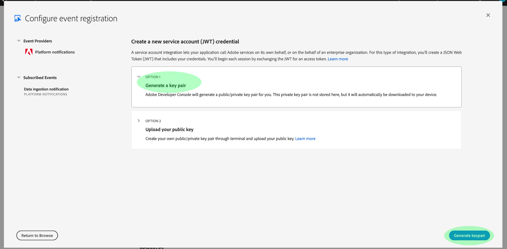

# Adobe I/O-Ereignisbenachrichtigungen abonnieren

[!DNL Observability Insights] ermöglicht Ihnen, Adobe I/O-Ereignisbenachrichtigungen zu Adobe Experience Platform-Aktivitäten zu abonnieren. Diese Ereignisse werden an einen konfigurierten Webhook gesendet, um eine effiziente Automatisierung der Aktivitätsüberwachung zu ermöglichen.

In diesem Dokument wird beschrieben, wie Sie Adobe I/O-Ereignisbenachrichtigungen für Adobe Experience Platform-Dienste abonnieren. Es werden auch Referenzinformationen zu verfügbaren Ereignistypen sowie Links zu weiteren Dokumentationen zur Interpretation der zurückgegebenen Ereignisdaten für jeden entsprechenden [!DNL Platform]-Dienst bereitgestellt.

## Erste Schritte

Dieses Dokument setzt ein Verständnis der Webhooks voraus und wie ein Webhook von einer Anwendung zur anderen verbunden werden kann. Eine Einführung in Webhooks finden Sie in der [[!DNL I/O Events] Dokumentation](https://www.adobe.io/apis/experienceplatform/events/docs.html#!adobedocs/adobeio-events/master/intro/webhook_docs_intro.md) .

## Webhook erstellen

Um [!DNL I/O Event]-Benachrichtigungen zu erhalten, müssen Sie einen Webhook registrieren, indem Sie eine eindeutige Webhook-URL als Teil Ihrer Details zur Ereignisregistrierung angeben.

Sie können Ihren Webhook mit dem Client Ihrer Wahl konfigurieren. Eine temporäre Webhook-Adresse, die im Rahmen dieses Tutorials verwendet werden soll, finden Sie unter [Webhook.site](https://webhook.site/) und kopieren Sie die bereitgestellte eindeutige URL.

Während des anfänglichen Validierungsprozesses sendet [!DNL I/O Events] einen `challenge`-Abfrageparameter in einer GET-Anfrage an den Webhook. Sie müssen Ihren Webhook so konfigurieren, dass der Wert dieses Parameters in der Antwort-Payload zurückgegeben wird. Wenn Sie Webhook.site verwenden, wählen Sie oben rechts **[!DNL Edit]** aus und geben Sie `$request.query.challenge$` unter **[!DNL Response body]** ein, bevor Sie **[!DNL Save]** auswählen.

## Neues Projekt in der Adobe Developer Console erstellen

Wechseln Sie zur [Adobe-Entwicklerkonsole](https://www.adobe.com/go/devs_console_ui) und melden Sie sich mit Ihrer Adobe ID an. Führen Sie anschließend die im Tutorial [Erstellen eines leeren Projekts](https://www.adobe.io/apis/experienceplatform/console/docs.html#!AdobeDocs/adobeio-console/master/projects-empty.md) beschriebenen Schritte in der Dokumentation zur Adobe Developer Console aus.

## Abonnieren von Ereignissen

Nachdem Sie ein neues Projekt erstellt haben, navigieren Sie zum Übersichtsbildschirm dieses Projekts. Wählen Sie hier **[!UICONTROL Ereignis hinzufügen]** aus.

Es wird ein Dialogfeld angezeigt, in dem Sie einen Ereignisanbieter zu Ihrem Projekt hinzufügen können:

* Wenn Sie Warnhinweise für Experience Platformen abonnieren, wählen Sie **[!UICONTROL Plattformbenachrichtigungen]** aus.
* Wenn Sie Adobe Experience Platform [!DNL Privacy Service]-Benachrichtigungen abonnieren, wählen Sie **[!UICONTROL Privacy Service-Ereignisse]** aus.

Nachdem Sie einen Ereignisanbieter ausgewählt haben, wählen Sie **[!UICONTROL Weiter]** aus.

Im nächsten Bildschirm wird eine Liste der Ereignistypen angezeigt, die abonniert werden sollen. Wählen Sie die Ereignisse aus, die Sie abonnieren möchten, und klicken Sie dann auf **[!UICONTROL Weiter]**.

>[!NOTE]
>
>Wenn Sie sich nicht sicher sind, bei welchen Ereignissen Sie sich für den Dienst anmelden möchten, lesen Sie die dienstspezifische Benachrichtigungsdokumentation:
>
>* [[!DNL Privacy Service] Benachrichtigungen](../../privacy-service/privacy-events.md)
* [[!DNL Data Ingestion] Benachrichtigungen](../../ingestion/quality/subscribe-events.md)
* [[!DNL Flow Service (sources)] Benachrichtigungen](../../sources/notifications.md)

Im nächsten Bildschirm werden Sie aufgefordert, ein JSON-Web-Token (JWT) zu erstellen. Sie erhalten die Möglichkeit, automatisch ein Schlüsselpaar zu generieren oder Ihren eigenen öffentlichen Schlüssel hochzuladen, der im Terminal generiert wurde.

Für die Zwecke dieses Tutorials wird die erste Option verwendet. Wählen Sie das Optionsfeld für **[!UICONTROL Generate a key pair]** aus und wählen Sie dann unten rechts die Schaltfläche **[!UICONTROL Generate keypair]** .

Wenn das Schlüsselpaar generiert wird, wird es automatisch vom Browser heruntergeladen. Sie müssen diese Datei selbst speichern, da sie nicht in der Developer Console beibehalten wird.

Im nächsten Bildschirm können Sie die Details des neu generierten Schlüsselpaars überprüfen. Klicken Sie auf **[!UICONTROL Weiter]**, um fortzufahren.

Geben Sie im nächsten Bildschirm im Abschnitt [!UICONTROL Details zur Ereignisregistrierung] einen Namen und eine Beschreibung für die Ereignisregistrierung ein. Es empfiehlt sich, einen eindeutigen, leicht identifizierbaren Namen zu erstellen, um die Registrierung dieses Ereignisses von anderen im selben Projekt zu unterscheiden.

Im selben Bildschirm unter dem Abschnitt [!UICONTROL Ereignisempfang] können Sie optional konfigurieren, wie Ereignisse empfangen werden. **** Webhookermöglicht es Ihnen, eine benutzerdefinierte Webhook-Adresse für den Empfang von Ereignissen anzugeben, während  **[!UICONTROL Runtime-]** Aktionen dies mit  [Adobe I/O Runtime](https://www.adobe.io/apis/experienceplatform/runtime/docs.html) ermöglichen.

Wählen Sie für dieses Tutorial **[!UICONTROL Webhook]** aus und geben Sie die URL des zuvor erstellten Webhooks an. Nachdem Sie fertig sind, wählen Sie **[!UICONTROL Konfigurierte Ereignisse speichern]** aus, um die Ereignisregistrierung abzuschließen.

Die Detailseite für die neu erstellte Ereignisregistrierung wird angezeigt. Dort können Sie die Konfiguration bearbeiten, die empfangenen Ereignisse überprüfen, die Debugging-Verfolgung durchführen und neue Ereignisanbieter hinzufügen.

## Nächste Schritte

In diesem Tutorial haben Sie einen Webhook registriert, um [!DNL I/O Event] Benachrichtigungen für [!DNL Experience Platform] und/oder [!DNL Privacy Service] zu erhalten. Weitere Informationen zu verfügbaren Ereignissen und zur Interpretation der Benachrichtigungs-Payloads für jeden Dienst finden Sie in der folgenden Dokumentation:

* [[!DNL Privacy Service] Benachrichtigungen](../../privacy-service/privacy-events.md)
* [[!DNL Data Ingestion] Benachrichtigungen](../../ingestion/quality/subscribe-events.md)
* [[!DNL Flow Service] (Quellen) Benachrichtigungen](../../sources/notifications.md)

Weitere Informationen dazu, wie Sie Ihre Aktivitäten auf [!DNL Experience Platform] und [!DNL Privacy Service] überwachen können, finden Sie unter [[!DNL Observability Insights] overview](../home.md) .
