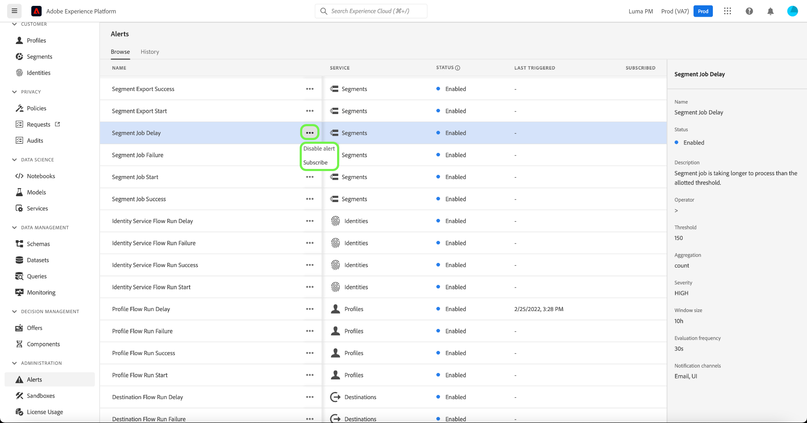

# Handbuch zur Warnhinweis-Benutzeroberfläche

In der Adobe Experience Platform-Benutzeroberfläche können Sie einen Verlauf der empfangenen Warnungen anhand von Metriken anzeigen, die von Adobe Experience Platform Observability Insights bereitgestellt wurden. Über die Benutzeroberfläche können Sie auch verfügbare Warnhinweisregeln anzeigen, aktivieren, deaktivieren und abonnieren.

>[!NOTE]
>
>Eine Einführung in Warnhinweise in Experience Platform finden Sie unter [Warnhinweise – Übersicht](./overview.md).

Wählen Sie zunächst im linken Navigationsbereich **[!UICONTROL Warnhinweise]** aus.

![Warnhinweise - Seitenhervorhebung [!UICONTROL Warnhinweise] in der linken Navigation.](../images/alerts/ui/workspace.png)

## Verwalten von Warnhinweisregeln

Auf der Registerkarte **[!UICONTROL Durchsuchen]** werden die verfügbaren Regeln aufgelistet, die einen Warnhinweis auslösen können.

![Eine Liste der verfügbaren Warnhinweise wird im [!UICONTROL Durchsuchen] Registerkarte.](../images/alerts/ui/rules.png)

Wählen Sie eine Regel aus der Liste aus, um ihre Beschreibung und ihre Konfigurationsparameter in der rechten Leiste anzuzeigen, einschließlich Schwellenwert und Schweregrad.

Wählen Sie auf die Auslassungspunkte (**...**) neben dem Namen einer Regel klicken, zeigt eine Dropdown-Liste die Steuerelemente zum Aktivieren oder Deaktivieren des Warnhinweises (je nach seinem aktuellen Status) und zum Abonnieren oder Abbestellen von E-Mail-Benachrichtigungen für den Warnhinweis.

## Warnhinweis-Abonnenten verwalten

>[!NOTE]
>
> Um eine Warnung einer Adobe-Benutzer-ID, einer externen E-Mail-Adresse oder einer E-Mail-Gruppenliste zuzuweisen, müssen Sie Administrator sein.

Auf der Registerkarte **[!UICONTROL Durchsuchen]** werden die verfügbaren Regeln aufgelistet, die einen Warnhinweis auslösen können.

![Eine Liste der verfügbaren Regeln für Warnhinweise, die im Abschnitt [!UICONTROL Durchsuchen] Registerkarte.](../images/alerts/ui/rules.png)

Wählen Sie die Auslassungszeichen (**...**) neben dem Namen einer Regel angezeigt, werden in einer Dropdown-Liste Steuerelemente angezeigt. Auswählen **[!UICONTROL Warnhinweis-Abonnenten verwalten]**.

![Wählen Sie die Ellipsen aus, um das Dropdownmenü anzuzeigen. Die [!UICONTROL Warnhinweis-Abonnenten verwalten] -Option markiert ist.](../images/alerts/ui/manage-alert-subscribers.png)

Die [!UICONTROL Warnhinweis-Abonnenten verwalten] angezeigt. Um Benachrichtigungen bestimmten Benutzern zuzuweisen, geben Sie ihre Adobe-Benutzer-ID, ihre externe E-Mail-Adresse oder eine E-Mail-Gruppenliste ein und drücken Sie die Eingabetaste.

>[!NOTE]
>
>Um diese Benachrichtigung gleichzeitig an mehrere Benutzer zu senden, geben Sie eine Liste mit Benutzer-IDs oder E-Mail-Adressen getrennt durch Kommas an.

Die E-Mail-Adressen werden in der Liste der aktuellen Abonnenten angezeigt. Wählen Sie **[!UICONTROL Aktualisieren]** aus.

![Auf der Seite zum Verwalten von Warnhinweis-Abonnenten werden Abonnenten und [!UICONTROL Aktualisieren].](../images/alerts/ui/manage-alert-subscribers-added-email.png)

Sie haben Ihrer Benachrichtigungsliste erfolgreich Benutzer hinzugefügt. Die gesendeten Benutzer erhalten jetzt E-Mail-Benachrichtigungen zu diesem Warnhinweis, wie in der Abbildung unten dargestellt.

## Aktivieren von E-Mail-Warnungen

Warnhinweise können direkt an Ihre E-Mail gesendet werden.

Wählen Sie das Glockensymbol () im oberen Band auf der rechten Seite, um Benachrichtigungen und Mitteilungen anzuzeigen. Wählen Sie im angezeigten Dropdown-Menü das Zahnradsymbol (), um auf die Experience Cloud-Voreinstellungsseite zuzugreifen.

Die **Profil** angezeigt. Wählen Sie die **[!UICONTROL Benachrichtigungen]** im linken Navigationsbereich, um auf die Voreinstellungen für E-Mail-Warnungen zuzugreifen.

![Profilattribute - [!UICONTROL Benachrichtigungen] in der linken Navigation.](../images/alerts/ui/profile.png)

Scrollen Sie zum **E-Mails** im unteren Bereich der Seite und wählen Sie **[!UICONTROL Sofortige Benachrichtigungen]**

Alle Warnungen, die Sie abonniert haben, werden jetzt an die E-Mail-Adresse gesendet, die mit Ihrem Adobe ID-Konto verbunden ist.

## Anzeigen des Warnhinweisverlaufs

Die Registerkarte **[!UICONTROL Verlauf]** zeigt den Verlauf der empfangenen Warnhinweise für Ihre Organisation, einschließlich der Regel, die den jeweiligen Warnhinweis ausgelöst hat, des Auslösedatums und ggf. des Auflösungsdatums.

![Eine Liste der empfangenen Warnungen wird im [!UICONTROL Geschichte] Registerkarte.](../images/alerts/ui/history.png)

Wenn Sie einen aufgelisteten Warnhinweis auswählen, werden weitere Details in der rechten Leiste angezeigt, einschließlich einer kurzen Zusammenfassung des Ereignisses, das den Warnhinweis ausgelöst hat.

## Nächste Schritte

Dieses Dokument bietet eine Übersicht darüber, wie Warnhinweise in der Platform-Benutzeroberfläche angezeigt und verwaltet werden. Weitere Informationen zu den Funktionen dieses Services finden Sie in der Übersicht zu [Observability Insights](../home.md).
