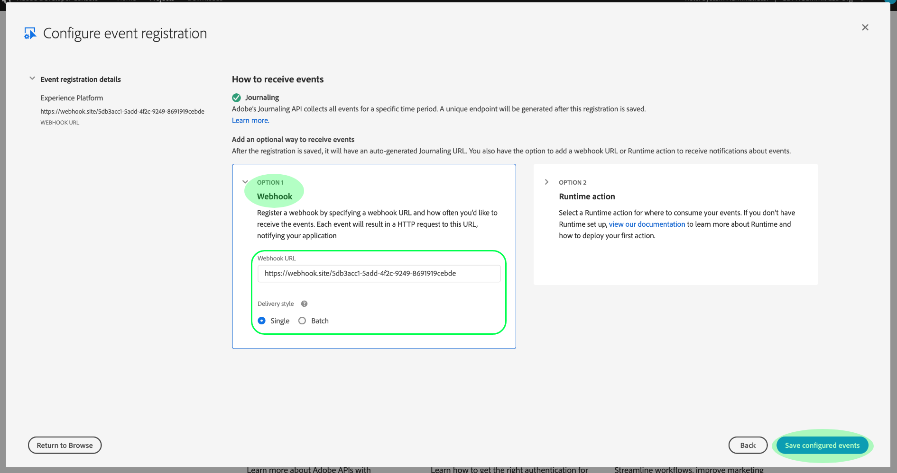

# Adobe I/O-Ereignis-Benachrichtigungen abonnieren

[!DNL Observability Insights] können Sie Adobe I/O-Ereignis-Benachrichtigungen zu Adobe Experience Platform-Aktivitäten abonnieren. Diese Ereignis werden an einen konfigurierten Webshaken gesendet, um eine effiziente Automatisierung der Aktivität-Überwachung zu ermöglichen.

In diesem Dokument wird beschrieben, wie Sie Adobe I/O-Ereignis-Benachrichtigungen für Adobe Experience Platform-Dienste abonnieren. Es werden auch Referenzinformationen zu verfügbaren Ereignistypen sowie Links zu weiteren Dokumentationen zur Interpretation der zurückgegebenen Ereignis-Daten für jeden einzelnen [!DNL Platform] Dienst bereitgestellt.

## Erste Schritte

Dieses Dokument erfordert ein funktionierendes Verständnis von Webhooks und wie ein Webhaken von einer Anwendung zur anderen verbunden werden kann. Eine Einführung in Webhooks finden Sie in der [[!DNL I/O Events] Dokumentation](https://www.adobe.io/apis/experienceplatform/events/docs.html#!adobedocs/adobeio-events/master/intro/webhook_docs_intro.md) .

## Erstellen eines Webhofs

Um [!DNL I/O Event] Benachrichtigungen zu erhalten, müssen Sie einen Webshaken registrieren, indem Sie im Rahmen Ihrer Ereignis-Registrierungsdetails eine eindeutige Webshaken-URL angeben.

Sie können Ihren Webshaken mit dem Client Ihrer Wahl konfigurieren. Für eine temporäre Webhosting-Adresse, die im Rahmen dieses Lernprogramms verwendet werden soll, besuchen Sie [WebHook.site](https://webhook.site/) und kopieren Sie die angegebene eindeutige URL.

Während des anfänglichen Validierungsprozesses [!DNL I/O Events] sendet ein Parameter der `challenge` Abfrage in einer GET an den Webshaken. Sie müssen Ihren Webshaken so konfigurieren, dass der Wert dieses Parameters in der Antwortnutzlast zurückgegeben wird. Wenn Sie WebHook.site verwenden, wählen Sie **[!DNL Edit]** oben rechts aus und geben Sie dann `$request.query.challenge$` unter ein, **[!DNL Response body]** bevor Sie **[!DNL Save]** auswählen.

## Neues Projekt in der Adobe Developer Console erstellen

Go to [Adobe Developer Console](https://www.adobe.com/go/devs_console_ui_de) and sign in with your Adobe ID. Führen Sie anschließend die im Lernprogramm zum [Erstellen eines leeren Projekts](https://www.adobe.io/apis/experienceplatform/console/docs.html#!AdobeDocs/adobeio-console/master/projects-empty.md) in der Dokumentation zur Adobe Developer Console beschriebenen Schritte aus.

## Ereignisse abonnieren

Nachdem Sie ein neues Projekt erstellt haben, navigieren Sie zum Übersichtsbildschirm dieses Projekts. Wählen Sie von hier **[!UICONTROL Hinzufügen Ereignis]**.

Es wird ein Dialogfeld angezeigt, in dem Sie einen Ereignis Provider zu Ihrem Projekt hinzufügen können:

* Wenn Sie [!DNL Experience Platform] Benachrichtigungen abonnieren, wählen Sie **[!UICONTROL Plattformbenachrichtigungen aus.]**
* Wenn Sie Adobe Experience Platform- [!DNL Privacy Service] Benachrichtigungen abonnieren, wählen Sie **[!UICONTROL Privacy Service-Ereignis]**

Wählen Sie nach Auswahl eines Ereignis-Providers die Option **[!UICONTROL Weiter]**.

Im nächsten Bildschirm wird eine Liste von Ereignistypen angezeigt, die abonniert werden sollen. Wählen Sie die Ereignis aus, die Sie abonnieren möchten, und wählen Sie dann **[!UICONTROL Weiter]**.

>[!NOTE]
>
>Wenn Sie nicht sicher sind, welche Ereignis für den Dienst, mit dem Sie arbeiten, abonniert werden sollen, lesen Sie die dienstspezifische Benachrichtigungsdokumentation:
>
>* [[!DNL Privacy Service] Benachrichtigungen](../../privacy-service/privacy-events.md)
>* [[!DNL Data Ingestion] Benachrichtigungen](../../ingestion/quality/subscribe-events.md)
>* [[!DNL Flow Service (sources)] Benachrichtigungen](../../sources/notifications.md)

Im nächsten Bildschirm werden Sie aufgefordert, ein JSON-WebToken (JWT) zu erstellen. Sie haben die Möglichkeit, automatisch ein Schlüsselpaar zu erstellen oder einen eigenen öffentlichen Schlüssel hochzuladen, der im Terminal generiert wurde.

Für diese Übung wird die erste Option verwendet. Wählen Sie das Optionsfeld für ein **[!UICONTROL Schlüsselpaar]** erstellen und klicken Sie dann unten rechts auf die Schaltfläche &quot; **[!UICONTROL Generate keypair]** &quot;.

Wenn das Schlüsselpaar generiert wird, wird es automatisch vom Browser heruntergeladen. Sie müssen diese Datei selbst speichern, da sie nicht in der Developer Console beibehalten wird.

Im nächsten Bildschirm können Sie die Details des neu generierten Schlüsselpaars überprüfen. Select **[!UICONTROL Next]** to continue.

Geben Sie im nächsten Bildschirm im Abschnitt mit den Registrierungsdetails des [!UICONTROL Ereignisses einen Namen und eine Beschreibung für die Registrierung des Ereignisses ein] . Best Practice ist, einen eindeutigen, leicht identifizierbaren Namen zu erstellen, um diese Ereignis-Registrierung von anderen im selben Projekt zu unterscheiden.

Weiter unten auf dem gleichen Bildschirm unter dem Abschnitt [!UICONTROL So erhalten Sie Ereignis] können optional konfigurieren, wie Ereignis empfangen werden. **[!UICONTROL Mit WebHook]** können Sie eine benutzerdefinierte Webhook-Adresse für den Empfang von Ereignissen angeben, während die **[!UICONTROL Laufzeitaktion]** es Ihnen ermöglicht, dasselbe mit [Adobe I/O Runtime](https://www.adobe.io/apis/experienceplatform/runtime/docs.html)zu tun.

Wählen Sie für dieses Lernprogramm &quot; **[!UICONTROL WebHook]** &quot;und geben Sie die URL des zuvor erstellten Webhofs ein. Wenn Sie fertig sind, wählen Sie **[!UICONTROL Konfigurierte Ereignis]** speichern, um die Ereignis-Registrierung abzuschließen.

Die Detailseite für die neu erstellte Ereignis-Registrierung wird angezeigt, auf der Sie die Konfiguration bearbeiten, die empfangenen Ereignis überprüfen, die Debugging-Verfolgung durchführen und neue Ereignis-Provider hinzufügen können.

## Nächste Schritte

Mit diesem Tutorial haben Sie sich für den Erhalt von [!DNL I/O Event] Benachrichtigungen für [!DNL Experience Platform] und/oder [!DNL Privacy Service]einen Webhook registriert. Weitere Informationen zu verfügbaren Ereignissen und zur Interpretation der Benachrichtigungs-Nutzlasten für jeden Dienst finden Sie in der folgenden Dokumentation:

* [[!DNL Privacy Service] Benachrichtigungen](../../privacy-service/privacy-events.md)
* [[!DNL Data Ingestion] Benachrichtigungen](../../ingestion/quality/subscribe-events.md)
* [[!DNL Flow Service (sources)] Benachrichtigungen](../../sources/notifications.md)

Weitere Informationen dazu, wie Sie Ihre Aktivitäten überwachen können, finden Sie in der [[!DNL Observability Insights] Übersicht](../home.md) [!DNL Experience Platform] [!DNL Privacy Service].