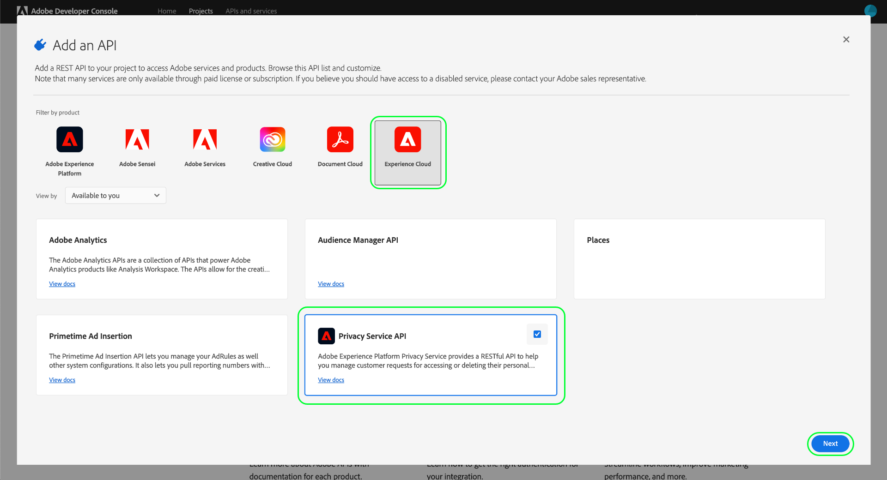

# Authentifizierung und Zugriff auf die Privacy Service-API

Dieses Handbuch bietet eine Einführung in die wichtigsten Konzepte, die Sie kennen müssen, bevor Sie Aufrufe an die Adobe Experience Platform Privacy Service-API durchführen.

## Voraussetzungen {#prerequisites}

Dieses Handbuch setzt ein Grundverständnis von [Privacy Service](../home.md) voraus und erläutert, wie Sie damit Zugriffs- und Löschanfragen von betroffenen Personen (Kunden) in allen Adobe Experience Cloud-Programmen verwalten können.

Um Zugriffsberechtigungen für die API zu erstellen, muss ein Administrator in Ihrem Unternehmen zuvor Produktprofile für Privacy Service in Adobe Admin Console eingerichtet haben. Das Produktprofil, das Sie einer API-Integration zuweisen, bestimmt, welche Berechtigungen diese Integration beim Zugriff auf Privacy Service-Funktionen hat. Weitere Informationen finden Sie im Handbuch [Verwalten ](../permissions.md) Privacy Service-Berechtigungen“.

## Sammeln von Werten für erforderliche Kopfzeilen {#gather-values-required-headers}

Um die Privacy Service-API aufzurufen, müssen Sie zunächst Ihre Zugangsdaten erfassen, damit sie in den erforderlichen Kopfzeilen verwendet werden können:

* `Authorization: Bearer {ACCESS_TOKEN}`
* `x-api-key: {API_KEY}`
* `x-gw-ims-org-id: {ORG_ID}`

Diese Werte werden mit [Adobe Developer Console](https://developer.adobe.com/console) generiert. Ihre `{ORG_ID}` und `{API_KEY}` müssen nur einmal generiert werden und können in zukünftigen API-Aufrufen wiederverwendet werden. Ihre `{ACCESS_TOKEN}` ist jedoch temporär und muss alle 24 Stunden neu generiert werden.

Die Schritte zum Generieren dieser Werte werden im Folgenden detailliert beschrieben.

### Einmalige Einrichtung {#one-time-setup}

Wechseln Sie zur [Adobe-Entwicklerkonsole](https://developer.adobe.com/console) und melden Sie sich mit Ihrer Adobe ID an. Führen Sie anschließend die im Tutorial [Erstellen eines leeren Projekts](https://developer.adobe.com/developer-console/docs/guides/projects/projects-empty/) in der Dokumentation zur Entwicklerkonsole beschriebenen Schritte aus.

Nachdem Sie ein neues Projekt erstellt haben, wählen Sie **[!UICONTROL Zum Projekt hinzufügen]** und wählen Sie **[!UICONTROL API]** aus dem Dropdown-Menü aus.

![Die API-Option, die aus der Dropdown[!UICONTROL Liste Zu Projekt hinzufügen] auf der Seite mit den Projektdetails in Developer Console ausgewählt wird](../images/api/getting-started/add-api-button.png)

#### Privacy Service-API auswählen {#select-privacy-service-api}

Der Bildschirm **[!UICONTROL API hinzufügen]** wird angezeigt. Wählen Sie **[!UICONTROL Experience Cloud]** aus, um die Liste der verfügbaren APIs einzugrenzen, und wählen Sie dann die Karte für **[!UICONTROL Privacy Service API]** aus, bevor Sie auf **[!UICONTROL Weiter]** klicken.

>[!TIP]
>
>Wählen Sie die Option **[!UICONTROL Dokumente anzeigen]**, um in einem separaten Browserfenster zur vollständigen [Privacy Service API-Referenzdokumentation zu navigieren](https://developer.adobe.com/experience-platform-apis/references/privacy-service/).

Wählen Sie als Nächstes den Authentifizierungstyp aus, um Zugriffstoken zu generieren und auf die Privacy Service-API zuzugreifen.

>[!IMPORTANT]
>
>Wählen Sie die **[!UICONTROL OAuth Server-zu-Server]**-Methode aus, da dies in Zukunft die einzige unterstützte Methode ist. Die Methode **[!UICONTROL Service-Konto (JWT]** ist veraltet. Während Integrationen, die die JWT-Authentifizierungsmethode verwenden, bis zum 1. Januar 2025 weiterhin funktionieren, empfiehlt Adobe dringend, vorhandene Integrationen vor diesem Datum zu der neuen OAuth-Server-zu-Server-Methode zu migrieren. Weitere Informationen finden Sie im Abschnitt [!BADGE Veraltet]{type=negative}[Generieren eines JSON Web Token (JWT)](/help/landing/api-authentication.md#jwt).

#### Zuweisen von Berechtigungen über Produktprofile {#product-profiles}

Der letzte Konfigurationsschritt besteht darin, die Produktprofile auszuwählen, von denen diese Integration die Berechtigungen erbt. Wenn Sie mehr als ein Profil auswählen, werden dessen Berechtigungssätze für die Integration kombiniert.

>[!NOTE]
>
Produktprofile und die granularen Berechtigungen, die sie bereitstellen, werden von Administratoren über Adobe Admin Console erstellt und verwaltet. Weitere Informationen finden Sie im Handbuch zu [Privacy Service](../permissions.md)Berechtigungen.

Klicken Sie abschließend auf **[!UICONTROL Konfigurierte API speichern]**.

Nachdem die API zum Projekt hinzugefügt wurde, werden auf der Seite **[!UICONTROL Privacy Service-API]** für das Projekt die folgenden Anmeldeinformationen angezeigt, die für alle Aufrufe an Privacy Service-APIs erforderlich sind:

* `{API_KEY}` ([!UICONTROL Client ID])
* `{ORG_ID}` ([!UICONTROL Organization ID])

### Authentifizierung für jede Sitzung {#authentication-each-session}

Die letzten erforderlichen Anmeldeinformationen, die Sie erfassen müssen, sind Ihre `{ACCESS_TOKEN}`, die in der Autorisierungskopfzeile verwendet werden. Im Gegensatz zu den Werten für `{API_KEY}` und `{ORG_ID}` muss alle 24 Stunden ein neues Token generiert werden, um die API weiter verwenden zu können.

Im Allgemeinen gibt es zwei Methoden zum Generieren eines Zugriffs-Tokens:

* [Token manuell generieren](#manual-token) zum Testen und Entwickeln.
* [Automatisieren der Token-](#auto-token) für API-Integrationen.

#### Manuelles Generieren eines Tokens {#manual-token}

Um ein neues `{ACCESS_TOKEN}` manuell zu generieren, navigieren Sie zu **[!UICONTROL Anmeldeinformationen]** > **[!UICONTROL OAuth Server-zu-Server]** und wählen Sie **[!UICONTROL Zugriffstoken generieren]** aus, wie unten dargestellt.

Es wird ein neues Zugriffs-Token generiert und eine Schaltfläche zum Kopieren des Tokens in die Zwischenablage bereitgestellt. Dieser Wert wird für den erforderlichen [!DNL Authorization]-Header verwendet und muss im Format `Bearer {ACCESS_TOKEN}` angegeben werden.

#### Token-Generierung automatisieren {#auto-token}

Sie können auch eine Postman-Umgebung und -Sammlung verwenden, um Zugriffs-Token zu generieren. Weitere Informationen finden Sie im Abschnitt über [Verwendung von Postman zum Authentifizieren und Testen von API](/help/landing/api-authentication.md#use-postman)Aufrufen im Authentifizierungshandbuch zur Experience Platform-API.

## Lesen von Beispiel-API-Aufrufen {#read-sample-api-calls}

Jedes Endpunkt-Handbuch enthält Beispiel-API-Aufrufe, um zu demonstrieren, wie Sie Ihre Anfragen formatieren. Dazu gehören Pfade, erforderliche Kopfzeilen und ordnungsgemäß formatierte Anfrage-Payloads. Außerdem wird ein Beispiel für eine von der API im JSON-Format zurückgegebene Antwort bereitgestellt. Informationen zu den Konventionen, die in der Dokumentation für Beispiel-API-Aufrufe verwendet werden, finden Sie im Abschnitt zum [Lesen von Beispiel-API-Aufrufen](../../landing/api-guide.md#sample-api) in den Ersten Schritten für Experience Platform-APIs.

## Nächste Schritte {#next-steps}

Nachdem Sie nun wissen, welche Kopfzeilen zu verwenden sind, können Sie erste Aufrufe an die Privacy Service-API stellen. Wählen Sie zunächst eines der Handbücher zu den Endpunkten aus:

* [Datenschutzaufträge](./privacy-jobs.md)
* [Einverständnis](./consent.md)
