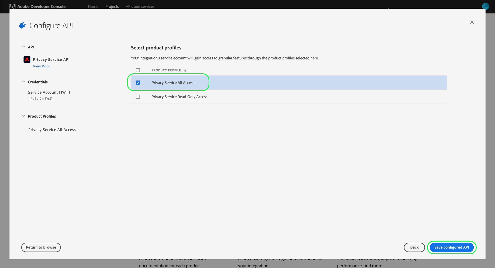

# Authentifizierung und Zugriff auf die Privacy Service-API

Dieses Handbuch bietet eine Einführung in die wichtigsten Konzepte, die Sie kennen müssen, bevor Sie Aufrufe an die Adobe Experience Platform Privacy Service-API durchführen.

## Voraussetzungen {#prerequisites}

Dieses Handbuch setzt ein Verständnis der [Privacy Service](../home.md) und wie Sie damit Zugriffs- und Löschanfragen Ihrer Datensubjekte (Kunden) in allen Adobe Experience Cloud-Anwendungen verwalten können.

Um Zugriffsberechtigungen für die API zu erstellen, muss ein Administrator in Ihrem Unternehmen zuvor Produktprofile für den Privacy Service in Adobe Admin Console eingerichtet haben. Das Produktprofil, das Sie einer API-Integration zuweisen, bestimmt, welche Berechtigungen diese Integration beim Zugriff auf Privacy Service-Funktionen besitzt. Siehe Handbuch unter [Verwalten von Privacy Service-Berechtigungen](../permissions.md) für weitere Informationen.

## Sammeln von Werten für erforderliche Kopfzeilen {#gather-values-required-headers}

Um die Privacy Service-API aufrufen zu können, müssen Sie zunächst Ihre Zugriffsberechtigungen erfassen, damit sie in den erforderlichen Kopfzeilen verwendet werden können:

* `Authorization: Bearer {ACCESS_TOKEN}`
* `x-api-key: {API_KEY}`
* `x-gw-ims-org-id: {ORG_ID}`

Diese Werte werden mithilfe von [Adobe Developer-Konsole](https://developer.adobe.com/console). Ihre `{ORG_ID}` und `{API_KEY}` muss nur einmal generiert werden und kann in zukünftigen API-Aufrufen wiederverwendet werden. Allerdings muss Ihre `{ACCESS_TOKEN}` ist temporär und muss alle 24 Stunden neu generiert werden.

Die Schritte zum Generieren dieser Werte werden im Folgenden detailliert beschrieben.

### Einmalige Einrichtung {#one-time-setup}

Wechseln Sie zur [Adobe-Entwicklerkonsole](https://developer.adobe.com/console) und melden Sie sich mit Ihrer Adobe ID an. Führen Sie anschließend die im Tutorial [Erstellen eines leeren Projekts](https://developer.adobe.com/developer-console/docs/guides/projects/projects-empty/) in der Dokumentation zur Entwicklerkonsole beschriebenen Schritte aus.

Nachdem Sie ein neues Projekt erstellt haben, wählen Sie **[!UICONTROL Zum Projekt hinzufügen]** und wählen **[!UICONTROL API]** aus dem Dropdown-Menü aus.

![Die API-Option, die im [!UICONTROL Zum Projekt hinzufügen] Dropdown-Liste auf der Seite mit den Projektdetails in der Developer Console](../images/api/getting-started/add-api-button.png)

#### Privacy Service-API auswählen {#select-privacy-service-api}

Der Bildschirm **[!UICONTROL API hinzufügen]** wird angezeigt. Auswählen **[!UICONTROL Experience Cloud]** , um die Liste der verfügbaren APIs einzuschränken, wählen Sie dann die Karte für **[!UICONTROL Privacy Service-API]** vor der Auswahl **[!UICONTROL Nächste]**.

>[!TIP]
>
>Wählen Sie die **[!UICONTROL Dokumente anzeigen]** -Option, um in einem separaten Browserfenster zum Abschluss zu navigieren [Referenzdokumentation zur Privacy Service-API](https://developer.adobe.com/experience-platform-apis/references/privacy-service/).

Wählen Sie anschließend den Authentifizierungstyp aus, um Zugriffstoken zu generieren und auf die Privacy Service-API zuzugreifen.

>[!IMPORTANT]
>
>Wählen Sie die **[!UICONTROL OAuth Server-zu-Server]** -Methode, da dies künftig die einzige unterstützte Methode sein wird. Die **[!UICONTROL Dienstkonto (JWT)]** -Methode veraltet ist. Während Integrationen, die die JWT-Authentifizierungsmethode verwenden, bis zum 1. Januar 2025 weiterhin funktionieren, empfiehlt Adobe dringend, vorhandene Integrationen vor diesem Datum auf die neue OAuth Server-zu-Server-Methode zu migrieren. Weitere Informationen finden Sie im Abschnitt . [!BADGE Veraltet]{type=negative}[JSON-Web-Token (JWT) generieren](/help/landing/api-authentication.md#jwt).

#### Berechtigungen über Produktprofile zuweisen {#product-profiles}

Der letzte Konfigurationsschritt besteht darin, die Produktprofile auszuwählen, von denen diese Integration ihre Berechtigungen erbt. Wenn Sie mehr als ein Profil auswählen, werden die zugehörigen Berechtigungssätze für die Integration kombiniert.

>[!NOTE]
>
Produktprofile und die granularen Berechtigungen, die sie bereitstellen, werden von Administratoren über Adobe Admin Console erstellt und verwaltet. Siehe Handbuch unter [Berechtigungen für Privacy Service](../permissions.md) für weitere Informationen.

Wählen Sie zum Abschluss **[!UICONTROL Konfigurierte API speichern]**.

Nachdem die API zum Projekt hinzugefügt wurde, wird die **[!UICONTROL Privacy Service-API]** -Seite für das Projekt werden die folgenden Anmeldeinformationen angezeigt, die für alle Aufrufe an Privacy Service-APIs erforderlich sind:

* `{API_KEY}` ([!UICONTROL Client-ID])
* `{ORG_ID}` ([!UICONTROL Organisations-ID])

### Authentifizierung für jede Sitzung {#authentication-each-session}

Die letzte erforderliche Berechtigung, die Sie erfassen müssen, ist Ihre `{ACCESS_TOKEN}`, der in der Autorisierungskopfzeile verwendet wird. Im Gegensatz zu den Werten für `{API_KEY}` und `{ORG_ID}`muss ein neues Token alle 24 Stunden generiert werden, damit Sie die API weiterhin verwenden können.

Im Allgemeinen gibt es zwei Methoden zum Generieren eines Zugriffstokens:

* [Manuelles Generieren des Tokens](#manual-token) für Tests und Entwicklung.
* [Token-Generierung automatisieren](#auto-token) für API-Integrationen.

#### Manuelles Generieren eines Tokens {#manual-token}

So generieren Sie manuell eine neue `{ACCESS_TOKEN}`, navigieren Sie zu **[!UICONTROL Anmeldeinformationen]** > **[!UICONTROL OAuth Server-zu-Server]** und wählen **[!UICONTROL Zugriffstoken generieren]**, wie unten dargestellt.

Es wird ein neues Zugriffs-Token generiert und eine Schaltfläche zum Kopieren des Tokens in die Zwischenablage bereitgestellt. Dieser Wert wird für den erforderlichen [!DNL Authorization]-Header verwendet und muss im Format `Bearer {ACCESS_TOKEN}` angegeben werden.

#### Token-Generierung automatisieren {#auto-token}

Sie können auch eine Postman-Umgebung und -Sammlung verwenden, um Zugriffstoken zu generieren. Weitere Informationen finden Sie im Abschnitt zu [Verwenden von Postman zum Authentifizieren und Testen von API-Aufrufen](/help/landing/api-authentication.md#use-postman) im Authentifizierungshandbuch für die Experience Platform-API.

## Lesen von Beispiel-API-Aufrufen {#read-sample-api-calls}

Jedes Endpunkthandbuch enthält Beispiel-API-Aufrufe, die zeigen, wie Sie Ihre Anfragen formatieren. Dazu gehören Pfade, erforderliche Kopfzeilen und ordnungsgemäß formatierte Anfrage-Payloads. Außerdem wird ein Beispiel für eine von der API im JSON-Format zurückgegebene Antwort bereitgestellt. Informationen zu den Konventionen, die in der Dokumentation für Beispiel-API-Aufrufe verwendet werden, finden Sie im Abschnitt zum [Lesen von Beispiel-API-Aufrufen](../../landing/api-guide.md#sample-api) in den Ersten Schritten für Platform-APIs.

## Nächste Schritte {#next-steps}

Nachdem Sie nun wissen, welche Kopfzeilen zu verwenden sind, können Sie erste Aufrufe an die Privacy Service-API stellen. Wählen Sie eine der Endpunktleitfäden für die ersten Schritte aus:

* [Datenschutzaufträge](./privacy-jobs.md)
* [Einverständnis](./consent.md)
