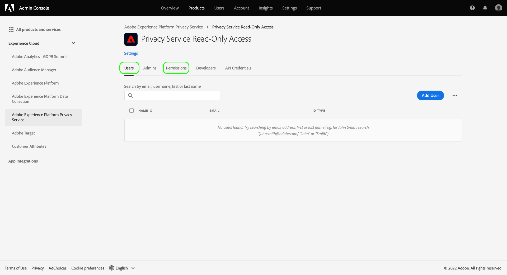

# Verwalten der Berechtigungen für den Privacy Service

>[!IMPORTANT]
>
>Die Berechtigungen für Adobe Experience Platform Privacy Service wurden verbessert, um die Granularität zu erhöhen. Diese Änderungen ermöglichen es Organisationsadmins, mehr Benutzenden Zugriff mit der gewünschten Rollen- und Berechtigungsebene zu gewähren.Benutzende mit technischen Konten müssen ihre Privacy Service-Berechtigungen aktualisieren, da diese bevorstehende Aktualisierung für sie eine wesentliche Änderung darstellt. Die Durchsetzung dieser Berechtigungsänderung erfolgt in **13. April 2023**. Weitere Informationen finden Sie in der Dokumentation unter [Migration von Legacy-API-Anmeldeinformationen](#migrate-tech-accounts) für Anleitungen zur Lösung dieses Problems.
>
>Technische Konten stehen Unternehmenskunden zur Verfügung und werden über die Adobe Developers Console erstellt. Die Adobe ID des Inhabenden eines technischen Kontos endet auf `@techacct.adobe.com`. Wenden Sie sich an Ihren Organisationsadmin, wenn Sie sich nicht sicher sind, ob Sie über ein technisches Konto verfügen.

Der Zugriff auf den [Adobe Experience Platform Privacy Service](./home.md) wird über granulare rollenbasierte Berechtigungen in der Adobe Admin Console gesteuert. Durch die Erstellung von Produktprofilen, die Gruppen von Benutzern Berechtigungen zuweisen, können Sie festlegen, wer auf welche Funktionen in der Privacy Service-[Benutzeroberfläche](./ui/overview.md) und der -[API](./api/overview.md) Zugriff hat.

>[!NOTE]
>
>Wenn Sie eine Integration für die Privacy Service-API erstellen, müssen Sie ein bestehendes Produktprofil auswählen, um zu bestimmen, für welche Funktionen oder Aktionen diese Integration Berechtigungen hat. Weitere Informationen finden Sie im Handbuch [Erste Schritte mit der Privacy Service-API](./api/getting-started.md).

Dieses Handbuch zeigt Ihnen, wie Sie die Berechtigungen für den Privacy Service verwalten.

## Erste Schritte

Um die Zugriffssteuerung für den Privacy Service zu konfigurieren, müssen Sie über Administratorrechte für eine Organisation verfügen, die über eine Produktintegration mit dem Adobe Experience Platform Privacy Service verfügt. Die Mindestrolle, die Berechtigungen erteilen oder entziehen kann, ist ein **Produktprofiladministrator**. Andere Administratorrollen, die Berechtigungen verwalten können, sind **Produktadministratoren** (kann alle Profile innerhalb eines Produkts verwalten) und **Systemadministratoren** (keine Einschränkungen). Weitere Informationen finden Sie im Artikel über [Administrationsrollen](https://helpx.adobe.com/de/enterprise/using/admin-roles.html) im Adobe Unternehmens-Administrationshandbuch.

In dieser Anleitung wird davon ausgegangen, dass Sie mit den grundlegenden Konzepten der Admin Console vertraut sind, z. B. mit Produktprofilen und damit, wie Sie einzelnen Benutzern und Gruppen Produktberechtigungen erteilen. Weitere Informationen finden Sie im [Benutzerhandbuch für die Admin Console](https://helpx.adobe.com/de/enterprise/using/admin-console.html).

## Verfügbare Berechtigungen

In der folgenden Tabelle finden Sie eine Übersicht über die verfügbaren Berechtigungen für den Privacy Service mit Beschreibungen der spezifischen Funktionen, auf die sie Zugriff gewähren:

>[!NOTE]
>
>Alle Privacy Service und [!UICONTROL Opt-out aus dem Verkauf] -Berechtigungen sind voneinander getrennt und voneinander ohne funktionale Überschneidung. Dies ist möglich, da die Privacy Service-API als idempotent betrachtet wird.

| Kategorie | Berechtigung | Beschreibung |
| --- | --- | --- |
| [!UICONTROL Privacy Service-Berechtigungen] | [!UICONTROL Datenschutz – Leseberechtigung] | Legt fest, ob Benutzende bestehende Zugriffs- und Löschanträge sowie deren Details einsehen können. |
| [!UICONTROL Privacy Service-Berechtigungen] | [!UICONTROL Datenschutz – Schreibberechtigung] | Legt fest, ob Benutzende neue Zugangs- und Löschanträge erstellen können. |
| [!UICONTROL Privacy Service-Berechtigungen] | [!UICONTROL Berechtigung zum Lesen (Zugriff) der Inhaltsbereitstellung] | Wenn eine Zugriffsanfrage vom Privacy Service verarbeitet wird, wird eine ZIP-Datei mit den Kundendaten an diesen Kunden gesendet. Wenn Sie sich die Details einer Zugriffsanfrage ansehen, bestimmt diese Berechtigung, ob die Benutzenden auf den Download-Link für die ZIP-Datei der Anfrage zugreifen können. |
| [!UICONTROL Opt-out von Verkaufsberechtigungen] | [!UICONTROL Leseberechtigung – Opt-out vom Verkauf] | Legt fest, ob Benutzende bestehende Opt-out-Anträge zusammen mit ihren Details einsehen können. |
| [!UICONTROL Opt-out von Verkaufsberechtigungen] | [!UICONTROL Schreibberechtigung – Opt-out vom Verkauf] | Legt fest, ob Benutzende neue Opt-out-Kaufanfragen erstellen können. |

{style="table-layout:auto"}

## Verwalten von Berechtigungen {#manage}

Um die Berechtigungen für den Privacy Service zu verwalten, melden Sie sich bei [Admin Console](https://adminconsole.adobe.com/) an und wählen Sie **[!UICONTROL Produkte]** in der oberen Navigationsleiste. Wählen Sie von hier aus **[!UICONTROL Adobe Experience Platform Privacy Service]**.

### Auswählen oder Erstellen eines Produktprofils

Auf dem nächsten Bildschirm sehen Sie eine Liste der verfügbaren Produktprofile für Privacy Service unter Ihrer Organisation. Wenn keine Produktprofile vorhanden sind, wählen Sie **[!UICONTROL Neues Profil]**, um eines zu erstellen. Wenn Sie in Ihrer Organisation mehrere Rollen oder Benutzergruppen haben, die unterschiedliche Zugriffsrechte benötigen, sollten Sie für jede dieser Gruppen ein eigenes Produktprofil erstellen.

Nachdem Sie ein Produktprofil ausgewählt haben, können Sie auf der Registerkarte **[!UICONTROL Berechtigungen]** mit der [Bearbeitung der Berechtigungen](#edit-permissions) für das Profil beginnen oder auf der Registerkarte **[!UICONTROL Benutzer]** mit der [Zuweisung von Benutzern](#assign-users) für das Profil beginnen.

### Bearbeiten der Berechtigungen für das Profil {#edit-permissions}

Wählen Sie auf der Registerkarte **[!UICONTROL Berechtigungen]** eine der angezeigten Berechtigungskategorien aus, um die Ansicht zur Bearbeitung von Berechtigungen aufzurufen.

Wenn Sie die Berechtigungen für ein Profil bearbeiten, werden die verfügbaren Berechtigungen in der linken Spalte aufgelistet, während diejenigen, die im Profil enthalten sind, in der rechten Spalte aufgeführt werden. Wählen Sie die aufgelisteten Berechtigungen aus, um sie zwischen den beiden Spalten zu verschieben.

Berechtigungen sind in Kategorien unterteilt. Um zwischen Kategorien zu wechseln, wählen Sie die gewünschte Kategorie in der linken Navigationsleiste.

![Bild, das den Abschnitt [!UICONTROL Opt-out vom Verkauf] unter „Berechtigungen“ zeigt](./images/permissions/switch-category.png)

Wählen Sie **[!UICONTROL Speichern]**, sobald Sie die Konfiguration der Berechtigungen abgeschlossen haben.

Die Ansicht des Produktprofils wird mit den hinzugefügten Berechtigungen wieder angezeigt.

### Zuweisen von Benutzern zum Profil {#assign-users}

Um dem Produktprofil Benutzer zuzuweisen (und ihnen die konfigurierten Berechtigungen des Profils zu gewähren), wählen Sie die Registerkarte **[!UICONTROL Benutzer]**, gefolgt von **[!UICONTROL Benutzer hinzufügen]**.

Weitere Informationen zur Verwaltung von Benutzern für ein Produktprofil finden Sie in der [Dokumentation zu Admin Console](https://helpx.adobe.com/de/enterprise/using/manage-product-profiles.html).

### Migrieren von Legacy-API-Anmeldeinformationen zum Profil {#migrate-tech-accounts}

>[!NOTE]
>
>Dieser Abschnitt gilt nur für bestehende API-Anmeldeinformationen, die erstellt wurden, bevor die Privacy Service-Berechtigungen in Adobe Admin Console integriert wurden. Für neue Anmeldeinformationen werden Produktprofile (und deren Berechtigungen) stattdessen über [Adobe Developer Console-Projekte](https://developer.adobe.com/developer-console/docs/guides/projects/) zugewiesen.  Weitere Informationen finden Sie im Abschnitt [Zuweisung von Produktprofilen zu einem Projekt](./api/getting-started.md#product-profiles) im Handbuch zu den ersten Schritten mit der Privacy Service-API.

Zuvor benötigten technische Konten kein Produktprofil für die Integration und Berechtigungen. Aufgrund kürzlich verbesserter Privacy Service-Berechtigungen ist es jetzt jedoch erforderlich, ältere API-Anmeldeinformationen in das Produktprofil zu migrieren. Diese Aktualisierung ermöglicht die Erteilung detaillierter Berechtigungen an technische Kontoinhaber. Gehen Sie wie folgt vor, um die technischen Kontoberechtigungen für Privacy Service zu aktualisieren.

#### Aktualisieren der technischen Kontoberechtigungen {#update-tech-account-permissions}

Der erste Schritt bei der Zuweisung eines Berechtigungssatzes für Ihr technisches Konto besteht darin, zur [Adobe Admin Console](https://adminconsole.adobe.com/) und erstellen Sie ein neues Produktprofil für den Privacy Service.

Wählen Sie in der Admin Console-Benutzeroberfläche die Option **Produkte** aus der Navigationsleiste, gefolgt von **[!UICONTROL Experience Cloud]** und **[!UICONTROL Adobe Experience Platform Privacy Service]** in der linken Seitenleiste. Die [!UICONTROL Produktprofile] angezeigt. Auswählen **Neues Profil** , um ein neues Produktprofil für den Privacy Service zu erstellen.

Die [!UICONTROL Neues Produktprofil erstellen] angezeigt. Umfassende Anweisungen zum Erstellen eines Produktprofils finden Sie im Abschnitt [UI-Handbuch zum Erstellen von Profilen](../access-control/ui/create-profile.md).

Nachdem Sie Ihr neues Produktprofil gespeichert haben, navigieren Sie zum [Adobe Developer-Konsole](https://developer.adobe.com/console/home) und melden Sie sich bei diesem Produkt oder Projekt an. Auswählen **[!UICONTROL Projekte]** aus der oberen Navigation, gefolgt von der Karte für Ihr Projekt.

>[!NOTE]
>
>Möglicherweise müssen Sie Ihren Cache löschen und/oder einige Zeit warten, bis das neue Projekt in Ihrer Liste der Entwicklerkonsole-Projekte angezeigt wird.

Nachdem Sie sich bei Ihrem Projekt angemeldet haben, wählen Sie die **[!UICONTROL Privacy Service-API]** Integration über die linke Seitenleiste.

Das Dashboard zur Privacy Service-API-Integration wird angezeigt. Über dieses Dashboard können Sie das mit diesem Projekt verknüpfte Produktprofil bearbeiten. Auswählen **[!UICONTROL Bearbeiten von Produktprofilen]** , um den Prozess zu starten. Die [!UICONTROL API konfigurieren] angezeigt.

Die [!UICONTROL API konfigurieren] zeigt die verfügbaren Produktprofile an, die derzeit im Dienst vorhanden sind. Sie korrelieren mit den in der Admin Console erstellten Produktprofilen. Aktivieren Sie in der Admin Console in der Liste der verfügbaren Produktprofile das Kontrollkästchen für das neue Produktprofil, das Sie für das technische Konto erstellt haben. Dadurch wird dieses technische Konto automatisch mit den Berechtigungen im ausgewählten Produktprofil verknüpft. Auswählen **[!UICONTROL Konfigurierte API speichern]** um Ihre Einstellungen zu bestätigen.

>[!NOTE]
>
>Wenn bereits ein technisches Konto mit einem Produktprofil verknüpft ist, wird bereits eines der Kontrollkästchen in der Liste der verfügbaren Produktprofile ausgewählt.

#### Validieren Sie, ob Ihre Einstellungen angewendet wurden. {#confirm-applied-settings}

Um zu bestätigen, dass Ihre Einstellungen auf das Konto angewendet wurden. Kehren Sie zu [Admin Console](https://adminconsole.adobe.com/) und navigieren Sie zu Ihrem neu erstellten Produktprofil. Wählen Sie die **[!UICONTROL API-Anmeldeinformationen]** um eine Liste der verknüpften Projekte anzuzeigen. Das Projekt, das in der Developer Console verwendet wird, wo Sie das Produktprofil dem technischen Konto zugewiesen haben, wird in der Liste der Anmeldeinformationen angezeigt. Der Name jeder API-Berechtigung besteht aus dem Projektnamen mit einer zufällig generierten Zahl, die an das Ende angehängt wird. Wählen Sie eine Berechtigung aus, um die [!UICONTROL Details] Bereich.

Die [!UICONTROL Details] enthält Informationen zu den API-Anmeldedaten, einschließlich der zugehörigen technischen ID, des API-Schlüssels, des Erstellungsdatums und des Datums der letzten Änderung sowie der zugehörigen Adobe Products.

## Nächste Schritte

In diesem Handbuch wurden die verfügbaren Berechtigungen für Privacy Service und deren Verwaltung durch Admin Console behandelt.

Anweisungen zum Erstellen einer neuen API-Integration nach der Einrichtung von Produktprofilen finden Sie im [Handbuch zu den ersten Schritten mit der Privacy Service-API](./api/getting-started.md). Weitere Informationen zur Verwaltung von Berechtigungen für andere Funktionen der Adobe Experience Platform finden Sie in der [Dokumentation zur Zugriffssteuerung](../access-control/home.md).
