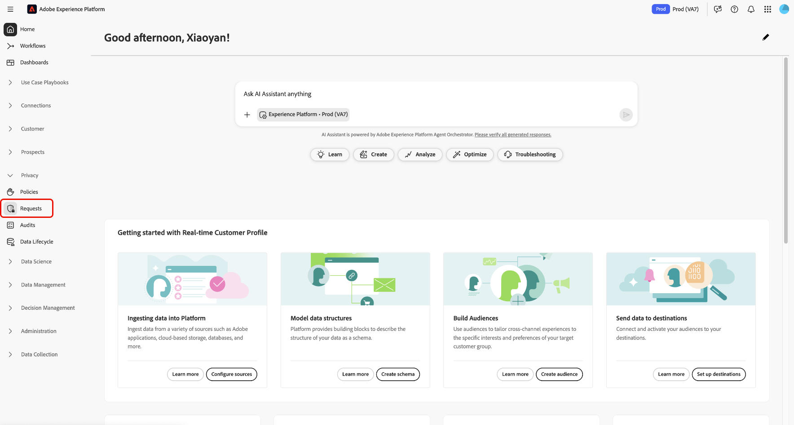

# [!DNL Privacy Service] Benutzeroberfläche – Übersicht {#privacy-ui-guide}

>[!CONTEXTUALHELP]
>id="platform_privacy_privacyconsole_requests"
>title="Anfragen durch betroffene Personen"
>abstract="Dieses Widget zeigt die Anzahl der gesendeten und abgeschlossenen Anfragen durch betroffene Personen an, die an einem bestimmten Tag von Privacy Service verarbeitet wurden. Weitere Informationen zu Ihren Privacy Service-Prozessen finden Sie in der linken Navigationsleiste unter **Anfragen**."

Die Privacy Service-Benutzeroberfläche [!DNL Privacy Service] ermöglicht die Koordinierung von Datenschutz- und Compliance-Anfragen über verschiedene Adobe Experience Cloud-Anwendungen hinweg.

>[!NOTE]
>
>Informationen zum programmgesteuerten Verwalten von Compliance-Anfragen mithilfe der Privacy Service-API finden Sie in der [Handbuch zur Privacy Service-API](../api/overview.md). Siehe Dokument Nr. [Verwalten von Privacy Service-Berechtigungen](../permissions.md) für weitere Informationen.

## Melden Sie sich bei [!DNL Privacy Service] Benutzeroberfläche

>[!IMPORTANT]
>
>Sie müssen über eine Adobe ID verfügen, um sich bei der [!DNL Privacy Service] Benutzeroberfläche.

Um auf die Benutzeroberfläche zuzugreifen, melden Sie sich bei [Adobe Experience Cloud](https://experience.adobe.com/) und wählen **[!UICONTROL Datenschutz-Benutzeroberfläche]** unter dem Schnellzugriffsmenü.

### Anmelden von [!DNL Experience Platform]

Wenn Sie Zugriff auf die Adobe Experience Platform-Benutzeroberfläche haben, können Sie auch auf die [!DNL Privacy Service] Benutzeroberfläche durch **[!UICONTROL Anforderungen]** im linken Navigationsbereich.

## Nächste Schritte

Nachdem Sie sich erfolgreich angemeldet haben, lesen Sie bitte den Abschnitt [Benutzerhandbuch](user-guide.md) für die Schritte zur Durchführung verschiedener Vorgänge mit dem [!DNL Privacy Service] Benutzeroberfläche.
