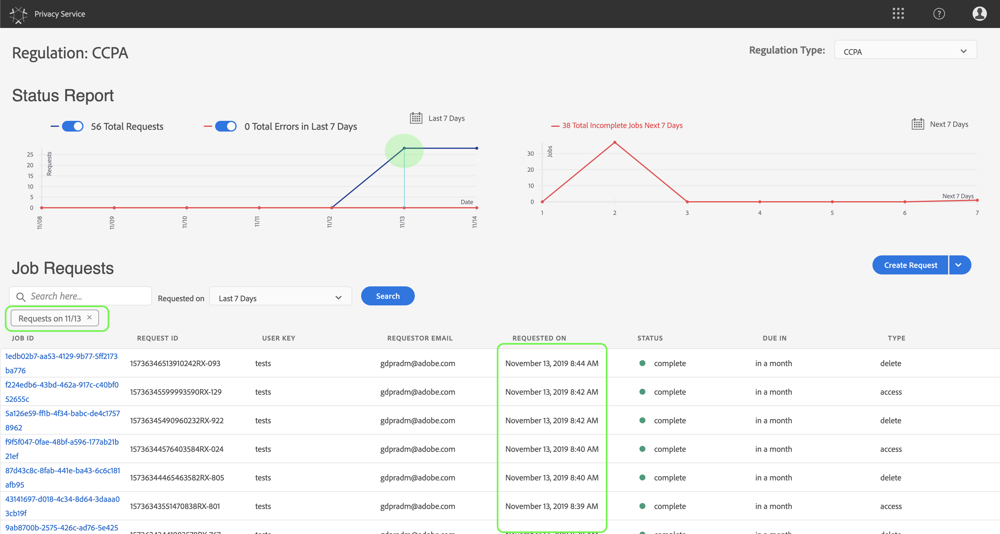

# Benutzerhandbuch zum Datenschutzdienst

In diesem Dokument werden Schritte zum Erstellen und Verwalten von Datenschutzanforderungen mithilfe der Benutzeroberfläche des Datenschutzdienstes beschrieben.

## Dashboard der Benutzeroberfläche des Datenschutzdienstes

Das Dashboard für die Benutzeroberfläche des Datenschutzdienstes enthält zwei Widgets, mit denen Sie den Status Ihrer Datenschutzaufträge Ansicht haben: **Statusbericht** und **Auftragsanforderungen**. Das Dashboard zeigt auch die aktuell ausgewählte Regel für die angezeigten Aufträge an.

### Regeltyp

Der Datenschutzdienst unterstützt Auftragsanforderungen für zwei Regeltypen:

* Die Allgemeine Datenschutzverordnung
* The California Consumer Privacy Act (CCPA).

Aufträge für jeden Regelungstyp werden separat verfolgt. Um zwischen Regelungstypen zu wechseln, klicken Sie auf das Dropdown-Menü **Regelungstyp** und wählen Sie die gewünschte Regelart aus der Liste aus.

Beim Ändern des Regeltyps wird das Dashboard aktualisiert, um alle Vorgänge, Filter, Widgets und Dialoge zur Schaffung von Arbeitsplätzen anzuzeigen, die für die ausgewählte Regel gelten.

### Statusbericht

Das Diagramm auf der linken Seite des Statusbericht-Widgets verfolgt gesendete Aufträge mit allen Aufträgen, die möglicherweise mit Fehlern zurückgemeldet wurden. Das Diagramm auf der rechten Seite verfolgt Aufträge, die sich am Ende des 30-Tage-Compliance-Fensters befinden.

Klicken Sie auf eine der beiden Schaltflächen über dem Diagramm, um die jeweiligen Metriken ein- oder auszublenden.

Sie können die exakte Anzahl der Aufträge, die mit einem Datenpunkt auf den Diagrammen verbunden sind, durch Bewegen der Maus über den betreffenden Datenpunkt Ansicht werden.

Um weitere Details zu einem bestimmten Datenpunkt Ansicht, klicken Sie auf den betreffenden Datenpunkt, um die zugehörigen Aufträge im Widget &quot;Auftragsanforderungen&quot;anzuzeigen. Beachten Sie den Filter, der direkt über der Auftrags-Liste angewendet wird.

>[!NOTE] Wenn ein Filter auf das Widget &quot;Auftragsanforderungen&quot;angewendet wurde, können Sie den Filter entfernen, indem Sie auf das **X** in der Filtertablette klicken. Auftragsanforderungen kehren dann zur standardmäßigen Tracking-Liste zurück.

### Auftragsanforderungen

Das Widget &quot;Auftragsanforderungen&quot;Liste alle in Ihrem Unternehmen verfügbaren Auftragsanforderungen, einschließlich Angaben zum Anforderungstyp, aktuellen Status, Fälligkeitsdatum und E-Mail-Anfrage.

>[!NOTE] Die Daten für zuvor erstellte Aufträge sind erst 30 Tage nach dem Abschlussdatum verfügbar.

Sie können die Liste filtern, indem Sie Suchbegriffe in die Suchleiste unterhalb des Titels &quot;Auftragsanforderungen&quot;eingeben. Die Liste wird beim Eingeben automatisch Filter und zeigt Anforderungen mit Werten an, die mit Ihren Suchbegriffen übereinstimmen. Sie können auch im Dropdown-Menü &quot; **Angefordert am** &quot;einen Zeitraum für die aufgelisteten Aufträge auswählen.

Um die Details einer bestimmten Auftragsanforderung Ansicht, klicken Sie in der Liste auf die Auftrags-ID der Anforderung, um die Seite &quot; *Auftragsdetails* &quot;zu öffnen.

Dieses Dialogfeld enthält Statusinformationen zu den einzelnen Experience Cloud-Lösungen und ihren aktuellen Status im Verhältnis zum Gesamtauftrag. Da jeder Datenschutzauftrag asynchron ausgeführt wird, zeigt die Seite das aktuelle Kommunikationsdatum und die aktuelle Uhrzeit (GMT) jeder Lösung an, da einige mehr Zeit benötigen als andere, um die Anforderung zu verarbeiten.

Wenn eine Lösung zusätzliche Daten bereitgestellt hat, ist sie in diesem Dialogfeld sichtbar. Sie können diese Daten durch Klicken auf die einzelnen Produktzeilen Ansicht.

Um die vollständigen Auftragsdaten als CSV-Datei herunterzuladen, klicken Sie oben rechts im Dialogfeld auf &quot;In CSV **** exportieren&quot;.

## Neue Datenschutzauftragsanforderung erstellen

Die Benutzeroberfläche des Datenschutzdienstes bietet zwei Methoden zum Erstellen neuer Auftragsanforderungen:

* Anforderungs-Builder verwenden
* JSON-Datei hochladen

Die Schritte zur Verwendung dieser Methoden sind in den folgenden Abschnitten beschrieben.

### Anforderungs-Builder verwenden

Mit dem Anforderungs-Builder können Sie in der Benutzeroberfläche manuell eine neue Datenschutzauftragsanforderung erstellen. Der Anforderungs-Builder eignet sich am besten für einfachere und kleinere Anforderungsgruppen, da der Anforderungs-Builder die Anforderungen auf den ID-Typ pro Benutzer beschränkt. Bei komplizierteren Anforderungen ist es möglicherweise besser, stattdessen eine JSON-Datei [hochzuladen](#upload-a-json-file) .

Um Beginn mit dem Anforderungs-Builder zu verwenden, klicken Sie auf Anforderung **erstellen** unter dem Statusbericht-Widget auf der rechten Seite des Bildschirms.

Das Dialogfeld Anforderung *erstellen* wird geöffnet und zeigt die verfügbaren Optionen zum Senden einer Anforderung zum Schutz der Privatsphäre für den derzeit ausgewählten Regeltyp an.

Wählen Sie den **Auftragstyp** der Anforderung (&quot;Löschen&quot;oder &quot;Zugriff&quot;) und eines oder mehrere verfügbare **Produkte** aus der Liste. Wählen Sie unter **Kunden-IDs** einen ID-Typ aus dem Dropdown-Menü (E-Mail, ECID oder AAID). Geben Sie die ID-Werte in das Textfeld rechts ein und drücken Sie **\&lt;enter>** für jede ID, um sie der Liste hinzuzufügen.

Die in dieser Liste enthaltenen IDs erhalten eine Kopie aller E-Mail-Benachrichtigungen des Datenschutzdienstes, die gesendet werden, wenn ein Auftrag abgeschlossen, mit Fehlern abgeschlossen oder eine Zeitüberschreitung aufgetreten ist. Klicken Sie abschließend auf **Erstellen**.

Das Dialogfeld wird ausgeblendet und der neue Auftrag (oder die neuen Aufträge) wird zusammen mit dem aktuellen Verarbeitungsstatus im Widget &quot;Auftragsanforderungen&quot;aufgeführt.

### JSON-Datei hochladen

Wenn Sie komplexere Anforderungen erstellen, z. B. Anforderungen, die mehrere ID-Typen für jede verarbeitete Person verwenden, können Sie eine Anforderung erstellen, indem Sie eine JSON-Datei hochladen.

Klicken Sie auf den Pfeil neben Anforderung **erstellen**, unter dem Statusbericht-Widget auf der rechten Seite des Bildschirms. Wählen Sie in der Liste der angezeigten Optionen die Option JSON **hochladen**.

Das Dialogfeld &quot;JSON ** hochladen&quot;wird angezeigt. Es wird ein Fenster angezeigt, in das Sie die JSON-Datei per Drag &amp; Drop verschieben können.

Wenn Sie keine JSON-Datei zum Hochladen haben, klicken Sie auf &quot;Adobe-GDPR-Request.json **** herunterladen&quot;, um eine Vorlage herunterzuladen, die Sie entsprechend den Werten füllen können, die Sie von Ihren betroffenen Personen gesammelt haben.

Suchen Sie die JSON-Datei auf Ihrem Computer und ziehen Sie sie in das Dialogfeld. Wenn der Upload erfolgreich war, wird der Dateiname im Dialogfeld angezeigt. Sie können bei Bedarf weitere JSON-Dateien hinzufügen, indem Sie sie in das Dialogfeld ziehen und dort ablegen.

Klicken Sie abschließend auf **Erstellen**. Das Dialogfeld wird ausgeblendet und der neue Auftrag (oder die neuen Aufträge) wird zusammen mit dem aktuellen Verarbeitungsstatus im Widget &quot; _Auftragsanforderungen_ &quot;aufgeführt.

### Nächste Schritte

Durch Lesen dieses Dokuments haben Sie gelernt, wie Sie mithilfe der Benutzeroberfläche des Datenschutzdienstes einen Datenschutzauftrag erstellen, die Details eines Auftrags Ansicht geben und dessen Verarbeitungsstatus überwachen und die Ergebnisse nach Abschluss des Vorgangs herunterladen können.

Anweisungen zum programmgesteuerten Ausführen dieser Vorgänge mit der Datenschutzdienst-API finden Sie im [Entwicklerhandbuch](../api/getting-started.md).