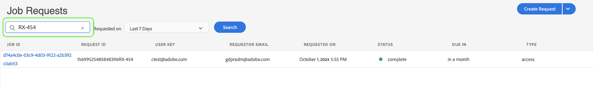

# Verwalten von Datenschutzaufträgen in der Privacy Service-Benutzeroberfläche

In diesem Dokument werden die Schritte zum Erstellen und Verwalten von Datenschutzanfragen mithilfe des [!DNL Privacy Service] -Benutzeroberfläche.

## Durchsuchen Sie die [!DNL Privacy Service] UI-Dashboard

Das Dashboard für die [!DNL Privacy Service] Die Benutzeroberfläche bietet zwei Widgets, mit denen Sie den Status Ihrer Datenschutzaufträge anzeigen können: &quot;[!UICONTROL Statusbericht]&quot; und &quot;[!UICONTROL Auftragsanforderungen]&quot;. Im Dashboard wird auch die aktuell ausgewählte Regel für die angezeigten Aufträge angezeigt.

### Regelungstyp

[!DNL Privacy Service] unterstützt Auftragsanfragen für verschiedene Datenschutzbestimmungen:

* Die [!DNL California Consumer Privacy Act] ([!UICONTROL CCPA])
* Die Europäische Union [!DNL General Data Protection Regulation] ([!UICONTROL DSGVO])
* Thailands [!DNL Personal Data Protection Act] ([!UICONTROL PDPA_THA])
* Brasiliens [!DNL Lei Geral de Proteção de Dados] ([!UICONTROL LGPD_BRA])
* Neuseeland [!DNL Privacy Act] ([!UICONTROL NZPA_NZL])

Aufträge für jeden Regulierungstyp werden separat verfolgt. Um zwischen Regeltypen zu wechseln, wählen Sie die **[!UICONTROL Regelungstyp]** und wählen Sie die gewünschte Regel aus der Liste aus.

Nach Änderung des Regulierungstyps wird das Dashboard aktualisiert, um alle Vorgänge, Filter, Widgets und Dialogfelder zur Schaffung von Arbeitsplätzen anzuzeigen, die für die ausgewählte Verordnung gelten.

### Statusbericht

Das Diagramm auf der linken Seite des Widgets &quot;Statusbericht&quot;verfolgt gesendete Aufträge für alle Aufträge, die möglicherweise mit Fehlern gemeldet wurden. Das Diagramm auf der rechten Seite verfolgt Aufträge, die sich dem Ende des 30-Tage-Compliance-Fensters nähern.

Wählen Sie eine der beiden Umschalter-Schaltflächen über dem Diagramm aus, um die entsprechenden Metriken ein- oder auszublenden.

Sie können die genaue Anzahl der Aufträge anzeigen, die mit einem Datenpunkt in den Diagrammen verbunden sind, indem Sie den Mauszeiger über den betreffenden Datenpunkt bewegen.

Um weitere Details zu einem bestimmten Datenpunkt anzuzeigen, wählen Sie den betreffenden Datenpunkt aus, um die zugehörigen Aufträge im Widget Auftragsanfragen anzuzeigen. Beachten Sie den Filter, der direkt über der Auftragsliste angewendet wird.

>[!NOTE]
>
>Wenn ein Filter auf das Widget Auftragsanforderungen angewendet wurde, können Sie den Filter entfernen, indem Sie die **X** auf der Filtertablette. Auftragsanfragen kehren dann zur standardmäßigen Tracking-Liste zurück.

### Auftragsanforderungen

Das Widget Auftragsanfragen listet alle in Ihrem Unternehmen verfügbaren Auftragsanfragen auf, einschließlich Details zum Anfragetyp, aktuellen Status, Fälligkeitsdatum und E-Mail-Adresse des Anfragenden.

>[!NOTE]
>
>Auf die Daten für zuvor erstellte Aufträge kann erst 30 Tage nach dem Abschlussdatum zugegriffen werden.

Sie können die Liste filtern, indem Sie Suchbegriffe in die Suchleiste unter dem Titel Auftragsanfragen eingeben. Die Liste filtert automatisch bei der Eingabe und zeigt Anforderungen an, die Werte enthalten, die Ihren Suchbegriffen entsprechen. Sie können auch die **[!UICONTROL Beantragen am]** Dropdown-Menü, um einen Zeitraum für die aufgelisteten Aufträge auszuwählen.

Um die Details einer bestimmten Auftragsanfrage anzuzeigen, wählen Sie die Auftrags-ID der Anfrage aus der Liste aus, um die **[!UICONTROL Auftragsdetails]** Seite.

Dieses Dialogfeld enthält Statusinformationen zu jedem [!DNL Experience Cloud] Lösung und deren aktueller Status in Bezug auf den Gesamtauftrag. Da jeder Datenschutzauftrag asynchron ausgeführt wird, zeigt die Seite das aktuelle Kommunikationsdatum und die aktuelle Uhrzeit (GMT) jeder Lösung an, da einige für die Verarbeitung der Anfrage mehr Zeit als andere benötigen.

Wenn eine Lösung zusätzliche Daten bereitgestellt hat, ist dies in diesem Dialogfeld sichtbar. Sie können diese Daten durch Auswahl einzelner Produktzeilen anzeigen.

Um die vollständigen Auftragsdaten als CSV-Datei herunterzuladen, wählen Sie **[!UICONTROL Exportieren in CSV]** oben rechts im Dialogfeld.

## Neue Datenschutzauftragsanforderung erstellen

>[!NOTE]
>
>Um eine Datenschutzanfrage zu erstellen, müssen Sie Identitätsinformationen für die spezifischen Kunden bereitstellen, deren Daten aufgerufen oder gelöscht werden sollen. Lesen Sie das Dokument unter [Identitätsdaten für Datenschutzanfragen](../identity-data.md) bevor Sie mit diesem Abschnitt fortfahren.

Die [!DNL Privacy Service] Die Benutzeroberfläche bietet zwei Methoden zum Erstellen neuer Auftragsanfragen:

* [Verwenden des Anforderungs-Builders](#request-builder)
* [Hochladen einer JSON-Datei](#json)

Die Schritte zur Verwendung dieser Methoden finden Sie in den folgenden Abschnitten.

### Verwenden des Anforderungs-Builders {#request-builder}

Mit dem Request Builder können Sie in der Benutzeroberfläche manuell eine neue Datenschutzauftragsanforderung erstellen. Der Request Builder eignet sich am besten für einfachere und kleinere Anforderungsgruppen, da der Request Builder die Anforderungen so beschränkt, dass sie nur einen ID-Typ pro Benutzer haben. Bei komplexeren Anforderungen kann es besser sein, [JSON-Datei hochladen](#json) anstatt.

Um mit der Verwendung des Anforderungs-Builders zu beginnen, wählen Sie **[!UICONTROL Anforderung erstellen]** unter dem Widget Statusbericht auf der rechten Seite des Bildschirms.

Die **[!UICONTROL Anforderung erstellen]** wird geöffnet, in dem die verfügbaren Optionen zum Senden einer Datenschutzauftragsanforderung für den derzeit ausgewählten Regulierungstyp angezeigt werden.

 

Wählen Sie die **[!UICONTROL Auftragstyp]** der Anforderung (&quot;Löschen&quot;oder &quot;Zugriff&quot;) und eines oder mehrerer verfügbarer Produkte aus der Liste.

 

under **[!UICONTROL Namespace-Typ]** wählen Sie den entsprechenden Namespace-Typ für die Kunden-IDs aus, die an gesendet werden. [!DNL Privacy Service].

 

Wählen Sie bei Verwendung des Standard-Namespace-Typs einen Namespace aus dem Dropdown-Menü (E-Mail, ECID oder AAID) aus, geben Sie dann die ID-Werte in das Textfeld rechts ein und drücken Sie die Eingabetaste. **\&lt;enter>** für jede ID, um sie der Liste hinzuzufügen.

 

Bei Verwendung des benutzerdefinierten Namespace-Typs müssen Sie den Namespace manuell eingeben, bevor Sie die unten stehenden ID-Werte angeben.

 

Klicken Sie abschließend auf **[!UICONTROL Erstellen]**.

 

Das Dialogfeld wird ausgeblendet und der neue Auftrag (oder die neuen Aufträge) wird im Widget Auftragsanfragen zusammen mit dem aktuellen Verarbeitungsstatus aufgeführt.

### Hochladen einer JSON-Datei {#json}

Beim Erstellen komplexerer Anforderungen, z. B. Anforderungen, die mehrere ID-Typen für jedes verarbeitete Datensubjekt verwenden, können Sie eine Anforderung erstellen, indem Sie eine JSON-Datei hochladen.

Wählen Sie den Pfeil neben **[!UICONTROL Anforderung erstellen]**, unter dem Widget Statusbericht auf der rechten Seite des Bildschirms. Wählen Sie in der angezeigten Liste der Optionen die Option **[!UICONTROL JSON hochladen]**.

Die **[!UICONTROL JSON hochladen]** angezeigt. Es wird ein Fenster angezeigt, in das Sie Ihre JSON-Datei per Drag-and-Drop ziehen können.

 

Wenn Sie keine JSON-Datei zum Hochladen haben, wählen Sie **[!UICONTROL Adobe-DSGVO-Request.json herunterladen]** , um eine Vorlage herunterzuladen, die Sie entsprechend den Werten füllen können, die Sie von Ihren Datensubjekten gesammelt haben.

 

Suchen Sie die JSON-Datei auf Ihrem Computer und ziehen Sie sie in das Dialogfenster. Wenn der Upload erfolgreich war, wird der Dateiname im Dialogfeld angezeigt. Sie können bei Bedarf weitere JSON-Dateien hinzufügen, indem Sie sie per Drag-and-Drop in das Dialogfeld ziehen.

Klicken Sie abschließend auf **[!UICONTROL Erstellen]**. Das Dialogfeld wird ausgeblendet und der neue Auftrag (oder die neuen Aufträge) wird im Widget Auftragsanfragen zusammen mit dem aktuellen Verarbeitungsstatus aufgeführt.

### Nächste Schritte

Durch Lesen dieses Dokuments haben Sie gelernt, wie Sie die [!DNL Privacy Service] Benutzeroberfläche zum Erstellen eines Datenschutzauftrags, zum Anzeigen der Details eines Auftrags, zum Überwachen des Verarbeitungsstatus und zum Herunterladen der Ergebnisse nach Abschluss.

Anweisungen zum programmgesteuerten Ausführen dieser Vorgänge mit dem [!DNL Privacy Service] API, siehe [API-Handbuch](../api/overview.md).
