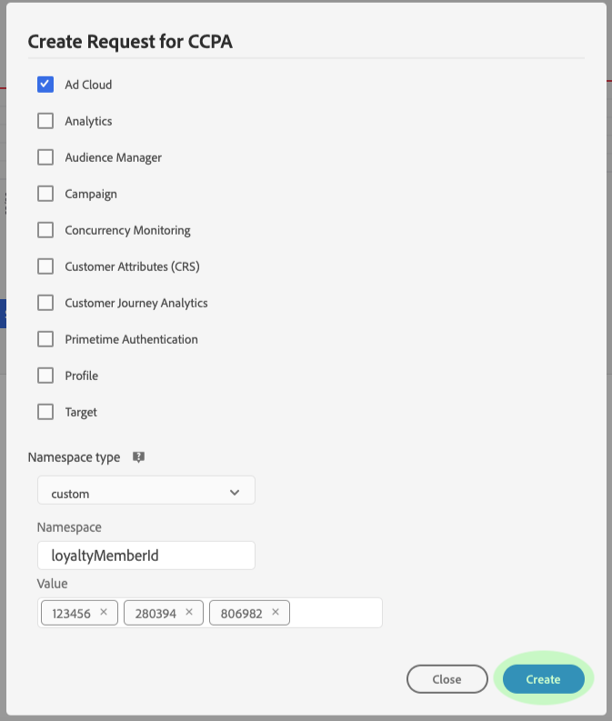

# Datenschutzaufträge in der Benutzeroberfläche von Privacy Service verwalten

In diesem Dokument werden Schritte zum Erstellen und Verwalten von Datenschutzanforderungen mithilfe der [!DNL Privacy Service]-Benutzeroberfläche beschrieben.

## Durchsuchen Sie das [!DNL Privacy Service]-UI-Dashboard

Das Dashboard für die Benutzeroberfläche [!DNL Privacy Service] stellt zwei Widgets zur Verfügung, mit denen Sie den Status Ihrer Datenschutzaufträge Ansicht haben: &quot;[!UICONTROL Statusbericht]&quot;und &quot;[!UICONTROL Auftragsanforderungen]&quot;. Das Dashboard zeigt auch die aktuell ausgewählte Regel für die angezeigten Aufträge an.

### Regeltyp

[!DNL Privacy Service] unterstützt Aufträge für mehrere Datenschutzbestimmungen:

* Die [!DNL California Consumer Privacy Act] ([!UICONTROL CCPA])
* Die Europäische Vereinigung [!DNL General Data Protection Regulation] ([!UICONTROL GDPR])
* Thailands [!DNL Personal Data Protection Act] ([!UICONTROL PDPA_THA])
* Brasiliens [!DNL Lei Geral de Proteção de Dados] ([!UICONTROL LGPD_BRA])
* Neuseeland [!DNL Privacy Act] ([!UICONTROL NZPA_NZL])

Aufträge für jeden Regelungstyp werden separat verfolgt. Um zwischen Regelungstypen zu wechseln, wählen Sie im Dropdown-Menü **[!UICONTROL Regeltyp]** die gewünschte Regel aus der Liste.

Beim Ändern des Regeltyps wird das Dashboard aktualisiert, um alle Vorgänge, Filter, Widgets und Dialoge zur Schaffung von Arbeitsplätzen anzuzeigen, die für die ausgewählte Regel gelten.

### Statusbericht

Das Diagramm auf der linken Seite des Statusbericht-Widgets verfolgt gesendete Aufträge mit allen Aufträgen, die möglicherweise mit Fehlern zurückgemeldet wurden. Das Diagramm auf der rechten Seite verfolgt Aufträge, die sich am Ende des 30-Tage-Compliance-Fensters befinden.

Wählen Sie eine der beiden Schaltflächen über dem Diagramm aus, um die jeweiligen Metriken ein- oder auszublenden.

Sie können die exakte Anzahl der Aufträge, die mit einem Datenpunkt auf den Diagrammen verbunden sind, durch Bewegen der Maus über den betreffenden Datenpunkt Ansicht werden.

Um weitere Details zu einem bestimmten Datenpunkt Ansicht, wählen Sie den betreffenden Datenpunkt aus, um die zugehörigen Aufträge im Widget &quot;Auftragsanforderungen&quot;anzuzeigen. Beachten Sie den Filter, der direkt über der Auftrags-Liste angewendet wird.

>[!NOTE]
>
>Wenn ein Filter auf das Widget &quot;Auftragsanforderungen&quot;angewendet wurde, können Sie den Filter entfernen, indem Sie in der Filtertablette **X** auswählen. Auftragsanforderungen kehren dann zur standardmäßigen Tracking-Liste zurück.

### Auftragsanforderungen

Das Widget &quot;Auftragsanforderungen&quot;Liste alle in Ihrem Unternehmen verfügbaren Auftragsanforderungen, einschließlich Angaben zum Anforderungstyp, aktuellen Status, Fälligkeitsdatum und E-Mail-Anfrage.

>[!NOTE]
>
>Die Daten für zuvor erstellte Aufträge sind erst 30 Tage nach dem Abschlussdatum verfügbar.

Sie können die Liste filtern, indem Sie Suchbegriffe in die Suchleiste unterhalb des Titels &quot;Auftragsanforderungen&quot;eingeben. Die Liste wird beim Eingeben automatisch Filter und zeigt Anforderungen mit Werten an, die mit Ihren Suchbegriffen übereinstimmen. Sie können auch das Dropdown-Menü **[!UICONTROL Angefordert auf]** verwenden, um einen Zeitraum für die aufgelisteten Aufträge auszuwählen.

Um die Details einer bestimmten Auftragsanforderung Ansicht, wählen Sie die Auftrags-ID der Anforderung in der Liste aus, um die Seite **[!UICONTROL Auftragsdetails]** zu öffnen.

Dieses Dialogfeld enthält Statusinformationen zu jeder [!DNL Experience Cloud]-Lösung und ihren aktuellen Status im Verhältnis zum Gesamtauftrag. Da jeder Datenschutzauftrag asynchron ausgeführt wird, zeigt die Seite das aktuelle Kommunikationsdatum und die aktuelle Uhrzeit (GMT) jeder Lösung an, da einige mehr Zeit benötigen als andere, um die Anforderung zu verarbeiten.

Wenn eine Lösung zusätzliche Daten bereitgestellt hat, ist sie in diesem Dialogfeld sichtbar. Sie können diese Daten durch Auswahl der einzelnen Produktzeilen Ansicht werden.

Um die vollständigen Auftragsdaten als CSV-Datei herunterzuladen, wählen Sie **[!UICONTROL Export in CSV]** oben rechts im Dialogfeld.

## Neue Datenschutzauftragsanforderung erstellen

>[!NOTE]
>
>Um eine Datenschutzauftragsanforderung zu erstellen, müssen Sie Identitätsinformationen für bestimmte Kunden bereitstellen, deren Daten abgerufen oder gelöscht werden sollen. Bitte lesen Sie das Dokument zu [Identitätsdaten für Datenschutzanforderungen](../identity-data.md), bevor Sie mit diesem Abschnitt fortfahren.

Die Benutzeroberfläche [!DNL Privacy Service] bietet zwei Methoden zum Erstellen neuer Auftragsanforderungen:

* [Anforderungs-Builder verwenden](#request-builder)
* [JSON-Datei hochladen](#json)

Die Schritte zur Verwendung dieser Methoden sind in den folgenden Abschnitten beschrieben.

### Verwenden Sie den Anforderungs-Builder {#request-builder}

Mit dem Anforderungs-Builder können Sie in der Benutzeroberfläche manuell eine neue Datenschutzauftragsanforderung erstellen. Der Anforderungs-Builder eignet sich am besten für einfachere und kleinere Anforderungsgruppen, da der Anforderungs-Builder die Anforderungen auf den ID-Typ pro Benutzer beschränkt. Bei komplizierteren Anforderungen ist es möglicherweise besser, [eine JSON-Datei](#json) hochzuladen.

Um Beginn mit dem Anforderungs-Builder zu erstellen, wählen Sie auf der rechten Seite des Bildschirms unter dem Statusbericht-Widget **[!UICONTROL Anforderung erstellen]** aus.

Das Dialogfeld **[!UICONTROL Anforderung erstellen]** wird geöffnet und zeigt die verfügbaren Optionen zum Senden einer Datenschutzauftragsanforderung für den derzeit ausgewählten Regeltyp an.

 

Wählen Sie **[!UICONTROL Auftragstyp]** der Anforderung (&quot;Löschen&quot;oder &quot;Zugriff&quot;) und eines oder mehrere verfügbare Produkte aus der Liste aus.

 

Wählen Sie unter **[!UICONTROL Namensraum type]** den entsprechenden Namensraum-Typ für die Kunden-IDs aus, die an [!DNL Privacy Service] gesendet werden.

 

Wählen Sie bei Verwendung des Standardtyps einen Namensraum aus dem Dropdown-Menü (E-Mail, ECID oder AAID) und geben Sie dann die ID-Werte in das Textfeld rechts ein. Drücken Sie dann für jede ID **\&lt;enter>**, um sie der Liste hinzuzufügen.

 

Bei Verwendung des benutzerdefinierten Namensraums müssen Sie den Namensraum manuell eingeben, bevor Sie die unten stehenden ID-Werte eingeben.

 

Wenn Sie fertig sind, wählen Sie **[!UICONTROL Erstellen]**.

 

Das Dialogfeld wird ausgeblendet und der neue Auftrag (oder die neuen Aufträge) wird zusammen mit dem aktuellen Verarbeitungsstatus im Widget &quot;Auftragsanforderungen&quot;aufgeführt.

### Hochladen einer JSON-Datei {#json}

Wenn Sie komplexere Anforderungen erstellen, z. B. Anforderungen, die mehrere ID-Typen für jede verarbeitete Person verwenden, können Sie eine Anforderung erstellen, indem Sie eine JSON-Datei hochladen.

Wählen Sie den Pfeil neben **[!UICONTROL Anforderung erstellen]** unter dem Statusbericht-Widget auf der rechten Seite des Bildschirms aus. Wählen Sie in der Liste der angezeigten Optionen **[!UICONTROL JSON hochladen]**.

Das Dialogfeld **[!UICONTROL JSON hochladen]** wird angezeigt. Es wird ein Fenster angezeigt, in das Sie Ihre JSON-Datei per Drag &amp; Drop verschieben können.

 

Wenn Sie keine JSON-Datei zum Hochladen haben, wählen Sie **[!UICONTROL Adobe-GDPR-Request.json herunterladen]**, um eine Vorlage herunterzuladen, die Sie entsprechend den Werten füllen können, die Sie von den betroffenen Personen gesammelt haben.

 

Suchen Sie die JSON-Datei auf Ihrem Computer und ziehen Sie sie in das Dialogfeld. Wenn der Upload erfolgreich war, wird der Dateiname im Dialogfeld angezeigt. Sie können bei Bedarf weitere JSON-Dateien hinzufügen, indem Sie sie in das Dialogfeld ziehen und dort ablegen.

Wenn Sie fertig sind, wählen Sie **[!UICONTROL Erstellen]**. Das Dialogfeld wird ausgeblendet und der neue Auftrag (oder die neuen Aufträge) wird zusammen mit dem aktuellen Verarbeitungsstatus im Widget &quot;Auftragsanforderungen&quot;aufgeführt.

### Nächste Schritte

Durch Lesen dieses Dokuments haben Sie gelernt, wie Sie mithilfe der Benutzeroberfläche [!DNL Privacy Service] einen Datenschutzauftrag erstellen, die Details eines Auftrags Ansicht und den Verarbeitungsstatus des Auftrags vornehmen und die Ergebnisse nach Abschluss des Vorgangs herunterladen können.

Anweisungen zum programmgesteuerten Ausführen dieser Vorgänge mit der [!DNL Privacy Service]-API finden Sie im [Entwicklerhandbuch](../api/getting-started.md).
