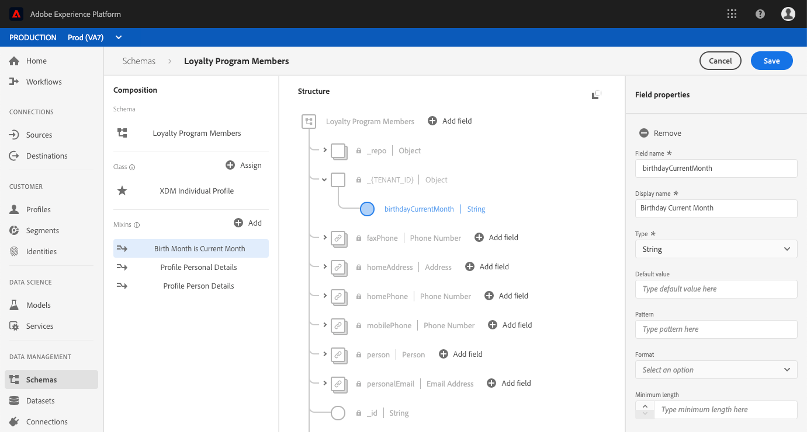

# (Alpha) Berechnete Attribute

>[!IMPORTANT]
>Die in diesem Dokument beschriebene Funktion für berechnete Attribute ist derzeit alphanumerisch und steht nicht allen Benutzern zur Verfügung. Dokumentation und Funktionalität können sich ändern.

Berechnete Attribute ermöglichen es Ihnen, den Feldwert anhand anderer Werte, Berechnungen und Ausdruck automatisch zu berechnen. Berechnete Attribute werden auf Profil-Ebene ausgeführt, d. h., Sie können Werte über alle Datensätze und Ereignis hinweg Aggregat haben.

Jedes berechnete Attribut enthält einen Ausdruck, oder &quot;Regel&quot;, der eingehende Daten auswertet und den sich ergebenden Wert in einem Profil-Attribut oder in einem Ereignis speichert. Diese Berechnungen helfen Ihnen, Fragen im Zusammenhang mit dem Kaufwert über die gesamte Lebensdauer, der Zeit zwischen Käufen oder der Anzahl der Anwendungen einfach zu beantworten, ohne dass Sie bei jeder erforderlichen Information manuell komplexe Berechnungen durchführen müssen.

Dieses Handbuch hilft Ihnen, berechnete Attribute innerhalb der Adobe Experience Platform besser zu verstehen. Es enthält Beispiel-API-Aufrufe für die Durchführung grundlegender CRUD-Vorgänge mit dem `/config/computedAttributes` Endpunkt.

## Erste Schritte

Die in diesem Handbuch verwendeten API-Endpunkte sind Teil der Real-time Customer Profil API. Bevor Sie fortfahren, lesen Sie sich bitte das Entwicklerhandbuch für [Echtzeit-Profil durch](getting-started.md).

Insbesondere enthält der [Abschnitt](getting-started.md) &quot;Erste Schritte&quot;des Profil-Entwicklerhandbuchs Links zu verwandten Themen, eine Anleitung zum Lesen der Beispiel-API-Aufrufe in diesem Dokument und wichtige Informationen zu erforderlichen Kopfzeilen, die für das erfolgreiche Aufrufen von Experience Platform-APIs benötigt werden.

## Berechnete Attribute

Mit der Adobe Experience Platform können Sie Daten aus mehreren Quellen einfach importieren und zusammenführen, um Kundendaten in Echtzeit zu generieren. Jedes Profil enthält wichtige Informationen zu einer Einzelperson, wie z. B. Kontaktinformationen, Präferenzen und Kaufverlauf, und bietet so eine Ansicht des Kunden von 360 Grad.

Einige der im Profil erfassten Informationen sind beim direkten Lesen der Datenfelder leicht verständlich (z. B. &quot;Vorname&quot;), während für andere Daten mehrere Berechnungen oder andere Felder und Werte erforderlich sind, um die Informationen zu generieren (z. B. &quot;Kaufsumme während der Lebensdauer&quot;). Damit diese Daten auf einen Blick leichter zu verstehen sind, können Sie mit der Plattform **berechnete Attribute** erstellen, die automatisch diese Verweise und Berechnungen durchführen und den Wert im entsprechenden Feld zurückgeben.

Berechnete Attribute umfassen das Erstellen eines Ausdrucks oder einer &quot;Regel&quot;, der für eingehende Daten arbeitet und den sich ergebenden Wert in einem Profil- oder Ereignis speichert. Ausdruck können auf unterschiedliche Weise definiert werden. Sie können festlegen, dass eine Regel nur eingehende Ereignis, eingehende Ereignis- und Profil-Daten oder eingehende Ereignis, Profil- und historische Ereignis auswertet.

### Anwendungsbeispiele

Anwendungsfälle für berechnete Attribute können von einfachen Berechnungen bis hin zu sehr komplexen Verweisen reichen. Im Folgenden finden Sie einige Verwendungsbeispiele für berechnete Attribute:

1. **Prozentsätze:** Ein einfaches, berechnetes Attribut könnte darin bestehen, zwei numerische Felder in einem Datensatz zu nehmen und sie zu teilen, um einen Prozentwert zu erstellen. Sie können beispielsweise die Gesamtzahl der an eine Person gesendeten E-Mails durch die Anzahl der von der Person geöffneten E-Mails dividieren. Wenn Sie sich das sich ergebende Feld für berechnete Attribute ansehen, wird schnell der Prozentsatz der E-Mails angezeigt, die von der Person geöffnet wurden.
1. **Anwendungsverwendung:** Ein weiteres Beispiel ist die Möglichkeit, die Anzahl der Aggregat zu bestimmen, die ein Benutzer zum Öffnen der Anwendung benötigt. Wenn Sie die Gesamtzahl der angezeigten Anwendungen basierend auf einzelnen offenen Ereignissen verfolgen, können Sie besondere Angebot oder Nachrichten an die Benutzer senden, die an ihrer 100. Stelle teilnehmen, und so eine engere Zusammenarbeit mit Ihrer Marke fördern.
1. **Lebenszeitwerte:** Die Erfassung laufender Gesamtsummen, z. B. eines Kaufwerts für einen Kunden über die gesamte Lebensdauer, kann sehr schwierig sein. Dies erfordert die Aktualisierung der historischen Gesamtsumme bei jedem Auftreten eines neuen Ereignisses. Mit einem berechneten Attribut können Sie dies wesentlich einfacher durchführen, indem Sie den Lebenszeitwert in einem einzigen Feld beibehalten, das nach jedem erfolgreichen Ereignis des Kaufs automatisch aktualisiert wird, das mit dem Kunden in Verbindung steht.

## Konfigurieren eines berechneten Attributs

Um ein berechnetes Attribut zu konfigurieren, müssen Sie zunächst das Feld identifizieren, das den berechneten Attributwert enthält. Dieses Feld kann mit einem Mixin erstellt werden, um das Feld einem vorhandenen Schema hinzuzufügen, oder durch Auswahl eines Felds, das Sie bereits in einem Schema definiert haben.

>[!NOTE]
>Berechnete Attribute können nicht zu Feldern innerhalb von von Adobe definierten mixins hinzugefügt werden. Das Feld muss sich innerhalb des `tenant` Namensraums befinden, d. h. es muss sich um ein Feld handeln, das Sie definieren und einem Schema hinzufügen.

Um ein berechnetes Attributfeld erfolgreich zu definieren, muss das Schema zum Profil aktiviert sein und als Teil des Vereinigung-Schemas für die Klasse angezeigt werden, auf der das Schema basiert. Weitere Informationen zu Profil-aktivierten Schemas und Vereinigungen finden Sie im Abschnitt des Schema Registry-Entwicklerhandbuchs zum [Aktivieren eines Schemas zum Profil und Anzeigen von Vereinigungen-Schemas](../../xdm/api/getting-started.md). Es wird außerdem empfohlen, den [Abschnitt über Vereinigungen](../../xdm/schema/composition.md) in der Dokumentation zur Schema-Komposition zu lesen.

Der Arbeitsablauf in diesem Lernprogramm verwendet ein Profil-aktiviertes Schema und führt die Schritte zum Definieren einer neuen Mischung mit dem berechneten Attributfeld und zum Sicherstellen des richtigen Namensraums durch. Wenn Sie bereits über ein Feld verfügen, das sich in einem für Profil aktivierten Schema im richtigen Namensraum befindet, können Sie direkt zum [Erstellen eines berechneten Attributs](#create-a-computed-attribute)fortfahren.

### Ansicht eines Schemas

In den folgenden Schritten wird die Benutzeroberfläche von Adobe Experience Platform verwendet, um ein Schema zu suchen, eine Mischung hinzuzufügen und ein Feld zu definieren. Wenn Sie lieber die Schema Registry API verwenden möchten, lesen Sie bitte das Entwicklerhandbuch für die [Schema-Registrierung](../../xdm/api/getting-started.md) , um zu erfahren, wie Sie eine Mixin erstellen, eine Mixin zu einem Schema hinzufügen und ein Schema für die Verwendung mit dem Echtzeit-Customer-Profil aktivieren.

Klicken Sie in der Benutzeroberfläche auf der linken Leiste auf **Schema** und verwenden Sie die Suchleiste auf der Registerkarte &quot; *Durchsuchen* &quot;, um das Schema, das Sie aktualisieren möchten, schnell zu finden.


Nachdem Sie das Schema gefunden haben, klicken Sie auf seinen Namen, um den Schema-Editor zu öffnen, in dem Sie das Schema bearbeiten können.


### Erstellen eines Mixins

Um ein neues Mixin zu erstellen, klicken Sie auf **Hinzufügen** neben *Mixins* im Abschnitt &quot; *Komposition* &quot;auf der linken Seite des Editors. Dadurch wird der **Hinzufügen Mixin** -Dialog geöffnet, in dem Sie vorhandene Mixins sehen können. Klicken Sie auf das Optionsfeld zum **Erstellen eines neuen Mixins** , um Ihr neues Mixin zu definieren.

Geben Sie dem Mixin einen Namen und eine Beschreibung ein und klicken Sie nach Abschluss auf **Hinzufügen mixin** .


### Hinzufügen eines berechneten Attributfelds für das Schema

Ihr neues Mixin sollte nun im Abschnitt *Mixins* unter *Komposition* angezeigt werden. Klicken Sie auf den Namen des Mixins und mehrere **Hinzufügen Feldschaltflächen** werden im Abschnitt *Struktur* des Editors angezeigt.

Wählen Sie **Hinzufügen Feld** neben dem Namen des Schemas aus, um ein Feld der obersten Ebene hinzuzufügen, oder wählen Sie das Feld an einer beliebigen Stelle im gewünschten Schema aus.

Nachdem Sie auf **Hinzufügen Feld** geklickt haben, wird ein neues Objekt mit dem Namen Ihrer Mandanten-ID geöffnet, das anzeigt, dass das Feld im richtigen Namensraum ist. Innerhalb dieses Objekts wird ein *neues Feld* angezeigt. Dies ist der Fall, wenn das Feld, in dem Sie das berechnete Attribut definieren möchten.


### Feld konfigurieren

Geben Sie im Abschnitt &quot; *Feldeigenschaften* &quot;auf der rechten Seite des Editors die erforderlichen Informationen für das neue Feld ein, einschließlich Name, Anzeigename und Typ.

>[!NOTE]
>Der Typ für das Feld muss mit dem berechneten Attributwert identisch sein. Wenn der berechnete Attributwert beispielsweise eine Zeichenfolge ist, muss das im Schema definierte Feld eine Zeichenfolge sein.

Wenn Sie fertig sind, klicken Sie auf **Übernehmen** , und der Name des Felds sowie der Typ werden im Abschnitt &quot; *Struktur* &quot;des Editors angezeigt.



### Schema für Profil aktivieren

Bevor Sie fortfahren, stellen Sie sicher, dass das Schema zum Profil aktiviert wurde. Klicken Sie im Editor im Bereich &quot; *Struktur* &quot;auf den Namen des Schemas, damit die Registerkarte &quot; *Schema-Eigenschaften* &quot;angezeigt wird. Wenn der **Profil** -Schieberegler blau ist, wurde das Schema zum Profil aktiviert.

>[!NOTE]
>Die Aktivierung eines Schemas zum Profil kann nicht rückgängig gemacht werden. Wenn Sie also auf den Schieberegler klicken, müssen Sie nicht riskieren, es zu deaktivieren.


Sie können jetzt auf **Speichern** klicken, um das aktualisierte Schema zu speichern und den Rest des Lernprogramms mit der API fortzusetzen.

### Berechnete Attribute erstellen {#create-a-computed-attribute}

Wenn das berechnete Attributfeld identifiziert und bestätigt wird, dass das Schema zum Profil aktiviert ist, können Sie jetzt ein berechnetes Attribut konfigurieren.

Beginnen Sie mit einer POST-Anforderung an den `/config/computedAttributes` Endpunkt mit einem Anforderungstext, der die Details des berechneten Attributs enthält, das Sie erstellen möchten.

**API-Format**

```http
POST /config/computedAttributes
```

**Anfrage**

```shell
curl -X POST \
  https://platform.adobe.io/data/core/ups/config/computedAttributes \
  -H 'Authorization: Bearer {ACCESS_TOKEN}' \
  -H 'Content-Type: application/json' \
  -H 'x-api-key: {API_KEY}'\
  -H 'x-gw-ims-org-id: {IMS_ORG}' \
  -H 'x-sandbox-name: {SANDBOX_NAME}' \
  -d '{
        "name" : "birthdayCurrentMonth",
        "path" : "_{TENANT_ID}",
        "description" : "Computed attribute to capture if the customer birthday is in the current month.",
        "expression" : {
            "type" : "PQL", 
            "format" : "pql/text", 
            "value":  "person.birthDate.getMonth() = currentMonth()"
        },
        "schema": 
          {
            "name":"_xdm.context.profile"
          }
          
      }'
```

| Eigenschaft | Beschreibung |
|---|---|
| `name` | Der Name des berechneten Attributfelds als Zeichenfolge. |
| `path` | Der Pfad zum Feld mit dem berechneten Attribut. Dieser Pfad befindet sich im `properties` Attribut des Schemas und sollte NICHT den Feldnamen in den Pfad einschließen. Lassen Sie beim Schreiben des Pfads die verschiedenen Ebenen von `properties` Attributen weg. |
| `{TENANT_ID}` | Wenn Sie mit Ihrer Mieter-ID nicht vertraut sind, lesen Sie bitte die Anleitung zum Suchen Ihrer Mieter-ID im [Schema Registry Developer Guide](../../xdm/api/getting-started.md#know-your-tenant_id). |
| `description` | Eine Beschreibung des berechneten Attributs. Dies ist besonders dann nützlich, wenn mehrere berechnete Attribute definiert wurden, da es anderen in Ihrer IMS-Organisation hilft, das richtige berechnete Attribut zu ermitteln. |
| `expression.value` | Ein gültiger PQL-Ausdruck (Profil Abfrage Language). Weitere Informationen zu PQL und Links zu unterstützten Abfragen finden Sie in der [PQL Übersicht](../../segmentation/pql/overview.md). |
| `schema.name` | Die Klasse, auf der das Schema mit dem berechneten Attributfeld basiert. Beispiel: `_xdm.context.experienceevent` für ein Schema, das auf der XDM ExperienceEvent-Klasse basiert. |

**Antwort**

Ein erfolgreich erstelltes berechnetes Attribut gibt HTTP-Status 200 (OK) und einen Antworttext mit den Details des neu erstellten berechneten Attributs zurück. Zu diesen Details gehört ein eindeutiges, schreibgeschütztes, systemgeneriertes Attribut, `id` das bei anderen API-Vorgängen zum Referenzieren des berechneten Attributs verwendet werden kann.

```json
{
    "id": "2afcf410-450e-4a39-984d-2de99ab58877",
    "imsOrgId": "{IMS_ORG}",
    "sandbox": {
        "sandboxId": "ff0f6870-c46d-11e9-8ca3-036939a64204",
        "sandboxName": "prod",
        "type": "production",
        "default": true
    },
    "name": "birthdayCurrentMonth",
    "path": "_{TENANT_ID}",
    "positionPath": [
        "_{TENANT_ID}"
    ],
    "description": "Computed attribute to capture if the customer birthday is in the current month.",
    "expression": {
        "type": "PQL",
        "format": "pql/text",
        "value": "person.birthDate.getMonth() = currentMonth()"
    },
    "schema": {
        "name": "_xdm.context.profile"
    },
    "returnSchema": {
        "meta:xdmType": "string"
    },
    "definedOn": [
        {
            "meta:resourceType": "unions",
            "meta:containerId": "tenant",
            "$ref": "https://ns.adobe.com/xdm/context/profile__union"
        }
    ],
    "encodedDefinedOn":"?\b?VR)JMS?R?())(????+?KL?OJ?K???H??O??+I?(?/(?O??I??/????S?8{?E:",
    "dependencies": [],
    "dependents": [],
    "active": true,
    "type": "ComputedAttribute",
    "createEpoch": 1572555223,
    "updateEpoch": 1572555225
}
```

| Eigenschaft | Beschreibung |
|---|---|
| `id` | Eine eindeutige, schreibgeschützte, systemgenerierte ID, die für den Verweis auf das berechnete Attribut bei anderen API-Vorgängen verwendet werden kann. |
| `imsOrgId` | Die IMS-Organisation, die sich auf das berechnete Attribut bezieht, sollte mit dem Wert übereinstimmen, der in der Anforderung gesendet wird. |
| `sandbox` | Das sandbox-Objekt enthält Details zur Sandbox, in der das berechnete Attribut konfiguriert wurde. Diese Informationen werden aus der Sandbox-Kopfzeile gezogen, die in der Anforderung gesendet wird. Weitere Informationen finden Sie in der [Sandbox-Übersicht](../../sandboxes/home.md). |
| `positionPath` | Ein Array, das das dekonstruierte `path` zu dem in der Anforderung gesendeten Feld enthält. |
| `returnSchema.meta:xdmType` | Der Typ des Felds, in dem das berechnete Attribut gespeichert wird. |
| `definedOn` | Ein Array, das die Schema der Vereinigung anzeigt, auf denen das berechnete Attribut definiert wurde. Enthält ein Objekt pro Vereinigung-Schema, d. h. es können mehrere Objekte im Array vorhanden sein, wenn das berechnete Attribut mehreren Schemas basierend auf verschiedenen Klassen hinzugefügt wurde. |
| `active` | Ein boolescher Wert, der anzeigt, ob das berechnete Attribut aktuell aktiv ist. By default the value is `true`. |
| `type` | Der Typ der erstellten Ressource, in diesem Fall &quot;ComputeAttribute&quot;, ist der Standardwert. |
| `createEpoch` und `updateEpoch` | Der Zeitpunkt, zu dem das berechnete Attribut erstellt bzw. zuletzt aktualisiert wurde. |


## Zugriff auf berechnete Attribute

Beim Arbeiten mit berechneten Attributen mithilfe der API gibt es zwei Optionen für den Zugriff auf berechnete Attribute, die von Ihrem Unternehmen definiert wurden. Die erste besteht in der Liste aller berechneten Attribute, die zweite in der Ansicht eines bestimmten berechneten Attributs durch sein eindeutiges Attribut `id`.

Die Schritte für die Auflistung aller berechneten Attribute und die Anzeige eines bestimmten berechneten Attributs sind in den folgenden Abschnitten beschrieben.

### Berechnete Attribute der Liste {#list-computed-attributes}

Ihre IMS-Organisation kann mehrere berechnete Attribute erstellen und die Ausführung einer GET-Anforderung an den `/config/computedAttributes` Endpunkt ermöglicht die Liste aller vorhandenen berechneten Attribute für Ihr Unternehmen.

**API-Format**

```http
GET /config/computedAttributes
```

**Anfrage**

```shell
curl -X GET \
  https://platform.adobe.io/data/core/ups/config/computedAttributes/ \
  -H 'Authorization: Bearer {ACCESS_TOKEN}' \
  -H 'x-api-key: {API_KEY}' \
  -H 'x-gw-ims-org-id: {IMS_ORG}' \ 
  -H 'x-sandbox-name: {SANDBOX_NAME}' \
```

**Antwort**

Eine erfolgreiche Antwort umfasst ein `_page` Attribut, das die Gesamtanzahl der berechneten Attribute (`totalCount`) und die Anzahl der berechneten Attribute auf der Seite (`pageSize`) angibt.

Die Antwort enthält auch ein `children` Array, das aus einem oder mehreren Objekten besteht, von denen jedes die Details eines berechneten Attributs enthält. Wenn Ihr Unternehmen über keine berechneten Attribute verfügt, ist der Wert 0 `totalCount` und `pageSize` der Wert 0 (null), und das `children` Array ist leer.

```json
{
    "_page": {
        "totalCount": 2,
        "pageSize": 2
    },
    "children": [
        {
            "id": "2afcf410-450e-4a39-984d-2de99ab58877",
            "imsOrgId": "{IMS_ORG}",
            "sandbox": {
                "sandboxId": "ff0f6870-c46d-11e9-8ca3-036939a64204",
                "sandboxName": "prod",
                "type": "production",
                "default": true
            },
            "name": "birthdayCurrentMonth",
            "path": "person._{TENANT_ID}",
            "positionPath": [
                "person",
                "_{TENANT_ID}"
            ],
            "description": "Computed attribute to capture if the customer birthday is in the current month.",
            "expression": {
                "type": "PQL",
                "format": "pql/text",
                "value": "person.birthDate.getMonth() = currentMonth()"
            },
            "schema": {
                "name": "_xdm.context.profile"
            },
            "returnSchema": {
                "meta:xdmType": "string"
            },
            "definedOn": [
                {
                    "meta:resourceType": "unions",
                    "meta:containerId": "tenant",
                    "$ref": "https://ns.adobe.com/xdm/context/profile__union"
                }
            ],
            "encodedDefinedOn":"?\b?VR)JMS?R?())(????+?KL?OJ?K???H??O??+I?(?/(?O??I??/????S?8{?E:",
            "dependencies": [],
            "dependents": [],
            "active": true,
            "type": "ComputedAttribute",
            "createEpoch": 1572555223,
            "updateEpoch": 1572555225
        },
        {
            "id": "ae0c6552-cf49-4725-8979-116366e8e8d3",
            "imsOrgId": "{IMS_ORG}",
            "sandbox": {
                "sandboxId": "",
                "sandboxName": "",
                "type": "production",
                "default": true
            },
            "name": "productDownloads",
            "path": "_{TENANT_ID}",
            "positionPath": [
                "_{TENANT_ID}"
            ],
            "description": "Calculate total product downloads.",
            "expression": {
                "type" : "PQL", 
                "format" : "pql/text", 
                "value":  "let Y = xEvent[_coresvc.event.subType = \"DOWNLOAD\"].groupBy(_coresvc.attributes[name = \"product\"].value).map({
                  \"downloaded\": this.head()._coresvc.attributes[name = \"product\"].head().value,
                  \"downloadsSum\": this.count(),
                  \"downloadsToday\": this[timestamp occurs today].count(),
                  \"downloadsPast30Days\": this[timestamp occurs < 30 days before now].count(),
                  \"downloadsPast60Days\": this[timestamp occurs < 60 days before now].count(),
                  \"downloadsPast90Days\": this[timestamp occurs < 90 days before now].count() }) in { \"uniqueProductDownloadSum\": Y.count(), \"products\": Y }"
            },
            "returnSchema": {
                "meta:xdmType": "string"
            },
            "definedOn": [
                {
                    "meta:resourceType": "unions",
                    "meta:containerId": "tenant",
                    "$ref": "https://ns.adobe.com/xdm/context/profile__union"
                }
            ],
            "schema": {
                "name": "_xdm.context.profile"
            },
            "encodedDefinedOn": "\u001f?\b\u0000\u0000\u0000\u0000\u0000\u0000\u0000?VR)JMS?R?())(????+?KL?OJ?K???H??O??+I?(?/(?O??I??/????S?\u0005\u00008{?E:\u0000\u0000\u0000",
            "dependencies": [],
            "dependents": [],
            "active": true,
            "type": "ComputedAttribute",
            "createEpoch": 1571945277,
            "updateEpoch": 1571945280
        }
    ],
    "_links": {
        "next": {}
    }
}
```

| Eigenschaft | Beschreibung |
|---|---|
| `_page.totalCount` | Die Gesamtzahl der von Ihrer IMS-Organisation definierten berechneten Attribute. |
| `_page.pageSize` | Die Anzahl der berechneten Attribute, die auf dieser Ergebnisseite zurückgegeben werden. Ist `pageSize` gleich `totalCount`, bedeutet dies, dass nur eine Seite mit Ergebnissen vorhanden ist und alle berechneten Attribute zurückgegeben wurden. Wenn sie nicht gleich sind, gibt es zusätzliche Seiten mit Ergebnissen, auf die zugegriffen werden kann. See `_links.next` for details. |
| `children` | Ein Array, das aus einem oder mehreren Objekten besteht, von denen jedes die Details eines einzelnen berechneten Attributs enthält. Wenn keine berechneten Attribute definiert wurden, ist das `children` Array leer. |
| `id` | Ein eindeutiger, schreibgeschützter, systemgenerierter Wert, der einem berechneten Attribut automatisch zugewiesen wird, wenn er erstellt wird. Weitere Informationen zu den Komponenten eines berechneten Attributobjekts finden Sie im Abschnitt zum [Erstellen eines berechneten Attributs](#create-a-computed-attribute) weiter oben in diesem Lernprogramm. |
| `_links.next` | Wenn eine einzelne Seite mit berechneten Attributen zurückgegeben wird, `_links.next` ist dies ein leeres Objekt, wie in der obigen Beispielantwort dargestellt. Wenn Ihr Unternehmen über viele berechnete Attribute verfügt, werden diese auf mehreren Seiten zurückgegeben, auf die Sie über eine GET-Anforderung zum `_links.next` Wert zugreifen können. |

### Ansicht eines berechneten Attributs {#view-a-computed-attribute}

Sie können auch ein bestimmtes berechnetes Attribut Ansicht haben, indem Sie eine GET-Anforderung an den `/config/computedAttributes` Endpunkt stellen und die berechnete Attribut-ID in den Anforderungspfad einschließen.

**API-Format**

```http
GET /config/computedAttributes/{ATTRIBUTE_ID}
```

| Parameter | Beschreibung |
|---|---|
| `{ATTRIBUTE_ID}` | Die ID des berechneten Attributs, das Ansicht werden soll. |

**Anfrage**

```shell
curl -X GET \
  https://platform.adobe.io/data/core/ups/config/computedAttributes/2afcf410-450e-4a39-984d-2de99ab58877 \
  -H 'Authorization: Bearer {ACCESS_TOKEN}' \
  -H 'x-api-key: {API_KEY}' \
  -H 'x-gw-ims-org-id: {IMS_ORG}' \ 
  -H 'x-sandbox-name: {SANDBOX_NAME}' \
```

**Antwort**

```json
{
    "id": "2afcf410-450e-4a39-984d-2de99ab58877",
    "imsOrgId": "{IMS_ORG}",
    "sandbox": {
        "sandboxId": "ff0f6870-c46d-11e9-8ca3-036939a64204",
        "sandboxName": "prod",
        "type": "production",
        "default": true
    },
    "name": "birthdayCurrentMonth",
    "path": "_{TENANT_ID}",
    "positionPath": [
        "_{TENANT_ID}"
    ],
    "description": "Computed attribute to capture if the customer birthday is in the current month.",
    "expression": {
        "type": "PQL",
        "format": "pql/text",
        "value": "person.birthDate.getMonth() = currentMonth()"
    },
    "schema": {
        "name": "_xdm.context.profile"
    },
    "returnSchema": {
        "meta:xdmType": "string"
    },
    "definedOn": [
        {
            "meta:resourceType": "unions",
            "meta:containerId": "tenant",
            "$ref": "https://ns.adobe.com/xdm/context/profile__union"
        }
    ],
    "encodedDefinedOn":"?\b?VR)JMS?R?())(????+?KL?OJ?K???H??O??+I?(?/(?O??I??/????S?8{?E:",
    "dependencies": [],
    "dependents": [],
    "active": true,
    "type": "ComputedAttribute",
    "createEpoch": 1572555223,
    "updateEpoch": 1572555225
}
```

## Aktualisieren eines berechneten Attributs

Wenn Sie feststellen, dass Sie ein vorhandenes berechnetes Attribut aktualisieren müssen, können Sie dies tun, indem Sie eine PATCH-Anforderung an den `/config/computedAttributes` Endpunkt senden und die ID des berechneten Attributs einschließen, das Sie im Anforderungspfad aktualisieren möchten.

**API-Format**

```http
PATCH /config/computedAttributes/{ATTRIBUTE_ID}
```

| Parameter | Beschreibung |
|---|---|
| `{ATTRIBUTE_ID}` | Die ID des berechneten Attributs, das aktualisiert werden soll. |

**Anfrage**

Diese Anforderung verwendet die [JSON Patch-Formatierung](http://jsonpatch.com/) , um den &quot;Wert&quot;des Felds &quot;Ausdruck&quot;zu aktualisieren.

```shell
curl -X PATCH \
  https://platform.adobe.io/data/core/ups/config/computedAttributes/ae0c6552-cf49-4725-8979-116366e8e8d3 \
  -H 'Authorization: Bearer {ACCESS_TOKEN}'\
  -H 'Content-Type: application/json' \
  -H 'x-api-key: {API_KEY}' \
  -H 'x-gw-ims-org-id: {IMS_ORG}' \
  -H 'x-sandbox-name: {SANDBOX_NAME}' \  
  -d '[
        {
          "op": "add",
          "path": "/expression",
          "value": 
          {
            "type" : "PQL", 
            "format" : "pql/text", 
            "value":  "{NEW_EXPRESSION_VALUE}"
          }
        }
      ]'
```

| Eigenschaft | Beschreibung |
|---|---|
| `{NEW_EXPRESSION_VALUE}` | Ein gültiger PQL-Ausdruck (Profil Abfrage Language). Weitere Informationen zu PQL und Links zu unterstützten Abfragen finden Sie in der [PQL Übersicht](../../segmentation/pql/overview.md). |

**Antwort**

Bei einer erfolgreichen Aktualisierung werden HTTP-Status 204 (Kein Inhalt) und ein leerer Antworttext zurückgegeben. Wenn Sie bestätigen möchten, dass die Aktualisierung erfolgreich war, können Sie eine GET-Anforderung ausführen, um das berechnete Attribut mit seiner ID Ansicht.

## Berechnete Attribute löschen

Es ist auch möglich, ein berechnetes Attribut mithilfe der API zu löschen. Dies geschieht durch eine DELETE-Anforderung an den `/config/computedAttributes` Endpunkt und einschließlich der ID des berechneten Attributs, das Sie im Anforderungspfad löschen möchten.

>[!Note]
>Gehen Sie beim Löschen eines berechneten Attributs vorsichtig vor, da es in mehr als einem Schema verwendet wird und der DELETE-Vorgang nicht rückgängig gemacht werden kann.

**API-Format**

```http
DELETE /config/computedAttributes/{ATTRIBUTE_ID}
```

| Parameter | Beschreibung |
|---|---|
| `{ATTRIBUTE_ID}` | Die ID des berechneten Attributs, das Sie löschen möchten. |

**Anfrage**

```shell
curl -X DELETE \
  https://platform.adobe.io/data/core/ups/config/computedAttributes/ae0c6552-cf49-4725-8979-116366e8e8d3 \
  -H 'Authorization: Bearer {ACCESS_TOKEN}' \
  -H 'x-api-key: {API_KEY}' \
  -H 'x-gw-ims-org-id: {IMS_ORG}'
  -H 'x-sandbox-name: {SANDBOX_NAME}' \ 
```

**Antwort**

Bei einer erfolgreichen Löschanforderung werden HTTP-Status 200 (OK) und ein leerer Antworttext zurückgegeben. Um zu bestätigen, dass der Löschvorgang erfolgreich war, können Sie eine GET-Anforderung ausführen, um das berechnete Attribut anhand seiner ID zu suchen. Wenn das Attribut gelöscht wurde, erhalten Sie einen HTTP-Status-404-Fehler (nicht gefunden).

## Nächste Schritte

Jetzt, da Sie die Grundlagen der berechneten Attribute gelernt haben, können Sie damit beginnen, sie für Ihr Unternehmen zu definieren.