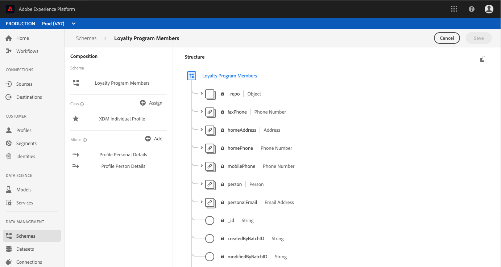

# (Alpha) Konfigurieren eines berechneten Attributfelds in der Benutzeroberfläche

>[!IMPORTANT]
>
>Die Funktion für berechnete Attribute ist derzeit alphanumerisch und steht nicht allen Benutzern zur Verfügung. Dokumentation und Funktionalitäten können sich ändern.

Um ein berechnetes Attribut zu konfigurieren, müssen Sie zunächst das Feld ermitteln, das den berechneten Attributwert enthält. Dieses Feld kann mithilfe einer Schemafeldgruppe erstellt werden, um das Feld einem vorhandenen Schema hinzuzufügen, oder durch Auswahl eines Felds, das Sie bereits in einem Schema definiert haben.

>[!NOTE]
>
>Berechnete Attribute können nicht zu Feldern in von der Adobe definierten Feldgruppen hinzugefügt werden. Das Feld muss sich im `tenant`-Namespace befinden, d. h. es muss ein Feld sein, das Sie definieren und einem Schema hinzufügen.

Um ein berechnetes Attributfeld erfolgreich zu definieren, muss das Schema aktiviert sein für [!DNL Profile] und erscheinen als Teil des Vereinigungsschemas für die Klasse, auf der das Schema basiert. Weitere Informationen finden Sie unter [!DNL Profile]-aktivierte Schemata und Vereinigungen, lesen Sie bitte den Abschnitt der [!DNL Schema Registry] Abschnitt zum Entwicklerhandbuch [Aktivieren eines Schemas für Profil und Anzeigen von Vereinigungsschemas](../../xdm/api/getting-started.md). Außerdem empfehlen wir Ihnen, den [Abschnitt über Vereinigungen](../../xdm/schema/composition.md) in der Grundlagendokumentation zur Schemakomposition zu lesen.

Der Workflow in diesem Tutorial verwendet eine [!DNL Profile]-aktiviertes Schema und führt die Schritte zum Definieren einer neuen Feldergruppe aus, die das berechnete Attributfeld enthält, und zum Sicherstellen, dass es sich um den richtigen Namespace handelt. Wenn Sie bereits über ein Feld verfügen, das sich in einem Profil-aktivierten Schema im richtigen Namespace befindet, können Sie direkt mit dem [Erstellen eines berechneten Attributs](#create-a-computed-attribute) fortfahren.

## Schema anzeigen

Die folgenden Schritte verwenden die Adobe Experience Platform-Benutzeroberfläche, um ein Schema zu suchen, eine Feldergruppe hinzuzufügen und ein Feld zu definieren. Wenn Sie die [!DNL Schema Registry] API, siehe [Entwicklerhandbuch zur Schema Registry](../../xdm/api/getting-started.md) Anweisungen zum Erstellen einer Feldergruppe, Hinzufügen einer Feldergruppe zu einem Schema und Aktivieren eines Schemas zur Verwendung mit [!DNL Real-Time Customer Profile].

Klicken Sie in der Benutzeroberfläche in der linken Leiste auf **[!UICONTROL Schemas]** und nutzen Sie die Suchleiste auf dem Tab **[!UICONTROL Durchsuchen]**, um das Schema, das Sie aktualisieren möchten, zu suchen.

Nachdem Sie das Schema gefunden haben, klicken Sie auf seinen Namen, um die [!DNL Schema Editor] wo Sie das Schema bearbeiten können.

## Erstellen Sie eine Feldergruppe

Um eine neue Feldergruppe zu erstellen, klicken Sie auf **[!UICONTROL Hinzufügen]** neben **[!UICONTROL Feldergruppen]** im **[!UICONTROL Komposition]** auf der linken Seite des Editors. Dadurch wird die **[!UICONTROL Feldergruppe hinzufügen]** Dialogfeld, in dem Sie vorhandene Feldergruppen sehen können. Klicken Sie auf die Optionsschaltfläche für **[!UICONTROL Neue Feldergruppe erstellen]** um Ihre neue Feldergruppe zu definieren.

Geben Sie der Feldergruppe einen Namen und eine Beschreibung und klicken Sie auf **[!UICONTROL Feldergruppe hinzufügen]** wenn abgeschlossen.

## Berechnetes Attributfeld für das Schema hinzufügen

Ihre neue Feldergruppe sollte jetzt im[!UICONTROL Feldergruppen]&quot; Abschnitt unter &quot;[!UICONTROL Komposition]&quot;. Klicken Sie auf den Namen der Feldergruppe und mehrere **[!UICONTROL Feld hinzufügen]** -Schaltflächen werden im **[!UICONTROL Struktur]** des Editors.

Wählen Sie neben dem Namen des Schemas **[!UICONTROL Feld hinzufügen]**, um ein Feld der obersten Ebene hinzuzufügen. Alternativ können Sie das Feld an einer beliebigen Stelle im gewünschten Schema einfügen.

Nachdem Sie auf **[!UICONTROL Feld hinzufügen]** geklickt haben, wird ein neues Objekt mit dem Namen Ihrer Mandantenkennung geöffnet. Dies zeigt, dass sich das Feld im richtigen Namespace befindet. Innerhalb des Objekts wird ein **[!UICONTROL neues Feld]** angezeigt. Dies ist das Feld, in dem Sie das berechnete Attribut definieren werden.

## Feld konfigurieren

Geben Sie im Abschnitt **[!UICONTROL Feldeigenschaften]** auf der rechten Seite des Editors die erforderlichen Daten für das neue Feld ein, einschließlich Name, Anzeigename und Typ.

>[!NOTE]
>
>Der Typ für das Feld muss mit dem Typ des berechneten Attributwerts übereinstimmen. Wenn der berechnete Attributwert beispielsweise eine Zeichenfolge ist, muss auch das im Schema definierte Feld eine Zeichenfolge sein.

Wenn Sie fertig sind, klicken Sie auf **[!UICONTROL Übernehmen]**. Daraufhin werden der Name des Felds sowie der Typ im Abschnitt **[!UICONTROL Struktur]** des Editors angezeigt.

## Schema aktivieren für [!DNL Profile]

Bevor Sie fortfahren, stellen Sie sicher, dass das Schema für [!DNL Profile]. Klicken Sie im Bereich **[!UICONTROL Struktur]** des Editors auf den Namen des Schemas, um den Tab **[!UICONTROL Schemaeigenschaften]** anzuzeigen. Wenn die Variable **[!UICONTROL Profil]** blau ist, wurde das Schema für [!DNL Profile].

>[!NOTE]
>
>Aktivieren eines Schemas für [!DNL Profile] kann nicht rückgängig gemacht werden. Wenn Sie also nach der Aktivierung auf den Regler klicken, riskieren Sie nicht, ihn zu deaktivieren.

Jetzt können Sie auf **[!UICONTROL Speichern]** klicken, um das aktualisierte Schema zu speichern und mit dem Rest des Tutorials unter Nutzung der API fortzufahren.

## Nächste Schritte

Nachdem Sie ein Feld erstellt haben, in dem Ihr berechneter Attributwert gespeichert wird, können Sie das berechnete Attribut mit dem `/computedattributes` API-Endpunkt. Ausführliche Anweisungen zum Erstellen eines berechneten Attributs in der API finden Sie in den Schritten unter [Handbuch zum API-Endpunkt für berechnete Attribute](ca-api.md).