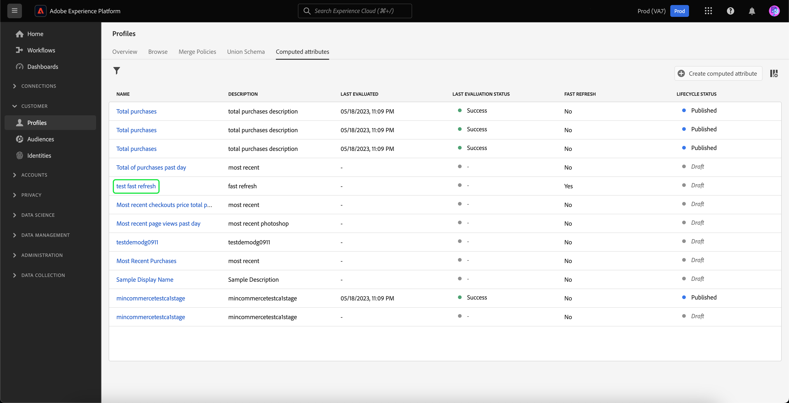

# Handbuch zur Benutzeroberfläche für berechnete Attribute

>[!NOTE]
>
>Um Zugriff auf berechnete Attribute zu erhalten, benötigen Sie die entsprechenden Berechtigungen (**Berechnete Attribute anzeigen** und **Berechnete Attribute verwalten**). Weitere Informationen zu den erforderlichen Berechtigungen finden Sie im Abschnitt [Zugriffssteuerungsdokumentation](../../access-control/home.md). Informationen zum Anwenden dieser Berechtigungen finden Sie in der [Berechtigungshandbuch verwalten](../../access-control/ui/permissions.md).

In Adobe Experience Platform sind berechnete Attribute Funktionen zum Aggregieren von Daten auf Ereignisebene in Profilattributen. Diese Funktionen werden automatisch berechnet, sodass sie für die Segmentierung, Aktivierung und Personalisierung verwendet werden können.

Dieses Dokument enthält eine Anleitung zum Erstellen und Aktualisieren berechneter Attribute mithilfe der Adobe Experience Platform-Benutzeroberfläche.

## Erste Schritte

Dieses UI-Handbuch setzt ein Verständnis der verschiedenen [!DNL Experience Platform] Verwaltungsdienste [!DNL Real-Time Customer Profiles]. Bevor Sie dieses Handbuch lesen oder in der Benutzeroberfläche arbeiten, lesen Sie bitte die Dokumentation für die folgenden Dienste:

- [[!DNL Real-Time Customer Profile]](../home.md): Bietet ein einheitliches Echtzeit-Kundenprofil, das auf aggregierten Daten aus verschiedenen Quellen basiert.
- [[!DNL Experience Data Model (XDM) System]](../../xdm/home.md): Das standardisierte Framework, mit dem Kundenerlebnisdaten von [!DNL Experience Platform] organisiert werden.

## Berechnete Attribute anzeigen {#view}

Wählen Sie in der Experience Platform-Benutzeroberfläche **[!UICONTROL Profile]** im linken Navigationsbereich, gefolgt von **[!UICONTROL Berechnete Attribute]** um eine Liste der für Ihr Unternehmen verfügbaren berechneten Attribute anzuzeigen. Dazu gehören Informationen zum Namen, zur Beschreibung, zum letzten Auswertungsdatum und zum letzten Auswertungsstatus des berechneten Attributs.

![Die [!UICONTROL Profil] und [!UICONTROL Berechnete Attribute] -Registerkarten hervorgehoben sind, die Benutzern zeigen, wie sie auf die Seite zum Durchsuchen berechneter Attribute zugreifen können.](./images/ui/browse.png)

Um auszuwählen, welche Felder angezeigt werden sollen, können Sie  um die Felder hinzuzufügen oder zu entfernen, die angezeigt werden sollen.

| Feld | Beschreibung |
| ----- | ----------- |
| [!UICONTROL Name] | Der Anzeigename des berechneten Attributs. |
| [!UICONTROL Beschreibung] | Die Beschreibung für das berechnete Attribut. |
| [!UICONTROL Auswertungsmethode] | Die Auswertungsmethode für das berechnete Attribut. Zu diesem Zeitpunkt **Batch** wird unterstützt. |
| [!UICONTROL Zuletzt ausgewertet] | Dieser Zeitstempel stellt den letzten erfolgreichen Evaluierungsablauf dar. Nur Ereignisse, die aufgetreten sind **before** dieser Zeitstempel wird bei der letzten erfolgreichen Bewertung berücksichtigt. |
| [!UICONTROL Letzter Bewertungsstatus] | Der Status, der angibt, ob das berechnete Attribut im letzten Bewertungslauf erfolgreich berechnet wurde oder nicht. Mögliche Werte sind **[!UICONTROL Erfolg]** oder **[!UICONTROL Fehlgeschlagen]**. |
| [!UICONTROL Häufigkeit der Aktualisierung] | Ein Hinweis darauf, wie häufig das berechnete Attribut aktualisiert werden soll. Mögliche Werte sind stündlich, täglich, wöchentlich oder monatlich. |
| [!UICONTROL Schnelle Aktualisierung] | Ein Wert, der anzeigt, ob für dieses Compute-Attribut eine schnelle Aktualisierung aktiviert ist. Wenn die schnelle Aktualisierung aktiviert ist, kann das berechnete Attribut täglich aktualisiert werden, nicht wöchentlich, zweimal wöchentlich oder monatlich. Dieser Wert gilt nur für berechnete Attribute mit einem Lookback-Zeitraum von mehr als einer Woche. |
| [!UICONTROL Lebenszyklusstatus] | Der aktuelle Status des berechneten Attributs. Es gibt drei mögliche Status: <ul><li>**[!UICONTROL Entwurf]:** Das berechnete Attribut **not** haben noch ein Feld für das Schema erstellt. In diesem Status kann das berechnete Attribut bearbeitet werden. </li><li>**[!UICONTROL Veröffentlicht]:** Das berechnete Attribut verfügt über ein Feld, das für das Schema erstellt wurde und zur Verwendung bereit ist. In diesem Status wird das berechnete Attribut **cannot** bearbeitet werden.</li><li>**[!UICONTROL Inaaktiv]:** Das berechnete Attribut ist deaktiviert. Weitere Informationen zum inaktiven Status finden Sie in der [FAQ-Seite](./faq.md#inactive-status). </li> |
| [!UICONTROL Erstellt] | Ein Zeitstempel, der das Datum und die Uhrzeit der Erstellung des berechneten Attributs anzeigt. |
| [!UICONTROL Zuletzt geändert] | Ein Zeitstempel, der das Datum und die Uhrzeit der letzten Änderung des berechneten Attributs anzeigt. |

Sie können auch die angezeigten berechneten Attribute basierend auf dem Lebenszyklusstatus filtern. Wählen Sie die  Symbol.

Sie können jetzt die berechneten Attribute nach Status filtern ([!UICONTROL Entwurf], [!UICONTROL Veröffentlicht], und [!UICONTROL Inaaktiv]).

![Die Optionen, nach denen Sie die berechneten Attribute filtern können, sind hervorgehoben. Zu diesen Optionen gehören [!UICONTROL Entwurf], [!UICONTROL Veröffentlicht], und [!UICONTROL Inaaktiv].](./images/ui/view-filters.png)

Darüber hinaus können Sie ein berechnetes Attribut auswählen, um genauere Informationen dazu anzuzeigen. Weitere Informationen zur Detailseite für berechnete Attribute finden Sie im Abschnitt [Detailabschnitt eines berechneten Attributs anzeigen](#view-details).

## Berechnetes Attribut erstellen {#create}

Um ein neues berechnetes Attribut zu erstellen, wählen Sie **[!UICONTROL Berechnetes Attribut erstellen]** um den neuen Workflow für berechnete Attribute aufzurufen.

![Die [!UICONTROL Berechnete Attribute erstellen] -Schaltfläche hervorgehoben ist, sodass Benutzer erfahren, wie sie die Seite &quot;Berechnetes Attribut erstellen&quot;erreichen.](./images/ui/create.png)

Die **[!UICONTROL Berechnetes Attribut erstellen]** angezeigt. Auf dieser Seite können Sie die grundlegenden Informationen für das berechnete Attribut hinzufügen, das Sie erstellen möchten.

| Feld | Beschreibung |
| ----- | ----------- |
| [!UICONTROL Anzeigename] | Der Name, durch den das berechnete Attribut bekannt sein wird. Dieser Anzeigename sollte für jedes berechnete Attribut eindeutig sein. Als Best Practice sollte dieser Anzeigename Kennungen zum berechneten Attribut enthalten. Beispielsweise &quot;Summe der Käufe für Schuhe in den letzten sieben Tagen&quot;. |
| [!UICONTROL Feldname] | Ein Name, mit dem auf das berechnete Attribut in anderen nachgelagerten Diensten verwiesen wird. Dieser Name wird automatisch aus dem Anzeigenamen abgeleitet und in camelCase geschrieben. |
| [!UICONTROL Beschreibung] | Eine Beschreibung des berechneten Attributs, das Sie erstellen möchten. |

![Die [!UICONTROL Basisinformationen] Abschnitt [!UICONTROL Berechnetes Attribut erstellen] -Seite markiert ist.](./images/ui/basic-information.png)

Nachdem Sie die berechneten Attributdetails hinzugefügt haben, können Sie mit der Definition Ihrer Regeln beginnen.

### Filterbedingungen für Ereignisse festlegen

Um eine Regel zu erstellen, wählen Sie zunächst Attribute aus der **[!UICONTROL Veranstaltungen]** , um Ereignisse zu filtern, die aggregiert werden sollen. Derzeit werden nur Ereignisattribute vom Typ Nicht-Array unterstützt.

![Die [!UICONTROL Veranstaltungen] -Abschnitt markiert ist.](./images/ui/events.png)

Nachdem Sie das Attribut ausgewählt haben, das in der Definition des berechneten Attributs verwendet werden soll, können Sie auswählen, mit welchem Wert dieser Wert verglichen werden soll.

### Aggregationsfunktion anwenden

Jetzt können Sie eine Funktion aus der bedingten Ausgabe auf das Feld anwenden. Wählen Sie zunächst den Aggregations-Funktionstyp aus. Verfügbare Optionen umfassen [!UICONTROL Summe], [!UICONTROL Min], [!UICONTROL Max], [!UICONTROL Count], und [!UICONTROL Zuletzt verwendet]. Weitere Informationen zu diesen Funktionen finden Sie im [Funktionsteil](./overview.md#functions) der Übersicht über berechnete Attribute.

Nach Auswahl einer Funktion können Sie das zu aggregierende Feld auswählen. Die auszuwählenden Felder hängen von der ausgewählten Funktion ab.

### Lookback-Dauer

Nach Anwendung der Aggregationsfunktion müssen Sie den Lookback-Zeitraum des berechneten Attributs definieren. Dieser Lookback-Zeitraum gibt die Zeitdauer an, für die Sie Ereignisse aggregieren möchten. Diese Lookback-Dauer kann in Stunden, Tagen, Wochen oder Monaten angegeben werden.

### Schnelle Aktualisierung {#fast-refresh}

>[!CONTEXTUALHELP]
>id="platform_profile_computedAttributes_fastRefresh"
>title="Schnelle Aktualisierung"
>abstract="Mit der schnellen Aktualisierung können Sie Ihre Attribute auf dem neuesten Stand halten. Wenn Sie diese Option aktivieren, können Sie Ihre berechneten Attribute täglich aktualisieren, auch über längere Lookback-Zeiträume, sodass Sie schnell auf Benutzeraktivitäten reagieren können. Dieser Wert gilt nur für berechnete Attribute mit einem Lookback-Zeitraum von mehr als einer Woche."

Bei Anwendung der Aggregationsfunktion können Sie eine schnelle Aktualisierung aktivieren, wenn der Lookback-Zeitraum größer als eine Woche ist.

![Die [!UICONTROL Schnelles Aktualisieren] markiert ist.](./images/ui/enable-fast-refresh.png)

Mit der schnellen Aktualisierung können Sie Ihre Attribute auf dem neuesten Stand halten. Wenn Sie diese Option aktivieren, können Sie Ihre berechneten Attribute täglich aktualisieren, auch über längere Lookback-Zeiträume, sodass Sie schnell auf Benutzeraktivitäten reagieren können.

Weitere Informationen zur schnellen Aktualisierung finden Sie im [Bereich für schnelle Aktualisierung](./overview.md#fast-refresh) der Übersicht über berechnete Attribute.

Nach Abschluss dieser Schritte können Sie dieses berechnete Attribut nun entweder als Entwurf speichern oder es sofort veröffentlichen.

![Die [!UICONTROL Als Entwurf speichern] und [!UICONTROL Veröffentlichen] -Schaltflächen hervorgehoben sind.](./images/ui/draft-or-publish.png)

## Details eines berechneten Attributs anzeigen {#view-details}

Um die Details eines berechneten Attributs anzuzeigen, wählen Sie das berechnete Attribut aus, für das Details zum [!UICONTROL **Durchsuchen**] Seite.

Der Inhalt der Seite unterscheidet sich je nachdem, ob das berechnete Attribut **[!UICONTROL Veröffentlicht]** oder **[!UICONTROL Entwurf]**.

### Veröffentlichtes berechnetes Attribut {#published}

Bei der Auswahl eines veröffentlichten berechneten Attributs wird die Detailseite für berechnete Attribute angezeigt.

Auf dieser Seite werden eine Zusammenfassung der Details des berechneten Attributs sowie ein Diagramm mit der Wertverteilung sowie Beispielprofilen angezeigt, die für das berechnete Attribut qualifiziert sind.

>[!NOTE]
>
>Die Werteverteilung spiegelt die Verteilung der Attributwerte für Profile zum Zeitpunkt des Sampling-Auftrags wider. Der berechnete Attributwert im Beispielprofil spiegelt den neuesten zusammengeführten Profilwert für einige Beispielprofile wider.

### Berechnetes Entwurfsattribut {#draft}

Bei der Auswahl eines Entwurfs für ein berechnetes Attribut muss die **[!UICONTROL Berechnete Attribute bearbeiten]** angezeigt. Diese Seite ähnelt der [!UICONTROL Berechnete Attribute erstellen] können Sie die grundlegenden Informationen Ihres berechneten Attributs sowie dessen Definition bearbeiten, bevor Sie den Entwurf aktualisieren oder veröffentlichen.

![Die [!UICONTROL Berechnete Attribute bearbeiten] angezeigt.](./images/ui/edit.png)

## Berechnete Attribute verwenden {#usage}

Nachdem Sie ein berechnetes Attribut erstellt haben, können Sie **veröffentlicht** berechnete Attribute in anderen nachgelagerten Diensten. Da berechnete Attribute Profilattributfelder sind, die in Ihrem Profilvereinigungsschema erstellt wurden, können Sie berechnete Attributwerte für ein Echtzeit-Kundenprofil nachschlagen, sie in einer Zielgruppe verwenden, sie für ein Ziel aktivieren oder sie zur Personalisierung in Journey in Adobe Journey Optimizer verwenden.

## Nächste Schritte

Weitere Informationen zu berechneten Attributen finden Sie in der [Übersicht über berechnete Attribute](./overview.md). Informationen zum Erstellen und Konfigurieren berechneter Attribute mithilfe der API finden Sie im Abschnitt [Entwicklerhandbuch für berechnete Attribute](./api.md).
