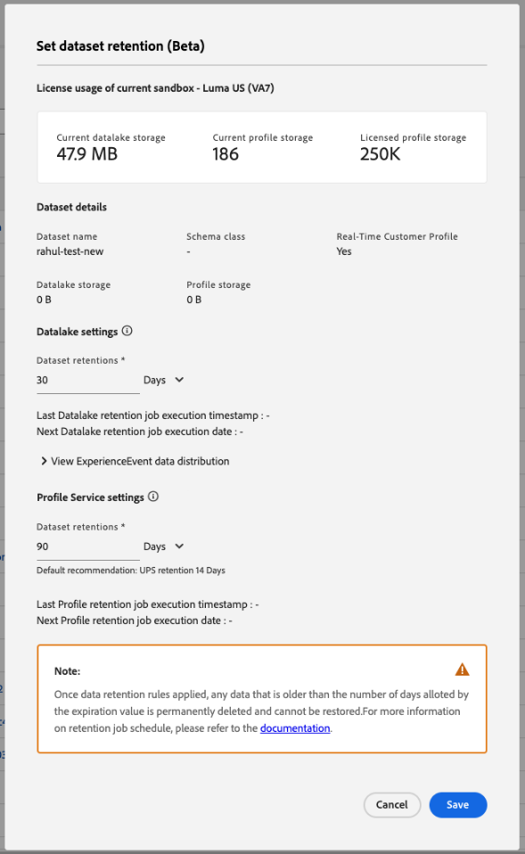

# Gültigkeitsdauern von Erlebnisereignissen

In Adobe Experience Platform können Sie Gültigkeitsdauern für alle Erlebnisereignisse konfigurieren, die in einen Datensatz aufgenommen werden, der für das Echtzeit[Kundenprofil aktiviert ](./home.md). Auf diese Weise können Sie automatisch Daten aus dem Profilspeicher entfernen, die für Ihre Anwendungsfälle nicht mehr gültig oder nützlich sind.

Informationen zum Verwalten der Gültigkeitsdauern von Erlebnisereignissen in Ihren Datensätzen finden Sie im [Handbuch zur Datensatz-Benutzeroberfläche](../catalog/datasets/user-guide.md#data-retention-policy).

 {width="500" zoomable="yes"}

>[!IMPORTANT]
>
>Gültigkeitsdauern von Erlebnisereignissen sind nicht mit Gültigkeitsdauern von Datensätzen zu verwechseln, bei denen nach Erreichen des Ablaufdatums der gesamte Datensatz gelöscht wird. Diese werden manuell über die [Adobe Experience Platform-Datenhygiene](../hygiene/home.md) konfiguriert.

## Automatisierter Prozess zur Gültigkeitsdauer

Nachdem Gültigkeitsdauern von Erlebnisereignissen für einen profilaktivierten Datensatz aktiviert wurden, wendet Experience Platform die Gültigkeitswerte für jedes erfasste Ereignis in einem zweistufigen Prozess automatisch an:

1. Bei allen neuen Daten, die in den Datensatz aufgenommen werden, wird der Ablaufwert zur Aufnahmezeit auf der Grundlage des Ereignis-Zeitstempels angewendet.
1. Für alle bereits vorhandenen Daten im Datensatz wird der Ablaufwert rückwirkend als einmaliger Systemauftrag zur Aufstockung angewendet. Sobald der Gültigkeitswert im Datensatz platziert wurde, werden Ereignisse, die älter als der Gültigkeitswert sind, bei Ausführung des Systemauftrags sofort gelöscht. Alle anderen Ereignisse werden entfernt, sobald sie ihre Gültigkeitswerte vom Zeitstempel des Ereignisses erreichen. Wenn alle Erlebnisereignisse entfernt wurden und das Profil keine Profilattribute mehr hat, ist das Profil nicht mehr vorhanden.

>[!WARNING]
>
>Nach der Anwendung werden alle Daten, die älter sind als die Anzahl der Tage, die entsprechend dem Gültigkeitswert zulässig sind, **permanent gelöscht** und können nicht wiederhergestellt werden.

Wenn Sie beispielsweise am 15. Mai einen Gültigkeitswert von 30 Tagen angewendet haben, würden die folgenden Schritte eintreten:

1. Für alle neuen Ereignisse wird bei der Aufnahme ein Gültigkeitswert von 30 Tagen angewendet.
1. Alle vorhandenen Ereignisse mit einem Zeitstempel, der vor dem 15. April liegt, werden mit dem Systemauftrag sofort gelöscht.
1. Alle vorhandenen Ereignisse mit einem Zeitstempel, der neuer als der 15. April ist, haben einen Gültigkeitswert von 30 Tagen ab ihrem Ereignis-Zeitstempel. Wenn ein Ereignis also einen Zeitstempel vom 18. April hat, wird es dreißig Tage nach dem Datum dieses Zeitstempels gelöscht, also am 18. Mai.

## Auswirkungen auf die Segmentierung

Sie müssen sicherstellen, dass sich die Lookback-Fenster für Ihre Zielgruppen innerhalb der Gültigkeitsgrenzen ihrer abhängigen Datensätze befinden, um die Ergebnisse genau zu halten. Wenn Sie beispielsweise einen Gültigkeitswert von 30 Tagen anwenden und eine Zielgruppe haben, die versucht, Daten von vor bis zu 45 Tagen anzuzeigen, ist die resultierende Zielgruppe wahrscheinlich ungenau.

Daher sollten Sie nach Möglichkeit für alle Datensätze denselben Gültigkeitswert für Erlebnisereignisse beibehalten, um die Auswirkungen verschiedener Gültigkeitswerte auf verschiedene Datensätze in Ihrer Segmentierungslogik zu vermeiden.

## Häufig gestellte Fragen {#faq}

Im folgenden Abschnitt finden Sie häufig gestellte Fragen zum Ablauf von Erlebnisereignisdaten:

### Für welche Mindestdauer kann ich einen Ablauf von Erlebnisereignisdaten festlegen?

Die Mindestdauer für den Ablauf von Erlebnisereignisdaten beträgt **Tag**.

### Wie unterscheidet sich Ablauf von Erlebnisereignisdaten vom Ablauf von Daten pseudonymer Profile?

Ablauf von Erlebnisereignisdaten und Ablauf von Daten pseudonymer Profile sind komplementäre Funktionen.

#### Granularität

Ablauf von Erlebnisereignisdaten funktioniert auf **Datensatz**-Ebene. Daher kann jeder Datensatz eine andere Datenablaufeinstellung haben.

Ablauf von Daten pseudonymer Profile funktioniert auf **Sandbox**-Ebene. Das bedeutet, dass sich der Ablauf von Daten auf alle Profile in der Sandbox auswirkt.

#### Identitätstypen

Ablauf von Erlebnisereignisdaten entfernt Ereignisse **nur** basierend auf dem Zeitstempel des Ereignisdatensatzes. Die darin enthaltenen Identity-Namespaces werden für den Zweck des Datenablaufs **ignoriert**.

Ablauf von Daten pseudonymer Profile berücksichtigt **nur** Profile mit Identitätsdiagrammen, die vom Kunden ausgewählte Identity-Namespaces enthalten, z. B. `ECID`, `AAID` oder andere Arten von Cookies. Wenn das Profil **irgendeine Art von** zusätzlichen Identity-Namespaces hat, die **nicht** in der ausgewählten Liste des Kunden waren, wird das Profil **nicht** gelöscht.

#### Entfernte Elemente

Ablauf von Erlebnisereignisdaten entfernt **nur** Ereignisse, **keine** Profilklassendaten. Die Profilklassendaten werden nur entfernt, wenn alle Daten über **alle** Datensätze hinweg entfernt werden und es **keine** Profilklassendatensätze gibt, die für das Profil verbleiben.

Ablauf von Daten pseudonymer Profile entfernt Ereignis- **und** Profildatensätze. Daher werden auch die Profilklassendaten entfernt.

### Wie kann Ablauf von Daten pseudonymer Profile in Verbindung mit Ablauf von Erlebnisereignisdaten verwendet werden?

Ablauf von Daten pseudonymer Profile und Ablauf von Erlebnisereignisdaten können komplementär zueinander verwendet werden.

Sie sollten **immer** Ablauf von Erlebnisereignisdaten in Ihren Datensätzen eingerichtet haben, je nach Ihrem Aufbewahrungsbedarf für die Daten Ihrer bekannten Kunden. Wenn Ablauf von Erlebnisereignisdaten eingerichtet ist, können Sie Ablauf von Daten pseudonymer Profile verwenden, um pseudonyme Profile automatisch zu entfernen. In der Regel ist der Datenablaufzeitraum für pseudonyme Profile kürzer als der Datenablaufzeitraum für Erlebnisereignisse.

Für einen typischen Anwendungsfall können Sie den Ablauf von Erlebnisereignisdaten auf der Grundlage der Werte Ihrer bekannten Benutzerdaten festlegen und für Ablauf von Daten pseudonymer Profile eine viel kürzere Dauer festlegen, um die Auswirkungen pseudonymer Profile auf die Einhaltung Ihrer Experience Platform-Lizenzverträge zu begrenzen.
