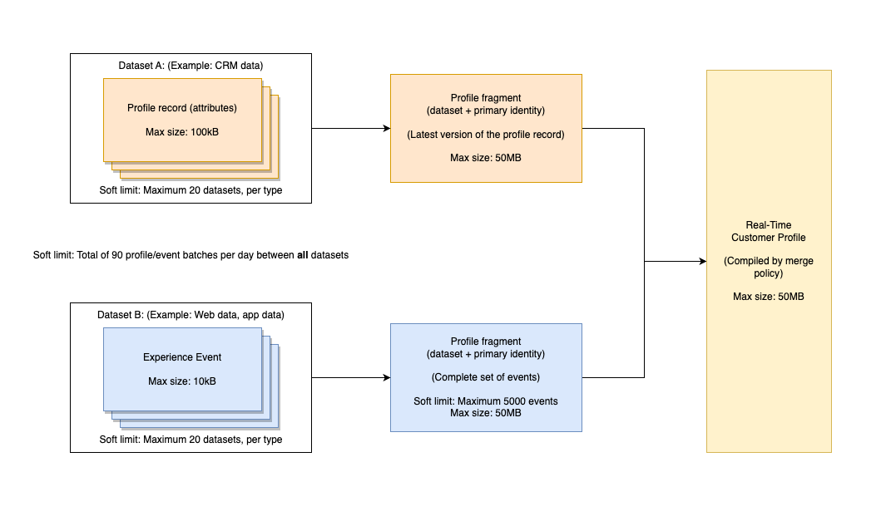

# Standardmäßige Limits für [!DNL Real-Time Customer Profile] Daten und Segmentierung

Mit Adobe Experience Platform können Sie personalisierte kanalübergreifende Erlebnisse bereitstellen, die auf verhaltensbezogenen Einblicken und Kundenattributen in Form von Echtzeit-Kundenprofilen basieren. Um diesen neuen Ansatz bei Profilen zu unterstützen, verwendet Experience Platform ein stark denormalisiertes Hybrid-Datenmodell, das sich vom herkömmlichen relationalen Datenmodell unterscheidet.

Dieses Dokument liefert standardmäßige Verwendungs- und Quotenbegrenzungen zur Hilfe bei der Modellierung Ihrer Profildaten, sodass eine optimale Systemleistung gewährleistet ist. Bei der Überprüfung der folgenden Leitplanken wird davon ausgegangen, dass Sie die Daten korrekt modelliert haben. Wenden Sie sich bei Fragen zum Modellieren Ihrer Daten an Ihren Kundenbetreuer.

>[!NOTE]
>
>Die meisten Kunden überschreiten diese Standardbeschränkungen nicht. Wenden Sie sich an Ihren Kundenbetreuer, wenn Sie mehr über benutzerdefinierte Beschränkungen erfahren möchten.

## Erste Schritte

Die folgenden Experience Platform-Services sind an der Modellierung von Echtzeit-Kundenprofildaten beteiligt:

* [[!DNL Real-Time Customer Profile]](home.md): Erstellen einheitlicher Verbraucherprofile anhand von Daten aus mehreren Quellen.
* [Identitäten](../identity-service/home.md): Überbrücken von Identitäten aus unterschiedlichen Datenquellen, während sie in Platform aufgenommen werden.
* [Schemata](../xdm/home.md): Experience-Datenmodell-Schemata (XDM) sind das standardisierte Framework, mit dem Platform Kundenerlebnisdaten organisiert.
* [Zielgruppen](../segmentation/home.md): Die Segmentierungsmaschine innerhalb von Platform wird verwendet, um Zielgruppen aus Ihren Kundenprofilen basierend auf dem Kundenverhalten und den Kundenattributen zu erstellen.

## Arten von Beschränkungen

In diesem Dokument gibt es zwei Arten von Standardbeschränkungen:

| Schutztyp | Beschreibung |
|----------|---------|
| **Leistungsgarantie (weiche Begrenzung)** | Leistungsgarantien sind Nutzungsbeschränkungen, die sich auf das Scoping Ihrer Anwendungsfälle beziehen. Wenn Sie die Leistungsgarantien überschreiten, kann es zu Leistungseinbußen und Latenzzeiten kommen. Adobe ist nicht für eine solche Leistungsbeeinträchtigung verantwortlich. Kunden, die eine Leistungsgarantie konsequent überschreiten, können zusätzliche Kapazität lizenzieren, um Leistungsbeeinträchtigungen zu vermeiden. |
| **Systemerzwungene Limits (Hard Limit)** | Systemerzwungene Limits werden von der Real-Time CDP-Benutzeroberfläche oder -API erzwungen. Dies sind Beschränkungen, die Sie nicht überschreiten können, da die Benutzeroberfläche und API Sie davon abhält oder einen Fehler zurückgibt. |

{style="table-layout:auto"}

>[!NOTE]
>
>Die in diesem Dokument dargelegten Beschränkungen werden ständig verbessert. Achten Sie regelmäßig auf Updates. Wenden Sie sich an Ihren Kundenbetreuer, wenn Sie mehr über benutzerdefinierte Beschränkungen erfahren möchten.

## Datenmodellbeschränkungen

Die folgenden Limits bieten empfohlene Einschränkungen bei der Modellierung von Echtzeit-Kundenprofildaten. Weitere Informationen zu primären Entitäten und Dimensionsentitäten finden Sie im Abschnitt zu [Entitätstypen](#entity-types) in der Anlage.

### Leitplanken für primäre Entitäten

| Leitplanke | Limit | Art von Limit | Beschreibung |
| --- | --- | --- | --- |
| XDM Individual Profile-Klassendatensätze | 20 | Leistungsgarantie | Es werden maximal 20 Datensätze empfohlen, die die XDM Individual Profile-Klasse nutzen. |
| XDM ExperienceEvent-Klassendatensätze | 20 | Leistungsgarantie | Es werden maximal 20 Datensätze empfohlen, die die XDM ExperienceEvent-Klasse nutzen. |
| Für Profil aktivierte Adobe Analytics Report Suite-Datensätze | 1 | Leistungsgarantie | Es sollte maximal ein (1) Analytics Report Suite-Datensatz für Profil aktiviert werden. Der Versuch, mehrere Analytics Report Suite-Datensätze für Profil zu aktivieren, kann unbeabsichtigte Auswirkungen auf die Datenqualität haben. Weitere Informationen finden Sie im Abschnitt zu [Adobe Analytics-Datensätzen](#aa-datasets) im Anhang. |
| Beziehungen mit mehreren Entitäten | 5 | Leistungsgarantie | Es werden maximal 5 Beziehungen mit mehreren Entitäten empfohlen, die in primären Entitäten oder Dimensionsentitäten definiert sind. Zusätzliche Beziehungszuordnungen sollten erst vorgenommen werden, wenn eine vorhandene Beziehung entfernt oder deaktiviert wurde. |
| JSON-Tiefe für ein ID-Feld, das in Beziehungen mit mehreren Entitäten verwendet wird | 4 | Leistungsgarantie | Die empfohlene maximale JSON-Tiefe für ein ID-Feld, das in Beziehungen mit mehreren Entitäten verwendet wird, ist 4. Dies bedeutet, dass in einem stark verschachtelten Schema Felder, die mehr als vier Ebenen tief verschachtelt sind, nicht als ID-Felder in einer Beziehung verwendet werden sollten. |
| Array-Kardinalität in einem Profilfragment | &lt;=500 | Leistungsgarantie | Die optimale Array-Kardinalität in einem Profilfragment (zeitunabhängige Daten) ist &lt;=500. |
| Array-Kardinalität in ExperienceEvent | &lt;=10 | Leistungsgarantie | Die optimale Array-Kardinalität in ExperienceEvent (Zeitreihendaten) ist &lt;=10. |
| Identitätsanzahl im Identitätsdiagramm eines einzelnen Profils | 50 | Systemerzwungene Limits | **Die maximale Anzahl von Identitäten in einem Identitätsdiagramm für ein einzelnes Profil ist 50.** Alle Profile mit mehr als 50 Identitäten sind von der Segmentierung, dem Export und der Suche ausgeschlossen. |

{style="table-layout:auto"}

### Leitplanken für Dimensionsentitäten

| Leitplanke | Limit | Art von Limit | Beschreibung |
| --- | --- | --- | --- |
| Keine Zeitreihendaten zulässig für Nicht-[!DNL XDM Individual Profile]-Entitäten | 0 | Systemerzwungene Limits | **Zeitreihendaten sind für Nicht-[!DNL XDM Individual Profile]-Entitäten im Profil-Service nicht zulässig.** Wenn ein Zeitreihen-Datensatz mit einer Nicht-[!DNL XDM Individual Profile]-ID verknüpft ist, sollte der Datensatz nicht für [!DNL Profile] aktiviert sein. |
| Keine verschachtelten Beziehungen | 0 | Leistungsgarantie | Sie sollten keine Beziehung zwischen zwei Nicht-[!DNL XDM Individual Profile]-Schemas erstellen. Die Möglichkeit, Beziehungen zu erstellen, wird für keine Schemas empfohlen, die nicht Teil des einheitlichen [!DNL Profile]-Schemas sind. |
| JSON-Tiefe für primäres ID-Feld | 4 | Leistungsgarantie | Die empfohlene maximale JSON-Tiefe für das primäre ID-Feld ist 4. Das bedeutet, dass Sie in einem stark verschachtelten Schema kein Feld als primäre ID auswählen sollten, wenn es mehr als vier Ebenen tief verschachtelt ist. Ein Feld, das sich auf der vierten verschachtelten Ebene befindet, kann als primäre ID verwendet werden. |

{style="table-layout:auto"}

## Datengrößenbeschränkungen

Die folgenden Leitplanken beziehen sich auf die Datengröße und bieten empfohlene Grenzwerte für Daten, die wie vorgesehen aufgenommen, gespeichert und abgefragt werden können. Weitere Informationen zu primären Entitäten und Dimensionsentitäten finden Sie im Abschnitt zu [Entitätstypen](#entity-types) in der Anlage.

>[!NOTE]
>
>Die Datengröße wird an den unkomprimierten Daten in JSON zum Zeitpunkt der Aufnahme gemessen.

### Leitplanken für primäre Entitäten

| Leitplanke | Limit | Art von Limit | Beschreibung |
| --- | --- | --- | --- |
| Maximale ExperienceEvent-Größe | 10 KB | Systemerzwungene Limits | **Die maximale Größe eines Ereignisses ist 10 KB.** Die Aufnahme wird fortgesetzt, jedoch werden alle Ereignisse, die größer als 10 KB sind, entfernt. |
| Maximale Größe von Profildatensätzen | 100 KB | Systemerzwungene Limits | **Die maximale Größe eines einzelnen Profildatensatzes ist 100 MB.** Die Aufnahme wird fortgesetzt, jedoch werden Profildatensätze, die größer als 100 KB sind, entfernt. |
| Maximale Größe von Profilfragmenten | 50 MB | Systemerzwungene Limits | **Die maximale Größe eines einzelnen Profldatensatzes ist 50 MB.** Die Segmentierung, der Export und die Suche können bei [Profilfragmenten](#profile-fragments), die größer als 50 MB sind, fehlschlagen. |
| Maximale Größe gespeicherter Profile | 50 MB | Leistungsgarantie | **Die maximale Größe eines gespeicherten Profils ist 50 MB.** Das Hinzufügen neuer [Profilfragmente](#profile-fragments) in einem Profil, das größer als 50 MB ist, wirkt sich negativ auf die Systemleistung aus. Beispielsweise könnte ein Profil ein einzelnes Fragment mit 50 MB enthalten oder mehrere Fragmente aus mehreren Datensätzen mit einer kombinierten Gesamtgröße von 50 MB. Der Versuch, ein Profil mit einem einzelnen Fragment, das größer als 50 MB ist, oder mit mehreren Fragmenten mit einer kombinierten Größe von mehr als 50 MB zu speichern, wirkt sich negativ auf die Systemleistung aus. |
| Anzahl der täglich aufgenommenen Profil- oder ExperienceEvent-Batches | 90 | Leistungsgarantie | **Die maximale Anzahl von Profil- oder ExperienceEvent-Batches, die pro Tag aufgenommen werden, beträgt 90.** Das bedeutet, dass die Gesamtanzahl der pro Tag aufgenommenen Profil- und ExperienceEvent-Batches 90 nicht überschreiten darf. Das Aufnehmen zusätzlicher Batches beeinträchtigt die Systemleistung. |
| Anzahl der ExperienceEvents pro Profildatensatz | 5.000 | Leistungsgarantie | **Die maximale Anzahl von ExperienceEvents pro Profildatensatz beträgt 5.000.** Profile mit mehr als 5000 ExperienceEvents werden **not** für die Segmentierung berücksichtigt werden. |

{style="table-layout:auto"}

### Leitplanken für Dimensionsentitäten

| Leitplanke | Limit | Art von Limit | Beschreibung |
| --- | --- | --- | --- |
| Gesamtgröße für alle dimensionalen Entitäten | 5 GB | Leistungsgarantie | Die empfohlene Gesamtgröße für alle dimensionalen Entitäten beträgt 5 GB. Die Aufnahme großer Dimensionsentitäten kann die Systemleistung beeinträchtigen. Es wird beispielsweise nicht empfohlen, einen 10 GB großen Produktkatalog als Dimensionsentität zu laden. |
| Datensätze pro Dimensionsentitätsschema | 5 | Leistungsgarantie | Es wird empfohlen, maximal 5 Datensätze mit jedem Dimensionsschema zu verknüpfen. Wenn Sie beispielsweise ein Schema für „Produkte“ erstellen und fünf beitragende Datensätze hinzufügen, sollten Sie keinen sechsten Datensatz erstellen, der mit dem Produktschema verknüpft ist. |
| Dimensionsentitäts-Batches, die pro Tag aufgenommen werden | 4 pro Entität | Leistungsgarantie | Die empfohlene maximale Anzahl von Dimensionsentitäts-Batches, die pro Tag aufgenommen werden, beträgt 4 pro Entität. Sie können beispielsweise Aktualisierungen an einem Produktkatalog bis zu 4-mal täglich aufnehmen. Die Aufnahme zusätzlicher Dimensionsentitäts-Batches für dieselbe Entität kann sich auf die Systemleistung auswirken. |

{style="table-layout:auto"}

## Leitplanken für die Segmentierung {#segmentation-guardrails}

Die in diesem Abschnitt beschriebenen Limits beziehen sich auf die Anzahl und Art der Zielgruppen, die eine Organisation innerhalb von Experience Platform erstellen kann, sowie auf die Zuordnung und Aktivierung von Zielgruppen zu Zielen.

| Leitplanke | Limit | Art von Limit | Beschreibung |
| --- | --- | --- | --- |
| Zielgruppen pro Sandbox | 4.000 | Leistungsgarantie | Eine Organisation kann insgesamt über 4.000 Zielgruppen verfügen, sofern in jeder Sandbox weniger als 4.000 Zielgruppen enthalten sind. Der Versuch, zusätzliche Zielgruppen zu erstellen, kann sich auf die Systemleistung auswirken. Mehr dazu [Erstellen von Zielgruppen](/help/segmentation/ui/segment-builder.md) durch den Segment-Builder. |
| Edge-Zielgruppen pro Sandbox | 150 | Leistungsgarantie | Eine Organisation kann insgesamt über mehr als 150 Edge-Zielgruppen verfügen, sofern in jeder einzelnen Sandbox weniger als 150 Edge-Zielgruppen enthalten sind. Der Versuch, zusätzliche Edge-Zielgruppen zu erstellen, kann sich auf die Systemleistung auswirken. Mehr dazu [Edge-Zielgruppen](/help/segmentation/ui/edge-segmentation.md). |
| Streaming-Zielgruppen pro Sandbox | 500 | Leistungsgarantie | Eine Organisation kann insgesamt über mehr als 500 Streaming-Zielgruppen verfügen, sofern in jeder einzelnen Sandbox weniger als 500 Streaming-Zielgruppen enthalten sind. Der Versuch, zusätzliche Streaming-Zielgruppen zu erstellen, kann die Systemleistung beeinträchtigen. Mehr dazu [Streaming-Zielgruppen](/help/segmentation/ui/streaming-segmentation.md). |
| Batch-Zielgruppen pro Sandbox | 4.000 | Leistungsgarantie | Eine Organisation kann insgesamt über mehr als 4.000 Batch-Zielgruppen verfügen, sofern in jeder einzelnen Sandbox weniger als 4.000 Batch-Zielgruppen enthalten sind. Der Versuch, zusätzliche Batch-Zielgruppen zu erstellen, kann sich auf die Systemleistung auswirken. |
| Konto-Zielgruppen pro Sandbox | 50 | Systemerzwungene Limits | Sie können nicht mehr als 50 Zielgruppen für ein Konto in einer Sandbox erstellen. Wenn Sie 50 Zielgruppen in einer Sandbox erreicht haben, wird die **[!UICONTROL Erstellen einer Zielgruppe]** -Kontrolle beim Versuch, eine neue Konto-Audience zu erstellen, deaktiviert ist. Mehr dazu [Kontozielgruppen](/help/segmentation/ui/account-audiences.md). |

{style="table-layout:auto"}

## Anhang

Dieser Abschnitt enthält zusätzliche Details zu den Limits in diesem Dokument.

### Entitätstypen

Das [!DNL Profile]-Datenspeichermodell besteht aus zwei Kernentitätstypen: [primäre Entitäten](#primary-entity) und [Dimensionselemente](#dimension-entity).

#### Primäre Entität

Eine primäre Entität oder Profilentität führt Daten zu einer &quot;einzigen Quelle der Wahrheit&quot;für eine Person zusammen. Diese einheitlichen Daten werden mithilfe einer so genannten „einheitlichen Ansicht“ dargestellt. Eine einheitliche Ansicht aggregiert die Felder aller Schemas, die dieselbe Klasse implementieren, in ein einziges einheitliches Schema. Das einheitliche Schema für [!DNL Real-Time Customer Profile] ist ein denormalisiertes Hybrid-Datenmodell, das als Container für alle Profilattribute und Verhaltensereignisse fungiert.

Zeitunabhängige Attribute, auch „Datensatzdaten “genannt, werden mithilfe von [!DNL XDM Individual Profile] modelliert, während die auch als „Ereignisdaten“ bezeichneten Zeitreihendaten mit [!DNL XDM ExperienceEvent] modelliert werden. Wenn Datensatz- und Zeitreihendaten in Adobe Experience Platform aufgenommen werden, dient dies als Trigger für [!DNL Real-Time Customer Profile], um mit der Aufnahme von Daten zu beginnen, die für diese Verwendung aktiviert wurden. Je mehr Interaktionen und Details erfasst werden, desto zuverlässiger werden die einzelnen Profile.

#### Entität der Dimension

Während der Profildatenspeicher, in dem Profildaten verwaltet werden, kein relativer Speicher ist, ermöglicht das Profil die Integration mit kleinen Dimensionselementen, um Zielgruppen auf vereinfachte und intuitive Weise zu erstellen. Diese Integration wird als [Segmentierung mehrerer Entitäten](../segmentation/multi-entity-segmentation.md) bezeichnet.

Ihr Unternehmen kann auch XDM-Klassen definieren, um abgesehen von Einzelpersonen auch andere Dinge zu beschreiben, z. B. Geschäfte, Produkte oder Eigenschaften. Diese Nicht-[!DNL XDM Individual Profile] Schemas werden als &quot;Dimensionselemente&quot;(auch als &quot;Lookup-Entitäten&quot;bezeichnet) bezeichnet und enthalten keine Zeitreihendaten. Schemas, die Dimensionentitäten darstellen, werden mithilfe von [Schemabeziehungen](../xdm/tutorials/relationship-ui.md).

Dimensionsentitäten stellen Suchdaten bereit, die Segmentdefinitionen mit mehreren Entitäten unterstützen und vereinfachen. Sie müssen klein genug sein, damit die Segmentierungsmaschine den gesamten Datensatz in den Speicher laden kann, um eine optimale Verarbeitung zu gewährleisten (schnelle Punktsuche).

### Profilfragmente

In diesem Dokument gibt es mehrere Leitplanken, die sich auf „Profilfragmente“ beziehen. Unter Experience Platform werden mehrere Profilfragmente zusammengeführt, um das Echtzeit-Kundenprofil zu bilden. Jedes Fragment stellt eine eindeutige primäre Identität und den entsprechenden Datensatz oder vollständigen Satz von Ereignisdaten für diese ID in einem bestimmten Datensatz dar. Weitere Informationen zu Profilfragmenten finden Sie in der [Profilübersicht](home.md#profile-fragments-vs-merged-profiles).

### Zusammenführungsrichtlinien {#merge-policies}

Beim Zusammenführen von Daten aus mehreren Quellen dienen als Zusammenführungsrichtlinien die Regeln, mit denen Platform bestimmt, wie Daten priorisiert werden und welche Daten kombiniert werden sollen, um eine einheitliche Ansicht zu schaffen. Wenn ein Kunde beispielsweise über mehrere Kanäle mit Ihrer Marke interagiert, verfügt Ihre Organisation über mehrere Profilfragmente, die sich auf diesen einzelnen Kunden beziehen und in mehreren Datensätzen enthalten sind. Wenn diese Fragmente in Platform aufgenommen werden, werden sie zusammengeführt, sodass ein zentrales Profil für diesen Kunden entsteht. Wenn die Daten aus mehreren Quellen in Konflikt stehen, bestimmt die Zusammenführungsrichtlinie, welche Informationen in das Profil für die Person aufgenommen werden sollen. Pro Organisation sind maximal fünf (5) Zusammenführungsrichtlinien zulässig. Weitere Informationen zu Zusammenführungsrichtlinien finden Sie in der [Übersicht über Zusammenführungsrichtlinien](merge-policies/overview.md).

### Adobe Analytics Report Suite-Datensätze in Platform {#aa-datasets}

Für Profil können mehrere Report Suites aktiviert werden, solange alle Datenkonflikte gelöst sind. Mit der Funktionalität zur Datenvorbereitung können Sie Datenkonflikte zwischen eVars, Listen und Eigenschaften beheben. Weitere Informationen zur Verwendung der Funktionalität zur Datenvorbereitung finden Sie im [Handbuch zur Adobe Analytics Connector-Benutzeroberfläche](../sources/tutorials/ui/create/adobe-applications/analytics.md).

## Nächste Schritte

Weitere Informationen zu anderen Limits für Experience Platform-Services, End-to-End-Latenzinformationen und Lizenzinformationen aus Real-Time CDP Product Description-Dokumenten finden Sie in der folgenden Dokumentation:

* [Limits in Real-Time CDP](/help/rtcdp/guardrails/overview.md)
* [End-to-End-Latenzdiagramme](https://experienceleague.adobe.com/docs/blueprints-learn/architecture/architecture-overview/deployment/guardrails.html?lang=en#end-to-end-latency-diagrams) für verschiedene Experience Platform-Dienste.
* [Real-time Customer Data Platform (B2C Edition - Prime und Ultimate Packages)](https://helpx.adobe.com/de/legal/product-descriptions/real-time-customer-data-platform-b2c-edition-prime-and-ultimate-packages.html)
* [Real-time Customer Data Platform (B2P - Prime und Ultimate Packages)](https://helpx.adobe.com/legal/product-descriptions/real-time-customer-data-platform-b2p-edition-prime-and-ultimate-packages.html)
* [Real-time Customer Data Platform (B2B - Prime und Ultimate Packages)](https://helpx.adobe.com/legal/product-descriptions/real-time-customer-data-platform-b2b-edition-prime-and-ultimate-packages.html)
