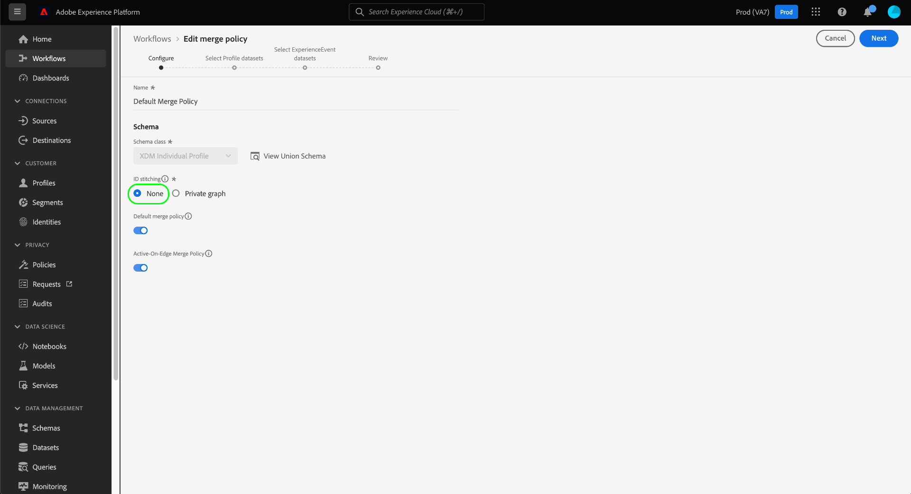

# Verarbeitung von Datenschutzanfragen in [!DNL Real-time Customer Profile]

Adobe Experience Platform [!DNL Privacy Service] verarbeitet Anfragen von Kunden, um auf ihre personenbezogenen Daten zuzugreifen, sie Opt-out zu verkaufen oder zu löschen, wie in Datenschutzbestimmungen wie der Allgemeinen Datenschutzverordnung (GDPR) und [!DNL California Consumer Privacy Act] (CCPA) definiert.

Dieses Dokument behandelt wesentliche Konzepte im Zusammenhang mit der Verarbeitung von Datenschutzanforderungen für [!DNL Real-time Customer Profile].

## Erste Schritte

Es wird empfohlen, die folgenden [!DNL Experience Platform]-Dienste zu verstehen, bevor Sie dieses Handbuch lesen:

* [[!DNL Privacy Service]](../privacy-service/home.md): Verwaltet Anfragen von Kunden hinsichtlich Zugriff auf, Opt-out vom Verkauf oder Löschen ihrer personenbezogenen Daten in allen Adobe Experience Cloud-Anwendungen.
* [[!DNL Identity Service]](../identity-service/home.md): Löst die grundlegende Herausforderung, die sich aus der Fragmentierung von Kundenerlebnisdaten ergibt, indem Identitäten zwischen Geräten und Systemen überbrückt werden.
* [[!DNL Real-time Customer Profile]](home.md): Bietet ein einheitliches, Echtzeit-Profil für Kunden, das auf aggregierten Daten aus mehreren Quellen basiert.

## Identitäts-Namespaces verstehen {#namespaces}

Adobe Experience Platform [!DNL Identity Service] überbrückt Identitätsdaten von Kunden über Systeme und Geräte hinweg. [!DNL Identity Service] verwendet  **Identitäts-** Namespacestes, um einen Kontext für Identitätswerte bereitzustellen, indem sie sie mit ihrem System der Herkunft verknüpfen. Ein Namespace kann ein allgemeines Konzept wie eine E-Mail-Adresse („E-Mail“) darstellen oder die Identität einer bestimmten Anwendung zuordnen, z. B. eine Adobe Advertising Cloud-ID („AdCloud“) oder eine Adobe Target-ID („TNTID“).

Der Identitätsdienst verwaltet einen Store von global definierten (Standard-) und benutzerdefinierten (benutzerdefinierten) Identitäts-Namensräumen. Standardmäßige Namensraum stehen für alle Unternehmen zur Verfügung (z. B. &quot;E-Mail&quot;und &quot;ECID&quot;), während Ihr Unternehmen benutzerdefinierte Namensraum erstellen kann, die den jeweiligen Anforderungen entsprechen.

Weitere Informationen zu Identitäts-Namensräumen in [!DNL Experience Platform] finden Sie unter [Übersicht über Identitäts-Namensraum](../identity-service/namespaces.md).

## Übermitteln von Anfragen {#submit}

Die folgenden Abschnitte beschreiben, wie Datenschutzanforderungen für [!DNL Real-time Customer Profile] mithilfe der [!DNL Privacy Service]-API oder -Benutzeroberfläche erstellt werden. Vor dem Lesen dieser Abschnitte wird dringend empfohlen, die [Privacy Service-API](../privacy-service/api/getting-started.md) oder [Privacy Service-Benutzeroberfläche](../privacy-service/ui/overview.md) zu lesen, um die vollständigen Schritte zum Senden eines Datenschutzauftrags zu erfahren, einschließlich der richtigen Formatierung gesendeter Benutzeridentitätsdaten in Anforderungs-Nutzdaten.

>[!IMPORTANT]
>
>Privacy Service kann nur [!DNL Profile]-Daten mithilfe einer Zusammenführungsrichtlinie verarbeiten, die keine Identitätszuordnung vornimmt. Wenn Sie die Benutzeroberfläche verwenden, um zu bestätigen, ob Ihre Datenschutzanforderungen verarbeitet werden, stellen Sie sicher, dass Sie eine Richtlinie mit dem Typ &quot;[!DNL None]&quot;als [!UICONTROL ID-Heftung] verwenden. Mit anderen Worten, Sie können keine Zusammenführungsrichtlinie verwenden, bei der [!UICONTROL ID stitching] auf &quot;[!UICONTROL Privates Diagramm]&quot;eingestellt ist.
>
>
>
>Es ist auch wichtig zu beachten, dass die Dauer, die eine Datenschutzanforderung dauern kann, nicht garantiert werden kann. Wenn Änderungen in Ihren [!DNL Profile]-Daten auftreten, während eine Anforderung noch verarbeitet wird, kann auch nicht garantiert werden, dass diese Datensätze verarbeitet werden.

### Verwenden der API

Beim Erstellen von Auftragsanforderungen in der API müssen alle IDs, die innerhalb von `userIDs` bereitgestellt werden, ein bestimmtes `namespace` und `type` verwenden. Ein gültiger [Identitätswert](#namespaces), der von [!DNL Identity Service] erkannt wird, muss für den `namespace`-Namensraum angegeben werden, während `type` entweder `standard` oder `unregistered` sein muss (für Standard- bzw. benutzerdefinierte Namensraum).

>[!NOTE]
>
>Je nach Identitätsdiagramm und der Verteilung der Fragmente in Plattformdatensätzen müssen Sie für jeden Profil möglicherweise mehr als eine ID angeben. Weitere Informationen finden Sie im nächsten Abschnitt [Profil-Fragmente](#fragments).

Darüber hinaus muss das `include`-Array der Anfrage-Payload die Produktwerte für die verschiedenen Datenspeicher enthalten, an die die Anfrage gesendet wird. Bei Anforderungen an [!DNL Data Lake] muss das Array den Wert &quot;ProfileService&quot;enthalten.

Die folgende Anforderung erstellt einen neuen Datenschutzauftrag für die Daten eines einzelnen Kunden im [!DNL Profile]-Store. Für den Kunden werden im Array `userIDs` zwei Identitätswerte bereitgestellt. einer mit dem Identitäts-Namensraum `Email` und der andere mit einem benutzerdefinierten Namensraum `Customer_ID`. Er enthält außerdem den Produktwert für [!DNL Profile] (`ProfileService`) im `include`-Array:

```shell
curl -X POST \
  https://platform.adobe.io/data/core/privacy/jobs \
  -H 'Authorization: Bearer {ACCESS_TOKEN}' \
  -H 'Content-Type: application/json' \
  -H 'x-api-key: {API_KEY}' \
  -H 'x-gw-ims-org-id: {IMS_ORG}' \
  -H 'x-sandbox-name: {SANDBOX_NAME}' \
  -d '{
    "companyContexts": [
      {
        "namespace": "imsOrgID",
        "value": "{IMS_ORG}"
      }
    ],
    "users": [
      {
        "key": "user12345",
        "action": ["access","delete"],
        "userIDs": [
          {
            "namespace": "Email",
            "value": "ajones@acme.com",
            "type": "standard"
          },
          {
            "namespace": "Customer_ID",
            "value": "12345678",
            "type": "unregistered"
          }
        ]
      }
    ],
    "include": ["ProfileService"],
    "expandIds": false,
    "priority": "normal",
    "analyticsDeleteMethod": "anonymize",
    "regulation": "ccpa"
}'
```

### Verwenden der UI

Wählen Sie beim Erstellen von Auftragsanforderungen in der Benutzeroberfläche unter **[!UICONTROL AEP Data Lake]** und/oder **[!UICONTROL Profil]** unter **[!UICONTROL Produkte]** aus, um Aufträge für die in [!DNL Data Lake] oder [!DNL Real-time Customer Profile] gespeicherten Daten zu verarbeiten.

<br>

## Fragmente von Profilen in Datenschutzanforderungen {#fragments}

Im [!DNL Profile]-Datenspeicher bestehen die personenbezogenen Daten eines einzelnen Profils oft aus mehreren Fragmenten, die über das Identitätsdiagramm mit der Person verknüpft sind. Beim Durchführen von Datenschutzanforderungen an den [!DNL Profile]-Store ist zu beachten, dass Anforderungen nur auf der Ebene des Profils und nicht auf dem gesamten Profil verarbeitet werden.

Betrachten Sie zum Beispiel eine Situation, in der Sie Kundenattributdaten in drei separaten Datensätzen speichern, die unterschiedliche IDs verwenden, um diese Daten mit einzelnen Kunden zu verknüpfen:

| Datensatzname | Primär-Identitätsfeld | Gespeicherte Attribute |
| --- | --- | --- |
| Datensatz 1 | `customer_id` | `address` |
| Datensatz 2 | `email_id` | `firstName`, `lastName` |
| Datensatz 3 | `email_id` | `mlScore` |

Einer der Datensätze verwendet `customer_id` als primären Bezeichner, während die anderen beiden `email_id` verwenden. Wenn Sie eine Datenschutzanforderung (Zugriff oder Löschen) nur mit `email_id` als Benutzer-ID-Wert senden möchten, werden nur die Attribute `firstName`, `lastName` und `mlScore` verarbeitet, während `address` davon nicht betroffen ist.

Um sicherzustellen, dass Ihre Datenschutzanforderungen alle relevanten Kundenattribute verarbeiten, müssen Sie die primären Identitätswerte für alle anwendbaren Datensätze angeben, in denen diese Attribute gespeichert werden können (bis zu neun IDs pro Kunde). Weitere Informationen zu Schemas, die häufig als Identitäten gekennzeichnet werden, finden Sie im Abschnitt zu Identitätsfeldern in den [Grundlagen der Elementzusammensetzung](../xdm/schema/composition.md#identity).

>[!NOTE]
>
>Wenn Sie unterschiedliche [Sandboxen](../sandboxes/home.md) verwenden, um Ihre [!DNL Profile]-Daten zu speichern, müssen Sie für jede Sandbox eine separate Datenschutzanfrage stellen, die den entsprechenden Sandbox-Namen in der `x-sandbox-name`-Kopfzeile angibt.

## Verarbeitung von Löschanfragen

Wenn [!DNL Experience Platform] eine Löschanforderung von [!DNL Privacy Service] erhält, sendet [!DNL Platform] eine Bestätigung an [!DNL Privacy Service], dass die Anforderung empfangen wurde und die betroffenen Daten zum Löschen markiert wurden. Die Datensätze werden dann aus dem [!DNL Data Lake]- oder [!DNL Profile]-Speicher entfernt, sobald der Datenschutzauftrag abgeschlossen ist. Während der Löschauftrag noch verarbeitet wird, werden die Daten weich gelöscht und stehen daher keinem [!DNL Platform]-Dienst zur Verfügung. Weitere Informationen zum Verfolgen von Auftragsstatus finden Sie in der [[!DNL Privacy Service] Dokumentation](../privacy-service/home.md#monitor).

>[!IMPORTANT]
>
>Bei einer erfolgreichen Löschanforderung werden zwar die erfassten Attributdaten eines Kunden (oder einer Gruppe von Kunden) entfernt, die Anforderung entfernt jedoch nicht die im Identitätsdiagramm festgelegten Verknüpfungen.
>
>Beispiel: Eine Löschanforderung, bei der `email_id` und `customer_id` eines Kunden verwendet werden, entfernt alle unter diesen IDs gespeicherten Attributdaten. Alle Daten, die danach unter dem gleichen `customer_id` erfasst werden, werden jedoch weiterhin mit dem entsprechenden `email_id` verknüpft, da die Verbindung noch vorhanden ist.

In zukünftigen Versionen sendet [!DNL Platform] eine Bestätigung an [!DNL Privacy Service], nachdem die Daten physisch gelöscht wurden.

## Nächste Schritte

Durch das Lesen dieses Dokuments wurden Sie zu den wichtigen Konzepten für die Verarbeitung von Datenschutzanforderungen in [!DNL Experience Platform] hinzugefügt. Wir empfehlen Ihnen, die Dokumentation in diesem Handbuch weiterzulesen, um Ihr Verständnis hinsichtlich der Verwaltung von Identitätsdaten und Erstellung von Datenschutzaufträgen zu vertiefen.

Informationen zur Verarbeitung von Datenschutzanforderungen für [!DNL Platform]-Ressourcen, die nicht von [!DNL Profile] verwendet werden, finden Sie im Dokument [Verarbeitung von Datenschutzanforderungen im Data Lake](../catalog/privacy.md).
