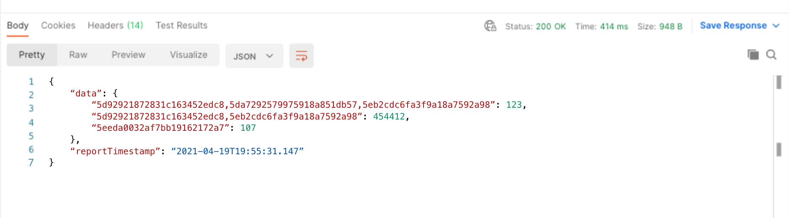

# Erstellen eines Berichts zur Datensatzüberschneidung

Der Bericht zur Datensatzüberschneidung bietet Einblick in die Zusammensetzung des [!DNL Profile]-Stores Ihres Unternehmens, indem er die Datensätze verfügbar macht, die am meisten zu Ihrer adressierbaren Zielgruppe (Profile) beitragen.

Dieser Bericht bietet nicht nur Einblicke in Ihre Daten, sondern ermöglicht Ihnen auch Maßnahmen zur Optimierung Ihrer Lizenznutzung, z. B. die Festlegung einer Beschränkung der Lebensdauer bestimmter Daten.

In diesem Tutorial werden die Schritte beschrieben, die zum Generieren des Berichts zur Datensatzüberlappung mithilfe der [!DNL Real-time Customer Profile]-API und zur Interpretation der Ergebnisse für Ihre Organisation erforderlich sind.

## Erste Schritte

Um Adobe Experience Platform-APIs verwenden zu können, müssen Sie zunächst das [Authentifizierungs-Tutorial](https://experienceleague.adobe.com/docs/experience-platform/landing/platform-apis/api-authentication.html?lang=de#platform-apis) abschließen, um die Werte zu erfassen, die Sie für die erforderlichen Kopfzeilen benötigen. Weitere Informationen zu Experience Platform-APIs finden Sie in der [Dokumentation zu den ersten Schritten mit Platform-APIs](../../landing/api-guide.md).

Die erforderlichen Kopfzeilen für alle API-Aufrufe in diesem Tutorial sind:

* `Authorization: Bearer {ACCESS_TOKEN}`: Für die  `Authorization` Kopfzeile ist ein Zugriffstoken erforderlich, dem das Wort vorangestellt  `Bearer`wird. Ein neuer Zugriffstoken-Wert muss alle 24 Stunden generiert werden.
* `x-api-key: {API_KEY}`: Die  `API Key` wird auch als bezeichnet  `Client ID` und ist ein Wert, der nur einmal generiert werden muss.
* `x-gw-ims-org-id: {IMS_ORG}`: Die  `IMS Org` wird auch als bezeichnet  `Organization ID` und muss nur einmal generiert werden.

Nachdem Sie das Authentifizierungs-Tutorial abgeschlossen und die Werte für die erforderlichen Kopfzeilen erfasst haben, können Sie mit dem Aufrufen der Echtzeit-Kunden-API beginnen.

## Bericht zur Datensatzüberschneidung über die Befehlszeile erstellen

Wenn Sie mit der Verwendung der Befehlszeile vertraut sind, können Sie die folgende cURL-Anfrage verwenden, um den Bericht zur Datensatzüberlappung zu generieren, indem Sie eine GET an `/previewsamplestatus/report/dataset/overlap` durchführen.

**Anfrage**

Die folgende Anfrage verwendet den Parameter `date` , um den letzten Bericht für das angegebene Datum zurückzugeben.

```shell
curl -X GET \
  https://platform.adobe.io/data/core/ups/previewsamplestatus/report/dataset/overlap?date=2021-04-19 \
  -H 'Authorization: Bearer {ACCESS_TOKEN}' \
  -H 'x-api-key: {API_KEY}' \
  -H 'x-gw-ims-org-id: {IMS_ORG}' \
```

| Parameter | Beschreibung |
|---|---|
| `date` | Geben Sie das Datum des zurückzugebenden Berichts an. Wenn am Datum mehrere Berichte ausgeführt wurden, wird der neueste Bericht für dieses Datum zurückgegeben. Wenn für das angegebene Datum kein Bericht vorhanden ist, wird der HTTP-Status-Fehler 404 (Nicht gefunden) zurückgegeben. Wenn kein Datum angegeben ist, wird der neueste Bericht zurückgegeben. Format: JJJJ-MM-TT. Beispiel: `date=2024-12-31` |

**Antwort**

Eine erfolgreiche Anfrage gibt den HTTP-Status 200 (OK) und den Bericht zur Datensatzüberlappung zurück. Der Bericht enthält ein `data` -Objekt, das kommagetrennte Listen mit Datensätzen und der zugehörigen Profilanzahl enthält. Weitere Informationen zum Lesen des Berichts finden Sie im Abschnitt [Interpretieren der Berichtdaten zur Datensatzüberlappung](#interpret-the-report) weiter unten in diesem Tutorial.

```json
{
    "data": {
        "5d92921872831c163452edc8,5da7292579975918a851db57,5eb2cdc6fa3f9a18a7592a98": 123,
        "5d92921872831c163452edc8,5eb2cdc6fa3f9a18a7592a98": 454412,
        "5eeda0032af7bb19162172a7": 107
    },
    "reportTimestamp": "2021-04-19T19:55:31.147"
}
```

### Erstellen Sie mit Postman einen Bericht zur Datensatzüberlappung.

Postman ist eine kollaborative Plattform für die API-Entwicklung und nützlich für die Visualisierung von API-Aufrufen. Sie können sie kostenlos von der [Postman-Website](https://www.postman.com) herunterladen und bietet eine benutzerfreundliche Benutzeroberfläche für die Ausführung von API-Aufrufen. Die folgenden Screenshots verwenden die Postman-Oberfläche.

**Anfrage**

Um den Bericht zur Datensatzüberschneidung mit Postman anzufordern, führen Sie die folgenden Schritte aus:

* Wählen Sie über das Dropdown-Menü GET als Anfragetyp aus.
* Geben Sie die erforderlichen Kopfzeilen in die Spalte `KEY` ein:
   * `Authorization`
   * `x-api-key`
   * `x-gw-ims-org-id`
* Geben Sie die Werte, die Sie bei der Authentifizierung generiert haben, in die Spalte `VALUE` ein, ersetzen Sie die Klammern (`{{ }}`) und alle Inhalte in den Klammern.
* Geben Sie den Anfragepfad mit oder ohne den optionalen Parameter `date` ein:
   `https://platform.adobe.io/data/core/ups/previewsamplestatus/report/dataset/overlap`\
   oder
   `https://platform.adobe.io/data/core/ups/previewsamplestatus/report/dataset/overlap?date=YYYY-MM-DD`

| Parameter | Beschreibung |
|---|---|
| `date` | Geben Sie das Datum des zurückzugebenden Berichts an. Wenn am Datum mehrere Berichte ausgeführt wurden, wird der neueste Bericht für dieses Datum zurückgegeben. Wenn für das angegebene Datum kein Bericht vorhanden ist, wird der HTTP-Status-Fehler 404 (Nicht gefunden) zurückgegeben. Wenn kein Datum angegeben ist, wird der neueste Bericht zurückgegeben. <br/>Format: JJJJ-MM-TT. Beispiel: `date=2024-12-31` |

Nachdem der Anfragetyp, die Kopfzeilen, Werte und der Pfad abgeschlossen sind, wählen Sie **Senden** aus, um die API-Anfrage zu senden und den Bericht zu generieren.


**Antwort**

Eine erfolgreiche Anfrage gibt den HTTP-Status 200 (OK) und den Bericht zur Datensatzüberlappung zurück. Der Bericht enthält ein `data` -Objekt, das kommagetrennte Listen mit Datensätzen und der zugehörigen Profilanzahl enthält. Weitere Informationen zum Lesen des Berichts finden Sie im Abschnitt [Interpretieren der Berichtdaten zur Datensatzüberlappung](#interpret-the-report).



## Interpretieren der Berichtsdaten zu Datensatzüberschneidungen {#interpret-the-report}

Der Bericht zur generierten Datensatzüberschneidung bietet einen Zeitstempel, der das Datum und die Uhrzeit des Berichts sowie ein Datenobjekt anzeigt, das eindeutige Kombinationen aus Datensatz-IDs als kommagetrennte Listen enthält. Die folgenden Abschnitte enthalten zusätzliche Informationen zu den Komponenten des Berichts.

### Zeitstempel des Berichts

`reportTimestamp` entspricht dem in der API-Anfrage angegebenen Datum oder, falls kein Datum angegeben wurde, dem Zeitstempel des letzten Berichts.

### Liste der Datensatz-IDs

Das `data` -Objekt enthält eindeutige Kombinationen aus Datensatz-IDs als kommagetrennte Listen mit der entsprechenden Profilanzahl für diese Kombination von Datensätzen.

>[!NOTE]
>
>Die Summe aller Profilzahlen, die mit jeder Zeile des Datensatzüberschneidungsberichts verknüpft sind, sollte der Gesamtanzahl der Profile in Ihrer Organisation entsprechen.

Um die Ergebnisse des Berichts zu interpretieren, sehen Sie sich folgendes Beispiel an:

```json
  "5d92921872831c163452edc8,5da7292579975918a851db57,5eb2cdc6fa3f9a18a7592a98": 123,
  "5d92921872831c163452edc8,5eb2cdc6fa3f9a18a7592a98": 454412,
  "5eeda0032af7bb19162172a7": 107
```

Dieser Bericht enthält die folgenden Informationen:

* Es gibt 123 Profile, die aus Daten aus den folgenden Datensätzen bestehen: `5d92921872831c163452edc8`, `5da7292579975918a851db57`, `5eb2cdc6fa3f9a18a7592a98`.
* Es gibt 454.412 Profile, die aus Daten aus diesen beiden Datensätzen bestehen: `5d92921872831c163452edc8` und `5eb2cdc6fa3f9a18a7592a98`.
* Es gibt 107 Profile, die nur aus Daten aus dem Datensatz `5eeda0032af7bb19162172a7` bestehen.
* Insgesamt gibt es 454.642 Profile in der Organisation.

## Nächste Schritte

Nach Abschluss dieses Tutorials können Sie jetzt den Bericht zur Datensatzüberlappung mithilfe der Echtzeit-Kundenprofil-API generieren. Um mehr über die Arbeit mit Profildaten sowohl in der API als auch in der Experience Platform-Benutzeroberfläche zu erfahren, lesen Sie zunächst die [Dokumentation zur Profilübersicht](../home.md).
