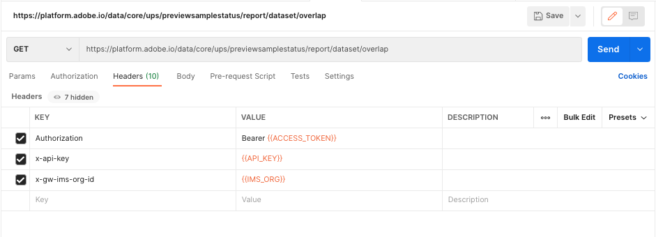

# Erstellen eines Berichts zur Datensatzüberschneidung

Der Bericht zur Datensatzüberschneidung bietet Einblick in die Zusammensetzung des [!DNL Profile] Ihres Unternehmens, indem er die Datensätze verfügbar macht, die am meisten zu Ihrer adressierbaren Zielgruppe (Profilen) beitragen.

Dieser Bericht bietet nicht nur Einblicke in Ihre Daten, sondern kann Ihnen auch bei Maßnahmen zur Optimierung Ihrer Lizenznutzung helfen, z. B. beim Festlegen einer Beschränkung der Lebensdauer bestimmter Daten.

In diesem Tutorial werden die Schritte beschrieben, die zum Generieren des Berichts zur Datensatzüberschneidung mithilfe der [!DNL Real-Time Customer Profile]-API und zur Interpretation der Ergebnisse für Ihr Unternehmen erforderlich sind.

## Erste Schritte

Um Adobe Experience Platform-APIs verwenden zu können, müssen Sie zunächst das [Authentifizierungs-Tutorial](https://experienceleague.adobe.com/docs/experience-platform/landing/platform-apis/api-authentication.html?lang=de) abschließen, um die Werte zu erfassen, die Sie für die erforderlichen Kopfzeilen benötigen. Weitere Informationen zu Experience Platform-APIs finden Sie in der Dokumentation [Erste Schritte mit Experience Platform-APIs](../../landing/api-guide.md).

Die erforderlichen Kopfzeilen für alle API-Aufrufe in diesem Tutorial sind:

* `Authorization: Bearer {ACCESS_TOKEN}`: Für die `Authorization`-Kopfzeile ist ein Zugriffstoken mit vorangestelltem Wort `Bearer` erforderlich. Alle 24 Stunden muss ein neuer Wert für das Zugriffs-Token generiert werden.
* `x-api-key: {API_KEY}`: Die `API Key` wird auch als `Client ID` bezeichnet und ist ein Wert, der nur einmal generiert werden muss.
* `x-gw-ims-org-id: {ORG_ID}`: Die Organisations-ID muss nur einmal generiert werden.

Nachdem Sie das Authentifizierungs-Tutorial abgeschlossen und die Werte für die erforderlichen Kopfzeilen erfasst haben, können Sie mit Aufrufen an die Echtzeit-Kunden-API beginnen.

## Bericht zur Datensatzüberschneidung mithilfe der Befehlszeile generieren

Wenn Sie mit der Verwendung der Befehlszeile vertraut sind, können Sie die folgende cURL-Anfrage verwenden, um den Bericht zur Datensatzüberschneidung zu generieren, indem Sie eine GET-Anfrage an `/previewsamplestatus/report/dataset/overlap` ausführen.

**Anfrage**

Die folgende Anfrage verwendet den `date`-Parameter, um den letzten Bericht für das angegebene Datum zurückzugeben.

```shell
curl -X GET \
  https://platform.adobe.io/data/core/ups/previewsamplestatus/report/dataset/overlap?date=2021-04-19 \
  -H 'Authorization: Bearer {ACCESS_TOKEN}' \
  -H 'x-api-key: {API_KEY}' \
  -H 'x-gw-ims-org-id: {ORG_ID}' \
```

| Parameter | Beschreibung |
|---|---|
| `date` | Geben Sie das Datum des zurückzugebenden Berichts an. Wenn am Datum mehrere Berichte ausgeführt wurden, wird der aktuelle Bericht für dieses Datum zurückgegeben. Wenn für das angegebene Datum kein Bericht vorhanden ist, wird der Fehler HTTP-Status 404 (Nicht gefunden) zurückgegeben. Wenn kein Datum angegeben wird, wird der letzte Bericht zurückgegeben. Format: JJJJ-MM-TT. Beispiel: `date=2024-12-31` |

**Antwort**

Bei einer erfolgreichen Anfrage wird der HTTP-Status 200 (OK) und der Bericht zur Datensatzüberschneidung zurückgegeben. Der Bericht enthält ein `data`, das kommagetrennte Listen von Datensätzen und die jeweilige Profilanzahl enthält. Weitere Informationen zum Lesen des Berichts finden Sie im Abschnitt [Interpretieren der Berichtsdaten zur Datensatzüberschneidung](#interpret-the-report) weiter unten in diesem Tutorial.

```json
{
    "data": {
        "5d92921872831c163452edc8,5da7292579975918a851db57,5eb2cdc6fa3f9a18a7592a98": 123,
        "5d92921872831c163452edc8,5eb2cdc6fa3f9a18a7592a98": 454412,
        "5eeda0032af7bb19162172a7": 107
    },
    "reportTimestamp": "2021-04-19T19:55:31.147"
}
```

### Erstellen eines Berichts zur Datensatzüberschneidung mit Postman

Postman ist eine kollaborative Plattform für die API-Entwicklung und nützlich für die Visualisierung von API-Aufrufen. Es kann kostenlos von der [Postman-Website heruntergeladen werden ](https://www.postman.com) bietet eine benutzerfreundliche Benutzeroberfläche zum Ausführen von API-Aufrufen. Die folgenden Screenshots verwenden die Benutzeroberfläche von Postman.

**Anfrage**

Um den Bericht zur Datensatzüberschneidung mit Postman anzufordern, führen Sie die folgenden Schritte aus:

* Wählen Sie in der Dropdown-Liste GET als Anfragetyp aus.
* Geben Sie die erforderlichen Kopfzeilen in die Spalte `KEY` ein:
   * `Authorization`
   * `x-api-key`
   * `x-gw-ims-org-id`
* Geben Sie die Werte, die Sie bei der Authentifizierung generiert haben, in die Spalte `VALUE` ein und ersetzen Sie dabei die geschweiften Klammern (`{{ }}`) und den gesamten Inhalt in den geschweiften Klammern.
* Geben Sie den Anfragepfad mit oder ohne den optionalen `date` ein:
  `https://platform.adobe.io/data/core/ups/previewsamplestatus/report/dataset/overlap`\
  oder
  `https://platform.adobe.io/data/core/ups/previewsamplestatus/report/dataset/overlap?date=YYYY-MM-DD`

| Parameter | Beschreibung |
|---|---|
| `date` | Geben Sie das Datum des zurückzugebenden Berichts an. Wenn am Datum mehrere Berichte ausgeführt wurden, wird der aktuelle Bericht für dieses Datum zurückgegeben. Wenn für das angegebene Datum kein Bericht vorhanden ist, wird der Fehler HTTP-Status 404 (Nicht gefunden) zurückgegeben. Wenn kein Datum angegeben wird, wird der letzte Bericht zurückgegeben. <br/>Format: JJJJ-MM-TT. Beispiel: `date=2024-12-31` |

Nachdem der Anfragetyp, die Kopfzeilen, Werte und der Pfad abgeschlossen sind, wählen Sie **Senden** aus, um die API-Anfrage zu senden und den Bericht zu generieren.



**Antwort**

Bei einer erfolgreichen Anfrage wird der HTTP-Status 200 (OK) und der Bericht zur Datensatzüberschneidung zurückgegeben. Der Bericht enthält ein `data`, das kommagetrennte Listen von Datensätzen und die jeweilige Profilanzahl enthält. Weitere Informationen zum Lesen des Berichts finden Sie im Abschnitt [Interpretieren der Berichtsdaten zur Datensatzüberschneidung](#interpret-the-report).


## Interpretieren der Berichtsdaten zur Datensatzüberschneidung {#interpret-the-report}

Der generierte Bericht zur Datensatzüberschneidung enthält einen Zeitstempel, der das Datum und die Uhrzeit des Berichts anzeigt, sowie ein Datenobjekt, das eindeutige Kombinationen von Datensatz-IDs als kommagetrennte Listen enthält. Die folgenden Abschnitte enthalten zusätzliche Informationen zu den Komponenten des Berichts.

### Zeitstempel des Berichts

Die `reportTimestamp` entspricht dem in der API-Anfrage angegebenen Datum oder, wenn kein Datum angegeben wurde, dem Zeitstempel des letzten Berichts.

### Liste der Datensatz-IDs

Das `data`-Objekt enthält eindeutige Kombinationen von Datensatz-IDs als kommagetrennte Listen mit der entsprechenden Profilanzahl für diese Kombination von Datensätzen.

>[!NOTE]
>
>Die Summe aller Profilzahlen, die mit jeder Zeile des Berichts zur Datensatzüberschneidung verknüpft sind, sollte der Gesamtzahl der Profile in Ihrer Organisation entsprechen.

Um die Ergebnisse des Berichts zu interpretieren, sehen Sie sich das folgende Beispiel an:

```json
  "5d92921872831c163452edc8,5da7292579975918a851db57,5eb2cdc6fa3f9a18a7592a98": 123,
  "5d92921872831c163452edc8,5eb2cdc6fa3f9a18a7592a98": 454412,
  "5eeda0032af7bb19162172a7": 107
```

Dieser Bericht enthält die folgenden Informationen:

* Es gibt 123 Profile, die aus Daten aus den folgenden Datensätzen bestehen: `5d92921872831c163452edc8`, `5da7292579975918a851db57`, `5eb2cdc6fa3f9a18a7592a98`.
* Es gibt 454.412 Profile, die aus Daten aus diesen beiden Datensätzen bestehen: `5d92921872831c163452edc8` und `5eb2cdc6fa3f9a18a7592a98`.
* Es gibt 107 Profile, die nur aus Daten aus Datensatz `5eeda0032af7bb19162172a7` bestehen.
* Es gibt insgesamt 454.642 Profile in der Organisation.

## Nächste Schritte

Nach Abschluss dieses Tutorials können Sie jetzt den Bericht zur Datensatzüberschneidung mit der Echtzeit-Kundenprofil-API generieren. Um mehr über die Verwendung von Profildaten in der API und der Experience Platform-Benutzeroberfläche zu erfahren, lesen Sie zunächst die [Dokumentation Profilübersicht](../home.md).
