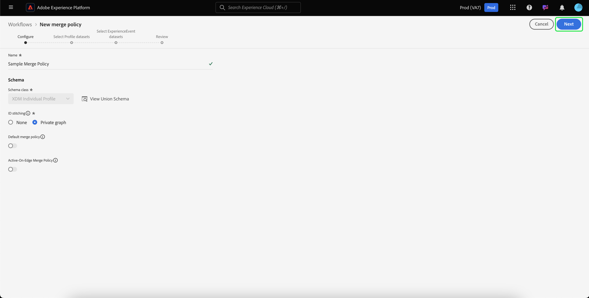

# Leitfaden zur Benutzeroberfläche &quot;Richtlinien zusammenführen&quot;

Mit Adobe Experience Platform können Sie Datenfragmente aus mehreren Quellen zusammenführen und kombinieren, um eine vollständige Ansicht Ihrer einzelnen Kunden zu erhalten. When bringing this data together, merge policies are the rules that [!DNL Platform] uses to determine how data will be prioritized and what data will be combined to create that unified view.

Wenn ein Kunde beispielsweise über mehrere Kanal mit Ihrer Marke interagiert, enthält Ihr Unternehmen mehrere Profil-Fragmente, die sich auf diesen einzelnen Kunden beziehen und in mehreren Datensätzen angezeigt werden. Wenn diese Fragmente in eine Plattform integriert werden, werden sie zusammengeführt, um ein einzelnes Profil für diesen Kunden zu erstellen. Wenn die Daten aus mehreren Quellen in Konflikt geraten (z. B. ein Fragment als &quot;Single&quot;, während die anderen Listen als &quot;verheiratet&quot;Liste werden), bestimmt die Richtlinie zum Zusammenführen, welche Informationen in das Profil für die betreffende Person aufgenommen werden sollen.

Über die RESTful APIs oder die Benutzeroberfläche können Sie neue Zusammenführungsrichtlinien erstellen, vorhandene Richtlinien verwalten und eine standardmäßige Zusammenführungsrichtlinie für Ihr Unternehmen einrichten. Dieses Handbuch enthält schrittweise Anleitungen zum Arbeiten mit Zusammenführungsrichtlinien über die Adobe Experience Platform-Benutzeroberfläche.

If you would prefer to work with merge policies using the [!DNL Real-time Customer Profile] API, please follow the instructions outlined in the [merge policies API guide](../api/merge-policies.md).

## Erste Schritte

Dieser Leitfaden erfordert ein funktionierendes Verständnis einiger wichtiger [!DNL Experience Platform] Funktionen. Bevor Sie diesem Handbuch folgen oder Profil-APIs verwenden, lesen Sie bitte die Dokumentation für die folgenden Dienste:

* [[!DNL Real-time Customer Profile]](../home.md): Bietet ein einheitliches, Echtzeit-Profil für Kunden, das auf aggregierten Daten aus mehreren Quellen basiert.
* [Adobe Experience Platform-Identitätsdienst](../../identity-service/home.md): Ermöglicht Kunden-Profil in Echtzeit durch Überbrückung von Identitäten aus unterschiedlichen Datenquellen, in die Daten eingehen [!DNL Platform].
* [[!DNL Experience Data Model] (XDM)](../../xdm/home.md): Das standardisierte Framework, mit dem Kundenerlebnisdaten [!DNL Platform] organisiert werden.

## Methoden zusammenführen {#merge-methods}

Jedes Profil-Fragment enthält Informationen zu nur einer Identität aus der Gesamtanzahl der Identitäten, die für eine Einzelperson vorhanden sein könnten. Beim Zusammenführen dieser Daten zu einem Profil eines Kunden besteht die Möglichkeit, dass diese Informationen kollidieren und eine Priorität angegeben werden muss. Wenn Sie eine Zusammenführungsmethode wählen, können Sie angeben, welche Datensatzattribute priorisiert werden sollen, wenn ein Zusammenführungskonflikt zwischen Datensätzen auftritt.

Für Zusammenführungsrichtlinien stehen zwei mögliche Zusammenführungsmethoden zur Verfügung. Jede dieser Methoden wird nachfolgend mit zusätzlichen Details in den folgenden Abschnitten zusammengefasst:

* **[!UICONTROL Zeitstempel bestellt]:** Im Ereignis eines Konflikts wird dem Profil-Fragment Priorität eingeräumt, das zuletzt aktualisiert wurde.
   * **Benutzerdefinierte Zeitstempel:** [!UICONTROL Der bestellte] Zeitstempel unterstützt auch benutzerdefinierte Zeitstempel, die beim Zusammenführen von Daten innerhalb desselben Datensatzes (mehrere Identitäten) oder über Datasets hinweg Vorrang vor Systemzeitstempeln haben. Weitere Informationen finden Sie im Abschnitt zur [Verwendung benutzerdefinierter Zeitstempel](#custom-timestamps).
* **[!UICONTROL Datensatzpriorität]:** Geben Sie im Ereignis eines Konflikts den Fragmenten des Profils Priorität, die auf dem Datensatz basieren, aus dem sie stammen. Bei Auswahl dieser Option müssen Sie die zugehörigen Datensätze und deren Reihenfolge der Priorität auswählen.

### Zeitstempel sortiert {#timestamp-ordered}

Während Profil-Datensätze in die Experience Platform aufgenommen werden, wird zum Zeitpunkt der Erfassung ein Systemzeitstempel abgerufen und dem Datensatz hinzugefügt. Wenn als Zusammenführungsmethode für eine Zusammenführungsrichtlinie der sortierte **[!UICONTROL Zeitstempel]** ausgewählt ist, werden Profil basierend auf dem Systemzeitstempel zusammengeführt. Das heißt, das Zusammenführen erfolgt auf der Grundlage des Zeitstempels für den Zeitpunkt, zu dem der Datensatz in die Plattform aufgenommen wurde.

#### Verwenden benutzerdefinierter Zeitstempel {#custom-timestamps}

Gelegentlich kann es zu Anwendungsfällen kommen, bei denen ein benutzerdefinierter Zeitstempel bereitgestellt werden muss und bei denen die Richtlinie zum Zusammenführen den benutzerdefinierten Zeitstempel und nicht den Systemzeitstempel berücksichtigen muss. Dazu gehören beispielsweise das Aufstocken von Daten oder das Sicherstellen der richtigen Reihenfolge von Ereignissen, wenn die Datensätze nicht mehr in der richtigen Reihenfolge angezeigt werden.

Um einen benutzerdefinierten Zeitstempel zu verwenden, muss das **[!UICONTROL externe Quellsystem-Audit-Details-Mixin]** Ihrem Profil-Schema hinzugefügt werden. Nach dem Hinzufügen kann der benutzerdefinierte Zeitstempel mithilfe des `lastUpdatedDate` Felds ausgefüllt werden. Wenn ein Datensatz mit dem ausgefüllten `lastUpdatedDate` Feld erfasst wird, verwendet die Experience Platform dieses Feld, um Datensätze über Datensätze hinweg zusammenzuführen. Wenn `lastUpdatedDate` kein oder kein Ausfüllen erfolgt, verwendet Platform weiterhin den Systemzeitstempel.

>[!NOTE]
>
>Sie müssen sicherstellen, dass der `lastUpdatedDate` Zeitstempel aufgefüllt wird, wenn Sie eine Aktualisierung für denselben Datensatz vornehmen.

Im folgenden Screenshot werden die Felder im [!UICONTROL Audit-Details des externen Quellsystems angezeigt]. Schrittweise Anleitungen zum Arbeiten mit Schemas mithilfe der Plattform-Benutzeroberfläche, einschließlich zum Hinzufügen von Mixins zu Schemas, finden Sie im [Lernprogramm zum Erstellen eines Schemas mithilfe der Benutzeroberfläche](../../xdm/tutorials/create-schema-ui.md).

Informationen zum Arbeiten mit benutzerdefinierten Zeitstempeln mit der API finden Sie im Abschnitt zum Verwenden von benutzerdefinierten Zeitstempeln im Abschnitt zum [Zusammenführen von Richtlinien-Endpunkten](../api/merge-policies.md#custom-timestamps).

### Datensatzpriorität {#dataset-precedence}

Wenn die **[!UICONTROL Datensatzpriorität]** als Zusammenführungsmethode für eine Zusammenführungsrichtlinie ausgewählt ist, können Sie Profil-Fragmenten anhand des Datensatzes, aus dem sie stammten, Priorität einräumen. Ein Beispiel bestünde darin, wenn es in Ihrer Organisation Daten in einem Datensatz gibt, die bevorzugt werden oder vertrauenswürdiger sind als Daten in einem anderen Datensatz.

Um eine Richtlinie zum Zusammenführen mithilfe der **[!UICONTROL Dataset-Priorität]** zu erstellen, müssen Sie die eingeschlossenen Profil- und ExperienceEvent-Datensätze auswählen und dann die Profil-Datasets manuell nach Priorität sortieren. Sobald die Datensätze ausgewählt und sortiert wurden, erhält der oberste Datensatz die höchste Priorität, der zweite Datensatz die zweithöchste usw.

## [!UICONTROL ID-Stiftung] {#id-stitching}

Identitätszuordnung ([!UICONTROL ID-Heftung]) ist der Vorgang, bei dem Datenfragmente identifiziert und zu einem vollständigen Profil zusammengefasst werden. Um die unterschiedlichen Stilverhalten zu veranschaulichen, sollten Sie einen einzelnen Kunden in Betracht ziehen, der mit einer Marke über zwei verschiedene E-Mail-Adressen interagiert.

* **[!UICONTROL Keine]:** Wenn diese Option aktiviert ist, werden IDs nicht zusammengeführt. Bei einer Segmentierung werden Identitäten, die zu derselben Person gehören, nicht zusammengeführt, und bei der Segmentierung werden die Attribute, die jeder einzelnen ID zugeordnet sind, nur berücksichtigt, wenn festgestellt wird, ob ein Kunde für eine Segmentmitgliedschaft infrage kommt. Dies könnte dazu führen, dass ein Kunde mehrere Profil hat und jedes Profil für verschiedene Segmente qualifiziert ist, sodass mehrere Marketingmeldungen an denselben Kunden gesendet werden.
* **[!UICONTROL Privates Diagramm]:** Wenn das private Diagramm ausgewählt ist, werden mehrere Identitäten, die sich auf dieselbe Person beziehen, miteinander verknüpft. Dies führt dazu, dass der Kunde über ein einzelnes Profil verfügt, und ermöglicht es der Segmentierung, mehrere Attribute aus mehreren verwandten Identitäten bei der Bestimmung der Segmentqualifikation zu berücksichtigen. In diesem Szenario verfügt der Kunde wahrscheinlich über ein einzelnes Profil, qualifiziert sich für ein Segment, das auf der Kombination von Attributen über Identitäten hinweg basiert, und erhält nur eine Marketing-Nachricht.

Um mehr über Identitäten und deren Rolle bei der Generierung von Profilen und Segmenten zu erfahren, lesen Sie zunächst die Übersicht über den [Identitätsdienst](../../identity-service/home.md).

## Standardrichtlinie für Zusammenführung {#default-merge-policy}

Ein Unternehmen kann eine Standardrichtlinie für die Zusammenführung von Profil-Fragmenten für sein Unternehmen erstellen. Auf diese Weise können Benutzer bei Aktionen in der Experience Platform, wie dem Anzeigen von Profilen oder dem Erstellen von Segmenten, ganz einfach die Standardrichtlinie auswählen. In den meisten Fällen wird die standardmäßige Zusammenführungsrichtlinie verwendet, sofern keine andere Richtlinie angegeben wurde.

Jedes Unternehmen kann mehrere Zusammenführungsrichtlinien für eine einzelne XDM-Schema-Klasse erstellen. Es kann jedoch nur eine Standardzusammenführungsrichtlinie für jede Klasse deklariert werden. Ihre Organisation könnte beispielsweise über eine Standardrichtlinie zum Zusammenführen für die [!DNL XDM Individual Profile] Klasse und eine andere Standardrichtlinie zum Zusammenführen für eine benutzerdefinierte Produktinventarklasse verfügen.

Wenn Sie eine neue Richtlinie für die Zusammenführung erstellen und diese als Standard festlegen, wird die vorherige Standardrichtlinie für die Zusammenführung automatisch vom System aktualisiert, sodass sie nicht mehr standardmäßig verwendet wird.

>[!WARNING]
>
>Profil-Zähler und Segmente mit einer vorhandenen, verknüpften Standardzusammenführungsrichtlinie können betroffen sein. Jedes Segment, für das eine Standardzusammenführungsrichtlinie angewendet wurde, wird auf die neue Standardrichtlinie für die Zusammenführung aktualisiert.

## Zusammenführungsrichtlinien anzeigen {#view-merge-policies}

In der [!DNL Experience Platform] Benutzeroberfläche können Sie mit der Arbeit mit Zusammenführungsrichtlinien beginnen, indem Sie im linken Navigationsbereich **[!UICONTROL Profil]** auswählen und dann die Registerkarte &quot;Richtlinien **[!UICONTROL zusammenführen]** &quot;auswählen. Auf dieser Registerkarte finden Sie eine Liste aller für Ihr Unternehmen geltenden Zusammenführungsrichtlinien sowie Details zu den einzelnen Zusammenführungsrichtlinien, einschließlich des Richtliniennamen, ob die Zusammenführungsrichtlinie die standardmäßige Zusammenführungsrichtlinie ist oder nicht, und die Schema-Klasse, auf die sich die Zusammenführungsrichtlinie bezieht.

To select which details are visible, or to add additional columns to the display, select **[!UICONTROL Configure columns]** and click on a column name to add or remove it from view.

## Zusammenführungsrichtlinie erstellen {#create-a-merge-policy}

Um eine neue Richtlinie für die Zusammenführung zu erstellen, wählen Sie auf der Registerkarte &quot;Zusammenführungsrichtlinien&quot;die Option &quot; **[!UICONTROL Richtlinie]** erstellen&quot;.

Im Bildschirm &quot;Arbeitsablauf für **[!UICONTROL neue Zusammenführungsrichtlinie]** &quot;können Sie wichtige Informationen zu Ihrer neuen Zusammenführungsrichtlinie in einer Reihe von Anleitungen bereitstellen.

### [!UICONTROL Konfigurieren von] {#configure}

Der erste Schritt im Arbeitsablauf ermöglicht es Ihnen, Ihre Zusammenführungsrichtlinie zu konfigurieren, indem Sie grundlegende Informationen bereitstellen. Zu diesen Informationen gehören:

* **[!UICONTROL Name]**: Der Name Ihrer Zusammenführungsrichtlinie sollte beschreibend, aber kurz sein.
* **[!UICONTROL Schema-Klasse]**: Die XDM-Schema-Klasse, die der Mergerichtlinie zugeordnet ist. Dies gibt die Schema-Klasse an, für die diese Zusammenführungsrichtlinie erstellt wird. Organisationen können mehrere Zusammenführungsrichtlinien pro Schema-Klasse erstellen. In der Benutzeroberfläche ist derzeit nur die [!UICONTROL XDM Individual Profil] -Klasse verfügbar.
* **[!UICONTROL ID-Zusammenfügung]**: In diesem Feld wird definiert, wie die verwandten Identitäten eines Kunden ermittelt werden. Weitere Informationen finden Sie im Abschnitt über die [ID-Zuordnung](#id-stitching) weiter oben in diesem Handbuch. Es gibt zwei mögliche Werte:
   * **[!UICONTROL Keine]**: Keine Identitätszusammenfügung durchführen.
   * **[!UICONTROL Privates Diagramm]**: Identitätszusammenfügung basierend auf Ihrem privaten Identitätsdiagramm durchführen.
* **[!UICONTROL Standardmäßige Zusammenführungsrichtlinie]**: Eine Umschalter-Schaltfläche, mit der Sie festlegen können, ob diese Zusammenführungsrichtlinie der Standard für Ihre Organisation sein soll oder nicht. Wenn der Selektor aktiviert ist, werden Sie in einer Warnmeldung aufgefordert, zu bestätigen, dass Sie die standardmäßige Fusionsrichtlinie Ihres Unternehmens ändern möchten. Weitere Informationen finden Sie im Abschnitt zu den [standardmäßigen Zusammenführungsrichtlinien](#default-merge-policy) weiter oben in diesem Handbuch.
   

Nachdem Sie die erforderlichen Felder ausgefüllt haben, können Sie &quot; **[!UICONTROL Weiter]** &quot;auswählen, um den Workflow fortzusetzen.

### [!UICONTROL Profil-Datensätze auswählen] {#select-profile-datasets}

Wählen Sie im Bildschirm &quot; **[!UICONTROL Profil-Datensätze]** auswählen&quot;die **[!UICONTROL Zusammenführungsmethode]** aus, die Sie für Ihre Zusammenführungsrichtlinie verwenden möchten. Außerdem wird auf dem Bildschirm die Gesamtzahl der [!UICONTROL Profil-Datensätze] in Ihrem Unternehmen angezeigt, die sich auf die im vorherigen Bildschirm ausgewählte Schema-Klasse beziehen.

Je nach der gewählten Zusammenführungsmethode werden alle Profil-Datensätze in der Reihenfolge zusammengeführt, in der sie zuletzt aktualisiert wurden (Zeitstempel sortiert). Andernfalls müssen Sie festlegen, welche Profil-Datensätze in die Zusammenführungsrichtlinie aufgenommen werden sollen und in welcher Reihenfolge sie zusammengeführt werden sollen (Datensatzpriorität). Weitere Informationen zu Zusammenführungsmethoden finden Sie im Abschnitt zu [Zusammenführungsmethoden](#merge-methods) , der weiter oben in diesem Dokument beschrieben wurde.

#### Zeitstempel sortiert {#timestamp-ordered-profile}

Wenn Sie **[!UICONTROL Zeitstempel als Zusammenführungsmethode sortiert]** auswählen, haben Attribute aus den zuletzt aktualisierten Datensätzen Vorrang. Dies gilt für alle Profil-Datensätze.

#### Datensatzpriorität {#dataset-precedence-profile}

Wenn Sie als Zusammenführungsmethode die **[!UICONTROL Priorität]** des Datensatzes auswählen, müssen Sie Profil-Datensätze auswählen und sie manuell priorisieren. Sie können bis zu 50 Datensätze aus der DataSet-Liste auswählen. Bei Auswahl der Datensätze werden sie auf der rechten Seite des Bildschirms angezeigt, sodass Sie die Datensätze per Drag &amp; Drop verschieben und sortieren können. Da die Datensätze in der Liste angepasst werden, wird die Ordinalform (1, 2, 3 usw.) neben dem Datensatz aktualisiert und zeigt die Priorität an (1 erhält die höchste Priorität, dann 2 und höher).

### [!UICONTROL ExperienceEvent-Datensätze auswählen] {#select-experienceevent-datasets}

Im nächsten Schritt im Workflow müssen Sie ExperienceEvent-Datensätze auswählen. Dieser Bildschirm wird von der Zusammenführungsmethode beeinflusst, die Sie im Bildschirm &quot;Profil- [[!UICONTROL Datensätze]](#select-profile-datasets) auswählen&quot;ausgewählt haben.

In diesem Bildschirm wird auch die Gesamtanzahl der von Ihrem Unternehmen erstellten **[!UICONTROL ExperienceEvent-Datensätze]** angezeigt, die sich auf die Schema-Klasse beziehen, die Sie im Konfigurationsbildschirm der Richtlinie zusammenführen ausgewählt haben.

#### Zeitstempel sortiert {#timestamp-ordered-experienceevent}

Wenn Sie **[!UICONTROL Zeitstempel als Zusammenführungsmethode für Profil-Datasets sortiert]** auswählen, haben auch die Attribute der zuletzt aktualisierten ExperienceEvent-Datensätze hier Vorrang.

#### Datensatzpriorität {#dataset-precedence-experienceevent}

Wenn Sie **[!UICONTROL Dataset-Priorität]** als Zusammenführungsmethode für Profil-Datensätze ausgewählt haben, müssen Sie ExperienceEvent-Datensätze auswählen, die einbezogen werden sollen. Sie können bis zu 50 ExperienceEvent-Datensätze aus der DataSet-Liste auswählen. Wenn Datensätze ausgewählt sind, werden sie auf der rechten Seite des Bildschirms angezeigt. ExperienceEvent-Datensätze können nicht manuell angeordnet werden. Stattdessen werden die Attribute in den ExperienceEvent-Datensätzen an die Profil-Datensätze angehängt, wenn sie zum selben Profil-Fragment gehören.

### [!UICONTROL Review] {#review}

Der letzte Schritt im Workflow besteht darin, Ihre Zusammenführungsrichtlinie zu überprüfen. Im Anzeigebereich &quot; **[!UICONTROL Überprüfen]** &quot;werden der Name der neuen Zusammenführungsrichtlinie, die Schema-Klasse, auf der sie basiert, die ausgewählte [!UICONTROL ID-] -Zuordnungsoption sowie die Zusammenführungsmethode und die in der Zusammenführungsrichtlinie enthaltenen Datensätze angezeigt. Um alle enthaltenen Profil- oder ExperienceEvent-Datensätze Ansicht, wählen Sie die Anzahl der Datensätze aus, um die Dropdown-Liste zu erweitern.

Bitte überprüfen Sie Ihre Fusionsrichtlinie sorgfältig, bevor Sie zum Abschließen des Erstellungsarbeitsablaufs die Option &quot; **[!UICONTROL Fertig stellen]** &quot;auswählen.

#### Zeitstempel sortiert {#timestamp-ordered-review}

Wenn Sie als Zusammenführungsmethode für Ihre Zusammenführungsrichtlinie &quot; **[!UICONTROL Zeitstempel&quot;sortiert]** ausgewählt haben, enthält die Liste der Profil-Datensätze alle Datensätze, die von Ihrem Unternehmen in Bezug auf die Schema-Klasse erstellt wurden, in der Reihenfolge des Zeitstempels. Die Liste der ExperienceEvent-Datensätze umfasst alle Datensätze, die Ihr Unternehmen für die ausgewählte Schema-Klasse erstellt hat, und wird an die Profil-Datensätze angehängt.

#### Datensatzpriorität {#dataset-precedence-review}

Wenn Sie die **[!UICONTROL Dataset-Priorität]** als Zusammenführungsmethode für Ihre Zusammenführungsrichtlinie ausgewählt haben, enthalten die Listen von Profil- und ExperienceEvent-Datensätzen nur die Profil- und ExperienceEvent-Datensätze, die Sie während des Erstellungsarbeitsablaufs ausgewählt haben. Die Reihenfolge der Profil-Datensätze sollte mit der Priorität übereinstimmen, die Sie bei der Erstellung angegeben haben. Ist dies nicht der Fall, verwenden Sie die Schaltfläche &quot; [!UICONTROL Zurück] &quot;, um zu den vorherigen Arbeitsablaufschritten zurückzukehren und die Priorität anzupassen.

### Aktualisierte Liste der Zusammenführungsrichtlinien {#updated-list}

Nachdem Sie den Workflow zum Erstellen einer neuen Richtlinie für die Zusammenführung abgeschlossen haben, kehren Sie zur Registerkarte &quot;Richtlinien **[!UICONTROL zusammenführen]** &quot;zurück. Die Liste der Zusammenführungsrichtlinien für Ihr Unternehmen sollte nun die von Ihnen soeben erstellte Zusammenführungsrichtlinie enthalten.

## Zusammenführungsrichtlinie bearbeiten

Auf der Registerkarte &quot;Richtlinien  zusammenführen&quot;können Sie eine vorhandene, für die [!DNL XDM Individual Profile] Klasse erstellte Zusammenführungsrichtlinie ändern, indem Sie den **[!UICONTROL Richtliniennamen]** für die Zusammenführungsrichtlinie auswählen, die Sie bearbeiten möchten.

When the **[!UICONTROL Edit merge policy]** screen appears, you can make changes to the name and [!UICONTROL ID stitching], as well as change whether or not this policy is the default merge policy for your organization.

Wählen Sie **[!UICONTROL Weiter]** , um den Arbeitsablauf für die Zusammenführungsrichtlinie zu durchlaufen und die in der Zusammenführungsrichtlinie enthaltene Zusammenführungsmethode und die darin enthaltenen Datensätze zu aktualisieren.

Nachdem Sie die erforderlichen Änderungen vorgenommen haben, überprüfen Sie Ihre Richtlinie zum Zusammenführen und wählen Sie &quot; **[!UICONTROL Fertig]** stellen&quot;, um zur Registerkarte &quot;Richtlinien **[!UICONTROL zusammenführen]** &quot;zurückzukehren.

>[!WARNING]
>
>Eine Änderung der Richtlinie zum Zusammenführen kann sich auf die Segmentierung und die Ergebnisse von Profilen auswirken, da sich dadurch die Art und Weise, wie Datenkonflikte gelöst werden, ändert.

## Verstöße gegen Data Governance-Richtlinien

Beim Erstellen oder Aktualisieren einer Zusammenführungsrichtlinie wird geprüft, ob die Zusammenführungsrichtlinie eine der von Ihrer Organisation definierten Datennutzungsrichtlinien verletzt. Data usage policies are part of Adobe Experience Platform [!DNL Data Governance] and are rules that describe the kinds of marketing actions that you are allowed to, or restricted from, performing on specific [!DNL Platform] data. For example, if a merge policy was used to create a segment that activated to a third-party destination, and your organization had a data usage policy preventing the export of specific data to third parties, you would receive a **[!UICONTROL Data governance policy violation detected]** notification when attempting to save your merge policy.

Diese Benachrichtigung enthält eine Liste der Datennutzungsrichtlinien, die verletzt wurden, und ermöglicht Ihnen das Anzeigen von Details zur Verletzung, indem Sie eine Richtlinie aus der Liste auswählen. Upon selecting a violated policy, the **[!UICONTROL Data lineage]** tab provides the reason for the violation and the affected activations, each providing more detail into how the data usage policy has been violated.

Um mehr über Data Governance in Adobe Experience Platform zu erfahren, lesen Sie zunächst den [Überblick zu Data Governance](../../data-governance/home.md).

## Nächste Schritte

Nachdem Sie für Ihr Unternehmen Zusammenführungsrichtlinien erstellt und konfiguriert haben, können Sie diese verwenden, um die Ansicht von Profilen innerhalb der Plattform anzupassen und Audiencen aus Ihren Profil-Daten zu erstellen. See the [Segmentation overview](../../segmentation/home.md) for more information on how to create and work with segments using the [!DNL Experience Platform] UI and APIs.