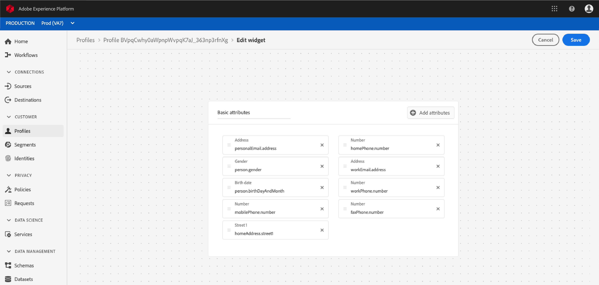

# [!DNL Real-time Customer Profile]-Detailanpassung {#profile-detail-customization}

In der Benutzeroberfläche von Adobe Experience Platform können Sie [!DNL Real-time Customer Profile]-Daten in Form von Kundenprofilen anzeigen und damit interagieren. Die in der Benutzeroberfläche angezeigten Profilinformationen wurden aus mehreren Profilfragmenten zusammengeführt, um für jeden einzelnen Kunden eine einzige Ansicht zu erstellen. Dazu gehören Details wie grundlegende Attribute, verknüpfte Identitäten und Kanalvoreinstellungen. Die in Profilen angezeigten Standardfelder können auch auf Organisationsebene geändert werden, um die bevorzugten [!DNL Profile]-Attribute anzuzeigen. Dieses Handbuch enthält schrittweise Anweisungen zum Anpassen der Darstellung von [!DNL Profile]-Daten in der Platform-Benutzeroberfläche.

Eine vollständige Anleitung zur Benutzeroberfläche &quot;Profile&quot;finden Sie im [Profil-UI-Handbuch](user-guide.md).

## Karten neu anordnen und Größe ändern {#reorder-and-resize-cards}

Im Tab **[!UICONTROL Detail]** des Kundenprofils können Sie **[!UICONTROL Dashboard ändern]** auswählen, um die Größe vorhandener Karten zu ändern und neu anzuordnen.

Nachdem Sie sich entschieden haben, das Dashboard zu ändern, können Sie die Karten neu anordnen, indem Sie den Kartentitel auswählen und die Karten in die gewünschte Reihenfolge ziehen. Sie können die Größe einer Karte auch ändern, indem Sie das Winkelsymbol in der rechten unteren Ecke der Karte (`⌟`) auswählen und die Karte auf die gewünschte Größe ziehen. In diesem Beispiel wird die Größe der Karte **[!UICONTROL Grundlegende Attribute]** geändert.

Die ausgewählte Karte passt sich der gewünschten Größe an und die umliegenden Karten werden dynamisch neu positioniert. Dies kann dazu führen, dass einige Karten in zusätzliche Zeilen verschoben werden, sodass Sie nach unten scrollen müssen, um alle Karten zu sehen. Wenn beispielsweise die Karte &quot;[!UICONTROL Grundlegende Attribute]&quot;in der Größe angepasst wird, ist die Karte &quot;[!UICONTROL Verknüpfte Identitäten]&quot;nicht mehr in der obersten Zeile sichtbar und erscheint nun in einer neuen zweiten Zeile im Profil (nicht angezeigt). Um die Karte &quot;[!UICONTROL Verknüpfte Identitäten]&quot;in die oberste Zeile zurückzugeben, können Sie sie per Drag-and-Drop an die aktuelle Position der Karte &quot;[!UICONTROL Kanalvoreinstellungen]&quot;ziehen.

## Bearbeiten und Entfernen von Karten

Neben der Größenanpassung und Neuordnung von Karten können Sie den Inhalt bestimmter Karten bearbeiten und einige Karten vollständig aus dem Dashboard entfernen. Wählen Sie die Auslassungspunkte (`...`) in der oberen rechten Ecke der Karte aus, um sie zu bearbeiten oder zu entfernen. Dadurch wird ein Dropdown-Menü mit Optionen zum Bearbeiten oder Entfernen der Karte geöffnet, je nach den Eigenschaften der ausgewählten Karte.

>[!NOTE]
>
>Nicht alle Karten können bearbeitet oder entfernt werden. Dies liegt daran, dass einige Karten schreibgeschützte oder erforderliche Informationen enthalten. Wenn eine Karte keine Auslassungspunkte in der oberen rechten Ecke aufweist, enthält sie schreibgeschützte UND erforderliche Informationen und kann weder bearbeitet noch entfernt werden. Wenn eine Karte in der Ecke Ellipsen aufweist und nur eine Option zum Entfernen der Karte angezeigt wird, sind die Karteninformationen schreibgeschützt und können nicht bearbeitet werden.

Wählen Sie **[!UICONTROL Bearbeiten]** im Dropdown-Menü aus, um den Arbeitsbereich **[!UICONTROL Widget bearbeiten]** zu öffnen. Dort können Sie den Kartentitel aktualisieren, die sichtbaren Attribute neu anordnen oder entfernen oder mithilfe der Schaltfläche **[!UICONTROL Attribute hinzufügen]** weitere Attribute hinzufügen.

## Hinzufügen von Attributen {#add-attributes}

Wählen Sie im Bildschirm **[!UICONTROL Widget bearbeiten]** die Option **[!UICONTROL Attribute hinzufügen]** in der oberen rechten Ecke der Karte aus, um dieser Karte Attribute hinzuzufügen.

Wenn das Dialogfeld **[!UICONTROL Vereinigungsschema-Feld auswählen]** geöffnet wird, wird auf der linken Seite des Dialogfelds das vollständige Vereinigungsschema [!UICONTROL XDM Individual Profile] angezeigt, wobei die Felder darunter verschachtelt sind. Weiterführende Informationen zu Vereinigungsschemata finden Sie im Abschnitt [Vereinigungsschemas des [!DNL Profile] Benutzerhandbuchs](user-guide.md#union-schema).

Im Abschnitt **[!UICONTROL Ausgewählte Attribute]** auf der rechten Seite des Dialogfelds werden die Attribute angezeigt, die derzeit in der Karte enthalten sind, die Sie bearbeiten. Sie können Attribute auch hier entfernen und neu anordnen. Es werden die Gesamtzahl der ausgewählten Attribute sowie die maximale Anzahl der Attribute (20) angezeigt, die einer einzelnen Karte hinzugefügt werden können.

Sie können eines der verfügbaren Vereinigungsschemafelder auswählen, um die Attribute auf der Karte anzupassen, die Sie bearbeiten. Ausgewählte Felder werden mit einem Häkchen neben ihnen angezeigt und automatisch zur Liste der ausgewählten Attribute hinzugefügt. Nachdem Sie alle Attribute hinzugefügt haben, die Sie auf der Karte angezeigt haben möchten, wählen Sie **[!UICONTROL Wählen Sie]** aus, um zum Bildschirm **[!UICONTROL Widget bearbeiten]** zurückzukehren.

Wenn Sie zum Bildschirm **[!UICONTROL Widget bearbeiten]** zurückkehren, sollte die Liste der Attribute auf der Karte jetzt aktualisiert werden, um Ihre Auswahl widerzuspiegeln. Sie können die Kartenattribute dennoch entfernen oder neu anordnen oder den Kartentitel nach Bedarf bearbeiten. Nachdem die Änderungen abgeschlossen sind, wählen Sie **[!UICONTROL Speichern]** aus, um Ihre Änderungen zu speichern.

Nach dem Speichern kehren Sie zum Tab **[!UICONTROL Detail]** zurück, auf dem die aktualisierte Karte und Attribute angezeigt werden.

## Neue Karte hinzufügen {#add-a-new-card}

Um das Erscheinungsbild von Profilen innerhalb von Experience Platform weiter anzupassen, können Sie neue Karten zum Dashboard hinzufügen und die Attribute auswählen, die auf diesen Karten angezeigt werden sollen. Wählen Sie zunächst **[!UICONTROL Dashboard ändern]** auf der Registerkarte **[!UICONTROL Detail]** aus.

Wählen Sie dann **[!UICONTROL Widget]** in der oberen linken Ecke des Dashboards aus.

Wenn Sie eine neue Karte hinzufügen, wird der Bildschirm **[!UICONTROL Widget bearbeiten]** geöffnet. Hier können Sie einen Titel für die neue Karte angeben und die Attribute auswählen, die die Karte anzeigen soll. Um der Karte Attribute hinzuzufügen, wählen Sie **[!UICONTROL Attribute hinzufügen]** aus.

Wenn das Dialogfeld **[!UICONTROL Vereinigungsschema auswählen]** geöffnet wird, zeigt die linke Seite des Dialogfelds das vollständige Vereinigungsschema [!UICONTROL XDM Individual Profile] und der Abschnitt **[!UICONTROL Ausgewählte Attribute]** auf der rechten Seite des Dialogfelds zeigt die Attribute an, die Sie für Ihre Karte auswählen. Weitere Informationen zum Hinzufügen von Attributen finden Sie im Abschnitt [zum Hinzufügen von Attributen](#add-attributes), der zuvor in diesem Dokument angezeigt wird.

Es werden die Gesamtzahl der ausgewählten Attribute sowie die maximale Anzahl der Attribute (20) angezeigt, die einer einzelnen Karte hinzugefügt werden können. Sie können die ausgewählten Attribute auch aus diesem Bildschirm entfernen und neu anordnen. Nachdem Sie alle Attribute hinzugefügt haben, die auf der Karte angezeigt werden sollen, wählen Sie **[!UICONTROL Wählen Sie]** aus, um zum Bildschirm **[!UICONTROL Widget bearbeiten]** zurückzukehren.

Wenn Sie zum Bildschirm **[!UICONTROL Widget bearbeiten]** zurückkehren, sollte die Liste der Attribute auf der Karte Ihre Optionen aus dem vorherigen Bildschirm widerspiegeln. Sie können Kartenattribute nach Bedarf auch neu anordnen und entfernen.

Um Ihre neue Karte zu speichern, müssen Sie zunächst einen **[!UICONTROL Kartentitel]** angeben, dann können Sie **[!UICONTROL Speichern]** auswählen und den Vorgang zur Kartenerstellung abschließen.

Nach dem Speichern kehren Sie zum Tab **[!UICONTROL Detail]** zurück, auf dem Ihre neue Karte und Attribute sichtbar sind.

## Standardkarten wiederherstellen

Wenn Sie sich entscheiden, Standardkarten wiederherzustellen, die inzwischen entfernt wurden, können Sie dies schnell und einfach tun. Wählen Sie zunächst **[!UICONTROL Dashboard ändern]** und dann **[!UICONTROL Standardkarten wiederherstellen]** aus. Sobald die Standardkarten sichtbar sind, können Sie **[!UICONTROL Speichern]** auswählen, um Ihre Änderungen zu speichern, oder **[!UICONTROL Abbrechen]** auswählen, wenn Sie die Standardkarten nicht wiederherstellen möchten.

## Nächste Schritte

Durch Befolgen dieses Dokuments sollten Sie jetzt in der Lage sein, die Profilansicht für Ihr Unternehmen zu aktualisieren, einschließlich Hinzufügen und Entfernen von Karten, Bearbeiten von Kartendetails und -attributen sowie Neuanordnen und Größenanpassung von Karten. Weitere Informationen zum Arbeiten mit [!DNL Profile]-Daten in der Experience Platform-Benutzeroberfläche finden Sie im [[!DNL Profile] Benutzerhandbuch](user-guide.md).
