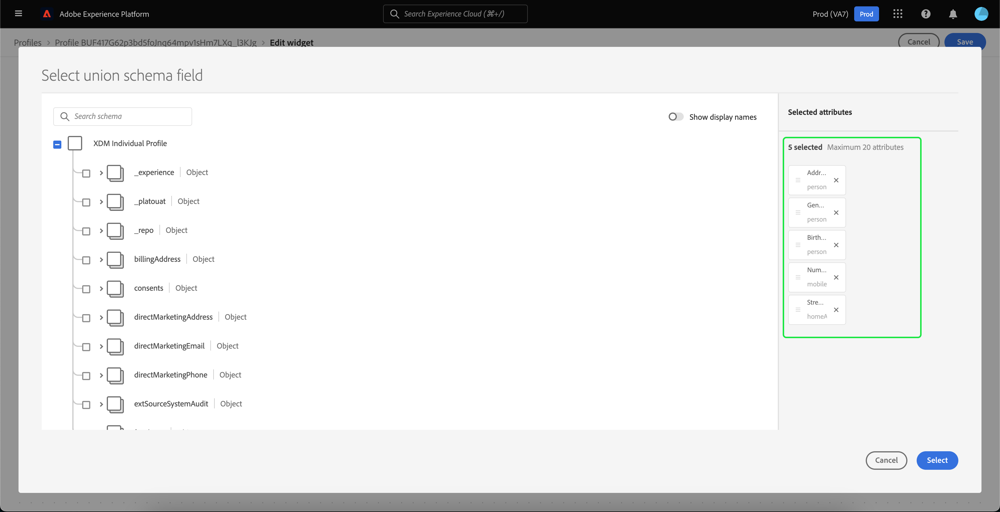
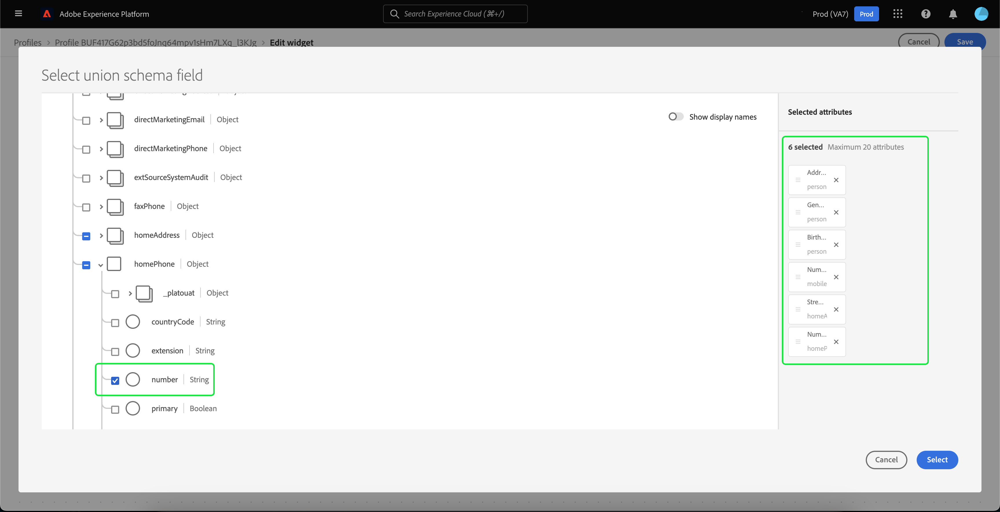
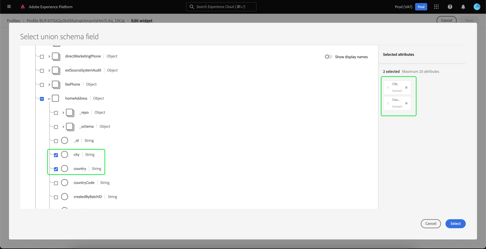

# [!DNL Real-Time Customer Profile]-Detailanpassung {#profile-detail-customization}

In der Benutzeroberfläche von Adobe Experience Platform können Sie [!DNL Real-Time Customer Profile] in Form von Kundenprofilen anzeigen und damit interagieren. Die in der Benutzeroberfläche angezeigten Profilinformationen wurden aus mehreren Profilfragmenten zusammengeführt, um eine einzige Ansicht jedes einzelnen Kunden zu erstellen. Dazu gehören Details wie grundlegende Attribute, verknüpfte Identitäten und Kanalvoreinstellungen. Die in Profilen angezeigten Standardfelder können auch auf Organisationsebene geändert werden, um die bevorzugten [!DNL Profile] anzuzeigen. Dieses Handbuch enthält Schritt-für-Schritt-Anweisungen zum Anpassen der Art und Weise, wie [!DNL Profile] Daten in der Platform-Benutzeroberfläche angezeigt werden.

Eine vollständige Anleitung zur Benutzeroberfläche Profile finden Sie im [Handbuch zur Benutzeroberfläche von Profilen](user-guide.md).

## Karten neu anordnen und ihre Größe ändern {#reorder-and-resize-cards}

Auf der Registerkarte **[!UICONTROL Detail]** des Kundenprofils können Sie **[!UICONTROL Profildetails anpassen]** auswählen, um die Größe vorhandener Karten zu ändern und neu anzuordnen.

Nachdem Sie sich entschieden haben, das Dashboard zu ändern, können Sie die Karten neu anordnen, indem Sie den Kartentitel auswählen und die Karten per Drag-and-Drop in die gewünschte Reihenfolge ziehen. Sie können die Größe einer Karte auch anpassen, indem Sie das Winkelsymbol in der rechten unteren Ecke der Karte (`⌟`) auswählen und die Karte auf die gewünschte Größe ziehen. In diesem Beispiel wird die Größe **[!UICONTROL Karte &quot;]** Attribute“ geändert.

Die ausgewählte Karte wird an die gewünschte Größe angepasst und die umgebenden Karten werden dynamisch neu positioniert. Dies kann dazu führen, dass einige Karten in zusätzliche Zeilen verschoben werden, sodass Sie nach unten scrollen müssen, um alle Karten zu sehen. Wenn beispielsweise die Größe der Karte &quot;[!UICONTROL Basisattribute]&quot; geändert wird, ist die Karte &quot;[!UICONTROL Verknüpfte Identitäten]&quot; nicht mehr in der oberen Zeile sichtbar und wird jetzt in einer neuen zweiten Zeile innerhalb des Profils angezeigt (nicht angezeigt). Um die Karte &quot;[!UICONTROL Verknüpfte Identitäten]&quot; in die oberste Zeile zurückzugeben, können Sie sie per Drag-and-Drop an die aktuelle Position der Karte &quot;[!UICONTROL Kanaleinstellungen] ziehen.

## Bearbeiten und Entfernen von Karten

Zusätzlich zur Größenanpassung und Neuanordnung von Karten können Sie auch den Inhalt bestimmter Karten bearbeiten und einige Karten vollständig aus dem Dashboard entfernen. Klicken Sie auf die Auslassungszeichen (`...`) in der oberen rechten Ecke der Karte, um sie zu bearbeiten oder zu entfernen. Dadurch wird eine Dropdown-Liste geöffnet, in der je nach den Eigenschaften der ausgewählten Karte Optionen zum Bearbeiten oder Entfernen der Karte verfügbar sind.

>[!NOTE]
>
>Nicht alle Karten können bearbeitet oder entfernt werden. Dies liegt daran, dass einige Karten schreibgeschützte oder erforderliche Informationen enthalten. Wenn eine Karte oben rechts keine Ellipsen aufweist, enthält sie schreibgeschützte UND erforderliche Informationen und kann weder bearbeitet noch entfernt werden. Wenn eine Karte Ellipsen in der Ecke hat und nur eine Option zum Entfernen der Karte angezeigt wird, sind die Karteninformationen schreibgeschützt und können nicht bearbeitet werden.

Wählen Sie **[!UICONTROL Bearbeiten]** in der Dropdown-Liste aus, um den Arbeitsbereich **[!UICONTROL Widget bearbeiten]** zu öffnen, in dem Sie den Kartentitel aktualisieren, die sichtbaren Attribute neu anordnen oder entfernen oder zusätzliche Attribute über die Schaltfläche **[!UICONTROL Attribute hinzufügen]** hinzufügen können.

## Attribute hinzufügen {#add-attributes}

Wählen Sie **[!UICONTROL Bildschirm]** Widget bearbeiten **[!UICONTROL oben rechts auf der Karte]** Attribute hinzufügen“, um Attribute zu dieser Karte hinzuzufügen.

Wenn das Dialogfeld **[!UICONTROL Vereinigungsschemafeld auswählen]** geöffnet wird, wird auf der linken Seite des Dialogfelds das vollständige Vereinigungsschema [!UICONTROL XDM Individual Profile] mit darunter verschachtelten Feldern angezeigt. Weiterführende Informationen zu Vereinigungsschemata finden Sie im [Vereinigungsschemata“ des  [!DNL Profile] -Benutzerhandbuchs](user-guide.md#union-schema).

Im **[!UICONTROL Ausgewählte Attribute]** auf der rechten Seite des Dialogfelds werden die Attribute angezeigt, die derzeit in der Karte enthalten sind, die Sie bearbeiten. Hier können Sie auch Attribute entfernen und neu anordnen. Es werden die Gesamtzahl der ausgewählten Attribute sowie die maximale Anzahl der Attribute (20) angezeigt, die einer einzelnen Karte hinzugefügt werden können.

Sie können jedes der verfügbaren Vereinigungsschemafelder auswählen, um die Attribute auf der Karte, die Sie bearbeiten, anzupassen. Bei der Auswahl der Felder können Sie entweder den Dateinamen oder den Anzeigenamen anzeigen lassen. Um zwischen diesen beiden Displays zu wechseln, wählen Sie den Umschalter **[!UICONTROL Anzeigenamen anzeigen]**.

![Der Umschalter [!UICONTROL Anzeigenamen anzeigen] ist auf der Seite „Profildetails“ hervorgehoben.](../images/profile-customization/show-display-names.png)

Ausgewählte Felder werden mit einem Häkchen neben den Feldern angezeigt und automatisch zur Liste der ausgewählten Attribute hinzugefügt. Nachdem Sie alle Attribute hinzugefügt haben, die auf der Karte angezeigt werden sollen, wählen Sie **[!UICONTROL Auswählen]** aus, um zum Bildschirm **[!UICONTROL Widget bearbeiten]** zurückzukehren.

Wenn Sie zum Bildschirm **[!UICONTROL Widget bearbeiten]** zurückkehren, sollte die Liste der Attribute auf der Karte nun aktualisiert werden, um Ihre Auswahl widerzuspiegeln. Sie können die Kartenattribute weiterhin entfernen oder neu anordnen oder den Kartentitel nach Bedarf bearbeiten. Nachdem die Änderungen abgeschlossen sind, klicken Sie auf **[!UICONTROL Speichern]**, um die Änderungen zu speichern.

Nach dem Speichern kehren Sie zur Registerkarte **[!UICONTROL Detail]** zurück, auf der die aktualisierte Karte und die Attribute sichtbar sind.

## Neue Karte hinzufügen {#add-a-new-card}

Um das Erscheinungsbild von Profilen auf Experience Platform weiter anzupassen, können Sie dem Dashboard neue Karten hinzufügen und die Attribute auswählen, die auf diesen Karten angezeigt werden sollen. Wählen Sie zunächst **[!UICONTROL Dashboard ändern]** auf der Registerkarte **[!UICONTROL Detail]** aus.

Wählen Sie als Nächstes **[!UICONTROL Widget hinzufügen]** in der oberen linken Ecke des Dashboards aus.

Wenn Sie eine neue Karte hinzufügen möchten, wird der Bildschirm **[!UICONTROL Widget bearbeiten]** geöffnet, auf dem Sie einen Titel für die neue Karte angeben und die Attribute auswählen können, die die Karte anzeigen soll. Um Attribute zur Karte hinzuzufügen, wählen Sie **[!UICONTROL Attribute hinzufügen]** aus.

Wenn das Dialogfeld **[!UICONTROL Vereinigungsschemafeld auswählen]** geöffnet wird, zeigt die linke Seite des Dialogfelds das vollständige [!UICONTROL XDM-Kontaktprofil] Vereinigungsschema an, und der Abschnitt **[!UICONTROL Ausgewählte Attribute]** auf der rechten Seite des Dialogfelds zeigt die Attribute an, die Sie für Ihre Karte auswählen. Weitere Informationen zum Hinzufügen von Attributen finden Sie im [Abschnitt zum Hinzufügen von Attributen](#add-attributes) der weiter oben in diesem Dokument aufgeführt wird.

Es werden die Gesamtzahl der ausgewählten Attribute sowie die maximale Anzahl der Attribute (20) angezeigt, die einer einzelnen Karte hinzugefügt werden können. Sie können Ihre ausgewählten Attribute auch aus diesem Bildschirm entfernen und neu anordnen. Nachdem Sie alle Attribute hinzugefügt haben, die auf der Karte angezeigt werden sollen, wählen Sie **[!UICONTROL Auswählen]** aus, um zum Bildschirm **[!UICONTROL Widget bearbeiten]** zurückzukehren.

Wenn Sie zum Bildschirm **[!UICONTROL Widget bearbeiten]** zurückkehren, sollte die Liste der Attribute auf der Karte Ihre Auswahl aus dem vorherigen Bildschirm widerspiegeln. Bei Bedarf können Sie auch die Kartenattribute neu anordnen und entfernen.

Um Ihre neue Karte zu speichern, müssen Sie zunächst einen **[!UICONTROL Kartentitel]** angeben. Anschließend können Sie **[!UICONTROL Speichern]** auswählen und den Kartenerstellungsprozess abschließen.

Nach dem Speichern kehren Sie zur Registerkarte **[!UICONTROL Detail]** zurück, auf der Ihre neue Karte und Ihre neuen Attribute sichtbar sind.

## Standardkarten wiederherstellen

Wenn Sie sich irgendwann entscheiden, dass Sie die Standardkarten wiederherstellen möchten, die seitdem entfernt wurden, können Sie dies schnell und einfach tun. Wählen Sie zunächst **[!UICONTROL Dashboard ändern]** und dann **[!UICONTROL Standardkarten wiederherstellen]** aus. Sobald die Standardkarten sichtbar sind, können Sie auf **[!UICONTROL Speichern]** klicken, um Ihre Änderungen zu speichern, oder auf **[!UICONTROL Abbrechen]**, wenn Sie die Standardkarten nicht wiederherstellen möchten.

## Nächste Schritte

Wenn Sie dieses Dokument gelesen haben, sollten Sie in der Lage sein, die Profilansicht für Ihre Organisation zu aktualisieren, einschließlich des Hinzufügens und Entfernens von Karten, des Bearbeitens von Kartendetails und -attributen und der Neuanordnung und Größenanpassung von Karten. Weitere Informationen zum Arbeiten mit [!DNL Profile] in der Experience Platform-Benutzeroberfläche finden Sie im [[!DNL Profile] Benutzerhandbuch](user-guide.md).
