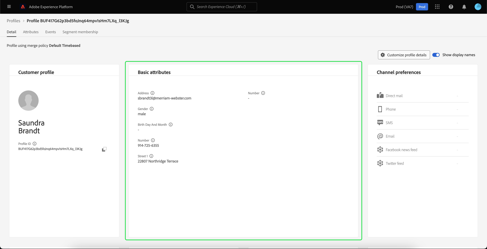

# [!DNL Real-Time Customer Profile]-Detailanpassung {#profile-detail-customization}

In der Benutzeroberfläche von Adobe Experience Platform können Sie [!DNL Real-Time Customer Profile] Daten in Form von Kundenprofilen. Die in der Benutzeroberfläche angezeigten Profilinformationen wurden aus mehreren Profilfragmenten zusammengeführt, um für jeden einzelnen Kunden eine einzige Ansicht zu erstellen. Dazu gehören Details wie grundlegende Attribute, verknüpfte Identitäten und Kanalvoreinstellungen. Die in Profilen angezeigten Standardfelder können auch auf Organisationsebene geändert werden, um die bevorzugten Felder anzuzeigen [!DNL Profile] -Attribute. Dieses Handbuch enthält schrittweise Anweisungen zum Anpassen der [!DNL Profile] -Daten werden in der Platform-Benutzeroberfläche angezeigt.

Eine vollständige Anleitung zur Benutzeroberfläche &quot;Profile&quot;finden Sie unter [Handbuch zur Profil-UI](user-guide.md).

## Karten neu anordnen und Größe ändern {#reorder-and-resize-cards}

Aus dem **[!UICONTROL Detail]** im Tab des Kundenprofils können Sie **[!UICONTROL Profildetails anpassen]** um die Größe der vorhandenen Karten zu ändern und neu anzuordnen.

Nachdem Sie sich entschieden haben, das Dashboard zu ändern, können Sie die Karten neu anordnen, indem Sie den Kartentitel auswählen und die Karten in die gewünschte Reihenfolge ziehen. Sie können die Größe einer Karte auch ändern, indem Sie das Winkelsymbol in der rechten unteren Ecke der Karte (`⌟`) und ziehen Sie die Karte in die gewünschte Größe. In diesem Beispiel wird die **[!UICONTROL Grundlegende Attribute]** wird die Größe der Karte geändert.

Die ausgewählte Karte passt sich der gewünschten Größe an und die umliegenden Karten werden dynamisch neu positioniert. Dies kann dazu führen, dass einige Karten in zusätzliche Zeilen verschoben werden, sodass Sie nach unten scrollen müssen, um alle Karten zu sehen. Beispiel: Wenn die Variable[!UICONTROL Grundlegende Attribute]&quot; wird die Größe der Karte geändert.[!UICONTROL Verknüpfte Identitäten]Die Karte ist nicht mehr in der oberen Zeile sichtbar und wird nun in einer neuen zweiten Zeile im Profil angezeigt (nicht angezeigt). So geben Sie &quot;[!UICONTROL Verknüpfte Identitäten]&quot; in die oberste Zeile, können Sie sie an die aktuelle Position des &quot;[!UICONTROL Kanaleinstellungen]&quot;.

## Bearbeiten und Entfernen von Karten

Neben der Größenanpassung und Neuordnung von Karten können Sie den Inhalt bestimmter Karten bearbeiten und einige Karten vollständig aus dem Dashboard entfernen. Wählen Sie die Auslassungszeichen (`...`) in der oberen rechten Ecke der Karte, um sie zu bearbeiten oder zu entfernen. Dadurch wird ein Dropdown-Menü mit Optionen zum Bearbeiten oder Entfernen der Karte geöffnet, je nach den Eigenschaften der ausgewählten Karte.

>[!NOTE]
>
>Nicht alle Karten können bearbeitet oder entfernt werden. Dies liegt daran, dass einige Karten schreibgeschützte oder erforderliche Informationen enthalten. Wenn eine Karte keine Auslassungspunkte in der oberen rechten Ecke aufweist, enthält sie schreibgeschützte UND erforderliche Informationen und kann weder bearbeitet noch entfernt werden. Wenn eine Karte in der Ecke Ellipsen aufweist und nur eine Option zum Entfernen der Karte angezeigt wird, sind die Karteninformationen schreibgeschützt und können nicht bearbeitet werden.

Auswählen **[!UICONTROL Bearbeiten]** in der Dropdown-Liste, um die **[!UICONTROL Widget bearbeiten]** Arbeitsbereich, in dem Sie den Kartentitel aktualisieren, die sichtbaren Attribute neu anordnen oder entfernen oder zusätzliche Attribute mithilfe der **[!UICONTROL Hinzufügen von Attributen]** Schaltfläche.

## Hinzufügen von Attributen {#add-attributes}

Aus dem **[!UICONTROL Widget bearbeiten]** Bildschirm, wählen Sie **[!UICONTROL Hinzufügen von Attributen]** in der oberen rechten Ecke der Karte, um mit dem Hinzufügen von Attributen zu dieser Karte zu beginnen.

Wenn die **[!UICONTROL Feld Vereinigungsschema auswählen]** wird geöffnet. Auf der linken Seite des Dialogfelds wird die vollständige [!UICONTROL XDM Individual Profile] Vereinigungsschema mit darunter verschachtelten Feldern. Weiterführende Informationen zu Vereinigungsschemata finden Sie im Abschnitt [Vereinigungsschemas -Abschnitt der [!DNL Profile] Benutzerhandbuch](user-guide.md#union-schema).

Die **[!UICONTROL Ausgewählte Attribute]** auf der rechten Seite des Dialogfelds werden die Attribute angezeigt, die derzeit in der Karte enthalten sind, die Sie bearbeiten. Sie können Attribute auch hier entfernen und neu anordnen. Es werden die Gesamtzahl der ausgewählten Attribute sowie die maximale Anzahl der Attribute (20) angezeigt, die einer einzelnen Karte hinzugefügt werden können.

Sie können eines der verfügbaren Vereinigungsschemafelder auswählen, um die Attribute auf der Karte anzupassen, die Sie bearbeiten. Ausgewählte Felder werden mit einem Häkchen neben ihnen angezeigt und automatisch zur Liste der ausgewählten Attribute hinzugefügt. Nachdem Sie alle Attribute hinzugefügt haben, die Sie auf der Karte angezeigt haben möchten, wählen Sie **[!UICONTROL Auswählen]** , um zur **[!UICONTROL Widget bearbeiten]** angezeigt.

Wenn Sie zum **[!UICONTROL Widget bearbeiten]** angezeigt, sollte die Liste der Attribute auf der Karte jetzt aktualisiert werden, um Ihre Auswahl widerzuspiegeln. Sie können die Kartenattribute dennoch entfernen oder neu anordnen oder den Kartentitel nach Bedarf bearbeiten. Nachdem Sie die Änderungen abgeschlossen haben, wählen Sie **[!UICONTROL Speichern]** , um Ihre Änderungen zu speichern.

Nach dem Speichern kehren Sie zum **[!UICONTROL Detail]** Registerkarte, auf der die aktualisierte Karte und Attribute angezeigt werden.

## Neue Karte hinzufügen {#add-a-new-card}

Um das Erscheinungsbild von Profilen innerhalb von Experience Platform weiter anzupassen, können Sie neue Karten zum Dashboard hinzufügen und die Attribute auswählen, die auf diesen Karten angezeigt werden sollen. Wählen Sie zunächst **[!UICONTROL Dashboard ändern]** auf **[!UICONTROL Detail]** Registerkarte.

Wählen Sie als Nächstes **[!UICONTROL Widget hinzufügen]** in der oberen linken Ecke des Dashboards.

Wenn Sie eine neue Karte hinzufügen möchten, wird die **[!UICONTROL Widget bearbeiten]** -Bildschirm, auf dem Sie einen Titel für die neue Karte angeben und die Attribute auswählen können, die die Karte anzeigen soll. Um der Karte Attribute hinzuzufügen, wählen Sie **[!UICONTROL Hinzufügen von Attributen]**.

Wenn die **[!UICONTROL Feld Vereinigungsschema auswählen]** wird geöffnet. Auf der linken Seite des Dialogfelds wird die vollständige [!UICONTROL XDM Individual Profile] Vereinigungsschema und **[!UICONTROL Ausgewählte Attribute]** auf der rechten Seite des Dialogfelds werden die Attribute angezeigt, die Sie für Ihre Karte auswählen. Weitere Informationen zum Hinzufügen von Attributen finden Sie unter [Abschnitt zum Hinzufügen von Attributen](#add-attributes) , die zuvor in diesem Dokument angezeigt wird.

Es werden die Gesamtzahl der ausgewählten Attribute sowie die maximale Anzahl der Attribute (20) angezeigt, die einer einzelnen Karte hinzugefügt werden können. Sie können die ausgewählten Attribute auch aus diesem Bildschirm entfernen und neu anordnen. Nachdem Sie alle Attribute hinzugefügt haben, die auf der Karte angezeigt werden sollen, wählen Sie **[!UICONTROL Auswählen]** , um zur **[!UICONTROL Widget bearbeiten]** angezeigt.

Wenn Sie zum **[!UICONTROL Widget bearbeiten]** angezeigt, sollte die Liste der Attribute auf der Karte Ihre Optionen aus dem vorherigen Bildschirm widerspiegeln. Sie können Kartenattribute nach Bedarf auch neu anordnen und entfernen.

Um Ihre neue Karte zu speichern, müssen Sie zunächst eine **[!UICONTROL Kartentitel]**, können Sie **[!UICONTROL Speichern]** und schließen Sie die Kartenerstellung ab.

Nach dem Speichern kehren Sie zum **[!UICONTROL Detail]** Registerkarte, auf der Ihre neue Karte und Attribute sichtbar sind.

## Standardkarten wiederherstellen

Wenn Sie sich entscheiden, Standardkarten wiederherzustellen, die inzwischen entfernt wurden, können Sie dies schnell und einfach tun. Wählen Sie zuerst **[!UICONTROL Dashboard ändern]**, wählen Sie **[!UICONTROL Standardkarten wiederherstellen]**. Sobald die Standardkarten sichtbar sind, können Sie **[!UICONTROL Speichern]** , um Ihre Änderungen zu speichern oder **[!UICONTROL Abbrechen]** wenn Sie die Standardkarten nicht wiederherstellen möchten.

## Nächste Schritte

Durch Befolgen dieses Dokuments sollten Sie jetzt in der Lage sein, die Profilansicht für Ihr Unternehmen zu aktualisieren, einschließlich Hinzufügen und Entfernen von Karten, Bearbeiten von Kartendetails und -attributen sowie Neuanordnen und Größenanpassung von Karten. Weitere Informationen zum Arbeiten mit [!DNL Profile] Daten in der Experience Platform-Benutzeroberfläche, siehe [[!DNL Profile] Benutzerhandbuch](user-guide.md).
